# Volume 1: Core Java
# Chapter 5: JVM Internals

---

## Table of Contents
1. JVM Memory Architecture
2. Garbage Collection
3. Class Loading
4. JIT Compiler
5. Practical Diagnostics
6. JVM Memory Cheat Sheet

---

> **How to read this chapter:** Each topic has three layers.
> - **The Idea** — start here, no prior knowledge needed.
> - **How It Works** — the real mechanism, patterns, and tradeoffs.
> - **Interview Lens** — what interviewers actually probe.
>
> Beginners: read all three layers top to bottom.
> SDE2/Senior: skim "The Idea", focus on "How It Works" and "Interview Lens".

---

## Topic 1: JVM Memory Architecture

**Difficulty:** Medium | **Frequency:** High | **Companies:** Amazon, Google, Goldman Sachs, Morgan Stanley

---



### The Idea

Think of the JVM as a well-organized office building. The **Heap** is the open floor plan where all actual work objects live — shared, accessible by everyone, and regularly tidied up by the garbage collector. The **Stack** is each employee's private desk — only they use it, it holds just what they need right now (current method's variables, where to return when done), and it clears automatically when they finish a task.

Beyond those two, the JVM maintains a few specialist areas. **Metaspace** is the building's filing cabinet: it holds the blueprints (class definitions, method bytecode) that describe how objects should be built — not the objects themselves. The **Code Cache** stores the optimized shortcut procedures the JIT compiler has compiled for frequently called methods. And each thread carries a tiny **PC Register**, a sticky note that says "I'm currently executing instruction N."

The key insight for interviews: when you write `new Object()`, the object lands on the **Heap**. The reference variable pointing to it lives on the **Stack**. The class structure describing what an Object is lives in **Metaspace**. Three different areas, one line of code.

---

### How It Works

**Memory layout at a glance:**

```
JVM Process Memory
┌─────────────────────────────────────────────────────────────┐
│  JVM Heap (GC-managed)                                      │
│  ┌──────────────────────────┬──────────────────────────┐    │
│  │   Young Generation       │   Old Generation         │    │
│  │  ┌────────┬──────┬──────┐│  ┌──────────────────┐   │    │
│  │  │ Eden   │  S0  │  S1  ││  │   Tenured / Old  │   │    │
│  │  │(new    │(from)│ (to) ││  │   (long-lived)   │   │    │
│  │  │objects)│      │      ││  └──────────────────┘   │    │
│  │  └────────┴──────┴──────┘│                          │    │
│  └──────────────────────────┴──────────────────────────┘    │
│                                                             │
│  Native Memory (outside heap)                               │
│  ┌──────────────────┐  ┌──────────────┐                     │
│  │   Metaspace      │  │  Code Cache  │                     │
│  │  (class metadata)│  │ (JIT output) │                     │
│  └──────────────────┘  └──────────────┘                     │
│                                                             │
│  Per-Thread (thread-local)                                  │
│  ┌──────────────────┐  ┌──────────────┐                     │
│  │   JVM Stack      │  │  PC Register │                     │
│  │  (method frames) │  │ (instr ptr)  │                     │
│  └──────────────────┘  └──────────────┘                     │
└─────────────────────────────────────────────────────────────┘
```

**Memory area summary:**

| Memory Area | Stored Content | Thread Scope | Managed By |
|---|---|---|---|
| Heap (Eden + Survivors) | New object instances, arrays | Shared | GC (Minor GC) |
| Heap (Old Gen) | Long-lived objects | Shared | GC (Major/Full GC) |
| JVM Stack | Method frames: local vars, operand stack, return address | Thread-local | JVM (auto-pop on return) |
| Metaspace | Class structures, method bytecode, runtime constant pool | Shared | JVM + OS (native memory) |
| Code Cache | JIT-compiled native machine code | Shared | JIT compiler |
| Native Method Stack | Frames for native (C/C++) methods via JNI | Thread-local | OS |
| PC Register | Current bytecode instruction address | Thread-local | JVM |

**Object lifecycle pseudocode:**

```
ALLOCATE new object:
  → place in Eden (heap, young gen)

Eden fills up:
  → trigger Minor GC
  → scan reachable objects (GC roots: stack refs, static refs)
  → copy live objects to empty Survivor space (S0 or S1)
  → increment age counter on each survivor
  → if age >= MaxTenuringThreshold (default 15):
      → promote to Old Generation

Old Generation fills up:
  → trigger Major GC or Full GC (stop-the-world pause)

Method call:
  → push new stack frame onto thread's JVM stack
  → frame holds: local variable array, operand stack, frame data

Method returns:
  → pop frame from stack (space immediately reclaimed)
  → execution resumes in caller's frame

Class loaded:
  → store class metadata in Metaspace (native memory)
  → ClassLoader becomes unreachable → Metaspace reclaims metadata
```

**The single most interview-critical gotcha — where static variables actually live:**

```java
public class StaticMemoryDemo {

    // The *reference* CACHE is stored in Metaspace (as part of the Class structure).
    // The *object* it points to — the ArrayList — lives on the Heap.
    // Before Java 8: both were in PermGen. Java 8+: object is on heap.
    private static final List<String> CACHE = new ArrayList<>();

    public void processRequest(String data) {
        // 'data' reference: lives in this method's stack frame (thread-local)
        // The String object 'data' points to: lives on the heap
        String processed = data.toUpperCase(); // new String object → heap
        CACHE.add(processed);                  // reference added to heap object
    }

    // Deep recursion → each call pushes a NEW frame → exhausts stack
    public static int recursiveSum(int n) {
        if (n == 0) return 0;
        return n + recursiveSum(n - 1); // StackOverflowError around n=10,000+
    }

    // Iterative equivalent uses O(1) stack space — one frame, reused
    public static int iterativeSum(int n) {
        int result = 0;
        while (n > 0) result += n--;
        return result;
    }
    // NOTE: Java does NOT optimize tail recursion. Even tail-recursive forms
    // push a new frame on each call — no JVM mandate to optimize tail calls.
}
```

---

### Interview Lens

> **How to use this section:** Each question below is self-contained. You can read just this section the night before an interview and walk in prepared. Every concept referenced is explained inline — no need to flip back.

> *Tip: In a real interview, lead with the one-line answer first. Pause. Expand only if the interviewer nods or probes.*

---

#### Q1 — Concept Check

**"Walk me through the JVM memory areas. What lives where?"**

**One-line answer:** The JVM has six memory areas — Heap (objects), Stack (method frames), Metaspace (class metadata), Code Cache (JIT output), Native Method Stack (JNI frames), and PC Register (instruction pointer).

**Full answer to give in an interview:**

> The JVM divides memory into six runtime data areas. The **Heap** is where all object instances and arrays live — it's shared across threads and managed by the garbage collector. Whenever I write `new Foo()`, that object goes on the heap. The **JVM Stack** is per-thread: every method call pushes a frame holding local variables, the operand stack for bytecode execution, and a return address. When the method returns, the frame pops — no GC needed. **Metaspace** holds class metadata: the class structure, method bytecode, and runtime constant pool. It lives in native memory outside the JVM heap and replaced PermGen in Java 8. The **Code Cache** stores native machine code that the JIT compiler has produced from hot bytecode. The **PC Register** is a tiny per-thread pointer that tracks which bytecode instruction is currently executing. For native methods, the PC Register is undefined — the native frame is managed by the OS on the **Native Method Stack** instead.

*Lead with the table mentally — six areas, key property of each. The interviewer usually homes in on Heap vs. Stack vs. Metaspace. Be ready to go deeper on any one.*

**Gotcha follow-up they'll ask:** *"Where do static variables live?"*

> Static variable *references* are stored in the class structure in Metaspace. But the actual object the reference points to lives on the Heap — specifically in the heap-resident mirror of the `Class` object. Before Java 8 the object was in PermGen. Confusing the reference with the object is the most common wrong answer here.

---

#### Q2 — Concept Check

**"What is the Young Generation and how does object promotion work?"**

**One-line answer:** New objects go to Eden; Minor GC copies survivors to a Survivor space; objects that survive enough GC cycles are promoted to Old Generation.

**Full answer to give in an interview:**

> The heap is split into Young Generation and Old Generation. Young Gen has three areas: **Eden** and two **Survivor spaces** (S0 and S1). All new objects are allocated in Eden — it's fast, just a pointer bump. When Eden fills, a **Minor GC** fires. It scans for reachable objects (those still referenced from stack variables, static fields, etc.), copies them into the currently empty Survivor space, and discards the dead ones. Each survivor's age counter increments. Once an object's age hits the tenuring threshold — `MaxTenuringThreshold`, default 15 — it's promoted to Old Generation. Two Survivor spaces exist specifically to eliminate fragmentation: one is always empty, and live objects are compacted into it by copying. When Old Generation fills, a **Major GC or Full GC** runs — this is the stop-the-world pause you want to avoid in latency-sensitive systems. The whole design exploits the **generational hypothesis**: most objects die young, so collecting only Young Gen frequently is far cheaper than scanning the whole heap.

*If they ask about G1 GC specifically: G1 still has logical generations but uses a region-based physical layout. Humongous objects — larger than 50% of a G1 region — bypass Young Gen and go directly to Humongous regions.*

**Gotcha follow-up they'll ask:** *"What is premature promotion and why is it bad?"*

> Premature promotion happens when the Survivor space is too small to hold all survivors from a Minor GC. The JVM has no choice but to promote those objects to Old Generation before they reach the tenuring threshold. The problem: those objects are actually short-lived but now sit in Old Gen, filling it up. This causes more frequent Major GCs with their expensive stop-the-world pauses. Fix: increase Survivor space size with `-XX:SurvivorRatio` or tune `-XX:MaxTenuringThreshold`.

---

#### Q3 — Tradeoff Question

**"Why does deep recursion cause StackOverflowError, and how would you fix it in production?"**

**One-line answer:** Each method call pushes a new stack frame; deep recursion exceeds the thread stack's fixed size (`-Xss`), throwing StackOverflowError.

**Full answer to give in an interview:**

> Every method call pushes a **stack frame** onto the thread's JVM stack. A frame holds the local variable array, the operand stack for bytecode computation, and the return address. With deep recursion — say a recursive JSON parser hitting 500 nesting levels — each level adds a frame, and the stack has a fixed size per thread controlled by `-Xss` (default 512KB–1MB). When frames exhaust that space, the JVM throws `StackOverflowError`. The two production fixes I'd reach for: first, convert the recursion to iteration using an explicit stack data structure — a `Deque<Node>` on the heap has no practical depth limit. Second, if recursion is genuinely required, increase `-Xss`, but carefully: `-Xss256k` times 10,000 threads equals 2.5 GB in stack memory alone. One important nuance: Java does **not** optimize tail recursion. Even if a recursive call is the last thing in a method, the JVM still pushes a new frame — there is no tail-call optimization in the JVM spec.

*The interviewer wants to hear both the root cause and the practical fix. Tail-call optimization is a common follow-up trap.*

**Gotcha follow-up they'll ask:** *"Can you catch StackOverflowError?"*

> Yes — `StackOverflowError` is a `java.lang.Error` which extends `Throwable`, so it can be caught with `catch (StackOverflowError e)`. But catching it is almost never the right solution: by the time it is thrown, the JVM has already unwound the stack and you have very little stack space left to do anything useful in the catch block. The right fix is to avoid the deep recursion, not catch the error.

---

#### Q4 — Design Scenario

**"A Kubernetes pod running Spring Boot is getting OOM-killed despite -Xmx being set well within the container limit. What's going on?"**

**One-line answer:** `-Xmx` only caps the heap; Metaspace, Code Cache, and thread stacks all consume native memory outside the heap and can push total process memory over the container limit.

**Full answer to give in an interview:**

> This is a classic container memory trap. `-Xmx` caps the JVM heap, but the JVM process uses native memory for several other things: **Metaspace** stores class metadata and has no default cap — it grows until native memory is exhausted unless you set `-XX:MaxMetaspaceSize`. The **Code Cache** stores JIT-compiled native code (a few hundred MB in large apps). And each thread stack costs `-Xss` (default ~512KB) times the number of threads. A Spring Boot app using CGLIB for `@Transactional` and `@Cacheable` proxies, AOP aspects, and Hibernate enhancement generates hundreds of synthetic subclasses at startup — Metaspace can easily hit 500MB+ in large enterprise apps. The container's memory limit sees the whole process, not just the heap. The fix: set both `-Xmx` (heap cap) and `-XX:MaxMetaspaceSize` explicitly, add them together along with an estimate for Code Cache and thread stacks, and use that total as the container memory limit with a small buffer. In Java 11+ you can also set `-XX:MaxRAMPercentage` to let the JVM auto-size the heap relative to container memory.

*This answer demonstrates you understand JVM memory beyond just heap tuning — exactly what senior backend interviewers at financial firms and cloud companies probe for.*

**Gotcha follow-up they'll ask:** *"What does `-XX:MetaspaceSize` do, and is it the same as `-XX:MaxMetaspaceSize`?"*

> They are different. `-XX:MetaspaceSize` sets the initial committed size of Metaspace and acts as the threshold that triggers the first GC of dead classloaders when reached — it is not a cap. `-XX:MaxMetaspaceSize` is the hard cap; exceeding it throws `OutOfMemoryError: Metaspace`. Many developers set `-XX:MetaspaceSize` thinking it limits memory and are surprised when Metaspace keeps growing past it.

---

> **Common Mistake — Confusing static variable location:** Saying "static variables are stored in Metaspace" is half-right and half-wrong. The static *reference* (the field slot) is in the class structure in Metaspace. The *object* the reference points to lives on the Heap. Getting this wrong in a Goldman Sachs or Morgan Stanley interview signals you haven't actually debugged a memory issue.

**Quick Revision (one line):** Heap = objects (GC-managed, shared); Stack = method frames (thread-local, auto-reclaimed); Metaspace = class blueprints in native memory (no default cap); static variable *objects* are on the Heap, not Metaspace; Java never optimizes tail recursion.

---

## Topic 2: Garbage Collection

**Difficulty:** Hard | **Frequency:** High | **Companies:** Amazon, Google, Goldman Sachs, Netflix, Uber

---

### The Idea

Imagine your Java program as an office where workers constantly create sticky notes and pin them to a board. Some notes are still actively referenced by ongoing tasks; others were pinned months ago and nobody looks at them anymore. Garbage Collection (GC) is the janitor who regularly sweeps the board, removes the forgotten notes, and frees up space for new ones — all without you manually tracking which notes are still needed.

Java's GC works by tracing reachability. It starts from a fixed set of "anchors" called GC roots (active thread stacks, static fields, JNI references) and follows every reference chain outward. Any object it can reach is "live" and stays. Everything else — even two objects referencing each other with no outside anchor — is garbage and gets reclaimed. This is why Java avoids the circular-reference bugs that plague reference-counting languages like Python.

The trade-off is that collecting garbage costs time. During the most critical GC phases, the JVM must freeze all application threads (a Stop-The-World pause, or STW) so the heap graph stays consistent. Modern collectors like G1 and ZGC minimize these pauses through concurrent marking and region-based collection, but some STW is unavoidable. For a trading system that must respond in under 1ms, even a 50ms GC pause is catastrophic — which is why collector choice and heap tuning are genuine senior engineering concerns.

---

### How It Works

**Core GC algorithm (mark-and-sweep-compact):**

```
function collectGarbage(heap, gcRoots):
    // Phase 1: Mark — traverse from all GC roots
    worklist = gcRoots.copy()
    while worklist is not empty:
        obj = worklist.pop()
        if obj.marked == false:
            obj.marked = true
            for each reference ref in obj.fields:
                if ref != null:
                    worklist.push(ref)

    // Phase 2: Sweep — reclaim all unmarked objects
    for each obj in heap:
        if obj.marked == false:
            heap.free(obj)
        else:
            obj.marked = false   // reset for next cycle

    // Phase 3: Compact (optional — prevents fragmentation)
    liveObjects = [obj for obj in heap if obj.reachable]
    destination = heap.start
    for each obj in liveObjects:
        move(obj, destination)
        update all references pointing to obj
        destination += obj.size
```

**Generational GC flow:**

```
Allocation path:
    new Object()
        → allocate in Eden (bump pointer, very fast)
        → if Eden full → trigger Minor GC

Minor GC (Young Generation only):
    mark live objects in Eden + Survivor-From
    copy live objects → Survivor-To
    increment age counter on each object
    if age >= TenuringThreshold (default 15):
        promote object → Old Generation
    swap Survivor-From and Survivor-To
    Eden is now empty (swept entirely)

Major/Mixed GC (Old Generation):
    triggered when Old Gen occupancy crosses threshold
    concurrent marking (G1/ZGC) or STW marking (Parallel GC)
    reclaim dead Old Gen objects; compact if needed

Full GC (entire heap + Metaspace):
    last resort — triggered by promotion failure,
    Metaspace exhaustion, or explicit System.gc()
    single long STW pause — should be rare in production
```

**Collector comparison:**

| Collector | Default In | STW Behavior | Best For | Avoid When |
|---|---|---|---|---|
| Serial GC | Small/single-CPU | Full STW, single thread | <1 GB heaps, batch CLI tools | Any server app |
| Parallel GC | Java 8 | Full STW, multi-thread | Throughput batch jobs | Latency-sensitive services |
| CMS | Removed Java 14 | Mostly concurrent, no compaction | Legacy low-pause | All new systems |
| G1 GC | Java 9+ | Concurrent marking, bounded STW | General server apps, 4–64 GB heaps | Sub-ms latency requirements |
| ZGC | Java 15+ (prod) | Concurrent relocation, <1 ms STW | Large heaps (>16 GB), ultra-low latency | Max throughput batch |
| Shenandoah | OpenJDK | Concurrent compaction, <10 ms STW | RedHat/OpenJDK environments | Oracle JDK |

**Stop-The-World explained:**

```
During concurrent GC marking, application threads are still running:
    Thread A writes:  obj.field = newRef   ← mutates the object graph

Without STW, GC might miss newRef (the graph changed mid-scan).

STW solution:
    signal all application threads to reach a safepoint
    all threads pause at safepoint (typically <1 ms to reach)
    GC performs the critical phase (marking roots, final remark)
    all threads resume

G1 critical STW phases:
    Initial Mark   ~ few ms  (piggybacks on Young GC)
    Remark         ~ few ms  (SATB finalization)
    Young GC       ~ 50 ms   (bounded by MaxGCPauseMillis)

ZGC critical STW phases (all ~1 ms regardless of heap size):
    Pause Mark Start
    Pause Mark End
    Pause Relocate Start
```

**The one Java gotcha that trips everyone up:**

```java
// THE INTERVIEW GOTCHA: ThreadLocal leaks in pooled-thread environments
public class RequestContext {
    private static final ThreadLocal<UserSession> SESSION = new ThreadLocal<>();

    public static void set(UserSession session) { SESSION.set(session); }
    public static UserSession get()             { return SESSION.get(); }

    // BUG: no remove() — thread returns to pool with stale session attached
    // Next request on the same thread sees the previous user's session.
    // The UserSession object can never be GC'd as long as the thread lives.
}

// CORRECT pattern — always clean up in finally
try {
    RequestContext.set(session);
    processRequest();
} finally {
    RequestContext.remove();   // ← mandatory; prevents leak AND security bug
}
```

---

### Interview Lens

> **How to use this section:** Each question below is self-contained. You can read just this section the night before an interview and walk in prepared. Every concept referenced is explained inline — no need to flip back.

> *Tip: In a real interview, lead with the one-line answer first. Pause. Expand only if the interviewer nods or probes.*

---

#### Q1 — Concept Check

**"Explain how Java's garbage collector decides what to collect. What are GC roots?"**

**One-line answer:** The GC traces every reachable object starting from GC roots and collects everything it cannot reach — including circular references.

**Full answer to give in an interview:**
> Java uses reachability analysis, not reference counting. The collector starts from GC roots — active thread stack variables, static fields of loaded classes, and JNI references — and traverses the entire object graph, marking everything it can reach. Any object not reachable from a root is garbage, regardless of whether other garbage objects reference it. This is why two objects referencing each other with no external anchor are both collected; their cycle is unreachable from any root. The mark phase costs time proportional to the number of live objects (not total heap size), because it only walks reachable objects. After marking, the sweep phase reclaims unmarked objects; an optional compact phase moves live objects together to eliminate fragmentation and re-enable fast bump-pointer allocation.

*Deliver the GC-roots list confidently — most candidates vaguely say "things on the stack" and miss static fields and JNI. Naming both signals real depth.*

**Gotcha follow-up they'll ask:** *"Can circular references ever be collected in Java?"*
> Yes, always. Two objects referencing each other are still unreachable from any GC root, so both are collected. This is the fundamental advantage of reachability analysis over reference counting — Python's reference counting cannot collect cycles without a separate cycle detector.

---

#### Q2 — Concept Check

**"What is a Stop-The-World pause and why can't GC just run entirely in the background?"**

**One-line answer:** STW halts all threads to guarantee a consistent heap snapshot — without it, concurrent mutations could cause the GC to miss live objects or collect objects still being written.

**Full answer to give in an interview:**
> A Stop-The-World pause freezes every application thread at a safepoint — a point in bytecode execution where the JVM knows the state of every object reference. The pause is necessary because the marking phase needs a stable view of the object graph. If application threads kept running while the GC marked, a thread could store a new reference into an already-marked object, and the GC would miss the newly referenced object and collect it — a correctness violation. Modern collectors like G1 and ZGC shrink STW to a few milliseconds by doing the bulk of marking concurrently. G1 uses the SATB (Snapshot-At-The-Beginning) write barrier to record any reference changes during concurrent marking and fix them up in a short STW remark phase. ZGC goes further by using load barriers and colored pointers to relocate objects concurrently, keeping its three mandatory STW pauses each under 1ms regardless of heap size. But even 1ms STW on a 50,000 RPS service means ~50 requests see elevated latency in that window — so pause time genuinely matters.

*If the interviewer works at a trading firm, mention that a 200ms STW on a FX order system causes order rejections. Specificity here demonstrates production experience.*

**Gotcha follow-up they'll ask:** *"What is a safepoint?"*
> A safepoint is a position in the JVM execution cycle where all thread state (local variables, references) is fully known and recorded in a consistent format. The JVM can only pause threads at safepoints. Reaching a safepoint typically takes <1ms. The actual STW work starts after all threads have reached one.

---

#### Q3 — Tradeoff Question

**"When would you choose G1 GC over ZGC for a production Java service?"**

**One-line answer:** G1 for general-purpose services with moderate latency requirements and 4–64 GB heaps; ZGC only when you need consistent sub-millisecond pauses and can absorb its 5–15% throughput cost.

**Full answer to give in an interview:**
> G1 is the right default for most production services. It is the JVM default since Java 9, handles heaps from a few gigabytes to ~64 GB well, has predictable pause behavior via its `-XX:MaxGCPauseMillis` soft target (default 200ms), and its overhead is well-understood after years in production. G1 divides the heap into equal-sized regions of 1–32 MB and maintains a Remembered Set per region to track cross-region references. Its Mixed GC collections reclaim Old Generation incrementally by selecting the regions with the most garbage first — which is literally where the name "Garbage First" comes from.
>
> ZGC makes sense when the application genuinely cannot tolerate pauses over 1ms — real-time market data distribution, low-latency APIs with aggressive SLAs, or heaps above 64 GB where G1's Mixed GC cycles become too long. ZGC achieves its sub-millisecond pauses by using colored pointers (extra bits in 64-bit references to track GC state) and load barriers that lazily fix up stale pointers when the application reads them. Every heap load goes through a barrier check, which adds roughly 5–15% throughput overhead versus G1. That's the trade-off: lower latency, lower throughput, and more complex barrier semantics.
>
> In practice, I would instrument G1 first with `-Xlog:gc*`, measure actual pause distributions, and only migrate to ZGC if p99 pauses are causing SLA violations.

*Mentioning `-Xlog:gc*` for measurement-first decision-making signals engineering discipline. Interviewers at Google and Netflix value this framing.*

**Gotcha follow-up they'll ask:** *"What happens if G1 can't meet its MaxGCPauseMillis target?"*
> It is a soft goal, not a hard guarantee. G1 may exceed the target if the available garbage in candidate regions is insufficient to finish within the time budget. Consistently missing the target usually means the heap is too small, `InitiatingHeapOccupancyPercent` is too high (concurrent marking starts too late), or humongous object allocations are disrupting region selection.

---

#### Q4 — Design Scenario

**"A Java microservice has a memory leak that causes OutOfMemoryError after about 6 hours in production. Walk me through how you diagnose it."**

**One-line answer:** Observe GC logs for rising Old Gen without recovery, capture a heap dump at the leak inflection point, then use Eclipse MAT to find the largest retained object set and trace its reference chain back to a root.

**Full answer to give in an interview:**
> I would start with GC log analysis. Running the service with `-Xlog:gc*:file=/var/log/gc.log:time,uptime,level,tags` gives a minute-by-minute record of heap occupancy before and after each collection. If Old Generation grows steadily across Full GC cycles — meaning even Full GC cannot reclaim it — that confirms a leak rather than a sizing problem.
>
> Next, I would capture a heap dump at the inflection point, either by triggering it manually with `jmap -dump:format=b,file=heap.hprof <pid>` or by having set `-XX:+HeapDumpOnOutOfMemoryError -XX:HeapDumpPath=/var/dumps/` at startup so it auto-captures on OOM. I open the dump in Eclipse MAT and run the Leak Suspects Report, which identifies the objects with the largest retained heap and their shortest reference path back to a GC root.
>
> The most common culprits I look for are: a static `HashMap` or `ArrayList` accumulating entries without eviction; `ThreadLocal` values in a servlet container where the thread pool recycles threads but the `ThreadLocal.remove()` call is missing from the finally block; event listeners or Guava `EventBus` subscriptions that are registered per-request but never unregistered; and inner class instances (often anonymous `Runnable`s submitted to an executor) that hold an implicit reference to a large outer object. Once I find the reference chain, the fix is usually straightforward — add eviction, add `remove()` in a finally block, or switch the inner class to static and pass only the needed data explicitly.

*The ThreadLocal detail is a high-signal answer — it is a very common real-world leak in servlet containers and not obvious to junior engineers. Mentioning Eclipse MAT by name shows tooling fluency.*

**Gotcha follow-up they'll ask:** *"What is a classloader leak and when does it happen?"*
> In application servers like Tomcat, when you hot-redeploy a webapp, the old application's classloader should be GC'd. But if any long-lived container-level object — a JDBC driver registered with `DriverManager`, a logging framework static field, or a JVM-wide cache — holds a reference to any class loaded by the application's classloader, the entire classloader (and every class it defined) is pinned in memory. In Java 8 and earlier, this drained PermGen; in Java 9+ it drains Metaspace. The fix is to explicitly deregister JDBC drivers and clean up static references in the application's `ServletContextListener.contextDestroyed()` callback.

---

> **Common Mistake — Treating MaxGCPauseMillis as a hard guarantee:** Setting `-XX:MaxGCPauseMillis=10` on G1 does not prevent 10ms+ pauses; it is a soft target G1 uses when deciding how many regions to collect per cycle. Setting it unrealistically low causes G1 to collect fewer regions per cycle, which means more frequent GC cycles, higher overall GC overhead, and eventually more Full GCs — the opposite of the intended effect. Measure actual pause distributions first and tune conservatively.

**Quick Revision (one line):** GC traces from roots → marks reachable → sweeps unreachable; generational collectors keep Young GC fast; G1 uses region-based concurrent marking for bounded STW; ZGC uses colored pointers and load barriers for sub-ms pauses; ThreadLocal leaks are the classic Java memory leak in pooled-thread environments.

---

## Topic 3: Class Loading

**Difficulty:** Medium | **Frequency:** Medium | **Companies:** Amazon, Google

---

### The Idea

Imagine a school library where every book (class) must be requested through a chain of librarians before anyone is allowed to check the shelves themselves. The head librarian (Bootstrap) has the rare core books locked away; only if the head says "I don't have it" does the next librarian look; only if every senior librarian fails does the local one check its own shelf. This is parent delegation — it exists so no student can slip a forged copy of a core textbook onto the shelves.

Loading a class is not a single step. The JVM first finds and reads the raw bytes, then verifies and wires up those bytes (Linking), and finally runs the startup code (Initialization). These three phases are sequential, but Initialization is deliberately lazy — it fires only when a class is genuinely first used, not merely referenced.

One subtle twist: two classes with the same fully-qualified name loaded by *different* classloaders are different types to the JVM. This is the foundation for app-server isolation, OSGi plugin versioning, and hot-reload — and it is also the most common source of `ClassCastException` surprises in container environments.

---

### How It Works

**Classloader hierarchy (Java 9+ with JPMS):**

```
Bootstrap ClassLoader  (native C++, loads java.base)
        |
Platform ClassLoader   (formerly Extension; loads Java SE modules)
        |
Application ClassLoader  (loads -classpath / app code)
        |
[Custom ClassLoaders]  (Tomcat webapps, OSGi bundles, plugins)
```

**Parent delegation algorithm (pseudocode):**

```
loadClass(name):
  1. if already loaded → return cached Class
  2. delegate to parent.loadClass(name)
  3. if parent throws ClassNotFoundException → findClass(name)   // load locally
  4. return Class
```

**Three phases of class loading (pseudocode):**

```
LOADING:
  find .class bytes via classloader hierarchy
  read bytes into memory
  create java.lang.Class object on heap
  structural metadata (methods, fields) → Metaspace

LINKING:
  Verification  → check magic bytes (0xCAFEBABE), valid bytecode, type safety
  Preparation   → allocate static fields, set to zero-defaults (0 / null / false)
                   *** no Java code runs here ***
  Resolution    → replace symbolic refs (e.g. "java/util/ArrayList")
                   with direct memory pointers (may be lazy)

INITIALIZATION:
  run static { } blocks in textual order
  assign declared values to static fields  (e.g. static int MAX = 100 → 100)
  triggers: new, static field access, static method call,
            Class.forName(), subclass init, JVM main class
  thread-safe: JVM locks on <clinit>; runs exactly once
```

**Comparison — Class.forName() vs ClassLoader.loadClass():**

| | `Class.forName("X")` | `loader.loadClass("X")` |
|---|---|---|
| Loads class | Yes | Yes |
| Runs static initializer | **Yes** | **No** |
| Use case | JDBC drivers, reflection startup | Custom loaders, lazy inspection |

**Interview-critical gotcha — static field values after each phase:**

```java
// The single most-asked class loading gotcha:
class Config {
    static int MAX = 100;        // declared value
    static String NAME;          // no declared value
}

// After Preparation  → MAX = 0,    NAME = null   (zero defaults only)
// After Initialization → MAX = 100, NAME = null   (declared values applied)
```

---

### Interview Lens

> **How to use this section:** Each question below is self-contained. You can read just this section the night before an interview and walk in prepared. Every concept referenced is explained inline — no need to flip back.

> *Tip: In a real interview, lead with the one-line answer first. Pause. Expand only if the interviewer nods or probes.*

---

#### Q1 — Concept Check

**"Walk me through the classloader hierarchy in Java 9+."**

**One-line answer:** Bootstrap loads core Java modules, Platform loads the rest of the Java SE modules, Application loads your classpath — each delegates to its parent before looking locally.

**Full answer to give in an interview:**

> "Java uses a three-tier classloader hierarchy. The Bootstrap ClassLoader is written in native C++ — it loads everything in `java.base`, like `java.lang.String`. Because it has no Java representation, `String.class.getClassLoader()` returns `null`. The Platform ClassLoader sits above it and loads the rest of the Java SE platform modules — things like `java.sql` and `java.xml`. In Java 8 this was called the Extension ClassLoader and loaded JARs from `JAVA_HOME/lib/ext`; the module system replaced that in Java 9. The Application ClassLoader loads whatever is on your `-classpath`. Any custom classloaders you write — for example, Tomcat creates one per web application — hang below the Application ClassLoader. The key behaviour tying them together is parent delegation: every classloader asks its parent first. This prevents application code from substituting a fake `java.lang.String` — the Bootstrap ClassLoader will always win that race."

*Deliver the hierarchy top-down, name the Java 9 rename, and end with the security rationale — that shows depth.*

**Gotcha follow-up they'll ask:** *"What does `String.class.getClassLoader()` return and why?"*

> "It returns `null`. The Bootstrap ClassLoader is implemented in native code and has no Java object representing it, so the JVM signals its presence with `null` rather than a ClassLoader instance."

---

#### Q2 — Concept Check

**"Explain the three phases of class loading — Loading, Linking, Initialization. What happens to a static field `int MAX = 100` at each phase?"**

**One-line answer:** Loading reads bytes and creates a Class object; Linking verifies, zero-initialises statics, and resolves symbolic references; Initialization runs static blocks and sets declared values — `MAX` goes from `0` to `100` only at Initialization.

**Full answer to give in an interview:**

> "Loading finds the `.class` bytes via the classloader hierarchy, reads them into memory, and creates a `java.lang.Class` object on the heap — the structural metadata like method bytecodes and field descriptors goes into Metaspace, not the heap. Linking has three sub-phases. Verification checks the bytecode for correctness: valid magic number `0xCAFEBABE`, valid constant pool, type safety — this is the JVM's defence against malformed or malicious bytecode and can be skipped with `-Xverify:none`, which you must never do in production. Preparation allocates memory for static fields and sets them to zero defaults — `int` fields get `0`, object references get `null` — no Java code runs here. Resolution replaces symbolic references like the string `java/util/ArrayList` with actual memory pointers; this can be lazy. Initialization is where Java code finally runs: static initializer blocks execute in textual order and declared values are assigned. So `static int MAX = 100` holds `0` after Preparation and `100` after Initialization. Initialization is lazy — it fires on the first active use of the class — and it is thread-safe because the JVM locks on the class's `<clinit>` method, ensuring it runs exactly once."

*The `MAX = 0` then `MAX = 100` walkthrough is the most common follow-up — have it ready.*

**Gotcha follow-up they'll ask:** *"What is the difference between `Class.forName()` and `ClassLoader.loadClass()`?"*

> "`Class.forName()` loads the class and triggers Initialization — static blocks run. `ClassLoader.loadClass()` only loads the class; Initialization does not fire. This matters for JDBC: `Class.forName('com.mysql.Driver')` relies on the static block to register the driver. Calling `loadClass` instead would load the class silently without registering the driver."

---

#### Q3 — Design Scenario

**"How would you implement hot-reload — loading a new version of a class at runtime without restarting the JVM?"**

**One-line answer:** Create a new ClassLoader instance for each version; since class identity is `(classloader, name)`, the new loader's version is a distinct type from the old one.

**Full answer to give in an interview:**

> "The JVM identifies a class by its fully-qualified name *and* the ClassLoader instance that loaded it. Two ClassLoader instances loading the same bytes produce two distinct types — they cannot be cast to each other even if the bytecode is identical. Hot-reload exploits this: to load a new version of `com.example.MyPlugin`, I create a brand-new ClassLoader instance pointing at the new bytecode and call `loadClass`. The old ClassLoader and its classes remain alive as long as any references to them exist; once all references drop, the GC can collect both the old ClassLoader and its class metadata from Metaspace. I override `findClass()` — not `loadClass()` — so parent delegation is preserved for platform classes, and only my custom classes are sourced locally. The critical implementation detail is calling `defineClass()` inside `findClass()`, which hands the raw bytecode to the JVM for the Linking and Initialization phases."

*Mention the `findClass` vs `loadClass` override distinction — interviewers probe this specifically for custom classloader questions.*

**Gotcha follow-up they'll ask:** *"What happens to Metaspace if you hot-reload frequently without releasing old ClassLoaders?"*

> "Metaspace leaks. Each ClassLoader holds a reference to the class metadata of every class it loaded. If anything keeps a reference to the old ClassLoader — a static field, a ThreadLocal, a cached reflection object — the ClassLoader cannot be GC'd and its Metaspace entries stay live. Enough reloads without cleanup produces `OutOfMemoryError: Metaspace`. The fix is to ensure all references to the old ClassLoader and its classes are released before the next reload."

---

> **Common Mistake — Confusing Preparation with Initialization:** Saying a static field gets its declared value during Preparation causes confusion in almost every follow-up. Preparation only zero-initialises; the declared value is assigned during Initialization. A static field `int MAX = 100` holds `0` immediately after Preparation and `100` only after Initialization completes. Interviewers probe this difference directly.

**Quick Revision (one line):** Loading reads bytes → Linking verifies, zero-inits statics, resolves refs → Initialization runs static blocks and assigns declared values; parent delegation ensures Bootstrap always loads core classes first.

---

## Topic 4: JIT Compiler

**Difficulty:** Hard | **Frequency:** Low | **Companies:** Google, Goldman Sachs

---

### The Idea

Think of a new chef who starts by following a recipe book word-for-word (the interpreter). Every time the same dish is ordered, they re-read every step. After making the same dish a thousand times, they know it by heart — they can cook it faster than reading. The JIT compiler is the moment the chef memorises the recipe: it watches which code runs most often, then compiles those "hot" methods into native machine instructions that the CPU executes directly without any reading.

The catch is that the chef makes assumptions when memorising: "this dish always uses olive oil." If a customer asks for butter instead, the chef has to forget their memorised version and fall back to the recipe book — this is deoptimisation. The JVM handles this transparently, but it causes a brief latency blip whenever assumptions are invalidated.

For cloud environments, this creates the cold-start problem: every time a new JVM instance starts up, the chef forgets everything and must re-memorise from scratch. A microservice that restarts frequently under load may spend more time in the interpreter than at peak JIT-compiled performance.

---

### How It Works

**Compilation pipeline (pseudocode):**

```
method invocation counter++
loop back-edge counter++

if counter >= CompileThreshold (~10,000):
  submit method to JIT background thread
  method continues interpreting until JIT finishes
  on completion: future calls execute native code

TIERED COMPILATION (Java 8+, default):
  Level 0  → pure interpreter
  Level 1  → C1, no profiling (trivially simple methods)
  Level 2  → C1, limited profiling
  Level 3  → C1, full profiling (call counts, type profiles, branch freqs)
  Level 4  → C2, maximum optimisation (uses Level 3 profile data)

  typical path: 0 → 3 → 4
  deoptimisation: Level 4 → Level 0 when C2 assumption violated
```

**Key optimisations (pseudocode):**

```
INLINING:
  before: result = add(a, b)         // method call overhead
  after:  result = a + b             // body substituted inline
  enables: constant folding, dead-code elimination, register allocation

ESCAPE ANALYSIS:
  if object never escapes method or thread:
    → stack-allocate (no heap alloc, no GC pressure)
  if object escapes to another method but not beyond:
    → partial optimisation
  if object stored in field / returned / shared with thread:
    → normal heap allocation

LOCK ELISION:
  if synchronized object does not escape current thread:
    → remove lock entirely (JIT proves no contention possible)

LOOP UNROLLING:
  before: for (i=0; i<4; i++) sum += arr[i]
  after:  sum+=arr[0]; sum+=arr[1]; sum+=arr[2]; sum+=arr[3]
  eliminates: counter increment, branch check per iteration
```

**Interview-critical gotcha — lock elision on StringBuffer:**

```java
public String buildMessage() {
    // StringBuffer is synchronized, but created locally and never leaves this method.
    // C2 escape analysis proves no other thread can ever see this instance.
    // Result: every synchronized block is compiled away entirely — zero lock overhead.
    StringBuffer sb = new StringBuffer();
    sb.append("Hello").append(" World");
    return sb.toString();
}
// This is why StringBuffer and StringBuilder have identical real-world throughput
// in single-threaded code — the JIT removes StringBuffer's locks.
```

**Warmup timeline for a typical Spring Boot microservice:**

```
T=0s:   JVM starts → interpreter only
T=5s:   C1 compilation begins for frequently-called methods
T=30s:  C2 compilation begins for hottest methods
T=2min: most critical paths JIT-compiled; near-peak throughput
T=5min: full peak performance across all paths
```

**C1 vs C2 comparison:**

| | C1 (Client) | C2 (Server) |
|---|---|---|
| Compile speed | Fast | Slow |
| Optimisation depth | Light | Aggressive |
| Purpose | Quick startup, gather profiles | Peak throughput |
| Levels | 1–3 | 4 |
| Output quality | Good | Near-C native code |

---

### Interview Lens

> **How to use this section:** Each question below is self-contained. You can read just this section the night before an interview and walk in prepared. Every concept referenced is explained inline — no need to flip back.

> *Tip: In a real interview, lead with the one-line answer first. Pause. Expand only if the interviewer nods or probes.*

---

#### Q1 — Concept Check

**"How does the JVM decide when to JIT-compile a method, and what is tiered compilation?"**

**One-line answer:** The JVM counts method invocations; when a method exceeds the compilation threshold (~10,000), it is compiled — first by C1 for fast initial native code with profiling, then by C2 for aggressive optimisation using that profiling data.

**Full answer to give in an interview:**

> "The JVM maintains an invocation counter and a loop back-edge counter for every method. When the sum crosses the compilation threshold — roughly 10,000 for the C2 compiler — the method is submitted to the JIT compiler on a background thread. The method continues interpreting until compilation finishes; there is no pause. With tiered compilation, which has been the default since Java 8, there are five levels. Level 0 is the pure interpreter. Levels 1 through 3 are compiled by C1, the client compiler, which is fast to compile but applies only light optimisations; importantly, Level 3 inserts profiling instrumentation to record type profiles for virtual calls and branch frequencies. Level 4 is compiled by C2, the server compiler, using the profiling data gathered at Level 3 to apply aggressive optimisations like method inlining, escape analysis, and loop unrolling — producing near-C native code. Most methods follow a 0 → 3 → 4 path. If a C2 assumption is violated — say, a second implementation of an interface is loaded at runtime — the JVM deoptimises: it discards the C2 code and reverts to the interpreter or C1, then recompiles with the updated profile. This is transparent but causes a brief latency spike."

*Mentioning deoptimisation and its cause (invalidated assumptions) distinguishes a strong answer.*

**Gotcha follow-up they'll ask:** *"How do you disable tiered compilation, and when would you want to?"*

> "With `-XX:-TieredCompilation`. You might do this in micro-benchmark environments to get pure C2 behaviour — benchmarks like JMH that deliberately measure warmed-up throughput can be confused by C1-level code that appears in results before C2 kicks in. In production you almost never disable it; tiered compilation dramatically reduces cold-start latency compared to jumping straight to C2."

---

#### Q2 — Tradeoff Question

**"What is escape analysis, and how does it affect memory allocation and locking?"**

**One-line answer:** Escape analysis determines whether an object's reference can reach outside the current method or thread; if it cannot, the JIT stack-allocates the object and elides any locks on it.

**Full answer to give in an interview:**

> "Escape analysis is a C2 optimisation that examines the flow of object references. If the JIT can prove that a reference never escapes the current method — it is not stored in a field, not returned, and not passed to another thread — then the object does not need to be heap-allocated at all. The JIT can place it on the stack instead, which means it is automatically freed when the method returns: no GC involvement, no allocation pressure. Beyond stack allocation, escape analysis enables lock elision. If a synchronised object does not escape to another thread, the JIT can prove no contention is possible and remove the `synchronized` keyword entirely at the machine-code level. The classic example is `StringBuffer` used locally: `StringBuffer` is `synchronized` on every method, but when created and used within a single method, C2 strips every lock — making it equivalent to `StringBuilder` in throughput. The tradeoff is that escape analysis is a best-effort heuristic. Objects that technically do not escape may still be heap-allocated if the JIT's analysis is conservative, and the analysis itself consumes compilation time. You cannot rely on it unconditionally for latency-critical paths."

*The StringBuffer/lock-elision example is memorable and concrete — use it.*

**Gotcha follow-up they'll ask:** *"Can you force escape analysis on or off?"*

> "It is on by default in C2 from Java 6+, controlled by `-XX:+DoEscapeAnalysis`. You can disable it with `-XX:-DoEscapeAnalysis` for debugging purposes — sometimes a suspected JIT issue is confirmed by seeing it disappear when escape analysis is off. Stack allocation specifically is controlled separately by `-XX:+EliminateAllocations`, also on by default."

---

#### Q3 — Design Scenario

**"Your service has excellent throughput under sustained load but poor P99 latency during Kubernetes rolling deploys. What is the likely cause and how do you address it?"**

**One-line answer:** New pods receive traffic before JIT warmup completes; they run in interpreted or C1-compiled mode which is 10–100× slower, spiking P99 until C2-compiled hot paths kick in.

**Full answer to give in an interview:**

> "This is the JIT cold-start problem. When Kubernetes spins up a new pod, the JVM starts at Level 0 — pure interpreter. Over the next 30 seconds to 2 minutes, C1 compiles the most-called methods, and eventually C2 compiles the hottest paths. During that window, every request hits code that is running 10 to 100 times slower than peak throughput. If the pod is receiving live traffic immediately, latency spikes badly. There are several mitigations. The most immediate is a warmup phase before traffic is routed: run synthetic replay traffic against the new pod — mirroring production request patterns — before its readiness probe goes green. This forces C2 compilation of the hot paths before real users arrive. For faster starts, Class Data Sharing with `-XX:+UseAppCDS` saves loaded class metadata to a shared archive, cutting class loading time by 20–30% on restart. For serverless or very aggressive auto-scaling scenarios where warmup time is unacceptable, GraalVM Native Image compiles the application ahead-of-time to a native binary — instant startup, no JIT warmup — at the cost of longer build times and the inability to use dynamic class loading. I would also add JMX metrics on JIT compilation activity to the readiness probe logic so the pod only enters rotation when the critical hot paths have reached Level 4."

*Name all three mitigations — warmup traffic, CDS, GraalVM Native Image — and give the tradeoffs.*

**Gotcha follow-up they'll ask:** *"What is GraalVM Native Image's main performance tradeoff versus a warmed-up JVM?"*

> "Peak throughput. A fully warmed-up JIT can apply runtime-profile-guided optimisations — inlining decisions based on actual call frequencies, speculative optimisations based on observed type profiles — that AOT compilation cannot because it has no runtime profile data to work from. So Native Image starts instantly and has consistent latency, but a warmed-up JIT application typically has higher sustained throughput. Native Image is the right choice for short-lived processes, CLI tools, and serverless functions; the JIT wins for long-running services with stable workloads."

---

> **Common Mistake — Claiming the JVM pauses to JIT-compile:** Candidates sometimes say the JVM stops to compile. It does not. JIT compilation runs on a background thread; the method continues being interpreted until compilation finishes, then future calls transparently switch to native code. The only pauses are deoptimisations, which are brief stack-frame transitions back to the interpreter, not full compilation pauses.

**Quick Revision (one line):** The JVM counts invocations; hot methods go through C1 (fast compile + profiling, Levels 1–3) then C2 (aggressive optimisation using profiles, Level 4); deoptimisation silently reverts C2 code to the interpreter when assumptions are invalidated; cold-start problems stem from restarting this entire pipeline on each JVM launch.

---

## Topic 5: Practical Diagnostics

**Difficulty:** Medium | **Frequency:** Medium | **Companies:** Amazon, Google

---

### The Idea

JVM diagnostics is detective work. The JVM tells you *what* failed — the specific `OutOfMemoryError` variant — but not *why*. Each variant points to a different region of JVM memory, so reading the error message correctly sends you to the right crime scene before you touch a single tool. `Java heap space` says look at the heap. `Metaspace` says look at classloaders. `unable to create native thread` says look at the operating system.

The most powerful diagnostic tool is a heap dump. It is a snapshot of every live object on the heap at the moment of capture — a full inventory of what is taking up space and, crucially, what is keeping it alive. The "retained heap" of an object is the total memory that would be freed if that object and everything it exclusively references were garbage-collected. The object with the largest retained heap is almost always the leak.

JVM flags are the third dimension: knowing which flags to set before a problem occurs determines whether you can diagnose it after. `-XX:+HeapDumpOnOutOfMemoryError` is non-negotiable in production — without it, an OOM that takes 48 hours to reproduce leaves you with nothing but a stack trace.

---

### How It Works

**OutOfMemoryError variant map (pseudocode):**

```
OOM: "Java heap space"
  → heap exhausted; all GC cycles cannot free enough memory
  → investigate: heap dump + Eclipse MAT leak suspects report
  → common causes: static collections, unbounded caches, large batch loads
  → fix: increase -Xmx short-term; fix leak long-term

OOM: "GC overhead limit exceeded"
  → JVM spending >98% CPU on GC, recovering <2% heap per cycle
  → effectively same as heap space OOM — heap full, GC spinning
  → investigate: same as above (heap dump)
  → fix: same as above

OOM: "Metaspace"
  → class metadata region exhausted (native memory, outside heap)
  → investigate: excessive class generation (CGLIB proxies, Groovy,
                 JSPs, hot-undeploy classloader not GC'd)
  → fix: -XX:MaxMetaspaceSize=512m; fix classloader leaks

OOM: "unable to create native thread"
  → OS cannot create more threads (process/user thread limit hit)
  → investigate: ulimit -u (Linux), /proc/sys/kernel/threads-max
  → common cause: thread-per-request without pooling; large -Xss
  → fix: use thread pools; reduce -Xss; raise OS limit

OOM: "Direct buffer memory"
  → off-heap NIO ByteBuffer space exhausted (-XX:MaxDirectMemorySize)
  → common in: Netty, Kafka clients, NIO servers
  → fix: increase -XX:MaxDirectMemorySize; fix DirectBuffer leak
         (DirectBuffers freed by GC finalization — can be delayed)
```

**Heap dump workflow (pseudocode):**

```
CAPTURE:
  jmap -dump:format=b,file=heap.hprof <pid>          // all objects
  jmap -dump:live,format=b,file=heap.hprof <pid>     // live only (triggers GC first)
  jcmd <pid> GC.heap_dump /tmp/heap.hprof            // Java 9+, preferred
  -XX:+HeapDumpOnOutOfMemoryError                    // automatic on OOM
  -XX:HeapDumpPath=/var/dumps/                       // where to write it

ANALYSE with Eclipse MAT:
  1. Leak Suspects Report → largest retained object graphs
  2. Dominator Tree → objects owning the most retained heap, sorted
  3. OQL query: SELECT * FROM java.util.HashMap WHERE size > 10000
  4. "Shortest path to GC roots" → shows exactly which root keeps leak alive

KEY METRIC:
  retained heap(X) = total heap freed if X and its exclusive reference
                     graph were GC'd
  largest retained heap → most likely leak root
```

**Production JVM flag reference:**

```bash
# HEAP SIZING
-Xms4g -Xmx4g                    # set equal to avoid resize pauses

# GC
-XX:+UseG1GC                     # default Java 9+
-XX:MaxGCPauseMillis=200          # G1 soft pause target
-XX:InitiatingHeapOccupancyPercent=45   # trigger concurrent marking

# DIAGNOSTICS
-XX:+HeapDumpOnOutOfMemoryError   # auto-dump on OOM
-XX:HeapDumpPath=/var/dumps/
-XX:OnOutOfMemoryError="kill -9 %p"    # trigger container restart

# GC LOGGING (Java 9+)
-Xlog:gc*:file=gc.log:time,uptime,level,tags:filecount=5,filesize=20m

# METASPACE
-XX:MaxMetaspaceSize=512m         # hard cap; prevent native OOM

# THREAD
-Xss512k                         # stack per thread; 512k × 200 threads = 100 MB
```

**Interview-critical gotcha — DirectBuffer leak via GC finalization:**

```java
// DirectBuffers are allocated outside the heap.
// They are freed not when they become unreachable, but when GC runs
// their finalizer — which may be long after they are unreachable.
// Under high allocation rate, off-heap memory fills before GC collects finalizers.

ByteBuffer buf = ByteBuffer.allocateDirect(1024 * 1024); // 1 MB off-heap
// buf becomes unreachable, but off-heap memory is NOT freed until
// GC runs and the Cleaner finalizer fires.
// Fix: call ((DirectBuffer) buf).cleaner().clean() explicitly,
//      or use try-with-resources wrappers that force cleanup.
```

---

### Interview Lens

> **How to use this section:** Each question below is self-contained. You can read just this section the night before an interview and walk in prepared. Every concept referenced is explained inline — no need to flip back.

> *Tip: In a real interview, lead with the one-line answer first. Pause. Expand only if the interviewer nods or probes.*

---

#### Q1 — Concept Check

**"Name the five OutOfMemoryError variants and what each indicates."**

**One-line answer:** `Java heap space` (heap full), `GC overhead limit exceeded` (GC spinning uselessly), `Metaspace` (class metadata exhausted), `unable to create native thread` (OS thread limit), `Direct buffer memory` (off-heap NIO buffers leaked).

**Full answer to give in an interview:**

> "Each OOM variant points to a different region. `Java heap space` means the garbage collector ran a full cycle and still could not free enough heap — the heap is genuinely exhausted, usually from a leak or undersized `-Xmx`. `GC overhead limit exceeded` is related: the JVM detects it is spending more than 98% of CPU time on GC and recovering less than 2% of heap per cycle. There is technically heap space left, but GC is spinning without making meaningful progress — the root cause is the same as heap space OOM, just caught earlier. `Metaspace` means the class metadata region — which lives in native memory, outside the heap — ran out. Common causes are dynamic proxy generation via Spring CGLIB, Groovy or JSP compilation at runtime, or classloader leaks from hot-undeployment where the old ClassLoader is still referenced. `unable to create native thread` means the operating system refused to create another thread — you have hit the per-user or per-process thread limit (`ulimit -u` on Linux), typically caused by creating threads without pooling or using an oversized `-Xss` per thread that exhausts virtual address space before the OS limit. `Direct buffer memory` means off-heap `ByteBuffer` space is exhausted; this is common with Netty or Kafka clients that use `ByteBuffer.allocateDirect()` and rely on GC finalisation to free them — which can be delayed under load."

*Deliver these in order with the cause for each — interviewers score you on whether you know the root cause, not just the name.*

**Gotcha follow-up they'll ask:** *"What is the difference between `GC overhead limit exceeded` and `Java heap space`?"*

> "The root cause is the same — the heap is effectively exhausted — but `GC overhead limit exceeded` is the JVM's proactive self-protection. It fires when GC is consuming more than 98% of CPU and recovering less than 2% per cycle, even though there is technically some heap remaining. Without it, the JVM would loop GC indefinitely before eventually throwing `Java heap space`. You can disable the check with `-XX:-UseGCOverheadLimit`, but that just delays the same crash — never do this in production."

---

#### Q2 — Tradeoff Question

**"How do you diagnose a memory leak in a Java service that OOMs every 48 hours?"**

**One-line answer:** Capture a heap dump with `-XX:+HeapDumpOnOutOfMemoryError`, open in Eclipse MAT, find the object with the largest retained heap in the Dominator Tree, trace its shortest path to GC roots to identify the reference keeping it live.

**Full answer to give in an interview:**

> "I start by ensuring the service restarts with `-XX:+HeapDumpOnOutOfMemoryError -XX:HeapDumpPath=/var/dumps/` — without an automatic dump, the next OOM gives me nothing but a stack trace. When the OOM fires, I download the `.hprof` file and open it in Eclipse MAT. The first thing I run is the Leak Suspects Report — MAT automatically finds objects whose retained heap is disproportionately large relative to their type. `Retained heap` is the key metric: it is the total memory that would be freed if that object and everything it exclusively references were garbage-collected. Next I open the Dominator Tree, which lists objects sorted by retained heap. A HashMap holding 2 million entries retaining 12 GB is an immediate suspect. From there, I use 'Shortest path to GC roots' on the suspect object — this traces the reference chain from the object back to a GC root, showing me exactly why it cannot be collected. The root is almost always a static field, a ThreadLocal, or an event listener that was registered but never removed. In one real case I have seen, a risk calculation service cached results in a static HashMap by trade ID with no eviction policy. Month-end processing added 2.3 million entries, the HashMap's retained heap hit 12 GB, and OOM followed. The fix was replacing the HashMap with a Caffeine cache configured with a maximum size and time-based expiry."

*Walking through the MAT steps in order signals hands-on experience, not just theory.*

**Gotcha follow-up they'll ask:** *"What is the difference between heap size and retained heap in MAT?"*

> "Heap size is the shallow size — the memory consumed by the object's own fields, not counting anything it references. Retained heap is the memory that would be reclaimed if the object were GC'd — it is the shallow size plus the shallow size of every object that would become unreachable if this object were removed. A HashMap with 2 million entries has a small shallow size (the HashMap header and table array) but a very large retained heap (all 2 million key and value objects). Retained heap is the useful metric for finding leaks."

---

#### Q3 — Design Scenario

**"Design the JVM flag configuration for a production Java service running in a 4 GB Kubernetes container with 200 threads and G1 GC."**

**One-line answer:** Allocate heap at roughly half the container limit, cap Metaspace and Code Cache explicitly, account for thread stacks, and leave headroom — total must stay under the container memory limit or the pod OOMs at the OS level.

**Full answer to give in an interview:**

> "The most important insight is that `-Xmx` is not the container's memory budget — it is one component of it. Total container memory equals heap plus Metaspace plus Code Cache plus thread stacks plus direct buffers plus JVM internal overhead. Sizing heap to match the container limit causes the pod to be OOM-killed by the OS. For a 4 GB container with 200 threads, I would set `-Xmx2g -Xms2g` — equal values prevent heap resizing pauses — leaving 2 GB for everything else. Metaspace should be capped: `-XX:MaxMetaspaceSize=512m` prevents unbounded growth from dynamic proxy generation. Code Cache for JIT-compiled code defaults to around 240 MB; I might raise it slightly with `-XX:ReservedCodeCacheSize=256m` for a large application. Thread stacks: 200 threads at the default 512 KB is 100 MB; with `-Xss512k` this is predictable. Direct buffers if using Netty: `-XX:MaxDirectMemorySize=256m`. JVM internal overhead is roughly 100–300 MB. Total: 2048 + 512 + 256 + 100 + 256 + 200 ≈ 3372 MB, comfortably under 4096 MB. I always add `-XX:+HeapDumpOnOutOfMemoryError -XX:HeapDumpPath=/var/dumps/`, `-Xlog:gc*:file=gc.log:time,uptime,level,tags:filecount=5,filesize=20m`, and `-XX:+UseG1GC -XX:MaxGCPauseMillis=200`."

*Doing the arithmetic live is a strong signal — walk through the numbers explicitly.*

**Gotcha follow-up they'll ask:** *"Why set `-Xms` equal to `-Xmx`?"*

> "When `-Xms` is smaller than `-Xmx`, the JVM starts with a small heap and resizes it upward as demand increases. Each resize is a stop-the-world pause. In a production service that will quickly fill to its working set, those resize pauses are unnecessary latency spikes early in the pod's life. Setting them equal means the JVM commits the full heap at startup — the pod takes longer to start, but there are no resize pauses after that. The downside is higher initial memory consumption, which matters if you are running many small pods on a tight node."

---

> **Common Mistake — Sizing `-Xmx` to the container limit:** This is the single most common Kubernetes OOM-kill root cause. Setting `-Xmx3.8g` in a 4 GB container ignores Metaspace, Code Cache, thread stacks, and JVM overhead — the process regularly exceeds 4 GB total and gets killed by the OS kernel with `exit code 137`, which looks like a crash rather than an OOM to application monitoring.

**Quick Revision (one line):** Each OOM variant maps to a JVM memory region — read the error text, go to that region; heap dumps with retained-heap analysis in Eclipse MAT find leaks; container memory budget = heap + Metaspace + Code Cache + thread stacks + direct buffers + overhead.

---

## Topic 6: JVM Memory Cheat Sheet

**Difficulty:** Easy | **Frequency:** High | **Companies:** All

---

### The Idea

Every JVM interview question about memory comes back to the same map: where does this object live, who manages it, and what flag controls it? The heap is what most people think of — it is GC-managed and holds your objects. But the JVM also consumes a large chunk of native memory that sits completely outside the heap and is invisible to `-Xmx`. Metaspace (class metadata), the Code Cache (JIT-compiled native code), thread stacks, and direct NIO buffers all live in this native space and can cause out-of-memory conditions that no amount of `-Xmx` tuning will fix.

Generational collection divides the heap because of a simple empirical observation: most objects die young. A new `String` created inside a loop is typically dead before the loop body executes again. Separating short-lived objects into Eden means the GC can collect them cheaply with a small, fast Minor GC rather than scanning the entire heap every time.

The GC collector you choose defines your latency-throughput tradeoff. Serial and Parallel GC stop the world for the entire collection — good for batch jobs, bad for user-facing services. G1 and ZGC overlap most collection work with application threads, trading some throughput for dramatically lower pauses. ZGC targets sub-millisecond pauses even on multi-terabyte heaps.

---

### How It Works

**JVM memory regions:**

```
HEAP  (GC-managed, -Xms / -Xmx)
┌─────────────────────────────────────────────────────────────┐
│  YOUNG GENERATION (-Xmn or -XX:NewRatio)                    │
│  ┌──────────────────────┬────────────────┬────────────────┐  │
│  │   EDEN               │  SURVIVOR S0   │  SURVIVOR S1   │  │
│  │  new allocations     │  from (age++)  │  to (empty)    │  │
│  │  bump-pointer alloc  │  age 1–14      │                │  │
│  └──────────────────────┴────────────────┴────────────────┘  │
│     │ Minor GC (STW, ~5–50ms)                                │
│     │ promoted when age >= MaxTenuringThreshold (default 15) │
│     ▼                                                        │
│  OLD GENERATION / TENURED                                    │
│  ┌──────────────────────────────────────────────────────┐    │
│  │  long-lived objects (survived N Minor GCs)            │    │
│  │  large objects (humongous in G1)                      │    │
│  │  Major GC / Mixed GC / Full GC when filling           │    │
│  └──────────────────────────────────────────────────────┘    │
└─────────────────────────────────────────────────────────────┘

NATIVE MEMORY  (outside heap, not counted in -Xmx)
┌──────────────┐  ┌────────────┐  ┌───────────────┐  ┌───────────────┐
│  METASPACE   │  │ CODE CACHE │  │ THREAD STACKS │  │ DIRECT BUFS   │
│ MaxMetaspace │  │ JIT native │  │ -Xss per      │  │ MaxDirectMem  │
│  SizeSize    │  │ code       │  │  thread       │  │ orySize       │
│ class meta   │  │ inlined    │  │ method frames │  │ NIO ByteBuffer│
│ bytecode     │  │ native     │  │ local vars    │  │ Netty bufs    │
│ constant pool│  │ instrs     │  │ operand stack │  │               │
│ static refs  │  │            │  │               │  │               │
└──────────────┘  └────────────┘  └───────────────┘  └───────────────┘
```

**Object lifecycle (generational GC pseudocode):**

```
new MyObject()
  → allocated in EDEN (bump-pointer: fast, no locking)

Minor GC fires (Eden fills):
  live objects copied to SURVIVOR (age++)
  dead objects collected (Eden wiped)
  if age >= MaxTenuringThreshold (15) OR survivor overflow → PROMOTED to OLD GEN

Old Gen fills:
  G1: concurrent marking + Mixed GC (collects Young + some Old regions)
  Parallel: Major GC (stop-the-world, collect all Old)
  ZGC: concurrent collection, ~1ms STW
```

**GC collector comparison:**

| Collector | STW Pauses | Throughput | Latency | Heap Size | Default |
|---|---|---|---|---|---|
| Serial | Full (single thread) | Low | High | < 1 GB | No |
| Parallel | Full (multi-thread) | High | Medium | Any | Java 8 |
| CMS | Initial + Remark only | Medium | Low | Medium | Removed Java 14 |
| G1 | Initial + Remark only | Medium | Low–Med | 4 GB–100 GB | Java 9+ |
| ZGC | ~1 ms (3 small pauses) | Med–High | Sub-ms | Up to 16 TB | No |
| Shenandoah | ~10 ms | Medium | Sub-10 ms | Any | OpenJDK only |

**Container memory budget formula:**

```
Total container memory =
    Heap              (-Xmx)
  + Metaspace         (-XX:MaxMetaspaceSize)
  + Code Cache        (-XX:ReservedCodeCacheSize, default ~240 MB)
  + Thread stacks     (-Xss × thread count)
  + Direct buffers    (-XX:MaxDirectMemorySize)
  + JVM overhead      (~100–300 MB)
  ─────────────────────────────────────────────
  = must be ≤ container memory limit

Example (4 GB container, 200 threads, G1 GC):
  -Xmx2g            →  2048 MB
  MaxMetaspace=512m →   512 MB
  Code Cache        →   256 MB
  200 × 512 KB      →   100 MB
  Direct buffers    →   256 MB
  JVM overhead      →   200 MB
  ─────────────────────────────
  Total             ≈  3372 MB  ✓ (safe under 4096 MB)
```

**Production G1 flag quick-reference:**

```bash
-Xms4g -Xmx4g                               # heap (set equal)
-XX:+UseG1GC                                 # collector
-XX:MaxGCPauseMillis=200                     # pause target
-XX:InitiatingHeapOccupancyPercent=40        # concurrent mark trigger
-XX:MaxMetaspaceSize=512m                    # Metaspace cap
-XX:+HeapDumpOnOutOfMemoryError              # auto-dump on OOM
-XX:HeapDumpPath=/var/dumps/                 # dump path
-Xlog:gc*:file=gc.log:time,uptime,level,tags:filecount=5,filesize=20m
```

**Interview-critical gotcha — PermGen vs Metaspace:**

```
Java 7 and earlier:
  PermGen (Permanent Generation) = fixed-size heap region
  -XX:MaxPermSize=256m
  Stores: class metadata, interned strings, static variables
  Problem: fixed size → "java.lang.OutOfMemoryError: PermGen space"
           when too many classes loaded (common with hot-deploy)

Java 8+:
  Metaspace = native memory (outside JVM heap)
  No hard cap by default → grows until OS says no
  -XX:MaxMetaspaceSize to set a cap (recommended in production)
  Stores: class metadata only (strings/statics moved to heap)
  Benefit: no more PermGen OOM from undersized fixed pool;
           downside: unbounded growth if classloader leaks
```

---

### Interview Lens

> **How to use this section:** Each question below is self-contained. You can read just this section the night before an interview and walk in prepared. Every concept referenced is explained inline — no need to flip back.

> *Tip: In a real interview, lead with the one-line answer first. Pause. Expand only if the interviewer nods or probes.*

---

#### Q1 — Concept Check

**"What is the difference between heap and non-heap memory in the JVM, and what lives in each?"**

**One-line answer:** The heap is GC-managed memory holding object instances; non-heap (native) memory sits outside `-Xmx` and holds class metadata (Metaspace), JIT-compiled native code (Code Cache), per-thread stacks, and off-heap NIO buffers.

**Full answer to give in an interview:**

> "The heap is what most Java developers think of when they say 'JVM memory' — it is managed by the garbage collector, sized by `-Xms` and `-Xmx`, and holds all object instances. It is divided into Young Generation (Eden plus two Survivor spaces) and Old Generation. Newly allocated objects start in Eden; after surviving a Minor GC, they age through Survivors and eventually get promoted to Old Gen. But the heap is only part of the JVM's total memory footprint. Outside the heap, the JVM allocates native memory for several regions. Metaspace holds class metadata — method bytecodes, field descriptors, constant pools, static field references — and grows unboundedly by default, which is why capping it with `-XX:MaxMetaspaceSize` is important in production. The Code Cache holds JIT-compiled native machine code — every method that C2 compiles lives here. Thread stacks are allocated per-thread at the size set by `-Xss`; 200 threads at 512 KB each is 100 MB of native memory invisible to `-Xmx`. Direct ByteBuffers, used by Netty and Kafka, are also off-heap. The practical consequence is that `-Xmx` does not represent your container's total memory consumption — total consumption is the sum of all these regions, and sizing `-Xmx` to the container limit will cause the container to be OOM-killed by the OS."

*The container OOM-kill point closes the answer well — it connects theory to a real operational failure.*

**Gotcha follow-up they'll ask:** *"Why was PermGen removed and replaced with Metaspace in Java 8?"*

> "PermGen was a fixed-size region inside the JVM heap, bounded by `-XX:MaxPermSize`. If you loaded more classes than it could hold — common in application servers during hot-redeploy, or with heavy CGLIB proxy generation — you got `OutOfMemoryError: PermGen space` and had to tune the limit manually. Metaspace is native memory with no fixed limit by default. It can grow as large as the OS will allow, eliminating the need to predict class metadata size upfront. The downside is that without `-XX:MaxMetaspaceSize`, a classloader leak will grow Metaspace until the process exhausts native memory with no JVM-level cap stopping it."

---

#### Q2 — Tradeoff Question

**"Compare G1 GC and ZGC — when would you choose one over the other?"**

**One-line answer:** G1 is the safe default for most production services (4–100 GB heaps, medium latency requirements); ZGC is for workloads that need sub-millisecond pauses or have very large heaps up to 16 TB.

**Full answer to give in an interview:**

> "G1 has been the default since Java 9 and is well-understood in production. It divides the heap into equal-sized regions — typically 1–32 MB — and collects the regions with the most garbage first, which is where the 'Garbage First' name comes from. Its stop-the-world pauses happen at the Initial Mark and Remark phases of concurrent marking, plus during evacuation. With `-XX:MaxGCPauseMillis=200`, G1 targets 200 ms pauses as a soft goal. For most backend services this is perfectly acceptable. ZGC targets sub-millisecond pauses by doing almost all collection work concurrently with the application, using coloured pointers and load barriers to track object state without stopping threads. Its three stop-the-world pauses are each typically under 1 ms regardless of heap size — ZGC scales to 16 TB heaps with the same pause budget as a 4 GB heap. I would choose G1 for a standard backend service with a 4–16 GB heap where 200 ms GC pauses are acceptable. I would choose ZGC for a latency-sensitive service with strict SLA requirements — financial order routing, real-time pricing — or for a service with a very large working set that makes G1's region evacuation pauses unpredictable. ZGC's tradeoff is slightly lower throughput due to the overhead of load barriers on every object read, and it is harder to tune because the GC is almost entirely self-managed."

*Name the specific mechanism that makes ZGC fast — concurrent collection via coloured pointers — to show depth.*

**Gotcha follow-up they'll ask:** *"What is a humongous object in G1 GC?"*

> "A humongous object is any object larger than half a G1 region. G1 cannot evacuate these objects normally — it allocates them directly in the Old Generation in contiguous regions called humongous regions. Humongous allocations bypass Eden entirely, which means they do not benefit from short Minor GC cycles; they accumulate in Old Gen and are collected only during Mixed GC or Full GC. The key problem is fragmentation: if you have many humongous objects of different sizes, G1 may be unable to find contiguous free regions even when the total free space is sufficient. The fix is to increase the G1 region size with `-XX:G1HeapRegionSize` so that fewer objects qualify as humongous."

---

#### Q3 — Concept Check

**"Explain the generational hypothesis and why Eden, Survivors, and Old Gen are structured the way they are."**

**One-line answer:** Most objects die very young — allocating into a small Eden and collecting it cheaply with a fast Minor GC exploits this fact; only the rare long-lived objects survive to Old Gen where expensive major collection is infrequent.

**Full answer to give in an interview:**

> "The generational hypothesis is the empirical observation that most objects in a typical Java program die within milliseconds of being created — a StringBuilder built inside a loop body, a request context object, a DTO for a single API response. A minority of objects are long-lived: caches, connection pools, application state. If the GC had to scan the entire heap every time it collected, the cost would be proportional to the total live set — which includes all those long-lived objects even though they are not being collected. Separating objects by age lets the GC focus on the region most likely to yield high return. Eden uses bump-pointer allocation — new objects are created by simply advancing a pointer — which is as fast as stack allocation. When Eden fills, a Minor GC copies all live objects to a Survivor space, ages them, and wipes Eden clean. Because most objects are dead, only a small fraction is copied; the cost is proportional to live objects, not total Eden size. Objects that survive enough Minor GCs — controlled by `-XX:MaxTenuringThreshold`, default 15 — are promoted to Old Generation, which is collected far less frequently. The risk is premature promotion: if the Survivor spaces are too small, objects are promoted to Old Gen before they are genuinely long-lived, inflating Old Gen and increasing Major GC frequency. This is tuned with `-XX:SurvivorRatio` to size Eden relative to Survivors."

*Explaining bump-pointer allocation and why Minor GC cost is proportional to live objects — not total size — is the depth interviewers are probing for.*

**Gotcha follow-up they'll ask:** *"What happens if Survivor spaces overflow during a Minor GC?"*

> "Objects that would normally age in Survivor but cannot fit — because the Survivor space is too small for the live set — are promoted directly to Old Generation regardless of their age. This is called premature promotion. It means objects that would have died after a few more Minor GCs instead end up in Old Gen, where they will live until a Major or Mixed GC. If this happens frequently, Old Gen fills faster than expected, Major GC pauses increase in frequency, and you may see unexpectedly high GC overhead for an application with a healthy object lifetime profile. The fix is to increase Survivor capacity via `-XX:SurvivorRatio` or `-XX:MaxTenuringThreshold`, or to increase `-Xmn` to give the Young Generation more total space."

---

> **Common Mistake — Assuming `-Xmx` is total JVM memory:** This mistake shows up in container sizing, capacity planning, and OOM diagnosis. The JVM's total memory footprint includes Metaspace, Code Cache, thread stacks, direct buffers, and JVM internal overhead on top of the heap. A service configured with `-Xmx3.8g` in a 4 GB container will regularly be OOM-killed by the OS kernel (exit code 137) because the non-heap regions push total consumption past 4 GB. Always calculate the full memory budget.

**Quick Revision (one line):** Heap (GC-managed: Eden → Survivors → Old Gen) plus native memory (Metaspace, Code Cache, thread stacks, direct buffers) equals total JVM footprint; `-Xmx` covers only the heap; GC collector choice (G1 for general use, ZGC for sub-ms latency) determines pause profile; container memory limit must account for all regions.

---

*End of Chapter 5: JVM Internals*

