# Volume 2: Spring
# Chapter 7: Spring Core & Boot

---

## Table of Contents
1. IoC — Inversion of Control
2. Dependency Injection Types
3. @Autowired Internals
4. Stereotype Annotations
5. Bean Scopes
6. Bean Lifecycle — Full Sequence
7. BeanPostProcessor vs BeanFactoryPostProcessor
8. @PostConstruct and @PreDestroy
9. Circular Dependencies
10. AOP Fundamentals
11. @Transactional Internals
12. Common AOP Use Cases in Production
13. Spring Boot Auto-Configuration Internals
14. @SpringBootApplication
15. application.properties vs application.yml
16. Spring Profiles
17. Spring Boot Actuator
18. Spring Boot Startup Sequence
19. @Configuration vs @Component for @Bean Methods
20. @Conditional Annotations
21. Spring Events
22. @Value and SpEL

---

> **How to read this chapter:** Each topic has three layers.
> - **The Idea** — start here, no prior knowledge needed.
> - **How It Works** — the real mechanism, patterns, and tradeoffs.
> - **Interview Lens** — what interviewers actually probe.
>
> Beginners: read all three layers top to bottom.
> SDE2/Senior: skim "The Idea", focus on "How It Works" and "Interview Lens".

---

## Topic 1: IoC — Inversion of Control
**Difficulty:** Easy | **Frequency:** Very High | **Companies:** Amazon, Google, Microsoft, Goldman Sachs, Adobe, Salesforce, JPMorgan, Uber

### The Idea

Normally, a class creates its own dependencies: `OrderService` does `new OrderRepository()`, locking itself to one concrete implementation forever. Inversion of Control flips this: the framework creates and wires objects, and your class just declares what it needs. You hand over control of object construction to an external authority — the container.

In Spring, that container is the `ApplicationContext`. It reads metadata (annotations, Java config, or XML), builds a registry of `BeanDefinition` objects describing each class, resolves the dependency graph, and instantiates beans in the correct order. Your code never calls `new` on its collaborators.

The practical payoff: you can swap `MockPaymentGatewayClient` for `StripePaymentGatewayClient` in tests without touching a single line of production code. The container makes the substitution transparently.

### How It Works

```
// Pseudocode: what Spring does at startup
for each class annotated @Component (or @Service, @Repository, etc.):
    create BeanDefinition(class, scope, initMethod, destroyMethod)
    register in BeanDefinitionRegistry

// At ApplicationContext.refresh():
resolve dependency graph → determine instantiation order
for each singleton BeanDefinition (in dependency order):
    instance = reflect.newInstance(class)
    inject dependencies (constructor / setter / field)
    run @PostConstruct callbacks
    store in singletonObjects map

// On shutdown:
for each singleton bean (reverse order):
    run @PreDestroy callbacks
```

The two container types to know:

| Feature | BeanFactory | ApplicationContext |
|---|---|---|
| Bean instantiation | Lazy by default | Eager for singletons |
| AOP integration | No | Yes |
| Application events | No | Yes (`ApplicationEventPublisher`) |
| i18n / MessageSource | No | Yes |
| BeanPostProcessor auto-registration | Manual | Automatic |
| Typical use | Embedded/constrained environments | All standard applications |

`ApplicationContext` extends `BeanFactory`. In practice you never use `BeanFactory` directly — it is the internal SPI. The interview-critical detail: `ApplicationContext` eager-initializes all singleton beans at startup, so misconfiguration errors surface immediately rather than at first use.

```java
// The one real snippet that matters — how Spring Boot boots the container
@SpringBootApplication
public class PaymentApp {
    public static void main(String[] args) {
        // This line creates the ApplicationContext, scans beans, wires everything
        ConfigurableApplicationContext ctx = SpringApplication.run(PaymentApp.class, args);

        // ctx.getBean() is the service-locator pattern — valid in main/tests, not in production beans
        PaymentService svc = ctx.getBean(PaymentService.class);
    }
}
```

### Interview Lens

> **How to use this section:** Each question below is self-contained. You can read just this section the night before an interview and walk in prepared. Every concept referenced is explained inline — no need to flip back.

> *Tip: In a real interview, lead with the one-line answer first. Pause. Expand only if the interviewer nods or probes.*

---

#### Q1 — Concept Check

**"What is Inversion of Control and how does Spring implement it?"**

**One-line answer:** IoC means the framework controls object creation instead of your code; Spring implements it via an `ApplicationContext` that instantiates, wires, and manages bean lifecycles.

**Full answer to give in an interview:**
> IoC is a design principle where control over dependency creation is handed to an external framework. Without it, my class calls `new OrderRepository()` and is tightly coupled to that implementation. With IoC, I annotate `OrderService` with `@Service`, declare a constructor parameter `OrderRepository`, and Spring's `ApplicationContext` takes care of creating both and wiring them together. Under the hood, Spring scans packages for `@Component`-annotated classes, builds `BeanDefinition` metadata for each, resolves the dependency graph, and instantiates beans in dependency order at startup. The container holds singleton instances in a `singletonObjects` map and calls `@PostConstruct` / `@PreDestroy` callbacks at the right lifecycle points. IoC is the principle; Dependency Injection is the mechanism Spring uses to implement it.

*Lead with the principle vs mechanism distinction — that alone separates you from most candidates.*

**Gotcha follow-up they'll ask:** *"What is the difference between IoC and Dependency Injection?"*
> IoC is the broad principle — the framework, not your code, controls object creation. DI is the specific technique: the container injects (pushes) dependencies into a class rather than the class pulling them via `new`. DI is the most common way to achieve IoC, but IoC could also be implemented via a service locator or event-driven dispatch.

---

#### Q2 — Tradeoff Question

**"BeanFactory vs ApplicationContext — when would you ever prefer BeanFactory?"**

**One-line answer:** Almost never in modern applications; `BeanFactory` exists for memory-constrained or embedded environments where eager singleton initialization is too expensive.

**Full answer to give in an interview:**
> `ApplicationContext` extends `BeanFactory` and adds AOP support, application event publishing, i18n via `MessageSource`, and — critically — automatic registration of `BeanPostProcessor` and `BeanFactoryPostProcessor` beans. Its most important behavioral difference is eager initialization: all singleton beans are instantiated at `refresh()` time, so startup fails fast on any misconfiguration. A raw `BeanFactory` initializes beans lazily on first `getBean()` call, which means errors appear later and `BeanPostProcessor` beans must be registered manually. In practice the only time you'd reach for `BeanFactory` is in a highly resource-constrained embedded environment. Everywhere else, `ApplicationContext` is the right choice — and it is what Spring Boot always creates.

*If asked which concrete class Spring Boot creates: `AnnotationConfigServletWebServerApplicationContext` for servlet web apps.*

**Gotcha follow-up they'll ask:** *"If ApplicationContext is strictly better, why does BeanFactory still exist?"*
> It is the root interface of the container hierarchy. `ApplicationContext` is built on top of it — `BeanFactory` defines the core `getBean()` contract and the SPI that `DefaultListableBeanFactory` implements internally. Removing it would break the entire extension model.

---

#### Q3 — Design Scenario

**"In a Spring Boot service you call `applicationContext.getBean(OrderService.class)` inside a `@Service` class. What's wrong with that?"**

**One-line answer:** It is the service-locator anti-pattern — it couples your class to the container, hides its dependencies, and makes unit testing without a full context impossible.

**Full answer to give in an interview:**
> When a `@Service` class holds a reference to `ApplicationContext` and calls `getBean()` to fetch collaborators, it is acting as a service locator. The dependencies are hidden — you cannot tell from the class signature what it needs. More importantly, you cannot instantiate the class in a unit test with `new MyService()` and pass mocks; you'd need a full Spring context. Constructor injection is the correct alternative: declare what you need in the constructor, let Spring inject it. `getBean()` inside application beans is valid only in infrastructure code, framework bootstrap (like `main`), or test utilities — not in regular service logic.

*Pair this answer with a quick mention of `ObjectProvider<T>` — it is the Spring-native way to do lazy/optional resolution without coupling to the full `ApplicationContext`.*

**Gotcha follow-up they'll ask:** *"Is there ever a valid reason to inject ApplicationContext?"*
> Yes — when you need truly dynamic bean lookup at runtime, such as a plugin system where bean names are determined by user input. Even then, `ApplicationContext` should be encapsulated in a dedicated registry/locator class, not scattered across service beans.

---

> **Common Mistake — Confusing IoC with DI:** Saying "IoC and DI are the same thing" signals shallow knowledge. IoC is the principle (framework controls object creation); DI is one mechanism to achieve it. Spring also supports the service-locator pattern, which is IoC but not DI.

**Quick Revision (one line):** IoC = framework controls object creation; `ApplicationContext` implements IoC by eager-initializing singletons, wiring dependencies, and managing lifecycle — DI is the injection mechanism it uses.

---

## Topic 2: Dependency Injection Types
**Difficulty:** Easy | **Frequency:** Very High | **Companies:** Amazon, Adobe, Salesforce, Goldman Sachs, Stripe, Atlassian

### The Idea

Once the Spring container decides to create a bean, it needs to hand the bean its dependencies. There are three ways it can do that: through the constructor, through setter methods, or directly into fields via reflection. The choice looks cosmetic but has real consequences for testability, immutability, and code clarity.

Constructor injection is the gold standard. You declare everything the class needs as constructor parameters; the class cannot be instantiated in an invalid state; fields can be `final`. You can write `new OrderService(mockInventory, mockPricing, mockRepo)` in a unit test — no Spring, no annotations, no framework magic needed.

Field injection (`@Autowired` on a field) is the shortest to write and the most common beginner mistake. Spring bypasses the constructor entirely and uses reflection to set the field. The dependency is invisible from the outside — and you cannot inject a mock without either spinning up a Spring context or using `ReflectionTestUtils`. The Spring team has explicitly discouraged it since Spring 4.x.

### How It Works

```
// Constructor injection pseudocode
Spring sees: OrderService(InventoryClient, PricingEngine, OrderRepository)
→ resolves each parameter type in the container
→ calls new OrderService(inventoryBean, pricingBean, repoBean)
→ fields can be declared final ✓

// Setter injection pseudocode
Spring instantiates: new NotificationService()  // no-arg constructor
→ calls setEmailClient(emailClientBean)          // optional: only if bean exists
→ field cannot be final

// Field injection pseudocode
Spring instantiates: new ReportService()         // no-arg constructor
→ reflection: field.setAccessible(true)
→ field.set(instance, reportRepositoryBean)      // bypasses encapsulation
→ field cannot be final
```

| Style | Fields final? | Testable without Spring? | Circular dep detection | Recommended |
|---|---|---|---|---|
| Constructor | Yes | Yes (`new`) | Fails fast at startup | Yes |
| Setter | No | With setters | Allowed (risk) | Optional deps only |
| Field | No | No (needs reflection) | Allowed (risk) | No |

```java
// The single most important snippet: constructor injection with Spring 4.3+ shorthand
@Service
public class OrderService {

    private final InventoryClient inventoryClient;
    private final PricingEngine pricingEngine;
    private final OrderRepository orderRepository;

    // @Autowired is OPTIONAL here — Spring 4.3+ auto-wires a single constructor
    public OrderService(InventoryClient inventoryClient,
                        PricingEngine pricingEngine,
                        OrderRepository orderRepository) {
        this.inventoryClient = inventoryClient;
        this.pricingEngine = pricingEngine;
        this.orderRepository = orderRepository;
    }
    // Unit test: new OrderService(mock1, mock2, mock3) — zero Spring required
}
```

### Interview Lens

> **How to use this section:** Each question below is self-contained. You can read just this section the night before an interview and walk in prepared. Every concept referenced is explained inline — no need to flip back.

> *Tip: In a real interview, lead with the one-line answer first. Pause. Expand only if the interviewer nods or probes.*

---

#### Q1 — Concept Check

**"What are the three types of dependency injection in Spring and which do you prefer?"**

**One-line answer:** Constructor, setter, and field injection — constructor injection is preferred because it enables immutability, explicit dependencies, and unit testing without a Spring context.

**Full answer to give in an interview:**
> Spring supports three injection styles. Constructor injection passes all dependencies through the constructor — fields can be `final`, the object is always fully initialized, and I can write `new MyService(mock1, mock2)` in a unit test with no framework involvement. Setter injection calls setter methods after the no-arg constructor runs; it is appropriate for optional dependencies using `@Autowired(required = false)`. Field injection uses reflection to set annotated fields directly, bypassing the constructor — it is the most concise but hides dependencies, prevents `final` fields, and requires `ReflectionTestUtils` or a Spring context to test. The Spring team recommends constructor injection for mandatory dependencies and setter injection for optional ones. I follow that guidance in production code.

*Mention Spring 4.3+: if a class has exactly one constructor, `@Autowired` is not needed — Spring wires it automatically. This often comes up as a follow-up.*

**Gotcha follow-up they'll ask:** *"Why can't field injection be used with `final` fields?"*
> `final` fields must be assigned in the constructor. Field injection operates after the constructor runs, via reflection — by that point, Java's memory model has already committed the field as unassigned (or null for objects). There is no mechanism to set a `final` field via reflection after construction without violating the language spec.

---

#### Q2 — Tradeoff Question

**"When would you actually use setter injection instead of constructor injection?"**

**One-line answer:** For optional dependencies — when a bean should function even if a collaborator is not present in the context.

**Full answer to give in an interview:**
> Setter injection makes sense when a dependency is genuinely optional. I annotate the setter `@Autowired(required = false)` and guard usages with a null check: if no `EmailClient` bean exists in the context, the setter is never called and the field stays null. The service still works — it just skips email sending. Constructor injection cannot express "optional" cleanly without introducing an `Optional<T>` parameter, which reads awkwardly. The other historical use case was breaking circular dependencies: if `A` depends on `B` and `B` depends on `A`, Spring cannot resolve constructor injection and throws `BeanCurrentlyInCreationException`. Switching one side to setter injection lets Spring create both instances and inject them afterward. However, circular dependencies are usually a design flaw — the better fix is to extract a shared dependency or restructure the design.

*Flag that setter injection means the object can exist in a partially-initialized state between construction and the setter call — this is the trade-off.*

**Gotcha follow-up they'll ask:** *"Does Spring still support setter injection fully, or is it deprecated?"*
> Setter injection is fully supported and not deprecated. Only field injection is actively discouraged by the Spring team — setter injection remains a valid tool for optional dependencies.

---

#### Q3 — Design Scenario

**"Your team's codebase uses `@Autowired` on every field. What problems will you encounter and how do you fix them?"**

**One-line answer:** Field injection hides dependencies, prevents `final` fields, and makes pure unit tests impossible — migrate to constructor injection, prioritizing classes with the most logic first.

**Full answer to give in an interview:**
> Field injection has three concrete problems. First, testability: I cannot instantiate `new ReportService()` and inject mocks without either spinning up a Spring context (`@SpringBootTest`) — which is slow — or using `ReflectionTestUtils.setField()`, which is brittle and fragile to renames. Second, hidden dependencies: looking at the class signature alone reveals nothing about what it needs. Third, no immutability: fields cannot be `final`, so collaborators could theoretically be replaced after construction. The migration path is mechanical: for each class, add a constructor that takes the previously-injected fields as parameters, mark them `final`, remove the `@Autowired` annotations. If using Lombok, `@RequiredArgsConstructor` generates the constructor for all `final` fields automatically. I would prioritize classes with high unit-test coverage potential — services with business logic — and leave thin adapters for later.

*Mention Lombok's `@RequiredArgsConstructor` — it is widely used and shows practical Spring experience.*

**Gotcha follow-up they'll ask:** *"Can you have multiple constructors with `@Autowired`?"*
> You can annotate at most one constructor with `@Autowired`. If multiple constructors exist, exactly one must carry `@Autowired(required = true)` (the default) — otherwise Spring does not know which to use and throws `BeanCreationException`. Spring 4.3+ auto-wires a single unannotated constructor, but with two constructors you must be explicit.

---

> **Common Mistake — Field injection in tests:** Developers often think field injection is acceptable in test classes because "it's just tests." The real problem is that it trains the habit of hiding dependencies, which then bleeds into production code. Prefer constructor injection everywhere — test classes included.

**Quick Revision (one line):** Constructor injection = final fields + explicit deps + zero-framework unit tests; setter = optional deps; field = avoid — Spring 4.3+ auto-wires single constructors, so `@Autowired` is often not needed at all.

---

## Topic 3: @Autowired Internals
**Difficulty:** Medium | **Frequency:** Very High | **Companies:** Amazon, Google, Microsoft, Uber, Flipkart, PayPal

### The Idea

When Spring sees `@Autowired` on a constructor, setter, or field, it does not just grab any random bean — it follows a precise resolution algorithm. Think of it like a job posting: first look for someone with exactly the right skill set (type match). If multiple candidates qualify, check if one has been flagged as the preferred hire (`@Primary`). If still ambiguous, check if the job listing names a specific person (`@Qualifier` or field name). If none of that resolves it, the hiring process fails with a loud error.

This matters in real systems whenever you have multiple implementations of the same interface — payment gateways, notification channels, caching strategies. Knowing the resolution order lets you design bean configurations that are unambiguous by construction rather than accidentally working and mysteriously breaking later.

The entire mechanism is driven by one `BeanPostProcessor`: `AutowiredAnnotationBeanPostProcessor`. It runs after each bean is instantiated and before it is returned to callers, scanning for `@Autowired`, `@Value`, and JSR-330 `@Inject` annotations.

### How It Works

```
// Resolution algorithm (pseudocode)
for each @Autowired injection point:
    candidates = container.getBeansOfType(requiredType)

    if candidates.size == 1:
        inject the single match

    if candidates.size > 1:
        primary = candidates.filter(bean -> bean.isPrimary())
        if primary.size == 1:
            inject primary bean
        else:
            qualifierMatch = candidates.filter(bean ->
                bean.name == @Qualifier value OR bean.name == fieldName)
            if qualifierMatch.size == 1:
                inject qualifier match
            else:
                throw NoUniqueBeanDefinitionException

    if candidates.size == 0 and required == true:
        throw NoSuchBeanDefinitionException
```

Resolution order in plain English: **by type → `@Primary` → by name / `@Qualifier` → exception**

```java
// The single most interview-critical snippet: @Primary + @Qualifier together
public interface PaymentGateway { PaymentResult charge(Money amount); }

@Service @Primary  // injected by default when type is PaymentGateway
public class StripePaymentGateway implements PaymentGateway { ... }

@Service           // only injected when explicitly qualified
public class PayPalPaymentGateway implements PaymentGateway { ... }

@Service
public class CheckoutService {

    private final PaymentGateway defaultGateway;  // gets Stripe via @Primary
    private final PaymentGateway payPalGateway;

    public CheckoutService(PaymentGateway defaultGateway,
                           @Qualifier("payPalPaymentGateway") PaymentGateway payPalGateway) {
        this.defaultGateway = defaultGateway;
        this.payPalGateway = payPalGateway;
    }
}

// Inject ALL implementations — Spring collects them into a list automatically
@Service
public class PaymentRouter {
    private final List<PaymentGateway> gateways; // contains Stripe + PayPal

    public PaymentRouter(List<PaymentGateway> gateways) {
        this.gateways = gateways;
    }
}
```

### Interview Lens

> **How to use this section:** Each question below is self-contained. You can read just this section the night before an interview and walk in prepared. Every concept referenced is explained inline — no need to flip back.

> *Tip: In a real interview, lead with the one-line answer first. Pause. Expand only if the interviewer nods or probes.*

---

#### Q1 — Concept Check

**"Walk me through how Spring resolves an @Autowired dependency when multiple beans of the same type exist."**

**One-line answer:** Spring resolves by type first; if multiple candidates exist it checks `@Primary`, then falls back to name matching via `@Qualifier` or field name; if still ambiguous it throws `NoUniqueBeanDefinitionException`.

**Full answer to give in an interview:**
> `@Autowired` is processed by `AutowiredAnnotationBeanPostProcessor`, which runs after each bean is instantiated. For each injection point, it calls `DefaultListableBeanFactory.resolveDependency()`, which does the following: first, find all beans assignable to the required type. If exactly one exists, inject it. If multiple exist, check whether any is annotated `@Primary` — that bean wins. If multiple `@Primary` beans exist, or none does, compare the bean name against the `@Qualifier` value on the injection point, or against the field name if no qualifier is specified. If that resolves to exactly one candidate, inject it. If the ambiguity persists, Spring throws `NoUniqueBeanDefinitionException` at startup, which is the safe behavior — it fails fast rather than injecting the wrong bean silently.

*The resolution order is the core of this answer: type → @Primary → name/@Qualifier → exception.*

**Gotcha follow-up they'll ask:** *"What happens if I rely on field name matching instead of @Qualifier?"*
> It works — Spring compares the field name to the bean name as a fallback — but it is fragile. Renaming the field silently breaks the resolution. `@Qualifier` is explicit and refactoring-safe. Always prefer `@Qualifier` over implicit name matching in production code.

---

#### Q2 — Tradeoff Question

**"What is the difference between @Primary and @Qualifier, and when do you use each?"**

**One-line answer:** `@Primary` marks a default bean at the definition site; `@Qualifier` pins a specific bean at the injection site — use `@Primary` for "usual default," `@Qualifier` for "always this specific one."

**Full answer to give in an interview:**
> `@Primary` is applied to the bean definition — the class or `@Bean` method. It says "when multiple candidates of this type exist and no qualifier is specified, prefer me." It is a passive signal that affects every unqualified injection point across the application. `@Qualifier` is applied at the injection point — the constructor parameter, setter, or field. It says "I specifically want the bean named X here," overriding any `@Primary` bean. The typical pattern: annotate the most-used implementation with `@Primary` so every standard injection point gets it without decoration; use `@Qualifier` at the handful of places that need a specific alternative. If you find yourself putting `@Qualifier` everywhere, that is a sign `@Primary` is not set correctly or the design has too many same-type beans.

*A good follow-up point: `@Qualifier` can be used as a meta-annotation to create custom qualifier annotations like `@Stripe` or `@PayPal`, which are more type-safe than string names.*

**Gotcha follow-up they'll ask:** *"Can I have two @Primary beans of the same type?"*
> No — having two `@Primary` beans of the same type still causes `NoUniqueBeanDefinitionException` at the injection point, because `@Primary` resolves ties between candidates but cannot resolve a tie between two equally-primary beans. Spring will throw an error.

---

#### Q3 — Design Scenario

**"You have three implementations of a `NotificationSender` interface (Email, SMS, Push). How do you structure the beans so each service can choose the right one?"**

**One-line answer:** Annotate the default with `@Primary`; use `@Qualifier` for explicit selection; or inject `List<NotificationSender>` for a dispatcher that tries all three.

**Full answer to give in an interview:**
> I would evaluate three patterns depending on the use case. If one sender is the default (say, Email) and others are used occasionally, I annotate `EmailSender` with `@Primary` — all injection points that don't care which sender they get will receive Email automatically. Services needing SMS explicitly use `@Qualifier("smsSender")`. If the application needs to try all senders (broadcast notification), I inject `List<NotificationSender>` — Spring automatically collects all beans implementing the interface into the list. I can then control order with `@Order` or `Ordered`. If the choice is dynamic at runtime (user preference), I inject `Map<String, NotificationSender>` — Spring populates it with bean name as key — and look up the right sender by name. This avoids a chain of if-else and keeps the dispatcher open for extension.

*Mentioning `Map<String, T>` injection is a strong differentiator — most candidates know `List<T>` but not the map form.*

**Gotcha follow-up they'll ask:** *"How does @Inject (JSR-330) differ from @Autowired?"*
> `@Inject` is the JSR-330 standard annotation and works identically to `@Autowired` for type-based resolution. The difference: `@Autowired` has a `required` attribute (`@Autowired(required = false)`) to make injection optional, while `@Inject` has no such attribute — you use `Optional<T>` for optional injection. `@Resource` (JSR-250) resolves by name first, type second — the opposite order of `@Autowired`.

---

> **Common Mistake — Qualifier name mismatch:** Placing `@Qualifier("stripe")` at the injection point but the bean is named `stripePaymentGateway` (Spring's default camel-case name from the class name). The names must match exactly. Either use `@Qualifier("stripePaymentGateway")` or add `@Qualifier("stripe")` to the bean definition itself so both sides share the same name.

**Quick Revision (one line):** `AutowiredAnnotationBeanPostProcessor` resolves `@Autowired` by type → `@Primary` → name/`@Qualifier` → `NoUniqueBeanDefinitionException`; inject `List<T>` or `Map<String,T>` to collect all beans of a type.

---

## Topic 4: Stereotype Annotations
**Difficulty:** Easy | **Frequency:** High | **Companies:** Amazon, Adobe, Infosys, TCS, Walmart Labs, Deutsche Bank

### The Idea

Spring provides four main stereotype annotations: `@Component`, `@Service`, `@Repository`, and `@Controller`. They all trigger component scanning — Spring registers any class annotated with one of these as a bean. But they are not interchangeable: each carries a semantic contract, and `@Repository` adds a concrete runtime behavior that the others do not.

Think of them like job titles. Everyone in the office is an "Employee" (`@Component` = base stereotype). A "Customer Support Agent" (`@Service`), a "Database Admin" (`@Repository`), and a "Reception Desk" (`@Controller`) are all employees, but the database admin has extra responsibilities — specifically, translating database-specific error codes into a universal format the rest of the company understands.

That extra responsibility is what `@Repository` does: it activates `PersistenceExceptionTranslationPostProcessor`, which wraps the bean so that technology-specific exceptions (Hibernate's `ConstraintViolationException`, JDBC's `DataAccessException` subtypes) are transparently translated into Spring's unified `DataAccessException` hierarchy before they reach your service layer.

### How It Works

```
// Pseudocode: component scanning
@ComponentScan(basePackage = "com.example")
→ Spring scans all classes in the package tree
→ registers any class annotated with @Component OR a meta-annotation of @Component
   (@Service, @Repository, @Controller, @RestController all qualify)
→ creates BeanDefinition for each

// @Repository extra behavior pseudocode
bean = instantiate(UserJpaRepository)
bean = PersistenceExceptionTranslationPostProcessor.postProcess(bean)
// now: bean is a proxy; any call to bean.save() that throws HibernateException
//      is intercepted and translated to DataIntegrityViolationException
```

| Annotation | Extends | Extra Behavior |
|---|---|---|
| `@Component` | — | Base stereotype; detected by component scanning |
| `@Service` | `@Component` | Purely semantic; no extra Spring behavior |
| `@Repository` | `@Component` | Triggers `PersistenceExceptionTranslationPostProcessor` |
| `@Controller` | `@Component` | Marks handler methods (`@RequestMapping`) for Spring MVC |
| `@RestController` | `@Controller` + `@ResponseBody` | All methods return response body directly (no view resolution) |

```java
// The one snippet that demonstrates @Repository's actual behavioral difference
@Repository
public class UserJpaRepository {

    @PersistenceContext
    private EntityManager em;

    public User save(User user) {
        em.persist(user);
        // If duplicate email: Hibernate throws ConstraintViolationException
        // @Repository proxy intercepts and re-throws DataIntegrityViolationException
        return user;
    }
}

@Service
public class UserService {
    private final UserJpaRepository repo;

    public UserService(UserJpaRepository repo) { this.repo = repo; }

    public User register(UserRequest request) {
        try {
            return repo.save(new User(request.email()));
        } catch (DataIntegrityViolationException ex) {
            throw new EmailAlreadyExistsException(request.email());
            // No import of org.hibernate.exception.* anywhere in this class
        }
    }
}
```

### Interview Lens

> **How to use this section:** Each question below is self-contained. You can read just this section the night before an interview and walk in prepared. Every concept referenced is explained inline — no need to flip back.

> *Tip: In a real interview, lead with the one-line answer first. Pause. Expand only if the interviewer nods or probes.*

---

#### Q1 — Concept Check

**"What is the difference between @Component, @Service, and @Repository?"**

**One-line answer:** All three trigger component scanning and register a bean, but `@Repository` additionally activates persistence exception translation — the others are purely semantic.

**Full answer to give in an interview:**
> All three are stereotypes built on `@Component`, so Spring's component scan registers all of them as beans. `@Service` adds no runtime behavior — it is a semantic marker that says "this class contains business logic," which aids readability and tooling. `@Repository` has real behavioral impact: it activates `PersistenceExceptionTranslationPostProcessor`, which wraps the repository bean in a proxy. That proxy intercepts any technology-specific persistence exception — `HibernateException`, JDBC `SQLExceptions` wrapped by Spring, JPA `PersistenceException` — and translates it into Spring's `DataAccessException` hierarchy before it propagates. This means my service layer only ever catches `DataIntegrityViolationException` or `EmptyResultDataAccessException`, never Hibernate-specific classes. The service stays decoupled from the persistence technology.

*Most candidates know the semantic difference. The point that earns senior-level credit is explaining PersistenceExceptionTranslationPostProcessor and what it actually does at runtime.*

**Gotcha follow-up they'll ask:** *"What happens if I annotate my JPA repository with @Service instead of @Repository?"*
> The bean is still registered and Spring Data JPA proxies still work. But `PersistenceExceptionTranslationPostProcessor` only wraps beans annotated with `@Repository` — so Hibernate exceptions will propagate to the service layer untranslated. The service layer would need to catch `org.hibernate.exception.ConstraintViolationException` instead of `DataIntegrityViolationException`, coupling it to Hibernate.

---

#### Q2 — Tradeoff Question

**"What is the difference between @Controller and @RestController?"**

**One-line answer:** `@RestController` is `@Controller` + `@ResponseBody` — every method's return value is serialized directly to the HTTP response body instead of being treated as a view name.

**Full answer to give in an interview:**
> `@Controller` marks a class for Spring MVC handler detection — methods annotated with `@RequestMapping` (or its shortcuts like `@GetMapping`) become HTTP endpoint handlers. By default, a handler method's return value is a view name: Spring passes it to a `ViewResolver` to render HTML. `@ResponseBody` on a method tells Spring to skip view resolution and write the return value directly to the response body using a `HttpMessageConverter` (typically Jackson for JSON). `@RestController` is a composed annotation that applies both `@Controller` and `@ResponseBody` at the class level, so every method in the class implicitly has `@ResponseBody`. In a REST API that never renders views, `@RestController` is the right choice — it removes the repetition of `@ResponseBody` on every method. In an MVC application that mixes HTML pages and JSON endpoints, you'd use `@Controller` and selectively annotate methods with `@ResponseBody`.

*This question is basic but frequently asked. The composed annotation explanation and the mixed-mode use case demonstrate depth.*

**Gotcha follow-up they'll ask:** *"Can a @Controller class return JSON for some endpoints and HTML views for others?"*
> Yes — annotate the JSON-returning methods individually with `@ResponseBody`, leave the view-returning methods unannotated. Spring checks for `@ResponseBody` at the method level first, then at the class level. Mixing is fully supported.

---

#### Q3 — Design Scenario

**"Your application scans `com.example` but a third-party library you include also registers a `DataSource` bean. How do component scanning and bean registration interact, and how would you avoid conflicts?"**

**One-line answer:** Component scanning only registers classes in the scanned packages; third-party auto-configuration registers beans through Spring Boot's auto-configuration mechanism — you resolve conflicts with `@Primary`, `@ConditionalOnMissingBean`, or explicit exclusion.

**Full answer to give in an interview:**
> `@ComponentScan` only picks up classes in the specified base package (and sub-packages) that carry a `@Component` stereotype. It does not scan third-party jar internals. Third-party Spring Boot starters register beans through `spring.factories` (pre-Boot 3) or `AutoConfiguration.imports` (Boot 3+) — these are auto-configuration classes that run regardless of component scan boundaries. If both my code and a library define a `DataSource` bean, Spring throws `NoUniqueBeanDefinitionException` at startup. The fixes: if my bean should always win, annotate it `@Primary`. If I want my bean to win only when one is not already defined by the library, I annotate my `@Bean` method with `@ConditionalOnMissingBean(DataSource.class)`. If I want to exclude the library's auto-configuration entirely, I add `@SpringBootApplication(exclude = DataSourceAutoConfiguration.class)`. Understanding which mechanism registered a conflicting bean — component scan vs auto-configuration — is the first step to resolving it.

*Demonstrating knowledge of `@ConditionalOnMissingBean` signals real production Spring Boot experience.*

**Gotcha follow-up they'll ask:** *"How does @SpringBootApplication imply component scanning?"*
> `@SpringBootApplication` is a composed annotation of `@SpringBootConfiguration` (which is `@Configuration`), `@EnableAutoConfiguration`, and `@ComponentScan`. The `@ComponentScan` has no `basePackages` attribute by default, so it scans the package of the annotated class and all sub-packages. That is why the main class is always placed at the root of the application package.

---

> **Common Mistake — Using @Service on a repository class:** Placing `@Service` on a DAO or repository class instead of `@Repository` works for bean registration but silently disables persistence exception translation. Hibernate exceptions escape to the service layer untranslated, forcing imports of Hibernate classes in service code and breaking the layered architecture.

**Quick Revision (one line):** `@Component` is the base; `@Service` is semantic only; `@Repository` adds persistence exception translation via `PersistenceExceptionTranslationPostProcessor`; `@RestController` = `@Controller` + `@ResponseBody`.

---

## Topic 5: Bean Scopes
**Difficulty:** Medium | **Frequency:** High | **Companies:** Amazon, Uber, Salesforce, Shopify, JPMorgan, Visa

### The Idea

Every Spring bean has a scope — a rule about how many instances exist and how long they live. The default, `singleton`, means one instance per `ApplicationContext` for the lifetime of the application. `prototype` means a brand-new instance every time the bean is requested.

The concept seems straightforward until you mix scopes. Imagine a singleton service that holds a reference to a prototype bean. The singleton is created once at startup. Its prototype dependency is injected once — at that same moment. From then on, no matter how many times the singleton is called, it uses the same prototype instance it received at creation. The prototype effectively becomes a singleton. This scope mismatch is the most-tested Bean Scopes question in interviews.

The fix requires one of three mechanisms: `ObjectProvider` (ask for a new instance each time you need one), `@Lookup` method injection (Spring overrides an abstract method via CGLIB to return a fresh prototype on each call), or a scoped proxy (Spring injects a proxy that delegates to a new target instance on each method call).

### How It Works

```
// Singleton scope pseudocode
ApplicationContext.refresh():
    instance = new ReportGenerator(...)  // created ONCE
    singletonObjects.put("reportGenerator", instance)
    // same instance returned for every getBean("reportGenerator")

// Prototype scope pseudocode
getBean("reportContext"):
    instance = new ReportContext()  // new instance EVERY call
    inject dependencies
    run @PostConstruct
    return instance
    // Spring holds NO reference after this — @PreDestroy is NEVER called

// Scope mismatch problem pseudocode
ReportGenerator (singleton) created once:
    reportContext = container.getBean("reportContext")  // one instance, injected at creation
    this.reportContext = reportContext  // singleton now holds permanent reference
// All subsequent calls to ReportGenerator use the SAME reportContext instance
// prototype behavior is lost

// Fix 1: ObjectProvider
this.contextProvider = objectProvider  // injected once
// at call time:
ReportContext ctx = contextProvider.getObject()  // fresh instance each call

// Fix 2: @Lookup
// Spring CGLIB-overrides createContext() to call container.getBean(ReportContext.class)
ReportContext ctx = createContext()  // new instance each call, handled by Spring
```

| Scope | Instances | @PreDestroy called? | Use case |
|---|---|---|---|
| `singleton` | 1 per ApplicationContext | Yes | Stateless services, repos, clients |
| `prototype` | New per request | No | Stateful per-operation objects |
| `request` | New per HTTP request | Yes | Request-scoped data holders |
| `session` | New per HTTP session | Yes | User session state |
| `application` | 1 per ServletContext | Yes | App-wide shared state (broader than singleton) |
| `websocket` | New per WebSocket session | Yes | WebSocket session state |

```java
// The interview-critical snippet: all three scope-mismatch fixes side by side
@Component @Scope("prototype")
public class ReportContext {
    private final List<String> lines = new ArrayList<>();
    // mutable per-report state — MUST be a fresh instance per report
}

// Fix 1: ObjectProvider — cleanest for most cases
@Service
public class ReportGenerator {
    private final ObjectProvider<ReportContext> contextProvider;

    public ReportGenerator(ObjectProvider<ReportContext> contextProvider) {
        this.contextProvider = contextProvider;
    }

    public Report generate(ReportRequest request) {
        ReportContext ctx = contextProvider.getObject(); // new prototype each call
        return new Report(ctx);
    }
}

// Fix 2: @Lookup — Spring CGLIB-overrides the abstract method
@Service
public abstract class ReportGeneratorLookup {
    @Lookup
    protected abstract ReportContext createContext(); // Spring provides implementation

    public Report generate(ReportRequest request) {
        ReportContext ctx = createContext(); // new prototype each call
        return new Report(ctx);
    }
}
```

### Interview Lens

> **How to use this section:** Each question below is self-contained. You can read just this section the night before an interview and walk in prepared. Every concept referenced is explained inline — no need to flip back.

> *Tip: In a real interview, lead with the one-line answer first. Pause. Expand only if the interviewer nods or probes.*

---

#### Q1 — Concept Check

**"What is the scope mismatch problem in Spring and how do you fix it?"**

**One-line answer:** Injecting a `prototype` bean into a `singleton` causes the prototype to behave as a singleton — fix it with `ObjectProvider`, `@Lookup` method injection, or a scoped proxy.

**Full answer to give in an interview:**
> The scope mismatch problem occurs when a `singleton` bean has a `prototype`-scoped dependency. The singleton is created once at startup; at that moment, Spring injects a single prototype instance into it. From then on, no matter how many times the singleton is called, it uses the same prototype instance — the prototype's "new instance per request" behavior is completely lost. The three standard fixes are: first, `ObjectProvider<T>` — inject the provider into the singleton and call `provider.getObject()` each time a new prototype is needed; Spring creates a fresh instance on each call. Second, `@Lookup` method injection — declare an abstract method in the singleton class annotated `@Lookup`; Spring generates a CGLIB subclass that overrides the method to call `container.getBean(PrototypeClass.class)` on each invocation. Third, scoped proxy — annotate the prototype with `@Scope(value="prototype", proxyMode=ScopedProxyMode.TARGET_CLASS)`; Spring injects a CGLIB proxy, and every method call on the proxy delegates to a fresh target instance. I prefer `ObjectProvider` for its clarity — the injection point is explicit and testable.

*The scope mismatch problem is the single most common Bean Scopes interview question. Know all three fixes.*

**Gotcha follow-up they'll ask:** *"Is @PreDestroy called for prototype beans?"*
> No. Spring manages the full lifecycle for singleton beans — it calls `@PostConstruct` after creation and `@PreDestroy` on container shutdown. For prototype beans, Spring calls `@PostConstruct` after creation but immediately hands the instance to the caller and forgets about it. `@PreDestroy` is never invoked for prototype-scoped beans. If cleanup is needed, the caller must manage it manually or implement `DisposableBean`.

---

#### Q2 — Tradeoff Question

**"When would you use request scope vs prototype scope in a web application?"**

**One-line answer:** Use `request` scope for objects that should live exactly as long as one HTTP request; use `prototype` for stateful objects needed at any call site regardless of HTTP context.

**Full answer to give in an interview:**
> `prototype` creates a new instance every time the bean is requested from the container — whether that is during an HTTP request, a scheduled job, or a test. It has no tie to the HTTP lifecycle. `request` scope creates exactly one instance per HTTP request and Spring manages its lifecycle: it is created at the start of the request, shared across all beans that inject it within that request, and destroyed when the request completes. The practical difference: if two beans within the same HTTP request both inject a `request`-scoped bean, they get the same instance — useful for carrying request context (correlation ID, authenticated user) across the call stack without threading concerns. Two beans injecting a `prototype` bean always get separate instances. In a stateless REST API, `request` scope is useful for objects like audit context or request-trace holders; `prototype` is better for operation-scoped stateful objects (like `ReportContext`) that are not tied to HTTP at all.

*The key distinction — request scope is shared within a request; prototype is always a new instance — is what interviewers probe.*

**Gotcha follow-up they'll ask:** *"Can you use request-scoped beans in a non-web Spring application?"*
> No. Web scopes (`request`, `session`, `application`, `websocket`) require an active `WebApplicationContext` and a request bound to the current thread via `RequestContextHolder`. In a non-web application there is no HTTP request, so Spring throws `IllegalStateException: No thread-bound request found` if you try to access a request-scoped bean. Use `prototype` or a different mechanism in non-web contexts.

---

#### Q3 — Design Scenario

**"You're building a batch job processor. Each job execution needs a `JobContext` that tracks progress, errors, and timing for that run — isolated from other concurrent jobs. What scope and injection pattern do you use?"**

**One-line answer:** Use `prototype` scope for `JobContext` and inject it via `ObjectProvider` into the singleton `JobProcessor`, calling `getObject()` at the start of each job execution.

**Full answer to give in an interview:**
> `JobContext` should be `prototype`-scoped because it holds mutable per-execution state — a new, clean instance is required per job run, and its lifecycle should not be tied to an HTTP request. The `JobProcessor` that orchestrates execution will be a singleton (stateless orchestration logic). To avoid the scope mismatch problem, I inject `ObjectProvider<JobContext>` into `JobProcessor`. At the start of each `process(JobRequest)` call, I call `contextProvider.getObject()` to receive a fresh `JobContext`. That context is passed explicitly through the call stack for that execution — no static thread locals, no shared state. Since `@PreDestroy` is not called for prototype beans, any cleanup (closing resources, flushing logs) must happen explicitly in the `process()` method's finally block or by implementing `DisposableBean` and calling `destroy()` manually. If the batch framework is Spring Batch, `StepScope` and `JobScope` are built-in scope alternatives that tie the bean lifecycle to Spring Batch's own execution context — worth mentioning in a Spring Batch interview.

*Mentioning Spring Batch's `@StepScope` and `@JobScope` as domain-specific alternatives shows breadth.*

**Gotcha follow-up they'll ask:** *"ScopedProxyMode.INTERFACES vs ScopedProxyMode.TARGET_CLASS — when do you use each?"*
> `ScopedProxyMode.INTERFACES` generates a JDK dynamic proxy — it only works if the bean implements at least one interface, and the proxy only exposes the interface methods. `ScopedProxyMode.TARGET_CLASS` generates a CGLIB subclass proxy — it works on any class, interface or not, and exposes all public methods. Use `TARGET_CLASS` unless the bean has a clean interface and you want to avoid the CGLIB dependency; in practice `TARGET_CLASS` is safer because it makes no assumptions about the bean's type hierarchy.

---

> **Common Mistake — Assuming singleton means thread-safe:** "Singleton" means one instance — it says nothing about thread safety. A singleton bean's methods are called concurrently by multiple request threads. If the bean holds instance-level mutable state, it must be synchronized or use thread-local storage. Stateless service beans (which have no mutable fields) are naturally thread-safe as singletons.

**Quick Revision (one line):** Singleton = one instance per container, fully lifecycle-managed; prototype = new instance per request, `@PreDestroy` never called; scope mismatch = prototype in singleton stays as one instance — fix with `ObjectProvider`, `@Lookup`, or scoped proxy.

---

## Topic 6: Bean Lifecycle — Full Sequence

**Difficulty:** Hard | **Frequency:** Very High | **Companies:** Amazon, Goldman Sachs, Adobe, Salesforce, Google, Microsoft



### The Idea

Think of Spring building a bean like assembling a new employee on their first day. First HR prints their badge (instantiation). Then their manager hands them their laptop and tools (dependency injection). Then the employee fills out forms declaring who they work for and which building they're in (Aware callbacks). Then their team lead checks in before they start (BPP before-init). Then the employee runs their own orientation checklist (PostConstruct). Finally, the team lead checks in again after orientation (BPP after-init) — and if this employee needs a bodyguard (AOP proxy), the bodyguard is assigned here.

Destruction works in reverse: the employee hands back their badge and tools (@PreDestroy), returns company equipment (DisposableBean.destroy), and signs off the last paperwork (custom destroy-method).

The most interview-critical detail is *where the AOP proxy is created*: step 16, inside `BeanPostProcessor.postProcessAfterInitialization`. The bean stored in the container is the proxy, not the original instance.

### How It Works

```
// Full lifecycle sequence (pseudocode — numbers match interview expectations)
1.  new MyBean()                               // constructor called
2.  inject @Autowired fields / setters         // dependency injection
3.  setBeanName(name)                          // BeanNameAware
4.  setBeanClassLoader(cl)                     // BeanClassLoaderAware
5.  setBeanFactory(bf)                         // BeanFactoryAware
6.  setEnvironment(env)                        // EnvironmentAware
7.  setEmbeddedValueResolver(evr)              // EmbeddedValueResolverAware
8.  setResourceLoader(rl)                      // ResourceLoaderAware
9.  setApplicationEventPublisher(aep)          // ApplicationEventPublisherAware
10. setMessageSource(ms)                       // MessageSourceAware
11. setApplicationContext(ctx)                 // ApplicationContextAware
12. bpp.postProcessBeforeInitialization(bean)  // all BPPs run
13. @PostConstruct methods                     // JSR-250
14. afterPropertiesSet()                       // InitializingBean
15. init-method (from @Bean or XML)            // custom init
16. bpp.postProcessAfterInitialization(bean)   // AOP PROXY CREATED HERE
    ↓ bean is READY — placed in singletonObjects

// Shutdown (context.close())
17. @PreDestroy methods                        // JSR-250
18. destroy()                                  // DisposableBean
19. destroy-method (from @Bean or XML)         // custom destroy
```

```java
// The single most interview-critical gotcha: AOP proxy creation at step 16
@Service
public class CacheWarmingService implements BeanNameAware, ApplicationContextAware {

    private String beanName;
    private ApplicationContext context;
    private final ProductRepository productRepository;

    public CacheWarmingService(ProductRepository productRepository) {
        this.productRepository = productRepository;
    }

    @Override
    public void setBeanName(String name) {
        this.beanName = name;  // step 3 — before PostConstruct
    }

    @Override
    public void setApplicationContext(ApplicationContext ctx) {
        this.context = ctx;    // step 11 — before PostConstruct
    }

    @PostConstruct
    public void warmUp() {
        // step 13 — all dependencies are injected and all Aware callbacks done
        List<Product> featured = productRepository.findFeatured();
        featured.forEach(p -> CacheStore.put(p.id(), p));
    }

    @PreDestroy
    public void flushCache() {
        // step 17 — only called for SINGLETON beans, not prototype
        CacheStore.clear();
    }
}
```

| Callback | Phase | Spring-coupled? | Order in init |
|---|---|---|---|
| `@PostConstruct` | Initialization | No (JSR-250) | 1st |
| `InitializingBean.afterPropertiesSet()` | Initialization | Yes | 2nd |
| `init-method` | Initialization | No | 3rd |
| `@PreDestroy` | Destruction | No (JSR-250) | 1st |
| `DisposableBean.destroy()` | Destruction | Yes | 2nd |
| `destroy-method` | Destruction | No | 3rd |

### Interview Lens

> **How to use this section:** Each question below is self-contained. You can read just this section the night before an interview and walk in prepared. Every concept referenced is explained inline — no need to flip back.

> *Tip: In a real interview, lead with the one-line answer first. Pause. Expand only if the interviewer nods or probes.*

---

#### Q1 — Concept Check

**"Walk me through the full Spring bean lifecycle."**

**One-line answer:** Instantiate → inject → Aware callbacks → BPP before-init → @PostConstruct → afterPropertiesSet → init-method → BPP after-init (AOP proxy here) → READY → @PreDestroy → destroy → destroy-method.

**Full answer to give in an interview:**
> "Spring builds a singleton bean in a fixed sequence. First it calls the constructor — no dependencies yet. Then it injects @Autowired fields and setters. Next it runs Aware callbacks: if my bean implements BeanNameAware or ApplicationContextAware, Spring calls those setters now so the bean can access container metadata. Then BeanPostProcessors run their before-init hook — these are infrastructure beans that intercept every bean's lifecycle. Then my bean's own init callbacks fire in this order: @PostConstruct first, then InitializingBean.afterPropertiesSet, then any custom init-method. Then BeanPostProcessors run their after-init hook — this is where AbstractAutoProxyCreator wraps the bean in a JDK or CGLIB proxy if any AOP advice applies. The proxy is what gets stored in the container. On shutdown: @PreDestroy first, then DisposableBean.destroy, then custom destroy-method. One critical caveat: @PreDestroy is never called for prototype-scoped beans because Spring doesn't track their lifecycle after creation."

*Lead with the sequence, then call out the AOP proxy timing — that's the trap they're setting up.*

**Gotcha follow-up they'll ask:** "At which exact step does Spring create the AOP proxy for @Transactional?"
> *`BeanPostProcessor.postProcessAfterInitialization` — step 16. AbstractAutoProxyCreator is a BeanPostProcessor. It inspects the bean after init callbacks and, if any pointcut matches, returns a proxy instead of the original bean. So when you @Autowire a @Transactional service, you always get the proxy.*

---

#### Q2 — Tradeoff Question

**"Should I use @PostConstruct or InitializingBean.afterPropertiesSet — and why?"**

**One-line answer:** Prefer @PostConstruct — it's JSR-250, not Spring-specific, so the class stays portable and framework-decoupled.

**Full answer to give in an interview:**
> "Both run at essentially the same lifecycle point — after dependency injection — with @PostConstruct firing just before afterPropertiesSet. The practical difference is coupling. InitializingBean is a Spring interface; my class must import org.springframework.beans.factory.InitializingBean and implement it. If I ever want to use this class outside Spring — in a test, in a different framework — that import is dead weight. @PostConstruct is a Java EE / Jakarta annotation (JSR-250) with no Spring-specific import. The method just needs to be void, non-static, and take no parameters. I use @PostConstruct by default. The one case where afterPropertiesSet makes sense is when I'm writing a Spring framework extension — a library class that explicitly IS a Spring component and shouldn't hide that fact."

*If they push: "Is there a performance difference?" — No meaningful one. The order is @PostConstruct → afterPropertiesSet → init-method, all synchronous.*

**Gotcha follow-up they'll ask:** "What happens if @PostConstruct throws a RuntimeException?"
> *Spring aborts bean creation and propagates the exception. The bean is never placed in the container. If it's a required singleton, the ApplicationContext fails to start entirely. This is actually useful for fail-fast validation — throw in @PostConstruct if a required external service is unreachable.*

---

#### Q3 — Design Scenario

**"You need a service to pre-load a product cache from the database on startup. How do you wire that up using lifecycle callbacks?"**

**One-line answer:** Annotate a void no-arg method with @PostConstruct — it runs after the repository dependency is injected and before the first request can reach the bean.

**Full answer to give in an interview:**
> "I'd add a @PostConstruct method on the service that calls the repository and populates an in-memory map. By the time @PostConstruct runs, Spring has already injected all @Autowired dependencies — including the ProductRepository — so the database call is safe. I'd also add a @PreDestroy to clear the cache on shutdown, though that's mostly hygiene since the JVM exits anyway. One thing to watch: if the database query is slow, it blocks the entire application startup. I'd add a timeout, log a warning if it takes more than 2 seconds, and consider whether the cache could be loaded lazily instead. For prototype-scoped beans I'd note that @PreDestroy never fires — Spring doesn't track prototype lifecycle after creation — so any cleanup must be manual."

*If they ask about ApplicationContextAware: "I'd avoid it unless I genuinely need dynamic bean lookup at runtime — constructor injection is cleaner and testable without a Spring context."*

**Gotcha follow-up they'll ask:** "Does @PreDestroy fire if the JVM is killed with kill -9?"
> *No. @PreDestroy relies on a JVM shutdown hook registered by Spring. SIGKILL bypasses all hooks. Only graceful shutdown (SIGTERM, context.close(), or Spring Boot's actuator /actuator/shutdown) triggers destroy callbacks.*

---

> **Common Mistake — Assuming @PreDestroy fires for prototype beans:** It does not. Spring creates prototype beans on demand and hands them to the caller but never tracks them afterward. Consequence: resource leaks — open connections, unclosed file handles — if your prototype holds resources and relies on @PreDestroy for cleanup.

**Quick Revision (one line):** Full sequence: instantiate → inject → Aware → BPP.before → @PostConstruct → afterPropertiesSet → init-method → BPP.after (AOP proxy here) → READY → @PreDestroy → destroy → destroy-method; @PreDestroy skipped for prototype beans.

---

## Topic 7: BeanPostProcessor vs BeanFactoryPostProcessor

**Difficulty:** Hard | **Frequency:** High | **Companies:** Amazon, Google, Pivotal (VMware), Goldman Sachs, Adobe

### The Idea

Imagine a factory building cars. Before the assembly line starts, the factory manager reviews and edits the *blueprints* — changing specs, adding features to every planned model. That is `BeanFactoryPostProcessor` (BFPP): it works on *bean definitions* (the blueprints) before any bean is actually created.

Once the cars roll off the assembly line, a quality inspector walks up to each car, checks it over before final sign-off, and after approval may attach optional accessories — a tow hitch, a roof rack. That is `BeanPostProcessor` (BPP): it works on *bean instances* (the actual cars), one at a time, before and after their initialization callbacks.

The critical difference: BFPP runs *once* at container startup before any beans exist; BPP runs *per bean*, twice — before init callbacks and after. AOP proxies are created in the BPP after-init hook.

### How It Works

```
// ApplicationContext refresh — simplified pseudocode
1. Scan/register all BeanDefinitions                  // just metadata, no objects yet
2. Instantiate and run BeanFactoryPostProcessors       // modify definitions
3. For each remaining BeanDefinition:
   a. Instantiate bean (constructor)
   b. Inject dependencies
   c. Run Aware callbacks
   d. bpp.postProcessBeforeInitialization(bean)        // BPP before
   e. Init callbacks (@PostConstruct, afterPropertiesSet, init-method)
   f. bpp.postProcessAfterInitialization(bean)         // BPP after → AOP proxy
   g. Store in singletonObjects
```

```java
// The single most interview-critical gotcha: BPP returning a proxy in after-init
@Component
public class ExecutionTimerPostProcessor implements BeanPostProcessor {

    @Override
    public Object postProcessAfterInitialization(Object bean, String beanName) {
        if (bean.getClass().isAnnotationPresent(Service.class)) {
            // Return a proxy INSTEAD of the original bean — this is legal
            return Proxy.newProxyInstance(
                bean.getClass().getClassLoader(),
                bean.getClass().getInterfaces(),
                (proxy, method, args) -> {
                    long start = System.nanoTime();
                    Object result = method.invoke(bean, args);
                    log.info("{}.{} took {}ns", beanName, method.getName(),
                             System.nanoTime() - start);
                    return result;
                }
            );
        }
        return bean;  // returning null uses the original — almost always a bug
    }
}
```

| | BeanFactoryPostProcessor | BeanPostProcessor |
|---|---|---|
| Operates on | BeanDefinition (metadata) | Bean instance (object) |
| Timing | Before any beans are created | Per bean, during creation |
| Runs | Once | Twice per bean (before + after init) |
| Can replace bean? | No | Yes — return a proxy from after-init |
| Well-known impl | PropertySourcesPlaceholderConfigurer, ConfigurationClassPostProcessor | AutowiredAnnotationBeanPostProcessor, AbstractAutoProxyCreator |

### Interview Lens

> **How to use this section:** Each question below is self-contained. You can read just this section the night before an interview and walk in prepared. Every concept referenced is explained inline — no need to flip back.

> *Tip: In a real interview, lead with the one-line answer first. Pause. Expand only if the interviewer nods or probes.*

---

#### Q1 — Concept Check

**"What is the difference between BeanPostProcessor and BeanFactoryPostProcessor?"**

**One-line answer:** BeanFactoryPostProcessor modifies bean *definitions* (metadata) before any beans are created; BeanPostProcessor modifies bean *instances* after creation, and can replace a bean with a proxy.

**Full answer to give in an interview:**
> "They intercept the container lifecycle at completely different points. BeanFactoryPostProcessor — BFPP — is given a ConfigurableListableBeanFactory containing every registered BeanDefinition. It runs once, before instantiation begins, and can add, edit, or remove BeanDefinitions. PropertySourcesPlaceholderConfigurer is the classic example: it reads application.properties and substitutes ${placeholder} values into bean definitions so that by the time Spring creates the beans, the actual values are already there. BeanPostProcessor — BPP — is called once per bean, twice: postProcessBeforeInitialization before init callbacks, and postProcessAfterInitialization after. AutowiredAnnotationBeanPostProcessor processes @Autowired annotations, CommonAnnotationBeanPostProcessor handles @PostConstruct and @PreDestroy, and AbstractAutoProxyCreator creates AOP proxies. The after-init hook is particularly powerful because returning a different object is legal — that's how AOP wraps @Transactional beans in a proxy."

*If they blank on examples, offer: "PropertySourcesPlaceholderConfigurer is a BFPP; AbstractAutoProxyCreator is a BPP. Those two names alone differentiate 90% of candidates."*

**Gotcha follow-up they'll ask:** "Why must a BeanFactoryPostProcessor bean be declared as a static @Bean method in a @Configuration class?"
> *If it's an instance @Bean method, Spring must first instantiate the @Configuration class to call the method — which means some beans get eagerly created before BFPPs have run. Declaring it static decouples its instantiation from the @Configuration class. Same reason PropertySourcesPlaceholderConfigurer's docs say `@Bean public static PropertySourcesPlaceholderConfigurer ...`.*

---

#### Q2 — Tradeoff Question

**"Can a BeanPostProcessor return null from postProcessAfterInitialization? What happens?"**

**One-line answer:** Technically it can, and Spring will use the original bean — but it's almost always a bug, and in recent Spring versions it logs a warning.

**Full answer to give in an interview:**
> "The BeanPostProcessor contract says: return the bean to use, which can be a wrapper or proxy. If you return null, Spring falls back to the original bean passed in — it does not store null in the container. But this is dangerous for two reasons. First, it's semantically ambiguous: did you intentionally pass through the original, or did you forget a return statement? Second, if you're writing a BPP that wraps beans matching some condition, returning null for non-matching beans accidentally discards any earlier BPP's proxy — because your null causes a fallback that bypasses the accumulated wrapping. The correct pattern is always: return bean at the end of a no-match branch, not return null."

*The interviewer may push: "So when would returning null ever be intentional?" — It wouldn't. It's always a mistake in practice.*

**Gotcha follow-up they'll ask:** "Do BeanPostProcessors themselves get BPP-processed?"
> *Not fully. BPPs are instantiated early by the container, before the standard bean creation cycle. Spring explicitly warns about BPPs that @Autowire other regular beans — those regular beans may get created prematurely, before other BFPPs have run, which can cause subtle initialization ordering bugs. The guidance is: keep BPPs as simple as possible and avoid @Autowired dependencies on non-BPP beans inside them.*

---

#### Q3 — Design Scenario

**"You want to add execution timing to every @Service bean without modifying their source code. How do you do it?"**

**One-line answer:** Implement BeanPostProcessor, override postProcessAfterInitialization, and return a JDK proxy wrapping any bean whose class has @Service — log elapsed time in the invocation handler.

**Full answer to give in an interview:**
> "I'd create a @Component that implements BeanPostProcessor. In postProcessAfterInitialization, I'd check if the bean's class has @Service. If yes, I'd return a JDK dynamic proxy that delegates every method call to the original bean, measuring System.nanoTime() before and after. If no, I'd return the original bean unchanged. One thing to watch: JDK dynamic proxy requires the bean to implement at least one interface. If the service doesn't implement an interface, I'd use CGLIB subclassing instead. Also, since this BPP returns a proxy, any downstream BPP that inspects the class must account for the proxy wrapper — they'd see the proxy class, not the original. For production use I'd reach for Spring AOP @Around advice instead, which handles all of this automatically, but the manual BPP approach is exactly what Spring AOP does under the hood."

*If they ask about ordering: BPPs can implement Ordered or PriorityOrdered to control which BPP runs first when multiple are registered.*

**Gotcha follow-up they'll ask:** "How is this different from just using @Aspect with @Around?"
> *Functionally equivalent — @Aspect with @Around is actually implemented via AbstractAutoProxyCreator, which is itself a BeanPostProcessor doing exactly this pattern. Using BPP directly gives more control (you can decide per-bean whether to wrap at all) but loses the clean pointcut expression language. In practice, @Aspect is simpler and the standard choice.*

---

> **Common Mistake — Using @Autowired freely inside a BeanFactoryPostProcessor:** BFPPs are instantiated very early. If a BFPP @Autowires another bean, that bean is created before BFPPs have finished running — meaning its ${placeholder} values may not yet be resolved. Consequence: NullPointerExceptions or raw "${db.url}" strings appearing in bean properties.

**Quick Revision (one line):** BFPP modifies BeanDefinitions before any beans exist (runs once); BPP modifies/wraps bean instances after creation (runs per-bean, before and after init); AOP proxies are created by AbstractAutoProxyCreator — a BPP — in the after-init hook.

---

## Topic 8: @PostConstruct and @PreDestroy

**Difficulty:** Easy | **Frequency:** High | **Companies:** Amazon, Atlassian, Salesforce, Visa, Morgan Stanley

### The Idea

Imagine moving into a new apartment. @PostConstruct is your move-in checklist: once the movers have delivered all your furniture (dependency injection is done), you walk through every room and set things up — unpack the kitchen, connect the WiFi, hang the pictures. You can't do this before the furniture arrives.

@PreDestroy is your move-out checklist: before you hand back the keys (before the bean is destroyed), you return the cable box, redirect your mail, clean the apartment. After the keys are gone, it's too late.

Both are JSR-250 annotations — a Java standard, not Spring-specific. This is the reason to prefer them over Spring's own InitializingBean/DisposableBean interfaces: your class stays portable and doesn't import anything from org.springframework.

### How It Works

```
// CommonAnnotationBeanPostProcessor handles both annotations
// During postProcessBeforeInitialization:
if method has @PostConstruct:
    call method()                // before afterPropertiesSet and init-method

// During context.close():
if method has @PreDestroy AND bean is singleton:
    call method()                // prototype beans: NEVER called
```

```java
// The single most interview-critical gotcha: @PreDestroy never fires for prototype beans
@Service
public class ExchangeRateService {

    private final ExchangeRateClient client;
    private volatile Map<String, BigDecimal> rateCache;

    public ExchangeRateService(ExchangeRateClient client) {
        this.client = client;  // injected before @PostConstruct runs
    }

    @PostConstruct
    public void init() {
        // Safe to use client here — injection is complete
        rateCache = client.fetchCurrentRates();
        log.info("Rate cache initialized with {} entries", rateCache.size());
    }

    public BigDecimal getRate(String currencyPair) {
        return rateCache.getOrDefault(currencyPair, BigDecimal.ONE);
    }

    @PreDestroy
    public void shutdown() {
        // Only called for singleton-scoped beans
        rateCache = Collections.emptyMap();
        client.close();
    }
}
```

| Rule | @PostConstruct | @PreDestroy |
|---|---|---|
| When called | After injection, before bean is ready | Before bean is destroyed on context close |
| Parameters | None allowed | None allowed |
| Return type | void only | void only |
| Static? | Must not be static | Must not be static |
| Prototype beans | Called | NOT called |
| Processed by | CommonAnnotationBeanPostProcessor | CommonAnnotationBeanPostProcessor |

### Interview Lens

> **How to use this section:** Each question below is self-contained. You can read just this section the night before an interview and walk in prepared. Every concept referenced is explained inline — no need to flip back.

> *Tip: In a real interview, lead with the one-line answer first. Pause. Expand only if the interviewer nods or probes.*

---

#### Q1 — Concept Check

**"What is the execution order between @PostConstruct, InitializingBean.afterPropertiesSet, and a custom init-method?"**

**One-line answer:** @PostConstruct fires first, then afterPropertiesSet, then init-method — all after dependency injection is complete.

**Full answer to give in an interview:**
> "All three serve the same purpose — run logic after the bean is wired up — but they fire in this fixed order. CommonAnnotationBeanPostProcessor processes @PostConstruct in its postProcessBeforeInitialization hook, which Spring calls before invoking InitializingBean.afterPropertiesSet. The custom init-method declared via @Bean(initMethod='...') or XML fires last. In practice you'd almost never use all three on the same bean — pick one. @PostConstruct is the default choice because it's JSR-250 (no Spring import), it's clearly visible on the method, and it works identically in Jakarta EE containers. InitializingBean.afterPropertiesSet is useful if you're authoring a Spring framework extension and want to be explicit about Spring coupling. Custom init-method is useful for integrating third-party classes you can't annotate."

*Interviewers sometimes ask the same question for destruction order: @PreDestroy → DisposableBean.destroy → destroy-method.*

**Gotcha follow-up they'll ask:** "Is @PreDestroy called for prototype-scoped beans?"
> *No. Spring creates prototype beans on request and hands them to the caller but never retains a reference afterward. Because the container doesn't track them, it can't call @PreDestroy when the context closes. If a prototype bean holds a resource — a connection, a file handle — the caller is responsible for cleanup. This is a common resource-leak trap.*

---

#### Q2 — Tradeoff Question

**"When would you use @PostConstruct vs constructor-based initialization?"**

**One-line answer:** Use the constructor for mandatory collaborators and @PostConstruct for work that requires all dependencies to already be wired, like cache warming or external calls.

**Full answer to give in an interview:**
> "Constructor-based initialization runs before Spring injects anything. That makes it perfect for validation that doesn't need injected dependencies — for example, checking that a config value passed to the constructor is non-null. But if my initialization logic needs to call an injected repository or an injected HTTP client, I can't do that in the constructor because those fields aren't set yet. @PostConstruct is exactly the hook for this: by the time it runs, every @Autowired field is populated. A concrete example: if I'm building an ExchangeRateService that pre-loads rates from a database on startup, I put that database call in @PostConstruct, not the constructor. If the call fails I can decide whether to throw — which fails the whole application startup — or log a warning and proceed with an empty cache."

*If they push: "Can you do the same thing with a static factory method?" — Yes, but then Spring can't inject dependencies into the factory method's arguments through normal @Autowired mechanics.*

**Gotcha follow-up they'll ask:** "What if @PostConstruct throws an exception? Does Spring swallow it?"
> *No — Spring lets it propagate. The bean creation fails, and because this is a required singleton, the entire ApplicationContext fails to start. This is the recommended fail-fast pattern for configuration validation: throw a meaningful exception in @PostConstruct if a required external dependency (e.g., a config server, a database schema version) is missing.*

---

#### Q3 — Design Scenario

**"Design a service that connects to an external payment gateway on startup, validates the connection, and gracefully disconnects on shutdown."**

**One-line answer:** Use @PostConstruct to open and validate the connection and @PreDestroy to close it — both in the same singleton @Service class.

**Full answer to give in an interview:**
> "I'd inject a PaymentGatewayClient — constructed with host, port, and credentials from @Value-injected config — and then use @PostConstruct to call client.connect() and client.ping(). If ping throws, the @PostConstruct fails, Spring aborts startup, and the app never receives traffic with a broken gateway connection. On the method I'd add a try-catch around a timeout: if ping takes more than 3 seconds I'd throw an IllegalStateException with a clear message. For shutdown, @PreDestroy calls client.disconnect() inside a try-catch so that a flaky disconnect doesn't interfere with other shutdown hooks. One thing I'd flag: if this service is ever prototype-scoped, @PreDestroy won't fire and I'd need the caller to call disconnect() explicitly. That's a strong reason to keep gateway connection beans as singletons."

*If they ask about health checks: "I'd also expose the connection status via Spring Boot Actuator's HealthIndicator, built in the same bean or a companion component."*

**Gotcha follow-up they'll ask:** "What's the difference between registering a JVM shutdown hook manually and using @PreDestroy?"
> *Spring registers its own shutdown hook via context.registerShutdownHook(), which in turn calls @PreDestroy callbacks when the JVM receives SIGTERM. A manually registered Runtime.getRuntime().addShutdownHook() thread runs in parallel with Spring's hook — ordering between them is not guaranteed. Using @PreDestroy keeps cleanup inside Spring's lifecycle and lets you rely on other Spring beans still being available during cleanup.*

---

> **Common Mistake — Putting @PostConstruct on a method with parameters:** Spring's CommonAnnotationBeanPostProcessor silently skips methods that don't match the JSR-250 contract (void, no-args, non-static). The method is never called and no exception is thrown. Consequence: the cache is never warmed, the connection is never opened, and the bug only surfaces at runtime under load.

**Quick Revision (one line):** @PostConstruct fires after injection (before afterPropertiesSet), @PreDestroy fires before destroy() on context close — both processed by CommonAnnotationBeanPostProcessor, both JSR-250, neither fires for prototype beans (@PreDestroy specifically).

---

## Topic 9: Circular Dependencies

**Difficulty:** Hard | **Frequency:** High | **Companies:** Amazon, Google, Adobe, Uber, Goldman Sachs

### The Idea

Imagine two contractors — Alice and Bob — who each insist they can't start work until the other has finished. Alice waits for Bob; Bob waits for Alice. Neither ever starts. That's a circular dependency via constructor injection.

Spring partially solves this for singleton beans using a *three-level cache*. Think of it like an employment agency that gives Alice a temporary badge before her background check is done. Bob can meet Alice — he gets the temp badge — and they can both start work. Alice's permanent badge arrives later. The temp badge is the "early reference" — a partially-initialized bean object that Spring exposes before the bean is fully ready.

But the temp-badge trick only works for setter/field injection. Constructor injection fails because to make Alice's temp badge, Spring has to at least construct Alice first — but Alice's constructor demands Bob, and Bob's constructor demands Alice, and neither has a temp badge yet.

### How It Works

```
// Three-level cache inside DefaultSingletonBeanRegistry
singletonFactories      (level 3): ObjectFactory<T> — creates early raw reference
earlySingletonObjects   (level 2): early reference moved here once first accessed
singletonObjects        (level 1): fully initialized bean

// Resolution flow for A -> B, B -> A (setter injection)
create A:
    register ObjectFactory(A) in singletonFactories
    start injecting A's setters → needs B
        create B:
            register ObjectFactory(B) in singletonFactories
            start injecting B's setters → needs A
                check singletonObjects for A → not there
                check earlySingletonObjects for A → not there
                check singletonFactories for A → FOUND
                    call factory → get early A reference
                    move A to earlySingletonObjects
                B receives early A (partially initialized, no setters set yet)
            B finishes initialization → placed in singletonObjects
        A receives fully initialized B
    A finishes initialization → placed in singletonObjects
```

```java
// The single most interview-critical gotcha: constructor injection always fails
// BROKEN — BeanCurrentlyInCreationException
@Service
public class ServiceA {
    public ServiceA(ServiceB b) { }  // needs B before A exists
}
@Service
public class ServiceB {
    public ServiceB(ServiceA a) { }  // needs A before B exists — deadlock
}

// WORKS but is a design smell — setter injection
@Service
public class ServiceA {
    private ServiceB serviceB;
    @Autowired
    public void setServiceB(ServiceB b) { this.serviceB = b; }
}

// CORRECT FIX — extract shared responsibility
@Service
public class SharedService { ... }  // A and B both depend on this; cycle is gone
```

| Scenario | Result |
|---|---|
| Singleton + constructor injection | BeanCurrentlyInCreationException — always fails |
| Singleton + setter/field injection | Resolved via three-level cache |
| Prototype + any injection | BeanCurrentlyInCreationException — always fails |
| Spring Boot 2.6+ | Fails by default even for setter injection; opt-in required |

### Interview Lens

> **How to use this section:** Each question below is self-contained. You can read just this section the night before an interview and walk in prepared. Every concept referenced is explained inline — no need to flip back.

> *Tip: In a real interview, lead with the one-line answer first. Pause. Expand only if the interviewer nods or probes.*

---

#### Q1 — Concept Check

**"How does Spring resolve circular dependencies between singleton beans?"**

**One-line answer:** Via a three-level cache: Spring exposes an early (partially initialized) bean reference to break the cycle — but only for setter/field injection, never constructor injection.

**Full answer to give in an interview:**
> "Spring's DefaultSingletonBeanRegistry maintains three maps. singletonObjects holds fully initialized beans. earlySingletonObjects holds early references that have been accessed at least once. singletonFactories holds ObjectFactory instances — lambdas that produce a raw, not-yet-initialized bean. When Spring starts creating bean A, before finishing, it registers an ObjectFactory for A in singletonFactories. If creating A requires bean B, Spring starts creating B. If B needs A, Spring checks the three caches: it misses singletonObjects and earlySingletonObjects, but hits singletonFactories for A. It calls the factory, gets an early reference to A — a real Java object, just with no setter-injected fields set yet — and hands it to B. B finishes initialization with that early A. Then A gets the fully initialized B and completes its own initialization. This only works for setter or field injection because those happen after the object is constructed. Constructor injection fails because Spring can't create an early A reference without successfully calling A's constructor, which requires B, which requires A — infinite loop."

*The interviewer will almost always follow with the constructor question — see below.*

**Gotcha follow-up they'll ask:** "Why does Spring Boot 2.6 prohibit circular dependencies by default?"
> *Because a working circular dependency via the three-level cache is a design smell — it means two classes each know too much about each other, violating single responsibility. Spring Boot 2.6 made the failure explicit to force developers to fix the design rather than rely on an implementation detail of the container. You can re-enable with spring.main.allow-circular-references=true but that should trigger a refactoring ticket, not a production config.*

---

#### Q2 — Tradeoff Question

**"A colleague suggests adding @Lazy to one of the injection points to fix a circular dependency. Is that a good solution?"**

**One-line answer:** It works mechanically — @Lazy creates a proxy wrapper that defers actual initialization — but it hides the design problem rather than fixing it.

**Full answer to give in an interview:**
> "Adding @Lazy on an injection point tells Spring to inject a proxy placeholder instead of the real bean. The real bean is initialized the first time a method is called on the proxy — by which point the circular creation cycle is broken. So yes, it compiles, deploys, and works. The problem is that it delays a real design conversation. Circular dependencies almost always mean one of three things: a class has too many responsibilities and should be split; two classes are collaborators that share state which should live in a third class; or one class needs to react to events from another without both knowing about each other, which is better solved with Spring's ApplicationEventPublisher. If I saw @Lazy used to break a circular dep in a code review, I'd flag it and ask whether we can extract the shared dependency instead. The @Lazy approach also adds a proxy layer, which can cause subtle issues if the injected bean's class is inspected at runtime."

*Be ready for: "Would you ever accept @Lazy?" — Yes, in legacy codebases where refactoring is high-risk. It's a technical debt acknowledgment, not a solution.*

**Gotcha follow-up they'll ask:** "Can you resolve a constructor-injection circular dependency at all?"
> *Not automatically. The only options are: refactor (preferred), switch at least one injection to setter/field injection (allows the three-level cache to work), use @Lazy on one constructor parameter (introduces a proxy, same caveats as above), or introduce a mediating class that both depend on instead of each other. If you're designing from scratch, constructor injection revealing a circular dep is the compile-time equivalent of a failing test — treat it as a signal to redesign.*

---

#### Q3 — Design Scenario

**"In a microservice you find a circular dependency: OrderService depends on InventoryService, and InventoryService depends on OrderService. How do you fix it?"**

**One-line answer:** Extract the shared responsibility — likely stock reservation logic — into a third StockReservationService that both depend on, eliminating the cycle.

**Full answer to give in an interview:**
> "First I'd understand why each depends on the other. Typically it means both classes are doing things that belong to a third concept. If OrderService calls InventoryService.reserve() when placing an order, and InventoryService calls OrderService.getActiveOrders() to check demand, I'd extract a StockReservationService with the reservation logic, and a separate read-only OrderQueryService that InventoryService can depend on without creating a cycle. Alternatively, if InventoryService reacts to order events, I'd introduce ApplicationEventPublisher in OrderService to publish an OrderPlacedEvent, and give InventoryService an @EventListener for that event. Now OrderService doesn't know about InventoryService at all — the coupling is gone. In both cases I'd add a unit test that wires only the affected beans together (no full ApplicationContext) to confirm the cycle is gone. If this is a Spring Boot 2.6+ app, the context startup failure is the test — no special setup needed."

*If they ask about allow-circular-references: "I'd treat it as a temporary flag in a migration, never a permanent production config."*

**Gotcha follow-up they'll ask:** "What exception does Spring throw for an unresolvable circular dependency?"
> *BeanCurrentlyInCreationException with a message like "Requested bean is currently in creation: Is there an unresolvable circular reference?" Spring includes the bean names in the message, which makes the cycle easy to trace. In Spring Boot 2.6+ with the default prohibition, you get a startup failure with "The dependencies of some of the beans in the application context form a cycle" and a diagram of the cycle — even clearer.*

---

> **Common Mistake — Enabling allow-circular-references=true in production and moving on:** This suppresses the symptom but leaves the design problem. As the codebase grows, the circular dependency chain often lengthens, eventually involving enough beans that the container's early-reference mechanism creates a bean whose @PostConstruct runs before all its dependencies are fully initialized — causing NullPointerExceptions that only appear under specific startup orderings.

**Quick Revision (one line):** Spring resolves singleton setter/field circular deps via a three-level cache (singletonFactories → earlySingletonObjects → singletonObjects); constructor circular deps always throw BeanCurrentlyInCreationException; Spring Boot 2.6+ prohibits all circular deps by default; the right fix is always to extract the shared dependency or decouple via events.

---

## Topic 10: AOP Fundamentals

**Difficulty:** Medium | **Frequency:** Very High | **Companies:** Amazon, Goldman Sachs, Adobe, Salesforce, PayPal, Visa

---

### The Idea

Imagine you run a busy restaurant. Every waiter must greet customers, take their order, and say goodbye — but the actual cooking happens in the kitchen. AOP is the restaurant manager's rulebook: instead of telling every waiter individually, you declare one rule — "before every table interaction, smile and introduce yourself" — and it applies automatically everywhere. That rule is an *aspect*; the smile-and-introduce code is *advice*; "every table interaction" is the *pointcut*.

In software, cross-cutting concerns like logging, security checks, and transaction management need to happen around many methods but have nothing to do with each method's core purpose. AOP lets you declare that logic once in an *Aspect* and Spring weaves it into the right places at runtime — without touching the actual business code.

Spring does this weaving at runtime using *proxies*. When you call a Spring bean's method, you are actually calling a proxy object that wraps the real bean. The proxy runs your aspect's advice code, then delegates to the real method. There are two proxy strategies: JDK dynamic proxies (when the bean implements an interface) and CGLIB proxies (subclassing the class when no interface exists, or when explicitly configured).

---

### How It Works

```
// Concept: What the AOP runtime does when you call service.placeOrder(req)

caller → proxy.placeOrder(req)          // caller hits the proxy, not the real bean
   proxy: run @Before advice             // e.g. validate input
   proxy: call real bean.placeOrder(req) // delegate to real method
   real bean: do actual work
   proxy: run @AfterReturning advice     // e.g. publish event on success
   proxy: run @After advice              // e.g. audit log regardless of outcome
caller ← result

// @Around wraps the whole thing — proxy decides whether to call proceed() at all
proxy: start timer
proxy: result = pjp.proceed()           // this is the call to the real method
proxy: stop timer, log elapsed
proxy: return result
```

**Advice types at a glance:**

| Advice | Runs | Can prevent execution |
|---|---|---|
| `@Before` | Before the join point | No |
| `@After` | After, regardless of outcome | No |
| `@AfterReturning` | After successful return | No |
| `@AfterThrowing` | After exception thrown | No |
| `@Around` | Wraps join point | Yes — skip `proceed()` to block it |

**Proxy strategy:**

| Strategy | When used | Limitation |
|---|---|---|
| JDK dynamic proxy | Bean implements at least one interface | Cannot proxy methods not in the interface |
| CGLIB | No interface, or `proxyTargetClass=true` | Cannot subclass `final` classes or override `final` methods |

```
Pointcut expression syntax (AspectJ):
  execution(public * com.example.service.*.*(..))   — all public methods in service package
  within(com.example.service.*)                     — all types in service package
  @annotation(org.springframework.transaction.annotation.Transactional)
  bean(orderService)                                — specific named bean
```

**The interview-critical gotcha — `@Around` must call `proceed()`:**

```java
@Aspect
@Component
public class AuditAspect {

    @Around("execution(public * com.example.service..*(..))")
    public Object auditExecution(ProceedingJoinPoint pjp) throws Throwable {
        long start = System.currentTimeMillis();
        try {
            Object result = pjp.proceed();   // WITHOUT this line, the real method NEVER runs
            log.info("{} completed in {}ms", pjp.getSignature().toShortString(),
                     System.currentTimeMillis() - start);
            return result;
        } catch (Exception ex) {
            log.error("{} threw {}", pjp.getSignature().toShortString(), ex.getMessage());
            throw ex;   // re-throw — don't swallow exceptions silently
        }
    }
}
```

---

### Interview Lens

> **How to use this section:** Each question below is self-contained. You can read just this section the night before an interview and walk in prepared. Every concept referenced is explained inline — no need to flip back.

> *Tip: In a real interview, lead with the one-line answer first. Pause. Expand only if the interviewer nods or probes.*

---

#### Q1 — Concept Check

**"What is AOP and how does Spring implement it at runtime?"**

**One-line answer:** AOP separates cross-cutting concerns (logging, security, transactions) from business logic; Spring implements it by wrapping beans in proxies that intercept method calls.

**Full answer to give in an interview:**

> "AOP stands for Aspect-Oriented Programming. The idea is that some behaviors — logging, security checks, transaction management — cut across many classes but don't belong in any of them. AOP lets you declare those behaviors once in an Aspect and attach them to methods via pointcut expressions without modifying the target code.
>
> Spring implements AOP using proxies at runtime. When you inject a Spring bean, you actually get a proxy object, not the real bean. The proxy intercepts method calls, runs any matching advice code — @Before, @Around, @AfterReturning, and so on — then delegates to the real bean. Spring uses two proxy strategies: JDK dynamic proxies when the bean implements an interface, and CGLIB proxies when it doesn't — CGLIB generates a subclass of the target class at runtime. The key limitation is that only public methods on Spring beans are interceptable; private methods and final methods cannot be proxied."

*Lead with the proxy mechanism — that's what interviewers are fishing for. Mention both proxy types; most candidates only know JDK proxies.*

**Gotcha follow-up they'll ask:** *"What's the difference between Spring AOP and full AspectJ?"*

> "Spring AOP is proxy-based and works only on Spring-managed beans at method execution join points. Full AspectJ does compile-time or load-time bytecode weaving and can intercept any join point — field access, constructor calls, private methods. Spring AOP is simpler but has fewer capabilities; AspectJ is more powerful but requires a special compiler or agent. Spring integrates AspectJ annotation syntax (@Aspect, @Around, etc.) but still uses proxies under the hood unless you configure LTW (load-time weaving)."

---

#### Q2 — Tradeoff Question

**"When would you choose CGLIB proxying over JDK dynamic proxies?"**

**One-line answer:** Use CGLIB when your bean has no interface, or when you need to proxy concrete-class methods not declared in any interface.

**Full answer to give in an interview:**

> "JDK dynamic proxies require that the target bean implements at least one interface — the proxy implements the same interfaces and intercepts calls to those methods. If your bean is a plain class with no interface, JDK proxying fails. CGLIB solves this by generating a subclass of the target class at runtime, so it can intercept any non-final public method regardless of interfaces.
>
> You'd also explicitly choose CGLIB — by setting @EnableAspectJAutoProxy(proxyTargetClass = true) or spring.aop.proxy-target-class=true — when you want consistent behavior regardless of interface presence, which Spring Boot actually does by default since version 2.0.
>
> The tradeoff: CGLIB can't subclass final classes and can't override final methods, which can cause surprising failures. It also historically required a no-arg constructor, though Spring 4+ uses Objenesis to bypass that in most cases."

*Mention that Spring Boot defaults to CGLIB — many candidates don't know this changed.*

**Gotcha follow-up they'll ask:** *"Can CGLIB proxy a class marked final?"*

> "No. CGLIB generates a subclass at runtime, and Java doesn't allow subclassing final classes. If Spring tries to CGLIB-proxy a final class, you get a BeanCreationException at startup. The fix is to either remove the final modifier or ensure the class implements an interface so JDK proxy can be used instead."

---

#### Q3 — Design Scenario

**"You need to measure execution time for every public method in your service layer. How would you implement this with AOP?"**

**One-line answer:** Write an `@Around` aspect with a pointcut targeting `execution(public * com.example.service..*(..))` — record start time, call `pjp.proceed()`, log the elapsed time.

**Full answer to give in an interview:**

> "I'd create a @Component annotated with @Aspect. The advice type would be @Around because I need to capture timing around the method call — @Before and @AfterReturning together would work too but @Around is cleaner since both timestamps are in one method.
>
> The pointcut would be execution(public * com.example.service..*(..)) — that matches all public methods in any class in the service package or its subpackages.
>
> Inside the advice, I'd record System.currentTimeMillis() before calling pjp.proceed() — which is what actually invokes the real method — then calculate elapsed time and log it. It's critical to re-throw any exception after logging, not swallow it. I'd also make sure to return the result of pjp.proceed() so the caller gets the actual return value.
>
> In Spring Boot, @EnableAspectJAutoProxy is auto-configured so no extra setup is needed beyond @Aspect and @Component."

*Emphasize that forgetting `return pjp.proceed()` or swallowing exceptions are the two most common bugs in @Around advice.*

**Gotcha follow-up they'll ask:** *"What if two aspects apply to the same method — what controls execution order?"*

> "You use @Order on the @Aspect class — lower number means higher priority, meaning that aspect's advice wraps the others. Alternatively, the aspect can implement the Ordered interface. Without @Order, the ordering is undefined. In practice, I'd put security aspects at a lower order number than logging aspects so security runs outermost and a rejected call never even hits the logging aspect."

---

> **Common Mistake — Forgetting `pjp.proceed()` in @Around advice:** If you omit the call to `pjp.proceed()`, the real target method never executes. The code compiles fine and deploys silently — your methods just do nothing. Always call `proceed()` and return its result.

**Quick Revision (one line):** Spring AOP wraps beans in proxies (JDK if interface, CGLIB otherwise); `@Around` is the most powerful advice but must call `pjp.proceed()` or the target method never runs.

---

---

## Topic 11: @Transactional Internals

**Difficulty:** Hard | **Frequency:** Very High | **Companies:** Amazon, Goldman Sachs, JPMorgan, Adobe, Uber, Stripe, Visa

---

### The Idea

Think of `@Transactional` as a bouncer at a bank vault. When you call a transactional method, the bouncer opens the vault (begins a transaction), lets you do your work inside, then either seals it (commits) or resets everything (rolls back) depending on whether anything went wrong. Crucially, the bouncer only works at the front door — if you sneak in through a back hallway inside the same building (`this.method()` instead of going through the lobby), the bouncer never sees you and no transaction is opened.

The "bouncer" is a Spring AOP proxy. Spring wraps your `@Service` bean in a proxy. Every call from outside the class goes through the proxy, which manages the transaction lifecycle. This is why `@Transactional` on `private` methods silently does nothing — a proxy can't override a private method. And it's why self-invocation (`this.saveOrder()` inside the same class) bypasses the proxy entirely.

Rollback behavior has a common trap: by default, Spring only rolls back on unchecked exceptions (`RuntimeException` and `Error`). A checked exception — like `IOException` — will let the transaction commit even if something went wrong, unless you explicitly tell Spring otherwise with `rollbackFor`.

---

### How It Works

```
// Proxy interception flow for a @Transactional method

Caller (external class) → proxy.processPayment(req)
   proxy: open transaction via PlatformTransactionManager
   proxy: call real bean.processPayment(req)
      real bean: paymentRepo.save(...)    // participates in open transaction
      real bean: auditRepo.save(...)      // same transaction
   real bean returns result
   proxy: RuntimeException? → rollback
   proxy: normal return?   → commit
Caller ← result

// Self-invocation — the hidden trap:
real bean.processOrder()
   this.saveOrder(o)    // 'this' is the real bean, NOT the proxy
                        // → no proxy interception → no transaction opened
```

**Propagation modes — most common:**

| Mode | Behavior |
|---|---|
| `REQUIRED` (default) | Join existing transaction; create new if none exists |
| `REQUIRES_NEW` | Always suspend current transaction and create a fresh one |
| `NESTED` | Create a savepoint within the existing transaction |
| `SUPPORTS` | Use existing if available; run non-transactionally if not |
| `NOT_SUPPORTED` | Suspend any current transaction; run without one |
| `MANDATORY` | Must join an existing transaction; throw if none |
| `NEVER` | Must NOT have a transaction; throw if one exists |

**The interview-critical gotcha — `@Transactional` on a private method silently does nothing:**

```java
@Service
public class PaymentService {

    // CORRECT: public method called from outside — proxy intercepts, transaction opens
    @Transactional(rollbackFor = PaymentException.class)
    public PaymentResult processPayment(PaymentRequest request) {
        Payment payment = paymentRepo.save(new Payment(request));
        auditRepo.save(new AuditLog("PAYMENT", payment.id()));
        return new PaymentResult(payment.id(), "SUCCESS");
    }

    // WRONG: @Transactional silently ignored — proxy cannot override private methods
    @Transactional
    private void internalSave(Payment p) { paymentRepo.save(p); }

    // REQUIRES_NEW: audit log persists even if the outer transaction rolls back
    @Transactional(propagation = Propagation.REQUIRES_NEW)
    public void logFailure(String reason) {
        auditRepo.save(new AuditLog("PAYMENT_FAILURE", reason));
    }

    // Self-invocation fix: inject self so calls go through the proxy
    @Autowired
    private PaymentService self;

    public void batchProcess(List<PaymentRequest> requests) {
        requests.forEach(r -> self.processPayment(r)); // self = proxy, not 'this'
    }
}
```

---

### Interview Lens

> **How to use this section:** Each question below is self-contained. You can read just this section the night before an interview and walk in prepared. Every concept referenced is explained inline — no need to flip back.

> *Tip: In a real interview, lead with the one-line answer first. Pause. Expand only if the interviewer nods or probes.*

---

#### Q1 — Concept Check

**"How does @Transactional actually work under the hood?"**

**One-line answer:** Spring wraps the bean in an AOP proxy; the proxy intercepts external calls, opens a transaction via `PlatformTransactionManager`, delegates to the real method, then commits or rolls back.

**Full answer to give in an interview:**

> "@Transactional is implemented through Spring AOP. When you declare a @Service bean with @Transactional methods, Spring doesn't inject the real bean — it injects a proxy. The proxy is generated by CGLIB (or JDK dynamic proxy if the bean implements an interface).
>
> When a caller invokes a transactional method on that proxy, the proxy intercepts the call, asks PlatformTransactionManager to begin a transaction, then calls the real method on the underlying bean. If the method returns normally, the proxy commits. If it throws a RuntimeException or Error, the proxy rolls back. The key insight is this only works for external calls — calls from outside the bean going through the proxy. If you call this.saveOrder() from within the same class, 'this' refers to the real bean, not the proxy, so no transaction is opened."

*The self-invocation trap is almost always the follow-up question — mention it proactively.*

**Gotcha follow-up they'll ask:** *"What about @Transactional on an interface method — does it work with CGLIB proxying?"*

> "It depends. With JDK dynamic proxies, Spring scans the interface for annotations and it works fine. With CGLIB — which generates a subclass of the implementation class — Spring looks at the class, not the interface, so it may not detect the annotation on the interface. The recommendation from the Spring team is to always annotate the implementation class rather than the interface to avoid CGLIB compatibility issues."

---

#### Q2 — Tradeoff Question

**"What is the difference between REQUIRES_NEW and NESTED propagation?"**

**One-line answer:** `REQUIRES_NEW` suspends the outer transaction and opens a completely independent one; `NESTED` creates a savepoint within the existing transaction so only part of it can be rolled back.

**Full answer to give in an interview:**

> "With REQUIRES_NEW, the current transaction — if one exists — is completely suspended. A brand new transaction is opened, runs independently, and commits or rolls back on its own, completely decoupled from the outer one. This is useful when you want something to persist no matter what — like an audit log entry that must survive even if the outer payment transaction rolls back.
>
> NESTED, by contrast, doesn't create a separate transaction. It creates a savepoint within the existing one. If the nested operation fails, you can roll back to the savepoint without rolling back the entire outer transaction. But if the outer transaction rolls back, it takes the nested savepoint with it. NESTED requires the underlying database to support savepoints (most JDBC-compliant databases do) and doesn't work with JTA/XA datasources.
>
> The practical tradeoff: use REQUIRES_NEW when you need guaranteed persistence regardless of the outer outcome; use NESTED when you want partial rollback capability but still want to be logically within the same outer transaction."

*Give a concrete example — audit logging is the classic REQUIRES_NEW case.*

**Gotcha follow-up they'll ask:** *"If a REQUIRES_NEW method throws, does it affect the outer transaction?"*

> "Not automatically. Because REQUIRES_NEW creates a completely independent transaction, its rollback only affects its own transaction. However, if the exception propagates up to the outer method's call site and isn't caught there, the outer transaction will also see the exception and may roll back depending on its rollback rules. So the outer transaction is unaffected by the inner rollback itself — but it may still react to the propagated exception."

---

#### Q3 — Design Scenario

**"A developer reports that their @Transactional method isn't rolling back on IOException. How do you diagnose and fix it?"**

**One-line answer:** By default Spring only rolls back on `RuntimeException` and `Error`; add `rollbackFor = IOException.class` to the annotation.

**Full answer to give in an interview:**

> "This is a classic pitfall. Spring's default rollback rule only triggers on unchecked exceptions — RuntimeException and its subclasses — and Error. Checked exceptions like IOException do not trigger rollback by default. The transaction commits even if a checked exception is thrown, which often leads to partial data writes that are very hard to debug.
>
> The fix is straightforward: add rollbackFor = IOException.class to the @Transactional annotation, or rollbackFor = Exception.class if you want all exceptions to trigger rollback.
>
> I'd also check two other common culprits: first, is the method actually public? If it's private, @Transactional is silently ignored and there's no transaction at all. Second, is this a self-invocation case where the method is called from within the same class using this.method()? That bypasses the proxy entirely. Both look identical from the outside — the code runs but data isn't transactionally protected."

*Walk through the checklist methodically — private method, self-invocation, rollbackFor. Interviewers love this structured diagnosis approach.*

**Gotcha follow-up they'll ask:** *"What if the developer swallows the exception inside the method — will the transaction still roll back?"*

> "No. If the method catches the exception internally and doesn't re-throw it, the proxy never sees the exception. From the proxy's perspective, the method returned normally, so it commits. This is one of the most dangerous anti-patterns — silently catching exceptions inside transactional methods can leave the database in an inconsistent state. The rule is: if you catch an exception inside a @Transactional method and you want the transaction to roll back, you must either re-throw it or call TransactionAspectSupport.currentTransactionStatus().setRollbackOnly()."

---

> **Common Mistake — @Transactional on private methods:** Spring silently ignores the annotation because the proxy cannot override private methods. No error is thrown at startup, no warning is logged — the method just runs without a transaction. Always annotate public methods.

**Quick Revision (one line):** `@Transactional` = AOP proxy intercepts external calls to open/commit/rollback transactions; private methods and `this.method()` self-invocations bypass the proxy entirely; default rollback only on `RuntimeException` — use `rollbackFor` for checked exceptions.

---

---

## Topic 12: Common AOP Use Cases in Production

**Difficulty:** Medium | **Frequency:** Medium | **Companies:** Amazon, Adobe, Salesforce, Atlassian, Stripe

---

### The Idea

Spring AOP isn't just for custom aspects you write yourself — the Spring framework uses it internally to power some of its most-used features. When you annotate a method with `@Cacheable`, Spring doesn't modify your class — it wraps your bean in a proxy that checks the cache before calling the real method. Same story for `@Retryable`, `@PreAuthorize`, and `@Async`. Each of these annotations activates an interceptor (AOP advice) that plugs behavior in around your method.

The unifying pattern is: add an annotation to declare intent, add a corresponding `@Enable*` annotation to activate the feature, and Spring's AOP machinery does the rest. All of these have the same proxy-based limitation as `@Transactional` — they don't work on private methods, and they don't work when called from within the same class via `this`.

Understanding this shared foundation means you can reason about ordering conflicts (what happens when a method has both `@Cacheable` and `@Transactional`?), debug unexpected behavior (why did my retry not trigger?), and design custom interceptors that compose cleanly with these built-in ones.

---

### How It Works

```
// @Cacheable — cache-aside pattern via AOP

caller → proxy.getProduct("p123")
   CacheInterceptor: check cache for key "p123"
   cache HIT  → return cached value immediately (real method never called)
   cache MISS → call real bean.getProduct("p123")
                real bean: query database
                CacheInterceptor: store result in cache under key "p123"
                return result

// @Retryable — retry loop via AOP

caller → proxy.fetchRate("USD/EUR")
   RetryOperationsInterceptor: attempt 1 → real bean throws RestClientException
   RetryOperationsInterceptor: wait 500ms (backoff)
   RetryOperationsInterceptor: attempt 2 → throws again
   RetryOperationsInterceptor: wait 1000ms (multiplier=2)
   RetryOperationsInterceptor: attempt 3 → success
   return result

// @Async — offload to thread pool via AOP

caller → proxy.sendWelcomeEmail("user@example.com")
   AsyncAnnotationAdvisor: submit real method to Executor (thread pool)
   caller ← CompletableFuture returned immediately (method still running on pool thread)
```

**Built-in AOP feature map:**

| Annotation | Interceptor behind it | Requires |
|---|---|---|
| `@Cacheable` / `@CacheEvict` | `CacheInterceptor` | `@EnableCaching` |
| `@Retryable` | `RetryOperationsInterceptor` | `@EnableRetry` |
| `@PreAuthorize` / `@PostAuthorize` | `MethodSecurityInterceptor` | `@EnableMethodSecurity` |
| `@Async` | `AsyncAnnotationAdvisor` | `@EnableAsync` |

**The interview-critical gotcha — every `@Enable*` annotation is mandatory:**

```java
// Caching — must have @EnableCaching or @Cacheable does nothing
@Service
public class ProductCatalogService {

    @Cacheable(value = "products", key = "#productId",
               condition = "#productId != null",
               unless = "#result == null")   // don't cache null results
    public Product getProduct(String productId) {
        return productRepository.findById(productId).orElseThrow();
    }

    @CacheEvict(value = "products", key = "#product.id")
    public Product updateProduct(Product product) {
        return productRepository.save(product);
    }
}

// Retry with exponential backoff — must have @EnableRetry
@Service
public class ExternalApiClient {

    @Retryable(
        retryFor = {RestClientException.class, TimeoutException.class},
        maxAttempts = 3,
        backoff = @Backoff(delay = 500, multiplier = 2)  // 500ms → 1000ms → 2000ms
    )
    public ExchangeRate fetchRate(String pair) {
        return restClient.get().uri("/rates/{pair}", pair).retrieve().body(ExchangeRate.class);
    }

    @Recover   // fallback after all retries exhausted
    public ExchangeRate fallback(RestClientException ex, String pair) {
        return ExchangeRate.defaultRate(pair);
    }
}
```

---

### Interview Lens

> **How to use this section:** Each question below is self-contained. You can read just this section the night before an interview and walk in prepared. Every concept referenced is explained inline — no need to flip back.

> *Tip: In a real interview, lead with the one-line answer first. Pause. Expand only if the interviewer nods or probes.*

---

#### Q1 — Concept Check

**"How does @Cacheable work internally in Spring?"**

**One-line answer:** Spring wraps the bean in an AOP proxy backed by `CacheInterceptor`; on each call, the interceptor checks the cache first — on a hit it returns the cached value without calling the real method; on a miss it calls the method and stores the result.

**Full answer to give in an interview:**

> "@Cacheable is implemented using Spring AOP. When you annotate a method with @Cacheable, Spring wraps the bean in a proxy containing a CacheInterceptor — which is a MethodInterceptor (AOP around advice). When the proxied method is called, CacheInterceptor checks the cache using the computed key. If there's a hit, it returns the cached value immediately and the real method is never invoked. If there's a miss, it calls the real method, caches the result under the computed key, and returns it to the caller.
>
> The cache key defaults to all method parameters. You can customize it with a SpEL expression on the key attribute — for example, key = '#productId' uses only the productId parameter. You can also add condition to skip caching for certain inputs, and unless to skip caching certain outputs — for instance, unless = '#result == null' prevents null results from polluting the cache.
>
> @CacheEvict is the flip side — it removes entries. You configure which CacheManager backs this (Redis, Caffeine, EhCache, etc.) by defining a CacheManager bean. And you need @EnableCaching on a @Configuration class to activate the whole mechanism."

*Mention the SpEL key expression — it signals practical experience.*

**Gotcha follow-up they'll ask:** *"What happens if @Cacheable is called from within the same class?"*

> "Same proxy bypass problem as @Transactional. If you call a @Cacheable method from another method in the same class using this.method(), you hit the real bean directly — the CacheInterceptor never runs, so the cache is neither checked nor populated. The fix is the same: inject the bean into itself via @Autowired, or refactor the calling logic to a different class."

---

#### Q2 — Tradeoff Question

**"Can you use @Retryable and @Transactional together on the same method? What's the concern?"**

**One-line answer:** Yes, but advice ordering matters — `@Retryable` must wrap `@Transactional`, not the other way around, so each retry attempt gets a fresh transaction.

**Full answer to give in an interview:**

> "Both @Retryable and @Transactional are AOP advice, so when both apply to the same method, Spring has to decide which wraps which. If @Transactional is outermost — meaning its advice runs first — a single transaction opens and wraps all retry attempts. If the method fails and gets retried, each attempt runs inside the same transaction. If the exception caused the first attempt to mark the transaction for rollback, the retry will throw 'Transaction rolled back because it has been marked as rollback-only' before the second attempt even runs.
>
> The correct setup is @Retryable outermost so each retry attempt triggers the transaction proxy fresh — a new transaction opens for each attempt. You control this with @Order: give the retry aspect a lower order number (higher priority) than the transaction aspect. In Spring Retry, TransactionAwareRecoveryCallback and the interceptor ordering can be configured explicitly. Spring Boot's auto-configuration sets Retry at order Integer.MAX_VALUE - 1 and Transactional at lower order values, but it's worth being explicit when combining them."

*The retry-wraps-transaction ordering is a genuine production bug — frame it as hard-won knowledge.*

**Gotcha follow-up they'll ask:** *"What rollbackFor setting do you need when combining @Retryable and @Transactional?"*

> "You need to make sure @Transactional(rollbackFor = ...) includes the same exceptions @Retryable is retrying on. If @Retryable retries on RestClientException but @Transactional doesn't have rollbackFor = RestClientException.class, the first failed attempt leaves the transaction in an ambiguous state. Being explicit about rollback rules on both annotations is the safe pattern."

---

#### Q3 — Design Scenario

**"How would you implement method-level security so that only ADMIN users or the account owner can access an account?"**

**One-line answer:** Use `@PreAuthorize("hasRole('ADMIN') or #accountId == authentication.name")` on the service method, with `@EnableMethodSecurity` activated.

**Full answer to give in an interview:**

> "Spring Security's @PreAuthorize annotation lets you write a SpEL expression that is evaluated before the method runs. The expression has access to the SecurityContext via the authentication variable and to method parameters by name. For the ADMIN-or-owner pattern, the expression is: hasRole('ADMIN') or #accountId == authentication.name — where #accountId refers to the method parameter named accountId, and authentication.name is the currently logged-in username.
>
> If the expression evaluates to false, Spring throws AccessDeniedException before the method body runs — no database call is made.
>
> @PostAuthorize works the same way but runs after the method returns, and you can reference the return value via returnObject. It's useful when you can only determine authorization after loading the data — for example, @PostAuthorize('returnObject.ownerId == authentication.name') on getTransaction() ensures users can only read their own transactions.
>
> The prerequisite is @EnableMethodSecurity on a @Configuration class (in Spring Security 6.x — older versions used @EnableGlobalMethodSecurity). Internally, MethodSecurityInterceptor is an AOP around advice that evaluates the SpEL expression."

*Mention both @PreAuthorize and @PostAuthorize and when each applies — that's senior-level depth.*

**Gotcha follow-up they'll ask:** *"What's the difference between @PreAuthorize and URL-based security in HttpSecurity?"*

> "URL-based security in HttpSecurity.authorizeHttpRequests() operates at the web/filter layer — it checks the URL pattern and HTTP method before the request reaches your controller. @PreAuthorize operates at the service layer — it checks authorization when the method is called, regardless of how the call arrived (HTTP, message queue, internal call). The two are complementary: use URL-based security for coarse-grained access control at the API boundary, and @PreAuthorize for fine-grained, business-logic-aware rules — like owner checks — deeper in the stack."

---

> **Common Mistake — Missing @Enable* annotations:** `@Cacheable`, `@Retryable`, `@PreAuthorize`, and `@Async` are all no-ops without their corresponding `@EnableCaching`, `@EnableRetry`, `@EnableMethodSecurity`, and `@EnableAsync` annotations. No error is thrown — the annotations are simply ignored. Always confirm the @Enable* annotation is present on a @Configuration class when these features don't appear to work.

**Quick Revision (one line):** Spring AOP powers `@Cacheable` (CacheInterceptor), `@Retryable` (RetryOperationsInterceptor), `@PreAuthorize` (MethodSecurityInterceptor), and `@Async` (AsyncAnnotationAdvisor) — all share the same proxy limitations and all require their corresponding `@Enable*` annotation.

---

---

## Topic 13: Spring Boot Auto-Configuration Internals

**Difficulty:** Hard | **Frequency:** Very High | **Companies:** Amazon, Google, Adobe, Salesforce, Goldman Sachs, Stripe

---

### The Idea

Imagine a smart kitchen assistant who walks into any kitchen, looks at what equipment is already there, and only sets up what's missing. If you already have a coffee maker, the assistant won't bring one. If there's no toaster, they'll provide one. Spring Boot's auto-configuration works exactly like this: it ships with hundreds of pre-built configurations for databases, caches, web servers, and more, but each one activates only when certain conditions are met — and backs off completely if you've already defined your own.

The mechanism is a large list of candidate configuration classes stored in a file on the classpath. At startup, Spring Boot loads that list, evaluates conditional annotations on each class (`@ConditionalOnClass`, `@ConditionalOnMissingBean`, `@ConditionalOnProperty`), and only creates beans where conditions pass. Most of the candidate classes will be skipped in any given application.

The practical power of understanding this: when a Spring Boot feature isn't activating (no DataSource, no Redis connection, etc.), you know exactly where to look — run with `--debug` to see the `ConditionEvaluationReport`, which tells you which auto-configurations matched, which were skipped, and why.

---

### How It Works

```
// Auto-configuration loading sequence at startup

1. @SpringBootApplication contains @EnableAutoConfiguration
2. AutoConfigurationImportSelector.selectImports() is called
3. ImportCandidates.load() reads:
      META-INF/spring/org.springframework.boot.autoconfigure.AutoConfiguration.imports
      (Boot 3) — one fully-qualified class name per line
4. Exclusions removed (exclude = { DataSourceAutoConfiguration.class })
5. Each remaining candidate imported as a @Configuration class
6. Spring evaluates @Conditional... annotations on each candidate:
      @ConditionalOnClass      → is X on the classpath?
      @ConditionalOnMissingBean → is there already a bean of this type in the context?
      @ConditionalOnProperty   → is this property set in application.properties?
7. Only candidates whose conditions pass → their @Bean methods are registered
8. Result: DataSourceAutoConfiguration → matched (HikariCP on classpath)
            MongoAutoConfiguration    → skipped (MongoClient not on classpath)
```

**Key conditional annotations:**

| Annotation | Condition |
|---|---|
| `@ConditionalOnClass` | Bean created only if listed class is on the classpath |
| `@ConditionalOnMissingClass` | Bean created only if class is NOT on the classpath |
| `@ConditionalOnBean` | Bean created only if a bean of listed type already exists |
| `@ConditionalOnMissingBean` | Bean created only if NO bean of that type exists yet |
| `@ConditionalOnProperty` | Bean created only if property is set (and optionally equals a value) |
| `@ConditionalOnExpression` | Bean created only if SpEL expression evaluates to true |
| `@ConditionalOnWebApplication` | Bean created only in a web application context |
| `@ConditionalOnResource` | Bean created only if a classpath resource exists |

**Boot 2 vs Boot 3 location change:**

| Version | File location |
|---|---|
| Spring Boot 2 | `META-INF/spring.factories` under key `org.springframework.boot.autoconfigure.EnableAutoConfiguration` |
| Spring Boot 3 | `META-INF/spring/org.springframework.boot.autoconfigure.AutoConfiguration.imports` (one class per line) |

**The interview-critical gotcha — the `@ConditionalOnMissingBean` back-off pattern:**

```java
// Writing a custom auto-configuration (library author perspective)
@AutoConfiguration                        // Boot 3: replaces @Configuration
@ConditionalOnClass(AuditService.class)   // activate only if library is on classpath
@EnableConfigurationProperties(AuditProperties.class)
public class AuditAutoConfiguration {

    @Bean
    @ConditionalOnMissingBean             // back off if the user defines their own AuditService
    public AuditService auditService(AuditProperties props) {
        return new DefaultAuditService(props.getStorageType());
    }

    @Bean
    @ConditionalOnProperty(prefix = "audit", name = "async.enabled", havingValue = "true")
    public AsyncAuditService asyncAuditService(AuditService delegate) {
        return new AsyncAuditService(delegate);
    }
}

// Register in: META-INF/spring/org.springframework.boot.autoconfigure.AutoConfiguration.imports
// com.example.audit.AuditAutoConfiguration
```

---

### Interview Lens

> **How to use this section:** Each question below is self-contained. You can read just this section the night before an interview and walk in prepared. Every concept referenced is explained inline — no need to flip back.

> *Tip: In a real interview, lead with the one-line answer first. Pause. Expand only if the interviewer nods or probes.*

---

#### Q1 — Concept Check

**"How does Spring Boot auto-configuration work?"**

**One-line answer:** Spring Boot reads a list of candidate configuration classes from a classpath file at startup, evaluates conditional annotations on each, and only creates beans where all conditions pass.

**Full answer to give in an interview:**

> "Spring Boot auto-configuration is built on top of @EnableAutoConfiguration, which is included in @SpringBootApplication. When the application context starts, AutoConfigurationImportSelector reads a list of candidate configuration class names from a file on the classpath — in Spring Boot 3 that file is META-INF/spring/org.springframework.boot.autoconfigure.AutoConfiguration.imports, one fully-qualified class name per line.
>
> Each candidate class is annotated with @Conditional... annotations that guard whether its beans are actually created. The most common are @ConditionalOnClass — create this bean only if a specific class is on the classpath — and @ConditionalOnMissingBean — create this bean only if the application hasn't defined one of its own. So DataSourceAutoConfiguration activates because HikariCP is on the classpath via the JDBC starter; MongoAutoConfiguration is skipped because MongoClient is absent.
>
> The key mental model: auto-configuration doesn't impose beans — it offers defaults that back off the moment you provide your own. You can see exactly what happened by running with --debug, which prints the ConditionEvaluationReport showing every auto-configuration's match/no-match result and why."

*Always mention the ConditionEvaluationReport — it signals you've actually debugged auto-config in production.*

**Gotcha follow-up they'll ask:** *"What changed between Spring Boot 2 and Spring Boot 3 in auto-configuration?"*

> "The location of the candidate class list moved. Boot 2 used META-INF/spring.factories, a properties-style file with a key of org.springframework.boot.autoconfigure.EnableAutoConfiguration mapping to a comma-separated list of classes. Boot 3 replaced that with META-INF/spring/org.springframework.boot.autoconfigure.AutoConfiguration.imports — a plain text file, one class per line, under the new @AutoConfiguration meta-annotation. If you copy a custom auto-configuration from a Boot 2 library into a Boot 3 project and only have spring.factories, it won't be picked up — that's a real migration gotcha."

---

#### Q2 — Tradeoff Question

**"How do you exclude a specific auto-configuration class, and when would you need to?"**

**One-line answer:** Use `@SpringBootApplication(exclude = { DataSourceAutoConfiguration.class })` or `spring.autoconfigure.exclude` in properties; you need this when a starter pulls in an auto-configuration that conflicts with your manual setup.

**Full answer to give in an interview:**

> "There are three ways to exclude an auto-configuration. First, the exclude attribute on @SpringBootApplication or @EnableAutoConfiguration: @SpringBootApplication(exclude = { DataSourceAutoConfiguration.class }). Second, the excludeName attribute for when you don't want to import the class: excludeName = {'org.springframework.boot.autoconfigure.jdbc.DataSourceAutoConfiguration'}. Third, the property spring.autoconfigure.exclude in application.properties or application.yml — useful when you want to exclude without touching code.
>
> When would you need it? The most common case is when you're using a JDBC or JPA starter for its other transitive dependencies but you want to configure the DataSource manually — maybe connecting to multiple databases or using a non-standard connection pool. Without excluding DataSourceAutoConfiguration, Spring Boot tries to configure a DataSource from spring.datasource.* properties and may fail if those aren't set, or create a DataSource you don't want.
>
> Another case: test environments where you want to disable security auto-configuration to avoid authentication in slice tests."

*The multiple-database case is very common in production — mentioning it signals real experience.*

**Gotcha follow-up they'll ask:** *"What's the difference between @ConditionalOnBean and @ConditionalOnMissingBean?"*

> "@ConditionalOnBean means 'only create this bean if a bean of the specified type already exists in the context' — it's used to activate a configuration that builds on something the user has provided. @ConditionalOnMissingBean is the opposite and more common — 'only create this bean if nobody else has already defined one.' It's the back-off pattern: auto-configuration provides a sensible default, but if you define your own bean of that type, @ConditionalOnMissingBean causes the auto-configured default to be skipped. This is what lets you customize Spring Boot behavior by simply declaring your own beans."

---

#### Q3 — Design Scenario

**"You're writing a library that other Spring Boot teams will consume. It needs to auto-configure an AuditService bean but back off if the consuming application defines their own. How do you implement this?"**

**One-line answer:** Create an `@AutoConfiguration` class with `@ConditionalOnClass` guarding activation and `@ConditionalOnMissingBean` on the `@Bean` method, registered in `META-INF/spring/org.springframework.boot.autoconfigure.AutoConfiguration.imports`.

**Full answer to give in an interview:**

> "I'd write a class annotated with @AutoConfiguration — the Boot 3 meta-annotation — and @ConditionalOnClass(AuditService.class) so the whole configuration is skipped if the library jar isn't on the classpath. Inside, I'd define the AuditService @Bean method and annotate it with @ConditionalOnMissingBean. That's the back-off pattern: if the consuming application defines any bean of type AuditService, Spring Boot skips creating mine. If they don't, mine gets created as the default.
>
> For configurable behavior I'd use @EnableConfigurationProperties pointing to an AuditProperties class annotated with @ConfigurationProperties(prefix = 'audit'). That lets consuming apps configure the service via audit.storage-type=redis in their application.properties.
>
> Finally, I'd register the class in my library's META-INF/spring/org.springframework.boot.autoconfigure.AutoConfiguration.imports file — just the fully-qualified class name on its own line. When any Spring Boot 3 app includes my library as a dependency, this file is picked up automatically at startup.
>
> If I also needed to control ordering relative to other auto-configurations — say, my audit config must run after DataSourceAutoConfiguration — I'd add @AutoConfigureAfter(DataSourceAutoConfiguration.class) to the class."

*Mention @AutoConfigureAfter/Before and @ConfigurationProperties — they show awareness of real library authoring concerns.*

**Gotcha follow-up they'll ask:** *"How does the consuming application debug whether your auto-configuration activated?"*

> "Run the application with the --debug flag or set debug=true in application.properties. Spring Boot prints the ConditionEvaluationReport to the log. It has two sections: positive matches — auto-configurations that activated with the conditions that matched — and negative matches — configurations that were skipped with the reason for each skipped condition. So for my AuditAutoConfiguration, if it activated they'd see it under positive matches with @ConditionalOnClass found AuditService and @ConditionalOnMissingBean no existing bean. If it was skipped they'd see it under negative matches with the failing condition."

---

> **Common Mistake — Using `spring.factories` in a Spring Boot 3 project:** Spring Boot 3 reads auto-configuration class names from `META-INF/spring/org.springframework.boot.autoconfigure.AutoConfiguration.imports`, not from `spring.factories`. A library that only registers in `spring.factories` will be silently ignored in a Boot 3 application — no error, no warning, the auto-configuration simply never activates.

**Quick Revision (one line):** Spring Boot auto-configuration reads candidates from `META-INF/spring/…AutoConfiguration.imports` (Boot 3), evaluates `@Conditional*` annotations on each — most are skipped; `@ConditionalOnMissingBean` is the back-off pattern that lets user beans override defaults; debug with `--debug` → `ConditionEvaluationReport`.

---

## Topic 14: @SpringBootApplication

**Difficulty:** Easy | **Frequency:** Very High | **Companies:** Amazon, Atlassian, Adobe, Salesforce, Visa

---

### The Idea

Think of `@SpringBootApplication` as the ignition key for a Spring Boot app. Instead of hunting through a drawer full of separate keys — one for "declare beans," one for "auto-configure libraries," one for "find my components" — this one annotation does all three at once.

Under the hood it is a _composed annotation_: a single label that expands into three smaller ones the moment Spring reads your class. The moment you annotate a class with it and call `main`, Spring knows the full address of your codebase, which libraries to auto-wire, and where to look for your own components.

The one placement rule that trips people up: this class must live in the _root package_ of your project, not in a sub-package. Spring's component scanner works by finding the annotated class and then scanning everything below it. Put it too deep and whole swaths of your code become invisible.

---

### How It Works

```
@SpringBootApplication
      |
      +-- @Configuration         → this class can declare @Bean methods
      |
      +-- @EnableAutoConfiguration → scan spring.factories / AutoConfiguration.imports
      |                              and wire up matching auto-configs
      |
      +-- @ComponentScan          → scan annotated class's package + all sub-packages
                                    for @Component, @Service, @Repository, @Controller
```

**Excluding auto-configurations:**
```
@SpringBootApplication(exclude = [DataSourceAutoConfiguration, SecurityAutoConfiguration])
  → tells EnableAutoConfiguration: "skip these, I'll configure them myself"
  → alternatively: spring.autoconfigure.exclude=org.springframework...DataSourceAutoConfiguration
```

**Customising the scan:**
```
@SpringBootApplication(scanBasePackages = ["com.example.api", "com.example.domain"])
  → overrides default root-package scan
  → useful for multi-module projects where modules live outside the main class's package
```

The single most interview-critical gotcha — what happens when your class is in a sub-package:

```java
// WRONG — placed in sub-package
package com.example.app.config;

@SpringBootApplication
public class OrderServiceApplication { ... }
// com.example.app.api, com.example.app.service etc. are SIBLING packages — NOT scanned

// CORRECT — placed at root
package com.example.app;

@SpringBootApplication(
    exclude = {DataSourceAutoConfiguration.class},
    scanBasePackages = "com.example.app"
)
public class OrderServiceApplication {
    public static void main(String[] args) {
        SpringApplication.run(OrderServiceApplication.class, args);
    }
}
```

---

### Interview Lens

> **How to use this section:** Each question below is self-contained. You can read just this section the night before an interview and walk in prepared. Every concept referenced is explained inline — no need to flip back.

> *Tip: In a real interview, lead with the one-line answer first. Pause. Expand only if the interviewer nods or probes.*

---

#### Q1 — Concept Check

**"What does @SpringBootApplication actually do — what are its component annotations?"**

**One-line answer:** It is a composed annotation that combines `@Configuration`, `@EnableAutoConfiguration`, and `@ComponentScan`.

**Full answer to give in an interview:**

> "@SpringBootApplication is a convenience annotation that rolls three separate annotations into one. `@Configuration` marks the class as a source of bean definitions — you can put `@Bean` methods on it. `@EnableAutoConfiguration` tells Spring Boot to read its auto-configuration catalog and activate any configuration that matches the libraries on the classpath — so if I have the H2 JAR, a DataSource is auto-configured without me writing a line. `@ComponentScan` tells Spring to scan the annotated class's package and every sub-package for `@Component`, `@Service`, `@Repository`, and `@Controller` classes. Because the scan starts from the annotated class, this class must sit in the root package of the application — otherwise sibling packages are not discovered."

*Deliver these three pieces in order: configuration, auto-configuration, component scan. That structure mirrors how Spring actually bootstraps.*

**Gotcha follow-up they'll ask:** *"What happens if I put @SpringBootApplication in a sub-package?"*

> Classes in packages that are siblings or parents of the annotated class's package are not scanned. If my main class is in `com.example.app.config`, then `com.example.app.service` and `com.example.app.api` are sibling packages — none of them are discovered. The fix is to move the main class to `com.example.app` or explicitly provide `scanBasePackages`.

---

#### Q2 — Tradeoff Question

**"When would you use the `exclude` attribute on @SpringBootApplication versus the `spring.autoconfigure.exclude` property?"**

**One-line answer:** Use `exclude` attribute for permanent, unconditional exclusions; use the property for environment-specific exclusions.

**Full answer to give in an interview:**

> "The `exclude` attribute on the annotation is compiled into the bytecode — it applies in every environment, every profile, every deployment. That's appropriate when a library is genuinely not used at all, like excluding `DataSourceAutoConfiguration` for a microservice that has no database. The `spring.autoconfigure.exclude` property, on the other hand, lives in `application.properties` or `application-{profile}.yml`, so it can vary per environment. If I want to disable Spring Security's auto-configuration in a dev profile but keep it in prod, I put the exclusion in `application-dev.properties`. Using the annotation for that case would incorrectly disable security in production too. The practical rule: annotation attribute for structural exclusions, property for environment-specific ones."

*This is a nuanced answer — most candidates only know one of the two mechanisms. Mentioning both and the tradeoff will stand out.*

**Gotcha follow-up they'll ask:** *"Can you exclude an auto-configuration that has already been applied?"*

> No. Exclusions are evaluated during the auto-configuration phase before any beans are created. If you try to exclude a configuration class that Spring Boot has already instantiated (which can happen in certain programmatic SpringApplication setups), you will get an `IllegalStateException`. The exclusion must be declared before the context is refreshed.

---

#### Q3 — Design Scenario

**"You have a multi-module Maven project where domain code lives in `com.example.domain` and API code lives in `com.example.api`, but your main class is in `com.example.app`. How do you make sure all beans are found?"**

**One-line answer:** Use `scanBasePackages` to explicitly list all root packages that need scanning.

**Full answer to give in an interview:**

> "The default `@ComponentScan` only covers the package of the annotated class and its sub-packages. In a multi-module project, `com.example.domain` and `com.example.api` are completely separate package trees from `com.example.app` — nothing below `com.example.app` reaches into them. I have two options: I can use `scanBasePackages = {'com.example'}` and let the scanner cover everything under the shared root, or I can be more explicit with `scanBasePackages = {'com.example.app', 'com.example.domain', 'com.example.api'}`. I prefer the explicit list because adding a new module doesn't accidentally pull in test helpers or internal packages from an overly broad scan. Alternatively, I can use `scanBasePackageClasses` and point at a marker interface in each module — that's compile-safe and refactor-friendly since renaming a package updates the reference automatically."

*Mention the marker-interface trick — it shows production-grade thinking.*

**Gotcha follow-up they'll ask:** *"Does scanBasePackages override or extend the default scan?"*

> It overrides. Once you specify `scanBasePackages`, the default behaviour (scan the annotated class's own package) no longer applies. If you set `scanBasePackages = {'com.example.domain'}` and forget to include `com.example.app`, the beans defined in the main module itself won't be found.

---

> **Common Mistake — Wrong Package Placement:** Placing `@SpringBootApplication` in a sub-package (e.g. a `config` sub-package) so that sibling packages are never scanned. Services and repositories become invisible and the application fails to wire up — usually with `NoSuchBeanDefinitionException` at startup.

**Quick Revision (one line):** `@SpringBootApplication` = `@Configuration` + `@EnableAutoConfiguration` + `@ComponentScan`; always place it in the root package.

---

## Topic 15: application.properties vs application.yml

**Difficulty:** Easy | **Frequency:** High | **Companies:** Amazon, Adobe, Salesforce, Goldman Sachs, Atlassian

---

### The Idea

Every Spring Boot application needs a way to receive configuration from the outside world — database URLs, timeouts, feature flags, API keys. Think of `application.properties` and `application.yml` as two different handwriting styles for the same letter: they say the same thing, just formatted differently. YAML uses indentation to show hierarchy; properties uses dots.

The real split that matters in interviews is not between the two file formats — it is between injecting a _single value_ with `@Value` versus binding an entire _group of related properties_ with `@ConfigurationProperties`. The former is quick and scattered; the latter is type-safe, IDE-friendly, and validatable.

Spring Boot assembles configuration from many sources and stacks them in a defined priority order. Knowing that order — CLI arguments beat environment variables beat profile-specific files beat the base file — is what lets you confidently predict which value wins when the same key appears in multiple places.

---

### How It Works

```
Property sources (highest priority first):
  1. Command-line args      --server.port=9090
  2. SPRING_APPLICATION_JSON env var
  3. application-{profile}.properties / .yml
  4. application.properties / application.yml
  5. @PropertySource annotations
  6. SpringApplication.setDefaultProperties(...)

@Value("${timeout:30}")
  → reads key "timeout" from the Environment (which merges all sources above)
  → ":30" is the default if the key is absent
  → also supports SpEL: @Value("#{${timeout} * 1000}")

@ConfigurationProperties(prefix = "app.payment")
  → binds all keys under "app.payment.*" to fields of the annotated class
  → supports nested objects, lists, maps
  → validates with @Validated + JSR-303 (@NotNull, @Min, @Max)
  → requires @ConfigurationPropertiesScan or @EnableConfigurationProperties to activate
```

The interview-critical gotcha — `@Validated` is mandatory for JSR-303 constraints to fire:

```java
@ConfigurationProperties(prefix = "app.payment")
@Validated                          // <-- REQUIRED; without this, @NotBlank is silently ignored
public record PaymentProperties(
    @NotBlank String gateway,       // fails fast at startup if missing/blank
    @Min(5) @Max(120) int timeoutSeconds,
    RetryConfig retry
) {
    public record RetryConfig(
        @Min(1) int maxAttempts,
        @Min(100) long backoffMs
    ) {}
}
```

---

### Interview Lens

> **How to use this section:** Each question below is self-contained. You can read just this section the night before an interview and walk in prepared. Every concept referenced is explained inline — no need to flip back.

> *Tip: In a real interview, lead with the one-line answer first. Pause. Expand only if the interviewer nods or probes.*

---

#### Q1 — Concept Check

**"When would you use @Value versus @ConfigurationProperties?"**

**One-line answer:** `@Value` for a single isolated property; `@ConfigurationProperties` for a group of related properties that belong together.

**Full answer to give in an interview:**

> "`@Value('${key}')` is convenient for a single property that stands alone — a feature flag, a port number, a secret name. You annotate the field, Spring injects the value from the `Environment` at startup. The downside is that it scatters configuration throughout the codebase — you end up with dozens of `@Value` annotations spread across twenty services with no central record of what configuration the application needs. `@ConfigurationProperties(prefix='app.payment')` solves this by binding everything under a given prefix to a single class or record. That class becomes the single source of truth for its slice of config. It supports nested objects and lists natively, it can be validated with JSR-303 constraints — `@NotBlank`, `@Min`, `@Max` — at startup so a misconfigured deployment fails fast rather than misbehaving at runtime. For anything beyond one or two properties, I always reach for `@ConfigurationProperties`."

*The validation point — fail fast at startup — is the strongest argument. Interviewers respond well to it.*

**Gotcha follow-up they'll ask:** *"Does @Validated on a @ConfigurationProperties class actually do anything on its own?"*

> Yes, but it requires JSR-303 implementation to be on the classpath — typically `spring-boot-starter-validation` (which pulls in Hibernate Validator). Without the `@Validated` annotation, all constraint annotations on the class fields are completely ignored at startup. The bean is created, the fields are bound, no validation runs. This is a common bug: developers add `@NotNull` expecting a startup failure on missing config, but because they forgot `@Validated`, the application starts and only fails when the null value is actually used.

---

#### Q2 — Tradeoff Question

**"What is the property source precedence in Spring Boot and why does it matter?"**

**One-line answer:** CLI args win, then environment variables, then profile-specific files, then the base `application.properties` — later sources override earlier ones.

**Full answer to give in an interview:**

> "Spring Boot's `Environment` is built from multiple `PropertySource` objects stacked in priority order. From highest to lowest: command-line arguments like `--server.port=9090`, then the `SPRING_APPLICATION_JSON` environment variable, then `application-{profile}.yml` files, then the base `application.yml` or `application.properties`, then `@PropertySource` annotations, then default properties. This matters because it determines which value wins when the same key is set in multiple places. In Kubernetes, for example, secrets are typically injected as environment variables — knowing that they override the base properties file means you can safely ship a `application.yml` with placeholder values and trust that the real secrets from the environment will take precedence. It also means a developer can override any property locally with a CLI argument during testing without editing any file."

*Giving the Kubernetes example shows you know how this is used in practice, not just theory.*

**Gotcha follow-up they'll ask:** *"What happens when the same key appears in both application.yml and application-prod.yml?"*

> The profile-specific file wins. When the `prod` profile is active, `application-prod.yml` is loaded at higher priority than `application.yml`. Any key present in both is overridden by the profile-specific value. Keys present only in `application.yml` are inherited as-is. This is the intended pattern: put shared defaults in the base file, put environment-specific overrides in the profile file.

---

#### Q3 — Design Scenario

**"A new service has 12 configuration properties spread across 8 different beans using @Value. How would you refactor this?"**

**One-line answer:** Group related properties under a shared prefix and bind them with a single `@ConfigurationProperties` record per concern.

**Full answer to give in an interview:**

> "First I'd identify natural groupings in those 12 properties — timeout values probably belong together, retry settings together, feature flags together. For each group I'd create a `@ConfigurationProperties` record with the appropriate prefix. I'd annotate the record with `@Validated` and add JSR-303 constraints to catch misconfiguration at startup. Then I'd register them with `@ConfigurationPropertiesScan` on the main class, which auto-discovers all `@ConfigurationProperties` classes. Finally I'd add `spring-boot-configuration-processor` to the build — it generates `spring-configuration-metadata.json` which gives IDE auto-completion and documentation for every property, so future developers get suggestions as they type in `application.yml`. The immediate benefits: the 8 beans now each receive a single injected record instead of multiple `@Value` fields, the available configuration is self-documenting, and any required property that is missing or out of range fails the application at startup rather than silently producing wrong behaviour."

*Mentioning `spring-boot-configuration-processor` and the metadata file is a detail that separates senior-level answers from mid-level ones.*

**Gotcha follow-up they'll ask:** *"How does @ConfigurationPropertiesScan differ from @EnableConfigurationProperties?"*

> `@EnableConfigurationProperties(MyProps.class)` explicitly lists which `@ConfigurationProperties` classes to activate — you must name each one. `@ConfigurationPropertiesScan` (Spring Boot 2.2+) scans the package tree and auto-discovers all classes annotated with `@ConfigurationProperties`, so you never have to maintain the list. In practice, `@ConfigurationPropertiesScan` is the modern default; `@EnableConfigurationProperties` is useful when you need to activate a class that lives in a library you don't own and can't annotate with `@ConfigurationPropertiesScan`.

---

> **Common Mistake — Silent Validation Skip:** Adding `@NotNull` or `@Min` to a `@ConfigurationProperties` class without `@Validated`. The constraints are completely ignored, the application starts with an invalid configuration value, and the failure appears later at runtime — far from the configuration itself — making it hard to diagnose.

**Quick Revision (one line):** `@Value` for single values with optional defaults; `@ConfigurationProperties` + `@Validated` for grouped type-safe binding; CLI args override everything.

---

## Topic 16: Spring Profiles

**Difficulty:** Easy | **Frequency:** High | **Companies:** Amazon, Adobe, Salesforce, Goldman Sachs, Atlassian, Stripe

---

### The Idea

Think of Spring Profiles as clothing for different occasions. The same person (your application) shows up to work, a gym, and a wedding wearing completely different outfits — same person, same body, but the presentation adapts to the context. Profiles let your application show up with a mock payment gateway in `dev`, an H2 in-memory database in `test`, and a real PostgreSQL with connection pooling in `prod` — all from the same codebase with zero conditional logic scattered in your beans.

The mechanism is simple: you annotate beans or configuration classes with `@Profile("prod")`, and Spring only registers them when that profile is active. Meanwhile `application-prod.yml` holds property overrides that apply only in production. The base `application.yml` holds the shared defaults.

Where profiles trip people up is the boundary between _profiles_ (which are for environments) and _conditional properties_ (which are for feature flags). Picking the wrong tool for the job leads to a sprawling list of profiles that become impossible to manage.

---

### How It Works

```
Activation sources (highest priority first for Spring Boot):
  1. SpringApplication.setAdditionalProfiles("prod")   programmatic
  2. SPRING_PROFILES_ACTIVE=prod                       environment variable
  3. spring.profiles.active=prod                       in application.properties
  4. --spring.profiles.active=prod                     CLI argument

Profile-specific property file loading:
  application.yml          (always loaded — shared base)
  application-prod.yml     (loaded ADDITIONALLY when prod is active)
  → profile-specific keys override base keys
  → multiple profiles can be active simultaneously

@Profile on beans:
  @Profile("prod")         → register ONLY when prod is active
  @Profile({"dev","test"}) → register when dev OR test is active
  @Profile("!prod")        → register in ALL environments EXCEPT prod

Profile groups (Boot 2.4+):
  spring.profiles.group.production=prod,monitoring,security
  → activating "production" activates all three at once
```

The interview-critical gotcha — `@Profile` vs `@ConditionalOnProperty`:

```java
// WRONG use of @Profile for a feature toggle
@Service
@Profile("new-checkout")   // now "new-checkout" is a fake environment name
public class NewCheckoutService implements CheckoutService { ... }

// CORRECT: use @ConditionalOnProperty for feature flags
@Service
@ConditionalOnProperty(name = "app.features.new-checkout", havingValue = "true")
public class NewCheckoutService implements CheckoutService { ... }
// toggle via property; no fake profile needed

// CORRECT use of @Profile for environment segregation
@Bean
@Profile("prod")
public StorageService awsS3StorageService(AmazonS3 s3) {
    return new AwsS3StorageService(s3);
}

@Bean
@Profile("!prod")
public StorageService localStorageService(@Value("${storage.local.path}") String path) {
    return new LocalStorageService(path);
}
```

---

### Interview Lens

> **How to use this section:** Each question below is self-contained. You can read just this section the night before an interview and walk in prepared. Every concept referenced is explained inline — no need to flip back.

> *Tip: In a real interview, lead with the one-line answer first. Pause. Expand only if the interviewer nods or probes.*

---

#### Q1 — Concept Check

**"How do Spring Profiles work and how do you activate them?"**

**One-line answer:** Profiles gate beans and property files by environment; activate with `spring.profiles.active` via property, environment variable, or CLI argument.

**Full answer to give in an interview:**

> "Spring Profiles are a mechanism for segregating parts of the application configuration by environment. When I annotate a bean or `@Configuration` class with `@Profile('prod')`, Spring only registers that bean when the `prod` profile is active — otherwise it is completely ignored during the context refresh. On the property side, if a file named `application-prod.yml` exists and the `prod` profile is active, Spring loads it in addition to the base `application.yml`, with the profile-specific values overriding any shared keys. Activation is controlled through a priority-ordered set of sources: the `SPRING_PROFILES_ACTIVE` environment variable is the most common in containers and CI/CD. In tests I use `@ActiveProfiles('test')` on the test class. For local development I add `spring.profiles.active=dev` to the base `application.properties`. Multiple profiles can be active simultaneously — I might activate both `dev` and `feature-x` at once."

*Always name at least two activation mechanisms — interviewers expect you to know both programmatic and declarative.*

**Gotcha follow-up they'll ask:** *"What is the difference between application.yml and application-prod.yml loading?"*

> `application.yml` is always loaded regardless of which profiles are active — it is the shared base. `application-prod.yml` is loaded additionally only when `prod` is active. When the same property key appears in both, the profile-specific value wins. Properties that appear only in `application.yml` are inherited as-is even in the `prod` environment. This additive-override model means you only need to put environment-specific _differences_ in the profile file, not repeat every property.

---

#### Q2 — Tradeoff Question

**"What is the difference between @Profile and @ConditionalOnProperty, and when do you choose each?"**

**One-line answer:** `@Profile` is for environment segregation (dev/test/prod); `@ConditionalOnProperty` is for feature toggles and library configuration switches.

**Full answer to give in an interview:**

> "`@Profile` answers the question 'which environment am I in?' — it segregates entire beans or configurations by deployment environment. I use it for infrastructure differences: real AWS S3 in prod, local file storage elsewhere; real database in prod, H2 in tests. `@ConditionalOnProperty` answers 'is this specific feature or behaviour enabled?' — it reads a property value and registers the bean conditionally based on that value. I use it for feature flags, for wiring alternative implementations based on configuration, and for Spring Boot's own auto-configuration logic. The common mistake is using `@Profile` as a feature-flag mechanism — creating profiles named after features like `new-checkout`. This leads to an explosion of fake environment names that become impossible to manage. Feature flags belong in properties and `@ConditionalOnProperty`; environment differences belong in profiles."

*The "explosion of fake environment names" consequence is a concrete, memorable reason for the rule.*

**Gotcha follow-up they'll ask:** *"Can @Profile use logical operators?"*

> Yes. `@Profile('!prod')` registers the bean in all profiles except `prod`. `@Profile({'dev', 'test'})` is an OR — registers when either `dev` or `test` is active. For more complex logic — AND conditions — you need to implement a custom `Condition` via Spring's `@Conditional` mechanism, since `@Profile` itself only supports NOT (`!`) and OR (array).

---

#### Q3 — Design Scenario

**"In your CI/CD pipeline, staging tests are accidentally running against production beans. How would you diagnose and fix this?"**

**One-line answer:** The `spring.profiles.active` property is probably not set in the staging environment, so no profile is active and the wrong bean implementation wins.

**Full answer to give in an interview:**

> "First I'd check which profile is actually active in the staging environment. I'd look at the `SPRING_PROFILES_ACTIVE` environment variable on the staging containers and at whatever CI/CD configuration sets it. A common failure is that the staging step simply never sets the profile — so Spring starts with no active profile and falls back to the default bean registration, which may be whichever implementation isn't guarded by a profile at all. If production beans have no `@Profile` annotation and staging beans have `@Profile('staging')`, then when no profile is active, the production bean is registered. The fix is twofold: ensure every deployment step in CI/CD explicitly sets `SPRING_PROFILES_ACTIVE` for the target environment, and defensively annotate production beans with `@Profile('prod')` rather than leaving them as the unguarded default. I'd also add an application startup check — perhaps a `@Component` that logs the active profiles at startup — so the next time this happens it's immediately obvious from the logs."

*The point about guarding production beans defensively, not just staging beans, shows mature thinking.*

**Gotcha follow-up they'll ask:** *"What are Profile groups and when are they useful?"*

> Profile groups, introduced in Spring Boot 2.4, let you define a single logical profile name that activates multiple physical profiles at once. For example: `spring.profiles.group.production=prod,monitoring,security`. When you activate `production`, all three are activated. This is useful when you have orthogonal concerns — security configuration, observability configuration, infrastructure configuration — each in their own profile, and you want deployment environments to activate a consistent set without listing all of them individually. It also lets you rename the logical environment without changing all the physical profile names.

---

> **Common Mistake — No Profile in CI/CD:** Not setting `spring.profiles.active` in staging or test pipeline steps, causing the context to start with no active profile. Beans annotated with `@Profile('prod')` don't activate, but beans with no profile annotation do — which may be the production implementations. The fix is always to explicitly declare the environment in every pipeline step.

**Quick Revision (one line):** `@Profile` gates beans by environment; `@ConditionalOnProperty` gates by feature flag; always set `SPRING_PROFILES_ACTIVE` explicitly in every deployment environment.

---

## Topic 17: Spring Boot Actuator

**Difficulty:** Medium | **Frequency:** High | **Companies:** Amazon, Goldman Sachs, Adobe, Salesforce, JPMorgan, Uber

---

### The Idea

Imagine deploying a car with no dashboard — no speedometer, no fuel gauge, no warning lights. It might run fine, but the moment something goes wrong you have no idea what is happening or where. Spring Boot Actuator is the dashboard for your running application: it exposes endpoints that tell you whether the app is healthy, what configuration it loaded, how many requests it has handled, how long they took, and what threads are doing.

The two most production-critical endpoints are `/actuator/health` — which load balancers and Kubernetes use to decide whether to route traffic to your pod — and `/actuator/metrics` — which feeds into observability systems like Prometheus and Datadog. Both are powered by well-defined extension points: `HealthIndicator` for health and Micrometer's `MeterRegistry` for metrics.

The security caveat that interviewers love: most endpoints are disabled over HTTP by default precisely because they can leak sensitive information. Exposing `/actuator/env` or `/actuator/heapdump` publicly is a serious vulnerability.

---

### How It Works

```
Dependency: spring-boot-starter-actuator

Default state:
  → /actuator/health    exposed over HTTP (no detail by default)
  → everything else     JMX only, NOT over HTTP

Enabling HTTP exposure:
  management.endpoints.web.exposure.include=health,info,metrics,prometheus

Isolating management traffic:
  management.server.port=8081
  → actuator runs on a separate port — never expose 8081 to the internet

Health indicator aggregation:
  HealthIndicator beans → HealthAggregator → CompositeHealth → /actuator/health
  Auto-configured indicators: DataSource, Redis, RabbitMQ, Kafka, Elasticsearch
  Custom: implement HealthIndicator, return Health.up() or Health.down()

Micrometer metric types:
  Counter  → monotonically increasing (total requests, total errors)
  Timer    → duration + count (latency, processing time)
  Gauge    → current snapshot value (queue depth, active connections, memory)

Kubernetes liveness vs readiness (Boot 2.3+):
  /actuator/health/liveness   → is the JVM alive and not deadlocked?
  /actuator/health/readiness  → is the app ready to serve traffic? (checks DB, cache etc.)
  → use readiness as readinessProbe, liveness as livenessProbe in pod spec
  → NEVER use /actuator/health (full composite) as liveness probe — DB blip kills the pod
```

The interview-critical gotcha — security and Kubernetes probe separation:

```java
// Custom health indicator — extend this interface, Spring auto-discovers it
@Component
public class ExternalPaymentHealthIndicator implements HealthIndicator {

    private final PaymentGatewayClient client;

    public ExternalPaymentHealthIndicator(PaymentGatewayClient client) {
        this.client = client;
    }

    @Override
    public Health health() {
        try {
            PingResponse response = client.ping();
            return Health.up()
                .withDetail("gateway", response.provider())
                .withDetail("responseTimeMs", response.latencyMs())
                .build();
        } catch (Exception ex) {
            return Health.down()
                .withDetail("reason", ex.getMessage())
                .build();
        }
    }
}
```

---

### Interview Lens

> **How to use this section:** Each question below is self-contained. You can read just this section the night before an interview and walk in prepared. Every concept referenced is explained inline — no need to flip back.

> *Tip: In a real interview, lead with the one-line answer first. Pause. Expand only if the interviewer nods or probes.*

---

#### Q1 — Concept Check

**"What is Spring Boot Actuator and which endpoints matter most in production?"**

**One-line answer:** Actuator exposes production-ready management endpoints; the most critical are `health`, `metrics`, and `prometheus`.

**Full answer to give in an interview:**

> "Spring Boot Actuator is a sub-project that adds production-ready management and observability endpoints to any Spring Boot application by adding the `spring-boot-starter-actuator` dependency. The most important in production are: `/actuator/health`, used by load balancers and Kubernetes liveness and readiness probes to decide whether to route traffic to the pod; `/actuator/metrics`, which exposes Micrometer-backed metrics covering JVM memory, GC activity, HTTP request counts, and any custom metrics I register; and `/actuator/prometheus`, which formats those same metrics in Prometheus scrape format so a Prometheus server can pull them. Secondary endpoints like `/actuator/env`, `/actuator/beans`, and `/actuator/threaddump` are invaluable during debugging but must never be exposed publicly — `/actuator/env` can leak secrets, `/actuator/heapdump` can expose the entire heap. The correct production configuration is to run management on a separate port using `management.server.port` and to keep that port off the public load balancer."

*Always mention the security concern proactively — it shows production awareness.*

**Gotcha follow-up they'll ask:** *"Are Actuator endpoints exposed over HTTP by default?"*

> No. Out of the box, only `/actuator/health` and `/actuator/info` are exposed over HTTP. All other endpoints are available via JMX only. You must explicitly opt in to HTTP exposure using `management.endpoints.web.exposure.include`. This default-deny stance is intentional — it forces teams to consciously decide what to expose rather than accidentally leaking sensitive endpoints.

---

#### Q2 — Tradeoff Question

**"How does Actuator integrate with Kubernetes health probes, and why does it matter which endpoint you point the probe at?"**

**One-line answer:** Use `/actuator/health/liveness` for the liveness probe and `/actuator/health/readiness` for the readiness probe — not the root `/actuator/health`.

**Full answer to give in an interview:**

> "Spring Boot 2.3 introduced liveness and readiness state as first-class concepts. The liveness endpoint — `/actuator/health/liveness` — answers one question: 'Is the JVM alive and not in an unrecoverable state?' If this returns DOWN, Kubernetes kills and restarts the pod. The readiness endpoint — `/actuator/health/readiness` — answers: 'Is the application ready to handle traffic right now?' It checks external dependencies like the database and cache. If it returns DOWN, Kubernetes stops routing traffic to the pod but does not restart it. The critical mistake I see in production is using the root `/actuator/health` endpoint — which is the composite of all health indicators — as the liveness probe. If the database is momentarily unavailable, the composite health returns DOWN, Kubernetes thinks the JVM is dead and restarts the pod, which causes unnecessary disruption and can cascade. The database blip is a readiness concern, not a liveness concern. The JVM was healthy throughout."

*The cascade explanation — a database blip causing pod restarts — makes this concrete and memorable.*

**Gotcha follow-up they'll ask:** *"How do you add the database to only the readiness group and not the liveness group?"*

> In `application.yml`: `management.endpoint.health.group.readiness.include=readinessState,db,redis` and `management.endpoint.health.group.liveness.include=livenessState`. Only the named indicators appear in each group's composite. The `readinessState` and `livenessState` indicators are built-in Spring Boot probes that track the application's internal lifecycle state.

---

#### Q3 — Design Scenario

**"You need to add custom business metrics to track order processing time and total orders created. Walk me through the implementation."**

**One-line answer:** Inject `MeterRegistry` from Micrometer, register a `Timer` for latency and a `Counter` for the total, and record them in the service method.

**Full answer to give in an interview:**

> "Micrometer is the metrics facade that Actuator integrates with. I'd inject a `MeterRegistry` into the service constructor — Spring Boot auto-configures one. For order processing time I'd build a `Timer`, which records both the count and the total duration of each measurement, giving me P50/P95/P99 latency out of the box. For total orders created I'd build a `Counter`, which monotonically increments. Both accept tags — I'd tag by `region` or `order-type` so I can slice the metrics in my dashboard. In the `createOrder` method I'd wrap the business logic in `orderTimer.record(() -> { ... })` which handles start/stop automatically and increments the timer even if an exception is thrown. The counter increments after the order is confirmed. These metrics are then visible at `/actuator/metrics/orders.processing.time` and `/actuator/metrics/orders.created`, and if I have the Micrometer Prometheus registry on the classpath, they are automatically formatted for Prometheus scraping at `/actuator/prometheus` with no additional configuration."

*Mentioning tags and the automatic Prometheus export shows you know how this works end-to-end in a real observability stack.*

**Gotcha follow-up they'll ask:** *"What is the difference between Counter, Timer, and Gauge in Micrometer?"*

> A `Counter` only goes up — it tracks a cumulative total, like total HTTP requests or total errors. A `Timer` measures duration and keeps both a count and total time — it is the right tool for latency, where you want percentiles. A `Gauge` is a point-in-time snapshot of a current value — queue depth, number of active connections, current thread pool size. The key distinction between Counter and Gauge: a Counter never decreases, while a Gauge can go up or down. You would never use a Counter for queue depth because dequeuing would require decrementing, which Counters cannot do.

---

> **Common Mistake — Exposing Sensitive Endpoints:** Setting `management.endpoints.web.exposure.include=*` in production to quickly enable all endpoints, then leaving `management.server.port` the same as the application port. This exposes `/actuator/env` (which can reveal secrets and connection strings), `/actuator/heapdump` (which can dump the full heap to anyone who can reach the URL), and `/actuator/threaddump` to the public internet. The correct practice is to restrict exposure to the minimum needed and run management on a separate, firewalled port.

**Quick Revision (one line):** Actuator = production dashboards; use `/health/liveness` and `/health/readiness` for Kubernetes probes separately; secure management on a dedicated port; Micrometer provides Counter/Timer/Gauge.

---

## Topic 18: Spring Boot Startup Sequence

**Difficulty:** Medium | **Frequency:** Medium | **Companies:** Amazon, Adobe, Salesforce, Google

### The Idea

Imagine a restaurant opening for the day. Before the first customer walks in, the owner unlocks the door, the kitchen fires up the stoves, the wait staff is briefed, and finally the "Open" sign is flipped. Spring Boot's startup sequence works the same way — it proceeds through ordered, well-announced phases, with hooks at each step so you can insert your own logic at exactly the right moment.

`SpringApplication.run()` is the entry point. It builds the application environment (loads properties and profiles), creates the appropriate `ApplicationContext`, scans and wires all singleton beans, then fires a series of lifecycle events at each phase. Only after every singleton is ready and the embedded server is started does it invoke `ApplicationRunner` and `CommandLineRunner` callbacks.

The key insight for interviews: two phases are often confused. `ApplicationStartedEvent` fires when the context is refreshed and the server is up but before runners execute. `ApplicationReadyEvent` fires after all runners complete — meaning the application is truly ready to serve traffic. If a runner throws, `ApplicationReadyEvent` is never published.

### How It Works

```
SpringApplication.run(args)
  1. Publish ApplicationStartingEvent
  2. Build Environment (load properties, profiles, env vars)
  3. Publish ApplicationEnvironmentPreparedEvent
  4. Create ApplicationContext
     (AnnotationConfigServletWebServerApplicationContext for MVC)
  5. Publish ApplicationContextInitializedEvent
  6. Load bean definitions
     (component scan, @Bean methods, auto-configuration)
  7. Publish ApplicationPreparedEvent
  8. context.refresh():
       a. Invoke BeanFactoryPostProcessors
       b. Register BeanPostProcessors
       c. Instantiate all singleton beans
       d. Finalize context (start embedded Tomcat/Netty)
  9. Publish ApplicationStartedEvent
  10. Invoke ApplicationRunner beans (in @Order)
  11. Invoke CommandLineRunner beans (in @Order)
  12. Publish ApplicationReadyEvent
  → Application is serving traffic
```

| Feature | `ApplicationRunner` | `CommandLineRunner` |
|---|---|---|
| Argument type | `ApplicationArguments` | `String[]` |
| Access named args | Yes (`getOptionValues("key")`) | No — raw strings only |
| Order | `@Order(1)` | `@Order(1)` |
| Use case | Structured arg processing, service-discovery registration | Simple cache warm-up, data seeding |

```java
// The single most interview-critical gotcha:
// CommandLineRunner and ApplicationRunner both run AFTER the embedded
// server is started. Heavy blocking work here can delay health checks.
@Component
@Order(1)
public class DatabaseMigrationRunner implements ApplicationRunner {

    @Override
    public void run(ApplicationArguments args) throws Exception {
        boolean dryRun = args.containsOption("dry-run");
        String target = args.getOptionValues("migrate-to")
            .stream().findFirst().orElse("latest");
        migrationService.migrate(target, dryRun);
    }
}
```

### Interview Lens

> **How to use this section:** Each question below is self-contained. You can read just this section the night before an interview and walk in prepared. Every concept referenced is explained inline — no need to flip back.

> *Tip: In a real interview, lead with the one-line answer first. Pause. Expand only if the interviewer nods or probes.*

#### Q1 — Concept Check

**"Walk me through what happens when `SpringApplication.run()` is called."**

**One-line answer:** It builds the environment, creates and refreshes the `ApplicationContext` (wiring all singleton beans and starting the embedded server), runs `ApplicationRunner`/`CommandLineRunner` callbacks, then publishes `ApplicationReadyEvent`.

**Full answer to give in an interview:**

> When `SpringApplication.run()` is called, Spring first publishes `ApplicationStartingEvent` to signal the process has begun. It then prepares the `Environment` — loading `application.properties`, environment variables, and activating profiles — and publishes `ApplicationEnvironmentPreparedEvent`. Next it creates the right `ApplicationContext` type (for a web MVC app that's `AnnotationConfigServletWebServerApplicationContext`) and publishes `ApplicationContextInitializedEvent`. Bean definitions are loaded from component scans, `@Bean` methods, and auto-configuration, then `ApplicationPreparedEvent` fires. The context is refreshed: `BeanFactoryPostProcessor`s run, `BeanPostProcessor`s are registered, all singleton beans are instantiated and wired, and the embedded server starts. `ApplicationStartedEvent` signals the server is up. Then `ApplicationRunner` and `CommandLineRunner` beans execute in `@Order`. Finally `ApplicationReadyEvent` marks the application as fully ready for traffic.

*Lead with the numbered sequence — it shows you know the details. Then mention the runner distinction only if the interviewer asks.*

**Gotcha follow-up they'll ask:** *"What's the difference between `ApplicationStartedEvent` and `ApplicationReadyEvent`?"*

> `ApplicationStartedEvent` fires after context refresh and server startup, but before `ApplicationRunner`/`CommandLineRunner` callbacks run. `ApplicationReadyEvent` fires only after all runners complete successfully — meaning the application is truly ready for traffic. If a runner throws an exception, `ApplicationReadyEvent` is never published.

---

#### Q2 — Tradeoff Question

**"When would you use `ApplicationRunner` over `CommandLineRunner`, and vice versa?"**

**One-line answer:** Use `ApplicationRunner` when you need structured named arguments; use `CommandLineRunner` for simple startup tasks where only raw strings suffice.

**Full answer to give in an interview:**

> Both run after the embedded server starts, in `@Order` sequence. `CommandLineRunner` receives a raw `String[]` of the command-line arguments, which is fine for simple cache warm-up or dev-mode data seeding where you don't need to parse named flags. `ApplicationRunner` receives `ApplicationArguments`, which lets you call `getOptionValues("migrate-to")` to extract named `--key=value` args cleanly — useful for startup validation or registering the service with a discovery server where the destination URL comes from a flag. If your startup logic is short and doesn't parse arguments, `CommandLineRunner` is simpler. If you care about structured argument handling, use `ApplicationRunner`.

*Mention one concrete use case per type — it anchors the answer.*

**Gotcha follow-up they'll ask:** *"Can a `CommandLineRunner` bean cause application startup to fail?"*

> Yes. If a `CommandLineRunner` throws an uncaught exception, Spring catches it and calls `SpringApplication.handleRunFailure()`, which publishes `ApplicationFailedEvent` and exits. `ApplicationReadyEvent` is never published.

---

#### Q3 — Design Scenario

**"You need to register the application with a service-discovery server after startup, but only after it can actually handle requests. Where do you put this logic?"**

**One-line answer:** In an `ApplicationRunner` or a listener on `ApplicationReadyEvent`, since both fire after the embedded server is up and all singleton beans are wired.

**Full answer to give in an interview:**

> I would implement `ApplicationRunner` rather than listening to `ApplicationReadyEvent` directly, because `ApplicationRunner` integrates naturally with `@Order` — I can ensure the registration runs after any data-migration or cache-warm-up runners. Inside the runner, I'd call the service-discovery client to register the current host, port, and health-check URL. If I needed the registration to be non-blocking (so a slow discovery server doesn't delay health checks), I'd offload it to a background thread. Alternatively, for purely reactive code, an `ApplicationListener<ApplicationReadyEvent>` is equally valid — it fires at exactly the same time. I'd avoid doing this work in `@PostConstruct` or `InitializingBean.afterPropertiesSet()` because those run during context refresh before the embedded server is fully started, so the instance isn't actually reachable yet.

*The key detail: `@PostConstruct` runs before the server is up — registering there means the service-discovery entry is live before the app can handle traffic.*

**Gotcha follow-up they'll ask:** *"What happens if you do heavy blocking work in `ApplicationRunner` on a Kubernetes pod with a short startup probe timeout?"*

> The pod will fail its startup probe and Kubernetes will restart it. The runner blocks the main thread during its execution, so the server technically accepts connections, but the `ApplicationReadyEvent` hasn't fired yet — some health-check setups (like Spring Boot Actuator's `/actuator/health/readiness`) won't report ready until after runners complete. The fix is to do heavy work asynchronously inside the runner or split it into a background task.

---

> **Common Mistake — Blocking Work in Runners:** Doing synchronous heavy I/O (large DB migrations, slow external registrations) directly in `CommandLineRunner` or `ApplicationRunner` can cause Kubernetes startup probes or load-balancer health checks to time out and restart the pod in a loop.

**Quick Revision (one line):** Event order: Starting → EnvironmentPrepared → ContextInitialized → Prepared → Started → (Runners) → Ready; `ApplicationRunner` gets structured args, `CommandLineRunner` gets raw `String[]`.

---

## Topic 19: @Configuration vs @Component for @Bean Methods

**Difficulty:** Hard | **Frequency:** High | **Companies:** Amazon, Google, Goldman Sachs, Adobe

### The Idea

Think of `@Configuration` as a managed phone switchboard. When you dial an internal extension from inside the building, the switchboard intercepts the call and routes it to the right desk — it doesn't ring out to an external line. In Spring terms, the "switchboard" is a CGLIB proxy that intercepts calls between `@Bean` methods and returns the already-constructed singleton rather than creating a new object.

`@Component` (called "lite mode") has no switchboard. If one method calls another, it's a plain Java method call — it creates a brand new object every time. For most beans this is invisible, but for infrastructure objects like `DataSource`, creating two instances instead of one means two connection pools, two transaction managers pointing at different pools, and subtle data corruption or resource leaks that are agonizing to debug.

The rule is simple: if any `@Bean` method in a class calls another `@Bean` method within the same class, that class must be `@Configuration`. If the methods are completely independent (no cross-calling), `@Component` or `@Configuration(proxyBeanMethods = false)` both work and avoid the CGLIB overhead.

### How It Works

```
// @Configuration (full mode)
CGLIB subclasses AppConfig at startup
  -> every call to dataSource() from within AppConfig
     goes through the CGLIB proxy
     -> proxy checks singletonObjects map
        -> if bean exists: return existing singleton
        -> if not: call real method, register, return

// @Component (lite mode)
No CGLIB proxy
  -> jdbcTemplate() calls dataSource()
     -> plain Java method call
     -> new HikariDataSource() created each time
     -> different object returned each invocation
```

| Mode | Annotation | CGLIB Proxy | Inter-@Bean calls | Safe cross-reference? |
|---|---|---|---|---|
| Full | `@Configuration` | Yes | Intercepted → singleton | Yes |
| Lite | `@Component`, `@Service` | No | Plain Java → new instance | No |
| Explicit lite | `@Configuration(proxyBeanMethods = false)` | No | Plain Java → new instance | No |

```java
// THE gotcha — the single most interview-critical code pattern:
@Configuration  // CGLIB proxied — this is CORRECT
public class DataConfig {

    @Bean
    public DataSource dataSource() {
        HikariDataSource ds = new HikariDataSource();
        ds.setJdbcUrl("jdbc:postgresql://localhost:5432/mydb");
        ds.setMaximumPoolSize(10);
        return ds;
    }

    @Bean
    public JdbcTemplate jdbcTemplate() {
        return new JdbcTemplate(dataSource());  // proxy intercepts → returns singleton
    }

    @Bean
    public JdbcTransactionManager transactionManager() {
        return new JdbcTransactionManager(dataSource());  // SAME DataSource instance
    }
}

// If DataConfig were @Component, jdbcTemplate() and transactionManager()
// would each get a DIFFERENT HikariDataSource — two connection pools.
```

### Interview Lens

> **How to use this section:** Each question below is self-contained. You can read just this section the night before an interview and walk in prepared. Every concept referenced is explained inline — no need to flip back.

> *Tip: In a real interview, lead with the one-line answer first. Pause. Expand only if the interviewer nods or probes.*

#### Q1 — Concept Check

**"What is the difference between `@Configuration` and `@Component` when declaring `@Bean` methods?"**

**One-line answer:** `@Configuration` classes are CGLIB-proxied, so inter-`@Bean` method calls return the existing singleton; `@Component` classes are not proxied, so inter-`@Bean` calls create new instances.

**Full answer to give in an interview:**

> `@Configuration` triggers Spring to subclass the class using CGLIB at startup. Any call to a `@Bean` method from within that class is intercepted by the proxy, which checks the singleton registry — if the bean already exists it returns that same object; otherwise it creates it, registers it, and returns it. This ensures that even if `jdbcTemplate()` and `transactionManager()` both call `dataSource()`, they get the same `DataSource` instance. In contrast, a class annotated only with `@Component` has no CGLIB proxy. Calling `dataSource()` from `jdbcTemplate()` is a plain Java method invocation that constructs a new object. For infrastructure beans like `DataSource`, that means two separate connection pools — a resource leak and potentially incorrect transaction behaviour. The safe alternative in lite mode is to accept the dependency as a method parameter: `public JdbcTemplate jdbcTemplate(DataSource dataSource)` — Spring injects the singleton.

*Name the concrete consequence (two connection pools) — it makes the answer memorable.*

**Gotcha follow-up they'll ask:** *"What happens if you declare a `@Configuration` class as `final`?"*

> Spring throws an exception at startup. CGLIB works by generating a subclass of the configuration class. A `final` class cannot be subclassed, so CGLIB fails. The error is `BeanDefinitionParsingException` or a CGLIB-specific `IllegalArgumentException`. The fix is either to remove `final`, or use `@Configuration(proxyBeanMethods = false)` which opts out of CGLIB entirely.

---

#### Q2 — Tradeoff Question

**"When would you use `@Configuration(proxyBeanMethods = false)` and what do you give up?"**

**One-line answer:** Use it for faster startup and lower memory when `@Bean` methods don't call each other; you give up the CGLIB singleton guarantee for inter-method calls.

**Full answer to give in an interview:**

> `proxyBeanMethods = false` is Spring Boot's explicit "lite mode" flag on a `@Configuration` class. It skips CGLIB subclassing, which means the class loads faster and uses less heap — meaningful in applications with hundreds of `@Configuration` classes or in GraalVM native image builds where CGLIB adds complexity. The trade-off is that any `@Bean` method that calls another `@Bean` method within the same class will create a new object instead of returning the singleton. So you can only safely use this flag when the `@Bean` methods are independent — no cross-calling. If you need cross-referencing, use method parameters instead: Spring will inject the singleton dependency via the parameter even in lite mode. Spring Boot's own auto-configuration classes increasingly use `proxyBeanMethods = false` for this performance reason.

*Mention the GraalVM / native-image angle — it signals modern awareness.*

**Gotcha follow-up they'll ask:** *"Does `@Configuration(proxyBeanMethods = false)` still register `@Bean` methods as beans?"*

> Yes. The only difference is the CGLIB proxy and inter-method-call interception. All `@Bean` methods are still discovered and registered in the container as singleton beans (or whatever scope they declare). Dependency injection from the outside — `@Autowired`, constructor injection, method parameters — all work normally and receive the proper singleton.

---

#### Q3 — Design Scenario

**"You are writing a library auto-configuration that creates a `DataSource`, a `JdbcTemplate`, and a `TransactionManager`. How do you structure the `@Configuration` class?"**

**One-line answer:** Use `@Configuration` (full mode, not `proxyBeanMethods = false`) so inter-`@Bean` calls all resolve to the same `DataSource` singleton.

**Full answer to give in an interview:**

> For infrastructure beans like `DataSource` that are shared across multiple beans in the same configuration class, I'd use `@Configuration` in full mode. This means when `jdbcTemplate()` calls `dataSource()` and `transactionManager()` calls `dataSource()`, both calls go through the CGLIB proxy and return the same singleton — one connection pool, one set of connections. I'd also add `@ConditionalOnMissingBean(DataSource.class)` on the `dataSource()` method so the auto-configuration backs off if the application already defines its own. If I'm writing a simpler configuration where beans don't reference each other at all, I'd use `@Configuration(proxyBeanMethods = false)` for the startup-time benefit. The rule of thumb: cross-wiring within the class → full mode; completely independent beans → lite mode.

*The `@ConditionalOnMissingBean` detail shows you understand the auto-configuration back-off pattern.*

**Gotcha follow-up they'll ask:** *"Why does `@Component` on a configuration class not show up as a problem during unit testing?"*

> Because in unit tests you typically create the bean directly via `new` or using `@TestConfiguration`, bypassing the CGLIB proxy entirely. The bug — two `DataSource` instances — only manifests in an integration test or production startup where Spring creates the full `ApplicationContext`. This makes it a particularly dangerous class of mistake: tests pass, production leaks connections.

---

> **Common Mistake — Lite Mode DataSource Leak:** Using `@Component` on a class where `jdbcTemplate()` and `transactionManager()` both call `dataSource()` creates two `HikariDataSource` instances. Both pools consume database connections; the transaction manager operates on a different pool than the JDBC template, so `@Transactional` operations don't share connections — a subtle correctness bug.

**Quick Revision (one line):** `@Configuration` = CGLIB proxy, inter-`@Bean` calls return singleton; `@Component` / `proxyBeanMethods=false` = no proxy, inter-`@Bean` calls create new instances; cross-wiring needs full mode or method-parameter injection.

---

## Topic 20: @Conditional Annotations

**Difficulty:** Medium | **Frequency:** High | **Companies:** Amazon, Pivotal/VMware, Goldman Sachs, Adobe, Stripe

### The Idea

Imagine a hotel that has a standard room and a premium suite. The premium suite is only opened if the guest booked it; otherwise the hotel saves the maintenance cost. Spring's `@Conditional` annotations work the same way — beans are only registered if a condition is met. This is the entire mechanism behind Spring Boot auto-configuration: auto-configurations check whether specific classes are on the classpath, whether the user has already configured a bean, and whether a property is set — and only register beans when appropriate.

Without `@Conditional`, Spring would try to create beans for all libraries on the classpath regardless of whether you need them. With it, auto-configuration classes gate themselves behind conditions so they only activate when the conditions are satisfied, and they back off if the user provides their own configuration.

The most important pattern to understand is the back-off pattern: `@ConditionalOnMissingBean` says "only create this bean if no one else has created one." It is the mechanism by which user-defined beans always win over auto-configured ones.

### How It Works

```
ApplicationContext refresh
  -> ConfigurationClassPostProcessor runs
     -> For each @Configuration class:
        1. Evaluate class-level @Conditional annotations
           -> if any condition fails: skip entire class
        2. For each @Bean method:
           -> Evaluate method-level @Conditional annotations
              -> if condition passes: register bean definition
              -> if condition fails: skip this bean
  -> Bean instantiation proceeds for registered definitions only
```

| Annotation | Condition |
|---|---|
| `@ConditionalOnClass(Foo.class)` | `Foo` is on the classpath |
| `@ConditionalOnMissingClass("com.example.Foo")` | `Foo` is NOT on the classpath |
| `@ConditionalOnBean(DataSource.class)` | A `DataSource` bean is already registered |
| `@ConditionalOnMissingBean(DataSource.class)` | No `DataSource` bean registered yet |
| `@ConditionalOnProperty(name="x", havingValue="y")` | Property `x` equals `"y"` |
| `@ConditionalOnExpression("...")` | SpEL expression evaluates to `true` |
| `@Conditional(MyCondition.class)` | Custom `Condition.matches()` returns `true` |

```java
// THE most interview-critical pattern — the back-off:
@Bean
@ConditionalOnMissingBean(DataSource.class)  // only create if user hasn't defined their own
public DataSource dataSource() {
    return new HikariDataSource(defaultConfig());
}
// User-defined DataSource in the app? This bean is skipped automatically.
```

### Interview Lens

> **How to use this section:** Each question below is self-contained. You can read just this section the night before an interview and walk in prepared. Every concept referenced is explained inline — no need to flip back.

> *Tip: In a real interview, lead with the one-line answer first. Pause. Expand only if the interviewer nods or probes.*

#### Q1 — Concept Check

**"How does Spring Boot auto-configuration know not to override beans you define yourself?"**

**One-line answer:** Auto-configurations use `@ConditionalOnMissingBean` — they only register a bean if no bean of that type is already registered, so user-defined beans always take precedence.

**Full answer to give in an interview:**

> Spring Boot auto-configuration classes are annotated with `@ConditionalOnMissingBean` on their `@Bean` methods. When `ConfigurationClassPostProcessor` processes `@Configuration` classes, it evaluates `@Conditional` annotations on each `@Bean` method before registering the bean definition. `@ConditionalOnMissingBean(DataSource.class)` checks the current bean registry — if a `DataSource` bean definition is already present (because the application defined one), the condition fails and the auto-configured bean is not registered. Because Spring Boot applies a specific ordering to configuration classes (auto-configurations are processed last via `AutoConfigurationImportSelector`), user-defined beans are registered before auto-configuration beans are evaluated. This ordering ensures user definitions win.

*Mention that auto-configurations are processed last — it's the mechanism that makes the ordering work.*

**Gotcha follow-up they'll ask:** *"What is the difference between `@ConditionalOnBean` and `@ConditionalOnMissingBean`?"*

> `@ConditionalOnBean(X.class)` says "only create this bean if a bean of type X is already registered" — it is used to create beans that depend on the existence of other beans. `@ConditionalOnMissingBean(X.class)` says "only create this bean if no bean of type X exists yet" — it is the back-off pattern used in auto-configuration to let users override defaults. Getting these backwards is a common mistake: using `@ConditionalOnBean` where you meant `@ConditionalOnMissingBean` means your default bean is never created because it waits for a bean that only the user would provide.

---

#### Q2 — Tradeoff Question

**"When would you write a custom `Condition` class versus using the built-in `@ConditionalOnProperty`?"**

**One-line answer:** Use `@ConditionalOnProperty` for simple flag checks; write a custom `Condition` when the condition requires logic that can't be expressed as a property check — like inspecting the environment, classpath, or external system state.

**Full answer to give in an interview:**

> `@ConditionalOnProperty` handles the common case of "is this feature flag set to true" elegantly — it's declarative and readable. But sometimes the condition is more complex: checking for the presence of an environment variable set by a platform (`KUBERNETES_SERVICE_HOST`), inspecting multiple profiles simultaneously with non-trivial logic, or checking whether a specific resource file is available. In those cases, I'd implement `org.springframework.context.annotation.Condition` — a single interface with `matches(ConditionContext, AnnotatedTypeMetadata)`. The `ConditionContext` gives access to the `Environment`, the `BeanDefinitionRegistry`, the `ResourceLoader`, and the `ClassLoader`. I'd create a meta-annotation like `@ConditionalOnKubernetes` that wraps `@Conditional(OnKubernetesCondition.class)`, which is clean at the call site. The built-in annotations cover 90% of cases; custom conditions are for the remaining 10% where you need real code.

*Creating a meta-annotation is a production pattern — it shows you think about the API surface.*

**Gotcha follow-up they'll ask:** *"What does `matchIfMissing = true` do on `@ConditionalOnProperty`?"*

> Without `matchIfMissing`, if the property is not defined at all, the condition fails and the bean is not registered. With `matchIfMissing = true`, a missing property is treated as a pass — the bean is registered unless the property is explicitly set to a value that doesn't match. It's the difference between "opt-in" (default: don't create unless property is set) and "opt-out" (default: create unless property is explicitly set to disable).

---

#### Q3 — Design Scenario

**"You are writing a Redis caching auto-configuration. List the conditions you would put on it."**

**One-line answer:** `@ConditionalOnClass(RedisConnectionFactory.class)` to require the Redis library, `@ConditionalOnProperty` to require the host to be configured, and `@ConditionalOnMissingBean` on individual beans to allow user overrides.

**Full answer to give in an interview:**

> At the class level I'd put `@ConditionalOnClass({RedisConnectionFactory.class, RedisTemplate.class})` — both classes must be on the classpath, meaning the user has included the Redis starter. I'd also add `@ConditionalOnProperty(prefix = "spring.redis", name = "host")` so the auto-configuration only activates if the user has configured a Redis host; it would be wrong to try to connect to Redis if no host is set. At the `@Bean` method level, I'd put `@ConditionalOnMissingBean(name = "redisTemplate")` on the `RedisTemplate` bean and `@ConditionalOnMissingBean` on `StringRedisTemplate` — the back-off pattern so users can customize their own templates. This layered approach means the auto-configuration activates only when needed, backs off when customized, and gives a clear error (failed condition) rather than a confusing startup failure when Redis isn't available.

*Layering class-level and method-level conditions shows you understand the evaluation order.*

**Gotcha follow-up they'll ask:** *"What happens to a `@Configuration` class's `@Bean` methods if the class-level `@Conditional` fails?"*

> None of them are processed. When `ConfigurationClassPostProcessor` evaluates a class-level `@Conditional` and the condition fails, it skips the entire class — no `@Bean` method inside it is registered. This is intentional: class-level conditions are guards for the entire configuration block.

---

> **Common Mistake — Swapped Conditional:** Using `@ConditionalOnBean` instead of `@ConditionalOnMissingBean` for an auto-configured default. With `@ConditionalOnBean`, the auto-configured bean only creates if the user has already provided one — which is backwards. The default is never registered, and the user gets a `NoSuchBeanDefinitionException` unless they explicitly provide the bean.

**Quick Revision (one line):** `@ConditionalOnClass` = classpath check; `@ConditionalOnMissingBean` = back-off pattern (user wins); `@ConditionalOnProperty` = feature-flag gate; custom `Condition.matches()` for logic-heavy cases.

---

## Topic 21: Spring Events

**Difficulty:** Medium | **Frequency:** Medium | **Companies:** Amazon, Adobe, Salesforce, Goldman Sachs

### The Idea

Think of Spring Events as an internal office announcement system. When the order department completes an order, they announce it over the intercom. The email team, the inventory team, and the analytics team all hear the announcement and act independently — without the order department needing to know who they are or calling them directly. The order department (publisher) is decoupled from the receivers (listeners).

This is exactly Spring's event model: `ApplicationEventPublisher.publishEvent()` is the intercom; `@EventListener` methods are the teams listening. The publisher fires and forgets (by default synchronously — it waits for all listeners, but it doesn't need to know who they are). This decoupling is valuable for side effects like sending emails, updating analytics, or reserving inventory after an order is placed.

The critical nuance for interviews is `@TransactionalEventListener`. If you publish an event inside a `@Transactional` method and use a plain `@EventListener` to send an email, the listener might send the email before the transaction commits — and if the transaction later rolls back, the email was sent for an order that doesn't exist. `@TransactionalEventListener(AFTER_COMMIT)` fixes this by holding the listener invocation until after the transaction successfully commits.

### How It Works

```
publisher.publishEvent(event)
  -> ApplicationEventMulticaster.multicastEvent(event)
     -> resolve all registered listeners for event type
        (by method parameter type, including supertypes)
     -> for each listener:
        if @Async: submit to task executor, return immediately
        else: invoke synchronously, wait for completion
        if @TransactionalEventListener:
           if active transaction: bind to transaction phase
           else: discard (unless fallbackExecution = true)

Transaction phases for @TransactionalEventListener:
  BEFORE_COMMIT  -> fires before commit
  AFTER_COMMIT   -> fires after successful commit (default)
  AFTER_ROLLBACK -> fires after rollback
  AFTER_COMPLETION -> fires regardless of outcome
```

| Listener type | Thread | Transaction awareness | Use case |
|---|---|---|---|
| `@EventListener` | Same thread as publisher | Runs inside publisher's transaction | Synchronous side effects |
| `@EventListener` + `@Async` | Thread pool | Separate transaction (or none) | Decoupled async processing |
| `@TransactionalEventListener(AFTER_COMMIT)` | Same thread | Fires only after commit | Email, notifications after DB write |

```java
// THE gotcha — using plain @EventListener to send email:
// If the @Transactional createOrder() rolls back, the email was already sent.
// Fix: use @TransactionalEventListener(AFTER_COMMIT)

@Component
public class OrderConfirmationEmailListener {

    @TransactionalEventListener(phase = TransactionPhase.AFTER_COMMIT)
    public void onOrderCommitted(OrderCreatedEvent event) {
        // Only fires if createOrder() committed — safe to send email
        emailService.sendOrderConfirmation(event.customerId(), event.orderId());
    }
}
```

### Interview Lens

> **How to use this section:** Each question below is self-contained. You can read just this section the night before an interview and walk in prepared. Every concept referenced is explained inline — no need to flip back.

> *Tip: In a real interview, lead with the one-line answer first. Pause. Expand only if the interviewer nods or probes.*

#### Q1 — Concept Check

**"How do `@EventListener` and `@TransactionalEventListener` differ, and when would you use each?"**

**One-line answer:** `@EventListener` runs synchronously in the publisher's thread immediately when the event is published; `@TransactionalEventListener` defers execution to a specific transaction phase (default: after commit), so it only fires if the enclosing transaction succeeds.

**Full answer to give in an interview:**

> Both annotations mark a method as an event listener. `@EventListener` is the simple form — when `publishEvent()` is called, the listener runs synchronously in the same thread, inside the same transaction if there is one. This is fine for synchronous side effects that should be part of the same unit of work, like updating an in-memory cache. `@TransactionalEventListener` is needed when the side effect should only happen after the database write is committed. Classic example: sending an order confirmation email. If I use a plain `@EventListener` inside a `@Transactional` `createOrder()` method, the listener fires before commit — if the transaction rolls back (database constraint violation, exception), the email was already sent for an order that doesn't exist. With `@TransactionalEventListener(phase = AFTER_COMMIT)`, Spring's transaction infrastructure holds the listener invocation until after the commit succeeds. If the transaction rolls back, the listener never fires.

*Lead with the concrete example (email for rolled-back order) — it makes the distinction stick.*

**Gotcha follow-up they'll ask:** *"What happens to a `@TransactionalEventListener` when there is no active transaction?"*

> By default, the event is discarded — the listener never fires. This is because `@TransactionalEventListener` binds to a transaction phase; with no transaction there is no phase to bind to. If you need the listener to also fire in non-transactional contexts, set `fallbackExecution = true` on the annotation: `@TransactionalEventListener(fallbackExecution = true)`. This makes it behave like a plain `@EventListener` when no transaction is active.

---

#### Q2 — Tradeoff Question

**"What are the trade-offs between synchronous and asynchronous event listeners?"**

**One-line answer:** Synchronous listeners are simpler and share the publisher's transaction but block the publisher thread; async listeners are decoupled and non-blocking but lose transaction context and require exception handling.

**Full answer to give in an interview:**

> Synchronous `@EventListener` runs in the publisher's thread. Advantages: it participates in the same transaction, exceptions propagate to the caller, and ordering is deterministic. Disadvantages: a slow listener delays the caller, and if one listener throws, subsequent listeners may not run. Adding `@Async` to a listener runs it on a separate thread pool (you need `@EnableAsync`). Advantages: the publisher returns immediately, listeners are decoupled, a slow listener doesn't block the order service. Disadvantages: the listener runs outside the publisher's transaction, so if it needs DB access it starts its own transaction; exceptions in async methods go to `AsyncUncaughtExceptionHandler` — if that isn't configured, exceptions are silently swallowed. In practice I'd use sync listeners for operations that are part of the same unit of work (inventory reservation), async listeners for truly independent side effects (analytics tracking), and `@TransactionalEventListener(AFTER_COMMIT)` for post-commit notifications (email, push notifications).

*The three-way split (sync / async / transactional) is the interview-ready answer.*

**Gotcha follow-up they'll ask:** *"What happens to uncaught exceptions in `@Async` event listeners?"*

> They go to `AsyncUncaughtExceptionHandler`. If you haven't configured one (by implementing `AsyncConfigurer` and overriding `getAsyncUncaughtExceptionHandler()`), the default handler logs the exception but swallows it — the listener silently fails. This is a common production bug: an async notification stops working after a dependency failure, no alert fires, and the failure is invisible until someone notices emails stopped sending.

---

#### Q3 — Design Scenario

**"Design an event-driven flow for an order service where inventory is reserved synchronously and an email confirmation is sent only after the order is committed to the database."**

**One-line answer:** Publish `OrderCreatedEvent` inside a `@Transactional` method, use a synchronous `@EventListener` for inventory reservation, and a `@TransactionalEventListener(AFTER_COMMIT)` for the email.

**Full answer to give in an interview:**

> In `OrderService.createOrder()`, annotated with `@Transactional`, I'd save the order to the database and then call `eventPublisher.publishEvent(new OrderCreatedEvent(order.id(), ...))`. For inventory reservation, I'd use a plain synchronous `@EventListener` so it participates in the same transaction — if the reservation fails, the whole transaction rolls back and neither the order nor the reservation is persisted. For the email, I'd use `@TransactionalEventListener(phase = AFTER_COMMIT)` — this way the email is sent only after both the order and inventory reservation are committed. If the transaction rolls back for any reason, the email listener never fires. For analytics tracking (non-critical, high volume), I'd add `@Async` to an `@EventListener` so it runs on a separate thread pool and doesn't slow down the order creation response. I'd also make `OrderCreatedEvent` a `record` — immutable, naturally serializable, and concise.

*The three-listener combination (sync transactional, transactional after-commit, async) is the complete picture.*

**Gotcha follow-up they'll ask:** *"Can a `@TransactionalEventListener` publish further events?"*

> Yes, but with a caveat. If the `@TransactionalEventListener` publishes a new event, that event is handled in the same thread after the commit has completed. If the new event needs to be part of a transaction, the listener needs to be annotated with `@Transactional` itself (with `REQUIRES_NEW` propagation to start a new transaction). Relying on the original transaction is not possible — it's already committed.

---

> **Common Mistake — Email on Rollback:** Using a plain `@EventListener` instead of `@TransactionalEventListener(AFTER_COMMIT)` to send post-order emails. If the transaction rolls back after the listener runs, the email is sent for a non-existent order — a data-consistency violation visible to the customer.

**Quick Revision (one line):** `@EventListener` = synchronous, same transaction; `@Async @EventListener` = background thread, no transaction; `@TransactionalEventListener(AFTER_COMMIT)` = fires only on successful commit, prevents side effects on rollback.

---

## Topic 22: @Value and SpEL

**Difficulty:** Easy | **Frequency:** High | **Companies:** Amazon, Adobe, Salesforce, Atlassian, Deutsche Bank

### The Idea

`@Value` is Spring's way of injecting configuration into beans without writing boilerplate getter code. It supports two syntaxes that are easy to confuse but serve different purposes. `${...}` is a property placeholder — it pulls a value from `application.properties`, environment variables, or system properties. `#{...}` is Spring Expression Language (SpEL) — it is a full expression evaluator that can do arithmetic, call methods, access other beans, and reference static types.

Think of `${...}` as a Post-it note that reads "go look up this key in the config files." Think of `#{...}` as a small calculator or scripting engine embedded in an annotation — it can compute `timeout * 1000`, call `T(Math).PI`, or reach into another bean's field. The two can be combined: `@Value("#{${app.timeout} * 1000}")` — the inner `${}` retrieves the property as a string, and the outer `#{}` multiplies it by 1000.

A common production mistake is forgetting a default value on a `@Value` placeholder. If `${app.timeout}` is not defined in any property source and you haven't written `${app.timeout:30}`, Spring throws `IllegalArgumentException` at startup — the whole application fails to start over a missing config line.

### How It Works

```
At context refresh, BeanFactoryPostProcessor phase:
  PropertySourcesPlaceholderConfigurer runs
  -> resolves all ${...} placeholders against:
     1. System properties  (highest priority in default setup)
     2. Environment variables
     3. application.properties
     4. application-{profile}.properties
     -> replaces placeholder string with resolved value
     -> if unresolved and no default: throws IllegalArgumentException

At bean instantiation:
  BeanPostProcessor processes @Value annotations
  -> ${...}: value already resolved by placeholder configurer
  -> #{...}: evaluated by SpEL ExpressionParser at runtime
     -> can access: systemProperties, environment, beans, T(Class)
  -> type conversion applied (String -> int, Duration, List, Map)
```

| Syntax | Resolver | Can do arithmetic? | Can reference beans? | Default syntax |
|---|---|---|---|---|
| `${prop}` | `PropertySourcesPlaceholderConfigurer` | No | No | `${prop:default}` |
| `#{expr}` | SpEL `ExpressionParser` | Yes | Yes | `#{expr ?: 'default'}` |
| `#{${prop} * 2}` | Both | Yes (SpEL on resolved property) | No | `#{${prop:5} * 2}` |

```java
// THE most interview-critical usage — combining ${} and #{} correctly:
@Value("#{${recommendation.cache-ttl-seconds:300} * 1000}")
private long cacheTtlMs;
// ${recommendation.cache-ttl-seconds:300} resolves to the property (or 300 if missing)
// #{... * 1000} multiplies the resolved number by 1000 to get milliseconds
// Swapping the brackets (@Value("${#{...}}")) is invalid and throws at startup
```

### Interview Lens

> **How to use this section:** Each question below is self-contained. You can read just this section the night before an interview and walk in prepared. Every concept referenced is explained inline — no need to flip back.

> *Tip: In a real interview, lead with the one-line answer first. Pause. Expand only if the interviewer nods or probes.*

#### Q1 — Concept Check

**"What is the difference between `${...}` and `#{...}` in `@Value`, and when would you use each?"**

**One-line answer:** `${...}` is a property placeholder resolved against config sources; `#{...}` is SpEL — a runtime expression engine that can do arithmetic, call methods, and reference other beans.

**Full answer to give in an interview:**

> `@Value("${app.timeout:30}")` uses the property placeholder syntax. `PropertySourcesPlaceholderConfigurer`, a `BeanFactoryPostProcessor`, resolves this before beans are instantiated — it looks up `app.timeout` across all registered `PropertySource` objects (environment variables, system properties, `application.properties`, profile-specific files). The colon syntax provides a default: if the property is missing, `30` is used. `@Value("#{T(java.lang.Math).PI}")` uses SpEL. The Spring Expression Language engine evaluates this at runtime — `T(Math).PI` accesses the static field. SpEL supports arithmetic, method calls, collection filtering with `.?[predicate]`, and references to other beans via their name. You can nest them: `@Value("#{${rate:10} * 1.5}")` resolves the property first, then SpEL multiplies it. The rule of thumb: if you're pulling a config value, use `${}`. If you need computation, bean references, or method calls, use `#{}`.

*Mention `PropertySourcesPlaceholderConfigurer` by name — it signals deep knowledge.*

**Gotcha follow-up they'll ask:** *"What happens if a `@Value("${missing.property}")` property is not defined and has no default?"*

> Spring throws `IllegalArgumentException: Could not resolve placeholder 'missing.property' in value "${missing.property}"` at application startup. The context fails to load. Always provide a default with the colon syntax (`${missing.property:defaultValue}`) for optional configuration, or document which properties are required and validate them with `@ConfigurationProperties` and `@Validated`.

---

#### Q2 — Tradeoff Question

**"When would you use `@Value` versus `@ConfigurationProperties` for injecting configuration?"**

**One-line answer:** Use `@Value` for one-off injections of a single value; use `@ConfigurationProperties` for structured groups of related properties with type safety, validation, and IDE autocompletion.

**Full answer to give in an interview:**

> `@Value` is quick and concise for injecting a single property into a specific bean — a timeout, a flag, a URL. It works anywhere you can annotate a field or constructor parameter. The downsides: it scatters property references across the codebase, there's no grouping, no built-in validation, and refactoring property names requires a global search. `@ConfigurationProperties` binds an entire prefix of properties to a typed POJO — `@ConfigurationProperties(prefix = "app.cache")` binds `app.cache.ttl`, `app.cache.size`, etc. to fields of the same name. Benefits: type safety (no `String` to `int` surprises), JSR-303 validation with `@Validated`, IDE autocompletion in `application.properties`, and a single place to see all properties for a component. I use `@Value` for simple one-liners and `@ConfigurationProperties` for anything with more than two or three related properties or where validation matters.

*The comparison is a classic Spring interview question — having the tradeoffs ready shows experience.*

**Gotcha follow-up they'll ask:** *"Can you use SpEL to reference another Spring bean's field in `@Value`?"*

> Yes. `@Value("#{orderConfig.maxRetries}")` injects the `maxRetries` field of the bean named `orderConfig`. Spring resolves `orderConfig` from the application context and then accesses the field (or property via getter). This is one of SpEL's most powerful features — beans can be loosely wired through expressions rather than direct injection. However, it creates an implicit dependency that is harder to trace than constructor injection, so I'd use it sparingly and only when the value genuinely needs to come from another bean at the expression level.

---

#### Q3 — Design Scenario

**"You need to inject a list of allowed CORS origins from a property, a computed cache TTL in milliseconds from a seconds-based property, and a boolean that is only `true` in production. How do you handle each?"**

**One-line answer:** List injection with `@Value` and Spring's auto-split, SpEL arithmetic for the TTL conversion, and a SpEL expression checking the active profile for the boolean.

**Full answer to give in an interview:**

> For the CORS origins list, I'd use `@Value("${app.allowed-origins:http://localhost:3000}")` on a `List<String>` field. Spring's `ConversionService` automatically splits the comma-separated string into a list — no manual parsing. For the TTL, I'd use `@Value("#{${app.cache.ttl-seconds:300} * 1000}")` — the inner `${}` resolves the property to a number, and the outer SpEL multiplies it by 1000 to produce milliseconds as a `long`. For the production boolean, I'd use `@Value("#{environment.activeProfiles.?['prod'].length > 0}")` or more simply define a `@Profile("prod")` bean — but if it must be a field, `@Value("#{T(java.util.Arrays).asList(environment.activeProfiles).contains('prod')}")` works. In practice, for the production flag I'd prefer `@ConditionalOnExpression("'${spring.profiles.active:dev}' == 'prod'")` on the bean itself rather than a boolean field, so the entire bean is conditionally registered rather than having a flag checked at runtime.

*Offering the `@ConditionalOnExpression` alternative shows you think about the cleanest design, not just the narrowest answer.*

**Gotcha follow-up they'll ask:** *"Where else does SpEL appear in Spring besides `@Value`?"*

> SpEL is used in `@PreAuthorize` and `@PostAuthorize` (Spring Security) to evaluate access-control expressions like `#user.id == authentication.principal.id`; in `@Cacheable(key = "...")` to compute cache keys; in `@ConditionalOnExpression` to conditionally register beans; in `@EventListener(condition = "...")` to filter events; and in Spring Data `@Query` annotations for dynamic query conditions. It's a cross-cutting expression language embedded throughout the framework.

---

> **Common Mistake — Missing Default on Required Property:** Using `@Value("${required.url}")` without a default when the property might not be set in all environments (e.g., local dev has no `.env` file). The application fails at startup with `IllegalArgumentException`. Either provide a default (`${required.url:http://localhost:8080}`), document it as required, or use `@ConfigurationProperties` with `@NotNull` validation to get a clear error message.

**Quick Revision (one line):** `${prop:default}` = property lookup with fallback; `#{expr}` = SpEL runtime evaluation (arithmetic, method calls, bean references); they can be nested `#{${prop} * n}`; SpEL also powers `@PreAuthorize`, `@Cacheable`, `@ConditionalOnExpression`.

---

*End of Chapter 7: Spring Core & Boot*

