# Volume 2: Spring
# Chapter 8: Spring Data JPA & Hibernate

---

## Table of Contents

1. JPA vs Hibernate
2. Entity Lifecycle States
3. EntityManager and Session
4. Entity Mapping Basics (@Entity, @Table, @Id, @GeneratedValue)
5. Column-Level Mapping (@Column, @Transient, @Lob, @Enumerated, @Embedded)
6. Relationship Mapping (@OneToOne, @OneToMany, @ManyToOne, @ManyToMany)
7. FetchType — LAZY vs EAGER
8. The N+1 Query Problem
9. Querying — JPQL, Native Queries, and Criteria API
10. Spring Data JPA Repository Hierarchy
11. Projections (Interface, DTO, Dynamic)
12. Pagination and Sorting
13. First-Level Cache (Persistence Context Cache)
14. Second-Level Cache (L2 Cache)
15. Spring @Cacheable vs Hibernate L2 Cache
16. @Transactional Propagation — All 7 Types
17. Transaction Isolation Levels
18. @Transactional Rollback Rules
19. Optimistic vs Pessimistic Locking
20. Hibernate Dirty Checking
21. Batch Inserts and Updates
22. Open Session in View (OSIV)
23. HikariCP Connection Pool
24. Common Hibernate Pitfalls

---

> **How to read this chapter:** Each topic has three layers.
> - **The Idea** — start here, no prior knowledge needed.
> - **How It Works** — the real mechanism, patterns, and tradeoffs.
> - **Interview Lens** — what interviewers actually probe.
>
> Beginners: read all three layers top to bottom.
> SDE2/Senior: skim "The Idea", focus on "How It Works" and "Interview Lens".

---

## Topic 1: JPA vs Hibernate

---

#### The Idea

Imagine you want to store Java objects in a relational database. You could write raw SQL for every insert, update, and delete — but that means you're writing boilerplate forever and your code is tied to one specific database. A better idea: define a standard contract that says "here's how Java objects map to tables, here's how you query them, here's how transactions work." Any library that follows that contract is interchangeable.

That contract is JPA — Jakarta Persistence API. It is a specification: a set of interfaces, annotations, and rules, but no running code. Think of it like a USB standard. The standard says what the plug looks like; the manufacturer builds the actual cable.

Hibernate is the cable. It is the most widely used implementation of JPA. It provides all the running machinery that makes JPA work, and it also ships extra features that go beyond the spec: a richer query language (HQL), a shared cache across sessions, batch processing hooks, and auditing tools. Spring Data JPA sits on top of JPA and adds repository abstractions — it does not replace Hibernate, it wraps it.

---

#### How It Works

```
JPA Specification (interfaces + annotations)
  └── EntityManager        ← how you talk to the database
  └── @Entity, @Id, @Table ← how you describe your objects
  └── JPQL                 ← how you write portable queries

Hibernate (implementation)
  └── Session              ← Hibernate's richer version of EntityManager
  └── HQL                  ← superset of JPQL with extra functions
  └── First-level cache    ← per Session, automatic
  └── Second-level cache   ← shared across sessions, pluggable
  └── Batch processing     ← hibernate.jdbc.batch_size
  └── Envers               ← entity change auditing

Spring Boot auto-configures Hibernate as the JPA provider.
Your code uses jakarta.persistence.* annotations and EntityManager.
Hibernate runs underneath — you can reach it when you need extra power.
```

The one must-memorise gotcha: Spring Boot 3 moved from `javax.persistence.*` to `jakarta.persistence.*`. Mixing old and new imports is a compile-time or runtime failure.

```java
// WRONG in Spring Boot 3
import javax.persistence.Entity;

// CORRECT in Spring Boot 3
import jakarta.persistence.Entity;
```

---

#### Interview Lens

> **How to use this section:** Each question below is self-contained — read it the night before an interview and walk in prepared. Every concept is explained inline.

> *Tip: Lead with the one-line answer. Pause. Expand only if the interviewer nods or probes.*

---

##### Q1 — Concept Check
**"What is the difference between JPA and Hibernate?"**

**One-line answer:** JPA is a specification (a contract with no running code); Hibernate is the most popular implementation that fulfills that contract and adds extra features.

**Full answer to give in an interview:**

> "JPA — Jakarta Persistence API — is a specification. It defines annotations like `@Entity` and `@Id`, the `EntityManager` interface for saving and querying objects, and JPQL, a database-portable query language. JPA itself ships no runnable code; it just defines the rules. Hibernate is the library that implements those rules. When my Spring Boot application starts, Hibernate is the engine doing the actual SQL generation, dirty checking, and caching. On top of JPA, Hibernate adds its own extras: HQL, which is a superset of JPQL; a first-level cache that's automatic per session; a pluggable second-level cache shared across sessions; and batch processing configuration. Spring Data JPA is a layer above JPA that gives us repository interfaces — it doesn't replace Hibernate, it sits on top of it."

> *State the spec-vs-implementation split first. Then list two or three Hibernate extras. Keep it under a minute.*

**Gotcha follow-up they'll ask:** *"Can you swap Hibernate for EclipseLink? What would change?"*

> "Yes — because my code uses only `jakarta.persistence.*` annotations and the `EntityManager` interface, swapping the provider is mostly a dependency swap in `pom.xml`. I'd remove `hibernate-core`, add the EclipseLink dependency, and update `spring.jpa.properties` if I'd used any Hibernate-specific settings. Any code that calls `em.unwrap(Session.class)` or uses `@BatchSize` or other Hibernate-specific annotations would need to be rewritten, because those are outside the JPA spec."

---

##### Q2 — Tradeoff Question
**"Why does Spring Boot auto-configure Hibernate rather than letting you pick any JPA provider?"**

**One-line answer:** Hibernate is the de-facto default because it is the most mature JPA implementation, has the widest community, and Spring has deep integration with its internals.

**Full answer to give in an interview:**

> "Spring Boot's `spring-boot-starter-data-jpa` pulls in `hibernate-core` as a transitive dependency. Hibernate is chosen because it is the most battle-tested JPA provider, it has first-class support for Spring's transaction management, and most of its advanced features — like second-level caching and batch configuration — are well-documented in the Spring ecosystem. You can replace it by excluding the Hibernate dependency and providing an alternative, but in practice almost no one does. The important thing is that your application code stays portable as long as it sticks to the JPA API — Spring Boot's auto-configuration is just a convenience default, not a lock-in."

> *This answer shows you understand the layering: JPA spec → Hibernate → Spring Boot autoconfigure.*

---

> **Common Mistake — javax vs jakarta imports:** Spring Boot 3 requires `jakarta.persistence.*`. Using the old `javax.persistence.*` imports causes either a compile error or silent failure at runtime. If you upgrade from Spring Boot 2 to 3, update every import.

---

> **Common Mistake — treating HQL and JPQL as identical:** HQL is a superset. Valid JPQL is valid HQL, but HQL has functions and syntax that are not portable to other JPA providers. If you write HQL-specific queries, switching providers will break them.

---

**Quick Revision (one line):**
JPA is the specification (interfaces + annotations, no running code); Hibernate is the implementation that fulfills the spec and adds HQL, caching, batch, and auditing on top.

---

## Topic 2: Entity Lifecycle States

---



#### The Idea

When you work with a JPA entity — a Java object that maps to a database row — that object can be in one of four distinct states at any moment, and the state determines whether changes to the object are automatically saved to the database.

Think of it like a document in a shared editing system. When you first create a new blank document on your laptop, it exists only locally — not yet uploaded. That is the Transient state. When you connect and sync it, the system starts tracking every keystroke — Persistent state. If you go offline, your local copy still exists but changes are not being tracked — Detached state. When you explicitly delete it, the system marks it for deletion but it still exists until the next sync — Removed state.

The transition that trips up almost everyone is `merge()`. When you take a detached object and want to sync it back, you call `merge()`. But unlike a sync that modifies your original document, `merge()` creates and returns a brand-new managed copy. Your original object stays detached. If you keep editing the original thinking it is now managed, none of those changes will reach the database.

---

#### How It Works

```
Transient
  - new Order() — just a Java object, no database row, not known to EntityManager
  - No ID yet (or has an ID that doesn't match any row)

      persist(entity)
           ↓
Persistent
  - EntityManager is tracking this object
  - Any field change will be detected on flush (dirty checking)
  - INSERT or UPDATE fires on flush/commit

      detach(entity) or session closes
           ↓
Detached
  - Object exists in memory, row exists in DB
  - Changes NOT tracked — modifying fields does nothing to the DB

      merge(detachedEntity) → returns NEW managed instance
           ↓
Persistent (the returned copy, not the original)

      remove(entity)
           ↓
Removed
  - Marked for deletion; DELETE fires on flush
```

The one must-memorise gotcha: `merge()` returns a new managed instance. The object you passed in stays detached.

```java
Order detached = ...; // came from a previous session or HTTP request
detached.setTotalAmount(new BigDecimal("599.99"));

// WRONG — original object is still detached after this line
em.merge(detached);
detached.setStatus("CONFIRMED"); // this change will NOT reach the DB

// CORRECT — always use the returned reference
Order managed = em.merge(detached);
managed.setStatus("CONFIRMED"); // this WILL reach the DB on flush
```

---

#### Interview Lens

> **How to use this section:** Each question below is self-contained — read it the night before an interview and walk in prepared. Every concept is explained inline.

> *Tip: Lead with the one-line answer. Pause. Expand only if the interviewer nods or probes.*

---

##### Q1 — Concept Check
**"What are the four JPA entity lifecycle states and how do you move between them?"**

**One-line answer:** Transient (new, untracked), Persistent (tracked by EntityManager), Detached (was tracked, now not), and Removed (marked for deletion).

**Full answer to give in an interview:**

> "A JPA entity has four states. Transient: you just called `new Order()` — the EntityManager knows nothing about it, there may be no database row. Persistent: after calling `persist()` or after loading from the database, the EntityManager tracks every field change. Any modification fires an UPDATE on the next flush — this is called dirty checking. Detached: when the session closes or you call `detach()` or `clear()`, the object still exists in memory but the EntityManager is no longer watching it. Changes to a detached object do nothing to the database. Removed: you called `remove()` on a persistent entity — it's marked for deletion and a DELETE will fire on flush. To get a detached object back under management, you call `merge()`, which copies its state into a managed copy and returns that copy. The original object stays detached."

> *Walk through the states in order: Transient → Persistent → Detached → back to Persistent via merge. Mention dirty checking for Persistent.*

**Gotcha follow-up they'll ask:** *"What happens if you call `persist()` on a detached entity instead of `merge()`?"*

> "Calling `persist()` on a detached entity — one that already has a database ID — throws an `EntityExistsException`. `persist()` is only for truly new objects in the Transient state. For detached objects with existing IDs, you must call `merge()`, which returns the new managed copy."

---

##### Q2 — Tradeoff Question
**"What does `refresh()` do and when would you use it?"**

**One-line answer:** `refresh()` discards all in-memory changes on a persistent entity and reloads its state from the database.

**Full answer to give in an interview:**

> "If I load an entity, make some changes in memory, and then discover that another process has updated the same row in the database — or that I want to abandon my in-memory edits — I call `refresh()`. It fires a SELECT to reload the row and overwrites every field on the object. Any uncommitted changes I made in memory are lost. A common use case is in batch processing: I load a record, something fails, and before retrying I want to make sure I'm working with the current database state. The caveat is that `refresh()` only works on entities in the Persistent state — calling it on a detached entity throws an `IllegalArgumentException`."

> *Mention the use case (abandon changes or pick up concurrent updates) and the state restriction.*

---

> **Common Mistake — ignoring merge()'s return value:** `em.merge(detached)` returns the managed copy. If you continue using the original `detached` reference, none of your subsequent changes will reach the database. Always reassign: `entity = em.merge(entity)`.

---

> **Common Mistake — calling persist() on a detached entity:** If an entity already has an ID (it was previously saved), calling `persist()` on it throws `EntityExistsException`. The correct method is `merge()`.

---

**Quick Revision (one line):**
Four states: Transient (new) → Persistent (tracked) → Detached (untracked) → Removed (deletion pending); `merge()` returns a new managed copy — always use the return value.

---

## Topic 3: EntityManager and Session

---

#### The Idea

When you want to talk to the database through JPA, you go through a single object called `EntityManager`. It is the gatekeeper: you ask it to save objects, find objects, delete objects, and run queries. The JPA specification defines exactly what `EntityManager` can do, so any JPA provider must support those operations.

Hibernate's `Session` is the same gatekeeper but with more buttons. It extends `EntityManager` and exposes everything the standard interface does, plus Hibernate-specific capabilities that are not part of the JPA contract. You can think of `EntityManager` as the driver's license test — the minimum you need to be road-legal. `Session` is the full car with sport mode, heated seats, and a heads-up display.

In a Spring application, you almost always inject `EntityManager` via `@PersistenceContext`. When you need a Hibernate-specific feature, you call `em.unwrap(Session.class)` to get the underlying `Session` without giving up Spring's transaction management.

---

#### How It Works

```
EntityManager (JPA standard)         Session (Hibernate extension)
────────────────────────────────────────────────────────────────
persist(entity)     → void           save(entity)        → returns Serializable ID
merge(entity)       → managed copy   saveOrUpdate(entity) → void, mutates original
find(Class, id)     → null if absent get(Class, id)      → null if absent
(no equivalent)                      load(Class, id)     → proxy, lazy; throws if absent on access
flush()                              flush()
clear()                              clear()
createQuery(jpql)                    createQuery(hql)    + scroll() for server-side cursor
```

Key difference: `find()` vs `load()`
- `find()` hits the database immediately, returns `null` if the row doesn't exist.
- `load()` returns a Hibernate proxy without touching the database. The proxy's fields are loaded on first access. If the row doesn't exist and you access any field, Hibernate throws `ObjectNotFoundException`.
- Use `load()` only when you need the object reference for a foreign-key association and you are certain the row exists — it saves you an unnecessary SELECT.

The one must-memorise gotcha: never use `load()` when the row might not exist. The proxy looks fine until you touch it, then it explodes.

```java
// SAFE — find() returns null if order doesn't exist
Order order = em.find(Order.class, orderId);
if (order == null) throw new NotFoundException("Order not found");

// RISKY — load() returns a proxy immediately with no DB hit
// But if the row is missing, accessing ANY field throws ObjectNotFoundException
Session session = em.unwrap(Session.class);
Order ref = session.load(Order.class, orderId); // no SELECT yet
payment.setOrder(ref); // still no SELECT — safe for FK-only use
String id = ref.getCustomerId(); // SELECT fires HERE — throws if row absent
```

---

#### Interview Lens

> **How to use this section:** Each question below is self-contained — read it the night before an interview and walk in prepared. Every concept is explained inline.

> *Tip: Lead with the one-line answer. Pause. Expand only if the interviewer nods or probes.*

---

##### Q1 — Concept Check
**"What is the difference between EntityManager and Hibernate Session?"**

**One-line answer:** `EntityManager` is the JPA standard API; `Session` is Hibernate's extension of it with extra methods like `save()`, `load()`, and `scroll()`.

**Full answer to give in an interview:**

> "Both `EntityManager` and `Session` are the entry point for database operations, but `EntityManager` is defined by the JPA specification while `Session` is Hibernate-specific and adds more power. The most common differences you'd mention in an interview: `persist()` on `EntityManager` returns void, while Hibernate's `save()` returns the generated ID immediately. For merging detached objects, JPA's `merge()` returns a new managed copy, while Hibernate's `saveOrUpdate()` modifies the passed-in object in place. For lookups, both have `find()` and `get()` which return null if the row doesn't exist. Hibernate additionally has `load()`, which returns a proxy without hitting the database — useful when you only need a reference for a foreign-key column and you know the row exists. In Spring, I inject `EntityManager` and call `em.unwrap(Session.class)` when I need Hibernate-specific features."

> *Mention persist vs save, merge vs saveOrUpdate, find/get vs load. That covers the core contrast.*

**Gotcha follow-up they'll ask:** *"When exactly would you use `load()` instead of `find()`?"*

> "When I'm creating a new entity that has a foreign-key reference to an existing entity, and I only need that reference for the FK column — not to read any of its fields. For example, creating a `Payment` that must link to an existing `Order`: I call `session.load(Order.class, orderId)` to get a proxy, set that proxy on the `Payment`, and persist the `Payment`. Hibernate never issues a SELECT for the Order — it just uses the ID for the FK column. If I used `find()` instead, Hibernate would fire a SELECT even though I never read a single field of the Order. The risk with `load()` is that if the row doesn't exist and anything later accesses the proxy's fields, I get `ObjectNotFoundException`."

---

##### Q2 — Tradeoff Question
**"What is the difference between `merge()` (JPA) and `saveOrUpdate()` (Hibernate)?"**

**One-line answer:** `merge()` returns a new managed copy — the original stays detached; `saveOrUpdate()` makes the original object itself managed in place.

**Full answer to give in an interview:**

> "Both methods handle the case where you have a detached object you want to save or update. The critical behavioral difference is what happens to your original reference. With JPA's `merge()`, Hibernate copies the state of your detached object into a managed entity — either a new one or one already in the persistence context — and returns it. Your original detached object stays detached. This means you must always use the returned reference for any further changes. With Hibernate's `saveOrUpdate()`, the object you passed in is reattached directly — it becomes the managed instance. This is more convenient but it can cause problems if the same object is already associated with a different session. In practice, I prefer `merge()` because it is the JPA standard and its explicit return value makes the behavior clear."

> *The key contrast: merge() = returns new managed copy; saveOrUpdate() = original becomes managed.*

---

> **Common Mistake — using load() when the row might not exist:** `load()` always returns a proxy that looks valid, even for non-existent rows. The `ObjectNotFoundException` only fires when a field is accessed. This makes it hard to debug — the exception does not appear where the load was called.

---

> **Common Mistake — not using the return value of merge():** After `em.merge(detached)`, the caller must use the returned instance. The original reference is still detached, and any changes to it will not reach the database.

---

**Quick Revision (one line):**
`EntityManager` is JPA standard; `Session` is Hibernate's extension — key extras are `save()` (returns ID), `load()` (proxy, no immediate SELECT), and `saveOrUpdate()` (mutates original); get `Session` via `em.unwrap(Session.class)`.

---

## Topic 4: Entity Mapping Basics (@Entity, @Table, @Id, @GeneratedValue)

---

#### The Idea

For JPA to map a Java class to a database table, it needs four pieces of information: which class is an entity (maps to a table), which table it maps to (in case the names differ), which field is the primary key, and how that primary key value gets generated.

Think of a library book. JPA needs to know: "this is a Book record" (`@Entity`), "it lives in the `library_books` catalogue" (`@Table`), "its unique identifier is the accession number" (`@Id`), and "when a new book arrives, the system assigns the next accession number automatically" (`@GeneratedValue`).

The ID generation strategy matters far more than most developers realize. The naive default — letting the database auto-increment each ID on insert — forces Hibernate to fire one database round-trip per row to retrieve the generated value. When you're inserting thousands of rows, this kills throughput. The better approach is a database sequence, which Hibernate can query in advance to reserve a block of IDs. With a block of 50 IDs pre-reserved, Hibernate can batch all 50 inserts in a single JDBC call with no interruptions.

---

#### How It Works

```
@Entity      — marks the class as JPA-managed; Hibernate creates/maps to a table
@Table       — overrides the default table name (default: class name)
@Id          — marks the primary key field
@GeneratedValue — controls ID generation strategy

Four strategies for @GeneratedValue:

IDENTITY  — DB auto-increment (AUTO_INCREMENT in MySQL, SERIAL in Postgres)
  - DB assigns ID after each INSERT
  - Hibernate must fire each INSERT individually to call getGeneratedKeys()
  - JDBC batching is DISABLED — throughput suffers at scale

SEQUENCE  — DB sequence object (supported by Postgres, Oracle, H2)
  - Hibernate pre-fetches a block of IDs (allocationSize)
  - With allocationSize=50: 1 sequence call reserves IDs 1-50
  - All 50 INSERTs can be batched in one JDBC call
  - Best for high-throughput systems

TABLE     — simulates a sequence using a dedicated table + pessimistic locks
  - Worst concurrency; avoid in production

AUTO      — Hibernate picks the strategy
  - In Hibernate 6, defaults to SEQUENCE with a shared hibernate_sequence
  - Unpredictable in production; always be explicit
```

The one must-memorise gotcha: `IDENTITY` disables JDBC batch inserts. If your system does any bulk loading and you're using `IDENTITY`, switching to `SEQUENCE` with a tuned `allocationSize` is the single highest-impact JPA performance change you can make.

```java
// WRONG for high-throughput — each INSERT round-trips to get the generated ID
@Entity
public class Order {
    @Id
    @GeneratedValue(strategy = GenerationType.IDENTITY) // disables JDBC batch
    private Long id;
}

// CORRECT for high-throughput — pre-allocates 50 IDs per sequence call
@Entity
@Table(name = "orders")
public class Order {
    @Id
    @GeneratedValue(strategy = GenerationType.SEQUENCE, generator = "order_seq_gen")
    @SequenceGenerator(
        name        = "order_seq_gen",
        sequenceName = "order_id_seq",  // name of the DB sequence object
        allocationSize = 50             // reserve 50 IDs per call to nextval
    )
    private Long id;
}
```

Also enable batching in `application.properties`:
```
spring.jpa.properties.hibernate.jdbc.batch_size=50
spring.jpa.properties.hibernate.order_inserts=true
spring.jpa.properties.hibernate.order_updates=true
```

---

#### Interview Lens

> **How to use this section:** Each question below is self-contained — read it the night before an interview and walk in prepared. Every concept is explained inline.

> *Tip: Lead with the one-line answer. Pause. Expand only if the interviewer nods or probes.*

---

##### Q1 — Concept Check
**"What are the four ID generation strategies in JPA and which one should you use in production?"**

**One-line answer:** IDENTITY (DB auto-increment), SEQUENCE (DB sequence, best for throughput), TABLE (sequence-in-a-table, worst), AUTO (Hibernate picks); use SEQUENCE in production.

**Full answer to give in an interview:**

> "There are four strategies. `IDENTITY` delegates to the database's auto-increment mechanism — MySQL's `AUTO_INCREMENT`, Postgres's `SERIAL`. The problem is that Hibernate must fire each INSERT individually and call `getGeneratedKeys()` to learn the new ID. This makes JDBC batching impossible, so high-volume inserts are slow. `SEQUENCE` uses a database sequence object. Hibernate can call `nextval` once to reserve a whole block of IDs — configured by `allocationSize` on `@SequenceGenerator`. With `allocationSize=50`, Hibernate makes one sequence call for 50 IDs and then batches all 50 inserts in a single JDBC call. That's typically 10x better throughput for bulk loads. `TABLE` simulates a sequence using a dedicated table with pessimistic locks — it's the worst option for concurrency. `AUTO` lets Hibernate decide; in Hibernate 6 it creates a shared sequence, which is unpredictable in production. My recommendation: always use `SEQUENCE` explicitly with a named `@SequenceGenerator` and a meaningful `allocationSize` equal to your JDBC batch size."

> *Cover IDENTITY's batch-breaking behavior and SEQUENCE's pre-allocation. That's the core tradeoff.*

**Gotcha follow-up they'll ask:** *"What happens if you set `allocationSize=1` on `@SequenceGenerator`?"*

> "You defeat the entire purpose of using SEQUENCE. With `allocationSize=1`, Hibernate calls `nextval` before every single insert to get exactly one ID. That's the same number of database round-trips as `IDENTITY`, so you get none of the batching benefit. Always set `allocationSize` to match your `hibernate.jdbc.batch_size`."

---

##### Q2 — Tradeoff Question
**"Why does `IDENTITY` strategy disable JDBC batch inserts?"**

**One-line answer:** Because Hibernate must execute each INSERT immediately and call `getGeneratedKeys()` to retrieve the ID, preventing it from buffering statements into a batch.

**Full answer to give in an interview:**

> "JDBC batching works by buffering a set of statements and sending them to the database in one round trip. For this to work, Hibernate must know each entity's ID before or at the time it adds the statement to the batch. With the `SEQUENCE` strategy, Hibernate pre-fetches IDs from the sequence, so it can assign them to entities before the INSERT and buffer freely. With `IDENTITY`, there is no pre-fetched ID — the database generates it during the INSERT itself. Hibernate has no way to know the ID until after the INSERT executes and it calls `getGeneratedKeys()`. This forces Hibernate to flush each INSERT individually, breaking the batch. The first-level cache also requires the ID to track the entity, which adds pressure to resolve it immediately. This is why switching from `IDENTITY` to `SEQUENCE` with a reasonable `allocationSize` is one of the highest-impact JPA performance optimizations for bulk workloads."

> *The key mechanism: no pre-assigned ID = no batching. Make sure to mention the first-level cache pressure too.*

---

> **Common Mistake — using IDENTITY with batch inserts:** Developers enable `hibernate.jdbc.batch_size=50` in properties and wonder why inserts are still slow. The batch size setting has no effect when the strategy is `IDENTITY` because each INSERT must be flushed individually. Switch to `SEQUENCE`.

---

> **Common Mistake — omitting `sequenceName` in @SequenceGenerator:** If you don't specify `sequenceName`, Hibernate may share a default global sequence (`hibernate_sequence`) across all entities. Two entities end up pulling IDs from the same sequence, causing gaps and confusion. Always specify a unique `sequenceName` per entity.

---

**Quick Revision (one line):**
Use `@GeneratedValue(strategy = SEQUENCE)` with a named `@SequenceGenerator` and `allocationSize` matching your batch size — `IDENTITY` disables JDBC batching and `AUTO` is unpredictable in production.

---

## Topic 5: Column-Level Mapping (@Column, @Transient, @Lob, @Enumerated, @Embedded)

---

#### The Idea

Once you've told JPA which class is an entity and which field is the primary key, you need to control how individual fields map to database columns. Most of the time the defaults are fine — JPA maps each field to a column with the same name and an appropriate SQL type. But sometimes you need to override: rename a column, exclude a field entirely, store a large text block, map a Java enum to a readable string, or group multiple fields into a logical unit without creating a separate table.

Think of `@Column` as the fine-print on a storage contract — it specifies exact length, nullability, uniqueness, and whether the column should be included on updates. `@Transient` is a sticky note on a field saying "this is computed in memory, don't touch the database." `@Enumerated` answers the question of how to store a Java enum: as an integer position (fragile) or as the constant's name (safe). `@Embeddable` and `@Embedded` let you define a reusable value object — like a `Money` or `Address` — whose fields get stored flat in the parent entity's table rather than in a separate joined table.

The single most dangerous choice in this group is `@Enumerated(EnumType.ORDINAL)`. It stores enums as integers (0, 1, 2…). The moment anyone inserts a new constant in the middle of the enum, every existing integer in the database silently maps to the wrong constant. Production databases have been corrupted this way. Always use `EnumType.STRING`.

---

#### How It Works

```
@Column(
    name       = "customer_id",   // override column name
    nullable   = false,           // NOT NULL constraint
    length     = 50,              // VARCHAR(50) for String fields
    unique     = true,            // UNIQUE constraint
    updatable  = false,           // column excluded from UPDATE statements
    precision  = 19, scale = 4    // for BigDecimal → NUMERIC(19,4)
)

@Transient   — field is NOT mapped to any column
             — useful for computed values like isHighValue, displayName

@Lob         — maps String → CLOB, byte[] → BLOB
             — use for large text (contracts, descriptions over a few KB)
             — for small strings, use @Column(length=...) instead

@Enumerated(EnumType.STRING)    — stores "PENDING", "COMPLETED" etc.
@Enumerated(EnumType.ORDINAL)   — stores 0, 1, 2 — NEVER USE THIS

@Embeddable  — marks a class as a reusable value object with no identity of its own
@Embedded    — places the @Embeddable's fields flat into the parent entity's table
             — no separate table, no JOIN needed
             — use for Address, Money, AuditInfo
```

The one must-memorise gotcha: `EnumType.ORDINAL` causes silent data corruption when enum constants are reordered or inserted.

```java
public enum PaymentStatus {
    PENDING,    // ORDINAL = 0
    PROCESSING, // ORDINAL = 1
    COMPLETED   // ORDINAL = 2
}

// Six months later, someone inserts CANCELLED before COMPLETED:
public enum PaymentStatus {
    PENDING,    // ORDINAL = 0
    PROCESSING, // ORDINAL = 1
    CANCELLED,  // ORDINAL = 2  ← NEW — shifts COMPLETED from 2 to 3
    COMPLETED   // ORDINAL = 3
}
// Every DB row that stored 2 now reads as CANCELLED, not COMPLETED.
// No error. No warning. Silent corruption.

// CORRECT — always:
@Enumerated(EnumType.STRING)
@Column(name = "status", nullable = false, length = 20)
private PaymentStatus status;
```

---

#### Interview Lens

> **How to use this section:** Each question below is self-contained — read it the night before an interview and walk in prepared. Every concept is explained inline.

> *Tip: Lead with the one-line answer. Pause. Expand only if the interviewer nods or probes.*

---

##### Q1 — Tradeoff Question
**"Why should you never use `@Enumerated(EnumType.ORDINAL)` in production?"**

**One-line answer:** It stores enums as integers, so inserting or reordering a constant silently corrupts all existing rows that stored the old integer values.

**Full answer to give in an interview:**

> "With `EnumType.ORDINAL`, JPA stores the enum's position in the declaration — 0 for the first constant, 1 for the second, and so on. This seems efficient, but it's a time bomb. If anyone adds a new constant in the middle of the enum — even alphabetically, which feels natural — every existing row in the database that held an integer value after the insertion point now maps to the wrong constant. There is no error, no warning, no migration needed — the data is just silently wrong. For example, if you have `PENDING=0, COMPLETED=1` in the database and you add `PROCESSING` between them, every row that stored `1` now maps to `PROCESSING` instead of `COMPLETED`. With `EnumType.STRING`, the database stores `"PENDING"`, `"COMPLETED"` as readable text. You can add constants anywhere in the enum without touching the database. The storage overhead — a few extra bytes per row — is completely negligible compared to the data integrity risk."

> *Always frame it as silent corruption, not just theoretical risk. The interviewer wants to know you've thought about production consequences.*

**Gotcha follow-up they'll ask:** *"What if someone renames an enum constant while using STRING?"*

> "Renaming a constant with `EnumType.STRING` breaks things too, but at least it's loud — Hibernate throws an exception when it reads a stored string that no longer matches any constant name. That's a recoverable, detectable failure. The fix is a database migration to update the string values before deploying the code change. With `ORDINAL`, you don't even get an exception — you get wrong data that might go undetected for months."

---

##### Q2 — Concept Check
**"What is the difference between `@Embedded`/`@Embeddable` and `@OneToOne`?"**

**One-line answer:** `@Embedded` stores the value object's fields flat in the same table with no separate identity; `@OneToOne` maps to a separate table row with its own primary key and a JOIN.

**Full answer to give in an interview:**

> "Both let you break a large entity into smaller pieces, but they model different things. An `@Embeddable` class is a value object — it has no identity of its own, no `@Id`, no separate table. When you mark a field `@Embedded`, Hibernate maps its columns directly into the parent entity's table. A `Money` type with `amount` and `currency` fields gets stored as two columns in the `payments` table — no JOIN, no extra primary key. An `@OneToOne` maps to a separate table. That table has its own primary key, and the relationship is maintained via a foreign key. Accessing the related entity triggers a JOIN or a second SELECT. Use `@Embedded` when the value has no meaning outside the parent entity and you never query it independently. Use `@OneToOne` when the related data has its own lifecycle, its own identity, or when it's shared with other entities."

> *The structural difference: same table (Embedded) vs separate table with FK (OneToOne). Lifecycle is the deciding factor.*

---

> **Common Mistake — using `@Enumerated(EnumType.ORDINAL)`:** This stores enum positions as integers. Adding any constant anywhere in the enum shifts all subsequent ordinals and corrupts every existing row silently. Always use `EnumType.STRING`.

---

> **Common Mistake — forgetting `@Transient` on computed fields:** If you have a field like `isHighValue` that is derived from other fields at runtime, you must annotate it with `@Transient`. Without it, Hibernate tries to map it to a column and throws a `MappingException` if no such column exists, or silently stores wrong values if it does.

---

**Quick Revision (one line):**
Always use `@Enumerated(EnumType.STRING)` — never ORDINAL; use `@Transient` for computed fields; use `@Embedded`/`@Embeddable` for flat value objects in the same table; reserve `@Lob` for genuinely large text or binary data.

---

## Topic 6: Relationship Mapping (@OneToOne, @OneToMany, @ManyToOne, @ManyToMany)

---

#### The Idea

Imagine a filing cabinet with folders and sub-folders. An `Order` folder contains receipt slips (`OrderItem`), a shipping label (`ShippingAddress`), and sticky notes linking to discount codes (`Coupon`). The relationship between a folder and its contents is "one to many." The relationship between a folder and its single shipping label is "one to one." The relationship between a folder and discount codes — where one code can stick to many orders — is "many to many."

JPA lets you express these real-world relationships directly in Java using four annotations: `@OneToOne`, `@OneToMany`, `@ManyToOne`, and `@ManyToMany`. When you annotate a field, Hibernate automatically generates the right JOIN SQL and manages the foreign key (FK) column in the database.

The catch is that every relationship has two sides in Java — the side that holds the FK column in the database (called the **owning side**) and the side that is purely a Java navigation convenience (called the **inverse side**). Getting this distinction wrong is the most common source of silent data loss in Hibernate.

---

#### How It Works

```
Entity A  ---[FK column]-->  Entity B        // owning side: has @JoinColumn
Entity B  ---[mappedBy]-->   Entity A        // inverse side: mirror for navigation only

Rule: Hibernate reads ONLY the owning side when deciding what to persist.
      Changes made only to the mappedBy side are silently ignored.
```

**Owning vs inverse:**
- Owning side: has `@JoinColumn(name="fk_col")`. This side controls the FK.
- Inverse side: has `mappedBy="fieldNameOnOwner"`. This side is read-only for persistence purposes.

**Cascade types** control what happens to children when you act on the parent:
- `PERSIST` — save child when parent is saved
- `MERGE` — merge child when parent is merged
- `REMOVE` — delete child when parent is deleted
- `ALL` — all of the above

**orphanRemoval=true** — when a child is removed from the parent's collection in Java, Hibernate automatically issues a `DELETE` for that child. Stronger than `CascadeType.REMOVE` because it fires even without calling `remove()` on the child directly.

The must-memorise gotcha: **never use `CascadeType.REMOVE` (or `ALL`) on `@ManyToMany`**. Because a shared join table links both sides, deleting one `Order` with `cascade=REMOVE` on its `@ManyToMany(coupons)` would delete the `Coupon` rows from the database — taking them away from every other order that uses them.

```java
// The one rule you must not forget for @ManyToMany
@ManyToMany(cascade = {CascadeType.PERSIST, CascadeType.MERGE}) // REMOVE is excluded
@JoinTable(
    name = "order_coupons",
    joinColumns = @JoinColumn(name = "order_id"),
    inverseJoinColumns = @JoinColumn(name = "coupon_id")
)
private Set<Coupon> coupons = new HashSet<>();

// Bidirectional helper — MUST set both sides or Hibernate ignores the unmapped side
public void addItem(OrderItem item) {
    items.add(item);
    item.setOrder(this); // set the owning side — this is what Hibernate persists
}
```

---

#### Interview Lens

> **How to use this section:** Each question below is self-contained — read it the night before an interview and walk in prepared. Every concept is explained inline.

> *Tip: Lead with the one-line answer. Pause. Expand only if the interviewer nods or probes.*

---

##### Q1 — Concept Check
**"What is the difference between the owning side and the inverse side of a JPA relationship?"**

**One-line answer:** The owning side holds the foreign key column and is the only side Hibernate reads when persisting; the inverse side is a read-only navigation mirror in Java.

**Full answer to give in an interview:**

> "In JPA, every bidirectional relationship has two sides. The owning side is the entity that has the `@JoinColumn` annotation — that annotation tells Hibernate which database column is the FK, and Hibernate reads this side to decide what SQL to generate. The inverse side uses `mappedBy` pointing to the field name on the owning side, and it exists purely so you can navigate the relationship in Java — Hibernate ignores it for persistence. The practical consequence is that if you only set the `mappedBy` side of a bidirectional `@OneToMany` and never set the owning side's reference, Hibernate writes nothing to the FK column, so the child has a null FK and no association is stored. You have to set both sides, which is why we write helper methods like `addItem` that do both in one call."

> *Keep this concise — the interviewer will probe the helper method pattern if they want more.*

**Gotcha follow-up they'll ask:** *"What happens if you only set the mappedBy side?"*

> "Hibernate silently ignores it. The child row is saved but its FK column is null, so the association does not exist in the database. No exception is thrown, which makes this bug hard to spot without checking the SQL."

---

##### Q2 — Tradeoff Question
**"Why should you never use CascadeType.REMOVE on a @ManyToMany relationship?"**

**One-line answer:** Because a `@ManyToMany` links entities that are shared — deleting one parent would cascade-delete the shared child rows, removing them from every other parent that uses them.

**Full answer to give in an interview:**

> "In a `@ManyToMany`, both sides reference the same rows in the child table. Say `Order` has a many-to-many with `Coupon` via a join table `order_coupons`. If I put `cascade = CascadeType.REMOVE` on that mapping and then delete an `Order`, Hibernate will cascade the delete to every `Coupon` associated with that order, deleting the actual `Coupon` rows from the database. Now every other order that used those coupons is broken — the coupon rows are gone. The safe rule is to only cascade `PERSIST` and `MERGE` on `@ManyToMany`. If you want to remove the association without deleting the child, you remove the entry from the join table by removing the element from the collection on the owning side."

> *This answer signals real production awareness. Mentioning the join table distinction shows depth.*

---

##### Q3 — Concept Check
**"What is the difference between CascadeType.REMOVE and orphanRemoval=true?"**

**One-line answer:** `CascadeType.REMOVE` cascades a `remove()` call from parent to child; `orphanRemoval=true` also deletes a child automatically when it is simply removed from the parent's collection in Java, without needing to call `remove()`.

**Full answer to give in an interview:**

> "Both cause child rows to be deleted when the parent is deleted — in that case they behave the same. The difference appears when you only want to remove a child from the parent without deleting the parent itself. With `orphanRemoval=true` on a `@OneToMany`, if I call `order.getItems().remove(item)`, Hibernate detects that the item no longer has a parent and automatically issues a DELETE for it at flush time. With only `CascadeType.REMOVE`, that same `remove()` from the collection does nothing — you would have to explicitly call `entityManager.remove(item)` yourself. `orphanRemoval=true` is the idiomatic way to model owned children that have no meaning outside the parent."

---

> **Common Mistake — Setting Only One Side of a Bidirectional Relationship:** If you add a child to the parent's `@OneToMany` collection but never call `child.setParent(parent)` to set the owning side's FK field, Hibernate persists the child with a null FK and the association is lost silently.

---

**Quick Revision (one line):**
Owning side = `@JoinColumn` (what Hibernate persists); inverse side = `mappedBy` (navigation only); never use `CascadeType.REMOVE` on `@ManyToMany`; use `orphanRemoval=true` to auto-delete children removed from the collection.

---

## Topic 7: FetchType — LAZY vs EAGER

---

#### The Idea

Imagine walking into a library and checking out a book that comes with a box of appendices. With EAGER loading, the librarian hands you the book and every appendix immediately, whether you asked for them or not. With LAZY loading, you get only the book; the appendices stay on the shelf and are retrieved only when you actually open the appendix section.

In JPA, `FetchType.EAGER` means Hibernate loads associated data immediately as part of the same query (or an extra query fired right away). `FetchType.LAZY` means Hibernate creates a proxy placeholder; the real data is fetched only when your code first accesses that field.

LAZY is almost always the right default. EAGER can silently turn a single `findById` call into dozens of SQL queries, because every EAGER association of every loaded entity fires immediately — including their EAGER associations, cascading outward.

---

#### How It Works

```
JPA defaults (know these cold):
  @OneToMany   -> LAZY   (correct, leave it)
  @ManyToMany  -> LAZY   (correct, leave it)
  @ManyToOne   -> EAGER  (dangerous — override to LAZY)
  @OneToOne    -> EAGER  (dangerous — override to LAZY)

Why @ManyToOne default EAGER is dangerous:
  Load 100 OrderItems (each has @ManyToOne EAGER to Order)
  -> 100 extra SELECTs for Order fired immediately = N+1 at mapping level
```

**LazyInitializationException** — occurs when you access a LAZY association after the `EntityManager` (the JPA session) has been closed. The proxy tries to go back to the database but the connection is gone.

**Four fixes, ranked by preference:**
1. JOIN FETCH in JPQL — fetch the association in the same query
2. `@EntityGraph` — declarative JOIN FETCH on a repository method
3. DTO projection — fetch only the fields you need; no entity, no lazy proxy, no exception
4. `@Transactional` on the service method — keeps the session open for the duration of the method call

The must-memorise gotcha: **`open-in-view=true`** is Spring Boot's default and it keeps the JPA session open for the entire HTTP request lifecycle. This silently "fixes" `LazyInitializationException` in controllers but hides N+1 problems because every lazy access quietly fires a query. Always set `spring.jpa.open-in-view=false` in production.

```java
// The pattern you must recognise and be able to write
public interface OrderRepository extends JpaRepository<Order, Long> {

    // @EntityGraph — declarative: tells Hibernate to LEFT JOIN FETCH items and shippingAddress
    @EntityGraph(attributePaths = {"items", "shippingAddress"})
    @Query("SELECT o FROM Order o WHERE o.id = :id")
    Optional<Order> findByIdWithGraph(@Param("id") Long id);
}
```

---

#### Interview Lens

> **How to use this section:** Each question below is self-contained — read it the night before an interview and walk in prepared. Every concept is explained inline.

> *Tip: Lead with the one-line answer. Pause. Expand only if the interviewer nods or probes.*

---

##### Q1 — Concept Check
**"What is LazyInitializationException and how do you fix it?"**

**One-line answer:** It is thrown when code accesses a LAZY-loaded association after the JPA session has already been closed — the proxy can no longer reach the database.

**Full answer to give in an interview:**

> "A LAZY association is backed by a Hibernate proxy. When you access it — for example, `order.getItems()` — Hibernate issues a SELECT at that moment. If the `EntityManager` session is already closed by then — which happens commonly in REST controllers when the transaction ended inside the service layer — Hibernate cannot fire the query and throws `LazyInitializationException`. The preferred fix depends on the use case. If I always need the association together with the parent, I use a JOIN FETCH query or an `@EntityGraph` on the repository method, which fetches both in one SQL JOIN. If the data is read-only, a DTO projection is cleaner — I project only the columns I need into a record, so there are no proxies at all. I avoid the temptation to just enable `open-in-view=true` in Spring Boot, because while it stops the exception by keeping the session open for the whole HTTP request, it hides N+1 problems — every lazy touch in the controller quietly fires a query."

> *Mentioning open-in-view as an anti-pattern is a strong signal to interviewers.*

**Gotcha follow-up they'll ask:** *"What is the difference between @EntityGraph and JOIN FETCH?"*

> "Both produce a single SQL JOIN. The difference is where you declare it. JOIN FETCH is written inline in a JPQL `@Query` string — it is explicit and easy to read but you have to write a separate query method. `@EntityGraph` is a declarative annotation on a repository method — it adds the JOIN onto whatever JPQL Spring Data generates, including derived query methods, so you do not have to duplicate the query. The SQL generated is nearly identical; `@EntityGraph` produces a `LEFT OUTER JOIN` while JOIN FETCH defaults to an `INNER JOIN`."

---

##### Q2 — Tradeoff Question
**"When would EAGER fetching ever be the right choice?"**

**One-line answer:** When the association is always needed alongside the parent and the child is a single row (not a collection), such as a `@ManyToOne` to a small reference table like `Country` that every entity needs.

**Full answer to give in an interview:**

> "EAGER is a reasonable default only when two conditions are both true: first, the association is genuinely always used together with the parent — you never load the parent without also needing the associated data — and second, it is a single-row association, not a collection. A `@ManyToOne` to a small static lookup table like `Currency` or `Country` qualifies: every entity load will need it, there is only one row per parent, and the extra JOIN is cheap. But for `@OneToMany` collections, EAGER is almost always wrong — loading 1,000 orders and their EAGER items fires a query that returns 1,000 × N rows, creating a Cartesian product. My default rule: every association starts as LAZY and I promote to EAGER only under explicit evidence that it is always needed and causes no fan-out."

---

> **Common Mistake — Enabling open-in-view to Fix LazyInitializationException:** `spring.jpa.open-in-view=true` (Spring Boot's default) makes the exception disappear but allows the controller layer to silently fire database queries on every lazy access. Set it to `false` in production and fix fetch strategies at the query level instead.

---

**Quick Revision (one line):**
`@OneToMany`/`@ManyToMany` default to LAZY (keep them); `@ManyToOne`/`@OneToOne` default to EAGER (override to LAZY); fix `LazyInitializationException` with JOIN FETCH, `@EntityGraph`, or DTO projection — never with `open-in-view=true`.

---

## Topic 8: The N+1 Query Problem

---

#### The Idea

Imagine you are managing a warehouse and you need a report: for each of your 1,000 orders, list the items inside. The naive approach: pull the list of orders (one trip to the filing room), then for each order go back to the filing room to fetch its items individually. That is 1 trip + 1,000 trips = 1,001 trips. This is the N+1 problem — one query to fetch N parents, then one query per parent to fetch their children.

In database terms, 1,001 round trips can turn a 10ms operation into an 800ms one. At scale — high concurrency, large datasets — this is one of the most common performance killers in Hibernate-backed applications.

The smarter approach: go to the filing room once and ask for all orders and all their items in a single pull, using a SQL JOIN. The N+1 problem is solved when you collapse N+1 queries into one (or a small constant number).

---

#### How It Works

```
N+1 pattern:
  SELECT * FROM orders;                          -- 1 query, returns 1000 rows
  SELECT * FROM order_items WHERE order_id = 1;  -- query 2
  SELECT * FROM order_items WHERE order_id = 2;  -- query 3
  ...
  SELECT * FROM order_items WHERE order_id = 1000; -- query 1001
  Total: 1001 queries

Fix A — JOIN FETCH (one SQL JOIN):
  SELECT DISTINCT o FROM Order o JOIN FETCH o.items
  -> 1 query, returns all data

Fix B — @EntityGraph (declarative JOIN FETCH on repository method):
  @EntityGraph(attributePaths = {"items"})
  -> same SQL as JOIN FETCH, declared at the method level

Fix C — Batch fetching (batched IN clause):
  spring.jpa.properties.hibernate.default_batch_fetch_size=50
  -> SELECT * FROM order_items WHERE order_id IN (1,2,...,50)
  -> ceil(1000/50) = 20 queries instead of 1000

Fix D — DTO projection (zero entity loading):
  SELECT new com.example.dto.Dto(o.id, i.productId, ...) FROM Order o JOIN o.items i
  -> 1 query, no entity tracked, no N+1 possible
```

**Cartesian product warning:** If you JOIN FETCH two collections simultaneously (e.g., `JOIN FETCH o.items JOIN FETCH o.coupons`), SQL multiplies the rows: each order produces `items.size × coupons.size` result rows. Hibernate deduplicates them in memory but the data volume sent over the network is still multiplied. Fix: fetch one collection per query, or use batch fetching for the second collection.

The must-memorise gotcha is the `@EntityGraph` / JOIN FETCH pattern — this is what interviewers ask you to write:

```java
public interface OrderRepository extends JpaRepository<Order, Long> {

    // Fix A: JOIN FETCH — single SQL JOIN, INNER join, requires DISTINCT
    @Query("SELECT DISTINCT o FROM Order o JOIN FETCH o.items WHERE o.customerId = :customerId")
    List<Order> findByCustomerIdWithItemsJoinFetch(@Param("customerId") String customerId);

    // Fix B: @EntityGraph — declarative, produces LEFT OUTER JOIN, works on derived methods
    @EntityGraph(attributePaths = {"items"})
    List<Order> findByCustomerId(String customerId);
}
```

---

#### Interview Lens

> **How to use this section:** Each question below is self-contained — read it the night before an interview and walk in prepared. Every concept is explained inline.

> *Tip: Lead with the one-line answer. Pause. Expand only if the interviewer nods or probes.*

---

##### Q1 — Concept Check
**"What is the N+1 query problem and how do you detect it?"**

**One-line answer:** N+1 occurs when loading N parent entities triggers N additional queries to load their children — one per parent — instead of a single JOIN query.

**Full answer to give in an interview:**

> "The N+1 problem is when your code fires one query to fetch a list of entities and then, as it iterates over them and accesses a lazy association, Hibernate fires one additional query per entity to load that association. For 1,000 orders, that is 1,001 queries. The typical trigger is a loop: `for (Order o : orders) { o.getItems().size(); }` — each call to `getItems()` hits the database separately. The most direct way to detect it in development is `spring.jpa.show-sql=true` — you will see a flood of near-identical SELECT statements in the logs. For production, you enable `hibernate.generate_statistics=true` and watch the query count metric, or use an APM tool like Datadog or New Relic that surfaces transactions with abnormally high query counts."

> *Naming APM tools shows production mindset and stands out in interviews.*

**Gotcha follow-up they'll ask:** *"Does setting FetchType.EAGER fix N+1?"*

> "No — it relocates the problem, not eliminates it. With EAGER, the N+1 queries still fire; they just fire immediately when the parent list is loaded rather than on first access. You now have N+1 queries happening unconditionally on every load, even when you do not need the children. The correct fix is to use JOIN FETCH or `@EntityGraph` at the query level, so the decision to eagerly load is explicit and per-query rather than baked into the mapping."

---

##### Q2 — Design Scenario
**"An order history endpoint is slow. You suspect N+1. Walk me through diagnosing and fixing it."**

**One-line answer:** Enable `show-sql`, confirm the query flood, then choose JOIN FETCH for simple cases or DTO projection for read-only performance-critical endpoints.

**Full answer to give in an interview:**

> "First, I reproduce the endpoint in a test or locally with `spring.jpa.show-sql=true` and count the number of SELECT statements for a request with, say, 50 orders. If I see 51 queries instead of 1 or 2, it is N+1. Next, I look at what the service is doing: it is probably calling `findByCustomerId` which returns a list of Order entities, and then the serializer or service code is touching `order.getItems()` on each one. My preferred fix for a read-only endpoint is a DTO projection — I write a single JPQL query that JOINs orders and items and projects the needed columns into a record. This collapses everything into one SQL query and returns no tracked entities, so there is no risk of N+1 or accidental dirty-write. If I need full entity objects — say, to reuse existing business logic — I use a JOIN FETCH with `DISTINCT` to get the full entity graph in one SQL JOIN. I also add `spring.jpa.open-in-view=false` to make any future lazy-access bugs visible immediately rather than silently firing queries."

---

##### Q3 — Tradeoff Question
**"When would you choose batch fetching over JOIN FETCH?"**

**One-line answer:** When joining two or more collections simultaneously would produce a Cartesian product, batch fetching lets you load each collection separately but efficiently using an IN clause instead of N individual queries.

**Full answer to give in an interview:**

> "JOIN FETCH works cleanly when you are fetching one collection per query. The problem appears when an `Order` has both `items` and `coupons` and you want both loaded. If you do `JOIN FETCH o.items JOIN FETCH o.coupons`, SQL produces `items.count × coupons.count` rows per order — a Cartesian product. Hibernate deduplicates in memory, but you sent far more bytes across the wire than needed. Batch fetching solves this: you load orders normally, then when you access their items, Hibernate batches the IDs — `SELECT * FROM order_items WHERE order_id IN (1,2,...,50)` — reducing N queries to `ceil(N/batchSize)` queries. You set `spring.jpa.properties.hibernate.default_batch_fetch_size=50` globally, and Hibernate applies it to every LAZY collection automatically. The trade-off is that you still fire a few queries, but you avoid the Cartesian blowup and the SQL stays simple."

---

> **Common Mistake — Using EAGER to Avoid LazyInitializationException:** Setting `FetchType.EAGER` on collections does not fix N+1 — it makes the N+1 happen unconditionally at load time and removes your ability to skip it when you do not need the data. Always start with LAZY and use JOIN FETCH or `@EntityGraph` at the query level.

---

**Quick Revision (one line):**
N+1 = 1 query for N parents + N queries for children; fix with JOIN FETCH or `@EntityGraph` (one SQL JOIN), batch fetching (`IN` clause, avoids Cartesian product), or DTO projection (best for read-only APIs); detect with `show-sql` or Hibernate statistics.

---

## Topic 9: Querying — JPQL, Native Queries, and Criteria API

---

#### The Idea

Think of three ways to ask your database a question. The first way is to use the language of your Java objects — "give me all `Order` entities where `customerId` equals X." This is JPQL (Java Persistence Query Language): you write queries using your entity class names and field names, not the actual table and column names in the database. Because it talks in entity terms, the same query works across MySQL, PostgreSQL, and Oracle without change.

The second way is to speak the database's native language directly — raw SQL. This is unavoidable when you need database-specific features like window functions (`ROW_NUMBER() OVER`), `JSONB` column operators, or full-text search indexes that JPQL does not expose.

The third way is to build the query programmatically in Java — assembling conditions at runtime rather than writing a fixed string. This is the Criteria API. It is verbose but compile-safe: if you rename an entity field, a Criteria API query breaks at compile time rather than at runtime.

---

#### How It Works

```
JPQL:
  - Operates on entity class and field names, not table/column names
  - FROM Order o  (not FROM orders o)
  - o.customerId  (not o.customer_id)
  - Validated at startup (EntityManagerFactory creation) — syntax errors caught before deployment
  - Database-portable

Native Query:
  - Raw SQL: FROM orders o, o.customer_id
  - Use for: window functions, CTEs, JSONB, stored procedures, DB-specific indexes
  - NOT validated at startup
  - NOT portable

Criteria API:
  - Java code that builds a query object at runtime
  - Type-safe with JPA metamodel (Order_.customerId is a compile-checked reference)
  - Best for dynamic queries with optional filters (search APIs)
  - Verbose but refactoring-safe
```

**@NamedQuery** — a JPQL query declared as an annotation on the entity class. It is parsed and validated at `EntityManagerFactory` startup, catching syntax errors before the app receives any traffic. Named queries are cached by Hibernate.

The must-memorise gotcha is that **JPQL uses entity class names and Java field names everywhere** — not the database table or column names. Mixing them is the most common source of "table not found" style errors that only appear at runtime.

```java
// The pattern to remember: Criteria API for dynamic filtering
// (this is what interviewers ask when they say "how do you handle optional filters?")
public List<Order> searchOrders(String customerId, String status, BigDecimal minAmount) {
    return repo.findAll((Root<Order> root, CriteriaQuery<?> query, CriteriaBuilder cb) -> {
        List<Predicate> predicates = new ArrayList<>();
        if (customerId != null) predicates.add(cb.equal(root.get("customerId"), customerId));
        if (status != null)     predicates.add(cb.equal(root.get("status"), status));
        if (minAmount != null)  predicates.add(cb.greaterThanOrEqualTo(root.get("totalAmount"), minAmount));
        return cb.and(predicates.toArray(new Predicate[0]));
    });
}
```

---

#### Interview Lens

> **How to use this section:** Each question below is self-contained — read it the night before an interview and walk in prepared. Every concept is explained inline.

> *Tip: Lead with the one-line answer. Pause. Expand only if the interviewer nods or probes.*

---

##### Q1 — Concept Check
**"What is the difference between JPQL and native queries? When would you choose each?"**

**One-line answer:** JPQL operates on entity class and field names and is database-portable; native queries use raw SQL and are needed for database-specific features JPQL cannot express.

**Full answer to give in an interview:**

> "JPQL is JPA's own query language. It talks in terms of your entity model — `FROM Order o WHERE o.customerId = :id` — where `Order` is the Java class name and `customerId` is the Java field name, not the database column. Hibernate translates this to the correct SQL for whatever database you are using, so the same JPQL works on PostgreSQL and MySQL. It is also validated when the `EntityManagerFactory` starts up, which means a typo in a JPQL query crashes the app at startup rather than silently misfiring in production. I use JPQL for the vast majority of queries. I switch to native SQL when I need features that JPQL cannot model: PostgreSQL window functions like `ROW_NUMBER() OVER(PARTITION BY ...)`, `JSONB` column queries, full-text search operators, or CTEs. The trade-offs of native SQL are that it is database-specific — harder to migrate later — and it is not validated at startup, so syntax errors reach production."

> *Mentioning startup validation as a JPQL advantage is the detail that separates strong candidates.*

**Gotcha follow-up they'll ask:** *"What are the drawbacks of native queries?"*

> "Three main ones: they are not validated at startup, so a typo only surfaces when the code path is hit in production; they use the physical table and column names, so a database schema rename breaks the query without the Java code changing; and they bypass JPA's entity model, so results are not automatically managed entities — dirty checking and second-level cache integration do not apply unless you explicitly map results back to entities using `@SqlResultSetMapping`."

---

##### Q2 — Design Scenario
**"A search API has 10 optional filters. How do you implement the query?"**

**One-line answer:** Use the Criteria API (via Spring Data `JpaSpecificationExecutor`) to build predicates dynamically at runtime based on which filters are provided — this avoids brittle string concatenation and is compile-safe.

**Full answer to give in an interview:**

> "String concatenation for dynamic JPQL is a maintenance hazard: lots of if-statements gluing query fragments, hard to read, easy to introduce a syntax error. The idiomatic Spring Data approach is `JpaSpecificationExecutor`. Your repository extends `JpaSpecificationExecutor<T>` in addition to `JpaRepository`, which gives you a `findAll(Specification)` method. A `Specification` is a lambda that receives a `Root` (the entity), a `CriteriaQuery`, and a `CriteriaBuilder`. You check which filter parameters are non-null and add the corresponding `Predicate` to a list, then combine them all with `cb.and(...)`. Only the predicates for filters that were actually supplied end up in the WHERE clause. The query is built entirely in Java, so the compiler catches renamed fields if you use the JPA metamodel. This pattern scales cleanly to 10 or 20 optional filters without the query method becoming unreadable."

---

##### Q3 — Concept Check
**"What is a @NamedQuery and why does startup validation matter?"**

**One-line answer:** `@NamedQuery` is a JPQL query declared on the entity class that is parsed and validated when the application starts, catching syntax errors before any requests are served.

**Full answer to give in an interview:**

> "A `@NamedQuery` is a JPQL string attached to an entity annotation, such as `@NamedQuery(name=\"Order.findByCustomerAndStatus\", query=\"SELECT o FROM Order o WHERE o.customerId = :cid\")`. Hibernate parses and compiles every named query during `EntityManagerFactory` initialization — before the app finishes starting up. If there is a typo, a wrong entity name, or a bad parameter reference, the app fails to start and logs the error. This is significantly safer than an `@Query` annotation on a repository method, which Spring Data validates lazily when the method is first called. In a continuous deployment pipeline, startup validation means the CI pipeline catches the broken query immediately rather than letting it reach production where it might only trigger on a rare code path."

---

> **Common Mistake — Using Entity Field Names in Native Queries:** Native queries require database table and column names. Writing `WHERE o.customerId = :id` in a native query (using the Java field name instead of `customer_id`) causes a SQL error at runtime, not compile time.

---

**Quick Revision (one line):**
JPQL = entity/field names, DB-portable, startup-validated; native SQL = table/column names, use for DB-specific features; Criteria API = programmatic, compile-safe, best for optional-filter search APIs; `@NamedQuery` = validated at startup and cached.

---

## Topic 10: Spring Data JPA Repository Hierarchy

---

#### The Idea

Imagine a set of toolboxes stacked inside each other, each one containing all the tools of the one below plus extras. The smallest toolbox has only basic tools: save, find, delete. The next adds pagination and sorting. The biggest adds JPA-specific bulk operations and flushing control. This is the Spring Data JPA repository hierarchy.

When you declare `public interface OrderRepository extends JpaRepository<Order, Long>`, you are inheriting from the entire stack. Spring Data reads your interface at startup and generates a concrete implementation class at runtime — you never write the implementation yourself. It also reads your method names and translates them to JPQL: `findByCustomerIdAndStatus` becomes `WHERE o.customerId = ?1 AND o.status = ?2`, automatically.

The hierarchy matters in interviews because knowing which interface adds which capability shows that you understand the abstraction, not just how to copy the pattern.

---

#### How It Works

```
Repository<T, ID>                          // marker interface — no methods
  └── CrudRepository<T, ID>               // save, findById, findAll, delete, count, existsById
        └── PagingAndSortingRepository    // findAll(Pageable), findAll(Sort)
              └── JpaRepository<T, ID>    // saveAll, flush, saveAndFlush, deleteAllInBatch,
                                          // getReferenceById (lazy proxy, no SELECT at call time)
```

**Derived query methods** — Spring Data parses the method name and generates JPQL:
- `findByStatus` → `WHERE o.status = ?`
- `findByCustomerIdAndStatus` → `WHERE o.customerId = ? AND o.status = ?`
- `findTop10ByStatusOrderByCreatedAtDesc` → top 10 rows, ordered
- `countByStatus` → `SELECT COUNT(*)`
- `existsByOrderId` → `SELECT CASE WHEN COUNT(*) > 0 ...`

**`@Modifying` + `@Transactional`** — required for JPQL UPDATE and DELETE statements. Without `@Modifying`, Spring Data assumes the `@Query` returns data and throws an exception. Without `@Transactional`, there is no transaction context and the operation fails. By default, `@Modifying` clears the persistence context (first-level cache) after the update so that subsequent reads see the new state.

The must-memorise gotcha is the `@Modifying` + `@Transactional` pattern for bulk updates:

```java
public interface PaymentRepository extends JpaRepository<Payment, Long> {

    // Bulk UPDATE — both annotations are mandatory
    @Modifying
    @Transactional
    @Query("UPDATE Payment p SET p.status = 'TIMEOUT' " +
           "WHERE p.status = 'PENDING' AND p.createdAt < :cutoff")
    int timeoutStalePayments(@Param("cutoff") Instant cutoff);

    // Bulk DELETE — same pattern
    @Modifying
    @Transactional
    @Query("DELETE FROM Payment p WHERE p.status = 'FAILED' AND p.createdAt < :before")
    int deleteOldFailedPayments(@Param("before") Instant before);
}
```

---

#### Interview Lens

> **How to use this section:** Each question below is self-contained — read it the night before an interview and walk in prepared. Every concept is explained inline.

> *Tip: Lead with the one-line answer. Pause. Expand only if the interviewer nods or probes.*

---

##### Q1 — Concept Check
**"What is the Spring Data JPA repository hierarchy? What does each level add?"**

**One-line answer:** `Repository` (marker) → `CrudRepository` (basic CRUD) → `PagingAndSortingRepository` (pagination and sorting) → `JpaRepository` (JPA-specific bulk ops and flush control).

**Full answer to give in an interview:**

> "The hierarchy has four levels. At the base is `Repository`, which is just a marker interface — it tells Spring Data to manage this interface but provides no methods. `CrudRepository` adds the standard CRUD operations: `save`, `findById`, `findAll`, `delete`, `count`, `existsById`. `PagingAndSortingRepository` adds `findAll(Pageable)` and `findAll(Sort)` — `Pageable` carries page number, page size, and sort criteria, and Spring Data generates the `LIMIT`/`OFFSET` SQL automatically. `JpaRepository` is the top of the stack: it adds JPA-specific operations like `saveAll` (batched inserts), `flush` (force Hibernate to write pending changes to the database immediately), `saveAndFlush`, `deleteAllInBatch` (single DELETE statement rather than loading and deleting each entity), and `getReferenceById` which returns a proxy without hitting the database — useful when you only need the FK reference, not the full entity data."

> *Knowing `PagingAndSortingRepository` as the intermediate level is the detail that separates candidates who have used it from candidates who just copy the pattern.*

**Gotcha follow-up they'll ask:** *"What is the difference between deleteAll() and deleteAllInBatch()?"*

> "`deleteAll()` first loads all entities into memory — firing a SELECT — and then issues a DELETE per entity. For 10,000 rows, that is one SELECT returning 10,000 rows plus 10,000 DELETE statements. `deleteAllInBatch()` issues a single `DELETE FROM table` statement with no prior SELECT. It is far more efficient but bypasses the persistence context entirely — lifecycle callbacks (`@PreRemove`) and cascades are not triggered. Use `deleteAll()` when you need those callbacks; use `deleteAllInBatch()` for bulk cleanup jobs where raw speed matters."

---

##### Q2 — Concept Check
**"Why are both @Modifying and @Transactional required on a bulk UPDATE query?"**

**One-line answer:** `@Modifying` tells Spring Data the query mutates data rather than returning a result set; `@Transactional` ensures the operation runs inside a transaction, which is required for any write.

**Full answer to give in an interview:**

> "Spring Data looks at a `@Query` annotation and, by default, assumes it is a SELECT that returns data. If you write a JPQL UPDATE or DELETE without `@Modifying`, Spring Data tries to execute it as a query expecting results, finds that it returns an integer (rows affected count), and throws an exception. Adding `@Modifying` tells Spring Data: this is a DML statement, execute it as an update and return the affected row count as an `int`. `@Transactional` is separately required because all writes in JPA must happen inside a transaction — without it, there is no transaction context and the JPA provider throws an `InvalidDataAccessApiUsageException`. There is also a subtlety: `@Modifying` by default clears the first-level cache (the in-memory snapshot of entities loaded in this session) after the update. This is correct behavior — if you had loaded a `Payment` entity before calling the bulk update, the cached copy would now be stale. Clearing the context forces subsequent reads to go back to the database and see the updated state."

---

##### Q3 — Tradeoff Question
**"When would you use a derived query method versus writing an explicit @Query?"**

**One-line answer:** Use derived methods for simple, stable lookups; use `@Query` when the query needs a JOIN, aggregation, DTO projection, or logic that would make the method name unreadably long.

**Full answer to give in an interview:**

> "Derived query methods are convenient for simple conditions: `findByStatus`, `findByCustomerIdAndCreatedAtBetween`, `countByStatus`. Spring Data generates correct JPQL from the method name with no SQL to write or maintain. But the approach breaks down quickly. A method name like `findTop10ByStatusAndCustomerIdAndCreatedAtBetweenOrderByCreatedAtDescAndTotalAmountDesc` is technically valid but unreadable. Any query that needs a JOIN, a JPQL aggregation, a DTO projection using a constructor expression, or anything beyond simple field equality is better expressed as an explicit `@Query`. The explicit form is also easier to review in a code diff and to test in isolation. My rule of thumb: if the method name requires more than two conditions or any keyword beyond `And`, `Or`, `OrderBy`, or `Top`, I switch to `@Query`."

---

> **Common Mistake — Forgetting @Modifying on UPDATE/DELETE Queries:** Writing a `@Query` with a JPQL `UPDATE` or `DELETE` statement but omitting `@Modifying` causes Spring Data to throw an exception at runtime. The omission is easy to make when copy-pasting a SELECT query and changing it to an UPDATE — always check both annotations are present.

---

**Quick Revision (one line):**
`CrudRepository` → `PagingAndSortingRepository` → `JpaRepository`; derived methods translate method names to JPQL automatically; `@Modifying` + `@Transactional` are both required for bulk UPDATE/DELETE; `deleteAllInBatch()` is a single SQL statement while `deleteAll()` loads entities first.

---

## Topic 11: Projections (Interface, DTO, Dynamic)

---

#### The Idea

Imagine you work at a library and a visitor asks: "What books do you have by Tolkien?" You could hand them a trolley piled with every book — title, author, publisher, price, condition, location code — but they only needed the title and shelf number. That waste is exactly what happens when your repository returns a full `@Entity` for a read-only screen that shows two fields.

Projections are Spring Data's answer: instead of loading the whole entity, you declare exactly which fields you want, and the framework builds a SQL `SELECT` that fetches only those columns. The database does less work, less data travels over the wire, and your service layer gets a simpler object that cannot accidentally be mutated and saved back.

There are three flavours. An **interface projection** is an interface with getter methods — Spring generates a proxy at runtime that maps column values to those methods. A **DTO projection** is a plain class with a constructor — Spring (or JPA) calls that constructor directly, no proxy, lowest overhead. A **dynamic projection** lets a single repository method return either flavour depending on which `Class<T>` the caller passes in.

---

#### How It Works

```
// Interface projection — Spring generates a proxy
interface AddressProjection {
    String getCity();
    String getPostcode();
}

// DTO projection — plain class, constructor injection
class OrderSummaryDto {
    String customerName
    BigDecimal total
    // constructor(customerName, total)
}

// Repository — one method, two possible return types
interface OrderRepo extends JpaRepository<Order, Long> {
    List<AddressProjection>  findByCity(String city)
    List<OrderSummaryDto>    findByStatus(Status s)  // JPQL constructor expression
    <T> List<T>              findByCustomerId(Long id, Class<T> type)  // dynamic
}
```

Generated SQL for interface projection: `SELECT city, postcode FROM order WHERE city = ?`
Generated SQL for full entity: `SELECT id, city, postcode, line1, line2, total, ... FROM order WHERE city = ?`

The tradeoff: interface projections are quick to write but carry proxy overhead and can cause the N+1 problem if a getter traverses a relationship. DTO projections are slightly more ceremony (you write the class and a JPQL constructor expression) but generate the most efficient SQL and are the safest choice for high-traffic read paths.

```java
// Must-memorise: interface projection definition
public interface OrderSummaryProjection {
    String getCustomerName();
    BigDecimal getTotal();

    @Value("#{target.firstName + ' ' + target.lastName}")
    String getFullName();   // SpEL on interface — computed field, no extra column needed
}
```

---

#### Interview Lens

> **How to use this section:** Each question below is self-contained — read it the night before an interview and walk in prepared. Every concept is explained inline.

> *Tip: Lead with the one-line answer. Pause. Expand only if the interviewer nods or probes.*

---

##### Q1 — Concept Check: What are the three projection types and when do you choose each?
**"What projection types does Spring Data JPA support and when would you pick one over another?"**

**One-line answer:** Interface projections are convenient for quick read views; DTO projections are most efficient for high-throughput reads; dynamic projections let one method serve both.

**Full answer to give in an interview:**

> "Spring Data JPA supports three projection types. An interface projection — where you define an interface with getter methods and Spring generates a proxy — is the easiest to write. You just declare `String getCity()` on an interface and Spring maps the column automatically. But proxies carry reflection overhead and can silently trigger lazy loads if a getter touches a relationship, so I use interface projections mainly for low-traffic internal queries. A DTO projection uses a plain Java class with a constructor — you write a JPQL query with a `new com.example.OrderSummaryDto(o.customerName, o.total)` constructor expression, and Hibernate calls that constructor directly. No proxy, no dirty-checking, and the SQL fetches only those columns. That's my default for any read-only endpoint under load. Dynamic projections let a single repository method accept a `Class<T>` parameter so the caller decides at runtime which type to get back — useful when the same finder method needs to serve both a lightweight list view and a fuller detail view."

> *Keep the three types clearly separated — interviewers frequently ask follow-ups on each one individually.*

**Gotcha follow-up they'll ask:** *"Does an interface projection always generate a SQL with only the projected columns?"*

> "Mostly yes, but there's a trap: if your interface projection includes a getter that returns another entity or uses a SpEL `@Value` expression that references `target.someRelationship`, Hibernate may load the full entity behind the scenes to resolve it. If you need SpEL on computed fields only — like concatenating first and last name — that's fine, no extra columns. But as soon as a getter traverses an association, you lose the column-restriction benefit and may trigger the N+1 problem. DTO projections avoid this entirely because you control the JPQL explicitly."

---

##### Q2 — Tradeoff: Interface projection vs DTO projection performance
**"Why is a DTO projection generally preferred over an interface projection for performance-sensitive read endpoints?"**

**One-line answer:** DTO projections skip proxy creation and dirty-checking, and their JPQL is explicit, so Hibernate never accidentally fetches extra columns or fires extra queries.

**Full answer to give in an interview:**

> "Interface projections look clean but have hidden costs. Spring generates a JDK dynamic proxy for each result row — that's one proxy object per row for potentially thousands of rows. Each getter call goes through reflection. DTO projections, by contrast, are plain Java objects: Hibernate calls the constructor once per row with exactly the values from the SELECT clause, and from that point forward it's a regular Java object with zero framework overhead. There's also a correctness angle: with an interface projection, if you accidentally call a getter that maps to a lazy association, Hibernate may fire an extra query to load it — and you won't see this in unit tests, only under production load. With a DTO projection you've written the JPQL yourself, so the query is exactly what you intend. For dashboard stats, paginated lists, or any endpoint hit more than a few times per second, I always reach for the DTO projection."

> *Mention the proxy-per-row cost explicitly — that's the detail interviewers are looking for.*

**Gotcha follow-up they'll ask:** *"When would you choose an interface projection over a DTO?"*

> "When speed of development matters more than raw performance — such as an admin-only internal report, or a prototype. Interface projections require zero extra class, just an interface alongside the repository. I also use them when the fields I need exactly match a subset of the entity's columns and there are no relationship getters involved. For anything customer-facing or performance-sensitive, I switch to DTO."

---

> **Common Mistake — Forgetting the constructor expression in JPQL for DTO projections:** If you write a DTO class but the repository method returns `List<OrderSummaryDto>` without a `new` expression in the JPQL, Spring will try to match column names to getter methods via a proxy, silently falling back to interface-projection behaviour — and you won't get the performance benefit you expected. Always write `SELECT new com.example.OrderSummaryDto(o.field1, o.field2) FROM Order o` explicitly.

---

**Quick Revision (one line):**
Projections restrict the SQL SELECT to only the columns you need — use interface projections for convenience, DTO projections for performance, and dynamic projections when one method must serve multiple shapes.

---

## Topic 12: Pagination and Sorting

---

#### The Idea

Imagine a search engine that loaded every matching web page into memory before showing you results. That would be absurd — it loads ten results, and the rest wait on disk. Pagination is that same idea applied to database queries: instead of loading all 500,000 orders into your service, you ask the database for "rows 1–20, sorted by date descending," show those, and fetch the next batch only when the user scrolls.

Without pagination, a single API call on a large table can pull megabytes of data into your JVM, saturate your JDBC connection pool, and crash your service under moderate load. Pagination makes response time predictable regardless of table size.

Spring Data JPA builds pagination into the repository layer through two abstractions. A `Pageable` — which you create with `PageRequest.of(pageNumber, pageSize, Sort)` — is the request: "give me page 3 of 20 records, sorted by createdAt descending." A `Page<T>` is the response: it carries the records, the total element count, total pages, and whether there is a next page. When you only need the records and not the total count, `Slice<T>` is cheaper because it skips the `COUNT(*)` query.

---

#### How It Works

```
// Repository — declare Pageable parameter, Spring Data handles the rest
interface OrderRepository extends JpaRepository<Order, Long> {
    Page<Order>  findByStatus(Status status, Pageable pageable)
    Slice<Order> findByCustomerId(Long id, Pageable pageable)  // no COUNT query
}

// Service — build a PageRequest
Pageable page = PageRequest.of(0, 20, Sort.by(Direction.DESC, "createdAt"))
Page<Order> result = orderRepo.findByStatus(PENDING, page)

result.getContent()      // List<Order> — the 20 records
result.getTotalPages()   // needs COUNT(*) — fired automatically by Page<T>
result.hasNext()         // true/false

// Sorting without pagination
List<Order> all = orderRepo.findAll(Sort.by("total").descending())
```

`Page<T>` fires two SQL queries: one `SELECT ... LIMIT ? OFFSET ?` and one `SELECT COUNT(*) ...`. If you have a complex JOIN and the count query is slow, annotate the repository method with `@Query` and add a `countQuery` attribute to provide a simpler count SQL.

**Keyset (cursor-based) pagination** — an alternative to offset pagination for very large datasets. Instead of `OFFSET 10000`, you pass the last-seen value: `WHERE createdAt < :lastSeen ORDER BY createdAt DESC LIMIT 20`. This is O(log n) via an index rather than O(n) for offset scans. Spring Data does not support this natively; you implement it manually.

```java
// Must-memorise gotcha: countQuery to decouple the expensive JOIN from the count
@Query(value = "SELECT o FROM Order o JOIN FETCH o.customer c WHERE c.region = :region",
       countQuery = "SELECT COUNT(o) FROM Order o JOIN o.customer c WHERE c.region = :region")
Page<Order> findByRegion(@Param("region") String region, Pageable pageable);
```

---

#### Interview Lens

> **How to use this section:** Each question below is self-contained — read it the night before an interview and walk in prepared. Every concept is explained inline.

> *Tip: Lead with the one-line answer. Pause. Expand only if the interviewer nods or probes.*

---

##### Q1 — Concept Check: Page vs Slice and why it matters
**"What is the difference between Page and Slice in Spring Data JPA, and when would you use Slice?"**

**One-line answer:** `Page` fires an extra `COUNT(*)` query to know total pages; `Slice` skips that count and is cheaper for infinite-scroll UIs where total count is unnecessary.

**Full answer to give in an interview:**

> "Both `Page` and `Slice` represent a window of results from a paginated query. The difference is what they know about the full dataset. `Page<T>` fires two queries: the main SELECT with LIMIT and OFFSET, and a `COUNT(*)` against the same table to tell you how many total records exist and therefore how many total pages there are. That count query is useful for showing '1 of 47 pages' in a UI. But if your UI is infinite-scroll — where you just show a 'Load more' button and don't need a page count — that `COUNT(*)` is pure waste. `Slice<T>` fetches `pageSize + 1` rows instead: if the extra row exists, `hasNext()` returns true, and you show the button; otherwise the user has reached the end. No count query fired, no extra round trip to the database. I default to `Slice` for mobile infinite-scroll feeds and `Page` for traditional paginated admin tables."

> *Always mention the COUNT query explicitly — that's the core of what the interviewer wants to hear.*

**Gotcha follow-up they'll ask:** *"What happens if rows are inserted between two page fetches when using offset pagination?"*

> "With offset pagination, if a new row is inserted at the top of the result set between page 1 and page 2 fetches, page 2 will shift: what was row 21 is now row 22, so the user sees the former row 20 again — a duplicate — or skips row 21 entirely. This is the phantom-read problem specific to offset pagination. Keyset pagination — where you filter by the last-seen primary key or timestamp instead of using OFFSET — avoids this because you anchor to a data value rather than a row position."

---

##### Q2 — Design Scenario: Paginating a high-traffic endpoint
**"How would you design a paginated order-listing endpoint that performs well at millions of rows?"**

**One-line answer:** Use keyset pagination anchored on an indexed column, return `Slice` not `Page`, and ensure the sort column has a database index.

**Full answer to give in an interview:**

> "I'd start by avoiding `OFFSET` for large tables. At one million rows, `SELECT ... OFFSET 500000 LIMIT 20` forces the database to scan and discard half a million rows to reach your page — it gets slower linearly as the user pages deeper. Instead I'd use keyset pagination: the client sends back the `createdAt` and `id` of the last item it saw, and the query becomes `WHERE createdAt < :lastSeen OR (createdAt = :lastSeen AND id < :lastId) ORDER BY createdAt DESC, id DESC LIMIT 20`. The database can satisfy this with a composite index on `(createdAt, id)` in O(log n). I'd return a `Slice` rather than `Page` to avoid the count query, and I'd add a cursor field to the response — serialising the last `createdAt` and `id` — so the client passes it back for the next page. Spring Data doesn't support keyset natively so I'd write a custom repository method with a `@Query`."

> *Keyset pagination is a strong senior signal — mention the index explicitly.*

**Gotcha follow-up they'll ask:** *"When is OFFSET pagination acceptable?"*

> "For admin UIs where users rarely go past page 5 or 10, and for datasets under a few hundred thousand rows where offset cost is negligible. If the product requires jumping to 'page 47 of 50', keyset won't work anyway because you need a positional offset — in that case offset pagination is correct, and you mitigate the cost with an index and a reasonable page size."

---

> **Common Mistake — Missing countQuery on complex JOIN:** If you use `@Query` with a `JOIN FETCH` and return `Page<T>`, Spring Data tries to derive the count query by removing the SELECT clause — but with a JOIN FETCH the derived count SQL is often invalid. Always supply a `countQuery` attribute pointing to a simpler `COUNT(o)` query without the fetch join.

---

**Quick Revision (one line):**
Use `PageRequest` + `Page<T>` for paginated UIs that need a total count, `Slice<T>` for infinite-scroll to skip the COUNT query, and keyset pagination for deep pages on large tables.

---

## Topic 13: First-Level Cache (Persistence Context Cache)

---

#### The Idea

Think of a waiter who takes your first drink order, walks to the bar, and brings it back. If you ask for the same drink two minutes later within the same sitting, a smart waiter remembers what you ordered and doesn't bother the bartender again — they just hand you another of the same. Hibernate's first-level cache works exactly like that smart waiter: within a single transaction, it remembers every entity it has loaded by ID, and returns the in-memory copy on repeat requests without touching the database.

This is not optional and not configurable. The first-level cache is the **persistence context** — the `EntityManager` (or Hibernate `Session`) — and it is always active. Every entity you load, every entity you save, lives in this context for the duration of the transaction. Hibernate also uses this cache to detect changes: at flush time, it compares the current state of each entity against the snapshot it took when the entity was first loaded (the "dirty-checking" mechanism) and only writes the fields that changed.

The implication is that two calls to `entityManager.find(Order.class, 42L)` within the same transaction produce the exact same Java object — not two copies that happen to be equal, but literally the same reference. This prevents update conflicts within a transaction and ensures consistency. The flip side is that a long-running transaction holding thousands of entities in the persistence context consumes heap memory proportionally.

---

#### How It Works

```
// Both calls within the same @Transactional method
Order first  = em.find(Order.class, 42L)   // SQL: SELECT * FROM order WHERE id = 42
Order second = em.find(Order.class, 42L)   // No SQL — returned from L1 cache

assert first == second   // same object reference, not just equal

// Clear the cache when processing large batches to avoid OOM
for (int i = 0; i < 10_000; i++) {
    process(records.get(i))
    if (i % 100 == 0) {
        em.flush()   // write pending changes to DB
        em.clear()   // evict all entities from L1 cache, free heap
    }
}
```

Dirty checking flow:
```
1. em.find() loads entity → Hibernate stores a snapshot (copy of original values)
2. Code modifies entity fields (no explicit save needed)
3. Transaction commits → Hibernate compares current state to snapshot
4. Only changed fields are written: UPDATE order SET status=? WHERE id=?
```

Trap: if you load an entity inside a transaction, the transaction stays open, another process updates that row in the database, and then your code reads the entity again — you will get the **stale cached value** from L1, not the fresh database value. Call `em.refresh(entity)` to force a re-read.

```java
// Must-memorise gotcha: flush-and-clear pattern for bulk processing
@Transactional
public void processBulkOrders(List<Long> orderIds) {
    for (int i = 0; i < orderIds.size(); i++) {
        Order order = em.find(Order.class, orderIds.get(i));
        order.setProcessed(true);
        if (i % 50 == 0) {
            em.flush();  // commit pending SQL to DB within transaction
            em.clear();  // evict from L1 cache — prevents OutOfMemoryError on large batches
        }
    }
}
```

---

#### Interview Lens

> **How to use this section:** Each question below is self-contained — read it the night before an interview and walk in prepared. Every concept is explained inline.

> *Tip: Lead with the one-line answer. Pause. Expand only if the interviewer nods or probes.*

---

##### Q1 — Concept Check: What is the first-level cache and can you disable it?
**"What is Hibernate's first-level cache? Is it optional?"**

**One-line answer:** It is the persistence context — the `EntityManager` — which caches every loaded entity for the lifetime of the transaction; it is always enabled and cannot be turned off.

**Full answer to give in an interview:**

> "Hibernate's first-level cache is the persistence context, which lives inside the `EntityManager` — or the `Session` in native Hibernate. Every entity you load within a transaction is stored in this context keyed by its type and primary key. If you load the same entity ID twice in the same transaction, the second call returns the cached instance immediately without any SQL. This is automatic and non-optional — you cannot disable it. The persistence context serves two purposes: avoiding redundant database round trips, and enabling dirty checking. Hibernate captures a snapshot of each entity when it's loaded, and at flush time it diffs the current state against that snapshot to generate minimal UPDATE statements — only the changed columns. The scope is strictly one transaction: once the transaction commits or rolls back, the persistence context is closed and all cached entities are evicted."

> *Mentioning dirty checking separately is what separates a good answer from a basic one.*

**Gotcha follow-up they'll ask:** *"What happens if you load an entity, another thread updates it in the database, and then you read it again in the same transaction?"*

> "You get the stale value from the L1 cache. Hibernate does not re-query the database for an entity it already holds in the persistence context — it assumes the in-memory version is authoritative for the duration of the transaction. If you know the row may have changed externally, you call `em.refresh(entity)`, which forces a SELECT and updates the in-memory state. In practice this matters for long-running batch jobs or any place where the same transaction spans multiple user-driven steps."

---

##### Q2 — Design Scenario: Bulk processing and OutOfMemoryError
**"How would you safely process 100,000 entities in a single transaction without running out of memory?"**

**One-line answer:** Process in batches with periodic `em.flush()` then `em.clear()` — flush writes pending SQL to the database within the transaction, clear evicts entities from the L1 cache to release heap.

**Full answer to give in an interview:**

> "The first-level cache keeps every entity you touch in memory for the entire transaction. If you loop over 100,000 entities without ever clearing it, you hold all 100,000 objects on the heap simultaneously — plus their dirty-check snapshots — which typically causes an `OutOfMemoryError`. The solution is the flush-and-clear pattern: every N records (I typically use 50 or 100), call `em.flush()` to write pending changes to the database within the current transaction, then `em.clear()` to evict all entities from the persistence context. After the clear, the next `em.find()` in the loop does hit the database again, but you've freed the heap for the previous batch. Flush-then-clear is the order: you must flush before clearing, otherwise you discard uncommitted changes. This pattern is the standard approach for any bulk processing job."

> *State flush-before-clear explicitly — the ordering is a common exam and interview trap.*

**Gotcha follow-up they'll ask:** *"Does `em.clear()` roll back the changes you've already flushed?"*

> "No. `em.flush()` sends the SQL to the database within the open transaction, but the changes are not committed yet — they're buffered at the database connection level. `em.clear()` only evicts entities from Hibernate's in-memory context; it does not touch the database transaction. The flushed changes remain pending and will be committed when the transaction commits, or rolled back if the transaction rolls back. So after flush+clear, the heap is free but all the written rows are still safely held in the database transaction."

---

> **Common Mistake — Calling em.clear() without em.flush() first:** If you call `clear()` without `flush()`, all dirty-checked modifications for the current batch are discarded from Hibernate's context and will never be written to the database — even though the transaction is still open. The entities are evicted before Hibernate had a chance to detect and write the changes. Always flush first.

---

**Quick Revision (one line):**
The first-level cache is the always-on, transaction-scoped persistence context that prevents redundant SELECTs and powers dirty checking — use flush+clear in batches to avoid memory exhaustion on large data sets.

---

## Topic 14: Second-Level Cache (L2 Cache)

---

#### The Idea

The first-level cache helps within a single transaction. But transactions are short — they start, do work, commit, and the cache is gone. The next request, from the next HTTP call, creates a new `EntityManager` and starts from scratch. If a thousand users all load the same product catalogue within a minute, that's a thousand identical SELECT queries hitting the database.

The second-level cache (L2 cache) is the answer: a shared, application-wide cache that lives at the Hibernate `SessionFactory` level — outside any individual transaction — and stores entity state between requests. When the first user loads `Product(id=5)`, Hibernate stores the result in L2. The next 999 users get it from memory without touching the database at all.

This is opt-in, not automatic. You choose which entities to cache, configure a cache provider (EHCache, Caffeine, Redis are the common choices), and declare a concurrency strategy that tells Hibernate how to handle concurrent reads and writes to that cached data. The trade-off: stale data risk. If a product's price is updated, every node that cached the old price must be invalidated. In a single-JVM app this is straightforward; in a clustered environment you need a distributed cache or you risk different nodes serving different prices.

---

#### How It Works

```
// application.properties — enable L2
spring.jpa.properties.hibernate.cache.use_second_level_cache=true
spring.jpa.properties.hibernate.cache.region.factory_class=
    org.hibernate.cache.jcache.JCacheCacheProvider   // EHCache via JCache API

// Entity — opt in per class
@Entity
@Cache(usage = CacheConcurrencyStrategy.READ_WRITE)  // see strategies below
public class Product { ... }

// Query cache — also cache query results, not just entities
spring.jpa.properties.hibernate.cache.use_query_cache=true

// In repository
@QueryHints(@QueryHint(name = HINT_CACHEABLE, value = "true"))
List<Product> findByCategory(String category);
```

Concurrency strategies:
```
READ_ONLY        — entity never changes after insert; highest performance (e.g., country codes, currency)
NONSTRICT_READ_WRITE — updates happen but strict consistency not required; brief stale window allowed
READ_WRITE       — strict consistency; uses soft locks during write; safe for frequently updated data
TRANSACTIONAL    — JTA-transaction-aware; only for full JTA environments (rare in Spring Boot)
```

```java
// Must-memorise gotcha: forgetting to annotate the entity means nothing is cached
@Entity
@Cache(usage = CacheConcurrencyStrategy.READ_WRITE)   // required — without this, L2 is never populated
@Table(name = "products")
public class Product {
    @Id @GeneratedValue
    private Long id;
    private String name;
    private BigDecimal price;
    // Hibernate stores { id -> {name, price} } in L2 after first load
}
```

---

#### Interview Lens

> **How to use this section:** Each question below is self-contained — read it the night before an interview and walk in prepared. Every concept is explained inline.

> *Tip: Lead with the one-line answer. Pause. Expand only if the interviewer nods or probes.*

---

##### Q1 — Concept Check: What is the L2 cache and how does it differ from L1?
**"What is Hibernate's second-level cache and how is it different from the first-level cache?"**

**One-line answer:** L1 is the transaction-scoped persistence context, always on, private to one `EntityManager`; L2 is an optional, shared, application-wide cache that survives across transactions.

**Full answer to give in an interview:**

> "Hibernate has two levels of caching. The first-level cache is the persistence context — it's automatic, scoped to a single transaction, and private to one `EntityManager`. It is always on and you cannot opt out. The second-level cache is at the `SessionFactory` scope — it outlives individual transactions and is shared by all `EntityManager` instances in the application. It is optional: you enable it in `application.properties`, configure a cache provider like EHCache or Redis, and then annotate individual entity classes with `@Cache` to opt them in. When Hibernate loads an entity, it checks L1 first, then L2, then the database. For an entity annotated with `@Cache`, after the first database load, subsequent loads in any transaction find the data in L2 and skip the database entirely. The main concern is staleness: when an entity is updated, Hibernate invalidates its L2 entry, but in a clustered deployment with multiple JVM nodes you need a distributed L2 provider so all nodes invalidate together."

> *The L1-then-L2-then-DB lookup order is a frequent exam point — state it explicitly.*

**Gotcha follow-up they'll ask:** *"Which `CacheConcurrencyStrategy` would you use for a product catalogue that is updated infrequently?"*

> "`READ_WRITE` is the safe default for anything that can be updated. It uses soft locks: when Hibernate writes an updated entity, it locks the cache entry during the write so concurrent readers don't see a partially-updated value, then unlocks it once the transaction commits. For something like a product catalogue that changes rarely, `NONSTRICT_READ_WRITE` would also be acceptable — it allows a brief window where a stale value could be served after an update, trading a tiny consistency risk for slightly better throughput. `READ_ONLY` is only for truly immutable data like country codes or currency codes; if you annotate a mutable entity with `READ_ONLY` and then update it, Hibernate throws an exception."

---

##### Q2 — Tradeoff: When should you NOT use L2 cache?
**"Are there situations where the second-level cache would hurt more than help?"**

**One-line answer:** Highly volatile entities, data requiring strict consistency (financial balances, inventory counts), and clustered deployments without a distributed cache provider should avoid L2.

**Full answer to give in an interview:**

> "Yes — the L2 cache trades consistency for performance, and in some domains that trade is unacceptable. For financial data like account balances or stock inventory, serving a stale value from cache even for milliseconds can cause overselling or incorrect balance displays. The correct approach there is to always read from the database, often with a pessimistic lock. Similarly, if you're running in a multi-node cluster with a JVM-local cache provider like Caffeine, node A and node B each have their own in-memory cache — a write on node A invalidates node A's cache but node B keeps serving the stale value until its TTL expires or it happens to reload. This is a correctness bug. You'd need a distributed cache provider like Redis or Hazelcast to share invalidation signals across nodes. I also avoid L2 for entities that change on almost every request — the overhead of constant invalidation and re-population outweighs any benefit."

> *Clustering staleness is the strongest signal of production experience — always mention it.*

**Gotcha follow-up they'll ask:** *"Does annotating a Spring Data repository method with `@Cacheable` also populate the Hibernate L2 cache?"*

> "No — they are completely independent. `@Cacheable` is a Spring AOP cache that wraps the method's return value — whatever Java object the method returns gets stored in the Spring cache (backed by EHCache, Redis, or a ConcurrentHashMap). Hibernate's L2 cache is populated only through Hibernate's own entity-loading machinery — `em.find()`, JPQL queries with the cacheable hint. If you call a repository method annotated with `@Cacheable`, Spring intercepts the call and returns the cached Java object, bypassing Hibernate entirely. No L2 population happens. They operate at different layers and neither knows about the other."

---

> **Common Mistake — Enabling L2 without `@Cache` on the entity:** Setting `use_second_level_cache=true` in properties does nothing unless individual entities are annotated with `@Cache(usage = ...)`. A common mistake is enabling L2 globally and assuming all entities are cached — none are, because every entity must explicitly opt in.

---

**Quick Revision (one line):**
The L2 cache is an optional, session-factory-scoped shared cache that requires explicit entity opt-in via `@Cache` and a configured provider — use `READ_WRITE` for mutable entities, avoid it for volatile or financially sensitive data, and use a distributed provider in clustered deployments.

---

## Topic 15: Spring @Cacheable vs Hibernate L2 Cache

---

#### The Idea

As your application grows you encounter two caching tools that look superficially similar but operate at completely different architectural layers. Understanding their difference is essential because misusing one where you need the other leads to either stale data bugs, unexpected cache misses, or wasted configuration effort.

Think of your application as a kitchen. The **Hibernate L2 cache** is the ingredient prep station — it stores raw ingredients (entity state) so the chef (Hibernate) doesn't have to walk to the cold storage (database) every time. It works at the persistence layer, is invisible to your service code, and only applies to entities loaded through Hibernate. The **Spring `@Cacheable`** is the finished-dish warmer — once a meal (method return value) has been plated and paid for, it sits ready for the next customer who orders the same thing. It works at the service layer, wraps any method, and can cache anything: DTOs, computed statistics, external API responses, lists.

The key insight is that they solve different problems. L2 is optimised for the pattern "load this entity by ID across many transactions." `@Cacheable` is optimised for the pattern "this method is expensive and its output is the same for the same input — cache the output." You can use both simultaneously: `@Cacheable` on a service method that calls a repository, and L2 on the underlying entity — but they are completely independent caches and do not share data.

---

#### How It Works

```
// Spring @Cacheable — wraps method return value
@Service
class ProductService {
    @Cacheable(cacheNames = "products", key = "#id")
    Product getProductById(Long id) {
        return productRepo.findById(id).orElseThrow()
        // return value is stored in Spring cache on first call
        // subsequent calls with same id return from cache, method body skipped
    }

    @CacheEvict(cacheNames = "products", key = "#product.id")
    Product updateProduct(Product product) {
        return productRepo.save(product)
        // evicts cache entry after update so next read is fresh
    }
}

// Hibernate L2 — entity-level, configured at persistence layer
@Entity
@Cache(usage = CacheConcurrencyStrategy.READ_WRITE)
class Product { ... }
```

Comparison:
```
                  Spring @Cacheable          Hibernate L2
Layer             Service / application      Persistence / Hibernate internals
Caches            Any Java object            Entity state only
Triggered by      AOP proxy on method call   em.find() / JPQL with @QueryHint
Eviction          @CacheEvict / TTL          Automatic on entity write via Hibernate
Distributed?      If provider supports it    If provider supports it
Knows about each  No                         No
  other?
```

```java
// Must-memorise gotcha: @Cacheable does NOT interact with L2 — they are independent
@Service
public class OrderService {

    @Cacheable(cacheNames = "orderSummaries", key = "#customerId")
    public List<OrderSummaryDto> getOrderSummaries(Long customerId) {
        // Spring cache intercepts BEFORE this method runs on a cache hit
        // Hibernate L2 is never consulted or populated by this path
        return orderRepo.findSummariesByCustomerId(customerId);
    }
    // @Cacheable stores the List<OrderSummaryDto> in Spring's cache
    // Hibernate L2 (if configured on Order entity) stores Order entity state
    // Updating an Order evicts L2 automatically but does NOT evict "orderSummaries" cache
    // You must also @CacheEvict "orderSummaries" on the update path
}
```

---

#### Interview Lens

> **How to use this section:** Each question below is self-contained — read it the night before an interview and walk in prepared. Every concept is explained inline.

> *Tip: Lead with the one-line answer. Pause. Expand only if the interviewer nods or probes.*

---

##### Q1 — Concept Check: What is the fundamental difference between the two caches?
**"What is the difference between Spring's @Cacheable and Hibernate's second-level cache?"**

**One-line answer:** `@Cacheable` caches method return values at the service layer for any Java object; Hibernate L2 caches entity state at the persistence layer — they are independent and serve different patterns.

**Full answer to give in an interview:**

> "They operate at different architectural layers and cache different things. Spring's `@Cacheable` is an AOP interceptor that wraps any Spring-managed method: the first time the method is called with a given set of arguments, the return value — whatever Java object it is, a DTO, a list, a computed statistic — is stored in a cache (backed by EHCache, Redis, or a simple `ConcurrentHashMap`). On subsequent calls with the same arguments, the AOP proxy returns the cached value without executing the method body at all. Hibernate's L2 cache operates one layer deeper — inside Hibernate's entity-loading machinery. When you call `entityManager.find(Product.class, 5L)`, Hibernate checks L2 before going to the database. It stores the raw entity state — column values keyed by entity type and primary key — and only applies to entities annotated with `@Cache`. They are completely independent. A `@Cacheable` method call does not populate L2, and a Hibernate write that evicts an L2 entry does not evict any `@Cacheable` entry. You can use both simultaneously, but you must manage their invalidation separately."

> *The mutual independence of eviction is the most important practical point — state it clearly.*

**Gotcha follow-up they'll ask:** *"If I update an Order entity, what happens to each cache?"*

> "Hibernate automatically evicts the `Order` entity from L2 when the update is written — it invalidates the L2 entry by entity ID as part of the transaction commit. Any `@Cacheable` entry that holds a value derived from that Order — say a `List<OrderSummaryDto>` cached on a service method — is completely unaffected. Hibernate has no knowledge of your service-layer cache. You must explicitly annotate your update method with `@CacheEvict` (or `@CachePut`) to also invalidate the Spring cache. Forgetting this is one of the most common correctness bugs in Spring applications: the entity is fresh in the database, L2 is correctly invalidated, but the service-layer cache keeps serving stale DTOs."

---

##### Q2 — Design Scenario: Choosing the right cache for a dashboard stats endpoint
**"You have a dashboard that shows total order count, revenue this month, and top 5 products. These are expensive aggregations recalculated every 5 minutes. Which cache do you use?"**

**One-line answer:** `@Cacheable` with a TTL of 5 minutes on the service method — this is a computed aggregation, not an entity load, so Hibernate L2 is the wrong tool.

**Full answer to give in an interview:**

> "Hibernate L2 is entity-centric — it's designed for the pattern 'load this entity by ID.' Dashboard aggregations are computed results: a `BigDecimal totalRevenue`, an `int orderCount`, a `List<ProductDto>`. These don't correspond to a single entity ID; they're the output of GROUP BY queries and joins across multiple tables. `@Cacheable` is exactly right here: I'd annotate the service method with `@Cacheable(cacheNames = 'dashboardStats', key = '#tenantId')`, configure a TTL of 5 minutes in the cache provider (EHCache or Redis), and the first call per tenant per 5-minute window hits the database while subsequent calls are served from the cache in microseconds. If I need cross-node consistency in a cluster, I'd use Redis as the backing store. L2 would be irrelevant here — it would only help if the dashboard queried individual entities by ID, not aggregations."

> *Specifying Redis for cluster scenarios signals production experience.*

**Gotcha follow-up they'll ask:** *"What are the risks of a 5-minute TTL on this data?"*

> "A user might see a revenue figure that's 5 minutes stale, which is usually acceptable for a dashboard. The risk is misleading data in high-stakes moments — say, just after a major sale campaign. The mitigation strategies are: reduce the TTL, add a manual 'Refresh' button that calls `@CacheEvict` and then re-populates the cache, or use `@CachePut` to update the cache immediately after any write rather than waiting for TTL expiry. For truly real-time requirements I'd remove the cache and consider a pre-aggregated materialized view in the database instead."

---

##### Q3 — Tradeoff: Can you use both caches together, and does that cause double-caching?
**"Is it a problem to have both @Cacheable on a service method and L2 cache on the underlying entity?"**

**One-line answer:** No problem, but they are independent layers — a cache hit at the service level means Hibernate's L2 is never consulted, so in practice only one cache is active per call path.

**Full answer to give in an interview:**

> "Using both is valid and sometimes intentional. Imagine a product-detail page: the service method is annotated with `@Cacheable` and returns a `ProductDetailDto`. L2 is configured on the `Product` entity. On a cache miss — when `@Cacheable` finds nothing — the service method runs, Hibernate loads the `Product` entity (checking L2 first, then the database), and the service builds the DTO. The DTO is stored in `@Cacheable`'s cache. On a cache hit — when `@Cacheable` intercepts and returns early — Hibernate is never called at all: neither L2 nor the database is consulted. So you're not double-caching in the sense of wasting memory: the two caches serve different granularities. The risk is double-staleness on invalidation: when the product is updated, Hibernate evicts L2 automatically. But unless you also `@CacheEvict` the service-layer cache, the `ProductDetailDto` stays stale even though the entity is fresh. You must manage both eviction paths explicitly."

> *Explaining that a service-layer cache hit bypasses L2 entirely is the sophisticated insight here.*

---

> **Common Mistake — Assuming @Cacheable on a repository method populates L2:** Annotating `productRepository.findById(id)` with `@Cacheable` caches the `Optional<Product>` returned by Spring Data at the Spring cache layer. Hibernate's L2 is not populated by this path — the two systems are independent. If you later evict the Spring cache, the next `findById` call goes to the database, loads the entity, stores it in L2 if configured, and re-populates the Spring cache. But during the window when the Spring cache held the value, Hibernate L2 was bypassed entirely.

---

**Quick Revision (one line):**
`@Cacheable` caches any method's return value at the service layer; Hibernate L2 caches entity state at the persistence layer — they are independent, must be invalidated separately, and a service-layer cache hit means L2 is never reached.

---

## Topic 16: @Transactional Propagation — All 7 Types

---

#### The Idea

Imagine you are at a bank. You walk up to the teller and ask to transfer money. Behind the scenes, the teller may need to call the fraud-detection desk. The question is: does the fraud check happen *as part of your same transaction*, or does it open its own separate ledger entry? That choice — "join my transaction or start your own?" — is exactly what propagation controls.

Spring wraps database work in transactions using AOP proxies. When method A (which has a transaction) calls method B (which also has `@Transactional`), Spring needs a rule for what B should do with A's existing transaction. Should it join it? Ignore it? Refuse to run at all unless one exists? The propagation attribute is that rule.

Getting propagation wrong is one of the most common production bugs in Spring apps. The classic mistake is using `REQUIRES_NEW` when you want audit logging to survive even if the main transaction rolls back — but then being surprised that the audit log entry disappears when the outer transaction commits, because they shared the same session. Understanding each of the 7 types lets you reason about nested service calls with confidence.

---

#### How It Works

```
Method A (@Transactional) calls Method B (@Transactional propagation = X)

Spring proxy intercepts call to B and checks:
  Is there an active transaction? → YES / NO
  What is B's propagation setting?
  → Decision: join / create-new / savepoint / suspend / throw
```

| Mode | Behavior |
|---|---|
| `REQUIRED` (default) | Join the existing transaction if one exists; create a new one if there is none |
| `REQUIRES_NEW` | Always start a brand-new transaction; suspend the current one for the duration |
| `NESTED` | Create a savepoint inside the existing transaction (JDBC only, not JTA) |
| `SUPPORTS` | Use the existing transaction if one is active; run non-transactionally if not |
| `NOT_SUPPORTED` | Always run without a transaction; suspend the current one if active |
| `MANDATORY` | Must have an active transaction; throw `IllegalTransactionStateException` if none |
| `NEVER` | Must NOT have an active transaction; throw if one is active |

The one must-memorise gotcha is `REQUIRES_NEW` vs `NESTED`. With `REQUIRES_NEW`, the inner transaction is completely independent — if the outer rolls back, the inner's already-committed work stays committed. With `NESTED`, the inner transaction rolls back to a savepoint, but the outer transaction can still commit or roll back independently.

```java
// Must-memorise gotcha: REQUIRES_NEW for audit that must survive outer rollback
@Service
public class AuditService {

    @Transactional(propagation = Propagation.REQUIRES_NEW)
    public void logFailure(String message) {
        // This commits independently even if the caller's transaction rolls back
        auditRepo.save(new AuditLog(message));
    }
}

@Service
public class OrderService {

    @Transactional
    public void placeOrder(Order order) {
        try {
            orderRepo.save(order);
            paymentGateway.charge(order); // throws PaymentGatewayException
        } catch (PaymentGatewayException e) {
            auditService.logFailure("Payment failed: " + e.getMessage());
            // AuditService runs in its OWN transaction — log persists even after rollback
            throw e; // outer transaction rolls back, but audit log is already committed
        }
    }
}
```

---

#### Interview Lens

> **How to use this section:** Each question below is self-contained — read it the night before an interview and walk in prepared. Every concept is explained inline.

> *Tip: Lead with the one-line answer. Pause. Expand only if the interviewer nods or probes.*

---

##### Q1 — Concept Check: What is the default propagation and what does it do?
**"What happens when a transactional method calls another transactional method in Spring?"**

**One-line answer:** By default, the inner method joins the caller's existing transaction — they share one unit of work.

**Full answer to give in an interview:**

> "Spring's default propagation is `REQUIRED`. It means: if a transaction is already active when my method is called, join it and run as part of the same unit of work. If there is no active transaction, start a new one. So if `OrderService.placeOrder()` is already inside a transaction and it calls `InventoryService.deductStock()`, and both are `@Transactional`, they share the same transaction. If `deductStock` throws an unchecked exception, both the inventory update and the order save will roll back together. This is the safest default because it preserves atomicity across service boundaries."

> *Pause after the definition of REQUIRED. If the interviewer says "what about the others?", then walk through REQUIRES_NEW and NESTED as the two most interview-relevant variants.*

**Gotcha follow-up they'll ask:** *"What if the inner method needs to commit even if the outer rolls back?"*

> "Use `REQUIRES_NEW`. It suspends the outer transaction and starts a completely independent one. The inner transaction commits or rolls back on its own. A classic use case is audit logging — you want the audit record to persist even if the business operation fails and rolls back."

---

##### Q2 — Tradeoff: REQUIRES_NEW vs NESTED
**"What is the difference between REQUIRES_NEW and NESTED propagation?"**

**One-line answer:** `REQUIRES_NEW` creates a fully independent transaction; `NESTED` creates a savepoint inside the existing one.

**Full answer to give in an interview:**

> "`REQUIRES_NEW` suspends the outer transaction entirely and opens a fresh one with its own connection. They are completely independent — if the outer rolls back, the inner's committed data stays. If the inner rolls back, the outer can still commit. `NESTED`, on the other hand, uses JDBC savepoints. The inner operation runs inside the same outer transaction, but at a savepoint. If the inner part fails, it rolls back to that savepoint. The outer transaction can then decide to continue or roll back entirely. The key difference is: with `REQUIRES_NEW` the inner work is already persisted before the outer commits. With `NESTED` the inner work only persists if the outer transaction ultimately commits. `NESTED` does not work with JTA or non-JDBC transaction managers — it requires JDBC-level savepoint support."

> *Mention NESTED's JDBC-only limitation — that detail signals real experience.*

**Gotcha follow-up they'll ask:** *"When would you choose NESTED over REQUIRES_NEW?"*

> "When you want partial rollback behaviour within a larger unit of work — for example, processing a batch where one item can fail and be skipped without cancelling the entire batch. With `NESTED`, if one item fails you roll back to the savepoint and continue. With `REQUIRES_NEW` every item gets its own independent commit, which may be too expensive connection-wise for high-volume batches."

---

##### Q3 — Design Scenario: MANDATORY and NEVER
**"When would you use MANDATORY or NEVER propagation?"**

**One-line answer:** `MANDATORY` enforces that callers must provide a transaction; `NEVER` enforces that no transaction must exist.

**Full answer to give in an interview:**

> "`MANDATORY` is a contract enforcer. You use it on methods that must always run inside a transaction started by the caller — for example, a low-level repository helper that modifies shared state and should never be called without transactional oversight. If someone calls it outside a transaction, Spring throws `IllegalTransactionStateException` immediately, which surfaces the bug at call time rather than as a subtle data integrity problem. `NEVER` is the opposite contract — it throws if a transaction is active. You would use it for operations where transaction overhead is unacceptable, like bulk read-only reporting queries, or where the operation explicitly must not participate in any transaction to avoid side effects."

> *These are rarely used in practice but knowing them signals thorough preparation.*

---

> **Common Mistake — Self-invocation bypass:** Calling a `@Transactional` method from another method in the same class (e.g. `this.myMethod()`) bypasses the Spring AOP proxy entirely — the propagation annotation is silently ignored. The fix is to inject the bean into itself via `@Autowired` or to extract the second method into a separate Spring-managed bean.

---

**Quick Revision (one line):**
REQUIRED joins or creates; REQUIRES_NEW always creates independently; NESTED uses savepoints; SUPPORTS, NOT_SUPPORTED, MANDATORY, NEVER enforce presence/absence of transactions.

---

## Topic 17: Transaction Isolation Levels

---

#### The Idea

Imagine two cashiers in a store both looking at the same inventory list at the same moment. If cashier A is in the middle of updating the stock count for an item and cashier B reads it right now, what does B see — the old number or the new one? And what if cashier B reads the same item twice in the same transaction? Does she get the same answer both times? These are the anomalies that isolation levels control.

Databases run many transactions concurrently. Without controls, transactions can interfere: you might read data that another transaction hasn't committed yet (and might roll back), or read the same row twice and get different values, or run the same query twice and see new rows appear. Isolation levels are a dial that trades off data correctness against performance. Higher isolation = fewer anomalies = more locking = less throughput.

Spring lets you declare the isolation level per method with `@Transactional(isolation = Isolation.READ_COMMITTED)`. The default is `DEFAULT`, which means "use whatever the database defaults to" — typically `READ_COMMITTED` for PostgreSQL and SQL Server, `REPEATABLE_READ` for MySQL InnoDB.

---

#### How It Works

The three classic anomalies:

| Anomaly | What happens |
|---|---|
| Dirty Read | You read data from another transaction that has not yet committed — if it rolls back, you read data that never existed |
| Non-repeatable Read | You read the same row twice in one transaction and get different values — because another transaction committed an update between your two reads |
| Phantom Read | You run the same query twice in one transaction and get different rows — because another transaction inserted or deleted matching rows between your queries |

Isolation levels and which anomalies they prevent:

| Isolation Level | Dirty Read | Non-repeatable Read | Phantom Read | Typical Default |
|---|---|---|---|---|
| `READ_UNCOMMITTED` | Possible | Possible | Possible | Almost never used |
| `READ_COMMITTED` | Prevented | Possible | Possible | PostgreSQL, Oracle, SQL Server |
| `REPEATABLE_READ` | Prevented | Prevented | Possible | MySQL InnoDB |
| `SERIALIZABLE` | Prevented | Prevented | Prevented | Highest isolation, lowest concurrency |

```
READ_UNCOMMITTED: no locks on reads — fastest, most anomalies
READ_COMMITTED:   row-level read locks released immediately after read
REPEATABLE_READ:  read locks held until end of transaction
SERIALIZABLE:     range locks + predicate locks — transactions appear sequential
```

The must-memorise Java snippet — setting isolation on a specific method:

```java
// Must-memorise: setting isolation to prevent non-repeatable reads
@Transactional(isolation = Isolation.REPEATABLE_READ)
public AccountSummary getAccountSummary(Long accountId) {
    // Two reads of the same account will return the same balance
    // even if another transaction commits an update between them
    BigDecimal balance = accountRepository.getBalance(accountId);
    List<Transaction> txns = accountRepository.getRecentTransactions(accountId);
    return new AccountSummary(balance, txns); // balance consistent with txns
}
```

---

#### Interview Lens

> **How to use this section:** Each question below is self-contained — read it the night before an interview and walk in prepared. Every concept is explained inline.

> *Tip: Lead with the one-line answer. Pause. Expand only if the interviewer nods or probes.*

---

##### Q1 — Concept Check: What is a dirty read?
**"What is a dirty read and which isolation level prevents it?"**

**One-line answer:** A dirty read is reading uncommitted data from another transaction; `READ_COMMITTED` prevents it.

**Full answer to give in an interview:**

> "A dirty read happens when transaction A reads a row that transaction B has modified but not yet committed. If B then rolls back, A has read data that never officially existed — it was 'dirty' data. The `READ_UNCOMMITTED` isolation level allows this. Every level above it — `READ_COMMITTED`, `REPEATABLE_READ`, and `SERIALIZABLE` — prevents dirty reads. `READ_COMMITTED` is the most common production default because it prevents dirty reads while keeping concurrency high by releasing read locks immediately after each read rather than holding them for the whole transaction."

> *This is a foundational definition question — answer it cleanly and concisely.*

**Gotcha follow-up they'll ask:** *"What is the difference between a non-repeatable read and a phantom read?"*

> "A non-repeatable read is about a single row changing — you read the same row twice in one transaction and get different values because another transaction updated and committed that row in between. A phantom read is about the set of rows changing — you run the same query twice and get different rows because another transaction inserted or deleted rows that match your WHERE clause. `REPEATABLE_READ` prevents non-repeatable reads by holding read locks on rows already read, but it does not prevent phantoms because new rows don't have locks. `SERIALIZABLE` prevents phantoms by adding range/predicate locks."

---

##### Q2 — Tradeoff: Performance vs Correctness
**"Why don't we just always use SERIALIZABLE isolation?"**

**One-line answer:** `SERIALIZABLE` causes the most locking and drastically reduces throughput in high-concurrency systems.

**Full answer to give in an interview:**

> "`SERIALIZABLE` makes transactions behave as if they ran one at a time in sequence. That eliminates all anomalies, but it does so through heavy locking — row locks, range locks, and predicate locks. Under high concurrency, transactions spend most of their time waiting for locks or being aborted due to conflicts and retried. For most web applications, `READ_COMMITTED` is the right default. You accept that two reads of the same row in one request might return different values, but that trade-off is acceptable when reads are short. You use higher isolation levels surgically — for example, `REPEATABLE_READ` on a method that reads a balance, processes it, and writes back a derived value, where inconsistency would cause a correctness bug."

> *Mention "use higher isolation surgically" — this signals production thinking.*

**Gotcha follow-up they'll ask:** *"Is optimistic locking the same as a higher isolation level?"*

> "No — they solve different problems. Isolation levels control what one transaction can see of another's in-flight work. Optimistic locking, implemented with a `@Version` field in JPA, detects lost updates at commit time — two transactions both read a row, both modify it, and the second one to commit detects that the row changed since it was read. That is a concurrency correctness concern, not an isolation level concern. You can have `READ_COMMITTED` isolation and still use `@Version` to prevent lost updates."

---

##### Q3 — Design Scenario: Choosing isolation in practice
**"When would you explicitly set an isolation level in a Spring app?"**

**One-line answer:** When your business logic reads data multiple times in one transaction and correctness requires those reads to be consistent.

**Full answer to give in an interview:**

> "Most of the time `READ_COMMITTED` — the database default — is fine. I would explicitly raise the isolation level when a single transaction does multiple reads of the same data and uses them together to make a decision. For example, reading an account balance, calculating a fee, and writing back an updated balance — if another transaction updates the balance between my two reads, my fee calculation is based on stale data. Setting `REPEATABLE_READ` on that method ensures I see a consistent snapshot. I would be careful about `SERIALIZABLE` in production — I'd only use it for critical financial operations and I'd add retry logic because serialization failures cause `TransactionSystemException` and need to be retried."

> *Mentioning retry logic for SERIALIZABLE failures shows production awareness.*

---

> **Common Mistake — Relying on Spring's DEFAULT:** `Isolation.DEFAULT` defers to the database's default isolation level. If your code is deployed against PostgreSQL in staging (`READ_COMMITTED`) and MySQL in production (`REPEATABLE_READ`), the same code has different anomaly behaviour. Explicitly declare isolation levels on methods where correctness matters.

---

**Quick Revision (one line):**
READ_UNCOMMITTED allows dirty reads; READ_COMMITTED (most common default) prevents them; REPEATABLE_READ also prevents non-repeatable reads; SERIALIZABLE prevents all anomalies at the cost of throughput.

---

## Topic 18: @Transactional Rollback Rules

---

#### The Idea

Imagine a bank teller is processing your transfer. Halfway through, something goes wrong. The teller needs to decide: do I undo everything I just did, or do I let the partial work stand? The answer depends on what went wrong. A network timeout to the fraud service is different from a rule violation that says "you can't transfer more than your balance."

In Spring, `@Transactional` wraps your method in a transaction and decides whether to commit or roll back when the method exits. The default rule is opinionated: Spring only rolls back automatically for unchecked exceptions — `RuntimeException` and `Error`. For checked exceptions — anything that extends `Exception` but not `RuntimeException` — Spring commits by default. This design comes from Java's original intent: checked exceptions represent expected, recoverable conditions; unchecked exceptions represent programming errors or unexpected failures.

The problem is that this default surprises developers. You throw an `IOException` in your service, expect the transaction to roll back, and then wonder why the database has partial data. The fix is explicit rollback configuration on the annotation.

---

#### How It Works

```
Method exits with exception →
  Is it RuntimeException or Error? → YES → ROLLBACK (default)
  Is it a checked Exception?       → YES → COMMIT (default, surprising!)
  Explicit rollbackFor declared?   → YES → ROLLBACK
  Explicit noRollbackFor declared? → YES → COMMIT even for unchecked
```

```
Commit path:   method returns normally, or checked exception with no rollbackFor
Rollback path: RuntimeException, Error, or any exception in rollbackFor list
```

The must-memorise Java snippet — explicit rollback and no-rollback configuration:

```java
// Must-memorise: explicit rollback rules
@Transactional(
    rollbackFor = { IOException.class, PaymentGatewayException.class },
    noRollbackFor = { OptimisticLockException.class }  // retry instead of rollback
)
public void processOrder(Order order) throws IOException {
    orderRepo.save(order);
    inventoryService.deductStock(order);  // may throw IOException (checked)
    paymentGateway.charge(order);         // may throw OptimisticLockException
}
// IOException → rolls back (because rollbackFor)
// OptimisticLockException (RuntimeException) → commits (because noRollbackFor)
// Then caller can retry the whole operation
```

Key rules:
- `rollbackFor` — force rollback for checked exceptions (or override unchecked to also include specific ones)
- `noRollbackFor` — suppress rollback for exceptions that would normally trigger it (e.g., optimistic lock conflicts where you want to retry rather than roll back)
- Rollback only works if the exception propagates OUT of the `@Transactional` method — if you catch it inside, Spring never sees it

---

#### Interview Lens

> **How to use this section:** Each question below is self-contained — read it the night before an interview and walk in prepared. Every concept is explained inline.

> *Tip: Lead with the one-line answer. Pause. Expand only if the interviewer nods or probes.*

---

##### Q1 — Concept Check: Default rollback behaviour
**"Does @Transactional roll back on a checked exception?"**

**One-line answer:** No — Spring only rolls back by default on unchecked exceptions (`RuntimeException` and `Error`).

**Full answer to give in an interview:**

> "By default, Spring rolls back the transaction only for `RuntimeException` and `Error`. Checked exceptions — those that extend `Exception` but not `RuntimeException` — do not trigger rollback by default. Spring commits the transaction even if a checked exception propagates out of the method. This catches a lot of developers off guard. The fix is to add `rollbackFor` to the annotation: `@Transactional(rollbackFor = IOException.class)`. This explicitly tells Spring to roll back if that checked exception propagates out. You can also use `rollbackFor = Exception.class` to roll back on any exception, though that's a blunt instrument."

> *Saying "catches developers off guard" humanises the answer and shows real-world awareness.*

**Gotcha follow-up they'll ask:** *"What if I catch the exception inside the @Transactional method and don't rethrow it?"*

> "Then Spring never sees the exception and the transaction commits normally. The rollback decision happens based on what exception propagates out of the `@Transactional` boundary. If you catch it, log it, and return normally, the transaction commits — even if you were expecting a rollback. This is by design. If you want to force a rollback without throwing, you can call `TransactionAspectSupport.currentTransactionStatus().setRollbackOnly()` — this marks the current transaction as rollback-only, so it will roll back when the method exits even if no exception is thrown."

---

##### Q2 — Tradeoff: noRollbackFor for optimistic lock retry
**"Why would you ever use noRollbackFor?"**

**One-line answer:** To allow retry logic — if you want to retry an operation that failed due to an optimistic lock conflict, you need the transaction to not roll back prematurely.

**Full answer to give in an interview:**

> "The classic use case is optimistic locking. When two users update the same row simultaneously, the second commit throws `OptimisticLockException`, which is a `RuntimeException` — it would normally trigger an automatic rollback. But if you want to retry the operation, you don't want a rollback on the first attempt; you want to handle the exception, re-read the latest data, and try again. Using `noRollbackFor = OptimisticLockException.class` tells Spring: even though this is a `RuntimeException`, do not roll back. The caller can then catch it and implement retry logic. Without this, Spring marks the transaction as rollback-only the moment the exception is thrown, and even if you catch it inside the method, attempting to commit will throw `UnexpectedRollbackException`."

> *The UnexpectedRollbackException detail is advanced and will impress interviewers.*

---

##### Q3 — Design Scenario: Transaction marked rollback-only
**"What is UnexpectedRollbackException and when does it occur?"**

**One-line answer:** It occurs when something marked the transaction as rollback-only but the outer code tries to commit it anyway.

**Full answer to give in an interview:**

> "`UnexpectedRollbackException` is thrown when the outer transaction tries to commit but finds the transaction has already been marked as rollback-only. This commonly happens with `REQUIRED` propagation: an inner method throws a `RuntimeException`, which causes Spring to mark the shared transaction as rollback-only, but the outer method catches that exception and tries to continue normally. When the outer method exits and Spring tries to commit, it sees the rollback-only flag and throws `UnexpectedRollbackException`. The fix is to either let the exception propagate out of the outer method, or use `REQUIRES_NEW` so the inner transaction has its own independent rollback decision that doesn't affect the outer one."

> *Draw a mental picture of the shared transaction being flagged — the interviewer will visualise it.*

---

> **Common Mistake — Catching and swallowing inside @Transactional:** If you catch a `RuntimeException` inside a `@Transactional` method and don't rethrow it, Spring commits the transaction — you get partial data silently persisted. If you want to roll back without rethrowing, call `TransactionAspectSupport.currentTransactionStatus().setRollbackOnly()` explicitly.

---

**Quick Revision (one line):**
Spring rolls back on `RuntimeException`/`Error` by default; use `rollbackFor` for checked exceptions; use `noRollbackFor` to suppress rollback for retryable failures like optimistic lock conflicts.

---

## Topic 19: Optimistic vs Pessimistic Locking

---

#### The Idea

Imagine two people editing the same Google Doc. Google assumes conflicts are rare — it lets both people edit freely and only tells you there is a problem when you try to save a version that is out of date. That is optimistic locking: assume no conflict, detect it at save time. Now imagine a library book checkout system. The librarian physically removes the card from the pocket while you are at the counter — no one else can check out that book until the card goes back. That is pessimistic locking: prevent conflicts by holding an exclusive lock from the moment you read the data.

In database terms, the question is: when two users read the same row and both try to update it, how do you ensure the second update doesn't silently overwrite the first? Without any locking, you get a "lost update" — A reads row, B reads row, A writes row, B writes row, and A's update is gone with no error. Both locking strategies prevent lost updates but in different ways and with different performance characteristics.

The choice between them is an architectural decision driven by contention: how often do two requests genuinely try to update the same row at the same time? Low contention (typical web app) → optimistic. High contention (seat booking, inventory, financial accounts) → pessimistic.

---

#### How It Works

```
Optimistic locking flow:
  READ row → remember version = 5
  DO work in application
  UPDATE row SET ... WHERE id = ? AND version = 5
    → rows affected = 1: success, version becomes 6
    → rows affected = 0: conflict! Someone else updated it → throw OptimisticLockException

Pessimistic locking flow:
  SELECT * FROM row WHERE id = ? FOR UPDATE  ← row locked NOW
  DO work in application
  UPDATE row SET ...  ← no conflict possible, we hold the lock
  COMMIT  ← lock released
```

Optimistic locking tradeoffs:
- No database lock held — high throughput, scales well
- Conflicts detected at commit time — need retry logic in the caller
- Works well with short transactions and low contention

Pessimistic locking tradeoffs:
- Row locked from read to commit — prevents all concurrent modifications
- Can cause deadlocks if multiple rows locked in different orders
- Right choice for high-contention scenarios where retrying is expensive

The must-memorise real code — `@Version` for optimistic locking:

```java
@Entity
public class Product {

    @Id
    private Long id;

    private String name;
    private int stockCount;

    @Version  // Hibernate manages this automatically
    private Long version;  // incremented on every UPDATE
}

// Service layer — no extra annotation needed
@Transactional
public void updateProductName(Long id, String newName) {
    Product product = productRepository.findById(id).orElseThrow();
    product.setName(newName);
    // Hibernate generates: UPDATE product SET name=?, version=6 WHERE id=? AND version=5
    // If version mismatch → OptimisticLockException (RuntimeException)
}
```

For pessimistic locking with Spring Data JPA:

```java
public interface ProductRepository extends JpaRepository<Product, Long> {

    @Lock(LockModeType.PESSIMISTIC_WRITE)
    @Query("SELECT p FROM Product p WHERE p.id = :id")
    Optional<Product> findByIdForUpdate(@Param("id") Long id);
}
```

`LockModeType.PESSIMISTIC_WRITE` generates `SELECT ... FOR UPDATE`. `PESSIMISTIC_READ` generates `SELECT ... FOR SHARE` (allows concurrent reads, blocks writes). `PESSIMISTIC_FORCE_INCREMENT` locks and also increments the `@Version` field.

---

#### Interview Lens

> **How to use this section:** Each question below is self-contained — read it the night before an interview and walk in prepared. Every concept is explained inline.

> *Tip: Lead with the one-line answer. Pause. Expand only if the interviewer nods or probes.*

---

##### Q1 — Concept Check: How does optimistic locking work?
**"How does @Version prevent lost updates in JPA?"**

**One-line answer:** Hibernate appends `WHERE version = ?` to every UPDATE, so a stale write affects zero rows and throws `OptimisticLockException`.

**Full answer to give in an interview:**

> "When you add a `@Version` field to a JPA entity, Hibernate manages it automatically. Every time the entity is updated, Hibernate generates SQL like `UPDATE product SET name=?, version=6 WHERE id=? AND version=5`. If another transaction already updated the row, the version in the database is now 6, not 5 — so the WHERE clause matches zero rows. Hibernate checks the row count: if it is zero, it knows a concurrent update happened and throws `OptimisticLockException`, which extends `RuntimeException`. This is a lost-update detection mechanism — no database lock is ever held, so throughput stays high. The application layer is responsible for catching `OptimisticLockException` and retrying the operation with a fresh read."

> *Mentioning that the application must handle retry is the mark of a complete answer.*

**Gotcha follow-up they'll ask:** *"What happens if you don't handle OptimisticLockException?"*

> "If you don't catch it and the caller has no retry logic, the user gets an error — typically a 409 Conflict or a 500 depending on how your exception handler is configured. Spring will also roll back the transaction because `OptimisticLockException` is a `RuntimeException`. The fix is a retry mechanism — either using Spring Retry's `@Retryable(value = OptimisticLockException.class)` on the service method, or a manual try-catch-retry loop. In high-conflict scenarios where retries are frequent, you should consider switching to pessimistic locking."

---

##### Q2 — Tradeoff: When to use pessimistic locking
**"When would you choose pessimistic locking over optimistic locking?"**

**One-line answer:** When conflicts are frequent enough that constant retries are more expensive than the cost of holding a lock.

**Full answer to give in an interview:**

> "Pessimistic locking is the right choice in high-contention scenarios — inventory deduction, seat reservation, financial account debits — where two requests for the same resource arrive simultaneously and one of them must be serialised. With optimistic locking in those cases, you would constantly get `OptimisticLockException` and retry, which wastes work and adds latency. Pessimistic locking with `SELECT FOR UPDATE` blocks the second request at the database level until the first commits, so only one retry-free update happens. The cost is that the row is locked for the entire transaction duration. If the transaction is long-running, other requests queue up, which can create latency spikes. The rule of thumb is: use optimistic for typical CRUD in a web application; use pessimistic for operations where the business logic explicitly requires exclusive access to a resource."

> *"wastes work and adds latency" is a concrete tradeoff the interviewer wants to hear.*

**Gotcha follow-up they'll ask:** *"Can pessimistic locking cause deadlocks?"*

> "Yes. If transaction A locks row 1 then tries to lock row 2, and transaction B locks row 2 then tries to lock row 1, they are deadlocked — each waits for the other forever. The database detects this and kills one transaction with a deadlock error. Prevention strategies: always acquire locks in a consistent order across all transactions, keep transactions short to reduce lock hold time, and use lock timeouts with `javax.persistence.lock.timeout` so a transaction fails fast rather than waiting indefinitely."

---

##### Q3 — Design Scenario: Choosing the right lock for inventory
**"You are building an e-commerce inventory system. Multiple users can buy the last item simultaneously. How do you handle this?"**

**One-line answer:** Use pessimistic write locking on the inventory row to serialise the stock deduction.

**Full answer to give in an interview:**

> "For an inventory scenario where multiple concurrent buyers might all see stock = 1 and try to purchase, I would use pessimistic write locking. In the service layer, I call `inventoryRepository.findByIdForUpdate(productId)` which executes `SELECT ... FOR UPDATE`, locking the row. Only one transaction holds that lock at a time. I then check `getStockCount() > 0`, deduct it, save, and commit — releasing the lock. The second transaction, which was blocked, proceeds after the first commits and sees stock = 0, then fails gracefully with an out-of-stock error. With optimistic locking, both transactions would read stock = 1, both try to deduct, and one would get `OptimisticLockException` and retry — but by then, both would still race and potentially oversell depending on retry timing. For safety in inventory, pessimistic is the cleaner choice. I would also set a `lock.timeout` hint so requests don't queue indefinitely under load."

> *Describing what happens step-by-step — both paths — signals real design thinking.*

---

> **Common Mistake — Forgetting to handle OptimisticLockException:** Adding `@Version` without any retry or error-handling strategy means users silently get 500 errors under concurrent load. Always pair optimistic locking with either a `@Retryable` annotation or explicit catch-and-retry, and expose a meaningful error to the client (409 Conflict) rather than a generic 500.

---

**Quick Revision (one line):**
Optimistic locking uses `@Version` to detect conflicts at commit time with no DB lock; pessimistic locking uses `SELECT FOR UPDATE` to prevent conflicts at read time; choose based on contention level.

---

## Topic 20: Hibernate Dirty Checking

---

#### The Idea

Imagine you hand a form to an office clerk. The clerk makes a photocopy the moment you hand it over. At the end of the day, the clerk compares your current form with the photocopy. If anything changed, the clerk files an update. That photocopy is Hibernate's *snapshot*, and the comparison process is *dirty checking*.

When Hibernate loads an entity from the database, it quietly keeps a copy of every field as it looked at load time. At flush time — just before a SQL statement runs or a transaction commits — Hibernate compares each field in memory to the original snapshot. Any field that differs triggers an UPDATE statement. You never call `save()` for updates; you just change the object, and Hibernate notices.

This is both powerful and dangerous. It means a method that reads an entity, modifies it inside a transaction, and never calls any save method will still write to the database. The "side effect" is invisible unless you understand the mechanism.

---

#### How It Works

```
Load entity from DB
  → Hibernate stores snapshot (original field values)

Business logic runs
  → You modify fields on the entity

Flush triggered (before query, or at commit)
  → Hibernate compares current state vs snapshot
  → Generates UPDATE for changed fields
  → Executes SQL
```

**Snapshot storage:** Hibernate stores the snapshot in the `PersistenceContext` (the first-level cache). Every entity in the session has a snapshot entry. Sessions with thousands of managed entities check all of them at every flush — this is the hidden cost.

**When flush happens:**
- Before a JPQL/Criteria query (auto-flush mode)
- When the transaction commits
- When you call `entityManager.flush()` explicitly

**FlushModeType.COMMIT** defers flushing to commit time only, skipping pre-query flushes. Useful for read-heavy sessions, but you lose the guarantee that queries see your latest in-memory changes.

The one must-memorise gotcha — modifying an entity outside a transaction loses the change silently:

```java
@Service
public class ProductService {

    @Autowired
    private ProductRepository productRepo;

    // BUG: no @Transactional — entity is detached after load
    public void updatePrice(Long id, BigDecimal price) {
        Product p = productRepo.findById(id).orElseThrow();
        p.setPrice(price);   // change is made on a detached entity
        // no flush ever happens — the UPDATE never runs
    }
}
```

The fix is to annotate the method with `@Transactional`. Without an active session, there is no persistence context, no snapshot, and no dirty checking.

**Bytecode enhancement** is an advanced Hibernate feature that intercepts field writes at the bytecode level (via a compile-time or build-time agent) so Hibernate knows *which* fields changed without scanning all of them at flush. This reduces CPU cost for large entities but requires build pipeline changes and is rarely used in standard Spring Boot applications.

---

#### Interview Lens

> **How to use this section:** Each question below is self-contained — read it the night before an interview and walk in prepared. Every concept is explained inline.

> *Tip: Lead with the one-line answer. Pause. Expand only if the interviewer nods or probes.*

---

##### Q1 — Concept Check
**"What is Hibernate dirty checking, and when does it happen?"**

**One-line answer:** Dirty checking is Hibernate comparing entity field values against the snapshot it took at load time, then auto-generating UPDATEs for any differences — triggered at flush.

**Full answer to give in an interview:**

> "When Hibernate loads an entity, it stores a snapshot of every field inside the persistence context — that's the session-level first-level cache. At flush time, which happens before a JPQL query runs or when the transaction commits, Hibernate walks every managed entity, compares each field to its snapshot, and issues UPDATE statements for any that changed. You never call save for an update — just mutate the object inside a transaction and Hibernate handles the rest. The cost is proportional to the number of managed entities in the session, so loading thousands of objects and then flushing gets expensive even if you only changed one."

> *Speak at a measured pace; the interviewer may stop you after the first two sentences if they already understand the concept.*

**Gotcha follow-up they'll ask:** *"What happens if you modify an entity outside a transaction?"*

> "The entity is detached — Hibernate has no active session tracking it, so there is no snapshot and no flush ever happens. The change is silently lost. You must ensure the mutation happens inside a `@Transactional` method so a persistence context is active for the duration."

---

##### Q2 — Tradeoff Question
**"What is the performance implication of dirty checking with large sessions?"**

**One-line answer:** Every managed entity is scanned at every flush, so loading many entities in one session creates O(N) work at flush time even if only one entity changed.

**Full answer to give in an interview:**

> "Dirty checking scans every entity in the session. If a service method loads a thousand products and only changes one, Hibernate still compares all thousand at flush. The fix is to keep sessions narrow: load only what you need, evict entities you are done with using `entityManager.detach()`, or use `FlushModeType.COMMIT` to avoid pre-query flushes. For truly read-only operations — reporting, exports — annotate with `@Transactional(readOnly = true)`. Spring sets the Hibernate session to skip snapshot storage for read-only transactions, which eliminates dirty check cost entirely for those sessions."

> *Mention `readOnly = true` — it consistently impresses interviewers because it shows you understand the whole pipeline, not just the API.*

**Gotcha follow-up they'll ask:** *"How does `@Transactional(readOnly = true)` help?"*

> "With `readOnly = true`, Hibernate skips storing the snapshot for loaded entities. There is nothing to compare at flush time, so the flush is essentially a no-op. It also signals to the JDBC driver and database that no writes are coming, which can allow read replicas to be used transparently."

---

> **Common Mistake — Modifying a detached entity and expecting persistence:** If `@Transactional` is missing, the entity returned by a repository `findById` call is immediately detached. Any field change on it is silently lost. Always verify that the calling method or a surrounding method carries `@Transactional`.

---

**Quick Revision (one line):**
Hibernate snapshots entity state at load time and auto-generates UPDATEs at flush by comparing current state to that snapshot — only works inside an active transaction.

---

## Topic 21: Batch Inserts and Updates

---

#### The Idea

Think of a courier company that could deliver each parcel one-by-one to individual houses, or load all parcels for the same street onto one truck and deliver them in a single trip. Executing a hundred individual INSERT statements one by one is the first approach. Batch inserts group those statements into a single network round-trip to the database — the "single truck" approach.

Every database call has overhead: network latency, connection setup within the pool, statement parsing on the database side. When you insert thousands of rows, that overhead adds up. A batch sends many SQL statements in one request, which the database can execute together, and the round-trip cost is paid once instead of thousands of times.

Spring Boot and Hibernate expose this via a few configuration properties. The tricky part is that Hibernate has requirements that must all be satisfied simultaneously — if any one is missing, batching silently falls back to one-by-one execution without any error or warning.

---

#### How It Works

```
Without batching:
  INSERT INTO product ... (row 1)   ← round-trip 1
  INSERT INTO product ... (row 2)   ← round-trip 2
  ...
  INSERT INTO product ... (row N)   ← round-trip N

With batching (batch_size = 50):
  [INSERT row 1, INSERT row 2, ... INSERT row 50]  ← round-trip 1
  [INSERT row 51, ... INSERT row 100]               ← round-trip 2
```

**Three required properties:**

```
spring.jpa.properties.hibernate.jdbc.batch_size=50
spring.jpa.properties.hibernate.order_inserts=true
spring.jpa.properties.hibernate.order_updates=true
```

- `batch_size`: how many statements to group per round-trip
- `order_inserts` / `order_updates`: re-orders statements so all INSERTs for the same table are adjacent; without this, Hibernate may interleave different entity types and break the batch

**The identity generation killer** — if your entity uses `@GeneratedValue(strategy = GenerationType.IDENTITY)`, batching is silently disabled. IDENTITY strategy requires the database to generate and immediately return the primary key for each row so Hibernate can populate the entity's ID field. That requires an immediate round-trip per INSERT, breaking the batch model entirely.

The fix is to use `SEQUENCE` strategy with a generous allocation size:

```java
@Entity
public class Product {

    @Id
    @GeneratedValue(strategy = GenerationType.SEQUENCE,
                    generator = "product_seq")
    @SequenceGenerator(name = "product_seq",
                       sequenceName = "product_seq",
                       allocationSize = 50)   // pre-allocate 50 IDs at once
    private Long id;
}
```

With `allocationSize = 50`, Hibernate fetches 50 IDs from the sequence in one database call, caches them in memory, and assigns them to new entities without any DB round-trip. Batching then works because Hibernate knows each entity's ID before INSERT.

**Versioned entities** require an extra property:

```
spring.jpa.properties.hibernate.jdbc.batch_versioned_data=true
```

Without it, Hibernate refuses to batch UPDATE statements for `@Version`-annotated entities.

**Manual batch processing** — when saving very large numbers of rows, flush and clear the session periodically to avoid the persistence context growing unbounded:

```
for each chunk of 50 entities:
  save all in chunk
  entityManager.flush()    // write to DB
  entityManager.clear()    // evict from session — releases snapshot memory
```

---

#### Interview Lens

> **How to use this section:** Each question below is self-contained — read it the night before an interview and walk in prepared. Every concept is explained inline.

> *Tip: Lead with the one-line answer. Pause. Expand only if the interviewer nods or probes.*

---

##### Q1 — Concept Check
**"How do you enable JDBC batch inserts in a Spring Boot / Hibernate application?"**

**One-line answer:** Set `hibernate.jdbc.batch_size`, `order_inserts`, and `order_updates` to true — and switch ID generation from IDENTITY to SEQUENCE, because IDENTITY silently disables batching.

**Full answer to give in an interview:**

> "Three properties must all be set: `hibernate.jdbc.batch_size` to a number like 50, and `hibernate.order_inserts` and `hibernate.order_updates` to true. The ordering properties are required because Hibernate must group INSERT statements for the same table together; if different entity types are interleaved, the batch breaks. The less obvious requirement is the ID generation strategy. If you use `GenerationType.IDENTITY`, Hibernate needs the database to return the generated key immediately after each INSERT, so it cannot batch those statements. The fix is to switch to `GenerationType.SEQUENCE` with a generous `allocationSize` — say 50 — so Hibernate pre-allocates IDs in memory and never needs a per-row database round-trip for ID generation."

> *This answer hits the common gotcha that most candidates miss. The interviewer is likely testing exactly the IDENTITY/SEQUENCE knowledge.*

**Gotcha follow-up they'll ask:** *"Why does `GenerationType.IDENTITY` disable batching?"*

> "IDENTITY relies on the database auto-increment column. After each INSERT, the database generates the ID and Hibernate must retrieve it immediately — via `getGeneratedKeys()` — to populate the entity's ID field. That forces a synchronous round-trip per INSERT. Batching works by deferring execution until a full batch is ready, but IDENTITY breaks that deferral because Hibernate cannot hand the entity to the caller without knowing its ID."

---

##### Q2 — Design Scenario
**"You need to bulk-import 100,000 product records. How do you do it efficiently?"**

**One-line answer:** Use SEQUENCE generation, set `batch_size` to 50, and flush-and-clear the session every 50 rows to avoid out-of-memory in the persistence context.

**Full answer to give in an interview:**

> "First, configure batch properties: `hibernate.jdbc.batch_size=50`, `order_inserts=true`, `order_updates=true`. Second, switch the entity ID to SEQUENCE with `allocationSize=50` — this lets Hibernate assign IDs without a DB round-trip per row. Third, in the import loop, after every 50 saves call `entityManager.flush()` followed by `entityManager.clear()`. Flush writes the batch to the database; clear evicts all 50 entities from the persistence context. Without clear, you end up with 100,000 entities in memory with their snapshots, which is a memory and CPU disaster at flush time. If the entity has a `@Version` field, also add `hibernate.jdbc.batch_versioned_data=true`, otherwise Hibernate refuses to batch UPDATEs for versioned rows."

> *Walk through the steps in order — it shows you understand that batching has multiple independent failure modes, not just one property to set.*

**Gotcha follow-up they'll ask:** *"Why call `clear()` after `flush()`?"*

> "`flush()` writes the SQL to the database but keeps all entities in the session. With 100,000 rows, the session would hold 100,000 entity objects plus 100,000 snapshots for dirty checking. That consumes large amounts of heap and slows every subsequent flush because dirty checking scans all managed entities. `clear()` evicts everything, returning the session to a clean state with only the next batch in memory."

---

> **Common Mistake — Forgetting to switch away from IDENTITY generation:** Setting all three batch properties but leaving `@GeneratedValue(strategy = GenerationType.IDENTITY)` on the entity results in no batching at all. Hibernate logs nothing unusual. You only discover it by enabling SQL logging and counting the round-trips.

---

**Quick Revision (one line):**
Batch inserts require `batch_size` + `order_inserts` + `order_updates` + SEQUENCE ID generation — any single missing piece silently disables the whole optimization.

---

## Topic 22: Open Session in View (OSIV)

---

#### The Idea

Imagine a library where a member can borrow a book. The library policy says the borrowing window — the session — stays open until the member walks out the door, even if they have already decided which book they want. "Open Session in View" is that policy applied to database sessions: Hibernate keeps the database session (and connection) open for the entire duration of the HTTP request, including the time spent rendering the response.

This was introduced to solve a common problem with lazy-loaded relationships. If you load a `User` entity in a service method and return it to a controller or a template, the transaction has already committed when the template tries to access `user.getOrders()`. Without an open session, that access triggers a `LazyInitializationException` because there is no connection to load the orders from.

OSIV solves the exception by holding the session open, but the price is that a database connection is held for the full duration of every HTTP request — including time spent in JSON serialization, template rendering, or anything else that happens after the service returns. Under load, this exhausts the connection pool far faster than necessary.

---

#### How It Works

```
HTTP request arrives
  → Spring opens Hibernate session  ← connection checked out of pool
  → Controller calls Service
  → Service opens/commits transaction
  → Service returns entity (lazy collections NOT loaded)
  → Controller/serializer accesses lazy collection
      → OSIV session still open → triggers SQL query
  → Response sent
  → Spring closes session           ← connection returned to pool

Without OSIV:
  → Session closes after transaction commits
  → Accessing lazy collection → LazyInitializationException
```

**Configuration:**

```
spring.jpa.open-in-view=true    # default in Spring Boot
spring.jpa.open-in-view=false   # recommended for production
```

Spring Boot defaults OSIV to `true` and logs a warning at startup: `spring.jpa.open-in-view is enabled by default. Therefore, database queries may be performed during view rendering...`.

**The recommended approach — disable OSIV and be explicit:**

```java
@Service
@Transactional(readOnly = true)
public class ProductService {

    public ProductDTO getProductWithCategory(Long id) {
        Product p = productRepo.findById(id).orElseThrow();
        // access the lazy collection INSIDE the transaction
        p.getCategory().getName();   // initialises the proxy while session is open
        return new ProductDTO(p.getName(), p.getCategory().getName());
    }
}
```

Alternatively, use a JOIN FETCH query or an `@EntityGraph` to load all required associations in one SQL statement before the transaction closes.

**The real danger of OSIV** is implicit queries fired in unexpected places. A serializer iterating a JSON response can trigger dozens of SQL queries for nested lazy collections — all happening on a held connection, invisible in service-layer metrics, and very difficult to trace in production.

---

#### Interview Lens

> **How to use this section:** Each question below is self-contained — read it the night before an interview and walk in prepared. Every concept is explained inline.

> *Tip: Lead with the one-line answer. Pause. Expand only if the interviewer nods or probes.*

---

##### Q1 — Concept Check
**"What is Open Session in View, and why is it considered an anti-pattern?"**

**One-line answer:** OSIV keeps the Hibernate session — and its database connection — open for the entire HTTP request so lazy collections can be loaded in the view layer, but this holds connections far longer than necessary and hides implicit queries.

**Full answer to give in an interview:**

> "Open Session in View is a pattern where the Hibernate session is bound to the HTTP request lifecycle rather than to a single transaction. Spring Boot enables it by default via `OpenEntityManagerInViewInterceptor`. The benefit is that lazy-loaded collections can be accessed in controllers, view templates, or JSON serializers without a `LazyInitializationException`. The problem is that a database connection from the pool is held for the entire duration of the request, including all the time spent after the service method returns — JSON serialization, template rendering, network writes. Under high load, this rapidly exhausts the connection pool. It also hides implicit queries: a serializer might trigger twenty SQL queries for nested collections, all happening outside any monitoring boundary. The recommended practice is to disable OSIV with `spring.jpa.open-in-view=false` and either use JOIN FETCH or `@EntityGraph` to load required associations inside the transaction, or project to a DTO."

> *If the interviewer asks about the warning Spring Boot prints at startup, confirm you know it — it shows you read logs carefully.*

**Gotcha follow-up they'll ask:** *"How do you fix `LazyInitializationException` without OSIV?"*

> "Three options. First, use JOIN FETCH in the JPQL query to load the association in the same SQL as the parent entity. Second, annotate the relationship with `@EntityGraph` on the repository method to declaratively eager-load specific paths. Third, access the lazy collection inside the service method while the transaction — and therefore the session — is still active, then map to a DTO before returning. The DTO carries only the data the controller needs, so no lazy proxies escape the service layer."

---

##### Q2 — Tradeoff Question
**"When might OSIV actually be acceptable to leave enabled?"**

**One-line answer:** In small, low-concurrency applications where connection pool exhaustion is not a concern and developer convenience outweighs the hidden query risk.

**Full answer to give in an interview:**

> "In a small internal tool or a prototype with a handful of concurrent users, the connection pool is rarely under pressure, so holding connections a bit longer has no real cost. OSIV prevents `LazyInitializationException` without any extra code, which speeds up development. The problems only compound at scale: hundreds of concurrent requests, each holding a connection for 50–200 milliseconds of serialization time, multiplied out can exhaust a 10-connection pool at only 50 requests per second. For anything production-facing or expected to grow, disabling OSIV and being explicit about what is loaded is the safer architectural choice."

> *Frame it as a scale concern — it shows mature engineering judgment rather than a blanket 'OSIV is always bad' stance.*

**Gotcha follow-up they'll ask:** *"What Spring Boot property disables OSIV and what does Spring Boot do by default?"*

> "Set `spring.jpa.open-in-view=false` in `application.properties`. Spring Boot defaults it to `true` and prints a WARN log at startup about potential queries during view rendering. Many teams leave the default in place without understanding the implication until they hit connection pool exhaustion under load."

---

> **Common Mistake — Serializing entities with lazy collections while OSIV is disabled:** Disabling OSIV without loading required associations inside the transaction causes `LazyInitializationException` at serialization time. The fix is not to re-enable OSIV but to ensure every lazy relationship needed by the response is either JOIN FETCHed or mapped to a DTO inside the transactional service method.

---

**Quick Revision (one line):**
OSIV keeps the DB connection open for the full HTTP request to enable lazy loading in the view layer — convenient but dangerous under load; disable it and load eagerly inside transactions.

---

## Topic 23: HikariCP Connection Pool

---

#### The Idea

A database connection is expensive to create — it involves TCP handshakes, authentication, session setup on the database side, and memory allocation on both ends. Creating one for every incoming HTTP request would be catastrophically slow. A connection pool pre-creates a fixed number of connections at startup and lends them out to threads on demand, like a car rental company with a fixed fleet. You pick up a car (connection), do your work, and return it to the lot. Other customers are served from the same fleet without needing a new car manufactured each time.

HikariCP is the default connection pool in Spring Boot since version 2.0. It is known for being extremely fast and lightweight. Understanding its key settings is important because a misconfigured pool — too small, too large, or with wrong timeout settings — is one of the most common causes of production outages in database-backed applications.

The fundamental tension in pool sizing is: too few connections and threads queue waiting for one; too many connections and the database spends CPU time on context-switching between connections rather than doing real work. Research and practice converge on a formula: `pool size = (number of CPU cores × 2) + effective spindle count`, which for most web services on typical hardware lands around 10 connections.

---

#### How It Works

```
Application startup
  → HikariCP creates minimumIdle connections

Request arrives
  → Thread calls getConnection()
  → If a free connection exists → lend it immediately
  → If none free and pool < maximumPoolSize → create new connection
  → If pool at max and all busy → wait up to connectionTimeout
  → If connectionTimeout exceeded → throw SQLException (pool exhaustion)

Request completes
  → Thread calls connection.close() → returns to pool (not actually closed)

Background maintenance
  → Connections idle > idleTimeout → removed
  → Connections older than maxLifetime → cycled out
  → keepaliveTime → periodic ping to prevent firewall/DB timeout cuts
```

**Key properties:**

```
spring.datasource.hikari.maximum-pool-size=10
spring.datasource.hikari.minimum-idle=5
spring.datasource.hikari.connection-timeout=30000       # ms to wait for a free connection
spring.datasource.hikari.idle-timeout=600000            # ms before idle connection removed
spring.datasource.hikari.max-lifetime=1800000           # ms max connection age
spring.datasource.hikari.keepalive-time=60000           # ms between keepalive pings
spring.datasource.hikari.leak-detection-threshold=2000  # ms before a held connection is logged as a leak
```

The must-memorise pattern for programmatic pool configuration:

```java
@Bean
public DataSource dataSource() {
    HikariConfig config = new HikariConfig();
    config.setJdbcUrl("jdbc:postgresql://localhost:5432/mydb");
    config.setUsername("user");
    config.setPassword("pass");
    config.setMaximumPoolSize(10);
    config.setMinimumIdle(5);
    config.setConnectionTimeout(30_000);
    config.setMaxLifetime(1_800_000);
    config.setKeepaliveTime(60_000);
    config.setLeakDetectionThreshold(2_000);
    return new HikariDataSource(config);
}
```

**Pool exhaustion** is when all connections are in use and incoming threads wait past `connectionTimeout`. It manifests as: `HikariPool-1 - Connection is not available, request timed out after 30000ms`. Common causes: slow queries holding connections too long, OSIV holding connections for the full HTTP request lifecycle, a connection leak (connection borrowed but never returned — `leakDetectionThreshold` catches this), or simply `maximumPoolSize` set too low for the load.

---

#### Interview Lens

> **How to use this section:** Each question below is self-contained — read it the night before an interview and walk in prepared. Every concept is explained inline.

> *Tip: Lead with the one-line answer. Pause. Expand only if the interviewer nods or probes.*

---

##### Q1 — Concept Check
**"What is HikariCP and why is pool sizing important?"**

**One-line answer:** HikariCP is Spring Boot's default connection pool that manages a fixed set of reusable database connections — sizing it correctly prevents both thread starvation and database overload.

**Full answer to give in an interview:**

> "HikariCP is a JDBC connection pool — it pre-creates a fixed number of database connections at startup and lends them to threads on demand. Creating a real database connection is expensive — TCP handshake, authentication, session allocation — so reusing connections from a pool is essential for performance. The key configuration is `maximum-pool-size`. Too small, and threads queue waiting for connections under load, causing request timeouts. Too large, and the database server spends CPU cycles context-switching between hundreds of simultaneous sessions rather than doing real work. The common guidance is to set pool size to roughly `(CPU cores × 2) + 1`, which for a typical 4-core application server is around 9 to 10. Each connection also has a `max-lifetime` to ensure connections are periodically refreshed, preventing issues with database-side session timeouts that would silently kill stale connections."

> *The formula is memorable and shows depth. Most candidates just say 'set it to something reasonable'.*

**Gotcha follow-up they'll ask:** *"What is `leakDetectionThreshold` and when would you use it?"*

> "It tells HikariCP to log a warning if any connection is held by a thread for longer than the threshold — typically set to 2000 milliseconds. It does not close the connection, just logs a stack trace showing which code borrowed it. This is invaluable for tracking down connection leaks — code that acquires a connection and never returns it to the pool, which eventually causes pool exhaustion. In production, you would set it to something like 5000 ms so normal slow queries do not generate noise, but genuine leaks do get flagged."

---

##### Q2 — Design Scenario
**"Your application is throwing HikariCP timeout errors under load. How do you diagnose and fix it?"**

**One-line answer:** Check if the pool is too small, if OSIV is holding connections too long, or if there is a slow query or connection leak — then tune pool size, fix OSIV, or use `leakDetectionThreshold` to find the leak.

**Full answer to give in an interview:**

> "The error `HikariPool-1 - Connection is not available, request timed out after 30000ms` means all pool connections were busy when a new request arrived and stayed busy for the full 30-second timeout. Diagnosis in order: first, check `maximum-pool-size` — if it is set very low, simply increasing it may help. Second, check if OSIV is enabled (`spring.jpa.open-in-view=true`), because it holds a connection for the entire HTTP request lifecycle including serialization time; disabling OSIV often dramatically reduces connection hold time. Third, look for slow queries — a query holding a connection for 10 seconds means fewer concurrent requests can be served. Fourth, enable `leak-detection-threshold` to catch code that acquires connections but does not return them. Finally, check that `@Transactional` boundaries are correct — a transaction that spans across a remote HTTP call will hold a connection while waiting for the external service."

> *Walking through the diagnosis in priority order shows systematic thinking, which interviewers value more than just knowing the property names.*

**Gotcha follow-up they'll ask:** *"What is the difference between `minimum-idle` and `maximum-pool-size`?"*

> "`maximum-pool-size` is the hard upper limit on connections the pool will ever create. `minimum-idle` is how many connections to maintain even when no requests are active — a warm floor. When idle connections drop below `minimum-idle`, HikariCP creates new ones in the background. For low-latency services, setting `minimum-idle` equal to `maximum-pool-size` means connections are always ready and no creation latency occurs on burst traffic."

---

> **Common Mistake — Setting `maximum-pool-size` to a very large number thinking bigger is better:** A pool of 100 connections to a database with 4 CPU cores means 100 concurrent sessions competing for CPU, causing database-side context-switching overhead that slows every query. Counterintuitively, reducing pool size can increase throughput. Match the pool to the database's concurrency capacity, not to the number of application threads.

---

**Quick Revision (one line):**
HikariCP lends pre-created connections from a fixed-size pool; right-size it around `(cores × 2) + 1`, watch for OSIV holding connections too long, and use `leakDetectionThreshold` to catch leaks.

---

## Topic 24: Common Hibernate Pitfalls

---

#### The Idea

Hibernate is a large, complex framework with decades of history. Most of its pitfalls are not bugs — they are design decisions that made sense in a specific context but cause silent data corruption or production failures when misunderstood. A developer who knows the API but not the traps will write code that compiles, passes unit tests, and then corrupts data in production.

This topic is a catalogue of the five most dangerous pitfalls. Each one has caused real production incidents at major companies. Understanding not just *what* goes wrong but *why* is what separates an engineer who can fix these from one who introduces them.

---

#### How It Works

**Pitfall 1 — `EnumType.ORDINAL` (ordinal enum storage)**

When you annotate an enum field with `@Enumerated(EnumType.ORDINAL)`, Hibernate stores the enum as an integer: `0`, `1`, `2`, ... based on the enum's declaration order.

```
public enum Status { PENDING, ACTIVE, SUSPENDED }
  → stored as 0, 1, 2
```

If a developer later inserts a new value between existing ones — say `PENDING, NEW, ACTIVE, SUSPENDED` — every existing `ACTIVE` row in the database (stored as `1`) now maps to `NEW`. `SUSPENDED` (stored as `2`) now maps to `ACTIVE`. The entire table is silently corrupted. No exception, no warning.

```
After adding NEW:
  database value 1 → previously ACTIVE → now NEW
  database value 2 → previously SUSPENDED → now ACTIVE
```

Always use `@Enumerated(EnumType.STRING)` to store the enum name as a string. The storage cost is negligible; the safety is not.

**Pitfall 2 — Missing or incorrect `equals`/`hashCode`**

Entities stored in `Set` collections or used as `Map` keys need consistent `equals` and `hashCode`. The default Java implementation is identity-based (object reference). Two `Product` objects with the same database ID are considered different by default Java equality.

This causes subtle bugs: removing an entity from a `Set` by fetching it again from the database fails because the new object reference is different. Hibernate's own set-based collections (for `@OneToMany` mappings) can behave unexpectedly.

The correct implementation bases `equals` and `hashCode` on the business key or, for entities with generated IDs, on the ID with a null-safe guard:

```java
@Override
public boolean equals(Object o) {
    if (this == o) return true;
    if (!(o instanceof Product)) return false;
    Product other = (Product) o;
    return id != null && id.equals(other.id);
}

@Override
public int hashCode() {
    return getClass().hashCode();   // stable across transient/persistent state
}
```

Using a constant `hashCode` based on class is safe — it means all instances go to the same bucket in a `HashMap` (a performance issue for large maps, but correctness is guaranteed). Never base `hashCode` on the ID for entities that can be in a transient state (ID is null before first save).

**Pitfall 3 — `toString()` triggering lazy loading**

Lombok's `@ToString` and IDE-generated `toString()` methods commonly include all fields. If a field is a lazily-loaded association, calling `toString()` outside a transaction — in a log statement, a debugger, or an exception message — triggers a database query or throws `LazyInitializationException`.

```
// Logger calls entity.toString() → triggers product.getCategory().getName()
// → LazyInitializationException if session is closed
log.debug("Processing: {}", product);
```

Always exclude lazy associations from `toString()`. With Lombok: `@ToString(exclude = {"category", "orders"})`.

**Pitfall 4 — Missing bidirectional synchronization**

In a bidirectional relationship (`@OneToMany` + `@ManyToOne`), Hibernate uses the owning side to write the foreign key to the database. If you only set one side:

```
// Only sets the parent's list — does NOT set the foreign key column
parent.getChildren().add(child);
// child.setParent(parent) is NOT called — FK column stays NULL
```

You must keep both sides in sync:

```
parent.getChildren().add(child);
child.setParent(parent);   // this is what writes the FK to the DB
```

Convenience methods on the entity — `addChild(Child c)` that sets both sides atomically — are the idiomatic solution.

**Pitfall 5 — Passing a detached entity to `persist()`**

`entityManager.persist()` is for new (transient) entities. If you call it on a detached entity — one that was previously managed and then the session closed — Hibernate throws `EntityExistsException`. The correct method for re-attaching and saving a detached entity is `merge()`.

```
persist()  → for NEW entities (transient state → managed)
merge()    → for DETACHED entities (detached state → new managed copy)
```

```java
// BUG: detachedUser was loaded in a previous session
entityManager.persist(detachedUser);   // throws EntityExistsException

// FIX:
User managed = entityManager.merge(detachedUser);   // returns a new managed copy
```

Note: `merge()` returns a new managed instance. The original `detachedUser` reference remains detached. Always use the returned value.

---

#### Interview Lens

> **How to use this section:** Each question below is self-contained — read it the night before an interview and walk in prepared. Every concept is explained inline.

> *Tip: Lead with the one-line answer. Pause. Expand only if the interviewer nods or probes.*

---

##### Q1 — Tradeoff / Best Practice
**"Why is `@Enumerated(EnumType.ORDINAL)` dangerous and what should you use instead?"**

**One-line answer:** `ORDINAL` stores enum position as an integer, so inserting a new enum value at any position other than the end silently remaps all existing database rows to wrong values.

**Full answer to give in an interview:**

> "With `EnumType.ORDINAL`, Hibernate stores `PENDING` as `0`, `ACTIVE` as `1`, `SUSPENDED` as `2`. The integers are stable only as long as nobody inserts a new value in the middle of the enum. The moment a developer adds `NEW` between `PENDING` and `ACTIVE`, every existing row storing `1` for `ACTIVE` now resolves to `NEW`, and rows storing `2` for `SUSPENDED` now resolve to `ACTIVE`. The table is silently corrupted — no exception, no migration required, the application just starts reading wrong values. `EnumType.STRING` stores the enum constant name as a `VARCHAR`. Adding a new value anywhere in the enum does not affect existing rows. The storage overhead of a short string versus a tiny integer is irrelevant at any realistic scale. Always use `STRING`."

> *Frame this as a data integrity issue, not just a style preference — it makes the answer sound production-aware.*

**Gotcha follow-up they'll ask:** *"What about renaming an enum constant when using `STRING`?"*

> "Renaming a constant is also a breaking change with `STRING` — the old string value is still in the database but the new code has no constant matching it, causing a mapping exception. Renaming requires a database migration to update the stored strings, or an `@Convert` attribute converter that maps legacy strings to the new constant name. The key point is that `STRING` makes the change visible and explicit; `ORDINAL` makes it invisible and catastrophic."

---

##### Q2 — Concept Check
**"What is the correct way to implement `equals` and `hashCode` for JPA entities?"**

**One-line answer:** Base `equals` on the entity ID with a null guard, and use a constant class-based `hashCode` — never use the default identity-based implementation or include mutable fields.

**Full answer to give in an interview:**

> "The default Java `equals` and `hashCode` use object identity — two distinct `Product` objects with the same database ID are considered unequal. This breaks any use of entities in `Set` collections or as `Map` keys, which Hibernate uses internally for `@OneToMany` sets. The recommended approach is: `equals` compares IDs with a null check — if either ID is null, return false unless they are the exact same reference. `hashCode` returns a constant based on `getClass().hashCode()`. The constant hashCode sounds alarming but is correct: entities may be in transient state before save (ID is null), and if you base hashCode on ID, the hash changes when the entity is first saved, which violates the contract that hashCode must be stable for the object's lifetime in a collection. A constant hash means all entities of the same class land in the same HashMap bucket, which is a performance issue for very large maps but never a correctness issue."

> *Explaining why a constant hashCode is safe is the part most candidates skip. That explanation is what earns the point.*

**Gotcha follow-up they'll ask:** *"What problem does a bidirectional `@OneToMany` relationship cause if you only set one side?"*

> "In a bidirectional relationship, the `@ManyToOne` side is the owning side — Hibernate reads the foreign key column from that side. If you only add the child to the parent's collection but never call `child.setParent(parent)`, the owning side is not set, and Hibernate writes `NULL` to the foreign key column. The collection you updated is the inverse side, which Hibernate ignores for writes. The child row ends up orphaned in the database. The fix is to always keep both sides in sync, ideally via a helper method on the parent entity that sets both at once."

---

##### Q3 — Concept Check
**"What is the difference between `persist()` and `merge()` in JPA?"**

**One-line answer:** `persist()` transitions a new (transient) entity to managed state; `merge()` re-attaches a detached entity by copying its state into a new managed instance.

**Full answer to give in an interview:**

> "`persist()` is for brand-new entities that have never been saved. It attaches them to the current session and schedules an INSERT. Calling `persist()` on a detached entity — one that was loaded in a previous session — throws `EntityExistsException` because Hibernate sees a non-null ID and refuses to treat it as new. `merge()` is for detached entities: it looks up or loads the entity by ID in the current session, copies the detached object's state onto the managed copy, and returns that managed copy. The critical gotcha is that `merge()` returns the managed instance — the original detached reference is still detached. You must use the returned value, not the original, for any subsequent operations in the current session."

> *The 'use the return value of merge' point is the part interviewers are checking for. State it explicitly.*

**Gotcha follow-up they'll ask:** *"How does Lombok's `@ToString` interact with lazy-loaded associations?"**

> "Lombok's `@ToString` includes all fields by default, including lazy association fields. If `toString()` is called outside an active session — in a log statement, a debugger watch expression, or an exception message — accessing the lazy field triggers either a database query (if OSIV is enabled) or a `LazyInitializationException` (if not). The fix is `@ToString(exclude = {\"orders\", \"category\"})` to exclude lazy associations, or to use `@ToString(onlyExplicitlyIncluded = true)` and mark only safe fields with `@ToString.Include`."

---

> **Common Mistake — Using `EnumType.ORDINAL` without realising ordinals are positional:** The ordinal is the zero-based declaration position, not any explicit value. A seemingly harmless enum reorder or insertion silently corrupts every existing row that maps to the shifted positions. Make `@Enumerated(EnumType.STRING)` the team default enforced by a code review checklist or an ArchUnit rule.

---

**Quick Revision (one line):**
The five critical Hibernate pitfalls — ordinal enums, identity equals/hashCode, toString lazy-loading, one-sided bidirectional sync, and persist-on-detached — all share the same trait: they compile cleanly and only fail silently or catastrophically in production.

---

---

## Reference: Entity Lifecycle State Diagram

```
NEW/TRANSIENT
     │
     │ persist()
     ▼
  MANAGED ◄──────────── merge() ──────── DETACHED
     │                                      ▲
     │ commit/flush                          │
     ▼                                      │
  DATABASE                    close()/evict()/clear()
     │                                      │
     │                                      │
     └──────── load/find ──────────────────►│
     
  REMOVED
     ▲
     │ remove()
     │
  MANAGED
```

**State transitions:**
- **Transient → Managed**: `persist()`
- **Managed → Detached**: session `close()`, `evict()`, `clear()`
- **Detached → Managed**: `merge()` (returns new managed copy)
- **Managed → Removed**: `remove()`
- **Removed → Managed**: `persist()` (rescue from removal)

**Key rules:**
- Changes to **Managed** entities are auto-flushed (dirty checking)
- Changes to **Detached** entities are **ignored** until `merge()`
- `persist()` on **Detached** → `EntityExistsException`
- `merge()` returns a **new** managed instance; original stays detached

---

## Reference: @Transactional Propagation Quick Reference

| Propagation | Existing Transaction | No Existing Transaction | Use Case |
|-------------|---------------------|------------------------|----------|
| `REQUIRED` (default) | Joins existing | Creates new | Standard service methods |
| `REQUIRES_NEW` | Suspends existing, creates new | Creates new | Audit logging, independent operations |
| `SUPPORTS` | Joins existing transaction | Runs without transaction | Read operations, cache-backed reads |
| `NOT_SUPPORTED` | Suspends existing | Runs without transaction | Non-transactional operations |
| `MANDATORY` | Joins existing | Throws exception | Must be called within transaction |
| `NEVER` | Throws exception | Runs without transaction | Must not be called within transaction |
| `NESTED` | Creates savepoint | Creates new | Partial rollback scenarios |

**Common patterns:**
```java
// Standard: joins or creates transaction
@Transactional  // = REQUIRED

// Independent transaction (won't roll back with caller)
@Transactional(propagation = Propagation.REQUIRES_NEW)

// Read-only optimization: skips dirty checking snapshot storage  
@Transactional(readOnly = true)

// Rollback on checked exceptions (default only rolls back RuntimeException)
@Transactional(rollbackFor = Exception.class)
```

**Self-invocation trap**: Calling `@Transactional` methods within the same class bypasses the proxy — the transaction annotation is ignored. Extract to a separate Spring bean to get proxy interception.

---

## Reference: N+1 Solutions Comparison

| Solution | How | Best For | Watch Out |
|----------|-----|----------|-----------|
| **JOIN FETCH** | `SELECT p FROM Product p JOIN FETCH p.category` | Known associations needed | Cartesian product with multiple collections |
| **@EntityGraph** | `@EntityGraph(attributePaths = {"category"})` on repo method | Declarative, per-query | Same cartesian risk as JOIN FETCH |
| **Batch Size** | `@BatchSize(size = 25)` on association | When you can't change query | Still N/25 queries, not 1 |
| **DTO Projection** | JPQL `new Dto(...)` or interface projection | Minimal data transfer; avoids entity management overhead | No lazy loading available |
| **@FetchMode.SUBSELECT** | `@Fetch(FetchMode.SUBSELECT)` | One large collection | Loads entire association for all parents |

**Detection:**
- Enable: `spring.jpa.show-sql=true` + `logging.level.org.hibernate.SQL=DEBUG`
- Count queries per request; N+1 appears as repeated `SELECT` with different ID values
- Use **Hibernate Statistics** (`hibernate.generate_statistics=true`) to track query counts

**The cartesian product problem**: Fetching two `@OneToMany` collections via JOIN FETCH in one query produces `M × N` rows (M children × N grandchildren). Use separate queries or `@BatchSize` for multiple collections.

---

## Reference: HikariCP Key Properties Cheat Sheet

| Property | Default | Recommended | Purpose |
|----------|---------|-------------|---------|
| `maximum-pool-size` | 10 | `(cores × 2) + 1` | Hard cap on connections |
| `minimum-idle` | = max | = max (for low latency) | Warm floor of idle connections |
| `connection-timeout` | 30000ms | 30000ms | Max wait for a free connection |
| `idle-timeout` | 600000ms | 600000ms | Remove idle connections after |
| `max-lifetime` | 1800000ms | < DB wait_timeout | Force connection refresh |
| `keepalive-time` | 0 (disabled) | 60000ms | Ping to prevent firewall drops |
| `leak-detection-threshold` | 0 (disabled) | 2000–5000ms | Log stack trace for held connections |

**Pool exhaustion log signature:**
```
HikariPool-1 - Connection is not available, request timed out after 30000ms
```

**Programmatic configuration:**
```java
HikariConfig config = new HikariConfig();
config.setMaximumPoolSize(10);
config.setMinimumIdle(10);
config.setConnectionTimeout(30_000);
config.setMaxLifetime(1_800_000);
config.setKeepaliveTime(60_000);
config.setLeakDetectionThreshold(2_000);
DataSource ds = new HikariDataSource(config);
```

**Methods summary:**
- `getConnection()` — borrow connection (blocks up to `connectionTimeout`)
- `connection.close()` — return to pool (does NOT close the real connection)
- `HikariDataSource.getHikariPoolMXBean()` — runtime metrics: active, idle, pending counts

**Pool sizing anti-patterns:**
- Setting `maximum-pool-size=100` on a 4-core DB server → database thrashing
- Setting `minimum-idle=0` on a latency-sensitive service → cold-start delays on burst traffic
- Leaving `max-lifetime` above the database's `wait_timeout` → stale connection errors
