# Volume 3: Backend Systems
# Chapter 12: Redis & Caching Strategies

---

## Table of Contents
1. Redis Data Structures
2. Caching Strategies
3. Cache Invalidation
4. Eviction Policies
5. Redis vs Memcached
6. Distributed Caching with Spring
7. Redis Distributed Lock
8. Redis Pub/Sub & Streams
9. Redis Persistence
10. Redis Cluster & Replication
11. Cache Warming & Cold Start
12. Session Management with Redis
13. Rate Limiting with Redis
14. Cache Penetration, Avalanche, Breakdown
15. Redis Performance & Monitoring

---


> **How to read this chapter:** Each topic has three layers.
> - **The Idea** — start here, no prior knowledge needed.
> - **How It Works** — the real mechanism, patterns, and tradeoffs.
> - **Interview Lens** — what interviewers actually probe.
>
> Beginners: read all three layers top to bottom.
> SDE2/Senior: skim "The Idea", focus on "How It Works" and "Interview Lens".

---

## Topic 1: Redis Data Structures
**Difficulty:** Medium | **Frequency:** High | **Companies:** Amazon, Google, Meta, Stripe, Shopify, Twitter

---

### The Idea

Imagine a kitchen with different types of containers: a jar for salt (one value, grab it instantly), a binder with labeled tabs for a recipe book (field-value pairs), a stack of plates (push on top, pull from top), a bag of unique marbles (no duplicates), and a trophy shelf where trophies are always arranged by score. That is exactly how Redis organizes data — it gives you the right container for the job, and because all containers live in memory, every operation is measured in microseconds.

Redis exists because relational databases are optimized for querying complex relationships, not for microsecond reads of simple values. Before Redis, engineers had to bolt on hacks — serializing objects into a single string field, polling SQL for counters, or running in-memory caches that were per-process and not shared. Redis solved this by offering a shared, in-memory data store where each key holds a richly typed value, not just a blob.

The practical payoff: you pick the container that matches your access pattern. Need to rank users? Sorted Set. Need to count unique visitors without storing billions of IDs? HyperLogLog. Need a durable event log with consumer groups? Stream. The wrong choice wastes memory and forces expensive workarounds in application code.

---

### How It Works

Redis exposes eight core data structures. Each has its own internal encoding that Redis swaps automatically as the data grows:

```
// Conceptual: what each structure stores and its key operations

String   → one binary-safe value, up to 512 MB
           GET, SET, INCR, SETNX, EXPIRE
           Internal: int (integers), embstr (≤44 bytes), raw (larger)

Hash     → map of field → value under one key
           HSET, HGET, HMGET, HDEL
           Internal: ziplist (≤128 fields AND ≤64 bytes each) → hashtable

List     → ordered sequence, push/pop from either end
           LPUSH, RPUSH, LPOP, BRPOP
           Internal: quicklist (linked chunks of ziplist nodes)

Set      → unordered collection of unique members
           SADD, SMEMBERS, SINTER, SUNION, SCARD
           Internal: intset (small integer sets) → hashtable

Sorted Set (ZSet) → members each with a float score, sorted by score
           ZADD, ZRANGE, ZRANK, ZRANGEBYSCORE
           Internal: ziplist (≤128 members) → skiplist + hashtable

Bitmap   → bit array on top of String
           SETBIT, GETBIT, BITCOUNT
           One bit per user ID → tracks billions of flags in ~128 MB

HyperLogLog → probabilistic cardinality estimator, always ≤12 KB
           PFADD, PFCOUNT
           ±0.81% error — never use for billing or exact counts

Stream   → append-only log with consumer groups
           XADD, XREAD, XREADGROUP, XACK
           Like Kafka for moderate throughput, built into Redis
```

**Tradeoffs by use case:**

| Use Case | Best Structure | Why Not String? |
|---|---|---|
| User profile object | Hash | HSET updates one field; String forces full read-modify-write |
| Job queue | List (BRPOP) | Blocking pop avoids polling |
| Nearby riders ranked by distance | Sorted Set | O(log N) insert, range queries by score |
| Daily active users (billions) | Bitmap | 1 bit per user ID; ~128 MB for 1 billion users |
| Unique search terms count | HyperLogLog | Exact count would require storing every term |
| Order state events with retries | Stream | Consumer groups + ACK semantics |

**The single most interview-critical gotcha — serialization with Hash vs String:**

```java
// WRONG: storing a user object as a JSON String
// Every field update requires: GET → deserialize → modify → serialize → SET
redisTemplate.opsForValue().set("user:42", objectMapper.writeValueAsString(user));

// RIGHT: store as Hash — update one field with O(1)
redisTemplate.opsForHash().put("user:42", "email", "new@email.com");
// No read. No deserialize. No serialize. One network round-trip.
```

The encoding threshold matters: a Hash uses compact ziplist encoding while it has ≤128 fields and each value is ≤64 bytes. Cross either threshold and Redis switches to a hashtable — memory usage can jump 3–5x. This is why storing millions of tiny objects as individual keys (each with ~50–70 bytes of per-key overhead) is worse than grouping related fields under one Hash key.

---

### Interview Lens

> **How to use this section:** Each question below is self-contained. You can read just this section the night before an interview and walk in prepared. Every concept referenced is explained inline — no need to flip back.

> *Tip: In a real interview, lead with the one-line answer first. Pause. Expand only if the interviewer nods or probes.*

---

#### Q1 — Concept Check

**"Walk me through the Redis data structures and when you'd use each one."**

**One-line answer:** Redis has eight structures — String, Hash, List, Set, Sorted Set, Bitmap, HyperLogLog, and Stream — each optimized for a specific access pattern, and picking the right one is the difference between O(1) and O(N).

**Full answer to give in an interview:**

> I think about this by matching the container to the access pattern. String is the simplest — one value per key, great for counters with INCR (which is atomic, meaning no two callers can race and get the same count) or session tokens. Hash is like a row in a table: one key holds multiple field-value pairs, so a user profile with name, email, and city lives under `user:42` and I can update just the email with HSET — no full read needed. List is a doubly linked list with O(1) push and pop from either end, which makes it perfect for a job queue where workers block on BRPOP waiting for work. Set gives me unique membership — tags, friend lists, deduplication — and supports intersection and union across sets in one command. Sorted Set is my go-to for leaderboards: every member gets a float score, the structure is always sorted, and I can pull the top-10 players with one command. Bitmap lets me track boolean flags at massive scale — one bit per user ID means I can track daily active users for a billion users in about 128 MB. HyperLogLog estimates the count of unique items — say, unique search queries — with only ±0.81% error and a maximum of 12 KB of memory; the trade-off is that it is probabilistic, so I would never use it for billing. Stream is an append-only log with consumer groups, similar to Kafka but built into Redis, useful for event sourcing or passing order events to a notification service with delivery guarantees.

*Say this over ~60 seconds. Pick three structures the interviewer's company likely uses and go deeper on those.*

**Gotcha follow-up they'll ask:** *"Why would you ever use Hash instead of just storing a JSON string in a regular String key?"*

> With a JSON String, every field update is a read-modify-write cycle: GET, deserialize, change one field, serialize, SET. That is three operations and a serialization tax. With Hash, I call HSET with the one field I am changing — one operation, no serialization, O(1). The other benefit is that I can use HMGET to fetch only the fields I need, rather than pulling the entire object over the wire. The trade-off is that Hash has a ziplist-to-hashtable encoding threshold: once I exceed 128 fields or any single value exceeds 64 bytes, Redis switches internal representation and memory can jump 3 to 5 times. So for large, complex objects with hundreds of fields, the overhead analysis changes.

---

#### Q2 — Tradeoff Question

**"When would you use HyperLogLog over a Set for counting unique visitors?"**

**One-line answer:** Use HyperLogLog when approximate counts are acceptable and memory is a constraint — it uses at most 12 KB regardless of cardinality, while a Set grows linearly with every unique value added.

**Full answer to give in an interview:**

> A Set stores the actual visitor IDs, so if I have 100 million unique visitors, the Set holds 100 million entries — each taking roughly 50–70 bytes — which is multiple gigabytes. HyperLogLog, on the other hand, is a probabilistic data structure: it uses a Morris counter-style algorithm to estimate cardinality from a statistical sketch and caps out at 12 KB no matter how many unique items are added. The error rate is ±0.81%, which is perfectly acceptable for a dashboard showing "approximately 4.2 million unique page views." The trade-off is you cannot enumerate the individual visitors or ask "was user 42 here?" — HyperLogLog only answers "how many distinct items were added?" So my decision rule is: if I need exact counts, membership queries, or I need to retrieve the actual IDs, I use a Set. If I need cardinality estimation at scale and approximate is fine, HyperLogLog is the right tool.

*Say this over ~40 seconds. The interviewer is testing whether you know the probabilistic trade-off.*

**Gotcha follow-up they'll ask:** *"Can you merge two HyperLogLogs?"*

> Yes, with PFMERGE. Redis will merge multiple HyperLogLog structures into one and give you the estimated cardinality of the union. This is useful if you are tracking unique visitors per region and want a global total — merge each region's HLL rather than building a global Set. The merged result still has the same ±0.81% error bound.

---

#### Q3 — Design Scenario

**"Design a real-time leaderboard for a mobile game with 10 million active players."**

**One-line answer:** Use a Redis Sorted Set with player score as the float score — ZADD is O(log N), ZRANGE for top-N is O(log N + M), and the whole structure lives in memory with sub-millisecond latency.

**Full answer to give in an interview:**

> I would model this as a Redis Sorted Set where the key is something like `leaderboard:global` and each member is the player ID with their score as the float value. ZADD updates a score in O(log N) time. ZREVRANGE with WITHSCORES pulls the top-100 in O(log N + 100). ZRANK gives a specific player their rank in O(log N). For 10 million players, a Sorted Set uses roughly 400–600 MB of memory — acceptable for a leaderboard service. One complication: if two players have the same score, Redis uses lexicographic ordering of member names as a tiebreaker, so I would want to encode a timestamp into the score or use a composite key. For regional leaderboards, I would shard by region — `leaderboard:NA`, `leaderboard:EU` — so a single ZSet does not become a write hotspot. Score updates stream from a game results service via a message queue; a leaderboard worker consumes and calls ZADD. Reads are direct from Redis, potentially through a read replica for very high read throughput.

*Say this over ~50 seconds. Mention the tiebreaker issue — it shows real production experience.*

**Gotcha follow-up they'll ask:** *"What if you need a leaderboard that resets every week?"*

> I would use time-windowed keys: `leaderboard:2024:W27` where W27 is the ISO week number. At the start of each week a background job creates the new key. Old keys expire via TTL set to, say, 4 weeks for historical access. This avoids the expensive operation of deleting millions of members from a live key — I just let the old key expire naturally.

---

> **Common Mistake — Using String for structured objects:** Storing user profiles or order objects as JSON strings forces a full read-modify-write cycle on every field update, adds serialization overhead, and wastes bandwidth fetching unused fields. Use Hash for any object where you need field-level access.

> **Common Mistake — Millions of individual tiny keys instead of Hash bucketing:** Every Redis key carries ~50–70 bytes of overhead for the key metadata structure. Storing `user:1:name`, `user:1:email`, `user:1:city` as separate String keys is 3× the memory of one Hash `user:1` with three fields. At millions of keys this becomes gigabytes of wasted overhead.

**Quick Revision (one line):** Match the structure to the access pattern — String for atomic scalars, Hash for objects with field-level updates, List for queues, Set for membership, Sorted Set for ranking, Bitmap for boolean flags at scale, HyperLogLog for approximate cardinality, Stream for durable event logs.

---

---

---

## Topic 2: Caching Strategies
**Difficulty:** Medium | **Frequency:** High
**Companies:** Amazon, Meta, Stripe, Netflix, Uber

---



---

### The Idea

Imagine a library. Every time someone asks for a popular book, the librarian walks to the back storeroom, finds it, walks back, and hands it over. That takes 30 seconds every single time.

A smart librarian keeps the 20 most-requested books on a small shelf right at the desk. Now most requests are answered in 2 seconds. That small shelf is your **cache**.

Caching in software is the same idea: instead of hitting a slow database every time, you store frequently-read data in a fast, in-memory store (like Redis). The question is: **how do you keep that small shelf in sync with the storeroom?** That's what caching strategies are about.

There are four main strategies. Each answers: *"When a read or write comes in, who talks to the cache, and who talks to the database?"*

---

### How It Works

### Strategy 1: Cache-Aside (Lazy Loading)

**The mental model:** The application is in charge. Cache is a helper, not a middleman.

**On a READ:**
```
1. App checks cache
2. Cache HIT  → return data immediately
3. Cache MISS → app fetches from DB
               → app stores result in cache
               → return data
```

**On a WRITE:**
```
1. App writes to DB
2. App deletes (or updates) the cache entry
```

**Pseudocode:**
```
function getProduct(id):
    data = cache.get("product:" + id)
    if data is null:
        data = database.find(id)
        cache.set("product:" + id, data, ttl=30min)
    return data

function updateProduct(id, newData):
    database.save(id, newData)
    cache.delete("product:" + id)   // invalidate, don't update
```

**When to use:** Read-heavy workloads, irregular access patterns (you only cache what's actually requested).

**Tradeoff:** First request after a miss always pays the full DB cost. On a cold start or after a cache flush, every request is a miss — this is called the **thundering herd problem**.

---

### Strategy 2: Write-Through

**The mental model:** Every write goes to cache AND database together, always. The cache is never stale.

**On a READ:** Same as cache-aside.

**On a WRITE:**
```
1. App writes to cache
2. App writes to DB (same request, synchronously)
3. Both succeed → return
```

**Pseudocode:**
```
function updateProduct(id, newData):
    cache.set("product:" + id, newData, ttl=30min)
    database.save(id, newData)
    return newData
```

**When to use:** When the data you write is also frequently read. Example: user settings, product catalog — you update them occasionally but read them constantly.

**Tradeoff:** Write latency increases because every write now waits for two operations. Also, if you write data that never gets read, you're polluting the cache for nothing.

---

### Strategy 3: Write-Behind (Write-Back)

**The mental model:** Write to cache immediately, return to the user, then flush to DB asynchronously in the background. Optimise for write speed.

**On a WRITE:**
```
1. App writes to cache
2. Return success immediately (DB not touched yet)
3. Background job → batch-writes cache changes to DB every N seconds
```

**Pseudocode:**
```
function recordView(productId):
    cache.increment("views:" + productId)
    // Done. No DB call.

// Runs every 5 seconds in background:
function flushToDB():
    for each key matching "views:*":
        count = cache.getAndDelete(key)
        database.incrementViews(productId, count)
```

**When to use:** High write throughput where small data loss is acceptable. Examples: view counters, analytics events, real-time metrics dashboards.

**Tradeoff:** If the cache node crashes before the flush, you lose those writes. **Never use this for financial data, orders, or anything that must not be lost.**

---

### Strategy 4: Read-Through

**The mental model:** The application only ever talks to the cache. The cache itself knows how to load from the DB on a miss — the app doesn't need to know about the database at all.

**On a READ:**
```
1. App asks cache for data
2. Cache HIT  → return data
3. Cache MISS → cache fetches from DB internally
               → cache stores and returns data
               (app never called the DB directly)
```

**Pseudocode:**
```
// You configure this once, not per request:
cache.registerLoader("product:{id}", function(id):
    return database.find(id)
)

// In your app code — clean, no DB logic:
function getProduct(id):
    return cache.get("product:" + id)  // cache handles the miss
```

**When to use:** When you want cleaner application code. Common with ORM-level caching (Hibernate L2 Cache) or Spring's `@Cacheable` abstraction.

**Tradeoff:** Tightly coupled to the cache provider. First-access is still slow (the cache has to load it), same as cache-aside.

---

### Side-by-side comparison

| Strategy | Who handles miss? | Write goes to DB? | Risk |
|---|---|---|---|
| Cache-Aside | Application | Immediately | Stale window, thundering herd |
| Write-Through | Application | Immediately (sync) | Slower writes, cache pollution |
| Write-Behind | Background job | Eventually (async) | Data loss on crash |
| Read-Through | Cache layer | N/A (read-only) | First-access latency |

---

### The one critical piece of real code you need

Cache-aside delete-on-write is the most common pattern — and the most commonly botched. Here's the only bit worth memorising:

```java
// WRONG — deleting before DB write
cache.delete("product:" + id);        // cache is now empty
productRepository.save(updated);      // if this fails, cache stays empty,
                                      // next read re-caches the OLD value from DB

// CORRECT — delete after DB write
productRepository.save(updated);      // DB is updated first
cache.delete("product:" + id);        // now invalidate
```

> The order matters: **write DB first, invalidate cache second.** If you reverse it and the DB write fails, you've deleted good cache data and left stale data in the DB for the next reader to re-cache.

---

### Interview Lens

> **How to use this section:** Each question below is self-contained. You can read just this section the night before an interview and walk in prepared. Every concept referenced is explained inline — no need to flip back.

> *Tip: In a real interview, lead with the one-line answer first. Pause. Expand only if the interviewer nods or probes. This shows confidence, not memorisation.*

---

#### Q1 — Concept Check
**"What is cache-aside and how does it work?"**

**One-line answer:** Cache-aside is a pattern where the application itself manages the cache — checking it on reads, populating it on misses, and invalidating it on writes.

**Full answer to give in an interview:**

> "In cache-aside, the application is in full control of the cache. On a read, the app checks the cache first. If the data is there — that's a cache hit — it returns immediately, which is fast because the cache lives in memory (think Redis, which responds in under a millisecond). If the data isn't there — a cache miss — the app fetches it from the database, stores it in the cache for next time, and returns it.
>
> On a write, the app updates the database first, then deletes the cache entry. It deletes rather than updates because the new value will be loaded fresh on the next read — this keeps things simple and avoids consistency bugs.
>
> The name 'lazy loading' comes from the fact that you only cache data that's actually requested. Nothing gets pre-loaded."

> *In an interview, you'd say this conversationally over about 45 seconds. Don't read it out — understand it and say it in your own words.*

**Gotcha follow-up they'll ask:** *"Why delete the cache entry on write instead of updating it?"*

> "Because updating means you need to compute the new cached value correctly every time — and that logic can get complicated, especially if the cached value is derived from multiple fields. Deleting is simpler and safer: the next read just fetches fresh from the DB. The cost is one extra cache miss, which is usually acceptable."

---

#### Q2 — Tradeoff Question
**"Walk me through what happens when two requests hit a cache miss at the same time."**

**One-line answer:** Both requests go to the database simultaneously, both get the data, and both write to the cache — the second write silently overwrites the first, which is usually harmless but dangerous at scale.

**Full answer to give in an interview:**

> "This is called the thundering herd problem. Imagine a product page that's suddenly trending — thousands of users hit it at the same second. The cache entry expired a moment ago, so every single request misses the cache and goes to the database at the same time. Your database, which was comfortably handling 100 requests per second, suddenly gets 10,000 simultaneous queries. It slows down, times out, and potentially crashes — taking the whole system with it.
>
> The two main fixes are:
>
> **Distributed lock on cache population** — a lock is a flag, stored in Redis itself, that says 'someone is already fetching this data, please wait.' When the first request misses the cache, it sets this flag and goes to the DB. Every other request sees the flag, waits briefly, and then reads from the cache once the first request has populated it. Only one request does the work; everyone else waits. Think of it like a single checkout lane — only one person goes through at a time, others queue.
>
> **Probabilistic early expiration** — instead of letting a cache key expire all at once for everyone, each request has a small random chance of refreshing the key slightly before it expires. So the key gets quietly renewed in the background before it goes cold. No thundering herd because it never fully expires for everyone simultaneously."

**Gotcha follow-up they'll ask:** *"Doesn't the distributed lock create a bottleneck?"*

> "Yes, slightly — requests waiting on the lock add a small latency. But it's far better than hammering the database. In practice the lock is held for milliseconds (just the time for one DB query), so the queue clears almost instantly. For extremely hot keys you can also use request coalescing — the lock holder broadcasts the result to all waiters rather than each one re-reading the cache independently."

---

#### Q3 — Tradeoff Question
**"Why not always use write-through? It keeps cache and DB in sync, which sounds ideal."**

**One-line answer:** Because write-through doubles your write latency and pollutes the cache with data that may never be read.

**Full answer to give in an interview:**

> "Write-through sounds perfect in theory — every write goes to both cache and database at the same time, so they're always in sync. But two problems emerge at scale.
>
> First, latency. Every write now has to wait for two operations to complete — writing to the cache (fast, sub-millisecond) and writing to the database (slower, often 5-20ms). You've essentially doubled your write response time. For an app doing thousands of writes per second, this adds up.
>
> Second, cache pollution. Your cache has limited memory — typically far smaller than your database. Write-through caches every single write, including data that will never be read again: audit logs, soft-delete events, internal state transitions, one-off configuration changes. That data sits in cache, consuming space that could hold frequently-read data. Your cache hit rate drops.
>
> Write-through makes sense when the data you're writing is also the data you'll read frequently — user settings, product catalog, session data. But it's the wrong default for everything."

**Gotcha follow-up they'll ask:** *"What if the DB write succeeds but the cache write fails in write-through — what do you do?"*

> "You have a consistency problem. The DB has the new value but the cache has the old one. The safest recovery is to delete the cache entry — same as cache-aside invalidation — so the next read fetches the fresh value from DB. Some systems retry the cache write, but retrying introduces complexity around partial failures. Deletion is simpler and keeps the DB as the source of truth."

---

#### Q4 — Design Scenario
**"You're designing a caching layer for an e-commerce platform. Walk me through which strategy you'd pick for different parts of the system."**

**One-line answer:** Different data has different read/write patterns and consistency requirements — there's no single right answer, you pick per use case.

**Full answer to give in an interview:**

> "I'd think about each piece of data separately.
>
> **Product catalog** — read extremely heavily, updated occasionally by admins. I'd use cache-aside with a 30-minute TTL. On admin update, invalidate the cache entry. Stale data for 30 minutes is acceptable for product descriptions.
>
> **Shopping cart** — every cart change must be immediately consistent because the user can see it. I'd use write-through: every cart update goes to both cache and DB synchronously. The slight write latency is acceptable; showing a user a stale cart is not.
>
> **View counters and analytics** — extremely high write rate, exact precision not required. Write-behind: increment a counter in Redis every time someone views a product, flush the counts to the database every 5 seconds in a background job. Even if a Redis node crashes and we lose 5 seconds of views, that's acceptable for an analytics counter.
>
> **User authentication tokens** — read on every request, written only at login. Read-through with a 15-minute TTL. The cache library loads the token from DB on first access, and serves it from memory for every subsequent request check."

> *This answer shows system design thinking — you're not reciting a strategy, you're reasoning about data characteristics. Interviewers reward this.*

**Gotcha follow-up they'll ask:** *"How would you handle cache warming on a cold start — say after a full Redis restart?"*

> "On a cold start every request is a cache miss, so you get a thundering herd against the DB. The fix is cache warming — proactively loading the most frequently accessed data into the cache before traffic hits. For the product catalog, you'd have a startup job that loads the top 1000 products into Redis from the DB. For user sessions you can't pre-warm (you don't know which users will log in), so you'd rate-limit or throttle incoming traffic during the warm-up window to give the cache time to fill."

---

> **Common Mistake — write-behind for financial data:** Write-behind writes to the cache immediately and flushes to the database asynchronously, meaning there's always a short window where the DB doesn't have the latest value. If the cache crashes in that window, those writes are gone. For account balances, payment confirmations, or order records — that data loss is unacceptable. Always use synchronous writes (cache-aside or write-through) for anything financial.

---

> **Common Mistake — delete cache before writing DB:** In cache-aside, always write to the database first, then delete the cache entry. If you reverse the order — delete cache, then write DB — and the DB write fails, you've removed the good cached value. The next request will re-populate the cache with the old stale value from the DB, and you'll serve stale data silently with no error. Write DB first. Delete cache second. Always.

---

**Quick Revision (one line):**
Cache-aside = app manages miss; write-through = sync write to both; write-behind = async DB flush; read-through = cache manages miss.

---

## Topic 3: Cache Invalidation
**Difficulty:** Hard | **Frequency:** High | **Companies:** Amazon, Google, Meta, Stripe, Airbnb

---

### The Idea

Imagine a whiteboard where your team writes the current stock price of a product. Everyone reads from the whiteboard instead of calling the warehouse every time — much faster. But if the warehouse changes the price and nobody erases the whiteboard, every reader gets stale data. Cache invalidation is exactly this problem: how do you decide when to erase the whiteboard, and how do you prevent 10,000 people from simultaneously rushing to the warehouse the moment the whiteboard is erased?

Cache invalidation exists because every cached value is a snapshot of data that lives somewhere else. The moment the source data changes, the snapshot is out of date. The question is not *whether* to invalidate — it is *when* and *how*. Wait too long and your users see wrong prices, outdated profiles, incorrect inventory. Invalidate too aggressively and your database drowns in requests.

The hardest sub-problem is the cache stampede (also called thundering herd): a popular cache entry expires, and hundreds or thousands of concurrent requests all discover the miss simultaneously, all race to the database, and the database collapses under the load. This is one of the most common ways a well-designed system falls over under traffic spikes.

---

### How It Works

**Two fundamental invalidation strategies:**

```
// Strategy A: TTL-Based (Time-To-Live)
// Set an expiry on every cached value. Redis deletes it when the timer runs out.

SET product:42 <json> EX 60          // expires in 60 seconds

// Redis expiry internals:
//   Lazy expiration: check TTL when key is accessed, delete if expired
//   Active expiration: every 100ms, sample 20 random keys with TTL,
//                      delete expired ones, repeat if >25% were expired

// Problem: all keys cached at the same time expire at the same time → stampede
// Fix: add random jitter
ttl = base_ttl + random(0, jitter_range)  // e.g. 60 + random(0, 20) = 60–80s
```

```
// Strategy B: Event-Driven Invalidation
// Invalidate immediately when the underlying data changes

SOURCE DATA CHANGES
  → application publishes "product:42:updated" event to message queue
  → cache invalidation service consumes event
  → DEL product:42 (or SET product:42 <new_value>)

// OR via Change Data Capture (CDC):
//   Debezium watches MySQL/Postgres binary log
//   Publishes row-change events to Kafka
//   Cache invalidation service subscribes and deletes affected keys
```

**Three solutions to cache stampede:**

```
// Solution 1: Jitter TTL (simplest, good enough for most cases)
ttl = BASE_TTL + random(0, BASE_TTL * 0.2)
// Spreads expiry across a window, reduces simultaneous misses

// Solution 2: Mutex Lock (first caller wins, others wait or serve stale)
on cache miss:
  try acquire distributed lock on "lock:<key>" with TTL=5000ms
  if lock acquired:
    double-check cache (another caller may have just populated it)
    if still miss: fetch from DB → cache → release lock
  else:
    wait 100ms → retry cache read
    if still miss after lock released: fetch from DB as fallback

// Solution 3: Background Refresh with Shadow TTL (serve stale while refreshing)
store value with two TTLs:
  hard_ttl = 90s  (Redis expiry — key truly deleted after this)
  soft_ttl = 60s  (embedded timestamp in the value — "freshness deadline")

on read:
  if hard_ttl expired → full miss, fetch synchronously
  if soft_ttl expired → serve stale value immediately,
                         trigger async background refresh
  else → serve fresh value
// Result: users never wait for a refresh; stale window = hard_ttl - soft_ttl
```

**Tradeoff comparison:**

| Approach | Staleness | Complexity | Stampede Risk |
|---|---|---|---|
| Fixed TTL | Medium (up to TTL) | Lowest | High |
| TTL + jitter | Medium | Low | Reduced |
| Mutex lock | Low | Medium | Eliminated (with wait) |
| Background refresh | Low (bounded stale window) | Medium | Eliminated |
| Event-driven invalidation | Near-zero | High (CDC + Kafka infra) | None |

**The single most interview-critical gotcha — double-check after lock acquisition:**

```java
// WRONG: acquire lock, fetch from DB, cache, done
// Concurrent caller A and B both see miss. A acquires lock. B waits.
// A fetches and caches. B gets lock. B fetches AGAIN — wasting a DB call.

// RIGHT: double-check the cache after acquiring the lock
Boolean lockAcquired = redis.setIfAbsent("lock:" + key, "1", 5, SECONDS);
if (lockAcquired) {
    try {
        Object cached = redis.get(key);      // double-check here
        if (cached != null) return cached;   // caller A already populated it
        Object fresh = db.fetch(key);
        redis.set(key, fresh, 60, SECONDS);
        return fresh;
    } finally {
        redis.delete("lock:" + key);         // always release
    }
}
// This pattern is called "double-checked locking" — same concept as in Java singletons.
```

---

### Interview Lens

> **How to use this section:** Each question below is self-contained. You can read just this section the night before an interview and walk in prepared. Every concept referenced is explained inline — no need to flip back.

> *Tip: In a real interview, lead with the one-line answer first. Pause. Expand only if the interviewer nods or probes.*

---

#### Q1 — Concept Check

**"What is a cache stampede and how do you prevent it?"**

**One-line answer:** A cache stampede happens when a popular cache entry expires and many concurrent requests simultaneously miss the cache and flood the database; you prevent it with TTL jitter, mutex locking, or background refresh.

**Full answer to give in an interview:**

> A cache stampede — also called a thundering herd — is what happens when a high-traffic cached value expires at a single point in time and every in-flight request discovers the miss simultaneously. Imagine a news homepage cached for 60 seconds with 10,000 concurrent users. At exactly second 60, all 10,000 requests get a cache miss and all 10,000 hit the database at once. The database, which was designed to handle maybe 500 queries per second, is suddenly handling 10,000. It either times out or falls over. I have three tools to prevent this. First, TTL jitter: instead of setting all homepage caches to exactly 60 seconds, I add a random offset — say, 60 plus a random value between 0 and 20. Now the expiries are spread across a 20-second window, which reduces the simultaneous miss burst from 10,000 requests to roughly 500. Second, mutex locking: the first caller to detect a miss acquires a distributed lock — a key in Redis set with SETNX (set if not exists) and a short TTL to prevent deadlock. Only the lock holder fetches from the database and repopulates the cache. All other callers wait and then read from cache. Third, background refresh: I keep a "soft expiry" timestamp embedded in the cached value, shorter than the real Redis TTL. When the soft expiry passes, I serve the stale value immediately but trigger an asynchronous background job to refresh. Users never experience a blocking miss.

*Say this over ~60 seconds. The interviewer wants to hear all three solutions.*

**Gotcha follow-up they'll ask:** *"What happens if the thread that holds the mutex lock crashes before releasing it?"*

> That is why the distributed lock must be set with a TTL — in Redis, `SET lock:key "1" NX EX 5` sets the lock to expire in 5 seconds even if the holder crashes. If I used a lock without a TTL, a crash leaves the lock forever and the cache key is never repopulated — a deadlock. The risk with a TTL is choosing it too short: if the database fetch takes longer than 5 seconds, the lock expires while the first thread is still fetching, a second thread acquires the lock, and you get duplicate fetches. The solution is to set the lock TTL conservatively above your p99 database latency.

---

#### Q2 — Tradeoff Question

**"Compare TTL-based and event-driven cache invalidation. When would you choose each?"**

**One-line answer:** TTL-based is simple but allows stale data up to the TTL window; event-driven provides near-real-time freshness but requires CDC infrastructure — use TTL for most data, event-driven only when stale data has real business consequences.

**Full answer to give in an interview:**

> TTL-based invalidation is the default: every cached value has a time-to-live, and after it expires Redis deletes it silently. The next request repopulates the cache from the database. The trade-off is that data can be stale for up to the TTL duration — for a 60-second TTL, someone might see a product description that changed 59 seconds ago. For most data this is fine. Event-driven invalidation works differently: when the source data changes, the system publishes an invalidation event — either from the application layer when it writes to the database, or via CDC, which is Change Data Capture. CDC tools like Debezium watch the database's binary log, which is the stream of every write the database makes internally, and emit events for every row change. A cache invalidation service subscribes to these events on Kafka and immediately deletes or updates the affected cache key. The result is near-real-time cache freshness. The cost is infrastructure complexity — you need Debezium, Kafka, and a consumer service — and you need to handle at-least-once delivery, meaning invalidation events may arrive more than once and your handler must be idempotent, meaning processing the same event twice produces the same result as processing it once. My decision rule: use TTL for read-heavy data where a short stale window is acceptable — product descriptions, user preferences, article content. Use event-driven invalidation for data where staleness has a business cost — inventory levels, pricing, account balances.

*Say this over ~50 seconds. Mention idempotency — it signals production experience.*

**Gotcha follow-up they'll ask:** *"What happens if an invalidation event is lost?"*

> Then the cache holds stale data indefinitely — there is no TTL to clean it up, so the staleness is unbounded. This is the main reliability risk of pure event-driven invalidation. The mitigation is to combine both strategies: use event-driven invalidation as the primary signal for fast updates, but also set a long safety TTL on every key — say, 24 hours. If an event is lost, the key expires naturally within 24 hours. This hybrid approach gives you the freshness of event-driven with the safety net of TTL.

---

#### Q3 — Design Scenario

**"Design a cache layer for a product pricing service where stale prices could result in revenue loss."**

**One-line answer:** Combine event-driven invalidation for immediate price updates, mutex locking to prevent stampedes on high-traffic SKUs, and a short safety TTL as a fallback against lost events.

**Full answer to give in an interview:**

> I would layer three mechanisms. For freshness: when a price changes in the database, the pricing service publishes an event to Kafka. A cache invalidation consumer subscribes and immediately deletes the affected key — `DEL product:price:42`. This gives near-zero staleness on price updates. For stampede protection on hot SKUs: on a cache miss, the read path acquires a short-lived distributed lock in Redis before hitting the pricing database. Only one thread fetches; others either wait and read from cache after the lock is released, or I serve the last known price as a stale fallback during the lock wait to avoid user-visible latency. For safety: I still set a TTL of 5 minutes on every price key. If an invalidation event is dropped — Kafka consumer crashes, network partition — the price automatically expires within 5 minutes rather than staying stale forever. The monitoring I would add: track cache hit rate and evicted keys per second in Redis INFO stats. A spike in misses on pricing keys during a sale event is a warning sign. I would also alert if the average age of cached prices exceeds, say, 2 minutes, which would indicate the event pipeline is lagging.

*Say this over ~55 seconds. The interviewer wants to see that you handle failure modes, not just the happy path.*

**Gotcha follow-up they'll ask:** *"How do you ensure the lock is always released even if your application crashes?"*

> The lock is set in Redis with a TTL using the atomic `SET NX EX` command. If the application crashes after acquiring the lock, Redis automatically deletes the lock key when the TTL expires — no manual cleanup needed. The only risk is setting the TTL too short, which causes the lock to expire before the fetch completes. I would set the lock TTL to twice my p99 database query time.

---

> **Common Mistake — Same TTL for all keys:** Setting the same expiry for all keys in a cache warm-up event means they all expire simultaneously, causing a synchronized stampede. Always add random jitter proportional to the TTL magnitude.

> **Common Mistake — Lock without TTL:** A distributed lock set without an expiry is a ticking time bomb. If the lock holder crashes, the lock is never released, the cache key is never repopulated, and every subsequent request falls through to the database — which then becomes the new bottleneck.

**Quick Revision (one line):** Cache stampede = mass simultaneous DB reads on TTL expiry; prevent with jitter, mutex lock (always with a TTL), or background refresh; event-driven invalidation plus a safety TTL is the right model when staleness has business consequences.

---

---

## Topic 4: Eviction Policies
**Difficulty:** Medium | **Frequency:** High | **Companies:** Amazon, Meta, Netflix, Stripe

---

### The Idea

Imagine a hotel with a fixed number of rooms. When the hotel is full and a new guest arrives, someone has to check out. The eviction policy is the rule the hotel uses to decide who gets asked to leave. Should the guest who has been there the longest check out? The one who visits least often? A random guest? Or should the hotel refuse new guests entirely until someone leaves voluntarily?

Redis eviction policies exist because memory is finite. You configure a `maxmemory` limit — say, 2 GB — and when Redis hits it, it must either reject new writes or free space by removing an existing key. The eight policies give you control over *which* key gets evicted, and the choice has major consequences for your cache hit rate and application correctness.

The subtlety is that not all keys are equal. Some are reconstructable from the database — their loss is only a performance cost. Others are the only copy of critical data (a distributed lock, a persistent session) — their loss is a correctness bug. The eviction policy must respect this distinction.

---

### How It Works

**The eight eviction policies, by pool and algorithm:**

```
maxmemory-policy options:

noeviction       → refuse writes when full; return error to client
                   Use when: data correctness trumps everything (never lose a key)

allkeys-lru      → evict any key, pick the least recently used
                   Use when: all data is reconstructable (pure cache)

volatile-lru     → evict only keys with TTL, pick the least recently used
                   Use when: mix of cache keys (with TTL) + persistent keys (no TTL)

allkeys-lfu      → evict any key, pick the least frequently used
                   Use when: access pattern is skewed — some keys always hot

volatile-lfu     → evict only keys with TTL, pick the least frequently used

allkeys-random   → evict any key, chosen at random
                   Use when: access pattern is truly uniform (rare)

volatile-random  → evict only keys with TTL, chosen at random

volatile-ttl     → evict only keys with TTL, evict the one closest to expiry
                   Use when: soonest-to-expire keys are cheapest to lose
```

**LRU vs LFU — the key distinction:**

```
LRU (Least Recently Used):
  Tracks: when was this key last accessed?
  Evicts: the key that hasn't been touched the longest
  Good for: temporal locality — recently used data is likely to be used again soon
  Weakness: a key accessed once an hour but very heavily in that hour
            is treated the same as a key accessed once ever

LFU (Least Frequently Used):
  Tracks: how often is this key accessed? (using Morris counter with decay)
  Evicts: the key accessed least often over time
  Good for: Zipfian distributions — 20% of keys get 80% of traffic
  Weakness: new keys start with frequency 0 and may be evicted before
            they have a chance to be accessed again
            (tunable via lfu-log-factor and lfu-decay-time)

Redis approximation:
  Neither LRU nor LFU is computed exactly (that would require O(N) memory).
  Redis samples maxmemory-samples keys at random (default: 5)
  and picks the best candidate from that sample.
  Increasing to 10 approaches near-perfect accuracy at marginal CPU cost.
```

**allkeys vs volatile — the correctness distinction:**

```
allkeys-*:
  Eviction pool = ALL keys, whether or not they have a TTL
  Safe when: every key is a cache entry reconstructable from DB
  Dangerous when: some keys are persistent (locks, config, non-cached data)
                  → those keys can be evicted without warning

volatile-*:
  Eviction pool = only keys that have a TTL set
  Critical keys protected by: simply not setting a TTL on them
  Safe for: mixed workloads (cache + persistent state)
  Risk: if ALL keys have TTLs, volatile-* behaves like allkeys-*
        if NO keys have TTLs, volatile-* refuses to evict anything
        → same outcome as noeviction
```

**Choosing the right policy — decision tree:**

```
Is all Redis data reconstructable from another source?
  YES → allkeys-lfu (hot-key workloads) or allkeys-lru (general)
  NO  → volatile-lru (protect no-TTL keys from eviction)
            set TTL on cache keys, no TTL on persistent keys

Is access pattern heavily skewed (some keys always popular)?
  YES → prefer lfu over lru
  NO  → lru is fine

Is data loss completely unacceptable?
  YES → noeviction + alert on memory pressure; scale up before hitting limit
```

**The single most interview-critical gotcha — maxmemory and fork overhead:**

```java
// Monitoring eviction rate — rising evicted_keys signals misconfiguration
@Scheduled(fixedRate = 60000)
public void checkEvictionRate() {
    Properties stats = redis.execute(conn -> conn.info("stats"));
    long evicted = Long.parseLong(stats.getProperty("evicted_keys", "0"));
    // evicted_keys is a cumulative counter; track delta between polls
    if (evicted > threshold) {
        alert("Redis eviction rate too high — maxmemory may be too low");
    }
}

// CRITICAL: set maxmemory to ~70% of available RAM, NOT 100%
// Reason: Redis fork() for RDB snapshot or AOF rewrite triggers copy-on-write.
// Under write-heavy load, the OS may need to copy almost every memory page.
// If maxmemory = 100% RAM, this fork causes the OS to swap → catastrophic latency.
// Rule of thumb: maxmemory = available_ram * 0.7
```

**redis.conf settings that matter:**

```
maxmemory 2gb
maxmemory-policy allkeys-lfu
maxmemory-samples 10          # default 5; 10 gives near-exact LRU/LFU at ~2x CPU cost
lfu-log-factor 10             # higher = slower frequency increment (less sensitive to bursts)
lfu-decay-time 1              # halve frequency counter every N minutes of inactivity
```

---

### Interview Lens

> **How to use this section:** Each question below is self-contained. You can read just this section the night before an interview and walk in prepared. Every concept referenced is explained inline — no need to flip back.

> *Tip: In a real interview, lead with the one-line answer first. Pause. Expand only if the interviewer nods or probes.*

---

#### Q1 — Concept Check

**"Explain the Redis eviction policies and how you choose between them."**

**One-line answer:** Redis has eight eviction policies that differ on two axes — which keys are eligible (all keys vs. only keys with TTL) and how the victim is selected (LRU, LFU, random, shortest TTL) — and the choice depends on whether all your data is reconstructable and how skewed your access pattern is.

**Full answer to give in an interview:**

> When Redis hits its maxmemory limit, it needs to free space. The eviction policy tells it which key to remove. I think of the policies on two axes. The first axis is the pool: allkeys policies can evict any key regardless of whether it has an expiry; volatile policies only consider keys that have a TTL set. If I have a Redis instance that holds both cache data and persistent data — like a leaderboard ZSet that I never want to lose — I would use a volatile policy and simply not set a TTL on the leaderboard key. That makes it invisible to the eviction logic. If all data is reconstructable from the database, allkeys is fine. The second axis is the selection algorithm. LRU — Least Recently Used — evicts the key that has not been accessed for the longest time. It works well when recently accessed data is likely to be accessed again soon. LFU — Least Frequently Used — evicts the key that is accessed least often, using a probabilistic counter with a decay factor. LFU is better when you have a Zipfian distribution, meaning some keys are always popular and some are rarely touched. For a pure cache with skewed access, allkeys-lfu usually gives a better hit rate than allkeys-lru. I would use noeviction only for critical stores where losing a key is a correctness problem rather than a performance problem — I would also set up memory alerts so I scale up before hitting the limit.

*Say this over ~50 seconds. Mention the allkeys vs volatile distinction clearly — interviewers test this.*

**Gotcha follow-up they'll ask:** *"How does Redis approximate LRU — isn't exact LRU too expensive?"*

> Exact LRU would require a doubly linked list tracking every key in access order — that is O(N) memory and O(1) per access, but the memory overhead is significant. Redis approximates it: when eviction is needed, Redis samples a random pool of `maxmemory-samples` keys (default 5) and evicts the one with the oldest last-access timestamp. The timestamp is stored in the key's metadata as a low-resolution clock value. With 5 samples the approximation is close to exact LRU; increasing to 10 makes it near-perfect at about twice the CPU cost during eviction. The quality of the approximation scales with sample size, not data size — so it stays fast even with millions of keys.

---

#### Q2 — Tradeoff Question

**"When would LFU outperform LRU as an eviction policy?"**

**One-line answer:** LFU outperforms LRU when the access pattern is Zipfian — a small set of keys accounts for most traffic — because LRU can evict a hot key that happens not to have been accessed in the last few minutes, while LFU retains it based on cumulative frequency.

**Full answer to give in an interview:**

> Consider a product catalog cache where 100 SKUs out of 10 million are best-sellers that get queried thousands of times per hour. An LRU policy evicts based on recency: if one of those best-seller keys was last accessed 10 minutes ago because traffic shifted briefly, it is a candidate for eviction even though it will be needed again in seconds. LFU tracks how often a key is accessed over time using a Morris counter — a probabilistic counter that uses constant memory per key — combined with a decay factor that reduces the count for keys that have gone idle. A best-seller key accumulates high frequency; a rarely accessed key stays near zero. When eviction is needed, LFU evicts the low-frequency key, not the best-seller. The practical result is a higher cache hit rate for Zipfian workloads, which most web traffic follows. The trade-off is that new keys start with frequency zero and can be evicted before they get a chance to establish their access pattern. The `lfu-log-factor` setting controls the sensitivity — a higher factor makes the counter increment more slowly, reducing sensitivity to short-term bursts.

*Say this over ~45 seconds. Mentioning Morris counter shows depth.*

**Gotcha follow-up they'll ask:** *"What is the lfu-decay-time setting and why does it matter?"*

> lfu-decay-time controls how quickly the frequency counter decays for idle keys. With a value of 1, the counter halves every 1 minute of inactivity. Without decay, a key that was popular last month would permanently suppress eviction of a more currently popular key — the counter would be "stale-hot." Decay solves this by letting old popularity fade. The right value depends on your access pattern's temporal characteristics: for daily-cycle traffic, a decay of a few minutes is appropriate; for longer-cycle patterns, increase it.

---

#### Q3 — Design Scenario

**"You have a Redis instance storing both session data and a leaderboard. Sessions expire; the leaderboard must never be evicted. How do you configure eviction?"**

**One-line answer:** Use `volatile-lru` — sessions have a TTL so they are eligible for eviction, the leaderboard has no TTL so it is invisible to the eviction policy.

**Full answer to give in an interview:**

> The key insight is that Redis eviction policies that start with `volatile-` only evict keys that have a TTL set. So my configuration is: sessions are stored with a TTL — say, `SET session:abc <data> EX 3600` — and the leaderboard ZSet is stored without a TTL — `ZADD leaderboard:global ...` with no expiry. With `maxmemory-policy volatile-lru`, when Redis needs to free memory, it considers only the session keys, and it picks the session that was least recently accessed. The leaderboard key, having no TTL, is never even considered for eviction. There is one failure mode to account for: if memory fills entirely with leaderboard data and session data that has not yet been evicted because nothing is expiring quickly enough, Redis starts returning errors for new writes because no volatile keys are available. I would mitigate this by setting maxmemory to about 70% of available RAM rather than 100%, which gives headroom for Redis fork operations during RDB snapshots, and by monitoring the `evicted_keys` counter in Redis INFO stats. If sessions are piling up, I would also consider setting a shorter session TTL or adding more memory.

*Say this over ~45 seconds. The 70% maxmemory rule is a practical detail interviewers love.*

**Gotcha follow-up they'll ask:** *"Why should maxmemory be set to 70% of RAM rather than 100%?"*

> When Redis takes a snapshot — an RDB dump or an AOF rewrite — it forks a child process. Forking copies the process's page table, and under copy-on-write semantics, every page that gets written while the fork is running must be duplicated in memory. Under a write-heavy workload, nearly every page can be touched during a snapshot, effectively doubling memory usage temporarily. If maxmemory is set to 100% of RAM, this fork-induced duplication causes the OS to start swapping to disk, which tanks Redis latency from microseconds to milliseconds. Setting maxmemory to 70% leaves 30% as a safety buffer for this fork overhead.

---

> **Common Mistake — allkeys policy with mixed workloads:** Using `allkeys-lru` on an instance that holds both cache data and persistent operational data (locks, config, non-replicated state) means critical keys can be silently evicted. Always audit what lives in Redis before choosing an allkeys policy.

> **Common Mistake — maxmemory at 100% of available RAM:** This looks efficient but causes catastrophic latency spikes during RDB snapshots or AOF rewrites due to copy-on-write memory duplication. Set maxmemory to ~70% of RAM.

**Quick Revision (one line):** Use `allkeys-lfu` for pure caches with skewed access, `volatile-lru` when mixing cached and persistent data (protect persistent keys by omitting their TTL), and always set maxmemory to ~70% of available RAM to survive fork overhead.

---

---

## Topic 5: Redis vs Memcached
**Difficulty:** Easy | **Frequency:** Medium | **Companies:** Amazon, Google, Twitter, Shopify

---

### The Idea

Imagine two filing systems. The first is a simple cabinet with identical drawers — every drawer holds one piece of paper, nothing more. It is fast, predictable, and easy to understand. The second is a smart cabinet: some drawers hold single pages, others hold indexed folders, some keep a sorted ranking of all documents, and the whole cabinet can send you notifications when a document changes. The first is Memcached; the second is Redis.

Memcached exists as a deliberate simplicity trade-off: strip out everything except raw key-value storage for strings, use multiple CPU threads aggressively, and be the fastest possible simple cache. It was designed at a time when simplicity and raw throughput were the primary constraints. Redis was designed later, with the observation that in-memory data stores are useful for far more than caching — ranking, queuing, pub/sub, stream processing — so it layered rich data types and operational features on top of the same memory-resident foundation.

In practice, the choice is almost never close. Redis wins for modern systems because its versatility means you only need one in-memory infrastructure tool instead of several. The only scenario where Memcached is a serious contender is an extremely high concurrency, pure string get/set workload where Memcached's multithreaded architecture extracts the last few percent of CPU utilization.

---

### How It Works

**Feature comparison:**

| Feature | Redis | Memcached |
|---|---|---|
| Data structures | String, Hash, List, Set, ZSet, Bitmap, HLL, Stream | String only |
| Persistence | RDB snapshots + AOF append-only log | None — restart loses all data |
| Replication | Master-replica + Sentinel (automatic failover) + Cluster | Third-party only (Mcrouter) |
| Threading model | Single-threaded command execution; I/O threads in Redis 6+ | Fully multithreaded |
| Max value size | 512 MB | 1 MB |
| Pub/Sub | Yes — PUBLISH/SUBSCRIBE | No |
| Transactions | MULTI/EXEC (atomic block) | No — only CAS (Check And Set) |
| Lua scripting | Yes — atomic server-side scripts | No |
| Native clustering | Yes — Redis Cluster (hash slots across nodes) | No — client-side sharding or Mcrouter proxy |
| Atomic operations | INCR, SETNX, GETSET, and more | CAS only |

**Threading model explained:**

```
Redis (pre-6.0):
  Single-threaded event loop processes ALL commands sequentially.
  No locks needed — commands are inherently serialized.
  Implication: one slow command (e.g., KEYS *) blocks all other clients.
  Performance ceiling: bound by single core throughput, not by locking overhead.

Redis 6.0+:
  I/O threads handle network reads/writes in parallel.
  Command execution STILL single-threaded.
  Result: scales network throughput across cores,
          but command processing order guarantee unchanged.

Memcached:
  Fully multithreaded — multiple cores process requests in parallel.
  Uses fine-grained locking internally.
  Better raw throughput at extreme concurrency for simple string operations.
  No atomic compound operations (beyond CAS) because of lock complexity.
```

**When to choose each:**

```
Choose Redis when:
  - You need any data structure beyond a simple string
  - You need pub/sub, streams, or server-side scripts
  - Persistence matters — you want the cache to survive a restart warm
  - You want built-in replication and failover without external tooling
  - You are building anything new (Redis is the modern default)

Choose Memcached when:
  - Pure string get/set at extremely high concurrency
  - You are CPU-bound on Redis's single-threaded command execution
    (benchmark first — this is rarer than it sounds)
  - Memory efficiency for simple string workloads matters
    (Memcached slab allocator is marginally more efficient for uniform string sizes)
  - You are already running Memcached and migration cost outweighs Redis benefits
```

**The single most interview-critical gotcha — Redis 6+ threading misconception:**

```java
// Common wrong belief: "Redis 6 is now multithreaded, so race conditions are possible"
// Truth: only I/O is threaded; command execution is still single-threaded

// This is still atomic in Redis 6+:
INCR counter:pageviews:42
// No two clients can race on this — command processing is serialized.

// This is STILL not safe without MULTI/EXEC in Redis 6+:
// (pseudo-code for a read-increment-write that requires atomicity)
value = GET mykey
value = value + 1
SET mykey value
// Still not atomic — use INCR or wrap in MULTI/EXEC or Lua script.

// Redis 6+ I/O threading means:
//   Network bytes are read/written by multiple threads in parallel
//   The deserialized command is still handed to ONE thread for execution
```

---

### Interview Lens

> **How to use this section:** Each question below is self-contained. You can read just this section the night before an interview and walk in prepared. Every concept referenced is explained inline — no need to flip back.

> *Tip: In a real interview, lead with the one-line answer first. Pause. Expand only if the interviewer nods or probes.*

---

#### Q1 — Concept Check

**"When would you choose Redis over Memcached?"**

**One-line answer:** Choose Redis for almost all new systems — it supports rich data types, persistence, pub/sub, and native clustering; choose Memcached only for pure string get/set at extreme concurrency where its multithreaded model provides a measurable throughput advantage.

**Full answer to give in an interview:**

> The honest answer for most system design interviews is: I would choose Redis. The question is really about understanding why. Memcached is a single-purpose in-memory cache — it stores only strings, has no persistence, and has no native clustering. Its advantage is that it is fully multithreaded, so it can utilize all CPU cores simultaneously for simple get/set operations. Redis uses a single-threaded event loop for command execution — all commands are serialized through one thread. This means no locking needed, which makes atomic operations like INCR trivially safe, but it also means a single core bounds throughput. In Redis 6, I/O handling was moved to multiple threads, but command execution remains single-threaded. In practice this is rarely a bottleneck because Redis can handle around a million simple operations per second on a single core. Where Redis clearly wins: if I need to cache a user profile and occasionally update one field, I use a Hash and HSET — no serialize-deserialize cycle. If I need a leaderboard, I use a Sorted Set. If I need pub/sub for real-time notifications, Redis has it built in. If I want the cache to survive a restart — so I do not get a cold-cache storm on every deploy — Redis RDB persistence handles that. Memcached cannot do any of these. The only time I would seriously consider Memcached is if I have a benchmarked, proven CPU bottleneck on Redis's single-threaded execution for pure string operations at very high concurrency, and even then I would first try Redis Cluster to distribute the load.

*Say this over ~60 seconds. Lead with "I would choose Redis" — confidence matters.*

**Gotcha follow-up they'll ask:** *"Doesn't Redis 6's multithreaded I/O make it equivalent to Memcached?"*

> Not quite. Redis 6 added multithreaded I/O, which means the network layer — reading bytes from the socket, parsing the protocol, writing response bytes — is now parallelized across multiple threads. But the command execution itself — the actual operation on the data structure — is still handled by a single thread. So the concurrency bottleneck shifted from "parsing the request" to "executing the command," but the fundamental single-threaded command model is preserved. This is intentional: it means all the atomicity guarantees of Redis commands are unchanged. INCR is still guaranteed atomic. MULTI/EXEC still executes without interleaving. Memcached's threading is deeper — actual key lookups and value reads happen on multiple threads in parallel — so for pure read-heavy string workloads at extreme concurrency, Memcached can still have an edge. But this is a narrow edge case in practice.

---

#### Q2 — Tradeoff Question

**"What are the memory and throughput trade-offs between Redis and Memcached for a simple session store?"**

**One-line answer:** For a session store, Redis wins on features (persistence, TTL-aware eviction, atomic operations) at roughly equivalent memory cost; Memcached has slightly better raw memory efficiency for uniform string sizes but offers none of the operational benefits.

**Full answer to give in an interview:**

> For session storage specifically, I would use Redis with `volatile-lru` eviction. Sessions are strings serialized as JSON or binary, so Memcached's string-only limitation is not a handicap here. Memory-wise, Memcached uses a slab allocator — it pre-allocates memory in fixed-size chunks called slabs and assigns keys to the nearest slab size. For uniform-size session blobs this is efficient; for varied-size values it wastes memory due to internal fragmentation. Redis uses its own allocator — jemalloc — and stores metadata per key, roughly 50–70 bytes overhead. For small session values, that overhead is proportionally significant; for larger session blobs it is negligible. The operational advantages of Redis for sessions are significant though: persistence means if I restart Redis for a deployment, sessions survive — users are not logged out. Replication means if the primary dies, a replica takes over automatically via Sentinel. TTL-aware eviction with `volatile-lru` means expired sessions are cleaned up predictably. CAS on Memcached provides a basic atomic update, but GETSET and SETNX on Redis give me more compositional atomic operations. So for a session store that needs to be production-grade, Redis is the clear choice.

*Say this over ~45 seconds. Mentioning slab allocator shows genuine depth.*

**Gotcha follow-up they'll ask:** *"How would you migrate from Memcached to Redis with zero downtime?"*

> I would use a dual-write strategy. Phase 1: the application writes to both Memcached and Redis, reads from Memcached. Caches gradually warm up on Redis. Phase 2: after Redis is warm — verified by comparing hit rates — switch reads to Redis. Phase 3: remove Memcached writes once Redis read volume is stable. This requires the application to support a feature flag for which cache backend to read from, which I would gate with a configuration flag rather than a code deploy. The main risk is cache key format differences — I would standardize key naming in the application code before starting the migration.

---

#### Q3 — Design Scenario

**"Your team wants to add real-time notifications, a rate limiter, and a session store to your application. You are choosing between Redis and Memcached. Walk me through your decision."**

**One-line answer:** Redis handles all three with one tool — pub/sub for notifications, INCR with EXPIRE for rate limiting, and key-value with TTL for sessions — while Memcached handles only sessions and requires separate infrastructure for the other two.

**Full answer to give in an interview:**

> This is a case where Redis is the clear winner and the decision makes itself. Starting with real-time notifications: Memcached has no pub/sub. I would need a separate message broker — Redis pub/sub, or Kafka, or a WebSocket server with its own state. With Redis, I publish a notification event with PUBLISH and the WebSocket service subscribes with SUBSCRIBE — no additional infrastructure. Rate limiting: Redis's INCR command is atomic, meaning it increments a counter and returns the new value in one operation with no race condition possible. Combined with EXPIRE to reset the counter after a time window, this is a complete rate limiter in two lines of code. Memcached has CAS — Check And Set — which is a conditional update, but implementing a sliding window rate limiter with CAS requires multiple round-trips and is error-prone. Sessions: both Redis and Memcached handle this adequately, but Redis adds persistence and TTL-aware eviction. The infrastructure argument also matters: running one Redis cluster is simpler to operate, monitor, and reason about than running Memcached plus a separate pub/sub system plus a separate rate limiting service. The operational cost of managing three systems versus one is significant at any scale.

*Say this over ~50 seconds. The "one tool does all three" point is the strong closing.*

**Gotcha follow-up they'll ask:** *"Redis pub/sub doesn't persist messages — what if a subscriber is offline?"*

> Correct — Redis pub/sub is fire-and-forget. If the subscriber is offline when a message is published, it is lost. For notification systems where delivery guarantees matter, I would use Redis Streams instead. Redis Streams are an append-only log — messages are persisted, consumer groups track which messages have been acknowledged, and a consumer that restarts can replay missed messages with XREAD. This gives Kafka-like semantics without needing to run Kafka, which is a significant operational simplification for moderate throughput requirements.

---

> **Common Mistake — Starting with Memcached for simplicity:** Teams often choose Memcached thinking it is simpler, then find themselves needing pub/sub or persistence six months later. Migrating from Memcached to Redis requires a dual-write migration with weeks of coordination. Starting with Redis costs nothing extra and eliminates this migration risk.

> **Common Mistake — Assuming Redis 6+ multithreaded I/O means commands are no longer atomic:** Redis 6 threaded I/O only parallelizes network handling. Command execution is still single-threaded and all atomicity guarantees — INCR, SETNX, MULTI/EXEC — are unchanged.

**Quick Revision (one line):** Choose Redis for all new systems — its rich data structures, persistence, pub/sub, and native clustering make it the clear default; Memcached's only edge is raw throughput for pure string get/set at extreme concurrency, which is rarely the binding constraint.

---

## Topic 6: Distributed Caching with Spring
**Difficulty:** Medium | **Frequency:** High | **Companies:** Amazon, Stripe, Netflix, Shopify

---

### The Idea

Imagine a librarian who memorizes answers to the most common questions. The first time a student asks "What is the capital of France?", the librarian walks to the shelf, looks it up, answers, and makes a mental note. The next student who asks the same question gets an instant answer — no shelf walk needed. That is what Spring Cache does for your service methods: it remembers the result of expensive method calls and hands them back instantly on repeat requests.

The problem this solves is simple. Every time a REST endpoint calls `getProduct("123")`, your application hits the database. If a thousand users ask for the same product in the same second, you make a thousand round trips to the database for identical data. Caching stores the first result in Redis and serves the rest from memory.

Spring's Cache abstraction is the key insight: you annotate methods once, and Spring intercepts every call through a proxy. You never write cache logic in your business code — the framework handles the read, store, and evict lifecycle. The `CacheManager` is the pluggable backend; swap it to `RedisCacheManager` and your in-process cache becomes a shared distributed cache that every node in your cluster can read.

---

### How It Works

There are three annotations that cover the full lifecycle:

```
// READ-THROUGH: check cache first, call method only on miss
@Cacheable(key="#productId")
getProduct(productId) → returns cached value OR calls DB and stores result

// WRITE-THROUGH: always call method, then update cache with return value
@CachePut(key="#product.id")
updateProduct(product) → saves to DB AND puts fresh value into cache

// INVALIDATE: remove the entry so next read forces a DB fetch
@CacheEvict(key="#productId")
deleteProduct(productId) → removes from DB AND evicts cache entry
```

The flow for `@Cacheable`:

```
Request arrives with productId
  └─ Spring AOP proxy intercepts the call
       └─ Check Redis: key = "products::productId"
            ├─ HIT  → return cached value immediately (method never runs)
            └─ MISS → call getProduct() → store result in Redis with TTL → return result
```

Key concepts to understand before the interview:

- **SpEL key expressions**: `#productId` refers to the method argument; `#result` refers to the return value (available in `@CachePut` and `@CacheEvict`). Composite keys: `#category + ':' + #page`.
- **`condition` vs `unless`**: `condition="#id > 0"` prevents caching if the expression is false *before* the method runs. `unless="#result == null"` prevents caching if the expression is true *after* the method runs (lets you avoid caching nulls).
- **`sync=true`**: If 100 threads miss the cache at the same time, without `sync`, all 100 call the database. With `sync=true`, one thread acquires a local lock, calls the DB, and the other 99 wait. This prevents the thundering herd problem *within a single JVM* — it does not help across multiple nodes.
- **`@CacheConfig`**: Set `cacheNames` once at the class level instead of repeating it on every method annotation.

The most important gotcha — self-invocation. If a method inside a `@Service` class calls *another* method in the same class, the proxy is bypassed and caching annotations are ignored:

```java
// This does NOT work — self-invocation bypasses the AOP proxy
public void doSomething() {
    this.getProduct("123");  // proxy not involved, cache skipped
}

// Fix: inject the bean into itself, or extract to a separate class
```

The single most interview-critical code pattern is the cache configuration — specifically serialization:

```java
@Configuration
@EnableCaching
public class RedisCacheConfig {

    @Bean
    public RedisCacheManagerBuilderCustomizer redisCacheManagerBuilderCustomizer() {
        return builder -> builder
            .withCacheConfiguration("products",
                RedisCacheConfiguration.defaultCacheConfig()
                    .entryTtl(Duration.ofMinutes(30))
                    .serializeValuesWith(RedisSerializationContext.SerializationPair
                        .fromSerializer(new GenericJackson2JsonRedisSerializer())))
            .withCacheConfiguration("users",
                RedisCacheConfiguration.defaultCacheConfig()
                    .entryTtl(Duration.ofMinutes(15))
                    .serializeValuesWith(RedisSerializationContext.SerializationPair
                        .fromSerializer(new GenericJackson2JsonRedisSerializer())));
    }
}
```

**Why this matters**: Default Spring Cache uses Java serialization. If you deploy a new version of your app with a changed class structure, deserialization of the old cached bytes will throw a runtime exception. `GenericJackson2JsonRedisSerializer` stores JSON — human-readable, version-tolerant, and debuggable in Redis CLI.

**Tradeoffs at a glance:**

| Annotation | Method always runs? | When to use |
|---|---|---|
| `@Cacheable` | No — skips on hit | Read operations |
| `@CachePut` | Yes — always | Write operations |
| `@CacheEvict` | Yes — always | Delete operations |
| `@Caching` | Depends | Multiple operations on one method |

---

### Interview Lens

> **How to use this section:** Each question below is self-contained. You can read just this section the night before an interview and walk in prepared. Every concept referenced is explained inline — no need to flip back.

> *Tip: In a real interview, lead with the one-line answer first. Pause. Expand only if the interviewer nods or probes.*

---

#### Q1 — Concept Check

**"What is the difference between `@Cacheable` and `@CachePut`?"**

**One-line answer:** `@Cacheable` short-circuits the method on a cache hit; `@CachePut` always runs the method and updates the cache with the result.

**Full answer to give in an interview:**

> "`@Cacheable` is a read-through cache. When the method is called, Spring first checks Redis for a matching key. If it finds one, the method body never executes — the cached value is returned immediately. If there is no match, the method runs, the result is stored in Redis, and then returned to the caller.
>
> `@CachePut` is a write-through cache. It is used on write operations like `updateProduct`. The method always executes — you do not want to skip saving to the database — and then Spring takes the return value and puts it into the cache, replacing whatever was there before. This keeps your cache fresh after mutations.
>
> A common mistake is using `@Cacheable` on a method that writes data, thinking it will cache the write. It will cache the result on the first call, but on subsequent calls it will skip the write entirely and return the stale cached value. That is a data-loss bug."

*Say this over ~45 seconds. The last paragraph — the mistake — is what separates candidates who memorize from candidates who understand.*

**Gotcha follow-up they'll ask:** *"What happens if you put both `@Cacheable` and `@CachePut` on the same method?"*

> The annotations conflict in intent. `@Cacheable` says "skip the method on a hit." `@CachePut` says "always run the method." Spring will technically apply both, but the behavior is undefined and the result depends on annotation processing order. In practice, never combine them on one method — use `@CachePut` for writes and `@Cacheable` for reads.

---

#### Q2 — Tradeoff Question

**"Does `@Cacheable(sync=true)` protect against cache stampede in a multi-node deployment?"**

**One-line answer:** No — `sync=true` only serializes concurrent cache misses within a single JVM, not across multiple application nodes.

**Full answer to give in an interview:**

> "Cache stampede — also called thundering herd — happens when a cached entry expires and many threads miss the cache simultaneously. Without coordination, every thread hits the database at the same moment, creating a spike of identical queries.
>
> `sync=true` adds a JVM-level lock: when multiple threads miss the cache at the same time on one node, only one thread calls the underlying method. The others wait for it to populate the cache. This is useful, but it only works within one process.
>
> In a multi-node deployment — say ten application servers — all ten nodes can miss the cache at the same moment and send ten concurrent database queries, because there is no shared lock between JVMs. To solve this at scale, you need a distributed locking mechanism, such as Redis-based distributed locks, or a probabilistic early-expiration strategy that refreshes the cache slightly before it actually expires on one node only."

*Say this over ~40 seconds. Mention the JVM boundary — that is the distinction the interviewer is probing for.*

**Gotcha follow-up they'll ask:** *"What happens if Redis is unavailable when `@Cacheable` is called?"*

> By default, Spring's `RedisCacheManager` will throw a `RedisConnectionFailureException`, and the method call fails. You can configure a `CacheErrorHandler` that catches cache errors and falls through to the underlying method, treating Redis unavailability as a total cache miss. This lets your service degrade gracefully under Redis outages.

---

#### Q3 — Design Scenario

**"You need to cache paginated product listings by category. What key strategy do you use, and how do you handle cache invalidation when a product is updated?"**

**One-line answer:** Use composite keys including category, page, and size; on product update, either evict all entries in the cache or use a cache-aside pattern with versioned keys.

**Full answer to give in an interview:**

> "For paginated results, I would use a composite SpEL key: `#category + ':' + #page + ':' + #size`. This creates separate Redis entries for each combination — for example `products::electronics:0:20` and `products::electronics:1:20`.
>
> The hard part is invalidation. When a product in the 'electronics' category is updated, I cannot evict just the affected page without knowing which pages contain that product. Two practical options: first, use `allEntries=true` on `@CacheEvict` for the 'products' cache — this clears everything and is safe but aggressive. Second, use a short TTL — say five minutes — and accept eventual consistency. The page will serve slightly stale data but will auto-correct when the TTL expires.
>
> For a high-traffic catalog with frequent writes, I would also consider not caching paginated results at all, and instead caching individual product entities by ID. Page queries are assembled from already-cached entities, which gives more surgical invalidation control."

*Say this over ~50 seconds. The interviewer wants to see you recognize the invalidation complexity, not just the happy path.*

**Gotcha follow-up they'll ask:** *"What is the self-invocation problem with Spring Cache, and how do you fix it?"*

> Spring Cache works through AOP proxies. When code outside the class calls a `@Cacheable` method, the call goes through a Spring-generated proxy that checks the cache. But when a method inside the same class calls another method in the same class using `this.methodName()`, the call bypasses the proxy entirely — it goes directly to the object. So the cache annotation is never triggered. The fix is to inject the current bean into itself via `@Autowired` and call through the injected reference, or to move the cached method to a separate Spring-managed class.

---

> **Common Mistake — Using default Java serialization:** The default Spring Cache serializer uses Java's built-in `ObjectOutputStream`. Any change to a cached class — adding a field, renaming one — will cause `InvalidClassException` at runtime when old cached bytes are deserialized. Always configure `GenericJackson2JsonRedisSerializer` explicitly in your `RedisCacheConfiguration`.

> **Common Mistake — Caching on private methods or self-invoked calls:** Spring AOP proxies only intercept calls from outside the bean. `@Cacheable` on a private method or a method called internally via `this` will silently do nothing — no error, no caching, no warning. This is one of the most common production bugs with Spring Cache.

**Quick Revision (one line):** `@Cacheable` = read-through; `@CachePut` = write-through; `@CacheEvict` = invalidate; always use `RedisCacheManager` with `GenericJackson2JsonRedisSerializer` and explicit TTL.

---

## Topic 7: Redis Distributed Lock
**Difficulty:** Hard | **Frequency:** High | **Companies:** Amazon, Stripe, Google, Uber, Twitter

---

### The Idea

Imagine a single bathroom key hanging on a hook at a coffee shop. When someone takes the key, no one else can enter the bathroom — the physical key is the lock. When they return it, the next person can take it. This is exactly what a distributed lock does: it is a shared signal stored somewhere all your servers can see that says "this resource is currently being used — wait your turn."

The problem arises in distributed systems when multiple application servers run in parallel. If two servers both receive a request to charge the same credit card, and neither knows the other is working on it, you get a double charge. A database transaction with `SELECT FOR UPDATE` works within one database, but across services or microservices there is no single transaction boundary. You need a lightweight, shared lock that any server can acquire and release.

Redis is a natural fit for this because every Redis command is atomic and Redis is already shared infrastructure. The fundamental idea is: store a key in Redis with an expiry. If the key does not exist, you own the lock. When you are done, delete the key. The expiry is the safety net — if your server crashes while holding the lock, the key expires automatically and the lock is released, preventing permanent deadlock.

---

### How It Works

The basic lock operation in pseudocode:

```
ACQUIRE:
  result = SET lock:payment:orderId <unique_token> NX PX 30000
  // NX = only set if key does not exist
  // PX 30000 = expire in 30 seconds
  if result == OK → lock acquired, proceed
  else → lock held by someone else, retry or return conflict

RELEASE (must be atomic):
  if GET lock:payment:orderId == <unique_token>:
    DELETE lock:payment:orderId
  // Done in one Lua script to prevent race between check and delete
```

The unique token is critical. Without it: Server A acquires the lock with a 5-second TTL. A pauses for 6 seconds (garbage collection). The lock expires. Server B acquires the same lock. A resumes, calls DELETE on the key, and accidentally releases B's lock. Server C now acquires the lock. Now A and C both think they hold it — exactly the scenario you were trying to prevent.

**Redlock — the multi-node variant:**

For stronger guarantees, Redlock acquires the lock on N/2+1 independent Redis instances:

```
t1 = current time
for each of N Redis instances:
    try SET lock:key token NX PX ttl (short timeout per attempt)

if majority (N/2+1) succeeded AND (current_time - t1) < ttl - clock_drift:
    lock acquired; validity = ttl - elapsed - clock_drift
else:
    release all acquired locks and fail
```

**Why Redlock is still controversial**: Martin Kleppmann showed that even Redlock can fail under process pauses (e.g., GC stops the world) longer than the lock TTL, or under clock skew across nodes. The lock expires on all nodes, another process acquires it, and the original holder resumes with a stale belief that it still holds the lock. The safe solution for absolute correctness is fencing tokens — a monotonically increasing number issued with the lock, which downstream services check to reject out-of-order requests.

The single most interview-critical implementation — Redisson with proper lock release:

```java
@Service
@RequiredArgsConstructor
public class DistributedLockService {

    private final RedissonClient redissonClient;
    private final PaymentRepository paymentRepository;

    public PaymentResult processPayment(String orderId, PaymentRequest request) {
        RLock lock = redissonClient.getLock("lock:payment:" + orderId);
        try {
            boolean acquired = lock.tryLock(5, 30, TimeUnit.SECONDS);
            if (!acquired) {
                throw new ConcurrentPaymentException(
                    "Payment already in progress for order: " + orderId);
            }
            try {
                if (paymentRepository.existsByOrderId(orderId)) {
                    return PaymentResult.alreadyProcessed();
                }
                return paymentRepository.processPayment(orderId, request);
            } finally {
                lock.unlock();
            }
        } catch (InterruptedException e) {
            Thread.currentThread().interrupt();
            throw new LockInterruptedException(
                "Interrupted while acquiring lock for order: " + orderId);
        }
    }
}
```

**Why Redisson over raw `SET NX`**: Redisson's `RLock` includes a watchdog — a background thread that automatically renews the lock's TTL every 10 seconds as long as the JVM process is alive. This prevents the lock from expiring under a long-running operation without requiring you to predict how long the operation will take.

**Tradeoffs:**

| Approach | Complexity | Safety | Recommended for |
|---|---|---|---|
| `SET key NX PX ttl` + Lua delete | Low | Moderate (single node) | Simple use cases |
| Redlock (multi-node) | Medium | Debated | Higher availability requirement |
| Redisson `RLock` | Low (abstracted) | Good for most cases | Production Java services |
| ZooKeeper / etcd with fencing | High | Strict | Financial, critical path |

---

### Interview Lens

> **How to use this section:** Each question below is self-contained. You can read just this section the night before an interview and walk in prepared. Every concept referenced is explained inline — no need to flip back.

> *Tip: In a real interview, lead with the one-line answer first. Pause. Expand only if the interviewer nods or probes.*

---

#### Q1 — Concept Check

**"Why do you need a unique token when implementing a Redis distributed lock, and what happens if you skip it?"**

**One-line answer:** Without a unique token, a server can accidentally release a lock it no longer owns, allowing two processes to simultaneously believe they hold the lock.

**Full answer to give in an interview:**

> "A Redis distributed lock works by storing a key. When you delete that key, you release the lock. The danger is: who does the deletion?
>
> Imagine Server A acquires the lock with a 10-second TTL. A heavy garbage collection pause halts Server A for 12 seconds. The TTL expires — Redis automatically deletes the key. Server B acquires the lock. Now Server A resumes from its GC pause, not knowing 12 seconds have passed. It calls `DEL lock:key`, which deletes Server B's lock. Server C now acquires the lock. A and C both think they are the sole holder.
>
> The fix is a unique token — typically a UUID — stored as the key's value when the lock is acquired. Before deleting, you check that the value matches your token. If it does, you are still the owner and can safely delete. If it does not, you already lost the lock and must not delete. This check-and-delete must be atomic — done in a single Lua script — because a gap between the GET check and the DEL creates the same race condition."

*Say this over ~50 seconds. Walk through the failure scenario — interviewers remember the story, not just the conclusion.*

**Gotcha follow-up they'll ask:** *"Why does the token check and delete need to be a Lua script instead of two separate Redis commands?"*

> Between a `GET` to check the token and a `DEL` to delete the key, another process could expire the lock and re-acquire it. Then your `DEL` would delete their lock, not yours. Redis executes a Lua script atomically — no other command can interleave — so the check-and-delete becomes a single indivisible operation with no window for races.

---

#### Q2 — Tradeoff Question

**"What is the fencing token problem, and why does it matter for Redlock?"**

**One-line answer:** Even with Redlock, a process can believe it holds a valid lock after the lock has expired, so downstream services must validate a monotonically increasing fencing token to reject stale operations.

**Full answer to give in an interview:**

> "A distributed lock is meant to ensure only one process acts on a resource at a time. Redlock — the algorithm that acquires the lock on the majority of N independent Redis instances — gives you higher availability than a single-node lock. But it still cannot protect against this scenario: you acquire the lock, your process pauses for longer than the lock's TTL (say a stop-the-world GC or a slow network call), the lock expires, another process acquires it, and then your process resumes believing it still holds the lock.
>
> Martin Kleppmann's critique of Redlock is precisely this: the lock can expire in the real world while your process thinks it is still valid, because TTL expiry is based on wall-clock time and GC or network delays are unpredictable.
>
> Fencing tokens solve this. When you acquire the lock, the lock service returns an incrementing integer — say 34. When you write to the storage service, you include token 34 in the request. The storage service rejects any write with a token less than the highest it has seen. So if your stale process writes with token 33 and the current holder already wrote with token 34, the storage service rejects your stale write. The safety guarantee moves from the lock itself to the fenced storage layer."

*Say this over ~55 seconds. This is a senior-level question — the interviewer wants to see you understand the limitation, not just the mechanism.*

**Gotcha follow-up they'll ask:** *"When would you choose ZooKeeper over Redlock for distributed locking?"*

> When you need strict safety guarantees — financial transactions, leader election, critical resource coordination — ZooKeeper's ephemeral nodes and sequential znode fencing tokens provide stronger consistency properties than Redlock, which can fail under clock skew. The tradeoff is operational complexity: ZooKeeper requires its own cluster and has higher latency than Redis.

---

#### Q3 — Design Scenario

**"How would you prevent double-payment processing using a Redis distributed lock? Walk me through the complete implementation, including failure cases."**

**One-line answer:** Acquire a lock keyed by order ID before processing payment, check for idempotency inside the lock, release the lock in a finally block, and handle the case where the lock cannot be acquired as a 409 Conflict.

**Full answer to give in an interview:**

> "The pattern is: before charging a card, try to acquire a Redis lock on `lock:payment:orderId`. If you cannot acquire it within a short wait — say 5 seconds — another server is already processing this order, so you return a 409 Conflict response immediately.
>
> Inside the lock, the first thing you do is check whether the payment already exists in the database. This is your idempotency check — the lock protects against concurrent execution, but it does not protect against a retry after a successful payment. If the payment record exists, return 'already processed' without charging again.
>
> If no payment record exists, process the charge and save the record. After the method returns — success or exception — release the lock in a finally block. I would use Redisson's `RLock` with `tryLock(waitTime=5s, leaseTime=30s)` rather than raw `SET NX`, because Redisson's watchdog renews the TTL every 10 seconds if the JVM is still alive. If my process dies mid-payment, the lock expires in at most 30 seconds and another server can retry.
>
> One edge case: if the lock TTL expires during a very slow payment processor call, Redisson will throw `IllegalMonitorStateException` in the finally block when you call `unlock()`. You need to catch that and log it, not let it propagate as an unhandled exception."

*Say this over ~60 seconds. Mention the idempotency check inside the lock — most candidates skip it, and that is the real business protection.*

**Gotcha follow-up they'll ask:** *"How does Redisson's watchdog work, and what happens to the watchdog if the JVM process is killed with SIGKILL?"*

> Redisson starts a background timer thread (the watchdog) when you acquire a lock without an explicit lease time. Every 10 seconds, the watchdog calls `EXPIRE` on the lock key to renew its TTL. This prevents the lock from expiring under a legitimate long-running operation. If the JVM is killed with SIGKILL, the watchdog thread dies instantly — it cannot send a renewal. The lock then expires naturally after its TTL, which is the intended safety behavior. The lock auto-releases on process death, just with up to one TTL period of delay.

---

> **Common Mistake — `SET key value NX` without an expiry:** If you forget `PX` or `EX`, the key never expires. If the lock holder crashes before releasing, the lock is held forever and no other process can ever acquire it — a permanent deadlock. Always set an expiry on every distributed lock.

> **Common Mistake — Releasing the lock without checking the token:** If your lock's TTL expired, another process may have already acquired it. Calling `DEL` without first verifying the token deletes their lock, not yours. Always use the Lua check-and-delete script.

**Quick Revision (one line):** Use `SET key token NX PX ttl` with Lua script release for basics; use Redisson `RLock` with watchdog for production Java; use fencing tokens when absolute write safety is required downstream.

---

## Topic 8: Redis Pub/Sub & Streams
**Difficulty:** Medium | **Frequency:** Medium | **Companies:** Stripe, Twitter, Shopify, Netflix

---

### The Idea

Imagine a radio station versus a podcast service. A radio station broadcasts live: if you tune in late, you miss everything that played before you arrived. That is Redis Pub/Sub. A podcast service records every episode and lets you start from episode 1 even if the show has been running for years — and multiple listeners can independently track their own position in the catalog. That is Redis Streams.

Both exist because different problems need different guarantees. Sometimes you want every connected listener to hear a notification right now — a price change, a user presence update, a cache invalidation signal. You do not care about listeners who are currently offline. That is Pub/Sub. Other times you need every message to be processed exactly once, you need to retry on failure, and you need to know which messages have been handled. That is Streams.

The key distinction: Pub/Sub has no memory. The moment a message is published, if no subscriber is connected, the message is gone forever. Streams are an append-only log — every message is stored with a timestamp-based ID, and consumers track their position independently. You can replay from the beginning, start from the latest, or resume from exactly where you left off after a crash.

---

### How It Works

**Pub/Sub flow:**

```
Publisher:
  PUBLISH channel:price-change "product:123"

Subscriber (must be connected at publish time):
  SUBSCRIBE channel:price-change
  → receives: "product:123"

If subscriber is offline when PUBLISH fires → message lost, no delivery later
Fan-out: every connected subscriber on the channel receives the same message
No consumer groups, no ACK, no replay
```

**Redis Streams flow:**

```
Producer:
  XADD stream:orders * orderId 123 status PLACED timestamp 2024-01-01
  → returns entry ID: "1704067200000-0"  (milliseconds-sequenceNumber)

Consumer with consumer group:
  XGROUP CREATE stream:orders group:notifications $ MKSTREAM
  XREADGROUP GROUP group:notifications consumer-1 COUNT 10 STREAMS stream:orders >
  // ">" means "only give me messages not yet delivered to this group"
  → receives entries since last read

After processing:
  XACK stream:orders group:notifications "1704067200000-0"
  // Marks as processed; removes from pending list

On consumer crash:
  XPENDING stream:orders group:notifications  // see unacknowledged entries
  XCLAIM stream:orders group:notifications consumer-2 60000 "1704067200000-0"
  // Reassign stale entry to consumer-2 after 60 seconds idle
```

**Consumer group semantics** — the critical concept:

```
stream:orders  →  group:notifications  →  consumer-1 (email)
                                       →  consumer-2 (email backup)
               →  group:inventory      →  consumer-1 (stock decrement)
               →  group:analytics      →  consumer-1 (data warehouse)

Within a group: each message goes to exactly one consumer (load balanced)
Across groups: each group receives ALL messages independently (fan-out)
```

This is identical to Kafka consumer groups: multiple groups each see every event, and within a group the events are partitioned across consumers.

The single most interview-critical code pattern — consumer group with acknowledgment and stale entry reclaim:

```java
@Service
@RequiredArgsConstructor
@Slf4j
public class OrderEventStreams {

    private final RedisTemplate<String, Object> redisTemplate;
    private static final String STREAM_KEY = "stream:orders";
    private static final String GROUP_NAME = "order-processors";

    @Scheduled(fixedDelay = 1000)
    public void consumeOrderEvents() {
        List<MapRecord<String, Object, Object>> records = redisTemplate.opsForStream()
            .read(Consumer.from(GROUP_NAME, "consumer-1"),
                StreamReadOptions.empty().count(10),
                StreamOffset.create(STREAM_KEY, ReadOffset.lastConsumed()));

        if (records == null) return;
        records.forEach(record -> {
            try {
                processOrder(record.getValue());
                redisTemplate.opsForStream()
                    .acknowledge(STREAM_KEY, GROUP_NAME, record.getId());
            } catch (Exception e) {
                log.error("Failed to process order event: {}", record.getId(), e);
                // Entry stays in pending list — will be reclaimed after timeout
            }
        });
    }

    @Scheduled(fixedDelay = 30000)
    public void reclaimStalePendingEntries() {
        PendingMessagesSummary pending =
            redisTemplate.opsForStream().pending(STREAM_KEY, GROUP_NAME);
        if (pending == null || pending.getTotalPendingMessages() == 0) return;
        redisTemplate.opsForStream().claim(
            STREAM_KEY, GROUP_NAME, "consumer-1",
            Duration.ofSeconds(60), pending.minMessageId()
        );
    }
}
```

**Tradeoffs — Pub/Sub vs Streams vs Kafka:**

| Feature | Pub/Sub | Streams | Kafka |
|---|---|---|---|
| Message persistence | No | Yes (with MAXLEN) | Yes (configurable retention) |
| Consumer groups | No | Yes | Yes |
| Message ACK | No | Yes (XACK) | Yes (offset commit) |
| Replay from beginning | No | Yes | Yes |
| Ordering guarantee | N/A | Per stream | Per partition |
| Back-pressure | No | Partial (MAXLEN) | Yes (consumer lag metrics) |
| Throughput ceiling | Very high | High | Very high |

---

### Interview Lens

> **How to use this section:** Each question below is self-contained. You can read just this section the night before an interview and walk in prepared. Every concept referenced is explained inline — no need to flip back.

> *Tip: In a real interview, lead with the one-line answer first. Pause. Expand only if the interviewer nods or probes.*

---

#### Q1 — Concept Check

**"What is the fundamental difference between Redis Pub/Sub and Redis Streams?"**

**One-line answer:** Pub/Sub is a stateless fire-and-forget broadcast with no persistence; Streams is a durable append-only log with consumer groups, acknowledgment, and replay.

**Full answer to give in an interview:**

> "The fundamental difference is memory. Pub/Sub has none — it is a pure messaging bus. When you call `PUBLISH channel message`, Redis delivers the message to every connected subscriber at that instant. If a subscriber is offline, the message is lost. There is no buffer, no retry, no history. This makes Pub/Sub ideal for real-time events where message loss is acceptable: cache invalidation broadcasts, live presence updates, notification signals.
>
> Streams work like an append-only log. Every message is written to the stream with a unique timestamp-based ID and stays there until you explicitly trim it with `MAXLEN`. Consumers read at their own pace and track their position independently. Consumer groups let multiple groups each receive every message — like Kafka consumer groups — while within a group, messages are distributed across consumers for load balancing. After processing, a consumer calls `XACK` to confirm delivery. Unacknowledged messages stay in a 'pending' list and can be reassigned to another consumer if the original consumer crashes.
>
> The choice: Pub/Sub when you need low-latency broadcast and can tolerate loss; Streams when you need guaranteed delivery, exactly-once semantics, or the ability to replay events."

*Say this over ~50 seconds. The Kafka analogy for consumer groups lands well with interviewers — it shows you understand the pattern, not just the API.*

**Gotcha follow-up they'll ask:** *"What happens to unacknowledged messages in a Streams consumer group when that consumer crashes?"*

> Unacknowledged messages stay in the pending entries list — a per-group queue of messages that were delivered but not yet confirmed. Another consumer can claim them using `XCLAIM` after a configurable idle timeout. The typical pattern is a background job that periodically checks `XPENDING` and uses `XCLAIM` to reassign entries that have been pending for longer than expected, routing them to a healthy consumer for retry.

---

#### Q2 — Tradeoff Question

**"When would you choose Redis Pub/Sub over Redis Streams, and when would you choose Streams over Kafka?"**

**One-line answer:** Use Pub/Sub for ephemeral real-time fan-out; use Streams when you need durability without Kafka's operational overhead; use Kafka when you need extreme throughput, partitioning, or schema registry.

**Full answer to give in an interview:**

> "Pub/Sub is the right choice when messages are ephemeral by design and all consumers are expected to be online. Classic examples: broadcasting a cache invalidation signal to all nodes in a cluster after a database write, sending a real-time presence update in a chat system, or signaling a configuration refresh. The message has no value after the moment it is published. The simplicity is the feature.
>
> Streams are the right choice when you need durability but do not want to operate a Kafka cluster. For a microservice that processes a few thousand events per second — order status changes, webhook deliveries, audit log entries — Redis Streams gives you consumer groups, ACK, replay, and dead-letter handling with nothing beyond Redis, which you likely already run. The operational win is significant.
>
> Kafka becomes the right answer when you need to process millions of events per second across many partitions, when you need long-term retention for event sourcing, when you need a schema registry to enforce contracts across teams, or when you need cross-datacenter replication. Kafka's durability model — replication factor, min ISR — is also stronger than Redis persistence under crash scenarios."

*Say this over ~50 seconds. The practical framing — "you likely already run Redis" — is the kind of real-world judgment interviewers value.*

**Gotcha follow-up they'll ask:** *"Does Redis Pub/Sub block the connection it runs on?"*

> Yes. `SUBSCRIBE` puts the connection into subscribe mode, blocking it from sending any other commands. This means you must use a dedicated Redis connection for Pub/Sub — never share it with connections used for regular data operations. Spring's `RedisMessageListenerContainer` manages this for you with a separate internal connection pool.

---

#### Q3 — Design Scenario

**"Design an order processing system using Redis Streams where multiple downstream services — notifications, inventory, analytics — each need to process every order event independently."**

**One-line answer:** Publish order events to one stream and create a separate consumer group for each downstream service, so each group independently tracks its own read position and receives every event.

**Full answer to give in an interview:**

> "The stream is the single source of truth: `XADD stream:orders * orderId 123 status PLACED`. Every time an order is created or updated, the order service publishes to this stream.
>
> Each downstream service creates its own consumer group: `XGROUP CREATE stream:orders group:notifications $`, `XGROUP CREATE stream:orders group:inventory $`, `XGROUP CREATE stream:orders group:analytics $`. The `$` means start from the newest message — each group processes new events from now on.
>
> Within each group, you can run multiple consumers in parallel. For the notifications group, consumer-1 and consumer-2 might both read from `stream:orders`, and Redis distributes events between them — each event goes to exactly one consumer within the group. After processing, the consumer calls `XACK`. If a consumer crashes mid-processing, its pending entries are reclaimed by a sibling consumer after a timeout using `XCLAIM`.
>
> For stream retention: configure `MAXLEN 100000` to keep the last 100,000 events. All three groups process independently — inventory being slow does not block notifications from reading ahead. The only operational concern is ensuring all groups are making progress; a lagging group means entries cannot be trimmed by MAXLEN without data loss for that group."

*Say this over ~55 seconds. The MAXLEN + lagging group interaction is an advanced point that signals real operational experience.*

**Gotcha follow-up they'll ask:** *"How do you implement exactly-once semantics with Redis Streams?"*

> Redis Streams guarantees at-least-once delivery — a message is redelivered if the consumer crashes before `XACK`. True exactly-once requires idempotency at the consumer side: store the last processed entry ID in your database in the same transaction as your business write. On startup or reassignment, check whether the entry ID was already processed before acting on it. This is the same pattern as Kafka — exactly-once is a consumer-side contract, not a broker-side guarantee.

---

> **Common Mistake — Using Pub/Sub for critical events:** Pub/Sub does not persist messages. If your notification service restarts during a high-traffic period, every message published during the restart window is permanently lost. Use Streams for any event where loss is unacceptable.

> **Common Mistake — Not calling XACK after processing:** Every message delivered to a consumer group moves into a pending entries list. Without `XACK`, the pending list grows without bound, consuming memory and making `XPENDING` scans increasingly expensive. Always acknowledge in a finally block or after confirming successful processing.

**Quick Revision (one line):** Pub/Sub = fire-and-forget broadcast with no persistence; Streams = durable append-only log with consumer groups and ACK — use Streams for reliable event processing and Pub/Sub only when loss is acceptable.

---

## Topic 9: Redis Persistence
**Difficulty:** Medium | **Frequency:** Medium | **Companies:** Amazon, Stripe, Netflix

---

### The Idea

Imagine you are writing a novel. One approach: every hour you print a full copy of what you have written and put it in a drawer. If your computer crashes, you lose at most one hour of work — but restoring your progress is instant because you just read the latest printout. That is RDB — point-in-time snapshots.

Another approach: every time you type a sentence, you dictate it into a recording device. If your computer crashes, you can replay the entire recording to reconstruct everything up to the last sentence. Restoring takes longer — you have to listen to the whole recording — but you lose almost nothing. That is AOF — the append-only file.

Redis is an in-memory database, which means by default everything lives in RAM. If the process is killed, all data is gone. Persistence is Redis's way of writing enough to disk that it can recover after a crash. The tradeoff is always between how much data you can afford to lose and how fast you need Redis to restart. Different use cases land in different places on that spectrum: a leaderboard you can rebuild from a database has very different requirements than a financial event log where every entry must survive.

---

### How It Works

**RDB (snapshot) — pseudocode flow:**

```
Trigger: time elapsed + key change threshold (e.g., "900s and >= 1 key changed")
  OR: manual BGSAVE command

Redis forks a child process
  ├─ Parent continues serving requests in memory
  └─ Child writes memory snapshot to dump.rdb (copy-on-write)
       └─ If parent modifies a page while child is snapshotting,
          OS creates a copy of that page for the parent
          Child still sees the original → snapshot is consistent

On restart:
  Load dump.rdb into memory → fast (binary format, no replay needed)

Data loss risk: everything since the last completed snapshot
```

**AOF (append-only file) — pseudocode flow:**

```
Every write command (SET, HSET, LPUSH, etc.):
  Append command to appendonly.aof

fsync policy (controls durability vs throughput):
  always    → fsync after every write    → zero data loss, ~1/3 throughput
  everysec  → fsync every 1 second       → at most 1 second of loss (default)
  no        → let OS decide when to flush → fastest, unpredictable loss

On restart:
  Replay every command in appendonly.aof → slow (must re-execute all writes)

AOF rewrite (compaction):
  BGREWRITEAOF: child process rewrites AOF by emitting minimal commands
  to represent current state (e.g., 1000 INCR operations → 1 SET)
  Automatic: triggered by auto-aof-rewrite-percentage 100 (file doubled)
```

**Hybrid persistence — the best-of-both-worlds config:**

```
aof-use-rdb-preamble yes

On AOF rewrite:
  child writes: [RDB snapshot of current state] + [incremental AOF commands since snapshot]

On restart:
  Load RDB preamble (fast, binary)
  Replay only the recent AOF tail (short, not full history)
  → Fast restart + low data loss
```

The single most interview-critical code — monitoring persistence health from Java:

```java
@Component
@RequiredArgsConstructor
@Slf4j
public class RedisPersistenceMonitor {

    private final RedisTemplate<String, Object> redisTemplate;

    @Scheduled(fixedRate = 30000)
    public void checkPersistenceHealth() {
        Properties info = redisTemplate.execute(
            (RedisCallback<Properties>) conn -> conn.serverCommands().info("persistence")
        );
        if (info == null) return;

        String rdbLastBgsaveStatus = info.getProperty("rdb_last_bgsave_status");
        String aofLastRewriteStatus = info.getProperty("aof_last_rewrite_status");
        String rdbLastSaveTime = info.getProperty("rdb_last_save_time");

        if ("err".equals(rdbLastBgsaveStatus)) {
            log.error("RDB BGSAVE failed! Check Redis logs.");
        }
        long lastSave = Long.parseLong(rdbLastSaveTime != null ? rdbLastSaveTime : "0");
        long ageMinutes = (System.currentTimeMillis() / 1000 - lastSave) / 60;
        if (ageMinutes > 30) {
            log.warn("RDB last save was {} minutes ago -- possible data loss risk", ageMinutes);
        }
    }
}
```

**Durability tradeoffs at a glance:**

| Config | Data loss on crash | Write throughput | Restart speed |
|---|---|---|---|
| No persistence | All data | Fastest | N/A |
| RDB only | Up to minutes | Fast | Fastest |
| AOF everysec | Up to 1 second | Medium | Slow |
| AOF always | Zero | Slowest | Slow |
| Hybrid (RDB + AOF) | Up to 1 second | Medium | Fast |

**When to use which:**
- Session store: AOF `everysec` — sessions are important, 1-second loss is acceptable
- Leaderboard or derived cache: RDB only — reconstructible from primary DB, fast restart preferred
- Financial event log: AOF `always` — no data loss tolerated
- General production: Hybrid with `appendfsync everysec` — best balance

---

### Interview Lens

> **How to use this section:** Each question below is self-contained. You can read just this section the night before an interview and walk in prepared. Every concept referenced is explained inline — no need to flip back.

> *Tip: In a real interview, lead with the one-line answer first. Pause. Expand only if the interviewer nods or probes.*

---

#### Q1 — Concept Check

**"What is the difference between RDB and AOF persistence in Redis?"**

**One-line answer:** RDB takes periodic binary snapshots — fast to restore but can lose minutes of data; AOF logs every write command — near-zero data loss but slower to restart.

**Full answer to give in an interview:**

> "RDB — Redis Database Backup — works by forking a child process that writes a binary snapshot of the entire in-memory dataset to a file called `dump.rdb`. This happens periodically — for example, every 15 minutes if at least one key changed. The snapshot is compact and fast to load on restart because it is a direct memory image. The downside is data loss: if Redis crashes 14 minutes after the last snapshot, all 14 minutes of writes are gone.
>
> AOF — Append-Only File — takes the opposite approach. Every write command Redis executes is appended to a log file. On restart, Redis replays every command in order to reconstruct the full dataset. The durability is controlled by `appendfsync`: with `everysec`, Redis calls fsync every second, meaning at most 1 second of data can be lost. With `always`, it fsyncs after every write — zero data loss but significantly lower throughput.
>
> The tradeoff is restart speed versus data durability. RDB restarts in seconds because it loads a binary file. AOF restarts slowly on large datasets because it must replay every write ever made — mitigated by periodic AOF rewrite which compacts the log."

*Say this over ~45 seconds. Lead with the analogy if the interviewer looks unfamiliar — printout vs recording.*

**Gotcha follow-up they'll ask:** *"What is AOF rewrite, and why does a rewrite not produce a zero-length file?"*

> AOF rewrite — triggered by `BGREWRITEAOF` — creates a new, compacted AOF by looking at the current in-memory state and emitting the minimum set of commands to reproduce it. For example, if a counter was incremented 10,000 times, the rewrite emits one `SET counter 10000` instead of 10,000 `INCR` commands. It cannot produce a zero-length file because there is current state to persist — it just eliminates redundant intermediate commands. The result is a shorter AOF that loads faster on restart.

---

#### Q2 — Tradeoff Question

**"What is hybrid persistence, and why is it generally the recommended configuration for production Redis?"**

**One-line answer:** Hybrid persistence combines an RDB snapshot at the start of the AOF file with incremental commands after it, giving fast restart speed and near-zero data loss simultaneously.

**Full answer to give in an interview:**

> "AOF `everysec` gives low data loss but slow restart: on a large dataset, replaying millions of commands takes a long time. RDB gives fast restart but high data loss potential. Neither alone is ideal for production.
>
> Hybrid persistence — enabled with `aof-use-rdb-preamble yes` in Redis 4+ — resolves this. When AOF rewrite runs, the child process writes a full RDB snapshot to the beginning of the new AOF file, then appends only the incremental commands that arrived after the snapshot point. The file on disk looks like: `[RDB snapshot][AOF commands since snapshot]`.
>
> On restart, Redis detects the RDB preamble and loads it as a binary image — fast. Then it replays only the small AOF tail — the commands since the last rewrite. Restart time drops from minutes to seconds. Data loss is bounded by `appendfsync everysec` — at most one second.
>
> The recommended production config is `appendonly yes`, `aof-use-rdb-preamble yes`, `appendfsync everysec`. This is what Redis documentation recommends for most workloads."

*Say this over ~45 seconds. The file-format explanation — RDB preamble followed by AOF tail — is the detail that proves you understand it deeply.*

**Gotcha follow-up they'll ask:** *"What is the memory impact of `BGSAVE`, and when can it be dangerous?"*

> `BGSAVE` uses `fork()` to create a child process. On modern Linux, `fork()` uses copy-on-write — the child and parent share the same memory pages initially. Pages are duplicated only when either modifies them. In the worst case — high write throughput during the snapshot — every page the parent writes gets duplicated, potentially doubling Redis's memory usage temporarily. On systems with Transparent Huge Pages enabled, each page copy is 2MB instead of 4KB, greatly amplifying the pause and memory spike. The production recommendation is to disable THP and ensure Redis never uses more than 50% of available RAM to leave headroom for fork.

---

#### Q3 — Design Scenario

**"You are running Redis as a session store. Which persistence configuration do you choose, and why?"**

**One-line answer:** AOF with `everysec` and hybrid preamble — sessions must survive restarts, 1-second loss is acceptable, and fast restart minimizes downtime.

**Full answer to give in an interview:**

> "Sessions are high-value data: if Redis restarts without persistence, every user is logged out. That rules out no persistence. RDB only is also risky — if Redis crashes 10 minutes after the last snapshot, 10 minutes of sessions are lost, causing unexpected logouts for active users.
>
> AOF `everysec` is the right baseline: at most 1 second of session writes lost on crash. Users logged in during that 1-second window need to re-authenticate — acceptable for most applications.
>
> I would combine it with hybrid persistence (`aof-use-rdb-preamble yes`) so restarts are fast. A session store Redis that takes 5 minutes to restart replaying AOF is operationally painful; hybrid gets it back in seconds.
>
> I would not use AOF `always` for a session store unless the sessions carry financial state. The throughput hit — roughly one-third of normal — is not justified by the improved durability from 1 second to zero.
>
> I would also monitor the AOF file size and ensure `auto-aof-rewrite-percentage 100` and `auto-aof-rewrite-min-size 64mb` are set so the log does not grow unbounded."

*Say this over ~50 seconds. Walk through what you ruled out and why — elimination is as important as the final choice.*

**Gotcha follow-up they'll ask:** *"What happens if you disable persistence entirely on a Redis session store and the server restarts?"*

> All session data is lost. Every active user's session token no longer maps to any session in Redis, so every request returns 401 Unauthorized or redirects to the login page. Depending on how sessions are structured, users may see confusing error messages. This is a production incident. The fix is never disabling persistence on a session store — and testing the restart behavior in staging with a persistence-disabled config to understand the blast radius before it happens in production.

---

> **Common Mistake — Disabling persistence on a session store:** Sessions are ephemeral by design relative to user accounts, but they must survive Redis restarts. Running a session store with no persistence means every Redis restart or crash logs out every active user simultaneously — a production incident that is entirely avoidable.

> **Common Mistake — Not monitoring AOF file size:** Without `auto-aof-rewrite-percentage` and `auto-aof-rewrite-min-size` configured, the AOF file grows without bound. On a write-heavy instance, this can fill the disk in hours. Always configure automatic AOF rewrite and alert on disk usage approaching capacity.

**Quick Revision (one line):** RDB = fast restart, higher loss; AOF = low loss, slower restart; hybrid = both — use `appendonly yes`, `aof-use-rdb-preamble yes`, `appendfsync everysec` for most production workloads.

---

## Topic 10: Redis Cluster & Replication
**Difficulty:** Hard | **Frequency:** High | **Companies:** Amazon, Meta, Twitter, Shopify, Netflix

---

### The Idea

Imagine a single librarian managing an entire library. No matter how fast that librarian is, if millions of people try to borrow books simultaneously, the system collapses. Redis by default runs as a single server — one machine holding all your data, one point of failure, one ceiling on capacity. Replication and clustering exist to break those limits.

**Replication** is the simplest step: one Redis server (the master) copies every write it receives to one or more replica servers. Replicas serve read traffic, and if the master dies, a replica can take over. Think of it like a head librarian and assistants — the head processes new entries, the assistants hold copies so readers don't have to wait in one line.

**Redis Cluster** goes further: it splits the entire dataset across multiple masters. No single machine holds all the data. Instead, every key is assigned to one of 16,384 "slots," and slots are divided among master nodes. When a client asks for a key, the cluster tells the client exactly which node owns it. This enables horizontal scaling — add more masters, get more capacity.

---

### How It Works

**Replication flow (pseudocode):**
```
replica connects to master
replica sends: PSYNC <replicationId> <offset>

if master can do partial sync:
    master sends only new commands since <offset>
else:
    master sends full RDB snapshot + buffered commands

master streams every new write command to replicas asynchronously
replicas apply commands in order
```

**Slot assignment:**
```
HASH_SLOT = CRC16(key) mod 16384

Master1 owns slots 0–5460
Master2 owns slots 5461–10922
Master3 owns slots 10923–16383

Each master has 1+ replicas (minimum cluster: 3 masters + 3 replicas = 6 nodes)
Nodes gossip cluster state every second — no central coordinator
```

**MOVED vs ASK redirects:**
```
Client sends GET mykey to wrong node

If key lives permanently on another node:
    server responds: MOVED 3999 127.0.0.1:6381
    client updates routing table permanently, retries on correct node

If key is being migrated (slot in transit):
    server responds: ASK 3999 127.0.0.1:6381
    client sends ASKING then the command to new node — this request only
    client does NOT update routing table
```

**Hash tags for co-location:**
```
Keys: {user:456}:profile   and   {user:456}:session
Slot computed only from content inside {}: "user:456"
Both keys land on the same node → multi-key operations work
```

**Tradeoffs:**

| Aspect | Master-Replica | Redis Cluster |
|---|---|---|
| Scaling | Read scaling only | Both read and write |
| Consistency | Async replication — can lose recent writes on failover | Same async replication risk |
| Multi-key ops | Freely supported | Only with hash tags (same slot) |
| Complexity | Low | High (routing, resharding) |
| Min nodes | 1 master + 1 replica | 6 (3M + 3R) |

The most interview-critical gotcha — the one code block that matters:

```java
@Configuration
public class RedisClusterConfig {

    @Bean
    public LettuceClientConfigurationBuilderCustomizer lettuceCustomizer() {
        return builder -> builder
            .clientOptions(ClusterClientOptions.builder()
                .autoReconnect(true)
                .maxRedirects(3)
                .topologyRefreshOptions(
                    ClusterTopologyRefreshOptions.builder()
                        .enableAllAdaptiveRefreshTriggers()
                        .enablePeriodicRefresh(Duration.ofSeconds(30))
                        .build())
                .build());
    }
}

@Service
@RequiredArgsConstructor
public class ClusterAwareService {

    private final RedisTemplate<String, Object> redisTemplate;

    // Hash tag ensures co-location: both keys land on the same slot
    public void saveUserData(String userId, Map<String, Object> profile,
                              Map<String, Object> preferences) {
        redisTemplate.opsForHash().putAll("{user:" + userId + "}:profile", profile);
        redisTemplate.opsForHash().putAll("{user:" + userId + "}:preferences", preferences);
    }
}
```

> **Why this is the gotcha:** Without hash tags, `user:456:profile` and `user:456:session` hash to different slots. A multi-key operation (MGET, pipeline across them, MULTI/EXEC) throws a `CROSSSLOT` error in cluster mode. The `{user:456}` prefix forces both to the same slot.

---

### Interview Lens

> **How to use this section:** Each question below is self-contained. You can read just this section the night before an interview and walk in prepared. Every concept referenced is explained inline — no need to flip back.

> *Tip: In a real interview, lead with the one-line answer first. Pause. Expand only if the interviewer nods or probes.*

---

#### Q1 — Concept Check

**"How does Redis Cluster distribute data across nodes?"**

**One-line answer:** Redis hashes every key to one of 16,384 slots using CRC16, and each master node owns a range of those slots.

**Full answer to give in an interview:**

> "Redis Cluster uses a concept called hash slots — the entire keyspace is divided into 16,384 slots. When you write a key, Redis computes `CRC16(key) mod 16384` to assign it a slot number. Each master node in the cluster owns a contiguous range of slots, so the cluster always knows which node is responsible for any given key. With three masters, you'd typically split as master one owning slots zero to five thousand four hundred sixty, master two the next third, and so on. Each master also has one or more replicas for fault tolerance. The minimum viable cluster is six nodes — three masters, three replicas — because you need at least three masters to tolerate the failure of one without losing quorum."

*Say this over ~40 seconds. Draw the slot ranges on a whiteboard if you can.*

**Gotcha follow-up they'll ask:** *"What happens if a client sends a command to the wrong node?"*

> "The node returns a MOVED redirect — a response like `MOVED 3999 127.0.0.1:6381` — telling the client which node actually owns that slot. A smart client like Lettuce or Jedis uses this to update its local routing table so future requests go directly to the right node. There's also an ASK redirect, which is different: ASK is temporary, used when a slot is in the middle of being migrated from one node to another. The client follows an ASK redirect for that one request but does not update its routing table, because the migration isn't complete yet."

---

#### Q2 — Tradeoff Question

**"What does it mean that Redis replication is asynchronous, and what are the consequences?"**

**One-line answer:** The master confirms a write to the client before replicas have applied it, meaning a failover can lose the most recent writes.

**Full answer to give in an interview:**

> "Redis replication is asynchronous by default — the master writes to memory, sends the response to the client, and then streams the command to replicas in the background. Replicas don't need to confirm before the client gets a success. The consequence is that if the master crashes before a replica receives the latest writes, those writes are lost when a replica is promoted. The window is usually milliseconds, but it's not zero. Redis does provide a partial mitigation: the `WAIT numreplicas timeout` command lets you semi-synchronize — you call WAIT after a critical write and it blocks until that many replicas confirm receipt, or until the timeout. Banks and payment systems often use this pattern for high-stakes writes. But there's no fully synchronous mode in standard Redis — if you need that guarantee, you're looking at a different tool like a relational DB with synchronous replication."

*Say this over ~45 seconds. Understand it, don't recite it.*

**Gotcha follow-up they'll ask:** *"What is Redis Sentinel and how does it relate to this?"*

> "Redis Sentinel is a separate process — or set of processes — that monitors your Redis master and replicas. If the master stops responding, Sentinel runs a quorum vote among the Sentinel nodes, and if a majority agree the master is down, they promote the best replica to master and update clients via the Sentinel API. Sentinel doesn't prevent data loss from async replication — the promoted replica may still be slightly behind — but it automates the failover that would otherwise require manual intervention. Redis Cluster has its own built-in failover mechanism and doesn't need Sentinel; Sentinel is for standalone master-replica setups."

---

#### Q3 — Design Scenario

**"An e-commerce service needs to atomically read a user's profile and preferences together from Redis Cluster. How do you design the keys?"**

**One-line answer:** Use hash tags so both keys land on the same slot, enabling multi-key operations.

**Full answer to give in an interview:**

> "In a standalone Redis setup this is trivial — you pipeline the two reads and they both go to the same server. In Redis Cluster it's more nuanced because keys can land on different nodes, and cross-slot multi-key operations fail with a CROSSSLOT error. The solution is hash tags. A hash tag is a substring of the key enclosed in curly braces — Redis computes the slot only from that substring. So if I name the keys `{user:456}:profile` and `{user:456}:preferences`, both compute their slot from the string `user:456` and are guaranteed to land on the same node. Then I can pipeline both reads or even use MULTI/EXEC across them. The tradeoff is that all keys sharing a hash tag are co-located on one node — if many users share a poorly chosen tag, you can create hot spots. The pattern works well when the tag is a user ID or entity ID that naturally scatters across the keyspace."

*Say this over ~50 seconds. Mention the CROSSSLOT error — it shows you've hit this in practice.*

**Gotcha follow-up they'll ask:** *"What cluster operations can't be done even with hash tags?"*

> "A few things. Pub/Sub in older Redis Cluster versions only delivers messages on the node that received the PUBLISH — subscribers on other nodes don't get them, though this is improving in newer versions. Also, Lua scripts that access keys across multiple slots still fail even with hash tags — all keys accessed by a Lua script must live in the same slot. And operations like SORT with an external BY or GET key require co-location. Generally, if you're doing complex multi-key logic in a cluster, hash tags are necessary but you also need to verify that every key the Lua script or command touches uses the same tag."

---

> **Common Mistake — Cross-slot multi-key operations without hash tags:** Using MGET, MSET, or MULTI/EXEC with keys that hash to different slots throws a CROSSSLOT error in cluster mode. Every team discovers this the first time they move from standalone Redis to a cluster. The fix is to add hash tags when keys logically belong together.

> **Common Mistake — Setting max-redirects too low:** If the cluster topology is changing (a slot migration is in progress or a failover just happened), a client may need multiple redirects to find the right node. Setting `maxRedirects` to 1 or 2 causes spurious failures during routine cluster operations. The default of 3–5 handles most topology changes gracefully.

**Quick Revision (one line):** Redis Cluster hashes keys to 16,384 slots distributed across masters; MOVED is a permanent redirect, ASK is temporary during slot migration; use `{tag}` in key names to co-locate related keys on one node.

---

## Topic 11: Cache Warming & Cold Start
**Difficulty:** Medium | **Frequency:** Medium | **Companies:** Amazon, Netflix, Shopify, Stripe

---

### The Idea

Imagine opening a restaurant kitchen at 6am for an 11am lunch rush. If you wait until customers walk in to start prepping ingredients, the first hundred orders will be very slow. The smart move is to prep the most-ordered dishes in advance — before the doors open. Caching works the same way.

A **cold start** happens when your cache is completely empty — right after a deployment, after a Redis restart, or when you spin up a new region. Every incoming request misses the cache, goes straight to the database, and the database suddenly has to handle 100% of your traffic instead of the 5–10% that normally gets through. At scale, this can bring the database down entirely.

**Cache warming** is the practice of pre-loading the cache with frequently-accessed data before traffic arrives. The tricky part is deciding what to load, how much to load, and what to do if the warming process itself fails. You don't want a warming bug to prevent your application from starting.

---

### How It Works

**Warming strategies compared:**

```
Lazy warming (natural fill):
  Cache starts empty
  First user to request key A → DB hit → result cached
  Second user gets cache hit
  Pro: zero startup cost, no stale data risk
  Con: first N users experience slow responses; DB absorbs full traffic spike

Eager warming (pre-population):
  On app startup: load top-K hot keys from DB into Redis
  Traffic arrives to a warm cache
  Pro: near-zero miss rate from the start
  Con: startup is slower; hot keys must be identified ahead of time

Shadow traffic replay:
  Record production traffic
  Replay against new cache instance before routing real users to it
  Pro: most accurate — warms exactly what real users will request
  Con: complex infrastructure; requires traffic recording pipeline

Graduated rollout:
  Route 1% of traffic to new cache instance
  Let it warm naturally
  Gradually increase percentage as hit rate climbs
  Pro: database load spreads gradually
  Con: some users still experience cold misses
```

**Blue-green with cache handoff:**
```
Old (green) instance: cache is warm, serving traffic
New (blue) instance: deploying with empty cache

Option A: keep green alive → blue warms → switch traffic → decommission green
  Safe: no cold period for users

Option B: both swap simultaneously
  Dangerous: both caches are cold at the same time
```

**The startup safety rule:**
```
try:
    warmTopProducts()
    warmCategories()
    warmConfigurations()
    log "warming complete"
catch Exception e:
    log "warming failed — starting with cold cache"
    // DO NOT rethrow — a cold cache is better than not starting at all
```

The most interview-critical gotcha — using `setIfAbsent` during warming so concurrent warm-ups don't clobber each other:

```java
@Component
@RequiredArgsConstructor
@Slf4j
public class CacheWarmingService implements ApplicationRunner {

    private final ProductRepository productRepository;
    private final RedisTemplate<String, Object> redisTemplate;
    private final CategoryRepository categoryRepository;

    private static final int TOP_PRODUCTS_PER_CATEGORY = 100;
    private static final Duration WARM_TTL = Duration.ofHours(1);

    @Override
    public void run(ApplicationArguments args) {
        log.info("Starting cache warming...");
        long start = System.currentTimeMillis();
        try {
            warmTopProducts();
            warmCategories();
            log.info("Cache warming completed in {}ms", System.currentTimeMillis() - start);
        } catch (Exception e) {
            // Critical: do NOT block startup on warm failure
            log.error("Cache warming failed — starting with cold cache", e);
        }
    }

    private void warmTopProducts() {
        List<String> categories = categoryRepository.findAllActiveCategories();
        categories.parallelStream().forEach(category -> {
            List<Product> topProducts =
                productRepository.findTopByCategory(category, TOP_PRODUCTS_PER_CATEGORY);
            topProducts.forEach(product -> {
                String key = "product:" + product.getId();
                // setIfAbsent: don't overwrite if another instance already warmed this key
                redisTemplate.opsForValue().setIfAbsent(key, product, WARM_TTL);
            });
        });
    }
}
```

> **Why this is the gotcha:** Using `set` instead of `setIfAbsent` means two application instances warming simultaneously will step on each other's writes. `setIfAbsent` (Redis `SET NX`) ensures only the first writer wins — harmless for warming since both instances would write the same data anyway, but it avoids the thundering-herd pattern of redundant DB reads.

---

### Interview Lens

> **How to use this section:** Each question below is self-contained. You can read just this section the night before an interview and walk in prepared. Every concept referenced is explained inline — no need to flip back.

> *Tip: In a real interview, lead with the one-line answer first. Pause. Expand only if the interviewer nods or probes.*

---

#### Q1 — Concept Check

**"What is the cold start problem in caching and what causes it?"**

**One-line answer:** A cold start is when the cache is empty, forcing every request to hit the database directly until the cache naturally fills up.

**Full answer to give in an interview:**

> "The cold start problem happens whenever your cache goes from populated to empty. The most common causes are a fresh deployment where Redis is new, a Redis restart where the data wasn't persisted to disk, or a cache eviction storm where Redis ran out of memory and evicted everything. In each case, every incoming request — instead of being served from memory in microseconds — has to go all the way to the database. At small scale this is annoying. At large scale it can be catastrophic: a system that normally routes ninety-five percent of reads through cache suddenly sends one hundred percent of traffic to the database, which is sized and tuned for the five percent. The database gets overwhelmed and your latencies spike or the whole thing goes down."

*Say this over ~35 seconds. The framing of "database sized for 5%" is memorable.*

**Gotcha follow-up they'll ask:** *"How do you know when the cache has fully warmed?"*

> "You monitor the cache hit rate — the ratio of cache hits to total requests. A fully warm cache for a typical e-commerce system might be eighty to ninety percent hit rate. During warming it starts at zero and climbs. You can expose this as a health check endpoint: the application is considered 'ready' only once hit rate exceeds, say, seventy percent. Some teams also track this in Redis INFO stats — `keyspace_hits` divided by `keyspace_hits` plus `keyspace_misses`. The tricky part is that hit rate depends on what traffic looks like, so you may need a few minutes of real traffic to get a meaningful signal, which is why graduated rollout — routing one percent of users to the new instance first — is often better than a hard cutover."

---

#### Q2 — Tradeoff Question

**"Compare lazy warming and eager warming. When would you choose each?"**

**One-line answer:** Lazy warming is safe and simple but causes a DB spike on startup; eager warming eliminates the spike but requires you to know your hot keys in advance.

**Full answer to give in an interview:**

> "Lazy warming just means doing nothing special — the cache fills up as real users make requests. It's the zero-effort approach. The downside is that the first N users after a deployment experience cache misses, and your database absorbs the full traffic load for however long it takes the cache to warm — could be seconds for a small system, hours for one with tens of millions of unique keys. Eager warming means your application, on startup, explicitly loads the most-accessed data into Redis before accepting traffic. Amazon pre-loads the top hundred products per category at midnight before Black Friday. Netflix pre-populates personalization caches before routing traffic to a new region. The risk with eager warming is that you're loading data from the database at startup — if the database is slow or the warm set is huge, your startup time grows, and if the warming code has a bug, it can crash your app before it ever serves a request. That's why the warming code must catch all exceptions and log rather than crash — a cold cache is always better than no application at all."

*Say this over ~50 seconds. The Black Friday example is memorable.*

**Gotcha follow-up they'll ask:** *"What's the risk of warming the cache with stale data?"*

> "If you warm at deployment time with data from the database, that data is a snapshot from that moment. Any updates that happen between the warming and when a user requests the key will be served stale until the TTL expires. For most data this is fine — product descriptions, categories, configs don't change every second. For real-time data like inventory counts or prices, you should either warm with a very short TTL or not warm at all and accept a cold miss. The other risk is if warming runs on multiple application instances simultaneously — if both load the same keys from the database, you double the database load during warming. Using `SET NX` (set-if-not-exists) on the warming writes prevents redundant overwrites and reduces that load."

---

#### Q3 — Design Scenario

**"How would you prevent a cold start from taking down the database for a high-traffic service?"**

**One-line answer:** Use eager pre-warming of hot keys at startup, blue-green deployment to keep the warm cache alive during rollout, and TTL jitter to prevent synchronized re-expiry.

**Full answer to give in an interview:**

> "The strategy depends on the rollout pattern. For a blue-green deployment — where you stand up a new set of application servers alongside the old ones — the safest approach is to keep the old (green) instances serving traffic until the new (blue) instances have finished warming. You start the blue instances, they run the warming routine loading top products and categories, they expose a readiness endpoint that returns 'not ready' until hit rate exceeds a threshold, and only then does the load balancer cut traffic over. The old green instances continue serving in the meantime. For a rolling deployment where you can't do full blue-green, you use graduated rollout: route one percent of traffic to the first new instance, let its cache warm over a few minutes, then roll forward. Across all strategies, TTL jitter is a background protection: instead of setting all warmed keys to exactly thirty minutes, you randomize TTLs between twenty-five and thirty-five minutes, so they don't all expire at the same time and recreate the cold-start problem an hour later."

*Say this over ~50 seconds. Mentioning TTL jitter connects warming to avalanche prevention — interviewers like that.*

**Gotcha follow-up they'll ask:** *"Can you block application startup on cache warming?"*

> "You should not, and this is a common mistake. If the warming routine throws an exception — say Redis is momentarily unreachable, or a DB query times out — and you let that exception propagate out of the startup method, the application process exits before it ever serves a request. That turns a temporary cache miss problem into a full service outage. The warming should always be wrapped in a try-catch that logs the failure and lets the application continue with a cold cache. The application starts, serves requests — slower at first — and the cache fills naturally. It's much better than not starting at all."

---

> **Common Mistake — Blocking startup on warming failure:** If the warming code throws and the exception propagates, the entire application fails to start. A slow Redis or a transient DB error during warming becomes a full outage. Always catch warming exceptions and continue.

> **Common Mistake — Loading all data instead of hot keys:** Warming should load the top-K most accessed items, not the entire database. Loading everything consumes excessive startup time, fills Redis with data that will never be requested, and triggers unnecessary evictions of actually-hot data.

**Quick Revision (one line):** Cold start = empty cache causing DB overload; mitigate with eager pre-population of hot keys on startup, blue-green deployment to keep the warm cache live during rollout, and TTL jitter to prevent re-expiry storms.

---

## Topic 12: Session Management with Redis
**Difficulty:** Medium | **Frequency:** High | **Companies:** Amazon, Google, Stripe, Shopify

---

### The Idea

When you log into a website, the server needs to remember who you are across multiple requests. The simplest approach is to store that "you are logged in" data in the server's own memory. This works fine with one server — but what happens when you have ten servers behind a load balancer? Request one might go to server A, which has your session. Request two might go to server B, which knows nothing about you. You appear logged out.

The old fix was **sticky sessions**: the load balancer was configured to always route your requests to the same server. This works but creates problems — if that server dies, your session is gone; scaling becomes hard because you can't freely add and remove servers; deployments require careful session draining.

The better fix is **distributed session storage**: every server reads and writes session data to a shared store — Redis. Now any server can handle any request because they all consult the same source of truth. Spring Session provides this transparently — your application code still uses the standard `HttpSession` API; Spring handles the Redis integration behind the scenes.

---

### How It Works

**Session storage in Redis:**
```
User logs in → Spring Session creates session ID (UUID)
Session data stored as Redis Hash:
    Key:  spring:session:sessions:<sessionId>
    Fields:
        userId       → "abc123"
        roles        → ["USER", "ADMIN"]
        lastAccess   → timestamp
        maxInactive  → 1800 (seconds)

Cookie sent to browser: SESSION=<sessionId>

Subsequent request arrives:
    1. Browser sends SESSION cookie
    2. Spring Session reads spring:session:sessions:<sessionId> from Redis
    3. TTL resets (sliding expiration)
    4. Any server can serve this request
```

**Server-side sessions vs JWTs:**

| Aspect | Server-Side Session (Redis) | JWT (JSON Web Token) |
|---|---|---|
| State | Stateful — data lives in Redis | Stateless — all claims in the token itself |
| Revocation | Immediate — delete the Redis key | Requires a Redis blocklist (reintroduces state) |
| Token size | Small cookie (just a UUID) | Large — all claims encoded in token |
| Per-request cost | One Redis GET | Signature verification only (CPU, no network) |
| Horizontal scaling | Shared Redis required | No shared state needed |
| Use case | High-security apps (banking, admin) | Microservices, mobile, SPAs |

**Hybrid approach** — JWT for inter-service auth, Redis blocklist for revocation:
```
Issue JWT with claim: jti = <unique token ID>
On logout: store jti in Redis with TTL = token expiry time
On every request: check if jti is in blocklist
  if present: reject (token was revoked)
  if absent: token is valid
```

The most interview-critical gotcha — instant user revocation that JWTs alone cannot provide:

```java
@Configuration
@EnableRedisHttpSession(maxInactiveIntervalInSeconds = 1800)
public class SessionConfig {
    @Bean
    public CookieSerializer cookieSerializer() {
        DefaultCookieSerializer serializer = new DefaultCookieSerializer();
        serializer.setCookieName("SESSION");
        serializer.setUseHttpOnlyCookie(true);   // blocks JavaScript access
        serializer.setUseSecureCookie(true);      // HTTPS only
        serializer.setSameSite("Strict");
        return serializer;
    }
}

@RestController
@RequiredArgsConstructor
public class SessionController {

    private final FindByIndexNameSessionRepository<? extends Session> sessionRepository;

    @PostMapping("/auth/login")
    public ResponseEntity<LoginResponse> login(
            @RequestBody LoginRequest request, HttpSession session) {
        User user = authenticate(request);
        session.setAttribute("userId", user.getId());
        session.setAttribute("roles", user.getRoles());
        // Index by username — enables finding all sessions for a user
        session.setAttribute(
            FindByIndexNameSessionRepository.PRINCIPAL_NAME_INDEX_NAME,
            user.getUsername());
        return ResponseEntity.ok(new LoginResponse(user.getId()));
    }

    // Admin can instantly log out all sessions for a user — impossible with pure JWT
    @DeleteMapping("/admin/users/{username}/sessions")
    @PreAuthorize("hasRole('ADMIN')")
    public ResponseEntity<Void> invalidateUserSessions(@PathVariable String username) {
        Map<String, ? extends Session> sessions =
            sessionRepository.findByPrincipalName(username);
        sessions.forEach((id, s) -> sessionRepository.deleteById(id));
        return ResponseEntity.noContent().build();
    }
}
```

> **Why this is the gotcha:** Pure JWTs cannot be revoked without a blocklist. If a user's account is compromised, with JWTs you cannot instantly terminate their active sessions — the attacker's token remains valid until it naturally expires. With Redis sessions, `sessionRepository.deleteById(id)` terminates the session immediately. This is the core reason high-security applications (banking, healthcare) prefer server-side sessions.

---

### Interview Lens

> **How to use this section:** Each question below is self-contained. You can read just this section the night before an interview and walk in prepared. Every concept referenced is explained inline — no need to flip back.

> *Tip: In a real interview, lead with the one-line answer first. Pause. Expand only if the interviewer nods or probes.*

---

#### Q1 — Concept Check

**"How does Spring Session with Redis eliminate the need for sticky sessions?"**

**One-line answer:** Every application node reads session data from a shared Redis store rather than local memory, so any node can serve any request.

**Full answer to give in an interview:**

> "Without a shared session store, each application node keeps its own in-memory session data. If your load balancer has two nodes and a user's session was created on node A, every subsequent request for that user has to go to node A — that's sticky sessions. It works until node A goes down: the user is immediately logged out, and the load balancer can't freely rebalance traffic. Spring Session replaces the in-memory session store with Redis. When a user logs in, Spring Session creates a session ID, stores the session data as a Redis Hash — a key-value structure where each session attribute is a field — and sends the session ID to the browser as a cookie. On the next request, any application node reads that same Redis Hash using the session ID from the cookie. All nodes see the same data. Node failures no longer log users out, and you can add or remove nodes freely without session affinity constraints."

*Say this over ~40 seconds. The sticky sessions failure mode is the memorable hook.*

**Gotcha follow-up they'll ask:** *"What happens to sessions when Redis goes down?"*

> "All users effectively get logged out — or more precisely, no session lookups succeed, so every request looks unauthenticated. This is the fundamental tradeoff of centralized session storage: you've traded the per-node failure mode for a single-point-of-failure risk. The mitigation is Redis high availability — either Redis Sentinel, which monitors the master and promotes a replica on failure (brief outage during failover), or Redis Cluster, which is more resilient but adds operational complexity. Some applications also implement a fallback: on Redis failure, degrade to read-only mode or serve cached static content while session auth is unavailable. The key point is that your Redis session store needs the same availability SLA as your application itself."

---

#### Q2 — Tradeoff Question

**"When would you choose server-side Redis sessions over JWTs, and when would you choose JWTs?"**

**One-line answer:** Use Redis sessions when you need instant revocation; use JWTs when you need stateless cross-service authentication without shared infrastructure.

**Full answer to give in an interview:**

> "The core difference is revocation. With Redis sessions, revoking a user's access is a single Redis DELETE — takes effect on the next request. With a JWT — a JSON Web Token, which is a self-contained signed string that includes claims like user ID and roles — there is no central store to delete from. The token is valid until its expiry time, period. If you need to force-logout a user whose account was compromised, you're stuck waiting for the token to expire, which could be hours or days. The only workaround is a Redis blocklist — every request checks whether the token's unique ID is in a Redis set of revoked tokens. At that point you've reintroduced shared state and lost the main stateless advantage of JWTs. So my rule of thumb: choose Redis sessions for anything with strict security requirements — banking, admin dashboards, healthcare — where instant revocation is non-negotiable. Choose JWTs for inter-service communication in microservices architectures where each service would need its own session store, or for mobile and single-page apps where you want the client to be self-contained. A common hybrid is JWTs for service-to-service calls combined with Redis sessions for the user-facing browser flow."

*Say this over ~50 seconds. The "reintroduces shared state" observation shows depth.*

**Gotcha follow-up they'll ask:** *"What are the security flags you must set on the session cookie?"*

> "Three are critical. `HttpOnly` — which I always set — prevents JavaScript from reading the cookie, which blocks session theft via XSS attacks. `Secure` ensures the cookie is only sent over HTTPS, not plain HTTP, which prevents it from being intercepted in transit. `SameSite=Strict` prevents the cookie from being sent in cross-site requests, which blocks CSRF attacks where a malicious site tricks the user's browser into making authenticated requests. Omitting any of these is a real-world vulnerability. In Spring Session, you configure these on the `DefaultCookieSerializer` bean."

---

#### Q3 — Design Scenario

**"A bank detects suspicious activity on a user's account and needs to immediately terminate all active sessions. How do you implement this?"**

**One-line answer:** Store a principal name index in Spring Session and call `findByPrincipalName` to locate and delete all sessions for that user in Redis.

**Full answer to give in an interview:**

> "Spring Session supports principal-name indexing — when you store a session attribute with the key `FindByIndexNameSessionRepository.PRINCIPAL_NAME_INDEX_NAME`, Spring Session creates a secondary Redis index mapping that username to all of its active session IDs. At login time, you'd set that index attribute alongside the regular session attributes like userId and roles. Then when the security team flags an account, you call `sessionRepository.findByPrincipalName(username)`, which returns all active sessions for that user, and you iterate over them calling `deleteById` on each. The Redis keys are deleted immediately. On the next request from any of the user's devices — phone, laptop, tablet — the session ID in their cookie will no longer exist in Redis, Spring Session will treat them as unauthenticated, and they'll be redirected to the login page. This is what I mean when I say Redis sessions enable instant revocation — compare that to JWTs, where the attacker's token would remain valid for its full lifetime."

*Say this over ~45 seconds. Mentioning multiple devices (phone, laptop, tablet) makes it concrete.*

**Gotcha follow-up they'll ask:** *"What's the performance cost of the session Redis lookup on every request?"*

> "It's one Redis GET per request — typically sub-millisecond on a co-located Redis instance. For most applications this is negligible. At very high throughput, say tens of thousands of requests per second, that's tens of thousands of Redis operations per second — within Redis's capability but worth monitoring. Mitigations include caching the deserialized session object in a local in-memory cache for the duration of a single request (avoiding repeated Redis reads within one request), using Redis pipelining if you have other Redis calls on the same request, and keeping session objects small. A large session with megabytes of serialized data will be slow to deserialize on every request regardless of how fast the Redis GET is."

---

> **Common Mistake — Storing large objects in session:** Every request deserializes the entire session from Redis. If you store a fully hydrated user object with all relationships and permissions in the session, every page load pays the deserialization cost. Store only lightweight identifiers — user ID, role list, a few flags — and load full objects from your service layer when needed.

> **Common Mistake — Missing HttpOnly and Secure cookie flags:** Omitting `HttpOnly` exposes the session ID to any JavaScript running on the page — including injected scripts from XSS vulnerabilities. Omitting `Secure` allows the session cookie to be transmitted over HTTP where it can be intercepted. Both are table-stakes security requirements.

**Quick Revision (one line):** Spring Session + Redis eliminates sticky sessions by storing session data centrally and enables instant revocation; JWTs are stateless but require a Redis blocklist for revocation — choose based on whether you need to force-terminate sessions immediately.

---

## Topic 13: Rate Limiting with Redis
**Difficulty:** Hard | **Frequency:** High | **Companies:** Stripe, Amazon, Twitter, Cloudflare, Shopify

---

### The Idea

A public API is like a restaurant with a walk-in policy. Anyone can come in. But if one customer orders five hundred dishes at once, the kitchen collapses and everyone else starves. Rate limiting is the "one table, one order at a time" rule — you impose a maximum number of requests a client can make in a given time window.

The challenge is implementing this correctly across multiple application servers. If each server tracks request counts in its own memory, a client can bypass the limit by spreading requests across servers. The limit must be enforced in a shared store — Redis — so all servers see the same count.

The harder challenge is **atomicity**: checking the count and incrementing it must happen as one indivisible operation. If two servers check "is the client under the limit?" simultaneously and both see "yes," both allow the request, and you've let two requests through when only one should have passed. Redis Lua scripts solve this — they run atomically on the server, with no other commands interleaving during execution.

---

### How It Works

**Three approaches compared:**

```
Fixed Window Counter:
  Key: rate:{userId}:{windowNumber}   (windowNumber = epoch_seconds / window_size)
  On each request:
    count = INCR key
    if count == 1: EXPIRE key windowSeconds
    if count > limit: reject
  Problem: boundary burst
    → User sends limit requests at second 59, limit more at second 61
    → Both windows show ≤ limit, but 2× limit requests hit in 2 seconds

Sliding Window (Sorted Set):
  Key: rate:{userId}
  On each request:
    ZREMRANGEBYSCORE key 0 (now - windowMs)   # remove old entries
    count = ZCARD key
    if count < limit:
      ZADD key now now                         # add current timestamp
      EXPIRE key (windowSeconds + 1)
      allow
    else:
      reject
  Pro: accurate, no boundary burst
  Con: O(N) memory — one entry per request per user

Sliding Window Counter (two-bucket approximation):
  Store two counters: prev window, current window
  Estimated count = prev_count × ((window - elapsed) / window) + curr_count
  Pro: O(1) memory per user
  Con: ~10% accuracy error at window boundary

Token Bucket (production standard):
  Each user has: tokens (current), last_refill (timestamp), capacity, refill_rate
  On each request:
    elapsed = now - last_refill
    tokens = min(capacity, tokens + elapsed × rate)
    if tokens >= 1:
      tokens -= 1
      allow
    else:
      reject
  Pro: allows bursts up to capacity, smooth average rate
  Must be implemented as a Lua script for atomicity
```

The most interview-critical gotcha — why atomicity requires a Lua script, not separate INCR + GET calls:

```java
@Service
@RequiredArgsConstructor
public class RedisRateLimiter {

    private final RedisTemplate<String, String> redisTemplate;

    // Token Bucket via Lua — the production-standard approach
    private static final String TOKEN_BUCKET_SCRIPT =
        "local key = KEYS[1] " +
        "local capacity = tonumber(ARGV[1]) " +
        "local refillRate = tonumber(ARGV[2]) " +
        "local now = tonumber(ARGV[3]) " +
        "local data = redis.call('HMGET', key, 'tokens', 'last_refill') " +
        "local tokens = tonumber(data[1]) or capacity " +
        "local lastRefill = tonumber(data[2]) or now " +
        "local elapsed = math.max(0, now - lastRefill) " +
        "local newTokens = math.min(capacity, tokens + (elapsed * refillRate)) " +
        "local allowed = 0 " +
        "if newTokens >= 1 then " +
        "  newTokens = newTokens - 1 " +
        "  allowed = 1 " +
        "end " +
        "redis.call('HMSET', key, 'tokens', newTokens, 'last_refill', now) " +
        "redis.call('EXPIRE', key, math.ceil(capacity / refillRate / 1000) + 10) " +
        "return {allowed, math.floor(newTokens)}";

    public RateLimitResult isAllowedTokenBucket(
            String userId, int capacity, double refillPerSecond) {
        DefaultRedisScript<List> script = new DefaultRedisScript<>(TOKEN_BUCKET_SCRIPT, List.class);
        double refillPerMs = refillPerSecond / 1000.0;

        List<Long> result = redisTemplate.execute(script,
            Collections.singletonList("rate:token:" + userId),
            String.valueOf(capacity),
            String.valueOf(refillPerMs),
            String.valueOf(System.currentTimeMillis()));

        boolean allowed = result != null && result.get(0) == 1L;
        long remaining = result != null ? result.get(1) : 0L;
        return new RateLimitResult(allowed, remaining);
    }
}

record RateLimitResult(boolean allowed, long remainingTokens) {}
```

> **Why this is the gotcha:** If you implement rate limiting with separate application-layer calls — read the counter, check it, increment it — two concurrent requests can both pass the check before either increments the counter. A Lua script runs atomically: Redis processes it entirely before any other command runs, eliminating this race condition. Lua scripts are the correct tool for any Redis operation that requires reading then writing based on the read result.

---

### Interview Lens

> **How to use this section:** Each question below is self-contained. You can read just this section the night before an interview and walk in prepared. Every concept referenced is explained inline — no need to flip back.

> *Tip: In a real interview, lead with the one-line answer first. Pause. Expand only if the interviewer nods or probes.*

---

#### Q1 — Concept Check

**"Why must rate limiting logic be implemented as a Lua script rather than separate Redis commands?"**

**One-line answer:** Separate commands allow race conditions — two requests can both read "under limit" before either increments the counter, letting both through.

**Full answer to give in an interview:**

> "Rate limiting requires a read-then-write pattern: read the current count, decide whether it's under the limit, increment it if so. If you implement this as separate Redis commands from application code, you have a race condition. Two request-handling threads can both execute the read at the same moment, both see a count of ninety-nine against a limit of one hundred, both decide to allow the request, and both increment — now the count is one hundred one, but two requests got through when only one should have. Lua scripts on Redis execute atomically — Redis is single-threaded in its command execution, and a Lua script runs as one uninterruptible unit. No other command can execute between the read and the write inside the script. This is why all production rate limiters — Stripe's, Cloudflare's — use Lua scripts for the core counter logic. The tradeoff is that Lua scripts block the Redis event loop for their duration, so they must be short — microseconds, not milliseconds. A rate-limit Lua script that does a few HMGET and HMSET calls is fine; a Lua script doing complex iteration over large data sets is not."

*Say this over ~45 seconds. The race condition example with ninety-nine/one hundred is concrete and memorable.*

**Gotcha follow-up they'll ask:** *"What happens to Lua scripts in a Redis Cluster?"*

> "In Redis Cluster, all keys accessed by a Lua script must live on the same node — the same hash slot. If your Lua script touches `rate:token:user123`, that key must be on one node, and it is because it's a single key. The issue arises if you try to write Lua scripts that access multiple keys on different slots — the cluster will reject the script with a CROSSSLOT error. For most rate limiters this isn't a problem because each user's rate limit state is a single key or a small set of co-located keys. If you're implementing a global rate limit across all users, you'd need to aggregate across nodes in application code rather than in Lua."

---

#### Q2 — Tradeoff Question

**"Compare fixed window, sliding window, and token bucket rate limiting. Which is best for a production API?"**

**One-line answer:** Fixed window is simplest but has a boundary burst vulnerability; sliding window is accurate but memory-heavy; token bucket is the production standard — burst-tolerant, memory-efficient, and atomic via Lua.

**Full answer to give in an interview:**

> "Fixed window is the most naive approach: you maintain a counter per user per time window, increment on each request, and reject if it exceeds the limit. The problem is boundary bursting — a user can make the full limit of requests in the last second of one window and the full limit again in the first second of the next window. In two seconds they've made twice the intended limit. This is a real attack vector for APIs. Sliding window with a sorted set solves the accuracy problem: you store the timestamp of each request in a Redis sorted set, remove entries older than the window on each request, and count what remains. Accurate to the millisecond, no boundary burst. The cost is memory — you store one entry per request per user, so a user making a thousand requests per minute uses a thousand entries in the sorted set. For a million users, that's significant. Token bucket is the best balance for production. Each user has a bucket with a maximum capacity and a refill rate — say, capacity of one hundred tokens, refilling at ten per second. Each request consumes one token; if the bucket is empty, the request is rejected. The bucket refills continuously, so you naturally absorb burst traffic up to capacity while enforcing the average rate. Memory cost is minimal — just two numbers per user. Stripe and most major API providers use token bucket or a variant of it."

*Say this over ~55 seconds. Mention Stripe — it shows you've looked at real implementations.*

**Gotcha follow-up they'll ask:** *"What TTL should you set on rate limit keys?"*

> "You must set a TTL, or keys for inactive users accumulate forever. The TTL should be at least as long as the rate limit window — for a per-minute limit, TTL of at least sixty seconds. For token bucket, the TTL should be long enough that the bucket would be fully refilled — if capacity is one hundred and refill rate is ten per second, the bucket takes ten seconds to fully refill from empty, so a TTL of, say, twenty seconds with some margin is safe. The Lua script should reset the TTL on every access. A common bug is setting the TTL only on the first write — if a user makes requests right up to the TTL boundary, the key expires and the counter resets, which lets the user restart their window early."

---

#### Q3 — Design Scenario

**"Design a rate limiter for a public REST API that allows 1000 requests per hour per API key, with burst capacity of 50 requests per second."**

**One-line answer:** Use token bucket with capacity 50 and refill rate of 1000/3600 per second, implemented as a Lua script, with response headers exposing remaining tokens.

**Full answer to give in an interview:**

> "The requirements have two dimensions — an hourly quota and a burst limit — which is exactly what token bucket handles well. I'd configure capacity at fifty tokens (the burst allowance) and a refill rate of one thousand divided by thirty-six hundred, about zero point two eight tokens per second, which works out to the thousand-per-hour quota. On each request, the Lua script reads the current token count and last refill timestamp, computes how many tokens have been refilled since last access, adds them up to the capacity cap, and then either consumes one and allows the request or rejects it. I'd expose the result in response headers — `X-RateLimit-Remaining`, `X-RateLimit-Limit`, and `Retry-After` when rejected, which is standard HTTP practice and helps clients back off gracefully. The limiter would run as a Spring MVC `HandlerInterceptor` that executes before the controller method, so rate-limited requests never touch business logic. For the Redis key, I'd use `rate:token:{apiKey}` and set the TTL dynamically based on the time it would take an empty bucket to fully refill — about three minutes in this case. The whole thing is one Lua script call per request, sub-millisecond overhead."

*Say this over ~55 seconds. The `Retry-After` header detail shows real API design knowledge.*

**Gotcha follow-up they'll ask:** *"How do you handle rate limiting across multiple Redis Cluster nodes for a global API?"*

> "If you need a global rate limit across, say, Cloudflare's edge network with hundreds of Redis nodes, you can't maintain a single counter because cross-node atomicity is expensive. The practical approaches are: first, use a consistent hash on the API key to always route rate limit checks to the same Redis node — simple and works well for most scales. Second, use approximate counting with a small accepted error — each node maintains its own counter and periodically syncs to a central aggregator; you accept slightly imprecise limits in exchange for local performance. Third, for very high-scale systems, use a per-region limit rather than a global one — allow one thousand requests per hour per region, which is simpler than global coordination. In practice, most teams start with the consistent-hash approach and only need the more complex solutions at massive scale."

---

> **Common Mistake — Race conditions from separate INCR and check commands:** Implementing rate limiting as `GET key` then `if count < limit: INCR key` in application code has a race condition under concurrent load. Two threads can both GET, both see under-limit, and both increment. Always use Lua scripts.

> **Common Mistake — No TTL on rate limit keys:** Keys for users who make one request and then never return accumulate in Redis indefinitely. At scale, millions of stale rate limit keys exhaust Redis memory. Always set a TTL — at minimum equal to the rate limit window.

**Quick Revision (one line):** Fixed window = simple but boundary-burst-vulnerable; sliding window ZSet = accurate but memory-heavy; token bucket via Lua script = production standard — atomic, burst-tolerant, and memory-efficient.

---

## Topic 14: Cache Penetration, Avalanche, Breakdown
**Difficulty:** Hard | **Frequency:** High | **Companies:** Amazon, Meta, Stripe, Netflix, Alibaba

---

### The Idea

A well-functioning cache is invisible — it sits between your application and database, silently absorbing most of the traffic. But three specific failure patterns can turn your cache from a shield into a liability, or simply bypass it entirely.

**Cache penetration** is when requests keep arriving for data that doesn't exist in either the cache or the database. Every request misses the cache (correctly — the data isn't there), then hits the database (which also misses), and the result is never cached because there's nothing to cache. This is often caused by bugs that generate invalid IDs, or deliberate attacks probing random product IDs. The database absorbs every single one of these junk requests.

**Cache avalanche** is when a large portion of your cached data expires at the same moment. This happens when you set all your cache keys to the same TTL, or when Redis itself goes down. Suddenly, requests that would have been cache hits all become cache misses, and the database sees a vertical spike in traffic — potentially more than it can handle.

**Cache breakdown** is more surgical: a single extremely popular key — the "hot key" — expires while thousands of requests are arriving simultaneously. All of those concurrent requests miss the cache, all of them hit the database at once, and your database gets a thundering herd from one key expiry.

---

### How It Works

**Cache penetration solutions:**

```
Option 1: Cache null values
  On DB miss: cache("product:999", NULL, ttl=30s)
  Next request for product:999: cache hit → return null immediately
  Pro: simple
  Con: short TTL means repeated DB hits; real null-today keys stay null briefly

Option 2: Bloom filter (probabilistic existence check)
  A bloom filter is a compact bit array that answers "might this key exist?"
  It has NO false negatives: if bloom says "absent", the key is definitely not in DB
  It has small false positives: bloom says "maybe present" → still need DB check
  Flow:
    request arrives for product:999
    bloom.mightContain("product:999") → false
    return 404 immediately — never hits cache or DB
  Initialize bloom filter at startup with all known IDs
  Update bloom filter when new entities are created

Option 3: Input validation
  Rate-limit requests per IP that consistently miss
  Block patterns that look like scans (sequential IDs, random UUIDs not in your ID space)
```

**Cache avalanche solutions:**

```
TTL jitter:
  Instead of: EXPIRE key 1800
  Use:        EXPIRE key (1800 + random(0, 300))
  Result: keys expire scattered over a 5-minute window, not all at once

Circuit breaker pattern:
  Monitor DB latency
  If latency > threshold for N consecutive calls:
    open circuit → stop sending requests to DB
    serve stale data or degraded fallback response
  After 30 seconds: try one request (half-open state)
  If success: close circuit, resume normal traffic

Multi-level cache:
  L1 = Caffeine (in-process, nanosecond latency, small capacity)
  L2 = Redis (shared, millisecond latency, large capacity)
  If Redis avalanche occurs: L1 absorbs the burst for its TTL duration
```

**Cache breakdown solutions:**

```
Option 1: Mutex / distributed lock
  On cache miss:
    try acquire lock("refresh:product:123", ttl=5s)
    if acquired:
      load from DB
      write to cache
      release lock
    if not acquired:
      wait briefly and retry
      or serve stale value from previous cache entry
  Only one thread refreshes; others wait or get stale

Option 2: Logical expiry (never-expiring hot key)
  Store in Redis: { product: {...}, logicalExpiry: <timestamp> }
  Set NO Redis TTL — key never expires at Redis level
  On read:
    if entry.logicalExpiry is past:
      submit async refresh to background thread pool
      return stale value immediately (no blocking)
    else:
      return value
  Pro: zero blocking for any reader
  Con: temporarily stale data served during refresh
```

The most interview-critical gotcha — logical expiry pattern that eliminates thundering herd without blocking:

```java
// Cache Breakdown: Logical Expiry — no blocking, no thundering herd
@Service
@RequiredArgsConstructor
public class BreakdownProtectedService {

    private final RedisTemplate<String, Object> redisTemplate;
    private final ProductRepository productRepository;
    private final ExecutorService refreshExecutor = Executors.newFixedThreadPool(4);

    public Product getHotProduct(String productId) {
        String cacheKey = "hot:product:" + productId;
        HotCacheEntry entry = (HotCacheEntry) redisTemplate.opsForValue().get(cacheKey);

        if (entry == null) {
            // First load — must go to DB synchronously
            return loadAndCache(productId, cacheKey);
        }

        if (entry.isLogicallyExpired()) {
            // Stale but present — serve it immediately and refresh asynchronously
            // Only one background refresh needed — duplicate submissions are fine (idempotent write)
            refreshExecutor.submit(() -> loadAndCache(productId, cacheKey));
        }

        return entry.getProduct(); // Always returns immediately
    }

    private Product loadAndCache(String productId, String cacheKey) {
        Product product = productRepository.findById(productId).orElseThrow();
        HotCacheEntry entry = new HotCacheEntry(product, Instant.now().plusSeconds(300));
        redisTemplate.opsForValue().set(cacheKey, entry); // No Redis TTL — key never expires
        return product;
    }
}

@Data
@AllArgsConstructor
@NoArgsConstructor
class HotCacheEntry implements Serializable {
    private Product product;
    private Instant logicalExpiry;
    public boolean isLogicallyExpired() { return Instant.now().isAfter(logicalExpiry); }
}
```

> **Why this is the gotcha:** The naive fix for cache breakdown is a mutex: when the hot key expires, one thread locks, loads from DB, writes to cache, unlocks — other threads wait. But if the DB is slow or the hot key is extremely hot (millions of requests per second), all those waiting threads pile up. Logical expiry eliminates the wait entirely: readers always get a value (possibly stale), and exactly one background thread refreshes. The key insight is that Redis has no TTL on the entry — only your application's embedded timestamp governs freshness.

---

### Interview Lens

> **How to use this section:** Each question below is self-contained. You can read just this section the night before an interview and walk in prepared. Every concept referenced is explained inline — no need to flip back.

> *Tip: In a real interview, lead with the one-line answer first. Pause. Expand only if the interviewer nods or probes.*

---

#### Q1 — Concept Check

**"What is cache penetration and how do you prevent it?"**

**One-line answer:** Cache penetration is repeated requests for non-existent keys that bypass the cache and hammer the database; prevent it with a bloom filter or by caching null values.

**Full answer to give in an interview:**

> "Cache penetration happens when requests arrive for data that doesn't exist anywhere — not in the cache, not in the database. The typical cause is either a bug generating invalid IDs, or a deliberate scraping attack probing random product IDs. Because the key doesn't exist, the cache misses, the request goes to the database, the database also misses, and there's nothing to cache — so the next request for the same key repeats the entire journey. At scale, this drains database connection pools with useless queries. There are two main solutions. The first is caching null values: when the DB returns nothing, you cache a null sentinel with a short TTL — say thirty seconds. The next request for that key hits the cache, gets null immediately, and never reaches the database. The tradeoff is that real data that was null at cache time stays null until TTL expires. The second solution is a bloom filter — a probabilistic data structure that can definitively say a key does not exist in the database, though it has a small false positive rate. You populate the bloom filter at startup with all known entity IDs, and on every request you check it before going to the cache or database. If the bloom filter says 'definitely absent,' you return a 404 immediately without touching either layer."

*Say this over ~50 seconds. Mentioning "drains database connection pools" shows you've thought about the real-world impact.*

**Gotcha follow-up they'll ask:** *"What is the false positive rate of a bloom filter and does it cause problems?"*

> "A bloom filter can be tuned for a target false positive rate — typically one percent or less. A false positive means the bloom filter says 'might exist' for a key that actually doesn't. In that case, the request falls through to the cache, misses, hits the database, misses again — one DB miss gets through. At a one percent false positive rate, one in a hundred penetration attempts leaks through to the database. For a scraping attack sending thousands of random IDs per second, you'd see tens of DB misses per second instead of thousands — a dramatic reduction, not a perfect filter. The other consideration is keeping the bloom filter updated: when new entities are created, you add their IDs to the bloom filter. Deletions are harder — bloom filters don't support removals. For deleted entities you can either accept a brief false positive window, use a counting bloom filter variant that supports deletions, or run a scheduled bloom filter rebuild."

---

#### Q2 — Tradeoff Question

**"What is the difference between cache avalanche and cache breakdown? How do you solve each?"**

**One-line answer:** Avalanche is many keys expiring simultaneously; breakdown is one hot key expiring under concurrent load — different scale but different solutions.

**Full answer to give in an interview:**

> "Cache avalanche and cache breakdown are related but distinct. Avalanche is a mass expiry event — you set your entire product catalog to a thirty-minute TTL at midnight during cache warming, and at twelve thirty AM every product cache entry expires simultaneously. The database goes from serving a small fraction of traffic to serving everything at once. The solution is TTL jitter: instead of a fixed thirty minutes, you randomize the TTL — say, thirty minutes plus a random amount between zero and five minutes. Keys now expire spread out over a five-minute window, and the database load increase is gradual instead of vertical. The other major cause of avalanche is Redis itself going down. For that, you use Redis Sentinel or Cluster for high availability, and consider a local in-process cache — Caffeine, for example — as a backup that can absorb traffic during the brief Redis outage. Cache breakdown is different: it's one single key that's extremely hot — say, the event page for a concert that just went on sale — that happens to expire while ten thousand requests per second are arriving. Each of those concurrent requests misses the cache and goes to the database, and your database gets a thundering herd from a single key. The solution is either a distributed lock — one request wins the lock, loads from DB, all others wait or get stale data — or logical expiry, where the key never expires in Redis but your application checks an embedded timestamp and refreshes asynchronously when it's stale."

*Say this over ~60 seconds. The concert ticket example for breakdown is vivid.*

**Gotcha follow-up they'll ask:** *"Can you have both avalanche and breakdown at the same time?"*

> "Yes — they can compound. If you have many hot keys all set to the same TTL — say the top one hundred products all warmed at the same time — they all expire simultaneously (avalanche) and each one has high concurrent request traffic (breakdown). The thundering herd from avalanche and breakdown hits at the same moment. This is why you combine both mitigations: TTL jitter prevents the synchronized expiry, and logical expiry or mutex locking handles the individual hot key refresh safely. Realistically, if you have both mitigations in place, the combined failure mode doesn't occur."

---

#### Q3 — Design Scenario

**"Design a cache layer for a flash sale system where millions of users simultaneously request the same product page."**

**One-line answer:** Use logical expiry on the hot product key, a local in-process Caffeine cache as L1, and a bloom filter for non-existent product IDs.

**Full answer to give in an interview:**

> "A flash sale is the canonical hot key problem. At sale time, one product ID gets millions of requests per second — all on the same cache key. If that key expires mid-sale, the breakdown is catastrophic. My design has three layers. First, the hot product key uses logical expiry: I store the product data in Redis with no Redis TTL — the key never expires at the Redis level. Inside the value, I embed a logical expiry timestamp. When a request reads the key and the logical timestamp is past, one background thread refreshes from the database asynchronously; all other concurrent requests return the slightly-stale value immediately with zero wait. This eliminates any thundering herd. Second, I add Caffeine — an in-process Java cache — as an L1 in front of Redis, with a very short TTL, like one second. At a million requests per second, even one second of L1 caching means only a handful of Redis reads per second for that key. Third, for requests for product IDs that don't exist — bots probing the system — I use a bloom filter that pre-filters definitively-absent IDs before they touch the cache or database. Together, L1 absorbs the hottest traffic, logical expiry prevents breakdown, and the bloom filter handles penetration attempts."

*Say this over ~55 seconds. The three layers answer shows systematic thinking.*

**Gotcha follow-up they'll ask:** *"How does a bloom filter handle new products added during the sale?"*

> "When a new product is created, you add its ID to the bloom filter immediately — before or atomically with writing it to the database. Bloom filter writes are O(k) where k is the number of hash functions, so they're fast and can happen inline with the product creation transaction. The risk is the opposite case: if a product creation fails after the bloom filter write, you have a false entry in the filter — future requests for that non-existent product will pass the bloom filter check and hit the cache and DB once. That's acceptable behavior — it's a bloom filter false positive, and it resolves naturally when the DB miss is cached as null."

---

> **Common Mistake — Caching null values for too long:** A null-caching TTL that's too long means a product that was temporarily unavailable stays null in cache even after it's been created. Users see 404s for products that exist. Keep null TTLs short — thirty seconds to two minutes — to limit the stale-null window.

> **Common Mistake — Combining jitter with startup bulk-load at the same time:** If you warm the entire cache at midnight with jittered TTLs, but the warming process itself is sequential and starts all keys at the same moment, the jitter helps spread expiry but doesn't help if the system cold-starts again. Jitter solves re-expiry; blue-green deployment solves initial cold start. You need both.

**Quick Revision (one line):** Penetration = bloom filter + cache nulls; avalanche = TTL jitter + circuit breaker + multi-level cache; breakdown = logical expiry with async refresh, or mutex lock — never block all concurrent readers on one key refresh.

---

## Topic 15: Redis Performance & Monitoring
**Difficulty:** Medium | **Frequency:** High | **Companies:** Amazon, Meta, Stripe, Netflix, Google

---

### The Idea

Redis is famously fast — it can handle hundreds of thousands of operations per second on a single server. But that performance comes from a specific design decision: Redis uses a single-threaded event loop. One thread handles all client connections, reads all commands, executes them, and writes all responses. This sounds like it should be slow, but it's actually the key to Redis's predictability.

By having one thread do everything, Redis avoids lock contention entirely. In a multi-threaded system, threads compete for shared data structures and spend time waiting for locks. Redis never waits for itself. The tradeoff is that one slow command blocks every other client — not just for that connection, but globally.

Two tools exist to batch work more efficiently: **pipelining** groups multiple commands into one network round trip without any atomicity guarantees; **MULTI/EXEC transactions** execute a queued set of commands atomically, meaning no other client's commands interleave. But transactions don't roll back — if one command in a transaction fails, the rest still execute. For true conditional atomic logic, Redis provides Lua scripts.

---

### How It Works

**Single-threaded event loop:**
```
One thread, non-blocking I/O (epoll/kqueue):
  accept new connections
  read command from socket
  execute command
  write response to socket
  repeat

No locks → no contention → predictable latency
O(1) commands (GET, SET, HGET): microsecond latency
O(N) commands (KEYS *, SMEMBERS on large set): block ALL clients during scan

Redis 6+: separate I/O threads read/write socket data
           command execution remains single-threaded
```

**Pipelining — batch N commands, pay 1 RTT:**
```
Without pipeline:
  send GET a → wait → receive result
  send GET b → wait → receive result
  send GET c → wait → receive result
  Cost: 3 network round trips (3 RTTs)

With pipeline:
  send GET a, GET b, GET c all at once
  wait once
  receive all 3 results
  Cost: 1 RTT + server processing

Pipelining is NOT atomic — other clients' commands can interleave
Correct use: bulk reads/writes where order doesn't matter
```

**MULTI/EXEC transactions:**
```
MULTI              # start transaction — commands queued
SET x 1            # queued, not executed yet
INCR counter       # queued
SET y 2            # queued
EXEC               # execute all queued commands atomically

During EXEC: no other client commands interleave
After EXEC: results array returned

CRITICAL: transactions do NOT roll back on runtime errors
  MULTI
  SET x "hello"
  INCR x           # runtime error — x is not an integer
  SET y 2
  EXEC
  Result: SET x succeeds, INCR x errors, SET y succeeds
  → Two of three commands ran; no rollback of SET x
```

**WATCH for optimistic locking:**
```
WATCH balance_key          # monitor this key for changes
read current balance = 100
MULTI
  DECREMENT balance by 50
EXEC
  → if balance_key changed between WATCH and EXEC: EXEC returns nil (retry)
  → if balance_key unchanged: transaction executes atomically
```

**Lua vs MULTI/EXEC:**

| Feature | MULTI/EXEC | Lua Script |
|---|---|---|
| Atomic | Yes | Yes |
| Conditional logic (if/else) | No — commands are queued blindly | Yes |
| Rollback | No | No |
| Intermediate result reads | No | Yes |
| Use case | Simple atomic batches | Rate limiting, locks, compare-and-swap |

**Performance anti-patterns:**
```
NEVER in production:
  KEYS *          — O(N) over entire keyspace, blocks all clients
  Use instead:    SCAN with COUNT hint (cursor-based, non-blocking)

NEVER on large data:
  SMEMBERS largeSet  — loads entire set into memory and sends over network
  Use instead:       SSCAN for iteration

WATCH OUT FOR:
  Large values (>1MB) — serialization cost per request
  Too many connections — use Lettuce connection pool
  Missing TTLs — memory grows unboundedly
```

The most interview-critical gotcha — SCAN instead of KEYS, and the MULTI/EXEC no-rollback behavior:

```java
@Service
@RequiredArgsConstructor
public class RedisPerformanceDemo {

    private final RedisTemplate<String, Object> redisTemplate;

    // Pipelining: 1000 writes in 1 network round trip
    public void bulkWrite(Map<String, String> data) {
        redisTemplate.executePipelined((RedisCallback<Object>) connection -> {
            data.forEach((key, value) ->
                connection.stringCommands().setEx(
                    key.getBytes(), 3600, value.getBytes()));
            return null;
        });
    }

    // MULTI/EXEC with WATCH: optimistic lock for credit transfer
    public boolean transferCredits(String fromUser, String toUser, int amount) {
        String fromKey = "credits:" + fromUser;
        String toKey = "credits:" + toUser;
        for (int attempt = 0; attempt < 3; attempt++) {
            List<Object> txResult = redisTemplate.execute(new SessionCallback<>() {
                @Override
                public List<Object> execute(RedisOperations ops) {
                    ops.watch(Arrays.asList(fromKey, toKey));
                    int fromCredits = Integer.parseInt(
                        (String) ops.opsForValue().get(fromKey));
                    if (fromCredits < amount) {
                        ops.unwatch();
                        return null;
                    }
                    ops.multi();
                    ops.opsForValue().decrement(fromKey, amount);
                    ops.opsForValue().increment(toKey, amount);
                    return ops.exec(); // returns null if WATCH detected change → retry
                }
            });
            if (txResult != null) return true;
        }
        return false;
    }

    // SCAN instead of KEYS * — safe in production, non-blocking
    public Set<String> scanKeys(String pattern) {
        Set<String> keys = new HashSet<>();
        ScanOptions options = ScanOptions.scanOptions().match(pattern).count(100).build();
        try (Cursor<byte[]> cursor = redisTemplate.execute(
            (RedisCallback<Cursor<byte[]>>) conn -> conn.keyCommands().scan(options))) {
            while (cursor.hasNext()) {
                keys.add(new String(cursor.next()));
            }
        }
        return keys;
    }
}
```

> **Why this is the gotcha:** `KEYS *` is the single most common Redis production incident. It scans every key in the database — O(N) where N is total key count. On a database with ten million keys, this takes hundreds of milliseconds and blocks every other Redis client for the entire duration. SCAN is the safe alternative: it returns a cursor and a small batch of keys per call, lets other commands interleave between calls, and is safe to run in production. The `count` hint (not a hard limit) suggests batch size to Redis.

---

### Interview Lens

> **How to use this section:** Each question below is self-contained. You can read just this section the night before an interview and walk in prepared. Every concept referenced is explained inline — no need to flip back.

> *Tip: In a real interview, lead with the one-line answer first. Pause. Expand only if the interviewer nods or probes.*

---

#### Q1 — Concept Check

**"Why is Redis fast despite being single-threaded?"**

**One-line answer:** A single thread with non-blocking I/O eliminates lock contention entirely — no thread ever waits for another, so every operation executes at full CPU speed.

**Full answer to give in an interview:**

> "Redis's speed comes from a combination of in-memory storage and a single-threaded event loop. In-memory is the obvious part — reads and writes go to RAM, not disk, so they're nanoseconds rather than milliseconds. The single-threaded part is less obvious but equally important. In a multi-threaded system, threads share data structures and need locks to coordinate — a thread waits for the lock, acquires it, does the work, releases it. Under high concurrency, threads spend significant time waiting. Redis eliminates this by having one thread that owns everything. No locking, no waiting, no context switches between command executions. The event loop uses non-blocking I/O — `epoll` on Linux — so it can handle thousands of connections without blocking on any individual socket read or write. The latency is predictable because there's no contention jitter. The tradeoff is that any single slow command — like `KEYS *` scanning a million keys — blocks every other client for its entire duration. In Redis 6 and later, I/O threads were added to parallelize socket reads and writes, but command execution itself remains single-threaded."

*Say this over ~45 seconds. The "waiting for locks" contrast with "no waiting" is the core insight.*

**Gotcha follow-up they'll ask:** *"What Redis commands should you never run in production?"*

> "`KEYS *` is the classic example — it iterates every key in the keyspace, O(N) where N is total key count, and blocks the event loop for its entire duration. On a Redis instance with ten million keys it can take several hundred milliseconds, during which every other client is frozen. Use `SCAN` instead — it's cursor-based, returns a small batch per call, and lets other commands execute between iterations. Similarly, `SMEMBERS` on a large set returns the entire set in one response, which is slow to execute and expensive to transfer over the network. Use `SSCAN` for large sets. `DEBUG SLEEP` obviously. `FLUSHALL` in production is a different kind of dangerous — it deletes everything. `SORT` with complex options is O(N log N) and can be expensive. The general rule is: anything O(N) or higher where N is large needs to be replaced with a cursor-based or paginated alternative."

---

#### Q2 — Tradeoff Question

**"What is the difference between pipelining and MULTI/EXEC transactions in Redis?"**

**One-line answer:** Pipelining is a network optimization — batch N commands in 1 round trip — but has no atomicity; MULTI/EXEC is an atomicity guarantee — no other client interleaves — but is not a network optimization alone.

**Full answer to give in an interview:**

> "These two are commonly confused because both involve sending multiple commands to Redis together. Pipelining is purely a client-side batching mechanism: the client buffers commands locally and sends them all in one network write, then reads all responses in one network read. This reduces N round trips to one round trip, which dramatically cuts latency for bulk operations. But pipelining has no atomicity guarantee — while your pipelined commands are being processed on the server, other clients' commands can execute in between yours. MULTI/EXEC is different: you tell Redis 'start queuing commands' with MULTI, issue your commands (they're queued, not executed), then call EXEC. Redis executes all queued commands atomically — no other command from any other client runs between them. This is useful when you need a consistent view across multiple keys. The important caveat is that MULTI/EXEC does not roll back on errors. If command three of five fails at runtime — say you try to increment a key that holds a string — Redis executes commands one, two, four, and five anyway and returns an error for command three. There is no rollback. For conditional logic — if the current value is X then do Y, else do Z — you can't express that in MULTI/EXEC because commands are queued before execution. That's where Lua scripts come in: they're atomic like MULTI/EXEC but support full conditional logic."

*Say this over ~55 seconds. The "no rollback" point is frequently tested.*

**Gotcha follow-up they'll ask:** *"When would you use WATCH with MULTI/EXEC?"*

> "WATCH implements optimistic concurrency control — the Redis equivalent of a compare-and-swap. You watch one or more keys, read their current values, build your transaction based on those values, and call EXEC. If any watched key was modified between your WATCH call and your EXEC call — by another client — EXEC returns nil instead of executing the transaction. You check for nil and retry. The classic use case is a balance transfer: you watch the sender's balance, read it, verify they have sufficient funds, queue the debit and credit in MULTI/EXEC, and execute. If another request modified the sender's balance between your read and your EXEC, Redis detects the conflict and aborts the transaction — you retry with the updated balance. The tradeoff is that under high contention, your optimistic transaction keeps failing and you retry many times, which is inefficient. For high-contention scenarios — hot keys modified by thousands of concurrent writers — a Lua script is more efficient because it executes the entire read-decide-write atomically without any retry logic."

---

#### Q3 — Design Scenario

**"Production Redis is showing 65% cache hit rate when it should be 90%+. How do you diagnose and fix it?"**

**One-line answer:** Use Redis INFO stats to identify hit/miss patterns, SLOWLOG to find blocking commands, and keyspace analysis to find eviction or TTL misconfiguration.

**Full answer to give in an interview:**

> "I'd start with Redis INFO to get the raw numbers. The `keyspace_hits` and `keyspace_misses` counters tell me the hit rate directly and whether it's degrading over time. The `evicted_keys` counter is the first thing I check — if it's non-zero and climbing, Redis is running out of memory and evicting keys before clients can read them. The fix there is either increasing `maxmemory` or switching to a more aggressive eviction policy like `allkeys-lru`. Next I check `expired_keys` against my expected TTL distribution — if a large spike in expiries coincides with the hit rate drop, I have a TTL configuration issue, likely all keys set to the same TTL causing avalanche. `connected_clients` and `rejected_connections` tell me if the connection pool is saturated. Then I'd run `SLOWLOG GET 25` to see the last twenty-five slow commands — if I see any `KEYS *` or large `SMEMBERS` calls, those are both causing hit rate degradation by blocking the event loop and causing client timeouts that look like misses. I'd also look at `instantaneous_ops_per_sec` compared to baseline — a drop in ops per second with a hit rate drop suggests a blocking command. Finally, I'd profile the application code looking for cache key generation bugs — a stale cache key pattern where the key includes a timestamp or request parameter would cause every request to generate a new key that has never been cached."

*Say this over ~55 seconds. Walking through INFO stats methodically shows operational maturity.*

**Gotcha follow-up they'll ask:** *"How do you monitor Redis in production ongoing, not just during incidents?"*

> "I'd instrument three categories of metrics. Correctness metrics: hit rate (target above eighty percent for most systems), miss rate broken down by key pattern. Capacity metrics: used memory versus maxmemory (alert above seventy-five percent), evicted keys per second (any eviction is worth investigating), key count growth rate. Performance metrics: average command latency from LATENCY HISTORY, commands per second, slow log length (alert if non-zero). All of these are available from `INFO all` and can be scraped by Prometheus using the Redis Exporter sidecar and visualized in Grafana. For the most critical systems, I also enable keyspace notifications so the application can react to specific events — key expiry, key eviction — rather than polling. Setting up alerts on hit rate below threshold, memory above threshold, and any rejected connections catches the major failure modes before they become incidents."

---

> **Common Mistake — Using KEYS * in production code:** A developer writes a cache invalidation routine that calls `KEYS product:*` to find all product cache entries. In production with millions of keys, this takes seconds and freezes Redis. Use SCAN with a pattern match instead — it's iterative, safe, and produces the same results without the blocking.

> **Common Mistake — Assuming MULTI/EXEC rolls back on error:** A developer wraps two operations in MULTI/EXEC expecting that if the second fails, the first will be undone. Redis does not work this way — runtime errors in a transaction leave partial state. For true atomic conditional logic, use a Lua script.

**Quick Revision (one line):** Redis is fast because single-threaded = no lock contention; pipeline = batch commands in 1 RTT (no atomicity); MULTI/EXEC = atomic batch (no rollback on error); Lua = atomic with conditional logic; never use KEYS * in production — use SCAN.

---

## Cheat Sheet

### Eviction Policies Quick Reference

| Policy | Eviction Pool | Selection | Use When |
|--------|--------------|-----------|----------|
| `noeviction` | None | Error on write | Persistent data only; never evict |
| `allkeys-lru` | All keys | Least recently used | Pure cache; all data in DB |
| `volatile-lru` | Keys with TTL | Least recently used | Mixed: cache + persistent data |
| `allkeys-lfu` | All keys | Least frequently used | Hot-key skewed access (Zipfian) |
| `volatile-lfu` | Keys with TTL | Least frequently used | Mixed; hot-key skewed |
| `allkeys-random` | All keys | Random | Uniform access; simplest |
| `volatile-random` | Keys with TTL | Random | Mixed; don't care which expires |
| `volatile-ttl` | Keys with TTL | Soonest to expire | Prioritize longer-lived entries |

**Rule of thumb:** Start with `allkeys-lfu` for caches; `volatile-lru` for mixed stores; monitor `evicted_keys` metric.

---

### Caching Patterns Comparison Table

| Pattern | Who handles miss | DB write | Cache write | Stale risk | Complexity | Best for |
|---------|-----------------|----------|-------------|-----------|------------|----------|
| Cache-Aside | Application | Direct | On miss | Yes (invalidation race) | Low | Read-heavy, irregular data |
| Read-Through | Cache library | Never | Automatic on miss | Yes | Medium | ORM/library-level caching |
| Write-Through | Application | Both (sync) | On every write | No (always fresh) | Medium | Read-heavy data that is also written |
| Write-Behind | Application | Async batch | On every write | Brief window | High | Write-heavy, eventual consistency OK |

---

### Redis Data Structure Selection Guide

| Use Case | Structure | Key Commands |
|----------|-----------|--------------|
| Simple cache value / counter | String | GET, SET, INCR |
| Object with field access | Hash | HGET, HSET, HMGET |
| FIFO queue / activity feed | List | LPUSH, RPOP, BRPOP |
| Unique membership / tagging | Set | SADD, SISMEMBER, SUNION |
| Leaderboard / sorted access | Sorted Set | ZADD, ZRANGE, ZRANGEBYSCORE |
| Boolean flag at scale (millions) | Bitmap | SETBIT, BITCOUNT |
| Cardinality estimation | HyperLogLog | PFADD, PFCOUNT |
| Reliable event log | Stream | XADD, XREADGROUP, XACK |

---

### Redis Persistence Decision Tree

```
Need durability?
+-- No  --> Disable persistence (maxmemory-policy allkeys-lru)
+-- Yes
    +-- Can lose up to minutes of data?
    |   +-- Yes --> RDB only (fast restart, small files)
    +-- Must lose less than 1 second?
        +-- RDB + AOF everysec --> hybrid persistence (recommended)
        +-- Zero data loss tolerated --> AOF always (low throughput)
```

---

### Common Redis CLI Commands for Interviews

```bash
# Info sections
redis-cli INFO server
redis-cli INFO memory
redis-cli INFO stats
redis-cli INFO replication
redis-cli INFO persistence

# Slowlog
redis-cli SLOWLOG GET 10
redis-cli SLOWLOG RESET

# Key inspection
redis-cli OBJECT ENCODING key
redis-cli OBJECT IDLETIME key
redis-cli OBJECT FREQ key
redis-cli DEBUG SLEEP 0

# Safe key scan (never KEYS * in prod)
redis-cli SCAN 0 MATCH "user:*" COUNT 100

# Cluster
redis-cli CLUSTER INFO
redis-cli CLUSTER NODES
redis-cli CLUSTER KEYSLOT mykey

# Memory analysis
redis-cli MEMORY USAGE key
redis-cli MEMORY DOCTOR

# Latency
redis-cli --latency
redis-cli LATENCY HISTORY event
```

---

*End of Chapter 12: Redis & Caching Strategies*

