# Volume 4: Databases
# Chapter 15: Indexing

---

## Table of Contents

1. How Indexes Work — B-tree Structure and Index Traversal
2. B-tree vs Hash Index
3. Composite Indexes — Column Order, Covering Index, and INCLUDE
4. Index Selectivity and Cardinality
5. Clustered vs Non-clustered Index
6. Index Types — Partial, Functional, GIN, and GiST
7. When NOT to Index
8. Index Usage in JPA and Hibernate
9. EXPLAIN and Execution Plans
10. Slow Query Optimization
11. Query Optimization Techniques
12. Connection Pooling
13. Database Statistics
14. Partitioning for Performance
15. Read Replicas and Query Routing

---

> **How to read this chapter:** Each topic has three layers.
> - **The Idea** — start here, no prior knowledge needed.
> - **How It Works** — the real mechanism, patterns, and tradeoffs.
> - **Interview Lens** — what interviewers actually probe.
>
> Beginners: read all three layers top to bottom.
> SDE2/Senior: skim "The Idea", focus on "How It Works" and "Interview Lens".

---

## Topic 1: How Indexes Work — B-tree Structure and Index Traversal

---



#### The Idea

Imagine a phone book. Instead of reading every name from page 1 to find "Singh, Prince", you flip to the S section, then narrow to Si, then Sing. You skip the vast majority of the book because the names are sorted and divided into sections. A database index works on exactly this principle — it is a separate, sorted data structure that lets the engine jump directly to the rows you want instead of reading every row in the table.

The most common index type is called a B-tree (Balanced tree). It organises index entries into a hierarchy of pages: a root page at the top, several layers of internal pages in the middle, and leaf pages at the bottom. Each internal page acts like a signpost — it stores boundary key values and pointers that tell the engine which child page to follow. Leaf pages store the actual indexed key values alongside pointers (row IDs or, in InnoDB, the primary key) to the real rows.

Every lookup starts at the root, follows the correct pointer down through internal nodes, and arrives at a leaf page in O(log n) steps — where n is the number of rows. Once at a leaf, adjacent keys are physically stored next to each other on the same or neighbouring pages, which makes range scans (e.g., `WHERE age BETWEEN 25 AND 35`) extremely efficient: the engine finds the first match and then reads pages sequentially to the right.

---

#### How It Works

```
Index structure for a B-tree on column `age`:

Root page
  ├── [age < 30] → Internal Page A
  │     ├── [age 18–24] → Leaf Page 1  (rows with age 18–24)
  │     └── [age 25–29] → Leaf Page 2  (rows with age 25–29)
  └── [age >= 30] → Internal Page B
        ├── [age 30–39] → Leaf Page 3
        └── [age >= 40] → Leaf Page 4

Lookup: age = 27
  1. Read root → follow left pointer (age < 30)
  2. Read Internal Page A → follow right pointer (25–29)
  3. Read Leaf Page 2 → scan entries for age = 27
  4. Follow row pointer → fetch actual row from heap / clustered page

Range scan: age BETWEEN 25 AND 35
  1–3. Same traversal to Leaf Page 2 (first match)
  4. Read Leaf Page 2, Leaf Page 3 sequentially (pages are linked)
  → Only 4–5 page reads instead of a full table scan
```

The must-memorise gotcha is this: even a single-row lookup costs O(log n) — you cannot skip the root-to-leaf traversal. For a table with 1 million rows a B-tree of height 3–4 means 3–4 page reads per lookup. Range scans are efficient because once the engine reaches the first leaf it can follow the leaf-linked-list forward without re-traversing the tree. Random single-row lookups, while fast, each pay the full O(log n) tree descent.

```sql
-- Must-memorise: single-row lookup still traverses root → internal → leaf
EXPLAIN SELECT * FROM users WHERE id = 12345;
-- Output: "Index Scan using users_pkey" — 3-4 page reads (tree height)
-- NOT zero reads. Every lookup pays the traversal cost.
```

---

#### Interview Lens

> **How to use this section:** Each question is self-contained — read it the night before an interview and walk in prepared. Every concept is explained inline.

> *Tip: Lead with the one-line answer. Pause. Expand only if the interviewer nods or probes.*

---

##### Q1 — Concept Check
**"What is a database index and how does it speed up queries?"**

**One-line answer:** An index is a sorted, separate data structure — usually a B-tree — that lets the engine jump to matching rows in O(log n) steps instead of scanning the entire table.

**Full answer to give in an interview:**

> "An index is a separate data structure that the database maintains alongside the table. The most common kind is a B-tree index. The B-tree keeps index key values sorted in a tree: a root page at the top, internal pages in the middle acting as signposts, and leaf pages at the bottom that hold the actual key values plus pointers back to the real rows. When you run a query with a WHERE clause on an indexed column, the engine starts at the root, follows pointer comparisons down through internal pages, and arrives at the correct leaf page in O(log n) steps — where n is the number of rows. Without the index, the engine reads every page in the table sequentially, which is O(n). Range queries are particularly cheap: once the engine finds the first matching leaf, it reads neighbouring leaf pages in order because they are physically linked, so it never has to climb back up the tree. The trade-off is that every INSERT, UPDATE, or DELETE must also update the index structure, which adds write overhead."

> *Keep this at a high level first. If they ask "how exactly does the traversal work", walk through the root → internal → leaf steps.*

**Gotcha follow-up they'll ask:** *"Why are range scans efficient on a B-tree but random lookups are not?"*

> "Every lookup — even for a single row — must traverse from the root to the leaf, which costs O(log n) page reads. That cost is unavoidable. Range scans are efficient not because they skip the traversal, but because once the engine reaches the first matching leaf it can scan forward through the leaf-linked-list sequentially without repeating the tree descent. Reading pages sequentially is cache-friendly and maps well to disk prefetch. So ranges amortise the traversal cost across many rows. A random point lookup for every row in a large result set would actually be slower than a full table scan — which is why the query optimiser switches to a sequential scan when it estimates more than ~5–20% of rows will match."

---

##### Q2 — Tradeoff Question
**"What is the write overhead of indexes and how would you manage it on a write-heavy table?"**

**One-line answer:** Every write must update all affected indexes, so write-heavy tables should carry only the indexes that queries actually use.

**Full answer to give in an interview:**

> "Every time a row is inserted, updated, or deleted, the database must update every index on that table to keep the tree balanced and accurate. For a table with five indexes, a single INSERT causes five index tree modifications. Each modification may cause page splits — when a leaf page is full, the engine splits it into two pages and updates internal node pointers — which can cascade upward. This makes indexes a direct cost on write throughput. On write-heavy tables I approach this by first profiling which queries actually run and whether they use existing indexes via EXPLAIN. I drop indexes that are never used. For bulk loads — like a nightly data import — I sometimes drop non-critical indexes before the load and rebuild them afterward. I also avoid wide indexes with many columns unless they are genuinely covering a specific high-frequency query. The clustered primary key index cannot be dropped, so choosing a sequential integer PK (rather than a random UUID) keeps inserts append-only and avoids page splits."

> *This is a strong senior answer. Mention profiling before dropping to show you would not act blindly.*

---

> **Common Mistake — Assuming indexes are free:** Adding indexes to fix a slow read without checking write frequency is a common trap. On a table that receives thousands of inserts per second, an extra index can measurably reduce write throughput. Always profile before adding or removing indexes in production.

---

**Quick Revision (one line):**
A B-tree index stores sorted key values in a root → internal → leaf hierarchy, enabling O(log n) lookups and efficient range scans via the leaf-linked-list, at the cost of extra writes to maintain the structure.

---

## Topic 2: B-tree vs Hash Index

---

#### The Idea

Picture two ways to find a book in a library. The first way: the books are sorted alphabetically on shelves, so you can find any book, find all books by a given author, or find all books whose titles start with "The". The second way: every book has a barcode, you scan it, and the system instantly tells you the shelf location — but only for exact barcodes, and you cannot ask "show me all books between shelf A and shelf C."

A B-tree index is like the sorted shelves. A hash index is like the barcode system. Hash indexes apply a hash function to the indexed key, store the result in a hash table (an array of buckets), and can answer exact-equality questions in O(1) — one operation, no traversal needed. But because the hash function destroys the original ordering of the keys, the index cannot answer range queries, ordering requests, or prefix matches.

In practice, B-tree is the default for almost every use case because most real queries mix equality with ranges, ordering, and sorting. Hash indexes are a specialist tool for specific scenarios — session token lookups, cache key lookups, or any column where you only ever query `WHERE col = 'exact_value'` and never need `BETWEEN`, `>`, `<`, `LIKE`, or `ORDER BY`.

---

#### How It Works

```
B-tree index on `age`:
  Supports: age = 30, age > 25, age BETWEEN 20 AND 40, ORDER BY age
  Lookup cost: O(log n) — traverse root → internal → leaf

Hash index on `session_token`:
  Hash function: SHA256(session_token) % num_buckets → bucket_id
  Bucket stores: [(token_value, row_pointer), ...]
  Supports: session_token = 'abc123'  ← exact match only
  Lookup cost: O(1) — one hash computation + bucket read
  Does NOT support: LIKE 'abc%', ORDER BY session_token, BETWEEN
```

Inline tradeoffs:
- Hash: faster for pure equality lookups (O(1) vs O(log n)), but useless for ranges or sorting.
- B-tree: slightly slower for equality, but handles all query shapes.
- Hash collisions: if many keys hash to the same bucket, worst-case degrades to O(n).
- PostgreSQL supports both explicitly (`USING btree` vs `USING hash`). MySQL InnoDB does not support persistent hash indexes; it has an internal adaptive hash index that the engine manages automatically.

```sql
-- Must-memorise: PostgreSQL explicit hash index for session token lookup
-- Use only when column is queried exclusively with equality (=)
CREATE INDEX CONCURRENTLY idx_sessions_token_hash
ON sessions USING hash (session_token);

-- This index CANNOT be used for:
SELECT * FROM sessions WHERE session_token LIKE 'abc%';   -- range/prefix
SELECT * FROM sessions ORDER BY session_token;             -- sort
SELECT * FROM sessions WHERE session_token > 'abc';        -- inequality
```

---

#### Interview Lens

> **How to use this section:** Each question is self-contained — read it the night before an interview and walk in prepared. Every concept is explained inline.

> *Tip: Lead with the one-line answer. Pause. Expand only if the interviewer nods or probes.*

---

##### Q1 — Concept Check
**"When would you choose a hash index over a B-tree index?"**

**One-line answer:** Choose a hash index only when the column is queried exclusively with exact-equality comparisons and you never need range queries, sorting, or prefix matching.

**Full answer to give in an interview:**

> "Hash indexes use a hash function to map the indexed key to a bucket position in a hash table. The lookup is O(1) — you compute the hash, go directly to the bucket, and find the row pointer. That is faster than the O(log n) tree traversal of a B-tree. However, the hash function destroys the ordering of the original keys: once hashed, you cannot reconstruct which values are greater or less than others. This means hash indexes cannot serve range queries like `WHERE age > 25`, inequality filters, prefix matches like `LIKE 'abc%'`, or `ORDER BY` clauses. So I would only use a hash index for columns where every single query is an exact equality lookup — classic examples are session tokens, authentication tokens, or UUIDs used purely as lookup keys. In PostgreSQL, you can create one explicitly with `USING hash`. In MySQL InnoDB, there is no user-created persistent hash index; the engine maintains an internal adaptive hash index automatically for frequently accessed B-tree pages. For most columns, a B-tree is the right default because real-world query patterns almost always involve at least occasional range queries or sorting."

> *Mentioning InnoDB's adaptive hash index as a bonus detail is impressive for senior roles.*

**Gotcha follow-up they'll ask:** *"What happens if many keys hash to the same bucket — how does the database handle collisions?"*

> "Hash collisions are when two different key values produce the same bucket index after hashing. Databases handle this with chaining — each bucket holds a linked list of (key, row_pointer) entries. For a lookup, the engine goes to the bucket and then scans the list to find the exact key match. With a good hash function and appropriate bucket count, the average list length is near 1 and lookups remain O(1). In degenerate cases — for example if the hash function distributes poorly or the table has many duplicate keys — a single bucket's list can grow long and the lookup degrades toward O(n). This is another reason B-trees are preferred for general use: their O(log n) worst case is predictable and bounded."

---

##### Q2 — Tradeoff Question
**"A colleague proposes using a hash index on the `email` column of the `users` table. What questions would you ask before approving this?"**

**One-line answer:** Ask whether all queries on that column are equality-only, because any range, sort, or prefix query would not be able to use the hash index at all.

**Full answer to give in an interview:**

> "The first thing I would check is the full set of queries that filter or sort on the `email` column. If there is any query using `LIKE`, `ORDER BY email`, or a range comparison, the hash index would be invisible to those queries and a B-tree index would still be needed — meaning we end up with both, doubling the index maintenance cost. Second, I would check whether the column is ever used in a JOIN that relies on ordering or range matching. Third, I would look at the query frequency: a hash index's O(1) vs B-tree's O(log n) advantage is meaningful only at very high lookup rates and only if the tree height is already significant. For a small table, the difference is negligible. Fourth, I would check the database — in MySQL InnoDB, user-created persistent hash indexes are not supported, so this would not even be an option. If after all that the `email` column is genuinely equality-only at high volume, a hash index is a reasonable choice."

> *This answer shows systems thinking — you ask about the full query pattern, not just the one query the colleague showed you.*

---

> **Common Mistake — Defaulting to hash for "faster lookups":** Hash indexes are O(1) but only for equality. If any query on that column does a range, sort, or prefix match, the hash index is useless for those queries, and you may end up maintaining two indexes. Default to B-tree unless you have strong evidence that the column is equality-only.

---

**Quick Revision (one line):**
Hash indexes give O(1) exact-equality lookups by hashing keys into buckets, but cannot support range queries, sorting, or prefix matching — use B-tree for general purpose and hash only for pure equality columns.

---

## Topic 3: Composite Indexes — Column Order, Covering Index, and INCLUDE

---

#### The Idea

Imagine an old-fashioned library card catalogue. Each card is filed first by subject, then by author's last name, then by title. If you know the subject and author, you can jump straight to the right section of the drawer and quickly find all matching titles. But if you only know the author's last name without knowing the subject, you cannot use the catalogue at all — you would have to flip through every card.

A composite index works exactly this way. It is a B-tree built on multiple columns in a specified order. The key insight is the left-prefix rule: a composite index on `(country, age, created_at)` can serve queries that filter on `country`, on `(country, age)`, or on `(country, age, created_at)` — but it cannot serve a query that filters only on `age` or only on `created_at`, because those columns are not the leftmost prefix of the index.

A covering index takes this one step further: if the index contains all the columns a query needs — both the filter columns and the select columns — the database can answer the query entirely from the index without ever touching the actual table rows. This eliminates the extra "heap fetch" step and can dramatically speed up high-frequency read queries.

---

#### How It Works

```
Composite index: (country, age, created_at)

Index B-tree sorted by:
  1st key: country   (e.g., 'AU', 'DE', 'US')
  2nd key: age       (within each country, sorted by age)
  3rd key: created_at (within each age group, sorted by date)

Usable by:
  WHERE country = 'US'                        ← uses 1st key
  WHERE country = 'US' AND age > 25           ← uses 1st + 2nd key
  WHERE country = 'US' AND age = 30 AND created_at > '2024-01-01'  ← uses all 3

NOT usable by:
  WHERE age > 25                              ← skips 1st key (country)
  WHERE created_at > '2024-01-01'             ← skips 1st and 2nd key
  WHERE country = 'US' AND created_at > '2024-01-01'  ← gap at 2nd key (age skipped)
    → optimizer may use country prefix only, then filter created_at by scan
```

The must-memorise gotcha is the left-prefix rule applied to range conditions: once the engine hits a range predicate (`>`, `<`, `BETWEEN`, `LIKE 'x%'`) on a key column, it can use the index for all columns up to and including that range column, but cannot use the index for any columns after it. So for `(a, b, c)` with `WHERE a = 1 AND b > 5 AND c = 3`, the index is used for `a` and `b` but `c` is filtered in-memory after the index scan.

```sql
-- Must-memorise: left-prefix rule in action
-- Composite index: (country, age, email)

-- Query 1: covers country + age → index used for both, email from index too
SELECT email FROM users WHERE country = 'US' AND age > 25;

-- Covering index: no heap fetch needed because email is in the index
CREATE INDEX idx_users_covering ON users (country, age, email);

-- PostgreSQL 11+: INCLUDE — email is stored in leaf pages but NOT a sort key
-- Better: email is not part of ordering so it does not inflate internal pages
CREATE INDEX idx_users_include ON users (country, age) INCLUDE (email);

-- Key difference: INCLUDE columns cannot appear in WHERE predicates
-- They are only used to satisfy SELECT without a heap fetch
```

---

#### Interview Lens

> **How to use this section:** Each question is self-contained — read it the night before an interview and walk in prepared. Every concept is explained inline.

> *Tip: Lead with the one-line answer. Pause. Expand only if the interviewer nods or probes.*

---

##### Q1 — Concept Check
**"Explain the left-prefix rule for composite indexes. Given an index on (a, b, c), which queries can use it?"**

**One-line answer:** The index is usable only if the query filters on the leftmost column(s) in order — filtering on `b` or `c` alone skips the leading key and the index cannot be used.

**Full answer to give in an interview:**

> "A composite index is a B-tree sorted first by the first column, then by the second within each first-column group, then by the third within each second-column group, and so on. This layered sorting means the index is only meaningful if you start from the left. For an index on `(a, b, c)`: a query filtering on `a` can use the index. A query filtering on `(a, b)` can use the index for both columns. A query filtering on `(a, b, c)` uses the full index. But a query filtering only on `b` cannot use the index — because `b` values are not sorted globally across the whole tree, only within each group of `a` values. Without knowing `a`, the engine would have to scan every group, which is no better than a table scan. A query on `(a, c)` can use the index for `a` but must filter `c` manually after the index scan, because the range of `a` entries is still constrained. There is also an important sub-rule: once the query uses a range predicate — like `a = 1 AND b > 5` — the index is usable for `a` and `b`, but the column after the range (`c`) cannot be filtered via the index. The engine has to inspect rows to filter `c` in memory."

> *Drawing the tree structure on a whiteboard makes this answer very clear in an onsite interview.*

**Gotcha follow-up they'll ask:** *"What is a covering index and why is it beneficial?"*

> "A covering index is one that contains all the columns a query needs — both the filter columns in the WHERE clause and the output columns in the SELECT list. When the index covers the query, the database engine can answer the query entirely from the index pages without reading the actual table rows. This eliminates the 'heap fetch' step, which is an extra random page read per row. For high-frequency queries that select a small number of columns, a covering index can eliminate thousands of heap reads per second. In PostgreSQL 11+ you can use INCLUDE to add extra columns to the index leaf pages without making them part of the sort key. This is better than adding them as full key columns because non-key INCLUDE columns do not inflate the internal pages of the tree — only leaf pages carry them — which keeps the index smaller and faster to traverse."

---

##### Q2 — Design Scenario
**"You have a query: `SELECT email FROM users WHERE country = 'US' AND age > 25`. Design the optimal index."**

**One-line answer:** Create a composite index with `country` first (equality), `age` second (range), and `email` as an INCLUDE column for covering.

**Full answer to give in an interview:**

> "The optimal index for this query is `(country, age) INCLUDE (email)`. Here is the reasoning: the WHERE clause has two predicates — `country = 'US'` is an equality filter, and `age > 25` is a range filter. I put `country` first because equality predicates narrow down the search space more precisely than range predicates, and the engine can jump directly to the 'US' subtree. I put `age` second so within the 'US' group the engine can binary search to `age = 25` and then read forward — that is the range scan efficiency of B-trees. The INCLUDE adds `email` to the leaf pages of the index. Since the SELECT only needs `email`, and `email` is now in the index, the engine never has to go to the actual table rows — this is a covering index and eliminates all heap fetches. If I used `(country, age, email)` instead, `email` would be a key column, which would unnecessarily enlarge the internal nodes of the tree. INCLUDE is the right choice because `email` is not used in any filter or sort."

> *This is a textbook composite + covering index design answer. Interviewers love to see the reasoning for column order, not just the result.*

---

> **Common Mistake — Putting the range column before equality columns:** Indexing `(age, country)` instead of `(country, age)` means the engine cannot narrow by country first. It must scan all age values and then filter country in memory — a much larger scan. Always put equality columns before range columns in a composite index.

---

**Quick Revision (one line):**
Composite indexes follow the left-prefix rule — only usable if the query filters on leading columns in order — and a covering index (with INCLUDE for non-key columns) eliminates heap fetches by serving the full query from index pages alone.

---

## Topic 4: Index Selectivity and Cardinality

---

#### The Idea

Imagine you are looking for someone in a city directory. If you search by "occupation: doctor" and 30% of people in the city are doctors, that search is not very helpful — you still have to look through thousands of entries. But if you search by "national ID number", which is unique per person, you jump directly to one entry. The usefulness of a search field depends on how well it narrows down the results.

In database indexes, this concept is called selectivity. Selectivity is the ratio of distinct values in a column to the total number of rows. A column with high selectivity — like `user_id`, `email`, or `order_id` — has many distinct values relative to the row count and narrows a query to a small result set. A column with low selectivity — like `status` (which might have only 3 values: 'pending', 'active', 'cancelled') or `country` — returns a large fraction of the table for any given value.

Cardinality is a related term that simply means the count of distinct values in a column. High cardinality means many distinct values (good for indexing). Low cardinality means few distinct values (poor for indexing). The query optimiser uses statistics about cardinality — stored in system tables — to decide whether using an index is worth the cost or whether a full table scan would be cheaper.

---

#### How It Works

```
Table: orders (10 million rows)

Column: status       → values: 'pending', 'active', 'cancelled'
  Distinct values: 3
  Cardinality: 3
  Selectivity: 3 / 10,000,000 = 0.0000003
  → An index on status for WHERE status = 'cancelled' returns ~3.3M rows
  → Optimizer may choose full table scan (cheaper than 3.3M index lookups)

Column: user_id      → values: 1, 2, 3, ... 9,500,000 (unique users)
  Distinct values: 9,500,000
  Cardinality: 9,500,000
  Selectivity: 9,500,000 / 10,000,000 = 0.95
  → WHERE user_id = 12345 returns ~1 row
  → Index is highly beneficial

Selectivity formula:
  selectivity = distinct_values / total_rows
  (closer to 1.0 = better index candidate)
```

When the optimiser estimates that an index lookup will return more than roughly 5–20% of table rows (varies by database), it switches to a sequential table scan. Fetching 2 million rows one-by-one via an index (2 million random page reads) is far slower than scanning the table pages sequentially.

```sql
-- Check selectivity and whether optimizer uses the index
EXPLAIN (ANALYZE, BUFFERS)
SELECT id FROM orders WHERE status = 'CANCELLED';
-- If output shows "Seq Scan" even though an index exists → low selectivity
-- Optimizer decided index is not worth it

-- PostgreSQL: inspect column statistics
SELECT attname, n_distinct, null_frac
FROM pg_stats
WHERE tablename = 'orders' AND attname = 'status';
-- n_distinct = 3 → only 3 distinct values → low cardinality → poor index candidate
```

---

#### Interview Lens

> **How to use this section:** Each question is self-contained — read it the night before an interview and walk in prepared. Every concept is explained inline.

> *Tip: Lead with the one-line answer. Pause. Expand only if the interviewer nods or probes.*

---

##### Q1 — Concept Check
**"What is index selectivity and why does it matter to the query optimiser?"**

**One-line answer:** Selectivity is the fraction of distinct values in a column — high selectivity means an index lookup returns few rows and is worth using, while low selectivity means the index is likely skipped in favour of a table scan.

**Full answer to give in an interview:**

> "Selectivity measures how well a column value narrows down the result set. It is calculated as the number of distinct values divided by the total row count. A value near 1.0 means the column is nearly unique — like a primary key — and an index lookup returns just one or a handful of rows. A value near zero means the column has very few distinct values — like a boolean `is_active` flag or a `status` column with three possible states — and an index lookup for any given value still returns a huge portion of the table. The query optimiser uses this information, stored in statistics tables (like `pg_stats` in PostgreSQL or the index statistics in MySQL), to decide whether an index seek is cheaper than a sequential scan. If it estimates that the index will return more than roughly 5 to 20 percent of the table's rows, it switches to a sequential scan — because reading 2 million rows via 2 million random index lookups is far slower than reading the table pages sequentially. This is why adding an index on a low-cardinality column like `status` often has no effect on query speed — the optimiser ignores it."

> *The threshold varies by database and table size. Saying "roughly 5–20%" is correct; exact numbers are not expected.*

**Gotcha follow-up they'll ask:** *"When would a low-cardinality column benefit from an index?"*

> "A low-cardinality column can still benefit from an index in two situations. First, in a composite index where it is combined with high-cardinality columns: for example, `(status, user_id)` — the optimiser can filter to status = 'pending' first and then use `user_id` to narrow further. The combination has higher effective selectivity than either column alone. Second, when the data is highly skewed: if 99% of rows have `status = 'active'` and only 0.1% have `status = 'cancelled'`, then a query for `status = 'cancelled'` has very high effective selectivity despite the low overall cardinality. Some databases support partial indexes for exactly this case — an index that only covers rows where `status = 'cancelled'`, keeping the index tiny and highly selective."

---

##### Q2 — Design Scenario
**"A developer adds an index on the `is_processed` boolean column of a 50-million-row table, but queries are still slow. Why?"**

**One-line answer:** A boolean column has cardinality 2, so any query for `is_processed = false` likely returns tens of millions of rows and the optimiser bypasses the index entirely in favour of a table scan.

**Full answer to give in an interview:**

> "A boolean column has only two distinct values — true and false — so its cardinality is 2 and its selectivity is near zero. On a 50-million-row table, a query for `WHERE is_processed = false` might return 40 million rows. The query optimiser estimates this and determines that following 40 million index pointers — each of which is a random page read — is far more expensive than simply scanning the table pages sequentially. So it ignores the index and does a full sequential scan. That is why the queries are still slow — the index exists but is not being used. The correct fix depends on the access pattern. If the business logic means only a small fraction of rows are unprocessed at any time — say the queue is usually nearly empty — then a partial index like `CREATE INDEX idx_unprocessed ON tasks (created_at) WHERE is_processed = false` would be tiny, highly selective, and very fast for that query. If `is_processed` is always near 50/50, no index will help and the design should be reconsidered — perhaps using a separate queue table for unprocessed rows."

---

> **Common Mistake — Indexing a status or boolean column in isolation:** Adding an index on a low-cardinality column and expecting it to speed up queries is one of the most common indexing mistakes. The optimiser will likely ignore it. Always check the cardinality of a column before creating a single-column index on it. Use EXPLAIN to verify that the index is actually being used.

---

**Quick Revision (one line):**
Index selectivity is distinct-values / total-rows — high-cardinality columns (near 1.0) make effective indexes because lookups return few rows, while low-cardinality columns (e.g., booleans, status enums) are often ignored by the optimiser in favour of a cheaper sequential scan.

---

## Topic 5: Clustered vs Non-clustered Index

---

#### The Idea

Think of a well-organised filing cabinet. In one version, the actual paper documents are physically filed in alphabetical order by surname — when you open the drawer to "S", the documents themselves are there in order. That is a clustered index: the rows of the table are physically stored in the order of the index key. There is only one way to physically order a set of documents, so there can only be one clustered index per table.

In the second version, the documents are filed in no particular order, but you have a card catalogue where each card lists a surname and a drawer number. To find a document you look up the card, note the drawer number, and then go fetch the document. That is a non-clustered index: the index stores key values and pointers, but the actual rows live separately and must be fetched with an additional lookup.

In MySQL's InnoDB storage engine, the clustered index is always the primary key. The leaf pages of the primary key B-tree do not just store a pointer to the row — they contain the actual row data itself. This has profound implications: choosing a primary key that keeps inserts sequential (like an auto-increment integer) means new rows always append to the rightmost leaf page. Choosing a random primary key (like a UUID v4) means new rows land at random positions in the tree, forcing constant page splits and random I/O.

---

#### How It Works

```
Clustered index (InnoDB PRIMARY KEY on id):
  Leaf pages = actual row data, sorted by id

  Leaf page 1:  [id=1, name='Alice', ...] [id=2, name='Bob', ...] ...
  Leaf page 2:  [id=101, name='Carol', ...] [id=102, ...] ...
  → INSERT id=103: appends to rightmost page (cheap, sequential)

Non-clustered (secondary) index on email:
  Leaf pages = (email_value, primary_key_value)
  
  Leaf page A:  [email='alice@x.com', pk=1] [email='bob@y.com', pk=2] ...
  → SELECT * WHERE email='alice@x.com':
      Step 1: traverse secondary index B-tree → find pk=1
      Step 2: traverse PRIMARY KEY B-tree → find actual row (double lookup)
  This extra step is called a "double index lookup" or "key lookup"

UUID primary key — the fragmentation problem:
  INSERT id='3f7a...' (random): must go between id='3f6b...' and id='3f8c...'
  → If that leaf page is full: PAGE SPLIT
      - Allocate new page
      - Move half the entries to new page
      - Update parent internal page pointer
  → With random UUIDs, nearly every insert causes a page split
  → Result: fragmented, half-empty pages, heavy write I/O, bloated index size
```

The must-memorise gotcha: InnoDB always clusters by primary key. If you define no explicit primary key, InnoDB creates a hidden 6-byte row-ID column as the clustered index. All secondary (non-clustered) indexes store the primary key value in their leaf pages, not the physical row address. This means a secondary index lookup always requires a second traversal of the primary key tree to fetch the row — called a "double lookup" or "key lookup." A covering index avoids this by including all needed columns in the secondary index leaf pages.

```sql
-- Must-memorise: UUID vs sequential PK impact on InnoDB

-- BAD: random UUID causes page splits on every insert
CREATE TABLE events (
    id UUID DEFAULT gen_random_uuid() PRIMARY KEY,
    payload JSONB,
    created_at TIMESTAMPTZ DEFAULT NOW()
);
-- Every INSERT lands at a random position in the clustered B-tree
-- → constant page splits → fragmentation → slow inserts at scale

-- GOOD: sequential integer PK — inserts always append to rightmost page
CREATE TABLE events (
    id BIGINT GENERATED ALWAYS AS IDENTITY PRIMARY KEY,
    payload JSONB,
    created_at TIMESTAMPTZ DEFAULT NOW()
);
-- All inserts go to the end → no page splits → fast sequential writes
-- If UUID is required for business reasons: use UUIDv7 (time-ordered)
-- or store UUID as a separate column and keep BIGINT as PK
```

---

#### Interview Lens

> **How to use this section:** Each question is self-contained — read it the night before an interview and walk in prepared. Every concept is explained inline.

> *Tip: Lead with the one-line answer. Pause. Expand only if the interviewer nods or probes.*

---

##### Q1 — Concept Check
**"Explain the difference between a clustered and non-clustered index. How does InnoDB's approach differ from other databases?"**

**One-line answer:** A clustered index stores the actual row data in the index leaf pages, so there is only one per table and physical row order follows the index key; non-clustered indexes store pointers and require a second lookup to fetch the row.

**Full answer to give in an interview:**

> "A clustered index determines the physical storage order of rows on disk. In a clustered index, the leaf pages of the B-tree are not just pointers — they contain the actual row data. Because there is only one physical ordering possible, a table can have exactly one clustered index. InnoDB in MySQL always clusters by the primary key. If you do not define a primary key, InnoDB creates a hidden internal row-ID column and uses that as the clustered index. All other indexes in InnoDB are non-clustered secondary indexes: their leaf pages store the indexed column values paired with the primary key value — not a physical row address. This means every secondary index lookup requires two tree traversals: first the secondary index tree to find the primary key, then the primary key tree to fetch the actual row. This double lookup is sometimes called a key lookup. PostgreSQL's approach is different: it calls a clustered index a 'heap-organized table with a special index', and clustering is not automatic — you can run `CLUSTER table USING index_name` to physically reorder the heap, but it is a one-time operation and not maintained automatically. SQL Server supports clustered indexes with the same semantics as InnoDB, and non-clustered indexes there store a row locator (the clustered key, or a heap row ID if no clustered index exists)."

> *Comparing InnoDB vs PostgreSQL vs SQL Server at a high level is impressive and shows breadth.*

**Gotcha follow-up they'll ask:** *"Why does using a UUID as a primary key hurt insert performance in InnoDB?"*

> "InnoDB stores rows in clustered primary key order — the leaf pages of the primary key B-tree contain the actual row data, sorted by PK value. When you insert a new row, the engine must place it in the correct position in this sorted structure. With a sequential integer primary key — like an auto-increment `BIGINT` — every new row has the highest PK value, so it always appends to the rightmost leaf page. This is cheap: one page write, no shuffling. With a UUID v4 primary key — which is randomly generated — each new row's UUID is statistically equally likely to land anywhere in the key space. The engine must find the correct leaf page and insert the row in the middle of the sorted sequence. If that leaf page is already full, it must perform a page split: allocate a new page, move roughly half the entries from the full page to the new one, and update the parent internal node to point to both pages. This is expensive in I/O and CPU. At high insert rates, nearly every insert causes a page split, leaving pages half-full, fragmenting the index, and bloating the index size. The practical fix is to use a sequential integer PK and store the UUID as a separate column if the business needs it — or to use UUIDv7, which embeds a timestamp prefix to make values monotonically increasing."

---

##### Q2 — Tradeoff Question
**"If a secondary index in InnoDB always requires a double lookup, how can you avoid the performance cost?"**

**One-line answer:** Create a covering index — include all the columns the query needs in the secondary index leaf pages — so the engine never has to visit the primary key tree at all.

**Full answer to give in an interview:**

> "In InnoDB, every secondary index stores the primary key value in its leaf pages rather than a physical row address. When a query uses a secondary index, the engine first traverses the secondary index tree to find the matching primary key values, then traverses the primary key tree again to fetch the full row. This is two B-tree traversals — roughly double the page reads of a single lookup. The way to avoid this is a covering index: if you include all the columns the query needs directly in the secondary index, the engine can answer the query entirely from the secondary index leaf pages without going to the primary key tree at all. In PostgreSQL 11+ and modern MySQL, you can use the INCLUDE clause to add non-key columns to the leaf pages without making them part of the sort key, which keeps the index compact. For example, if a query does `SELECT email FROM users WHERE country = 'US' AND age > 25`, an index on `(country, age) INCLUDE (email)` makes the index covering: all three values — country, age, and email — are in the index leaf pages, and the primary key tree is never consulted. The query plan will show 'Index Only Scan' in PostgreSQL or 'Using index' in MySQL's EXPLAIN output, confirming no heap/clustered-index access occurred."

---

> **Common Mistake — Using UUID v4 as a primary key in InnoDB without understanding the insert cost:** UUID v4 is randomly distributed, which causes nearly every INSERT to trigger a page split in the clustered primary key B-tree. At high insert volumes this causes severe write amplification, index fragmentation, and ballooning index size. Use sequential integers as the PK and store the UUID as a secondary unique column, or switch to UUIDv7 which is time-ordered and insert-friendly.

---

**Quick Revision (one line):**
In InnoDB, the clustered index IS the table — rows are physically stored in primary key order in the B-tree leaf pages — so secondary indexes pay a double-lookup cost (fixed by covering indexes), and random PKs like UUID v4 cause devastating page splits that sequential integer PKs avoid.

---

## Topic 6: Index Types — Partial, Functional, GIN, and GiST

---

#### The Idea

Imagine your company's HR directory has 50,000 employees, but 48,000 are active and only 2,000 are archived. A normal index covers all 50,000 rows. A **partial index** is like building a separate, much smaller card-file that only lists active employees — every search that filters to active employees goes straight to that tiny card-file instead of leafing through all 50,000.

A **functional index** solves a different problem. Say every email in your database is stored in mixed case — "Alice@EXAMPLE.com" — but your login form searches in lowercase. The index on the raw column is useless for that search. A functional index stores the pre-computed lowercase result, so the database can look up "alice@example.com" instantly.

**GIN** and **GiST** are specialist indexes for data types where a single row "contains" multiple things — a JSONB document can hold dozens of keys, an array column can hold dozens of tags, and a text column can hold thousands of words. A regular B-tree index can only represent one value per row; GIN builds a reverse map (word → list of rows) similar to the index at the back of a textbook, making it perfect for full-text search and array/JSONB containment queries. GiST is better suited for geometric shapes, date ranges, and nearest-neighbour queries.

---

#### How It Works

```
Partial index:
  CREATE INDEX only for rows WHERE <condition>
  → index entries = rows matching condition (not all rows)
  → optimizer uses it ONLY if query predicate includes same condition
  → smaller, faster, less write overhead

Functional index:
  CREATE INDEX on expression(column) instead of raw column
  → expression must be IMMUTABLE (same input → same output always)
  → query must use the exact same expression in WHERE clause

GIN (Generalized Inverted Index):
  For each element e in multi-valued column:
    map[e] → sorted list of row IDs containing e
  Supports: @> (contains), @@ (full-text match), ? (key exists)
  Build: slower, larger; Lookup: very fast (exact inverted map)

GiST (Generalized Search Tree):
  Lossy bounding-box structure per node
  Supports: && (overlap), <-> (distance/KNN), << >> (left/right of)
  Build: faster, smaller; Lookup: slightly slower (may recheck)
```

**Must-memorise gotcha — partial index on a low-cardinality filtered column:**

```sql
-- A full index on 'active' (boolean) has near-zero selectivity — almost useless.
-- Instead, create a partial index that only indexes the rows you actually query:
CREATE INDEX idx_active ON users(email) WHERE active = true;
```

Why this beats a full index: if 5% of users are active, this index is 20× smaller, fits in buffer cache, and every lookup goes directly to the filtered subset. The optimizer will use it only when the query also includes `WHERE active = true` — which is exactly the case you care about. For queries without that filter the optimizer falls back to a seq scan or a different index, which is correct behaviour.

Tradeoffs inline:
- Partial → smaller, less write overhead, higher effective selectivity; useless without the matching predicate.
- Functional → must repeat the exact expression in the query; expression must be IMMUTABLE (NOW() fails; LOWER() passes).
- GIN → fast lookups, slow builds, higher per-insert cost; keep `gin_pending_list_limit` tuned for write-heavy tables.
- GiST → faster builds, lower write cost, supports KNN; slightly slower lookups than GIN for exact containment.

---

#### Interview Lens

> **How to use this section:** Each question is self-contained — read it the night before an interview and walk in prepared. Every concept is explained inline.

> *Tip: Lead with the one-line answer. Pause. Expand only if the interviewer nods or probes.*

---

##### Q1 — Concept Check
**"What is a partial index and when would you use one?"**

**One-line answer:** A partial index only indexes the rows that match a WHERE condition, making it smaller and faster for queries that always include that filter.

**Full answer to give in an interview:**

> "A partial index is created with a WHERE clause — for example, `CREATE INDEX idx_active ON users(email) WHERE active = true`. Only the rows where `active = true` are indexed, so if 5% of users are active, the index is 20 times smaller than a full index on email. The optimizer will use it whenever the query also filters on `active = true`. This gives you two benefits: the index fits more easily in the buffer cache, reducing disk I/O, and the indexed subset is inherently more selective, so each lookup discards fewer rows. Classic use cases are soft-delete patterns — where you always filter `WHERE deleted_at IS NULL` — and status queues like `WHERE processed = false`. The important gotcha is that the query must include the same predicate the index was built on; if you query without `active = true`, the database cannot use the partial index and will fall back to a seq scan or a different index."

> *If the interviewer nods, add: "The write overhead is also lower — rows that do not match the partial condition never touch the index at all, which matters on a write-heavy table."*

**Gotcha follow-up they'll ask:** *"Why can't you just add a full index on the `active` boolean column instead?"*

> "A boolean column has cardinality 2 — true or false. A full index on it is almost useless because after looking up `active = true`, the database still needs to visit roughly half the table's heap pages. The query planner often skips such an index entirely and chooses a sequential scan instead. A partial index avoids this by building the index only over the active subset, so the indexed set is small and every entry is a hit — that's much better selectivity than a full boolean index."

---

##### Q2 — Tradeoff Question
**"When would you choose GIN over GiST, and vice versa?"**

**One-line answer:** GIN for full-text search, JSONB, and arrays where exact containment is needed; GiST for geometric shapes, date/time ranges, and nearest-neighbour queries.

**Full answer to give in an interview:**

> "GIN stands for Generalized Inverted Index. It builds a map from each element — each word in a text column, each key in a JSONB document, each value in an integer array — to the list of rows containing it. Because the map is exact, lookups are very fast. The tradeoff is that building the index is slow and each insert or update is more expensive, because every new element has to be inserted into the map. GIN is the right choice for full-text search with `tsvector` and `to_tsquery`, for JSONB containment queries using the `@>` operator, and for array containment using `&&` or `@>`.
>
> GiST — Generalized Search Tree — uses a bounding-box approach. It is lossy in the sense that it may return false positives that need a recheck, but its structure is more flexible. GiST builds faster, is smaller on disk, and has lower per-insert cost. It is the right choice for geometric data with PostGIS, for range types like `tstzrange` when you need overlap queries with `&&`, and for nearest-neighbour KNN searches using the `<->` distance operator. In short: GIN for element-level lookups in composite types; GiST for spatial and range queries."

> *Mention `pg_trgm` if asked about LIKE queries: both GIN and GiST support trigram indexes via `gin_trgm_ops` / `gist_trgm_ops`, but GIN is usually faster for lookups there too.*

**Gotcha follow-up they'll ask:** *"Does MySQL have GIN or GiST?"*

> "No. MySQL uses FULLTEXT indexes for full-text search, which is an inverted index internally but with different syntax — `MATCH(col) AGAINST('term')`. MySQL does not have a native equivalent of GiST; geometric queries typically require a spatial index using the R-tree structure, declared with `SPATIAL INDEX`. GIN and GiST are PostgreSQL-specific types."

---

> **Common Mistake — Applying a GIN index to a plain single-valued column:** GIN is designed for multi-valued types. If you put a GIN index on a plain `VARCHAR` email column expecting it to speed up equality lookups, you will get a larger, slower-to-build index that performs worse than a standard B-tree. Always use B-tree for equality and range on single values; reserve GIN for arrays, JSONB, and tsvector.

---

**Quick Revision (one line):**
Partial indexes cut size and write cost by indexing only matching rows; functional indexes store expression results like LOWER(email); GIN inverts multi-valued types for fast containment and full-text lookups; GiST handles ranges, geometry, and nearest-neighbour queries.

---

## Topic 7: When NOT to Index

---

#### The Idea

An index is not free. Every time you insert, update, or delete a row, the database must also update every index on that table — finding the right position in the B-tree, possibly splitting pages, and writing extra log entries. For read-heavy tables with selective queries, that cost is worth it. But there are several situations where the index costs more than it saves.

Think of an index like a postal sorting centre. For a city of a million addresses it is essential. For a building with five apartments, it is absurd — you just knock on each door. And if your building is constantly being renovated (high write rate), a sorting centre that must be updated with every change to every apartment number becomes a bottleneck rather than a help.

The most dangerous trap in database performance is **over-indexing**: adding an index for every column "just in case." Unused indexes still consume write I/O, buffer cache space, autovacuum time, and storage. Identifying and removing them is as important as adding the right ones.

---

#### How It Works

```
Situations where indexes hurt more than they help:

1. Small tables (< few thousand rows)
   - All pages likely fit in buffer cache already
   - B-tree traversal has a fixed overhead of 3-5 page reads minimum
   - Optimizer will choose seq scan automatically

2. Low-selectivity columns (boolean, status with 2-5 values)
   - Index lookup still touches > 10-20% of heap pages
   - Optimizer skips the index; full B-tree maintenance cost with no benefit

3. Write-heavy tables
   - Every INSERT/UPDATE/DELETE updates every index
   - write_cost = base_row_write + Σ(cost per index)
   - 10 indexes can multiply write cost by 5-10x

4. Redundant / duplicate indexes
   - Prefix already covered by a wider composite index
   - Both indexes maintained on every write; only the wider one is used

5. Rarely-queried columns
   - Pure write overhead for the common case

Detection (PostgreSQL):
   SELECT indexname, idx_scan, pg_size_pretty(pg_relation_size(indexrelid))
   FROM pg_stat_user_indexes
   WHERE idx_scan = 0   -- never used since last stats reset
   ORDER BY pg_relation_size(indexrelid) DESC;

   DROP INDEX CONCURRENTLY idx_old_unused;  -- no table lock
```

**Only one real SQL block for the must-memorise gotcha — redundant prefix index:**

```sql
-- idx_c covers all queries that idx_d would handle (leftmost prefix rule)
CREATE INDEX idx_c ON orders (customer_id, created_at);
CREATE INDEX idx_d ON orders (customer_id);  -- redundant: never chosen by optimizer

-- Both are maintained on every INSERT/UPDATE/DELETE to orders.
-- Drop idx_d — zero read benefit, pure write overhead.
DROP INDEX CONCURRENTLY idx_d;
```

Tradeoffs inline: `DROP INDEX CONCURRENTLY` avoids a full table lock in PostgreSQL; in MySQL, `DROP INDEX` is online by default in 8.0. Always wait at least two weeks (ideally a full business cycle) before declaring an index unused — monthly or quarterly reports may be the only consumer.

---

#### Interview Lens

> **How to use this section:** Each question is self-contained — read it the night before an interview and walk in prepared. Every concept is explained inline.

> *Tip: Lead with the one-line answer. Pause. Expand only if the interviewer nods or probes.*

---

##### Q1 — Concept Check
**"When does adding an index actually hurt performance?"**

**One-line answer:** When the write overhead of maintaining the index exceeds the read benefit — on small tables, low-cardinality columns, write-heavy tables, and redundant duplicates.

**Full answer to give in an interview:**

> "There are four main situations. First, small tables — if a table has only a few hundred rows, all its pages probably fit in the database's buffer cache already. A sequential scan over them is faster than the fixed overhead of traversing a B-tree, which requires at least three or four page reads just to reach the leaf level. The optimizer usually detects this and ignores the index anyway.
>
> Second, low-selectivity columns — a boolean `active` column or a `status` column with values like PENDING, ACTIVE, CLOSED has very few distinct values. An index lookup would still need to visit a large fraction of the table's heap pages, so the optimizer skips it. The index costs write I/O and buffer cache space with no read benefit.
>
> Third, write-heavy tables — every INSERT, UPDATE, or DELETE must update every index on the table. If a table has ten indexes, the write overhead can be five to ten times the cost of writing the base row. I have seen cases where dropping five unused indexes on a high-throughput events table increased insert throughput from 80,000 to 140,000 rows per second.
>
> Fourth, redundant indexes — if you have a composite index on `(customer_id, created_at)`, a separate index on just `(customer_id)` is never chosen by the optimizer because the composite already covers all customer_id queries via the leftmost prefix rule. Both indexes are maintained on every write, but only one is ever used."

> *If probed on detection: "I use `pg_stat_user_indexes` in PostgreSQL — filter for `idx_scan = 0` after resetting stats and observing at least a full business cycle."*

**Gotcha follow-up they'll ask:** *"What is the risk of dropping an index that shows zero scans?"*

> "Two risks. First, the monitoring window may be too short — a monthly or quarterly reporting job might be the only thing that ever uses the index, and if you only watched traffic for a week, you will miss it. Second, in PostgreSQL, dropping an index that was created to enforce a UNIQUE constraint also silently drops the constraint itself. Similarly, an index may be the mechanism backing a foreign key reference. Always check `pg_indexes` and `pg_constraint` before dropping, and prefer `DROP INDEX CONCURRENTLY` to avoid a table lock if you do proceed."

---

##### Q2 — Design Scenario
**"How would you identify and remove over-indexing in a production database you have just inherited?"**

**One-line answer:** Reset stats, observe a full business cycle, query `pg_stat_user_indexes` for zero-scan indexes, verify no constraint dependency, then drop with CONCURRENTLY.

**Full answer to give in an interview:**

> "My process has five steps. One — reset statistics with `SELECT pg_stat_reset()` so I have a clean baseline. Two — wait for at least two weeks of normal traffic, ideally including any end-of-month or end-of-quarter reporting jobs. Three — query `pg_stat_user_indexes` filtering for `idx_scan = 0` and sort by index size descending, so I focus on the ones consuming the most storage and write I/O. Four — for each candidate, verify it does not back a unique constraint or a foreign key, and check whether it is a redundant prefix already covered by a wider composite index. Five — drop it using `DROP INDEX CONCURRENTLY` in PostgreSQL, which rebuilds nothing but removes the index without holding a full table lock, so production traffic continues unaffected. After dropping, I monitor write throughput and query latency for a few days to confirm the change was safe."

> *Add: "In MySQL, `DROP INDEX` is also online in version 8.0 with `ALGORITHM=INPLACE`."*

**Gotcha follow-up they'll ask:** *"Do unused indexes have zero overhead?"*

> "No — that is one of the most common misconceptions. An unused index still has four costs: write I/O on every DML operation because the B-tree must be updated, WAL or redo log entries for each index page touched, buffer cache pressure because index pages compete with data pages for space in memory, and autovacuum work in PostgreSQL to clean dead index tuples after UPDATEs and DELETEs. A zero-scan index is genuinely wasteful even if no query ever reads it."

---

> **Common Mistake — Dropping based on a one-day observation window:** A reporting index used once a month shows zero scans on any given weekday. Always observe at least one full business cycle — monthly for most systems, quarterly if you support financial reporting — before treating zero scans as conclusive.

---

**Quick Revision (one line):**
Avoid indexes on small tables (seq scan wins), low-cardinality columns (optimizer skips them), write-heavy tables (maintenance cost multiplies), and redundant duplicates; audit with `pg_stat_user_indexes` after a full business cycle, then drop with CONCURRENTLY.

---

## Topic 8: Index Usage in JPA and Hibernate

---

#### The Idea

When you write a Java backend with JPA and Hibernate, you rarely write SQL by hand — you define entity classes and let the framework generate the SQL for you. But the database underneath still uses the same B-tree indexes it always did, and a derived query method like `findByCustomerIdAndStatus` will run a full sequential scan if no matching index exists on `(customer_id, status)`.

The challenge is that there are now two places where your index design lives: the Java entity class (the `@Index` annotation) and the actual database schema. These can drift apart. A developer adds a new query method; nobody creates the corresponding index; production slows down three months later when the table grows.

JPA gives you the tools to declare indexes in code, generate them via schema migration scripts, and align your query methods to the index column order. The discipline is making sure the framework's generated SQL always hits an index rather than doing a full scan — and that you are using Flyway or Liquibase for schema changes in production rather than relying on Hibernate's auto DDL, which cannot safely add indexes without locking tables.

---

#### How It Works

```
Declare indexes on the entity class:

  @Table(
    name = "orders",
    indexes = {
      @Index(name = "idx_orders_customer_status",
             columnList = "customer_id, status"),
      @Index(name = "idx_orders_customer_created",
             columnList = "customer_id, created_at DESC"),
      @Index(name = "uq_orders_external_ref",
             columnList = "external_reference",
             unique = true)
    }
  )

Column order in columnList = B-tree column order (leftmost prefix rule applies).
Hibernate generates CREATE INDEX DDL from this when hbm2ddl is used,
but in production you copy that DDL into a Flyway migration and use:
  ddl-auto: validate   (checks entity matches schema; never modifies)

Derived query alignment:
  findByCustomerIdAndStatus(...)
  → SQL: WHERE customer_id = ? AND status = ?
  → needs: @Index(columnList = "customer_id, status")

  findByCustomerIdAndCreatedAtAfter(...)
  → SQL: WHERE customer_id = ? AND created_at > ?
  → needs: @Index(columnList = "customer_id, created_at")
```

**Must-memorise gotcha — `@Index` declaration plus `@QueryHints` for covering index pattern:**

```java
@Entity
@Table(
    name = "orders",
    indexes = {
        // Composite index: customer_id equality, then status equality
        @Index(name = "idx_orders_customer_status",
               columnList = "customer_id, status"),

        // Covering index for summary projection (avoids heap access)
        @Index(name = "idx_orders_customer_created",
               columnList = "customer_id, created_at DESC")
    }
)
public class Order {
    @Id @GeneratedValue(strategy = GenerationType.IDENTITY)
    private Long id;

    @Column(name = "customer_id", nullable = false)
    private Long customerId;

    @Column(name = "status", nullable = false, length = 20)
    private String status;

    @Column(name = "created_at", nullable = false)
    private LocalDateTime createdAt;
}

// Repository method aligned to the composite index
@Repository
public interface OrderRepository extends JpaRepository<Order, Long> {

    // Generated SQL: WHERE customer_id = ? AND status = ?
    // Uses: idx_orders_customer_status
    Page<Order> findByCustomerIdAndStatus(
        Long customerId, String status, Pageable pageable);

    // @QueryHints: tell the persistence provider about query behaviour
    // (e.g. read-only, fetch size) — not an index hint, but pairs with
    // choosing the right index via the query predicate design
    @QueryHints(@QueryHint(name = "org.hibernate.readOnly", value = "true"))
    @Query("SELECT o FROM Order o WHERE o.customerId = :cid AND o.status = :s")
    List<Order> findReadOnlyByCustomerAndStatus(
        @Param("cid") Long customerId, @Param("s") String status);
}
```

Why this matters: `@Index` on `columnList = "customer_id, status"` means customer_id is the leading column. Queries that filter only on `status` cannot use this index (no leading column match). Always design your indexes to match the most selective leading predicate in your most frequent queries.

Tradeoffs inline:
- `hbm2ddl.auto=create/update` in production is dangerous — Hibernate cannot add indexes CONCURRENTLY and will acquire a full table lock on large tables.
- `ddl-auto: validate` is the safe production setting — it fails the application startup if the entity does not match the schema, catching drift at deploy time rather than at query time.
- `@Column(unique = true)` creates an implicit unique index — functionally equivalent to a `@UniqueConstraint`, but less visible during an index audit. Prefer explicit `@UniqueConstraint` in `@Table` for clarity.
- JPA does NOT automatically create an index for `@ManyToOne` FK columns — this is one of the most common omissions. Add `@Index` manually for every FK column that appears in JOIN predicates.

---

#### Interview Lens

> **How to use this section:** Each question is self-contained — read it the night before an interview and walk in prepared. Every concept is explained inline.

> *Tip: Lead with the one-line answer. Pause. Expand only if the interviewer nods or probes.*

---

##### Q1 — Concept Check
**"How do you define and manage database indexes in a JPA/Hibernate application?"**

**One-line answer:** Declare indexes via `@Table(indexes = {@Index(columnList = "col1, col2")})` on the entity, align column order to your query predicates, and apply them in production via Flyway migrations with CONCURRENTLY — never with `hbm2ddl.auto=update`.

**Full answer to give in an interview:**

> "Indexes in JPA are declared on the entity class using the `@Index` annotation inside `@Table(indexes = {...})`. The `columnList` attribute specifies the column order in the B-tree, and that order directly determines which queries can use the index via the leftmost prefix rule — so `columnList = 'customer_id, status'` supports queries filtering on both columns or on customer_id alone, but not on status alone.
>
> In development, Hibernate's `hbm2ddl.auto=create` will generate the CREATE INDEX statements from these annotations, which is fine for spinning up a local database. In production, I set `ddl-auto: validate`, which makes Hibernate check that the database schema matches the entity at startup and fail immediately if it does not — that catches schema drift at deploy time. The actual index creation in production goes into a Flyway migration using `CREATE INDEX CONCURRENTLY`, which builds the index without holding a table lock, so the application stays online during the migration."

> *If probed on FK indexes: "JPA creates the foreign key constraint for `@ManyToOne` relationships but does not create an index on the FK column in the child table. That omission causes slow JOINs as the table grows, so I always add an `@Index` manually for every FK column."*

**Gotcha follow-up they'll ask:** *"Does the order of columns in the `columnList` parameter matter?"*

> "Yes, critically — it maps directly to the B-tree column order. An index on `(customer_id, status)` can satisfy queries that filter on `customer_id` alone or on both `customer_id` and `status` together, but it cannot satisfy a query that filters only on `status`, because `status` is not the leading column. This is the leftmost prefix rule. If you write `findByStatusAndCustomerId(...)`, the generated SQL has both predicates and the optimizer is smart enough to reorder them to match the index. But if you write `findByStatus(...)` alone with only the `(customer_id, status)` index, you will get a full table scan."

---

##### Q2 — Tradeoff Question
**"Why is `hbm2ddl.auto=update` dangerous in production?"**

**One-line answer:** Hibernate cannot add indexes CONCURRENTLY, so schema updates on large tables acquire a full lock that blocks all reads and writes for minutes or hours.

**Full answer to give in an interview:**

> "When `hbm2ddl.auto=update` is active, Hibernate inspects the entity classes at startup and issues ALTER TABLE and CREATE INDEX statements to align the database schema to the entity model. The problem is that Hibernate does not use `CREATE INDEX CONCURRENTLY` — it issues a plain `CREATE INDEX`, which in PostgreSQL takes a full `ShareLock` on the table for the duration of the build. On a table with tens of millions of rows that could block all reads and writes for several minutes, causing an application outage.
>
> Additionally, Hibernate's update mode cannot safely handle renames, column type changes, or index removals — it only ever adds, never drops or modifies. So the schema diverges over time in one direction. The correct production setting is `ddl-auto: validate`, which asserts that what Hibernate expects matches what is actually in the database. Schema changes go through Flyway or Liquibase migrations that you review, test on staging, and apply with `CONCURRENTLY` for index creation."

> *Add: "The rule is: Hibernate owns the entity model; Flyway owns the schema."*

**Gotcha follow-up they'll ask:** *"Does `@Column(unique = true)` behave the same as `@UniqueConstraint`?"*

> "Functionally yes — both create a unique index in the database. The difference is visibility: `@Column(unique = true)` is set on the field, making it easy to miss during an index audit of the `@Table` annotation. `@UniqueConstraint` inside `@Table(uniqueConstraints = {...})` is more explicit and groups all constraints in one place. I prefer `@UniqueConstraint` for production entities because it is visible alongside the other indexes and constraints in the `@Table` declaration."

---

> **Common Mistake — Forgetting to index `@ManyToOne` FK columns:** JPA creates the foreign key constraint but not the supporting index. A `findByParentId(...)` method on a child table with 50 million rows will do a full sequential scan if the FK column is not explicitly indexed with `@Index`. This is one of the most common causes of slow JOIN queries in Spring Boot applications.

---

**Quick Revision (one line):**
Declare indexes via `@Table(indexes = {@Index(columnList = "col1, col2")})` with column order matching query predicates; use Flyway with `CREATE INDEX CONCURRENTLY` in production; set `ddl-auto: validate`; and always manually add `@Index` for `@ManyToOne` FK columns.

---

## Topic 9: EXPLAIN and Execution Plans

---

#### The Idea

When you submit a SQL query, the database does not execute it immediately. It first builds a **query plan** — a tree of operations describing how it will fetch and combine the data. The query planner considers multiple strategies (scan this index vs scan the whole table; use a hash join vs a nested loop) and picks the one it estimates will be cheapest.

`EXPLAIN` lets you see that plan before execution. `EXPLAIN ANALYZE` actually runs the query and shows you both the plan and what really happened — including the actual number of rows at each step vs the planner's estimate. This gap between estimated and actual rows is the single most important thing to look for: a large gap means the planner made decisions based on wrong assumptions, usually stale statistics, and those wrong decisions cause slow queries.

Think of it like a GPS navigation system. `EXPLAIN` shows you the route the GPS chose. `EXPLAIN ANALYZE` shows you the route it chose plus how long each segment actually took, and whether there was more traffic than expected. If the GPS estimated 2 minutes for one segment and it actually took 20 minutes, that segment — not the overall trip — is where your attention belongs.

---

#### How It Works

```
EXPLAIN output structure:
  Node type  (cost=startup..total  rows=estimated  width=bytes)
    │          (actual time=X..Y  rows=actual  loops=N)   ← ANALYZE only
    └── Child node
          └── Child node

Cost units: arbitrary planner units based on page fetches.
  NOT milliseconds. Do not compare cost to wall-clock time.
  seq_page_cost = 1.0 (default baseline)
  random_page_cost = 4.0 (default; set to 1.1 on SSDs to prefer index scans)

Scan node types:
  Seq Scan       → reads every page; good for small tables or > ~20% of rows
  Index Scan     → random I/O; good for < ~5% of rows
  Index Only Scan → all needed columns in index; no heap access (fastest)
  Bitmap Heap Scan → batches heap access for medium selectivity (5-20%)

Join algorithms:
  Nested Loop  → small outer + indexed inner; O(N × index_lookup)
  Hash Join    → builds hash table from smaller side; O(N+M); can spill to disk
  Merge Join   → requires sorted inputs; O(N log N + M log M)

Key signals:
  rows=200 actual rows=50000   → stale statistics → run ANALYZE
  Hash Batches: 8              → hash join spilled to disk → increase work_mem
  Buffers: shared read=1000   → high cache miss → check index coverage
```

**Must-memorise gotcha — reading EXPLAIN ANALYZE output:**

```sql
-- Run with ANALYZE (executes query) and BUFFERS (shows cache hit/miss):
EXPLAIN (ANALYZE, BUFFERS, FORMAT TEXT)
SELECT o.id, o.total, c.email
FROM orders o
JOIN customers c ON c.id = o.customer_id
WHERE o.status = 'PENDING'
  AND o.created_at > NOW() - INTERVAL '7 days';

-- Typical output to interpret:
-- Hash Join  (cost=1250..8900 rows=450 width=48)
--            (actual time=12.3..89.4 rows=312 loops=1)
--   Buffers: shared hit=892 read=124
--   ->  Bitmap Heap Scan on orders  (cost=45..6200 rows=450 width=32)
--         (actual time=3.1..40.2 rows=312 loops=1)
--         Buffers: shared hit=210 read=120
--         ->  Bitmap Index Scan on idx_orders_status_created
--   ->  Hash  (cost=820..820 rows=30000 width=24)
--         Buckets: 32768  Batches: 1  Memory Usage: 1873kB
--         ->  Seq Scan on customers  (cost=0..820 rows=30000 width=24)

-- What to read:
-- 1. "rows=450 actual rows=312" → close enough; planner had good stats
-- 2. "Bitmap Index Scan" → medium selectivity; correct node choice
-- 3. "Seq Scan on customers" → small table (30K rows); seq scan is fine here
-- 4. "Batches: 1" → hash join fit in memory; no disk spill
-- 5. "shared read=120" → 120 blocks read from disk (cache misses); investigate if high
```

Key terms you must know for an interview:
- **Seq Scan** — full table read; not always bad (optimal for small tables or wide result sets).
- **Index Scan** — follows B-tree to heap; random I/O; best for highly selective queries.
- **actual rows vs estimated rows** — the most important comparison; a ratio > 10x signals stale statistics and likely a bad plan.
- **high cost node** — find the child node with the highest `actual time` total, not just the top node cost.

Tradeoffs inline: `EXPLAIN` without ANALYZE is free (no query execution) but shows only estimates; `EXPLAIN ANALYZE` executes the query, which on a write query (UPDATE/DELETE) will actually modify data — wrap in a transaction and roll back. Lowering `random_page_cost` to 1.1 on SSD-backed storage makes the planner prefer index scans over seq scans, which is usually correct on modern hardware.

---

#### Interview Lens

> **How to use this section:** Each question is self-contained — read it the night before an interview and walk in prepared. Every concept is explained inline.

> *Tip: Lead with the one-line answer. Pause. Expand only if the interviewer nods or probes.*

---

##### Q1 — Concept Check
**"How do you read a PostgreSQL EXPLAIN ANALYZE output?"**

**One-line answer:** Start at the innermost (deepest indented) nodes, find the one with the highest actual time, compare actual vs estimated rows to spot stale statistics, and look for Seq Scan on large tables or Hash Batches > 1 as red flags.

**Full answer to give in an interview:**

> "EXPLAIN ANALYZE outputs a tree of nodes, where each node represents one operation — a scan, a join, a sort, an aggregation. The tree is read bottom-up because inner nodes feed their output to outer nodes. The numbers to focus on are `actual time` and `actual rows` vs `rows` (the planner's estimate).
>
> The first thing I look for is a large gap between estimated and actual rows — say the planner expected 200 rows but the node returned 50,000. That is a sign of stale statistics: the planner made decisions based on outdated data distribution information. The fix is to run `ANALYZE tablename`, which re-samples the table and updates the statistics the planner uses.
>
> The second thing I look for is the scan type on large tables. A `Seq Scan` on a table with millions of rows, combined with a filter predicate, means there is no useful index — the database is reading every page. Whether that is actually a problem depends on what fraction of rows are being returned: if the query returns 30% of the table, a seq scan might be faster than an index scan due to the overhead of random I/O.
>
> Third, I check Hash Join nodes for `Batches > 1`. When a hash join cannot fit its hash table in `work_mem`, it spills to disk in multiple passes — that is an order-of-magnitude slowdown. The fix is either to increase `work_mem` for that session or to add an index that lets the planner switch to a Nested Loop instead."

> *If asked about cost units: "Cost in EXPLAIN is not milliseconds — it is in arbitrary planner units based on page fetch costs. A node with cost=5 and actual time=10 seconds is not unusual; the cost units only have meaning relative to each other within the same plan."*

**Gotcha follow-up they'll ask:** *"Is Seq Scan always a problem?"*

> "No — that is a common mistake. A Seq Scan is optimal when the table is small enough that all its pages fit in the buffer cache, or when the query is returning more than about 15-20% of the table's rows. In those cases, a sequential read of all pages is faster than the random I/O of following an index from entry to heap page, repeated thousands of times. The planner knows this and deliberately chooses Seq Scan. A Seq Scan only becomes a problem when it appears on a large table combined with a highly selective predicate — meaning there is a missing index that would have narrowed the scan dramatically."

---

##### Q2 — Tradeoff Question
**"What does it mean when EXPLAIN shows estimated rows far below actual rows, and how do you fix it?"**

**One-line answer:** Stale statistics — the planner's data distribution sample is outdated; run `ANALYZE tablename` to refresh it.

**Full answer to give in an interview:**

> "PostgreSQL's planner uses statistics — column histograms, most-common-values lists, and a row count estimate — stored in `pg_statistic` to estimate how many rows each node will produce. If those statistics were collected when the table had 10,000 rows and the table now has 10 million, the estimates will be wildly off. A ratio of estimated to actual rows greater than ten-to-one is the threshold I treat as a stale stats problem.
>
> The direct fix is `ANALYZE tablename`, which scans a random sample of the table and updates the statistics. In PostgreSQL, `autovacuum` runs ANALYZE automatically in the background, but it can fall behind on tables with very high insert or delete rates. For a table that was bulk-loaded, statistics are often completely absent until the first ANALYZE completes.
>
> A wrong row estimate cascades into a wrong join algorithm choice — a Hash Join that spills to disk because the planner thought the inner table was 200 rows, not 200,000. So stale statistics is not just about slow scans; it causes bad plan choices throughout the entire query tree."

> *Add: "You can also increase `default_statistics_target` for a specific column — `ALTER TABLE orders ALTER COLUMN status SET STATISTICS 500` — to collect a larger sample for columns with complex distributions."*

**Gotcha follow-up they'll ask:** *"Can EXPLAIN ANALYZE cause side effects?"*

> "Yes, when run on a write statement. `EXPLAIN ANALYZE UPDATE orders SET status = 'DONE' WHERE ...` will actually execute the UPDATE and commit the changes. To safely analyze a write query's plan, wrap it in a transaction: `BEGIN; EXPLAIN ANALYZE UPDATE ...; ROLLBACK;`. The plan is captured, the changes are rolled back, and the database is left unchanged."

---

> **Common Mistake — Reading only the top-level cost and missing the real bottleneck:** The top node's cost includes all child nodes. A Hash Join at the top with cost=8900 may have a child Seq Scan with actual time accounting for 95% of that. Always find the deepest node with the highest actual time — that is where optimization work should focus, not the root node.

---

**Quick Revision (one line):**
EXPLAIN ANALYZE shows actual vs estimated rows per node; a 10x gap means stale statistics — run ANALYZE; Seq Scan is not always bad; Hash Batches > 1 means disk spill — increase work_mem; always use ANALYZE and BUFFERS together for a complete picture.

---

## Topic 10: Slow Query Optimization

---

#### The Idea

A slow query in production is not a single problem — it is usually a symptom of one of a handful of root causes: a missing index causing a full table scan, stale statistics causing the planner to choose the wrong algorithm, a correlated subquery that re-executes for every row in the outer result, an ORM that silently generates dozens of extra queries instead of one joined query, or a type mismatch that prevents an existing index from being used.

The process of fixing a slow query is detective work: you identify the slowest queries from aggregate statistics, look at the actual execution plan to find the bottleneck node, match that bottleneck to a root cause, and then apply the targeted fix. Jumping straight to "add an index" without reading the plan is how you end up adding an index that the planner ignores because the real problem was something else entirely.

The tools are: `pg_stat_statements` (or the MySQL slow query log) to find the queries worth investigating, and `EXPLAIN ANALYZE` to diagnose them. Between those two tools you can resolve the vast majority of slow-query incidents.

---

#### How It Works

```
Step 1 — Find the slow queries:
  SELECT round(total_exec_time/calls, 2) AS avg_ms,
         calls,
         left(query, 80)
  FROM pg_stat_statements
  ORDER BY total_exec_time DESC
  LIMIT 10;

  MySQL: set long_query_time = 1 and log_queries_not_using_indexes = ON

Step 2 — Analyze the plan:
  EXPLAIN (ANALYZE, BUFFERS) <slow query>;
  Run on staging with production-volume data if possible.

Step 3 — Match symptom to root cause:
  Seq Scan on large table            → missing index
  Seq Scan despite index existing    → stale stats (run ANALYZE) or type mismatch
  Subquery loops=N per outer row     → correlated subquery → rewrite as JOIN or CTE
  Hash Batches > 1                   → hash join spilled → increase work_mem
  Filter: (id::text = ...)           → implicit type cast → match param type to column
  Many identical plans, diff values  → N+1 from ORM → add JOIN FETCH

Step 4 — Apply targeted fix:
  Add composite index matching the WHERE + ORDER BY pattern
  Run ANALYZE to refresh statistics
  Rewrite correlated subquery as derived table or lateral join
  Increase work_mem for sort/hash-heavy sessions
  Fix type mismatch in application code
```

**Only one real SQL block for the must-memorise gotcha — `pg_stat_statements` diagnostic query plus partial index fix:**

```sql
-- Find the top 10 slowest queries by total cumulative time:
SELECT
    round(total_exec_time::numeric, 2)          AS total_ms,
    calls,
    round(mean_exec_time::numeric, 2)           AS avg_ms,
    round(stddev_exec_time::numeric, 2)         AS stddev_ms,
    round((shared_blks_read * 8192 / 1024.0 / 1024.0)::numeric, 2) AS disk_read_mb,
    left(query, 100)                            AS query_snippet
FROM pg_stat_statements
ORDER BY total_exec_time DESC
LIMIT 10;

-- Common fix pattern: the slow query filters on a low-cardinality + high-value column
-- e.g., SELECT * FROM notifications WHERE user_id = $1 AND read = false
-- Partial index makes this fast:
CREATE INDEX idx_unread_notifications
    ON notifications(user_id) WHERE read = false;
-- Now only unread rows are indexed; the index is small and highly selective.
```

Correlated subquery rewrite (pseudocode logic then real SQL):
```
-- SLOW pattern: for each outer row, execute inner query
for each order o:
    avg = SELECT AVG(total) FROM orders WHERE customer_id = o.customer_id
    if o.total > avg: include o

-- FAST pattern: compute all averages once, then join
averages = SELECT customer_id, AVG(total) FROM orders GROUP BY customer_id
result   = JOIN orders to averages ON customer_id, WHERE total > avg_total
```

```sql
-- FAST rewrite as derived table:
SELECT o.id
FROM orders o
JOIN (
    SELECT customer_id, AVG(total) AS avg_total
    FROM orders
    GROUP BY customer_id
) avg_by_cust ON avg_by_cust.customer_id = o.customer_id
WHERE o.total > avg_by_cust.avg_total;
```

Tradeoffs inline:
- `pg_stat_statements` requires `shared_preload_libraries = 'pg_stat_statements'` in `postgresql.conf` — it is not enabled by default. Enable it before you need it, not after a production incident.
- `stddev_exec_time` being high alongside a low average is a sign of inconsistent plans — sometimes the query hits the buffer cache, sometimes it misses. This often indicates a query that occasionally falls off an index due to planner instability.
- Adding indexes reactively one-by-one misses composite index opportunities. Always look at the full WHERE clause and ORDER BY before deciding on index design.
- Running EXPLAIN on a test database with less data than production will show a different plan — the planner makes different choices at different data volumes. Always validate plans against production-representative data.

---

#### Interview Lens

> **How to use this section:** Each question is self-contained — read it the night before an interview and walk in prepared. Every concept is explained inline.

> *Tip: Lead with the one-line answer. Pause. Expand only if the interviewer nods or probes.*

---

##### Q1 — Design Scenario
**"Walk me through how you would diagnose and fix a slow query in a production PostgreSQL database."**

**One-line answer:** Identify it via `pg_stat_statements`, analyze the plan with `EXPLAIN ANALYZE BUFFERS`, find the highest-cost node, match it to a root cause (missing index, stale stats, correlated subquery, type mismatch), and apply the targeted fix.

**Full answer to give in an interview:**

> "My process has four steps. First, I identify which queries are actually worth investigating. I query `pg_stat_statements`, which is a PostgreSQL extension that accumulates execution statistics across all queries. I sort by `total_exec_time` descending — that gives me the queries consuming the most total database time, which is usually more actionable than sorting by average time alone, because a query that runs a million times at 5ms each is a much bigger problem than one that runs once at 500ms.
>
> Second, I take the worst offender and run `EXPLAIN (ANALYZE, BUFFERS)` against it — ideally on a staging replica with production-volume data, so I see the same plan the planner would choose in production. ANALYZE makes it actually execute and report real row counts; BUFFERS adds cache hit and miss data.
>
> Third, I read the plan bottom-up, looking for the node with the highest actual time. The three main red flags are: a Seq Scan on a large table with a selective predicate — that is a missing index; estimated rows far below actual rows — that is stale statistics, fixed with `ANALYZE tablename`; and a subquery node with `loops=N` matching the outer row count — that is a correlated subquery executing once per outer row, which I rewrite as a derived table or CTE computed once.
>
> Fourth, I apply the fix — add the composite index that matches the WHERE and ORDER BY pattern, run ANALYZE, or rewrite the query — then verify with another EXPLAIN ANALYZE that the plan changed as expected."

> *If asked about type mismatches: "A common trap is passing a string parameter for an integer column. PostgreSQL will cast the column to text to compare, which defeats the index. The fix is to ensure the application sends the parameter as the correct type, or to cast the parameter side: `WHERE id = CAST($1 AS BIGINT)`."*

**Gotcha follow-up they'll ask:** *"How do you safely add an index to a 500-million-row production table without downtime?"*

> "In PostgreSQL I use `CREATE INDEX CONCURRENTLY`. Instead of taking a full `ShareLock` that blocks all writes, CONCURRENTLY builds the index in the background using multiple passes. The first pass builds the index from the existing data; subsequent passes catch any rows modified during the build. The table remains fully readable and writable throughout. The tradeoff is that it takes roughly two to three times longer than a regular index build, and it cannot run inside a transaction block. In MySQL 8.0, most DDL operations including `CREATE INDEX` are online by default using `ALGORITHM=INPLACE`, so writes are not blocked there either. The principle is the same: always prefer the online/concurrent variant for large production tables."

---

##### Q2 — Concept Check
**"What is a correlated subquery and why is it slow?"**

**One-line answer:** A correlated subquery references a column from the outer query, so the database re-executes it once for every row the outer query returns — turning a single query into N hidden queries.

**Full answer to give in an interview:**

> "A correlated subquery is a subquery in the WHERE or SELECT clause that references a value from the outer query's current row. For example: `SELECT o.id FROM orders o WHERE o.total > (SELECT AVG(total) FROM orders WHERE customer_id = o.customer_id)`. The inner `SELECT AVG(...)` depends on `o.customer_id`, which changes for each row of the outer scan. So for a table with 1 million order rows, the database executes that inner aggregation 1 million times. EXPLAIN ANALYZE will show the subquery node with `loops=1000000`.
>
> The fix is to pre-compute the per-customer averages once in a derived table or CTE, then join the result to the outer query. The derived table approach computes all averages in a single pass over the orders table, and the join is a standard Hash Join or Merge Join — a fundamentally different complexity class. The correlated version is O(N × M); the join rewrite is O(N + M). On any table with more than a few thousand rows, the difference is measurable in seconds versus milliseconds."

> *Add: "In PostgreSQL 12+, the planner can sometimes 'unnest' a simple correlated subquery automatically, but complex cases still require a manual rewrite."*

**Gotcha follow-up they'll ask:** *"How is N+1 in an ORM different from a correlated subquery?"*

> "They are the same underlying problem — multiple round trips where one should suffice — but they originate differently. A correlated subquery is a single SQL statement that the database executes inefficiently. N+1 in an ORM like Hibernate is where the application code issues N+1 separate SQL statements: one to fetch the parent entities, then one per parent to fetch each child collection. Each statement is individually simple and uses an index perfectly, but the sheer number of round trips — each one incurring network latency and query parsing overhead — makes the aggregate response time unacceptable. The fix in Hibernate is to use JOIN FETCH in JPQL or set `FetchType.LAZY` with a batch size, so the ORM loads related entities in one or a few queries rather than one per parent."

---

> **Common Mistake — Running EXPLAIN on a different database than production:** If your staging database has 10,000 rows and production has 50 million, the planner will choose entirely different strategies. A plan that looks fine on staging — maybe a Nested Loop because the table is tiny — will become a catastrophic full-scan Nested Loop in production. Always validate execution plans against a production-representative data set before shipping an optimization.

---

**Quick Revision (one line):**
Use `pg_stat_statements` to find the worst queries by total time, `EXPLAIN ANALYZE BUFFERS` to find the bottleneck node, then apply the targeted fix: add a composite index for missing indexes, `ANALYZE` for stale stats, rewrite as a derived table for correlated subqueries, and `CREATE INDEX CONCURRENTLY` for zero-downtime production deployments.

---

## Topic 11: Query Optimization Techniques

---

#### The Idea

Imagine you are searching for a word in a library. A bad librarian walks every aisle, reads every spine, and tells you if it matches. A good librarian goes straight to the index cards, finds the shelf number, and walks to the exact spot. Database query optimization is exactly this — you are teaching the database to behave like the good librarian rather than the bad one.

Most performance problems come from writing queries that look correct but accidentally stop the database from using its index cards. Common culprits: asking for every column when you only need two, wrapping indexed columns in functions so the index becomes useless, and using OR conditions that force two separate index lookups to be abandoned in favour of a slow full scan.

The fix is a small set of structural rewrites: use explicit column lists, write range predicates instead of functions, replace OR with UNION, replace correlated IN subqueries with EXISTS, and add covering indexes so the database never needs to touch the main table at all.

---

#### How It Works

```
Query rewrite decision tree:

1. Does SELECT * appear?
   → Replace with explicit column list
   → Add those columns to a covering index if query is hot

2. Is a function applied to an indexed column in WHERE?
   WHERE DATE(created_at) = '2024-01-15'
   → Rewrite as range: created_at >= '2024-01-15' AND created_at < '2024-01-16'
   OR create a functional index: CREATE INDEX ON users (LOWER(email))

3. Does WHERE have OR across two different columns?
   WHERE email = 'a@b.com' OR phone = '555-1234'
   → Rewrite as UNION ALL; each branch uses its own index

4. Does a subquery use IN to check existence?
   WHERE customer_id IN (SELECT id FROM customers WHERE tier = 'PREMIUM')
   → Rewrite as EXISTS (short-circuits on first match)

5. Is a correlated subquery computing a COUNT per row?
   SELECT c.id, (SELECT COUNT(*) FROM orders WHERE customer_id = c.id)
   → Rewrite as LEFT JOIN with pre-aggregated subquery

6. Does the query use deep OFFSET pagination?
   OFFSET 100000 LIMIT 20  → slow; DB discards 100,000 rows
   → Keyset: WHERE created_at < :last_seen ORDER BY created_at DESC LIMIT 20
```

The one must-memorise gotcha — covering indexes:

```sql
-- Query touches only customer_id, status, total — never needs the heap row
CREATE INDEX idx_orders_cust_covering
    ON orders(customer_id) INCLUDE (status, total);
-- EXPLAIN now shows "Index Only Scan" — zero heap reads
```

**Inline tradeoffs:**
- UNION ALL vs OR: UNION ALL uses one index per branch but returns potential duplicates; add `AND email != 'a@b.com'` on the second branch to deduplicate.
- EXISTS vs IN: EXISTS is faster when the subquery is large and correlated; IN with a small literal list is often compiled to an array lookup and is equally fast.
- Keyset pagination loses the ability to jump to page N directly; it only supports "next page."

---

#### Interview Lens

> **How to use this section:** Each question is self-contained — read it the night before an interview and walk in prepared. Every concept is explained inline.

> *Tip: Lead with the one-line answer. Pause. Expand only if the interviewer nods or probes.*

---

##### Q1 — Concept Check: Index-Defeating Anti-Patterns
**"What query-writing mistakes silently prevent index usage, and how do you fix them?"**

**One-line answer:** Wrapping an indexed column in a function, using OR across different columns, and implicit type mismatches are the three most common index-killers.

**Full answer to give in an interview:**

> "There are three patterns I watch for. First, functions on the left side of a WHERE clause: if you write `WHERE DATE(created_at) = '2024-01-15'`, the database cannot use an index on `created_at` because it has to call DATE() on every row. The fix is a range predicate: `WHERE created_at >= '2024-01-15' AND created_at < '2024-01-16'`. Second, OR across two different columns — `WHERE email = 'x' OR phone = 'y'`. Most planners give up and do a full table scan. Rewriting as UNION ALL lets each branch use its own index. Third, implicit type coercion: if the `id` column is an integer but you pass a string `WHERE id = '12345'`, some databases silently cast and skip the index. The solution is to always match the parameter type to the column type."

> *Start with the function-on-column example — it is the most universally recognised and easiest to demonstrate.*

**Gotcha follow-up they'll ask:** *"Does EXISTS always outperform IN?"*

> "No — that is a common myth. EXISTS short-circuits on the first matching row, so it wins when the subquery returns many rows and correlation is tight. But IN with a small literal list like `IN ('ACTIVE', 'PENDING')` is compiled to an array lookup and is just as fast or faster. The real rule is: use EXISTS for correlated subqueries checking existence, and IN for small fixed lists or when the subquery is non-correlated and small."

---

##### Q2 — Tradeoff Question: Keyset vs Offset Pagination
**"Why does OFFSET pagination degrade at large page numbers, and what replaces it?"**

**One-line answer:** OFFSET tells the database to read and discard N rows before returning results — cost grows linearly; keyset pagination uses an indexed WHERE clause to jump directly to the right starting point.

**Full answer to give in an interview:**

> "With `OFFSET 100000 LIMIT 20`, the database actually fetches 100,020 rows, discards the first 100,000, and returns 20. As the page number grows the query gets slower even though the user always sees the same number of rows. The cost is O(offset). Keyset pagination — sometimes called cursor pagination — works differently. You record the last seen value of the sort column, for example `created_at`, and your next query is `WHERE created_at < :last_seen ORDER BY created_at DESC LIMIT 20`. That predicate uses the index on `created_at` directly and fetches exactly 20 rows regardless of how deep into the dataset you are. The tradeoff is that you cannot jump to an arbitrary page — you can only go forward or backward one page at a time. That is acceptable for infinite scroll but not for a UI with numbered page buttons."

> *Mention the index requirement explicitly — keyset only works if the sort column is indexed.*

**Gotcha follow-up they'll ask:** *"What happens if two rows have the same sort-column value at the page boundary?"*

> "You can get duplicate or missing rows. The fix is a tiebreaker: sort by `(created_at DESC, id DESC)` and pass both values as the cursor. Your WHERE clause becomes `WHERE (created_at, id) < (:last_ts, :last_id)` using row-value comparison, which PostgreSQL supports and can use with a composite index on `(created_at DESC, id DESC)`."

---

##### Q3 — Design Scenario: Covering Index for a Hot Read Path
**"A product listing query `SELECT id, status, total FROM orders WHERE customer_id = 42` runs millions of times a day and is still slow despite an index on `customer_id`. What do you do?"**

**One-line answer:** Add the missing columns to the index as INCLUDE columns to enable an Index Only Scan that never touches the table heap.

**Full answer to give in an interview:**

> "The index on `customer_id` tells the database which rows belong to customer 42, but it then has to follow a pointer back to the main table — the heap — to read `status` and `total`. On a heavily written table those heap pages may not be in cache, causing random I/O for every lookup. The solution is a covering index: `CREATE INDEX idx_orders_cust_covering ON orders(customer_id) INCLUDE (status, total)`. Now all three columns the query needs are stored directly in the index leaf pages. The planner switches to an Index Only Scan — it never touches the heap at all. You can verify with `EXPLAIN (ANALYZE, BUFFERS)` and look for 'Index Only Scan' and near-zero heap block reads. The cost is extra write overhead and storage for the duplicated columns, which is acceptable for a hot path serving millions of reads per day."

> *Always close with the EXPLAIN verification step — interviewers appreciate that you know how to confirm the change worked.*

---

> **Common Mistake — Negation predicates:** `WHERE status != 'CANCELLED'` usually forces a full scan because most rows match and the index is not selective. Rewrite as a positive IN list: `WHERE status IN ('PENDING', 'ACTIVE', 'SHIPPED')`. This also makes the query robust to new status values added later.

---

**Quick Revision (one line):**
Explicit columns over SELECT *, range predicates over functions, UNION ALL over OR on different columns, EXISTS over correlated IN, and INCLUDE columns for covering indexes on hot read paths.

---

## Topic 12: Connection Pooling

---

#### The Idea

Imagine a restaurant with one chef and 200 hungry customers. If each customer walked into the kitchen, grabbed the chef, placed an order, waited, collected food, and left — the kitchen would be chaos. Instead, waiters take orders from customers and pass them to the chef in a controlled queue. A connection pool is the waiter layer between your application threads and the database.

Opening a raw TCP connection to PostgreSQL costs 10–30 milliseconds and allocates roughly 5 MB of memory for the backend process that serves it. With hundreds of app threads all opening and closing connections on every request, that overhead alone can saturate the database. A pool keeps a fixed number of warm connections open and lends them to threads on demand.

The subtler problem is over-provisioning. It feels safer to set the pool size to 200, but each connection on the database side is a separate process consuming memory and competing for CPU. Too many connections cause context-switching overhead that makes every query slower. The right pool size is surprisingly small — usually under 20 connections per database server.

---

#### How It Works

```
Pool lifecycle:
  App thread needs DB access
    → acquire connection from pool (wait if all in use)
    → execute query
    → return connection to pool (not closed, just marked idle)

Pool sizing decision:
  connections = (core_count × 2) + effective_spindle_count
  where:
    core_count         = CPU cores on the DATABASE SERVER (not app server)
    effective_spindle_count = 1 for SSD, N for N spinning hard drives

Example: 8-core DB server on SSD
  connections = (8 × 2) + 1 = 17 total connections
  If 10 app instances share this DB:
    per-instance pool size = 17 / 10 ≈ 2 (round up to 3)

Pool exhaustion cascade:
  All connections in use
  → new request waits up to connectionTimeout (default 30s)
  → SQLTimeoutException thrown
  → request fails → retry storm → more pool pressure → cascade
  → fix: reduce pool size, fix slow queries, add PgBouncer
```

The one must-memorise gotcha — HikariCP sizing formula and exhaustion symptoms:

```java
// Spring Boot application.yml — correct HikariCP configuration
spring:
  datasource:
    hikari:
      maximum-pool-size: 10       # (core_count * 2) + effective_spindle_count
      minimum-idle: 10            # fixed pool — always equal to maximum
      connection-timeout: 3000    # 3s fail-fast, not 30s (default)
      idle-timeout: 300000        # return idle connections after 5 min
      max-lifetime: 1740000       # 29 min — MUST be less than DB wait_timeout (30 min)
      keepalive-time: 60000       # heartbeat prevents firewall from killing idle connections
      leak-detection-threshold: 5000  # warn in dev if connection held > 5s
```

**Inline tradeoffs — PgBouncer:**
When you have 20 app instances each with a pool of 10, that is 200 connections hitting PostgreSQL. If PostgreSQL's `max_connections = 200`, you are at the limit before considering admin connections. PgBouncer is a lightweight proxy that multiplexes many app-side connections into a smaller number of real database connections.

```
App (20 instances × 10 HikariCP) = 200 app-side connections
  → PgBouncer (transaction mode) → 50 real PostgreSQL connections
```

Transaction mode is the default choice: each database connection is released back to the pool the moment a transaction ends, enabling high multiplexing. Limitation: you cannot use session-level `SET` commands or server-side prepared statements without additional configuration.

---

#### Interview Lens

> **How to use this section:** Each question is self-contained — read it the night before an interview and walk in prepared. Every concept is explained inline.

> *Tip: Lead with the one-line answer. Pause. Expand only if the interviewer nods or probes.*

---

##### Q1 — Concept Check: Pool Sizing Formula
**"How do you determine the right connection pool size for a Java service, and what goes wrong if you set it too high?"**

**One-line answer:** Use `(DB core count × 2) + effective spindle count` — over-provisioning causes DB-side context-switching overhead that makes every query slower, not faster.

**Full answer to give in an interview:**

> "HikariCP's documentation gives a formula: connections equals DB core count times two, plus effective spindle count — where effective spindle count is one for SSDs and the actual number of spinning disks for traditional storage. The reasoning is that each CPU core can handle two concurrent connections, one running and one waiting on I/O. For an 8-core SSD database server that is 17 connections total. If I have 10 application instances sharing that server, each instance gets a pool of roughly two to three. The reason you should not just set it to 100 is that every PostgreSQL connection is a separate OS process. Too many processes compete for CPU, cause context switches, and slow each other down. Pool exhaustion — when all connections are in use — manifests as SQLTimeoutException after 30 seconds by default. I always set connection-timeout to 3 seconds so the failure is fast and visible rather than queuing silently."

> *The interviewer usually follows with 'what if 3 seconds is too tight?' — the answer is that slow queries are the root cause; fix them, don't increase the timeout.*

**Gotcha follow-up they'll ask:** *"Why must max-lifetime be set below the database's wait_timeout?"*

> "If a connection has been idle in the pool for longer than the database's idle timeout, the database silently closes it on its side. The pool does not know. The next thread that borrows that connection gets a broken pipe error on its first query. Setting max-lifetime a minute or two below the database timeout ensures HikariCP retires and replaces connections before the database closes them. In PostgreSQL, the relevant setting is `idle_in_transaction_session_timeout` or `tcp_keepalives_idle`. In MySQL it is `wait_timeout`, typically 8 hours, but network firewalls often drop idle connections much sooner — around 10–30 minutes — so I always set keepalive-time to 60 seconds as a heartbeat."

---

##### Q2 — Tradeoff Question: HikariCP vs PgBouncer
**"You have 30 Spring Boot instances each with a HikariCP pool of 15. PostgreSQL's max_connections is 200. What do you do?"**

**One-line answer:** Insert PgBouncer in transaction mode between the app tier and PostgreSQL to multiplex 450 app-side connections down to a safe number of real database connections.

**Full answer to give in an interview:**

> "30 instances times 15 pool size is 450 connections. PostgreSQL at max_connections equals 200 will start rejecting new connections with 'sorry, too many clients already.' There are two complementary fixes. First, reduce each HikariCP pool using the sizing formula — on a 16-core SSD database, the formula gives 33 connections total, so 33 divided by 30 instances is about 2 connections per instance. That is surprisingly low but usually sufficient because most threads are not querying the database simultaneously. Second, add PgBouncer in transaction-level pooling mode. PgBouncer sits at port 6432 and maintains, say, 50 real connections to PostgreSQL. All 30 app instances connect to PgBouncer instead of PostgreSQL directly. Because each transaction releases the connection immediately, PgBouncer can serve 450 concurrent app threads with 50 backend connections as long as not all 450 are in a transaction at the same instant. The tradeoff of transaction mode is that you cannot use session-level state — no `SET LOCAL`, no advisory locks held across transactions, and prepared statements need server_reset_query configured."

> *Mention that session mode is safer but provides no multiplexing benefit — only transaction mode actually solves the problem.*

**Gotcha follow-up they'll ask:** *"How do you monitor whether your pool is actually the bottleneck?"*

> "HikariCP exposes Micrometer metrics. The key ones are `hikaricp.connections.pending` — threads waiting for a connection — and `hikaricp.connections.acquire` — the time spent waiting. If pending is non-zero during incidents, the pool is exhausted. I also look at the thread dump: if all threads are blocked in `HikariPool.getConnection()`, the pool is the bottleneck, not the database. Contrast this with threads blocked in socket reads — that points to slow queries."

---

##### Q3 — Design Scenario: Pool Exhaustion Diagnosis
**"Production is throwing SQLTimeoutException every few minutes. The database server shows only 80 active connections out of 200 allowed. What is happening and how do you fix it?"**

**One-line answer:** The connection pool on the application side is exhausted — the database has capacity but the pool's maximum-pool-size cap is being hit, causing threads to queue and time out.

**Full answer to give in an interview:**

> "This is a classic mismatch between what the database reports and what the application experiences. The database sees 80 connections because that is how many the pool is configured to open — the pool cap, not the database cap, is the bottleneck. Threads pile up waiting for one of those 80 connections to be returned. The first thing I check is the thread dump: threads blocked in `HikariPool.getConnection()` confirm pool exhaustion. Next I look at `hikaricp.connections.pending` in Micrometer. Then I ask: why are connections being held so long? Usually it is a slow query — a missing index, a long-running transaction, or a query that was fast at low volume and now blocks. The fix is two-part: identify and optimise the slow query using `pg_stat_statements` to find the top consumers of total execution time, and increase the pool size only to the formula limit if it was set too conservatively. I would not blindly raise the pool size without fixing the slow query — that just shifts the bottleneck to the database."

> *Closing with pg_stat_statements shows operational depth — it is the standard tool for finding the worst queries.*

---

> **Common Mistake — Treating pool exhaustion as a pool size problem:** Raising maximum-pool-size beyond the formula limit adds connections the database cannot serve efficiently. The root cause of exhaustion is almost always slow queries holding connections too long. Fix the query first; resize the pool second.

---

**Quick Revision (one line):**
Pool size = (DB cores × 2) + spindles; set connection-timeout to 3 s for fail-fast; set max-lifetime below DB wait_timeout to prevent stale connections; use PgBouncer in transaction mode when many instances exceed PostgreSQL's max_connections.

---

## Topic 13: Database Statistics

---

#### The Idea

When you ask for directions, a good GPS estimates travel time using real traffic data — average speeds on each road, typical congestion at that hour. A bad GPS assumes every road is empty and gives you a wildly optimistic arrival time. PostgreSQL's query planner is the GPS: before executing a query it builds a plan by estimating how many rows each step will produce. Those estimates come from statistics.

Statistics are a snapshot of each column's data distribution: what fraction of rows are NULL, what the most common values are and how often they appear, and how values are spread across a histogram of buckets. With good statistics the planner knows that `WHERE status = 'COMPLETED'` matches 80% of the orders table and that a full scan is cheaper than an index lookup. With stale statistics it guesses wrong, picks the wrong join algorithm, and a query that should take 2 seconds takes 45 minutes.

Statistics go stale when data changes faster than auto-analyze can keep up — most dangerously after bulk loads. A nightly ETL that inserts 50 million rows into a 10-million-row table doubles the table size instantly. Auto-analyze will not trigger until another 10 million changes accumulate. In that window every query plan is based on wrong row count estimates.

---

#### How It Works

```
Statistics collection pipeline:
  ANALYZE table
    → samples up to 30,000 rows (default statistics_target = 100)
    → computes per column:
        null_frac         — fraction of NULLs
        n_distinct        — estimated distinct values (negative = fraction of rows)
        most_common_vals  — top N values by frequency
        most_common_freqs — frequency of each MCV
        histogram_bounds  — bucket boundaries for range predicates
        correlation       — physical vs logical sort order (-1 to 1)
    → stores in pg_statistic / readable via pg_stats

Planner uses statistics:
  WHERE status = 'COMPLETED'
    → look up 'COMPLETED' in most_common_vals → frequency 0.80
    → estimated rows = 0.80 × table_rows

  WHERE created_at BETWEEN '2024-01-01' AND '2024-01-31'
    → find bucket in histogram_bounds → fraction 0.083
    → estimated rows = 0.083 × table_rows

  JOIN orders ON orders.customer_id = customers.id
    → use n_distinct to estimate join cardinality
    → if n_distinct is wrong, join algorithm choice (Nested Loop vs Hash Join) is wrong
```

The one must-memorise gotcha — stale stats cause wrong join algorithm selection and how to fix it:

```sql
-- After bulk load: check which tables have stale statistics
SELECT tablename, n_live_tup, n_mod_since_analyze, last_autoanalyze
FROM pg_stat_user_tables
WHERE n_mod_since_analyze > 10000
ORDER BY n_mod_since_analyze DESC;

-- Manually analyze after ETL (auto-analyze threshold often not met)
ANALYZE VERBOSE orders;

-- For a skewed column (80% of rows have same value), increase statistics target
ALTER TABLE events ALTER COLUMN event_type SET STATISTICS 500;
ANALYZE events (event_type);   -- PostgreSQL 14+: analyze one column

-- Auto-analyze threshold formula:
-- trigger when: changes > threshold + scale_factor × n_live_tup
-- default:       50     + 0.20      × table_rows
-- For 50M row table: 50 + 0.20 × 50,000,000 = 10,000,050 changed rows needed
-- After inserting 50M rows into empty table: auto-analyze WON'T fire until 10M more changes
-- → always run ANALYZE manually after bulk load
```

**Inline tradeoffs:**
- Higher `statistics_target` improves estimate accuracy but makes ANALYZE slower and uses more memory in the planner.
- VACUUM and ANALYZE are separate operations: VACUUM reclaims dead tuple storage (freed by UPDATE/DELETE); ANALYZE collects statistics. `VACUUM ANALYZE` does both. They are often confused in interviews.
- Extended statistics (`CREATE STATISTICS`) handle correlated columns — without them the planner assumes independence, underestimating selectivity for `WHERE city = 'London' AND country = 'UK'`.

---

#### Interview Lens

> **How to use this section:** Each question is self-contained — read it the night before an interview and walk in prepared. Every concept is explained inline.

> *Tip: Lead with the one-line answer. Pause. Expand only if the interviewer nods or probes.*

---

##### Q1 — Concept Check: What Statistics the Planner Uses
**"How does PostgreSQL decide which join algorithm to use — Nested Loop, Hash Join, or Merge Join — and what causes it to pick the wrong one?"**

**One-line answer:** The planner estimates the row count for each side of the join using column statistics; a wrong row count estimate makes it choose a join algorithm optimised for the wrong data size.

**Full answer to give in an interview:**

> "PostgreSQL has three join algorithms. Nested Loop works best when the inner relation is small — it iterates the outer rows and for each does an index lookup on the inner table. Hash Join works best for large unsorted sets — it builds a hash table of the smaller side and probes with each row of the larger side. Merge Join works when both sides are already sorted on the join key. The planner picks between them by estimating how many rows each side will produce, using statistics stored in `pg_stats`. If statistics are stale — say, an ETL just loaded 50 million rows and ANALYZE has not run — the planner might think the inner table has 1 million rows and choose Nested Loop. In reality with 50 million rows, Nested Loop requires 50 million index lookups — Hash Join would build a hash table once and finish in seconds. I check for this pattern by running `EXPLAIN (ANALYZE, BUFFERS)` and comparing the 'rows=X' estimates to the 'actual rows=Y' actuals. A discrepancy of more than 10x in either direction usually points to stale statistics. The fix is `ANALYZE table_name` after any large data change."

> *The EXPLAIN comparison of estimated vs actual rows is the key diagnostic — always mention it.*

**Gotcha follow-up they'll ask:** *"What is the difference between VACUUM and ANALYZE? Do they do the same thing?"*

> "No — they do completely different things and are commonly confused. VACUUM reclaims storage from dead tuples — rows that have been deleted or updated but whose space has not been freed yet, because PostgreSQL uses a multi-version model where old row versions are kept until no transaction can see them. VACUUM does not update statistics. ANALYZE collects statistics — it samples the table and updates `pg_statistic` with distributions, histograms, and most-common-value lists. It does not reclaim storage. `VACUUM ANALYZE` does both in one pass. Auto-vacuum runs both automatically, but its thresholds mean it often misses bulk-load scenarios. For an ETL pipeline I always run `ANALYZE table` explicitly at the end of the load."

---

##### Q2 — Tradeoff Question: Stale Statistics After Bulk Load
**"An overnight ETL inserts 50 million rows into an existing 10-million-row table. The next morning, queries that were fast yesterday are now taking 45 minutes. What do you check first?"**

**One-line answer:** Stale statistics — the planner's row estimates are based on 10 million rows but the table now has 60 million, causing wrong join and scan decisions.

**Full answer to give in an interview:**

> "The first thing I run is `EXPLAIN (ANALYZE, BUFFERS)` on the slow query. I compare the 'rows=X' estimates in each plan node to the 'actual rows=Y' results. If the estimates are off by orders of magnitude — say the planner estimates 500 rows but the query actually processes 2 million — that is a statistics problem. I then check `pg_stat_user_tables` with the query `SELECT tablename, n_mod_since_analyze FROM pg_stat_user_tables ORDER BY n_mod_since_analyze DESC`. If the ETL target table shows 50 million modifications since last analyze, I have my answer. I run `ANALYZE VERBOSE orders` immediately. Why did auto-analyze not fire? The default threshold is 50 plus 20% of the table's live row count. For a 10-million-row table that is 2 million changes needed before auto-analyze triggers. An insert of 50 million rows in one job crosses the threshold, but auto-analyze is a background process that runs on a schedule — it may not have run yet by the time the morning queries start. For any ETL pipeline I add an explicit `ANALYZE` step at the end. For tables with skewed value distributions, like an `event_type` column where 80% of rows are type 'CLICK', I also increase the statistics target: `ALTER TABLE events ALTER COLUMN event_type SET STATISTICS 500` and run ANALYZE again."

> *Citing the auto-analyze threshold formula shows you understand why it fails for bulk loads, not just that it does.*

**Gotcha follow-up they'll ask:** *"How do extended statistics help for queries with multiple WHERE conditions?"*

> "By default the planner assumes each column's predicate is statistically independent. For `WHERE city = 'London' AND country = 'UK'` it multiplies the two selectivities: 10% city match times 5% country match equals 0.5% selectivity. But city and country are strongly correlated — every London row is also a UK row — so the real selectivity is 10%, not 0.5%. The planner underestimates the row count by 20x and may choose the wrong join order. `CREATE STATISTICS stat_location (dependencies) ON city, country FROM addresses; ANALYZE addresses;` tells the planner about this dependency, and the estimates improve dramatically."

---

##### Q3 — Concept Check: ANALYZE Timing and Locking
**"Is it safe to run ANALYZE on a large production table during peak hours?"**

**One-line answer:** ANALYZE acquires only a ShareUpdateExclusiveLock, which does not block reads or writes, but on a very large table it adds I/O pressure — schedule it during off-peak or use per-column analyze.

**Full answer to give in an interview:**

> "ANALYZE takes a ShareUpdateExclusiveLock — that is a very lightweight lock that only blocks other VACUUM, ANALYZE, or schema-change operations. It does not block SELECT, INSERT, UPDATE, or DELETE. So in terms of correctness it is safe to run during peak hours. The practical concern is I/O: ANALYZE samples up to 30,000 rows per column, which means random reads across the table. On a very large table on spinning disks during peak query load, this can increase read latency. On SSDs with good buffer cache hit rates it is usually imperceptible. For a hot 200-million-row table I prefer to run it in off-peak hours or, in PostgreSQL 14 and later, analyze only the specific column that changed: `ANALYZE orders (status)` rather than the whole table. After `CREATE INDEX`, you should always run ANALYZE immediately — the new index will not have useful statistics until ANALYZE runs, and the planner may not use it."

> *The CREATE INDEX gotcha is a real trap — mentioning it unprompted signals depth.*

---

> **Common Mistake — Assuming auto-analyze handles post-ETL scenarios:** The auto-analyze threshold of 20% of table rows means a single bulk insert that doubles a large table may not trigger auto-analyze before morning queries run. Always add an explicit `ANALYZE` step to ETL pipelines.

---

**Quick Revision (one line):**
`pg_stats` stores per-column histograms and most-common-value lists; stale statistics after bulk loads cause the planner to pick wrong join algorithms; run `ANALYZE` explicitly after ETL; VACUUM reclaims dead storage, ANALYZE collects statistics — they are different operations.

---

## Topic 14: Partitioning for Performance

---

#### The Idea

Imagine a filing cabinet with 60 drawers, one per month of the past five years. When you need last month's invoices, you open one drawer and flip through a few hundred folders. Without drawers, all five years of invoices are in one enormous pile, and finding last month's requires sorting through everything. Table partitioning is the filing cabinet system for databases.

A partitioned table is physically split into multiple child tables — partitions — each containing a subset of rows defined by a rule. When a query includes a predicate on the partition key, the database consults the rules and skips all partitions that cannot possibly contain matching rows. This is called partition pruning. For a query on last month's data, only one or two monthly partitions are scanned instead of five years of rows.

Beyond query performance, partitioning solves the archival problem elegantly. Deleting old data with DELETE on a billion-row table is slow and produces enormous amounts of dead tuple garbage. With partitioning, you DETACH a partition from the parent table — that is a near-instant metadata operation — and then DROP the standalone table in a single step, or move it to cold storage.

---

#### How It Works

| Partitioning Type | Partition Key | Pruning Behaviour | Best Use Case |
|---|---|---|---|
| **Range** | date, timestamp, sequential ID | Prunes based on range predicates: `>`, `<`, `BETWEEN` | Time-series data: orders, events, logs, IoT |
| **List** | status, region, country code | Prunes for exact value matches: `= 'EU'`, `IN ('US', 'CA')` | Geographic sharding, multi-tenant schemas |
| **Hash** | user_id, customer_id | Prunes only for equality on the partition key; no range pruning | Even write distribution, reducing hot-partition contention |

```
Partition pruning decision:
  Query: WHERE event_date >= '2024-01-01' AND event_date < '2024-02-01'
  Partitioned by: RANGE (event_date)
    → planner checks each partition's constraint
    → events_2024_01: range ['2024-01-01', '2024-02-01') — MATCHES, scan it
    → events_2023_12: range ends before 2024-01-01 — SKIP
    → events_2024_02: range starts after 2024-02-01 — SKIP
    → result: only 1 partition scanned out of 60
```

The one must-memorise gotcha — partition pruning only works when the WHERE clause matches the partition key exactly:

```sql
-- Range partition on event_date (TIMESTAMP WITH TIME ZONE)
CREATE TABLE events (
    id         BIGSERIAL,
    user_id    BIGINT NOT NULL,
    event_type VARCHAR(50) NOT NULL,
    event_date TIMESTAMP WITH TIME ZONE NOT NULL,
    payload    JSONB
) PARTITION BY RANGE (event_date);

CREATE TABLE events_2024_01 PARTITION OF events
    FOR VALUES FROM ('2024-01-01') TO ('2024-02-01');
CREATE TABLE events_2024_02 PARTITION OF events
    FOR VALUES FROM ('2024-02-01') TO ('2024-03-01');

-- Index on partitioned table — auto-created on all partitions (PostgreSQL 11+)
CREATE INDEX idx_events_user_date ON events(user_id, event_date DESC);

-- VERIFY pruning with EXPLAIN:
EXPLAIN SELECT * FROM events WHERE event_date >= '2024-01-01' AND event_date < '2024-02-01';
-- Correct output: "Partitions: events_2024_01"

-- BROKEN pruning — function on partition key:
EXPLAIN SELECT * FROM events WHERE DATE(event_date) = '2024-01-15';
-- Bad output: "Partitions: events_2024_01, events_2024_02, ..." (all partitions scanned)
-- Fix: WHERE event_date >= '2024-01-15' AND event_date < '2024-01-16'

-- Archive old partition instantly (no DELETE, no bloat):
ALTER TABLE events DETACH PARTITION events_2020_01;
-- events_2020_01 is now a standalone table — dump it, move to S3, then DROP TABLE
```

**Inline tradeoffs:**
- Too many partitions (>1000) creates planner overhead: the planner must generate a plan for each partition, and for JOINs involving two partitioned tables the combinations multiply. PG recommends staying under 100 partitions if possible.
- Hash partitioning does not support range pruning — `WHERE user_id BETWEEN 1 AND 1000` scans all hash partitions. It is useful for write distribution, not read optimisation.
- A DEFAULT partition catches rows that do not match any defined range or list. Without it, out-of-range inserts fail with a constraint violation. With it, partition pruning for queries may degrade if the default partition grows large.

---

#### Interview Lens

> **How to use this section:** Each question is self-contained — read it the night before an interview and walk in prepared. Every concept is explained inline.

> *Tip: Lead with the one-line answer. Pause. Expand only if the interviewer nods or probes.*

---

##### Q1 — Concept Check: How Partition Pruning Works
**"You have a 5-billion-row events table partitioned by month. A query filtering on `event_date` still takes 45 seconds. What went wrong?"**

**One-line answer:** The WHERE clause is probably applying a function to the partition key — such as `DATE(event_date)` or `EXTRACT(YEAR FROM event_date)` — which prevents the planner from evaluating partition constraints and forces all partitions to be scanned.

**Full answer to give in an interview:**

> "Partition pruning works by comparing the WHERE clause predicates against each partition's range constraint at plan time. For the planner to prune partitions, the predicate must reference the partition key directly — not the result of a function applied to it. If the query is `WHERE DATE(event_date) = '2024-01-15'`, the planner cannot evaluate `DATE(event_date)` against the partition boundaries without reading the data, so it conservatively includes all partitions. With 60 monthly partitions, that is a full table scan of 5 billion rows. The fix is to rewrite the predicate as a range: `WHERE event_date >= '2024-01-15' AND event_date < '2024-01-16'`. Now the planner compares literal timestamp values against the partition boundaries, identifies that only the January 2024 partition can match, and prunes all 59 others. I always verify with `EXPLAIN` and look for the 'Partitions:' line — it should show exactly one or two partition names, not a long list."

> *EXPLAIN verification is the closer — always say you would confirm pruning is actually happening.*

**Gotcha follow-up they'll ask:** *"What is the difference between static partition pruning and runtime partition pruning?"*

> "Static pruning happens at plan time when the predicate value is a literal known before execution, like `WHERE event_date >= '2024-01-01'`. The planner eliminates partitions from the plan entirely. Runtime pruning, introduced in PostgreSQL 11, happens during execution for parameterized queries — prepared statements with bind variables like `WHERE event_date >= $1`. At plan time the planner does not know the value of `$1`, so it includes all partitions in the plan but adds a runtime check: before scanning each partition it evaluates whether the bind variable value could match that partition's constraint, and skips it if not. Both types of pruning are effective; static pruning is slightly more efficient because excluded partitions never appear in the plan at all."

---

##### Q2 — Tradeoff Question: Choosing the Right Partition Strategy
**"You are designing a table that will store 10 billion user events. What partitioning strategy do you recommend and why?"**

**One-line answer:** Range partition by time — most queries filter by recent time windows, and time-based partitioning also enables instant archival of old data via DETACH PARTITION.

**Full answer to give in an interview:**

> "For event data I almost always recommend range partitioning by a timestamp column, typically monthly for operational data. The reason is query patterns: dashboards and analytics queries almost universally filter by a time window — 'last 30 days', 'this month', 'Q3 2024'. Range partitioning means those queries touch one or two partitions out of potentially hundreds, reducing I/O proportionally. The second benefit is archival: when a partition ages out — say events older than two years — I run `ALTER TABLE events DETACH PARTITION events_2022_01`. That is a near-instant metadata operation. Deleting two years of events from an unpartitioned 10-billion-row table would take hours and create billions of dead tuples, requiring a long VACUUM afterward. List partitioning by region makes sense if the product is multi-tenant and most queries filter on region or tenant ID. Hash partitioning on user_id makes sense if write throughput is the primary constraint and queries never filter on user_id ranges — but that is rare for event tables where you commonly ask 'all events for user X in the last 30 days', which needs both a user_id filter and a time filter. A composite approach — range by month at the top level with hash sub-partitions per month — is possible in PostgreSQL 11+ but adds significant management complexity and should only be considered above a few hundred billion rows."

> *Anchoring the answer in query patterns — not just data size — shows architectural thinking.*

**Gotcha follow-up they'll ask:** *"What happens when you insert a row into a partitioned table and no partition covers that value?"*

> "Without a DEFAULT partition, the insert fails with a constraint violation: 'no partition of relation X found for row'. With a DEFAULT partition, the row is stored there. The DEFAULT partition is a safety net but it has a hidden cost: if it grows large, queries that should prune all time-based partitions may still scan the default partition because the planner cannot determine whether the default partition might contain rows matching the predicate. For a time-series table I recommend creating partitions proactively using a scheduled job — pg_partman extension automates this — and alerting if any rows land in the default partition, which usually means the partition creation job is lagging."

---

##### Q3 — Design Scenario: Archival and Partition Management
**"The events table now has 120 monthly partitions spanning 10 years. Operations says queries are slowing down even on recent data. What is the problem and how do you fix it?"**

**One-line answer:** Too many partitions causes planner overhead — generating and optimising a plan that considers 120 partitions is slow even before execution starts; archive old partitions and keep the live set under 100.

**Full answer to give in an interview:**

> "PostgreSQL's planner must consider every partition when generating a query plan, even for partitions it will ultimately prune. With 120 partitions, the planner generates 120 sub-plans and then eliminates the irrelevant ones. For a simple query this overhead is milliseconds. But for a JOIN between two partitioned tables, the planner's work is proportional to the product of the partition counts — 120 times 120 is 14,400 plan combinations. Planning time can dominate total query time even when execution of the pruned plan is fast. The fix is to keep the active partition set small. I would detach all partitions older than, say, two years: `ALTER TABLE events DETACH PARTITION events_2014_01` through `events_2022_06`. The detached partitions become standalone tables, still queryable directly if historical reports need them, but invisible to the partitioned parent. This brings the active partition count from 120 down to 24 monthly partitions for the current two years. Going forward I set up a monthly maintenance job using pg_partman that creates next month's partition automatically and detaches partitions older than 24 months."

> *Mentioning pg_partman for automation signals production experience, not just textbook knowledge.*

---

> **Common Mistake — Not including the partition key in WHERE clauses:** A query that joins a partitioned table but filters only on a non-partition column — for example filtering by `user_id` on a table partitioned by `event_date` — scans all partitions in full. This is often worse than an unpartitioned table because of per-partition overhead. Check EXPLAIN output: if all partitions appear under 'Partitions:', the query is not benefiting from partitioning at all.

---

**Quick Revision (one line):**
Range partition by time for time-series data, list by category for geographic or tenant sharding, hash for even write distribution; partition pruning requires the WHERE clause to reference the partition key directly — functions on the key defeat pruning; DETACH PARTITION is instant archival; keep the active partition count below 100 to avoid planner overhead.

---

## Topic 15: Read Replicas and Query Routing

---

#### The Idea

Imagine a popular reference library where one librarian is authorised to update the catalogue — adding, removing, and correcting entries. Other librarians have read-only copies of the catalogue and can answer lookup questions instantly without bothering the head librarian. As long as the read-only copies are recent enough, readers get fast answers and the head librarian is free to focus on updates. A database with read replicas works exactly this way.

PostgreSQL replication works by streaming the Write-Ahead Log — the ordered record of every change — from the primary database to one or more replica servers. Replicas apply the changes in order, staying a few milliseconds to a few seconds behind the primary depending on network conditions and write volume. Applications can direct read-heavy traffic like product listings and search results to replicas, reducing load on the primary and scaling read throughput horizontally.

The danger is the gap. A replica is never perfectly current. If a user updates their shipping address and immediately views their profile, the read might go to a replica that has not yet received the update — they see the old address. This is not a bug in the replication mechanism; it is a fundamental property of asynchronous distributed systems. Designing around it requires understanding exactly which operations can tolerate stale data and which cannot.

---

#### How It Works

```
Replication flow:
  Primary receives write transaction
    → writes to WAL (Write-Ahead Log) on local disk
    → WAL sender process streams WAL segment to each replica
    → replica WAL receiver process applies changes
    → replica is now current to that WAL position (LSN)

  Typical async lag: < 100ms same-region
                     seconds to minutes cross-region or under heavy write load

Read/write routing in Spring Boot:
  @Transactional(readOnly = true)  → route to replica DataSource
  @Transactional                   → route to primary DataSource

  Routing mechanism: AbstractRoutingDataSource
    → determineCurrentLookupKey() reads a ThreadLocal
    → AOP aspect sets the ThreadLocal BEFORE the transaction opens
    → aspect order = Ordered.HIGHEST_PRECEDENCE (must beat @Transactional)
```

The one must-memorise gotcha — replication lag breaks read-your-own-writes consistency:

```java
// THE PROBLEM: user writes then immediately reads — replica may not have caught up
userService.updateShippingAddress(userId, newAddress);  // goes to primary
userService.getProfile(userId);                          // goes to replica → stale data!

// SOLUTION 1: route sensitive reads to primary
@Transactional                    // NOT readOnly — forces primary
public UserProfile getProfileAfterWrite(Long userId) {
    return userRepository.findById(userId).orElseThrow();
}

// SOLUTION 2: sticky read-after-write — store a flag in the session/cookie
// After any write, set a short-lived flag that forces reads to primary for N seconds
// (requires session state or a distributed cache entry per user)

// SOLUTION 3: monitor replica lag and route to primary when lag exceeds threshold
// On primary, check pg_stat_replication:
// SELECT replay_lag FROM pg_stat_replication WHERE application_name = 'replica1';
// If replay_lag > '1 second' → route ALL reads to primary temporarily
```

**Inline tradeoffs:**
- Synchronous replication (`synchronous_commit = on`) eliminates lag for those writes but increases write latency — the primary waits for at least one replica to confirm before acknowledging the commit.
- Read replicas improve read throughput but do not help write throughput — every write still goes to the single primary and must be replicated to all replicas, adding WAL shipping overhead.
- Aurora PostgreSQL uses a shared storage layer — all replicas read from the same storage, so replica lag is typically under 100ms and the replication model is fundamentally different from WAL streaming.

---

#### Interview Lens

> **How to use this section:** Each question is self-contained — read it the night before an interview and walk in prepared. Every concept is explained inline.

> *Tip: Lead with the one-line answer. Pause. Expand only if the interviewer nods or probes.*

---

##### Q1 — Concept Check: Replication Lag and Read-Your-Writes
**"A user updates their profile and immediately sees the old data when they view it. The system uses read replicas. What is happening and how do you fix it?"**

**One-line answer:** The profile read was routed to a replica that had not yet applied the update due to replication lag — this is a read-your-own-writes consistency violation.

**Full answer to give in an interview:**

> "PostgreSQL streaming replication is asynchronous by default. When the primary commits a write, it does not wait for replicas to confirm before acknowledging success to the application. The WAL is streamed to replicas in the background, and replicas apply it a short time later — typically under 100 milliseconds on the same network, but potentially seconds during high write load or a flash sale. If the user's read goes to a replica before the replica has replayed the update WAL entry, the replica returns the pre-update row. There are several approaches to fix this. The simplest and most reliable is to route any read that immediately follows a user-initiated write to the primary rather than a replica. In Spring this means annotating the method as `@Transactional` without `readOnly = true`. The second approach is sticky reads: after any write, set a short-lived session flag — in a cookie or Redis cache entry keyed by user ID — and for the next few seconds route that user's reads to the primary. The third approach is LSN-based consistency: the primary returns its current log sequence number after a write; the client passes this LSN on subsequent reads; the replica checks `pg_last_wal_replay_lsn()` and waits until it has replayed past that LSN before serving the read. This is complex to implement but avoids routing every sensitive read to the primary."

> *Naming all three approaches in priority order of complexity signals architectural maturity.*

**Gotcha follow-up they'll ask:** *"Does `@Transactional(readOnly = true)` automatically route to a read replica in Spring?"*

> "No — `readOnly = true` by itself only sets a hint to the JDBC driver and marks the transaction as read-only on the connection, which may allow some driver-level optimisations. It does not change which DataSource the connection comes from. To actually route to a replica you need to implement custom routing — the standard pattern is `AbstractRoutingDataSource` with `determineCurrentLookupKey()` reading a ThreadLocal value, and an AOP aspect that sets that ThreadLocal based on the `readOnly` flag before the transaction starts. The aspect must run at `Ordered.HIGHEST_PRECEDENCE` to execute before the transaction manager opens the connection — if it runs after, the connection is already taken from the primary DataSource and the routing decision comes too late."

---

##### Q2 — Tradeoff Question: Synchronous vs Asynchronous Replication
**"When would you configure PostgreSQL synchronous replication, and what is the cost?"**

**One-line answer:** Use synchronous replication for financial transactions or any write where you cannot tolerate data loss on primary failure; the cost is increased write latency because the primary waits for at least one replica to confirm before acknowledging the commit.

**Full answer to give in an interview:**

> "PostgreSQL's default is asynchronous replication: the primary writes to its own WAL and immediately acknowledges the commit to the client. The WAL is sent to replicas in the background. If the primary fails before a replica receives that WAL segment, the committed transaction is lost — this is called replication lag data loss. For most application data — product views, session events, log entries — this risk is acceptable; losing a second of data is not critical. For financial data — balance changes, payment records, order confirmations — losing a committed transaction is unacceptable. Setting `synchronous_commit = on` at the session or server level makes the primary wait until at least one replica has written the WAL to its disk before acknowledging the commit. `synchronous_commit = remote_apply` waits until the replica has also applied the change and it is visible on that replica, which eliminates replication lag for those reads. The cost is added commit latency — typically 1–10 milliseconds for same-region replicas, which is significant for write-heavy workloads processing thousands of transactions per second. A common pattern is to use synchronous commit for payment and order creation transactions only, and leave everything else asynchronous."

> *Distinguishing `remote_write` vs `remote_apply` shows depth — most candidates know only the on/off distinction.*

**Gotcha follow-up they'll ask:** *"How is Amazon Aurora's replication model different from standard PostgreSQL streaming replication?"*

> "Standard PostgreSQL streaming replication sends WAL segments to each replica, and each replica independently applies them to its own storage copy. The storage is not shared — each node has its own copy of the data. Aurora uses a fundamentally different architecture: all nodes — one writer and up to 15 read replicas — share a single distributed storage volume that spans six storage nodes across three availability zones. When the writer commits, it only needs to write the WAL to the shared storage; read replicas receive a cache invalidation signal and re-read pages from the shared storage on demand. Because replicas do not need to apply WAL operations to build their own storage copy, Aurora replica lag is typically under 100 milliseconds even under heavy write load, compared to potentially seconds for streaming replication replicas. The tradeoff is that Aurora's architecture is proprietary and you cannot export the storage in standard PostgreSQL format."

---

##### Q3 — Design Scenario: Implementing Read/Write Splitting in Spring Boot
**"Walk me through how you would implement read/write routing in a Spring Boot service that has one write primary and two read replicas."**

**One-line answer:** Use `AbstractRoutingDataSource` with a ThreadLocal key set by an AOP aspect that inspects `@Transactional(readOnly)` before each method call.

**Full answer to give in an interview:**

> "The implementation has five components. First, define two DataSources in Spring configuration — one pointing to the primary URL and one pointing to a replica URL, each with its own HikariCP pool. I give the replica pool a larger size because reads are more frequent. Second, define a `RoutingDataSource` that extends `AbstractRoutingDataSource` and overrides `determineCurrentLookupKey()` to return the value from a ThreadLocal — either `WRITE` or `READ`. Third, create a `DataSourceContextHolder` that wraps the ThreadLocal with set, get, and clear methods. Fourth, write an AOP `@Around` aspect that intercepts `@Transactional` method calls, reads the `readOnly` attribute, sets the ThreadLocal accordingly, calls the method, and clears the ThreadLocal in a finally block. The critical configuration detail is `@Order(Ordered.HIGHEST_PRECEDENCE)` on the aspect — it must execute before Spring's `TransactionInterceptor` picks the DataSource. If the order is wrong, the transaction is already open on the wrong DataSource by the time the routing aspect runs. Fifth, annotate service methods: `@Transactional(readOnly = true)` for queries, `@Transactional` for writes. The replica URL in a real deployment would point to a load balancer or DNS name that distributes across multiple replicas, or you can implement round-robin selection inside `determineCurrentLookupKey()`. The key thing to communicate about production use is the replication lag risk — checkout, payment, and any method that reads data immediately after writing must use `@Transactional` without readOnly to go to the primary."

> *Explicitly flagging the @Order pitfall is the kind of detail that distinguishes someone who has debugged this in production from someone who has only read about it.*

**Gotcha follow-up they'll ask:** *"How do you monitor replication lag in production?"*

> "On the primary, query `pg_stat_replication`: `SELECT application_name, replay_lag, pg_wal_lsn_diff(pg_current_wal_lsn(), replay_lsn) / 1024 / 1024 AS lag_mb FROM pg_stat_replication ORDER BY lag_mb DESC`. This shows lag in both bytes and time per replica. I export this as a Prometheus metric via `postgres_exporter` and set an alert when lag exceeds one second or 10 MB. On each replica I also expose `now() - pg_last_xact_replay_timestamp()` as a lag gauge. When lag exceeds the threshold, the routing logic can temporarily route all reads to the primary — either by a feature flag checked inside `determineCurrentLookupKey()` or by temporarily removing the replicas from the load balancer."

---

> **Common Mistake — Routing reads after writes to the replica:** Any workflow that writes and then immediately reads the same data — profile update and view, order creation and confirmation page, inventory decrement and stock check — must have the read routed to the primary. Sending that read to a replica that has not replayed the write returns stale data, causing visible inconsistency to the user. Identify these write-then-read flows during design and mark them explicitly `@Transactional` without readOnly.

---

**Quick Revision (one line):**
`AbstractRoutingDataSource` with an `@Order(HIGHEST_PRECEDENCE)` AOP aspect routes `@Transactional(readOnly=true)` to replicas; replication lag means reads immediately following writes must go to the primary; synchronous replication eliminates lag at the cost of commit latency; monitor lag via `pg_stat_replication.replay_lag`.
