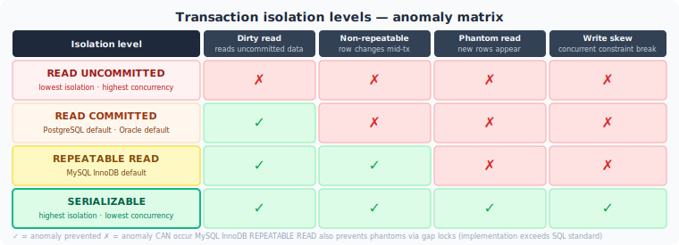

# Volume 4: Databases
# Chapter 16: ACID and Transactions

---

## Table of Contents

1. ACID Properties
2. Transaction Isolation Levels
3. MVCC — Multi-Version Concurrency Control
4. Locking
5. Optimistic vs Pessimistic Locking
6. Deadlock
7. Database Normalization
8. Denormalization Strategies
9. CAP Theorem
10. BASE vs ACID
11. Two-Phase Commit (2PC)
12. Distributed Transaction Alternatives
13. Database Replication
14. NoSQL Data Modeling
15. SQL vs NoSQL Decision Framework

---

> **How to read this chapter:** Each topic has three layers.
> - **The Idea** — start here, no prior knowledge needed.
> - **How It Works** — the real mechanism, patterns, and tradeoffs.
> - **Interview Lens** — what interviewers actually probe.
>
> Beginners: read all three layers top to bottom.
> SDE2/Senior: skim "The Idea", focus on "How It Works" and "Interview Lens".

---

## Topic 1: ACID Properties

---

#### The Idea

Imagine a bank transfer: you move $100 from Account A to Account B. Two things must be true. First, either both the debit and the credit happen, or neither does — you cannot have money leave Account A but never arrive in Account B. Second, if the database server loses power the moment after you confirm the transfer, the money must still be there when it restarts.

ACID is the set of four guarantees that make databases safe for exactly this kind of work. Each letter stands for one guarantee: **Atomicity** (all statements in a transaction succeed together or all are undone), **Consistency** (every transaction leaves the database in a valid state — no broken constraints), **Isolation** (concurrent transactions do not see each other's half-finished work), and **Durability** (once the database says "committed", that data survives a crash).

Each guarantee is enforced by a different internal mechanism. Atomicity uses an undo log. Consistency uses constraint checking (NOT NULL, UNIQUE, foreign keys, triggers). Isolation uses MVCC and locks. Durability uses a write-ahead log (WAL) and `fsync`. Understanding which mechanism backs which letter is what separates a prepared candidate from a well-read one.

---

#### How It Works

```
CLIENT:  BEGIN
           UPDATE accounts SET balance = balance - 100 WHERE id = 1
           UPDATE accounts SET balance = balance + 100 WHERE id = 2
         COMMIT

DB internals per statement:
  1. Write before-image of changed row to undo log
  2. Apply change to data page in buffer pool (memory)
  3. Write WAL record describing the change

At COMMIT:
  4. Flush WAL records to disk (fsync) ← Durability
  5. Return "OK" to client

On crash before commit:
  6. At restart, replay WAL forward for committed TXs
  7. Replay undo log backward for uncommitted TXs ← Atomicity
```

**Consistency** is simpler: the engine runs constraint checks (NOT NULL, UNIQUE, CHECK, FK) before the commit is allowed. If any constraint fails, the whole transaction is rolled back via the undo log.

**Isolation** is handled by MVCC and locking — covered in Topics 2, 3, and 4.

**The must-memorise gotcha — Durability and fsync:**

```sql
-- PostgreSQL: check durability settings
SHOW synchronous_commit;   -- 'on' = WAL flushed before ACK (full durability)
                           -- 'off' = WAL written async  (up to ~200ms data loss on crash)

SHOW fsync;                -- 'on' = safe; 'off' = catastrophic data corruption risk
```

`synchronous_commit = off` is a deliberate performance trade-off: you can lose the last few hundred milliseconds of commits on a crash, but the database files stay internally consistent. `fsync = off` is dangerous: the OS can reorder writes, leaving data pages in a state that cannot be recovered even with WAL. **Never disable fsync in production.** InnoDB exposes the same knob as `innodb_flush_log_at_trx_commit`: value `1` = fully durable (fsync on every commit), value `2` = write to OS cache + fsync every second (up to 1 second of data loss on OS crash).

---

#### Interview Lens

> **How to use this section:** Each question is self-contained — read it the night before an interview and walk in prepared. Every concept is explained inline.

> *Tip: Lead with the one-line answer. Pause. Expand only if the interviewer nods or probes.*

---

##### Q1 — Concept Check
**"Explain the four ACID properties and what enforces each one internally."**

**One-line answer:** ACID = undo log for Atomicity, constraint engine for Consistency, MVCC and locks for Isolation, write-ahead log and fsync for Durability.

**Full answer to give in an interview:**

> "ACID is a set of four guarantees that make database transactions safe. Atomicity means all statements in a transaction succeed together or are all rolled back — enforced by an undo log that stores the before-image of every changed row, so the engine can reverse changes if the transaction aborts. Consistency means each transaction takes the database from one valid state to another — enforced by the constraint engine: NOT NULL, UNIQUE, CHECK constraints, and foreign keys are all verified before the commit is allowed. Isolation means concurrent transactions don't see each other's half-finished work — enforced primarily by MVCC, which gives each transaction its own consistent snapshot of the data. Durability means a committed transaction survives crashes — enforced by the write-ahead log, or WAL: the WAL record describing every change is flushed to disk with fsync before the database sends 'OK' to the client, so on restart the engine can replay the WAL to recover committed data."

> *Deliver the four in order, one sentence each. If they probe further, go to the WAL/fsync detail.*

**Gotcha follow-up they'll ask:** *"Is ACID consistency the same as the C in CAP theorem?"*

> "No, they're completely different. CAP consistency means all nodes in a distributed system see the same data at the same time — it's about distributed agreement. ACID consistency means a transaction takes the database from one valid state to another — it's about local constraint satisfaction. Confusing them is a common interview mistake."

---

##### Q2 — Tradeoff Question
**"What happens to Durability if you set `fsync = off` or `innodb_flush_log_at_trx_commit = 2`? When, if ever, is that acceptable?"**

**One-line answer:** Disabling fsync risks data corruption on a crash; `innodb_flush_log_at_trx_commit = 2` risks up to one second of committed data loss on an OS crash, but the database stays internally consistent.

**Full answer to give in an interview:**

> "There are two levels of durability risk. The safer trade-off is `innodb_flush_log_at_trx_commit = 2` in MySQL or `synchronous_commit = off` in PostgreSQL — in both cases, the WAL is written to the OS page cache but not immediately fsynced to disk. The OS will flush it within about a second. If the database process crashes, you lose nothing. If the whole machine loses power, you could lose up to one second of committed transactions. The database files remain internally consistent because the WAL still has all the structure — just not the last second of it. This is acceptable for analytics workloads, staging environments, or any case where losing a second of data is tolerable. The dangerous setting is `fsync = off` in PostgreSQL: now the OS is free to reorder writes to data pages, so a crash can leave data files in a state that's inconsistent with the WAL. Recovery becomes impossible. This should never be used in production — it exists only for benchmarking on throwaway databases."

> *The key distinction to land: sync_commit=off = data loss; fsync=off = data corruption. Know the difference.*

**Gotcha follow-up they'll ask:** *"Does a ROLLBACK write WAL records in PostgreSQL?"*

> "Yes. PostgreSQL writes WAL records for rollbacks too — specifically, it records the fact that the transaction was aborted. This lets the recovery process know it does not need to re-apply that transaction's changes when replaying the WAL after a crash. Without a WAL record for the abort, the recovery code couldn't distinguish an in-progress transaction from a committed one."

---

> **Common Mistake — Undo log vs. WAL confusion:** Candidates often say the WAL handles rollback. It does not. The undo log (or heap versioning in PostgreSQL) handles rollback and Atomicity. The WAL handles crash recovery and Durability. Mixing these up is an immediate red flag to a senior interviewer.

---

**Quick Revision (one line):**
ACID = undo log (Atomicity) + constraints (Consistency) + MVCC/locks (Isolation) + WAL + fsync (Durability); never disable fsync in production — it risks unrecoverable data corruption, not just data loss.

---

## Topic 2: Transaction Isolation Levels

---



#### The Idea

Two bank tellers are processing transactions simultaneously. If they can each read the other's half-finished work, you get all kinds of bugs: one teller reads a deposit that will be rolled back (dirty read), or reads the same balance twice and gets different values because the other teller updated it in between (non-repeatable read), or searches for all accounts with a balance over $10,000 and gets a different count on a second search because the other teller just added a new high-balance account (phantom read).

SQL defines four isolation levels that progressively eliminate these anomalies. The higher the level, the safer the reads — but also the more the database has to work to enforce that safety, usually through more locking or more conflict detection.

The key practical detail that interviewers probe: MySQL's default is **Repeatable Read** with gap locks to also prevent phantom reads. PostgreSQL's default is **Read Committed**, and its Repeatable Read does not prevent phantoms — you need Serializable for that.

---

#### How It Works

```
Anomaly definitions:
  Dirty Read          — read uncommitted data from another TX that may roll back
  Non-Repeatable Read — same row read twice gives different values (another TX committed between reads)
  Phantom Read        — same range query gives different row count (another TX inserted/deleted between reads)
  Write Skew         — two TXs each read overlapping data, each write non-overlapping data,
                        combined result is invalid (e.g., two doctors both go off-call)
```

**Isolation levels vs anomalies:**

| Isolation Level    | Dirty Read | Non-Repeatable Read | Phantom Read | Write Skew |
|--------------------|:----------:|:-------------------:|:------------:|:----------:|
| READ UNCOMMITTED   | Possible   | Possible            | Possible     | Possible   |
| READ COMMITTED     | Prevented  | Possible            | Possible     | Possible   |
| REPEATABLE READ    | Prevented  | Prevented           | Possible*    | Possible   |
| SERIALIZABLE       | Prevented  | Prevented           | Prevented    | Prevented  |

*InnoDB (MySQL) Repeatable Read also prevents phantom reads via gap locks. PostgreSQL Repeatable Read does NOT — phantoms require Serializable in PostgreSQL.*

**How each level is enforced:**

```
READ COMMITTED (PostgreSQL default):
  Each statement gets a fresh MVCC snapshot
  → sees all data committed before that statement started

REPEATABLE READ (MySQL default):
  Snapshot taken at start of first statement in TX
  → subsequent reads in same TX see same data
  InnoDB also acquires gap locks on range scans → no phantom inserts

SERIALIZABLE:
  PostgreSQL: SSI (Serializable Snapshot Isolation) — tracks read/write
    dependencies and aborts transactions that would form a cycle
  MySQL: converts all plain SELECTs to SELECT ... LOCK IN SHARE MODE
```

**The must-memorise gotcha — default isolation levels:**

```sql
-- MySQL: check current default
SELECT @@transaction_isolation;   -- 'REPEATABLE-READ' by default

-- PostgreSQL: check current default
SHOW default_transaction_isolation;   -- 'read committed' by default

-- Set per transaction (PostgreSQL)
BEGIN TRANSACTION ISOLATION LEVEL SERIALIZABLE;

-- Set per transaction (MySQL)
SET TRANSACTION ISOLATION LEVEL READ COMMITTED;
```

MySQL's Repeatable Read uses **next-key locks** (record lock + gap lock) to block inserts into ranges you've already scanned — this prevents phantoms. PostgreSQL's Repeatable Read uses only snapshot isolation — it cannot prevent a concurrent INSERT from appearing if you re-run a range query, so you must use Serializable to prevent phantoms in PostgreSQL.

---

#### Interview Lens

> **How to use this section:** Each question is self-contained — read it the night before an interview and walk in prepared. Every concept is explained inline.

> *Tip: Lead with the one-line answer. Pause. Expand only if the interviewer nods or probes.*

---

##### Q1 — Concept Check
**"What are the four SQL isolation levels and what anomaly does each eliminate?"**

**One-line answer:** READ UNCOMMITTED / READ COMMITTED / REPEATABLE READ / SERIALIZABLE — each adds protection against dirty reads, non-repeatable reads, and phantom reads respectively, at increasing cost.

**Full answer to give in an interview:**

> "SQL defines four isolation levels in increasing order of protection. Read Uncommitted allows all anomalies including dirty reads — one transaction can see uncommitted data from another that might roll back. Almost nothing uses this in production. Read Committed prevents dirty reads — you only see data from transactions that have already committed — but you can still get non-repeatable reads: if you read the same row twice in one transaction, another committed transaction in between can change its value. This is the default in PostgreSQL. Repeatable Read prevents both dirty reads and non-repeatable reads by taking a snapshot at the start of the transaction — re-reading the same row always gives the same result. This is the default in MySQL. Phantom reads can still occur unless the database uses gap locks, which MySQL does. PostgreSQL does not use gap locks at this level, so phantoms are still possible. Serializable prevents everything including write skew — two transactions that read the same rows and each write to different rows but in a way that creates an invalid combined state. PostgreSQL implements this with SSI, Serializable Snapshot Isolation, which tracks read/write dependencies and aborts any transaction that would form a cycle."

> *The table is worth memorising — interviewers at Stripe and Goldman Sachs often ask you to fill it out.*

**Gotcha follow-up they'll ask:** *"Does MySQL's Repeatable Read prevent phantom reads?"*

> "Yes, MySQL's InnoDB Repeatable Read does prevent phantom reads, but PostgreSQL's Repeatable Read does not. MySQL achieves this with next-key locks — a combination of a record lock on the index entry and a gap lock on the space before it. These locks prevent any other transaction from inserting a row into a range you've already scanned. PostgreSQL's Repeatable Read only uses snapshot isolation without gap locking, so a concurrent INSERT can create a phantom row that appears if you re-run a range query. In PostgreSQL you need Serializable to prevent phantoms."

---

##### Q2 — Design Scenario
**"You're building a financial reporting feature that runs a multi-step read: total deposits, then total withdrawals, then net balance. What isolation level do you use and why?"**

**One-line answer:** Repeatable Read — it guarantees the three reads see the same consistent snapshot, preventing the report from reflecting different moments in time.

**Full answer to give in an interview:**

> "I'd use Repeatable Read. The problem with Read Committed for this report is non-repeatable reads: each of the three SELECT statements gets a fresh snapshot, so if a large deposit commits between the first and second read, the total deposits figure and the total withdrawals figure would reflect different points in time, making the net balance incorrect. With Repeatable Read, the snapshot is taken once at the start of the transaction and all three reads see the same state of the database — even if other transactions commit in between. I don't need Serializable here because I'm not writing anything, so write skew isn't a concern. In PostgreSQL I'd explicitly set the transaction isolation to Repeatable Read since the default is Read Committed. In MySQL InnoDB, Repeatable Read is already the default, so no change is needed."

> *Show that you reason from the anomaly, not just from the level name. That's what makes the answer strong.*

**Gotcha follow-up they'll ask:** *"What's write skew and when does Serializable matter?"*

> "Write skew is when two transactions each read the same set of rows and each write to different rows, but the combined result violates an invariant. The classic example is two on-call doctors: both read that two doctors are on call, both decide to go off-call because at least one other is on call, both commit — and now zero doctors are on call. Neither transaction individually violated a constraint, but together they did. Repeatable Read doesn't catch this because each transaction's individual writes are valid. Only Serializable catches it by detecting that the two transactions' reads and writes form a conflict cycle."

---

> **Common Mistake — Assuming MySQL and PostgreSQL Repeatable Read are identical:** They are not. MySQL's Repeatable Read includes gap locking and phantom prevention. PostgreSQL's does not. Saying they behave the same in a Stripe or Goldman interview will cost you the question.

---

**Quick Revision (one line):**
READ UNCOMMITTED → READ COMMITTED (PG default) → REPEATABLE READ (MySQL default, prevents phantoms via gap locks) → SERIALIZABLE (prevents write skew); PostgreSQL Repeatable Read does not prevent phantoms — use Serializable.

---

## Topic 3: MVCC — Multi-Version Concurrency Control

---

#### The Idea

Imagine a library where each book is a database row. In a traditional locking scheme, if someone is reading a book, nobody else can update it until they put it down. That kills throughput in a busy library. MVCC's solution: when a writer updates a book, instead of grabbing it from the reader, they create a new edition and put it on the shelf. The reader keeps reading the old edition until they are done. The writer's new edition becomes visible to future readers. Old editions are periodically cleared off the shelves by a cleaning process.

This is exactly how PostgreSQL and MySQL (InnoDB) handle concurrent reads and writes. Readers never block writers; writers never block readers. The database maintains multiple versions of each row simultaneously, and each transaction sees a consistent snapshot — the state of the database at the moment that transaction started.

The cleaning process in PostgreSQL is called **VACUUM**. In InnoDB it is the **purge thread**. If the cleaning falls behind — for example, because a long-running transaction is pinning an old snapshot — old row versions accumulate, causing storage bloat and slower reads.

---

#### How It Works

**PostgreSQL approach — versions live in the heap:**

```
Row update in PostgreSQL:
  Old tuple: xmin=100, xmax=0,   data="Alice"   ← visible to TXs started before update
  ↓ TX 200 runs UPDATE
  Old tuple: xmin=100, xmax=200, data="Alice"   ← xmax stamped; now "deleted" by TX 200
  New tuple: xmin=200, xmax=0,   data="Alicia"  ← new version, visible after TX 200 commits

Snapshot visibility check:
  A tuple is visible if:
    tuple.xmin is committed AND tuple.xmin < snapshot.xmax
    AND tuple.xmin NOT IN snapshot.xip_list (active TXs)
    AND (tuple.xmax = 0 OR tuple.xmax not committed OR tuple.xmax > snapshot.xmax)
```

**InnoDB approach — current version in clustered index, old versions in undo log:**

```
Row update in InnoDB:
  Clustered index row: DB_TRX_ID=200, DB_ROLL_PTR→[undo record], data="Alicia"
  Undo log record:     before-image: data="Alice", prev_version→[older undo]

Read view for TX 150 (started before TX 200):
  m_low_limit_id = 201 (TXs >= 201 invisible)
  m_up_limit_id  = 149 (TXs <  149 committed and visible)
  m_ids = [150, 175]   (active, invisible)
  → TX 150 reads clustered index, sees DB_TRX_ID=200 which is in invisible range
  → follows DB_ROLL_PTR to undo record, reconstructs "Alice"
```

**The must-memorise gotcha — how MVCC avoids read locks, and VACUUM:**

```sql
-- PostgreSQL: VACUUM removes dead tuples (old row versions no longer visible to any TX)
VACUUM ANALYZE accounts;

-- Find tables with excessive dead tuples (VACUUM falling behind)
SELECT relname, n_dead_tup, n_live_tup,
       round(100.0 * n_dead_tup / NULLIF(n_live_tup + n_dead_tup, 0), 2) AS dead_pct
FROM pg_stat_user_tables
ORDER BY n_dead_tup DESC;

-- Find the oldest transaction holding back VACUUM
SELECT backend_xmin, state, query
FROM pg_stat_activity
ORDER BY backend_xmin NULLS LAST;

-- InnoDB: check undo log pressure (History list length should be < ~100k)
SHOW ENGINE INNODB STATUS\G   -- look for "History list length"
```

The core insight: **readers see a snapshot of the database at transaction start** (Repeatable Read) or statement start (Read Committed). **Writers create new row versions** rather than overwriting in place. **Old versions are cleaned up** by VACUUM (PostgreSQL) or the purge thread (InnoDB). A long-running transaction pins the cleanup boundary, causing bloat.

---

#### Interview Lens

> **How to use this section:** Each question is self-contained — read it the night before an interview and walk in prepared. Every concept is explained inline.

> *Tip: Lead with the one-line answer. Pause. Expand only if the interviewer nods or probes.*

---

##### Q1 — Concept Check
**"How does MVCC allow readers and writers to proceed concurrently without blocking each other?"**

**One-line answer:** Readers see a consistent snapshot from transaction start; writers create new row versions rather than overwriting, so the old version remains visible to concurrent readers.

**Full answer to give in an interview:**

> "MVCC, Multi-Version Concurrency Control, solves the read-write contention problem by maintaining multiple versions of each row simultaneously. When a transaction reads a row, it doesn't acquire a lock — it just checks which version of that row was committed at the time its snapshot was taken. When a transaction writes a row, it doesn't modify the existing version in place. Instead, it creates a new version of the row. The old version stays visible to any reader whose snapshot predates the write. In PostgreSQL, both versions live in the heap table — the old tuple has its xmax column stamped with the writing transaction's ID, and a new tuple is inserted with xmin set to that same ID. In InnoDB, the current version lives in the clustered index and old versions are stored in the undo log, chained via a rollback pointer. A reader needing an older version walks that chain until it finds a version its read view considers visible. Because readers never need locks to access their snapshot version, reads and writes never block each other. The trade-off is that old versions accumulate and must be cleaned up — by VACUUM in PostgreSQL and by the purge thread in InnoDB."

> *Mention both PostgreSQL and InnoDB implementations — interviewers at Google and Confluent expect this.*

**Gotcha follow-up they'll ask:** *"Does MVCC mean PostgreSQL never acquires locks?"*

> "No. MVCC eliminates read-write lock contention — readers don't block writers and writers don't block readers. But write-write contention still requires locks. Two concurrent transactions trying to UPDATE the same row will contend: the second one blocks until the first commits or rolls back, then either updates the new version or, at Repeatable Read and above, aborts with a serialization error. DML statements — INSERT, UPDATE, DELETE — still acquire row-level exclusive locks in PostgreSQL. MVCC only removes the conflict between readers and writers."

---

##### Q2 — Tradeoff Question
**"What is the XID wraparound problem in PostgreSQL, and what does it have to do with VACUUM?"**

**One-line answer:** PostgreSQL's 32-bit transaction IDs wrap around after ~2 billion transactions; VACUUM FREEZE prevents old tuples from becoming invisible by replacing their xmin with a special "frozen" marker.

**Full answer to give in an interview:**

> "PostgreSQL assigns each transaction a 32-bit integer ID called an XID. Visibility comparisons work in a circular space — a transaction is considered 'in the past' if it's within 2 billion XIDs behind the current one. After roughly 2 billion transactions, a very old XID would appear to be in the future rather than the past, making very old tuples suddenly invisible — they'd look like they were inserted by a future transaction. This is called XID wraparound and it's catastrophic: tables effectively disappear. The fix is VACUUM FREEZE. When VACUUM processes a table, for any tuple whose xmin is old enough, it replaces the xmin with a special FrozenTransactionId marker. Frozen tuples are always visible to all transactions regardless of XID arithmetic. PostgreSQL tracks the oldest unfrozen XID per database in `pg_database.datfrozenxid` and will start warning — and eventually refuse new transactions — if that age approaches 2 billion. Autovacuum handles this automatically, but high-write tables or paused autovacuum can create wraparound emergencies that require emergency VACUUM FREEZE runs."

> *This question separates candidates who've read about MVCC from candidates who've operated PostgreSQL in production.*

---

> **Common Mistake — "MVCC eliminates locking":** MVCC eliminates read-write lock contention. Concurrent writers to the same row still contend, and DML still holds row-level exclusive locks. Saying MVCC removes all locking is incorrect and will be challenged immediately.

---

**Quick Revision (one line):**
MVCC = readers see a snapshot at TX start, writers create new row versions; PostgreSQL stores old versions in the heap (cleaned by VACUUM), InnoDB stores them in the undo log (cleaned by purge thread); a long-running TX pins cleanup and causes bloat.

---

## Topic 4: Locking

---

#### The Idea

Even with MVCC handling read-write conflicts, two transactions that both want to update the same row still need a referee. That referee is the lock manager. When Transaction A starts updating a row, it acquires an exclusive lock on that row. Transaction B, arriving to update the same row, is blocked until A commits or rolls back.

There are two fundamental lock modes. A **shared lock** (also called a read lock) allows multiple transactions to hold it simultaneously — several readers can read the same row at the same time. An **exclusive lock** (write lock) allows only one holder at a time and blocks both other exclusive locks and shared locks. Beyond row locks, databases also maintain table-level locks to handle DDL operations like ALTER TABLE, which can't proceed safely if any row in the table is being modified.

The danger with locking is **deadlock**: Transaction A holds a lock on row 1 and waits for row 2; Transaction B holds row 2 and waits for row 1. Neither can proceed. Databases detect this automatically and pick one transaction to cancel (the "victim"), allowing the other to complete.

---

#### How It Works

**Lock compatibility — what blocks what:**

```
Shared (S) lock:     multiple holders OK; blocks exclusive (X) acquirers
Exclusive (X) lock:  single holder only; blocks all others

PostgreSQL row-level lock modes (weakest to strongest):
  FOR KEY SHARE       → blocks only FOR UPDATE
  FOR SHARE           → blocks FOR UPDATE and FOR NO KEY UPDATE
  FOR NO KEY UPDATE   → blocks FOR SHARE and FOR UPDATE
  FOR UPDATE          → blocks all of the above

InnoDB lock types:
  Record lock   → locks a single index entry
  Gap lock      → locks the space before an index entry (prevents phantom inserts)
  Next-key lock → record + gap (default in Repeatable Read)
  Insert intention lock → placed by INSERT before writing; compatible with gap locks
```

**Deadlock example and prevention:**

```
Deadlock scenario:
  TX A: LOCK row 1 → waits for row 2
  TX B: LOCK row 2 → waits for row 1
  → circular wait → database kills one victim TX

Prevention: always acquire locks in the same order
  TX A: LOCK row 1, then row 2
  TX B: LOCK row 1 (waits), then row 2
  → no cycle → safe

Detection: PostgreSQL checks for cycles in the wait-for graph after lock_timeout
           InnoDB runs a background deadlock detector continuously
```

**The must-memorise SQL — SELECT FOR UPDATE vs SELECT FOR SHARE:**

```sql
-- Exclusive row lock: only I can update; no other writer or locked reader
SELECT * FROM accounts WHERE id = 42 FOR UPDATE;

-- Shared row lock: others can also FOR SHARE; but nobody can UPDATE
SELECT * FROM accounts WHERE id = 42 FOR SHARE;

-- Fail immediately if row is locked (don't wait)
SELECT * FROM accounts WHERE id = 42 FOR UPDATE NOWAIT;

-- Skip locked rows — ideal for job queue workers
SELECT * FROM jobs WHERE status = 'PENDING' LIMIT 1 FOR UPDATE SKIP LOCKED;

-- Inspect who holds locks right now (PostgreSQL)
SELECT pid, mode, granted, relation::regclass
FROM pg_locks
JOIN pg_class ON pg_locks.relation = pg_class.oid
WHERE relname = 'accounts';
```

---

#### Interview Lens

> **How to use this section:** Each question is self-contained — read it the night before an interview and walk in prepared. Every concept is explained inline.

> *Tip: Lead with the one-line answer. Pause. Expand only if the interviewer nods or probes.*

---

##### Q1 — Concept Check
**"What is the difference between SELECT FOR UPDATE and SELECT FOR SHARE? When would you use each?"**

**One-line answer:** FOR UPDATE acquires an exclusive row lock for a read-then-modify pattern; FOR SHARE acquires a shared lock to prevent deletion while allowing other shared readers.

**Full answer to give in an interview:**

> "SELECT FOR UPDATE acquires an exclusive row lock on the rows it touches. No other transaction can acquire a lock on those rows — not FOR SHARE, not another FOR UPDATE — until my transaction commits or rolls back. I use this in the classic read-then-write pattern: read the current value, make a decision based on it, then write. A ticket booking system is the canonical example: I read a seat's status, confirm it's available, then mark it booked. Without FOR UPDATE, two concurrent transactions could both read 'available' and both proceed to book, causing an oversell. SELECT FOR SHARE acquires a shared row lock. Multiple transactions can hold a shared lock simultaneously, but none of them can UPDATE or DELETE the row. I use FOR SHARE when I need to read a parent row and ensure it won't be deleted while I'm inserting a child row that references it — essentially manually enforcing referential integrity for the duration of my transaction without the overhead of a full FK check cycle. A plain SELECT without any lock clause doesn't acquire a row lock at all — it reads from the MVCC snapshot and is never blocked by other transactions."

> *Name the pattern — read-then-write for FOR UPDATE, parent-protection for FOR SHARE. Interviewers want the use case, not just the definition.*

**Gotcha follow-up they'll ask:** *"Does SELECT FOR UPDATE block a plain SELECT?"*

> "No. A plain SELECT in PostgreSQL or MySQL reads from the MVCC snapshot and is never blocked by row locks — not even an exclusive FOR UPDATE lock. This is the whole point of MVCC: readers don't block writers and writers don't block readers. Only another lock-acquiring statement — another FOR UPDATE, a FOR SHARE, or an actual UPDATE/DELETE — would block on a FOR UPDATE lock."

---

##### Q2 — Design Scenario
**"How do you design a job queue in PostgreSQL where multiple workers process jobs without picking the same job twice?"**

**One-line answer:** Use `SELECT ... FOR UPDATE SKIP LOCKED` — each worker locks one pending job row; SKIP LOCKED makes other workers skip that row rather than waiting.

**Full answer to give in an interview:**

> "The pattern is SELECT FOR UPDATE SKIP LOCKED. Each worker runs a query like: SELECT id FROM jobs WHERE status = 'PENDING' ORDER BY created_at LIMIT 1 FOR UPDATE SKIP LOCKED. The FOR UPDATE part acquires an exclusive lock on the selected row, preventing any other worker from picking the same job. The SKIP LOCKED part is the key insight: instead of waiting for the lock to release — which would create a bottleneck where all workers queue up behind the same job — SKIP LOCKED tells the database to simply skip any row that is currently locked and find the next available unlocked row. Each worker instantly gets its own job row to work on. After processing, the worker updates status to 'DONE' and commits, releasing the lock. This pattern is significantly simpler than using a separate Redis-based queue for many use cases, and it gives you transactional guarantees: if the worker crashes mid-processing, the transaction rolls back and the job becomes available again automatically."

> *SKIP LOCKED is a common system design detail at Amazon and Palantir. Knowing why it's better than FOR UPDATE alone is the differentiator.*

---

> **Common Mistake — FOR UPDATE on an unindexed column in InnoDB:** In InnoDB, using SELECT FOR UPDATE with a WHERE clause on a non-indexed column forces a full table scan with exclusive locks on every row scanned, potentially escalating to a de-facto table lock. Always ensure the column in the WHERE clause of a FOR UPDATE query is indexed.

---

**Quick Revision (one line):**
Shared lock = multiple readers OK; exclusive lock = single writer; FOR UPDATE = exclusive row lock for read-then-write; FOR SHARE = shared row lock to protect parent rows; SKIP LOCKED = job queue pattern; InnoDB gap locks prevent phantom inserts in range scans.

---

## Topic 5: Optimistic vs Pessimistic Locking

---

#### The Idea

There are two philosophies for handling concurrent updates to the same data. **Pessimistic locking** assumes the worst: conflicts are likely, so grab a lock before you read the data and hold it until you are done. Nobody else can touch it while you work. Safe, but slow under low contention — everyone waits even when they wouldn't have conflicted.

**Optimistic locking** assumes the best: conflicts are rare, so don't grab a lock at all. Read freely, make your changes, and at the moment you try to save, quickly check whether anyone else changed the data since you read it. If they did, your write is rejected and you retry. If they didn't, you commit cleanly. High throughput when conflicts are rare; bad when conflicts are frequent because retries pile up.

The practical implementation in Java/Spring is the `@Version` annotation in JPA. You add a `version` field to your entity — a simple integer. Every UPDATE that JPA generates automatically adds `AND version = ?` to the WHERE clause and increments the version. If two concurrent users both read version 5 and both try to save, the first one updates to version 6 successfully. The second one's UPDATE matches zero rows (because the version is now 6, not 5), and JPA throws `OptimisticLockException`.

---

#### How It Works

**Pessimistic locking flow:**

```
TX A:
  SELECT * FROM products WHERE id = 1 FOR UPDATE   ← acquires exclusive lock
  (TX B arrives, tries FOR UPDATE, blocks...)
  UPDATE products SET quantity = 9 WHERE id = 1
  COMMIT                                            ← lock released
  
TX B (unblocks):
  SELECT * FROM products WHERE id = 1 FOR UPDATE   ← now acquires lock
  sees quantity = 9 (TX A's committed value)
  UPDATE products SET quantity = 8 WHERE id = 1
  COMMIT
```

**Optimistic locking flow:**

```
TX A reads:  SELECT id, quantity, version FROM products WHERE id = 1
             → {id:1, quantity:10, version:5}

TX B reads:  SELECT id, quantity, version FROM products WHERE id = 1
             → {id:1, quantity:10, version:5}

TX A saves:  UPDATE products SET quantity=9, version=6
             WHERE id=1 AND version=5
             → 1 row updated → commit OK

TX B saves:  UPDATE products SET quantity=9, version=6
             WHERE id=1 AND version=5
             → 0 rows updated (version is now 6) → OptimisticLockException → retry
```

**The must-memorise gotcha — `@Version` in JPA:**

```java
@Entity
public class Product {
    @Id
    private Long id;

    private int quantity;

    @Version
    private Long version;  // JPA manages this automatically — do NOT set it manually
}
```

```java
// JPA generates this SQL on every save:
// UPDATE products SET quantity = ?, version = version + 1
// WHERE id = ? AND version = ?
//
// If 0 rows updated → JPA throws OptimisticLockException
// Spring translates this to ObjectOptimisticLockingFailureException
// → catch BOTH in retry logic
```

**Retry pattern:**

```java
@Transactional
public void decrementStock(Long productId, int qty) {
    Product p = productRepo.findById(productId).orElseThrow();
    if (p.getQuantity() < qty) throw new InsufficientStockException();
    p.setQuantity(p.getQuantity() - qty);
    productRepo.save(p);
    // JPA adds AND version = ? — if version changed, throws OptimisticLockException
}
```

---

#### Interview Lens

> **How to use this section:** Each question is self-contained — read it the night before an interview and walk in prepared. Every concept is explained inline.

> *Tip: Lead with the one-line answer. Pause. Expand only if the interviewer nods or probes.*

---

##### Q1 — Tradeoff Question
**"Compare optimistic and pessimistic locking. When would you use each?"**

**One-line answer:** Optimistic locking suits low write-contention workloads — reads are free, conflicts are detected at commit time; pessimistic locking suits high-contention scenarios where conflicts are frequent and retries are expensive.

**Full answer to give in an interview:**

> "Pessimistic locking acquires a database row lock at read time using SELECT FOR UPDATE. The locked row is exclusive to that transaction until it commits or rolls back — all other writers queue up and wait. This guarantees no conflict at commit time, but under low contention it creates unnecessary waiting: transactions serialise even when they would never have conflicted. It also carries deadlock risk if two transactions lock rows in different orders. Pessimistic locking is the right choice when write contention is high — financial transfers, inventory systems with limited stock, seat reservations — anywhere that a conflict is likely and retrying is expensive. Optimistic locking doesn't acquire any lock at read time. It reads freely, and at write time adds a version check to the UPDATE: 'update this row only if the version is still what I read.' If another transaction committed a change in the meantime, the version won't match, zero rows are updated, and the application catches that exception and retries. The throughput advantage is significant under low contention: no lock waits, no deadlocks, higher concurrency. The problem comes under high contention: many transactions retrying repeatedly adds latency and CPU load — a situation sometimes called 'thrashing.' I'd use optimistic locking for profile updates, content edits, shopping cart modifications — any domain where the same record is rarely updated by two users simultaneously."

> *Land the phrase 'thrashing under high contention' — it shows you understand the failure mode, not just the happy path.*

**Gotcha follow-up they'll ask:** *"Does `@Version` work across two different application servers in a cluster?"*

> "Yes, and this is one of its key advantages over application-level CAS patterns. The version check happens inside a single UPDATE statement at the database level — WHERE id = ? AND version = ?. The database enforces this atomically. It doesn't matter how many application servers are running; they all go through the same database, and only one of them will get the row with the matching version. The other will get zero rows updated and throw OptimisticLockException. This is fundamentally more reliable than checking the version in application code and then updating separately, which would have a TOCTOU race condition."

---

##### Q2 — Concept Check
**"How does JPA's `@Version` annotation implement optimistic locking, and what exceptions must you catch?"**

**One-line answer:** JPA adds `AND version = ?` to every UPDATE and increments the version column; if zero rows match, it throws `OptimisticLockException` (JPA) translated to `ObjectOptimisticLockingFailureException` (Spring) — catch both.

**Full answer to give in an interview:**

> "When you annotate a field with @Version in a JPA entity, Hibernate takes over management of that field. You never set it manually — Hibernate reads the current value when you load the entity and uses it at write time. Every time Hibernate generates an UPDATE statement for that entity, it automatically appends AND version = [current value] to the WHERE clause and sets version = version + 1 in the SET clause. The database executes this as a single atomic statement. If another transaction updated the same row since you loaded it, the version will have been incremented, your WHERE clause matches zero rows, and JDBC returns an update count of zero. Hibernate sees that and throws javax.persistence.OptimisticLockException, or jakarta.persistence.OptimisticLockException in Jakarta EE. Spring Data wraps this in its own exception hierarchy as org.springframework.dao.ObjectOptimisticLockingFailureException. In a retry loop you need to catch both, because depending on which layer surfaces first, you could get either. The standard pattern is to put the retry logic outside the @Transactional method — the transaction must start fresh on each retry, and if your retry loop is inside the same transaction, the retry will operate on the same stale entity snapshot and fail again immediately."

> *The detail about retry logic needing to be outside @Transactional is the kind of practical nuance that separates candidates who've shipped this from those who've only read about it.*

---

> **Common Mistake — Mixing optimistic and pessimistic locking on the same entity:** Adding both `@Version` on the entity and `@Lock(PESSIMISTIC_WRITE)` on a repository method for the same record creates confusion about which mechanism is protecting the update. Under pessimistic locking the version check is redundant; under optimistic locking the FOR UPDATE is unnecessary overhead. Pick one strategy per use case and document why.

---

**Quick Revision (one line):**
Optimistic = no lock at read time, version check at write time, retry on conflict (low contention); pessimistic = SELECT FOR UPDATE at read time, blocks concurrent writers (high contention); JPA @Version adds `AND version = ?` to UPDATE — catch OptimisticLockException and ObjectOptimisticLockingFailureException in retry logic.

---

## Topic 6: Deadlock

---

#### The Idea

Imagine two people at a narrow doorway, each waiting for the other to step aside first — neither moves, and nothing happens. A deadlock in a database works the same way. Transaction A holds a lock on Row 1 and is waiting to lock Row 2. Transaction B holds a lock on Row 2 and is waiting to lock Row 1. Both are stuck, each waiting on the other, forever.

Deadlocks are not bugs in your data — they are a natural consequence of two concurrent transactions needing the same rows in different orders. The database will detect this cycle and forcibly kill one of the transactions (the "victim") so the other can proceed. The killed transaction gets an error and must be retried by the application.

The most reliable way to prevent deadlocks is to make sure every transaction always acquires locks in the same order. If Transaction A always locks Row 1 before Row 2, and Transaction B does the same, the circular wait can never form — they will queue up behind each other instead of crossing.

---

#### How It Works

```
-- Deadlock scenario (dangerous):
Transaction A:
  LOCK Row 1
  ... do work ...
  LOCK Row 2   <-- waits, B holds Row 2

Transaction B:
  LOCK Row 2
  ... do work ...
  LOCK Row 1   <-- waits, A holds Row 1
  -- DEADLOCK: circular wait detected, one tx is killed
```

Most databases (MySQL InnoDB, PostgreSQL) detect deadlocks automatically using a wait-for graph — they track which transaction is waiting on which lock and look for cycles. Detection runs frequently but has overhead, so prevention is always cheaper than detection.

```
-- Prevention via consistent lock ordering (safe):
Both Transaction A and Transaction B:
  LOCK Row 1 first
  LOCK Row 2 second
  -- No circle possible: one always waits, never a cycle
```

Additional strategies: use `SELECT ... FOR UPDATE` to acquire row locks upfront at the start of a transaction (rather than mid-flight), keep transactions short to reduce overlap windows, and use lock timeouts so a waiting transaction fails fast rather than hanging indefinitely.

The must-memorise gotcha — always acquire locks in the same canonical order across all transactions:

```sql
-- Always lock accounts in ascending ID order
-- Transaction transferring from account_id=5 to account_id=3:
SELECT * FROM accounts WHERE id = 3 FOR UPDATE;   -- lower ID first
SELECT * FROM accounts WHERE id = 5 FOR UPDATE;   -- higher ID second
-- Both transactions follow this rule → no circular wait possible
```

---

#### Interview Lens

> **How to use this section:** Each question is self-contained — read it the night before an interview and walk in prepared. Every concept is explained inline.

> *Tip: Lead with the one-line answer. Pause. Expand only if the interviewer nods or probes.*

---

##### Q1 — Concept Check
**"What is a deadlock and how does a database handle it?"**

**One-line answer:** A deadlock is a circular wait where two transactions each hold a lock the other needs — the database detects the cycle and kills one transaction so the other can proceed.

**Full answer to give in an interview:**

> "A deadlock happens when two transactions are each waiting for a lock held by the other. For example, Transaction A locks Account 1 and then tries to lock Account 2, while Transaction B already holds Account 2 and is trying to lock Account 1. Neither can proceed — that's a circular wait. Databases like MySQL InnoDB and PostgreSQL detect this automatically by maintaining a wait-for graph — a map of which transaction is waiting on which. When a cycle is detected, the database picks a victim, typically the transaction that has done the least work, and rolls it back with a deadlock error. The application is responsible for catching that error and retrying the transaction."

> *Keep the tone matter-of-fact — deadlocks are normal, not catastrophic.*

**Gotcha follow-up they'll ask:** *"How would you prevent deadlocks in your code?"*

> "The most reliable prevention is consistent lock ordering — always acquire locks on the same resources in the same order across all transactions. If every transaction that touches Account 3 and Account 7 always locks the lower ID first, the circular wait can never form. Beyond that, I'd keep transactions as short as possible to reduce the overlap window, acquire heavy locks at the start of the transaction rather than mid-way through, and set a lock timeout so a stuck transaction fails fast and can be retried rather than hanging the thread indefinitely."

---

##### Q2 — Tradeoff Question
**"What is the difference between deadlock prevention and deadlock detection?"**

**One-line answer:** Prevention stops the circular wait from ever forming; detection finds it after it forms and kills one participant.

**Full answer to give in an interview:**

> "Prevention means designing your locking strategy so a deadlock cycle can never occur — the classic technique is consistent lock ordering, where all transactions acquire locks on the same set of rows in a fixed sequence. If the order is always the same, two transactions can never cross-wait. Detection, by contrast, lets transactions acquire locks freely and periodically inspects the wait-for graph for cycles. MySQL InnoDB runs deadlock detection by default and resolves it immediately, but this background check has CPU overhead. Some high-throughput systems disable automatic detection and rely on lock timeouts instead — a transaction that waits longer than, say, 50 milliseconds just fails and retries, which avoids the graph-walk cost but means some retries happen unnecessarily when there was no real deadlock. Prevention is generally preferred for predictable, low-retry systems; timeout-based detection suits ultra-high-concurrency workloads where minimising detection overhead matters more."

> *Mentioning the trade-off between detection cost and retry rate shows system-design awareness.*

**Gotcha follow-up they'll ask:** *"Can you prevent all deadlocks?"*

> "In theory yes — consistent lock ordering eliminates the circular-wait condition. In practice it's hard to guarantee across all code paths in a large codebase, so most systems layer prevention with a fallback: consistent ordering as the primary strategy, plus a lock timeout as a safety net so any missed case fails fast and retries rather than hanging."

---

> **Common Mistake — Assuming the application doesn't need to retry:** Many developers assume the database handles deadlocks silently. It does not — it throws an error to the application. If your code doesn't catch and retry on deadlock errors, the user sees a failure. Always wrap critical transactions in retry logic.

---

**Quick Revision (one line):**
A deadlock is a circular lock wait resolved by the database killing one transaction — prevent it by always acquiring locks in the same order across all transactions.

---

## Topic 7: Database Normalization

---

#### The Idea

Imagine a spreadsheet where every row about an order also repeats the customer's full address. If that customer moves, you have to update hundreds of rows — and if you miss any, you now have contradictory data in your own database. Normalization is the process of reorganising a database to eliminate exactly this kind of redundancy by ensuring each fact is stored in exactly one place.

The rules of normalization are expressed as "normal forms" — numbered levels (1NF, 2NF, 3NF) where each level fixes a specific class of problem. Moving from one level to the next typically means splitting a table into two smaller tables and linking them with a foreign key. You trade a wider, messier table for a set of narrower, cleaner tables that join together when you need them.

Each normal form builds on the previous one: to be in 3NF, a table must already satisfy 2NF; to be in 2NF, it must already satisfy 1NF. In practice, most well-designed OLTP (online transaction processing) schemas aim for 3NF — the point at which the most damaging update anomalies are eliminated.

---

#### How It Works

**1NF — First Normal Form:** Every column must contain atomic (indivisible) values. No repeating groups, no comma-separated lists inside a single column.

```
-- Violates 1NF: skills stored as a list in one column
employees: (emp_id, name, skills)
            (1, "Alice", "Java,Python,SQL")

-- Satisfies 1NF: one skill per row
employee_skills: (emp_id, skill)
                 (1, "Java")
                 (1, "Python")
                 (1, "SQL")
```

**2NF — Second Normal Form:** Must be in 1NF, and every non-key column must depend on the whole primary key — not just part of it. This matters when the primary key is composite (more than one column).

```
-- Composite key: (order_id, product_id)
-- Violates 2NF: product_name depends only on product_id, not the full key
order_items: (order_id, product_id, product_name, quantity)

-- Fix: split product_name into its own table
products: (product_id, product_name)
order_items: (order_id, product_id, quantity)
```

**3NF — Third Normal Form:** Must be in 2NF, and no non-key column may depend on another non-key column (no transitive dependencies). The must-memorise gotcha: if a non-key column A determines another non-key column B, split B out into its own table.

```sql
-- Violates 3NF: EmpID → DeptID → DeptName (transitive dependency)
-- dept_name is determined by dept_id, not directly by emp_id
CREATE TABLE employees (
    emp_id    INT PRIMARY KEY,
    dept_id   INT,
    dept_name VARCHAR(100)  -- depends on dept_id, not emp_id
);

-- Fix: split dept_name into its own departments table
CREATE TABLE departments (
    dept_id   INT PRIMARY KEY,
    dept_name VARCHAR(100)
);

CREATE TABLE employees (
    emp_id  INT PRIMARY KEY,
    dept_id INT REFERENCES departments(dept_id)
);
```

---

#### Interview Lens

> **How to use this section:** Each question is self-contained — read it the night before an interview and walk in prepared. Every concept is explained inline.

> *Tip: Lead with the one-line answer. Pause. Expand only if the interviewer nods or probes.*

---

##### Q1 — Concept Check
**"Can you explain 1NF, 2NF, and 3NF with an example?"**

**One-line answer:** 1NF eliminates repeating groups, 2NF eliminates partial dependencies on a composite key, and 3NF eliminates transitive dependencies between non-key columns.

**Full answer to give in an interview:**

> "I'll walk through a concrete example. Start with a messy order table: (order_id, product_id, product_name, customer_id, customer_address, quantity). First Normal Form requires atomic values — no lists in a column — and this table passes that. Second Normal Form requires that every non-key column depends on the full primary key. If the key is (order_id, product_id), then product_name depends only on product_id, not on the full composite key — that's a partial dependency, so we split product_name into a separate products table. Third Normal Form requires no transitive dependencies: if customer_address is determined by customer_id, and customer_id is just a non-key column in orders, then customer_address depends transitively on the order's key — so we split customer data into its own customers table. After 3NF, each table stores one kind of fact, and you update a customer's address in exactly one place."

> *If the interviewer looks interested, mention that BCNF — Boyce-Codd Normal Form — is a stricter variant of 3NF that also handles cases where a determinant is not a candidate key.*

**Gotcha follow-up they'll ask:** *"When would you stop at 2NF instead of going to 3NF?"*

> "Rarely, and only for performance reasons. Stopping at 2NF means you still have transitive dependencies, so updating a department name requires touching every employee row. I'd go to 3NF for any OLTP system. The only time I'd consciously stay below 3NF is in an analytical or reporting schema — a data warehouse star schema intentionally denormalises for read performance."

---

##### Q2 — Tradeoff Question
**"What are the downsides of over-normalisation?"**

**One-line answer:** Highly normalised schemas require many joins, which increases query complexity and can hurt read performance at scale.

**Full answer to give in an interview:**

> "Normalisation is great for write consistency — every fact lives in one place, so updates are clean. But for reads, each normal form split adds a table, and joining many tables is expensive. If a common query needs to join six tables to assemble a customer's order summary, that's six-way join overhead on every request. At high read volumes, this becomes a bottleneck. That's why analytics systems, data warehouses, and read-heavy microservices often deliberately denormalise — they duplicate data to collapse joins. The right level of normalisation depends on your workload: OLTP systems with frequent writes benefit most from 3NF; OLAP or read-heavy systems often trade normalisation for query speed."

> *Show you understand both sides — normalisation is a tool, not a religion.*

**Gotcha follow-up they'll ask:** *"What is a transitive dependency, specifically?"*

> "A transitive dependency is when a non-key column A determines another non-key column B, even though B is not directly related to the primary key. For example, if emp_id → dept_id and dept_id → dept_name, then dept_name is transitively dependent on emp_id via dept_id. Storing dept_name in the employees table violates 3NF because updating the department name requires updating every row for every employee in that department."

---

> **Common Mistake — Conflating 2NF and 3NF:** 2NF is only relevant when the primary key is composite — it cannot be violated by a single-column primary key. 3NF can be violated even with a single-column key. Many candidates mix these up. Remember: 2NF = no partial key dependency; 3NF = no non-key-to-non-key dependency.

---

**Quick Revision (one line):**
Normalisation removes redundancy level by level — 1NF (atomic values), 2NF (full key dependency), 3NF (no transitive non-key dependencies) — with each split ensuring a fact is stored in exactly one place.

---

## Topic 8: Denormalization Strategies

---

#### The Idea

Normalisation keeps your data clean and consistent, but it comes at a cost: reading a customer's order with all its products, shipping address, and payment details might require joining five or six tables. Each join is extra work for the database. At a low scale this is fine, but at millions of queries per second, those joins become the bottleneck.

Denormalisation is the deliberate decision to reintroduce some redundancy in exchange for faster reads. Instead of joining at query time, you pre-compute and store the result. Think of it like a book's index — it duplicates information from the main text, but that duplication makes finding things dramatically faster.

The trade-off is real: every place you store duplicate data is a place you must update when the underlying data changes. You are trading write complexity and the risk of stale reads for read performance. This is a conscious engineering decision, not a mistake, and it must be managed explicitly.

---

#### How It Works

**Common denormalisation strategies:**

```
1. Redundant summary columns
   -- Store order_total on the orders table instead of summing line items every time
   orders: (order_id, customer_id, order_total, created_at)
   -- order_total must be updated whenever a line item changes

2. Precomputed aggregate tables
   -- A product_stats table updated via triggers or async jobs
   product_stats: (product_id, total_sold, total_revenue, last_updated)

3. Materialized views
   -- Database-managed snapshot of a complex query result
   -- Refreshed on schedule or on-write
   -- PostgreSQL, Oracle support this natively

4. Duplicated foreign-key data (embedded fields)
   -- Copy customer_name into the orders table
   -- Avoids joining customers table for most order displays
   orders: (order_id, customer_id, customer_name, ...)

5. Event sourcing / precomputed projections
   -- Write events to an immutable log; build read-optimised projections separately
   -- The projection is explicitly denormalised for the read model
```

The write-side update pattern:

```
When an order line item is added:
  1. INSERT into order_items
  2. UPDATE orders SET order_total = order_total + line_item_price
     WHERE order_id = ?
  -- Step 2 must succeed atomically or order_total becomes stale
  -- Wrap both in a single transaction
```

A real SQL example for a materialized product summary — the must-memorise pattern for a denormalization gotcha:

```sql
-- Trigger-maintained denormalized aggregate
CREATE OR REPLACE FUNCTION update_product_stats()
RETURNS TRIGGER AS $$
BEGIN
  UPDATE product_stats
  SET total_sold    = total_sold + NEW.quantity,
      total_revenue = total_revenue + (NEW.quantity * NEW.unit_price),
      last_updated  = NOW()
  WHERE product_id = NEW.product_id;
  RETURN NEW;
END;
$$ LANGUAGE plpgsql;

CREATE TRIGGER after_order_item_insert
AFTER INSERT ON order_items
FOR EACH ROW EXECUTE FUNCTION update_product_stats();
-- Risk: trigger adds latency to every write; must handle rollback carefully
```

---

#### Interview Lens

> **How to use this section:** Each question is self-contained — read it the night before an interview and walk in prepared. Every concept is explained inline.

> *Tip: Lead with the one-line answer. Pause. Expand only if the interviewer nods or probes.*

---

##### Q1 — Concept Check
**"What is denormalisation and when would you use it?"**

**One-line answer:** Denormalisation deliberately adds redundancy to a schema to eliminate expensive joins and speed up reads, at the cost of more complex writes.

**Full answer to give in an interview:**

> "Denormalisation is the intentional decision to store the same data in more than one place — the opposite of normalisation's goal of single-source-of-truth. You'd use it when your read patterns are well-defined and the cost of joining normalised tables is too high. Classic examples: copying a customer's name into the orders table so you can display order history without joining the customers table on every request; precomputing an order total and storing it on the order rather than summing line items every time; building a product stats table with total_sold and total_revenue that gets updated by a trigger on each purchase. The danger is that every redundant copy must stay in sync — if you update a customer's name, you have to update it in both the customers table and every orders row. A trigger, a background job, or application-level logic must manage that synchronisation explicitly. I'd use denormalisation when the read path is hot and predictable, and I'm willing to accept the write complexity and the possibility of briefly stale reads."

> *Mentioning the sync problem shows you understand the real cost.*

**Gotcha follow-up they'll ask:** *"What's the difference between a materialized view and a trigger-maintained table?"*

> "A materialized view is a database-managed snapshot of a query result — the database stores the result set and can refresh it either on demand, on a schedule, or (in some systems like Oracle) immediately on write. A trigger-maintained table is custom logic I write: a trigger fires on each insert or update and manually keeps the denormalised copy current. Materialized views are easier to reason about and let the database manage consistency; trigger-maintained tables give more control but add trigger overhead to every write and can be fragile if the trigger fails mid-transaction."

---

##### Q2 — Design Scenario
**"You have a product catalogue with millions of items and a leaderboard page that shows top 100 products by sales in the last 30 days. How would you design this?"**

**One-line answer:** Precompute the leaderboard into a denormalised summary table, refreshed periodically, rather than aggregating raw sales data on every page load.

**Full answer to give in an interview:**

> "Querying raw sales rows for millions of products on every page load would be extremely slow — even with indexes, a 30-day window over millions of transactions is an expensive aggregation. I'd denormalise this with a precomputed leaderboard table: (product_id, product_name, total_sales_30d, rank, last_refreshed). A background job — cron or a scheduled task — runs every 5 to 15 minutes, recalculates the top 100 from the raw sales data, and replaces the table contents atomically. The leaderboard page reads from this tiny pre-aggregated table — it's just a 100-row select with no joins. The trade-off is that the leaderboard is slightly stale — up to 15 minutes behind — but that's acceptable for a ranking page. If I needed near-real-time, I'd use an event-driven approach: every sale publishes an event to a queue, a consumer updates a Redis sorted set with incrementing scores, and the leaderboard reads from Redis."

> *Offering the Redis variant shows you can reason about different staleness tolerances.*

**Gotcha follow-up they'll ask:** *"What happens to your precomputed table if the background job fails?"*

> "The table holds the last successful snapshot, which is stale but still valid data — users see slightly old rankings rather than an error. I'd add a last_refreshed timestamp to the table and have the application show a small 'updated 20 minutes ago' indicator if the age exceeds a threshold. For the job itself, I'd add alerting on failure and idempotent retry logic so a re-run doesn't double-count."

---

> **Common Mistake — Forgetting write synchronisation:** The most common error with denormalisation is updating one copy of the data but not the other. A customer changes their name in the customers table, but the orders table still shows the old name. Always identify every write path that can modify the source data, and ensure the denormalised copy is updated in the same transaction or via a guaranteed async mechanism.

---

**Quick Revision (one line):**
Denormalisation trades write complexity and potential staleness for read speed by pre-computing and storing redundant copies of data — use it deliberately on hot, well-understood read paths.

---

## Topic 9: CAP Theorem

---

#### The Idea

Imagine you have a distributed database spread across two data centres — London and New York. Now imagine the network link between them goes down. Your database is now split into two isolated islands. If a user in London writes new data, New York doesn't know about it. What do you do?

Option 1: Refuse to answer queries until the link is restored — you guarantee that every read is accurate, but you're unavailable during the outage. Option 2: Keep answering queries using your local (possibly stale) data — you stay available, but you might return outdated results. You cannot do both perfectly at the same time. This is the essence of the CAP theorem.

CAP stands for Consistency (every read returns the most recent write), Availability (every request receives a response — not an error), and Partition Tolerance (the system keeps working when the network splits). The key insight that most people get wrong: partition tolerance is not optional in any real distributed system — network failures happen. So the real choice is: when a partition occurs, do you prioritise Consistency (CP) or Availability (AP)?

---

#### How It Works

```
CAP triangle — during a network partition, pick one:

  Consistency (CP)             Availability (AP)
  - Refuse requests that       - Serve requests using
    might return stale data      locally available data
  - System may return          - System returns a response
    an error during partition    (possibly stale)
  - Examples: HBase,           - Examples: Cassandra,
    Zookeeper, etcd              DynamoDB, CouchDB
```

The must-memorise gotcha: CAP only applies during a network partition. In normal operation — no partition — most systems provide both consistency and availability. The real engineering choice is CP vs AP **when a partition occurs**.

```
Normal operation (no partition):
  - Both C and A are achievable
  - Write to primary → replicate → all reads consistent
  - System is both consistent AND available

During a partition:
  CP system: blocks or errors on the isolated side
    → data integrity preserved, availability reduced
  AP system: serves stale data on both sides
    → availability preserved, consistency reduced
    → after partition heals, systems reconcile (eventual consistency)
```

**Consistency models within CP systems** — not all "consistent" means the same thing:

```
Strong consistency:  read always sees the latest committed write
                     (expensive — requires coordination across nodes)

Eventual consistency: read will eventually see the latest write
                      once the network heals and replication catches up
                      (cheap — each node serves locally, reconciles later)

Read-your-writes:    a client always sees its own writes immediately
                     (a common middle ground — weaker than strong, 
                      stronger than pure eventual)
```

A concrete example — configuring Cassandra (an AP system) to be more consistent:

```sql
-- Cassandra query with tunable consistency
-- QUORUM means: wait for majority of replicas to acknowledge
SELECT * FROM user_profiles WHERE user_id = ?
USING CONSISTENCY QUORUM;

-- CONSISTENCY ONE (default): fast, but may return stale data
-- CONSISTENCY QUORUM: slower, but consistent within the cluster
-- CONSISTENCY ALL: strongest, but fails if any replica is down
```

---

#### Interview Lens

> **How to use this section:** Each question is self-contained — read it the night before an interview and walk in prepared. Every concept is explained inline.

> *Tip: Lead with the one-line answer. Pause. Expand only if the interviewer nods or probes.*

---

##### Q1 — Concept Check
**"Explain the CAP theorem. What does it mean in practice?"**

**One-line answer:** CAP theorem says a distributed system can only guarantee two of Consistency, Availability, and Partition Tolerance — and since network partitions are inevitable, the real choice is between consistency and availability during a partition.

**Full answer to give in an interview:**

> "CAP theorem, formulated by Eric Brewer, states that a distributed system can guarantee at most two of three properties: Consistency — every read reflects the most recent write; Availability — every request receives a response, not an error; and Partition Tolerance — the system continues operating when network communication between nodes breaks down. Here's the key practical point that often gets missed: Partition Tolerance isn't really optional. Networks in real distributed systems do fail — nodes lose connectivity, switches drop packets, data centres get isolated. So you always need P. That makes the real trade-off: when a partition happens, do you choose CP or AP? A CP system, like ZooKeeper or HBase, will refuse or block requests on the isolated side to avoid returning stale data — you get correctness at the cost of availability. An AP system, like Cassandra or DynamoDB, keeps serving requests on both sides of the partition using local data — you stay available but might return stale results. After the partition heals, AP systems reconcile through eventual consistency. The right choice depends on your domain: a banking ledger needs CP; a social media feed can tolerate AP."

> *The phrase "Partition Tolerance isn't really optional" is a strong, memorable lead.*

**Gotcha follow-up they'll ask:** *"Does CAP mean you can never have both consistency and availability?"*

> "No — CAP only applies during a network partition. In normal operation, with no partition, you can have both. Most well-designed distributed databases are consistent and available 99.99% of the time. CAP is about what happens in the rare case when nodes can't communicate. That's an important nuance — CAP doesn't say your system is always compromised, it says under failure conditions you have to choose which guarantee to preserve."

---

##### Q2 — Tradeoff Question
**"When would you choose a CP system over an AP system, and vice versa?"**

**One-line answer:** Choose CP when data correctness is non-negotiable (finances, inventory); choose AP when availability matters more than perfect accuracy (user profiles, activity feeds).

**Full answer to give in an interview:**

> "The choice maps directly to the consequence of stale data in your domain. For a banking transfer, returning a stale account balance could mean approving a transaction that should be rejected — the financial consequence is severe, so I'd choose a CP system like a relational database with strong consistency guarantees. For a social media notification feed or a product recommendation engine, serving a result that's a few seconds behind is imperceptible to users — availability matters more, and an AP system like Cassandra gives me horizontal scalability and resilience. A common middle ground is per-operation tunable consistency, which systems like Cassandra and DynamoDB offer: I can demand quorum reads for critical operations — where a majority of replica nodes must agree — while defaulting to eventual consistency for high-throughput, low-stakes reads. This lets me get AP throughput for most traffic and CP safety for the operations that matter."

> *Mentioning tunable consistency shows you know the real-world answer isn't binary.*

**Gotcha follow-up they'll ask:** *"What is the PACELC model and how does it extend CAP?"*

> "PACELC extends CAP by recognising that even without a partition, there's a trade-off between latency and consistency. CAP only addresses failure scenarios. PACELC says: if there's a Partition (P), choose between Availability and Consistency (as in CAP); Else (E), when the system is running normally, choose between Latency and Consistency. Replicating a write to all nodes before acknowledging it gives strong consistency but adds latency. Acknowledging immediately and replicating asynchronously gives low latency but weaker consistency. This makes PACELC a more complete model for reasoning about distributed database trade-offs day-to-day, not just under failure."

---

> **Common Mistake — Treating CAP as a permanent state:** Candidates often say "Cassandra sacrifices consistency" as if it's always inconsistent. In reality, Cassandra's consistency is tunable per-operation, and with QUORUM reads and writes it achieves strong consistency. CAP is about the partition scenario only — not the system's normal operating behaviour.

---

**Quick Revision (one line):**
CAP theorem forces a choice between consistency and availability only during a network partition — in normal operation you can have both, so the real engineering decision is CP (correctness under failure) vs AP (availability under failure).

---

## Topic 10: BASE vs ACID

---

#### The Idea

ACID — Atomicity, Consistency, Isolation, Durability — is the gold standard for relational databases. It guarantees that every transaction either fully succeeds or fully rolls back, that the data is always in a valid state, and that committed data survives crashes. This is ideal for banking, order processing, and anywhere correctness is non-negotiable.

BASE is the NoSQL world's answer to the question: "What if we relaxed these guarantees to get massive scale and availability?" BASE stands for Basically Available (the system usually responds), Soft state (the system's state may change over time even without new input, due to replication catching up), and Eventual consistency (all replicas will eventually converge to the same value — but not necessarily right now). Systems like Cassandra, DynamoDB, and CouchDB are designed around BASE principles.

The must-memorise gotcha: eventual consistency does not mean data loss. It means temporary divergence — two nodes might return different values for the same key for a short window after a write, but they will converge. The data is not lost; it is in transit. Understanding this distinction separates candidates who have really worked with distributed systems from those who've only read about them.

---

#### How It Works

```
ACID properties:
  Atomicity:   all or nothing — the transaction either commits fully or rolls back entirely
  Consistency: every transaction takes the database from one valid state to another
  Isolation:   concurrent transactions don't see each other's intermediate state
  Durability:  committed data survives crashes (written to disk / WAL)

BASE properties:
  Basically Available:  the system returns a response (possibly stale) even during failures
  Soft state:           state may change over time without new input (replication propagating)
  Eventual consistency: all replicas converge to the same value — eventually
```

**The trade-off in practice:**

```
ACID system (e.g., PostgreSQL):
  Write → all replicas acknowledge → client gets success
  + Strong correctness guarantee
  - Higher write latency (must wait for all nodes)
  - Harder to scale horizontally (coordination cost grows with nodes)

BASE system (e.g., Cassandra):
  Write → one or more replicas acknowledge → client gets success
  Other replicas sync asynchronously
  + Low write latency, scales horizontally
  - Brief inconsistency window between replicas
  - Application must handle stale reads
```

The must-memorise gotcha — how eventual consistency actually converges (the "last write wins" conflict resolution pattern):

```sql
-- In Cassandra, conflicting writes on different replicas are resolved
-- by timestamp: the write with the latest timestamp wins.
-- This is "Last Write Wins" (LWW) conflict resolution.

-- Example: two concurrent writes to the same row on different replicas
-- Replica 1 receives: UPDATE users SET email='a@x.com' at t=100
-- Replica 2 receives: UPDATE users SET email='b@x.com' at t=101

-- After reconciliation, b@x.com wins (higher timestamp)
-- The a@x.com write is NOT lost from the log — it's just superseded
-- This is convergence without data loss
```

**Practical implication for application design:**

```
In a BASE system, your application code must:
  1. Handle stale reads gracefully (show cached data, indicate freshness)
  2. Make writes idempotent (safe to apply more than once — for at-least-once delivery)
  3. Use read-your-writes consistency where correctness matters
     (route a user's own reads to the replica that received their write)
  4. Implement conflict resolution logic if last-write-wins is not acceptable
     (e.g., CRDTs — Conflict-free Replicated Data Types — for counters)
```

---

#### Interview Lens

> **How to use this section:** Each question is self-contained — read it the night before an interview and walk in prepared. Every concept is explained inline.

> *Tip: Lead with the one-line answer. Pause. Expand only if the interviewer nods or probes.*

---

##### Q1 — Concept Check
**"What does BASE stand for, and how does it differ from ACID?"**

**One-line answer:** BASE — Basically Available, Soft state, Eventual consistency — trades ACID's strict correctness guarantees for higher availability and horizontal scalability in distributed NoSQL systems.

**Full answer to give in an interview:**

> "ACID and BASE represent two different philosophies for handling data in distributed systems. ACID — used by relational databases like PostgreSQL and MySQL — prioritises correctness: every transaction is atomic (all-or-nothing), leaves the database in a consistent state, is isolated from other concurrent transactions, and is durable after commit. This gives you strong guarantees but requires coordination between nodes, which is expensive at scale. BASE — the model behind NoSQL systems like Cassandra and DynamoDB — relaxes these guarantees to gain scale and availability. Basically Available means the system responds even during partial failures, potentially with stale data. Soft state means the system's state may change over time as replication catches up — even with no new input from users. Eventual consistency means all replicas will converge to the same value, but there may be a brief window where different nodes return different results for the same key. The critical point: eventual consistency is not data loss. The data is replicated — it just hasn't propagated everywhere yet. Once the replication lag resolves, all nodes agree."

> *Emphasising "not data loss" proactively addresses the most common misconception.*

**Gotcha follow-up they'll ask:** *"Can a NoSQL database provide ACID guarantees?"*

> "Yes — increasingly, modern NoSQL databases support ACID at various scopes. MongoDB provides multi-document ACID transactions since version 4.0. DynamoDB supports ACID transactions on up to 25 items. Cassandra offers lightweight transactions using Paxos consensus for conditional writes — though at a significant performance cost. The distinction isn't really SQL vs NoSQL anymore; it's about the default behaviour and the scale trade-off. NoSQL systems default to eventual consistency for performance and let you opt into stronger guarantees where you need them. Relational databases default to strong consistency and let you opt out via read replicas or lower isolation levels."

---

##### Q2 — Tradeoff Question
**"When would you choose a BASE system over an ACID system for a new feature?"**

**One-line answer:** Choose BASE when you need horizontal scale, high write throughput, or global distribution and can tolerate briefly stale reads; choose ACID when correctness and consistency are non-negotiable.

**Full answer to give in an interview:**

> "I'd choose a BASE system when the feature has high write volume, needs to scale across multiple regions, and can tolerate a short consistency window. A good example is a user activity feed or event tracking system — millions of events per second, reads don't need to be perfectly fresh, and the data is append-only so conflict resolution is simple. Cassandra or DynamoDB handles this well: low-latency writes, linear horizontal scaling, eventual consistency is invisible to users. I'd stay with an ACID system — a relational database — for anything involving money, inventory counts, reservations, or user authentication state. Trying to book the last seat on a flight or deduct funds from an account with eventual consistency risks double-booking or overdraft because two nodes might both see the old value before the write propagates. The rule of thumb I use: if the consequence of two concurrent operations seeing each other's stale state is a real business problem, use ACID. If a brief inconsistency is invisible to users or can be resolved by the application, BASE is fine."

> *Giving a concrete domain example for each side makes the answer memorable.*

**Gotcha follow-up they'll ask:** *"What is idempotency and why does it matter in BASE systems?"*

> "Idempotency means applying the same operation multiple times produces the same result as applying it once. It matters in BASE systems because they often use at-least-once delivery semantics — if a write acknowledgment is lost in transit, the client retries, and the database may receive the same write twice. If the write is not idempotent — for example, it's an INSERT rather than an upsert, or it increments a counter — you end up with duplicate records or wrong counts. Designing writes to be idempotent — using upserts with a unique request ID, or making increments idempotent via a deduplicated event log — is a standard practice in BASE system design."

---

##### Q3 — Design Scenario
**"You're building an e-commerce cart service. Should it use ACID or BASE? Justify your choice."**

**One-line answer:** Use ACID for the checkout and payment steps where correctness is critical; consider BASE for the cart storage layer where availability and speed matter more than perfect consistency.

**Full answer to give in an interview:**

> "I'd split this by sub-function. The cart itself — adding and removing items, browsing what's in the cart — can tolerate a BASE approach. If a user adds an item and their next read is a few hundred milliseconds stale, they won't notice. Using DynamoDB or Redis for cart storage gives low latency and high availability, which matters when you want fast page loads. But the checkout and payment flow must be ACID. When the user clicks 'Place Order', I need to atomically deduct inventory, create the order record, and initiate payment in a single transaction — if any step fails, everything rolls back. Using a relational database with ACID transactions here prevents overselling inventory and ensures the order is only created if payment succeeds. This hybrid approach is common in production e-commerce systems: fast, scalable BASE storage for the shopping experience, strict ACID for the financial transaction at checkout."

> *The split-by-function answer shows mature system design thinking — not every component of a system has the same requirements.*

---

> **Common Mistake — Saying "NoSQL is always eventually consistent":** MongoDB with write concern `majority` and read concern `linearizable` provides strong consistency. DynamoDB supports strongly consistent reads with a flag. Cassandra with QUORUM consistency on both reads and writes achieves strong consistency within the cluster. Assuming all NoSQL is weakly consistent is a dated and incorrect generalisation that will cost you credibility in an interview.

---

**Quick Revision (one line):**
BASE (Basically Available, Soft state, Eventual consistency) trades ACID's strict correctness for scale and availability — eventual consistency means temporary divergence, not data loss, and modern NoSQL systems let you opt into stronger consistency where needed.

---

## Topic 11: Two-Phase Commit (2PC)

---

#### The Idea

Imagine you are a wedding planner coordinating vendors across the city. Before you confirm the wedding date, you call every vendor — the caterer, the florist, the venue — and ask: "Can you commit to June 15th?" Each vendor privately checks their calendar and answers yes or no. Only after every single vendor says yes do you call them all back and say "It is confirmed." If even one says no, you call everyone back and say "It is cancelled." That is Two-Phase Commit (2PC) in a nutshell.

In a distributed database system, the "wedding planner" is called the **coordinator**, and each vendor is a **participant** — a separate database node or service that holds part of the data. The first phase is the **Prepare phase** (ask everyone if they can commit). The second phase is the **Commit phase** (tell everyone to actually do it, or abort if anyone said no).

The guarantee 2PC provides is **atomicity across multiple machines** — either every participant commits or none of them do. No partial outcomes. The cost is that this protocol is blocking: every participant holds their locks open while waiting for the coordinator's final word, and if the coordinator crashes at the worst possible moment, those participants are frozen indefinitely — holding locks no one can release.

---

#### How It Works

```
PHASE 1 — PREPARE (Voting)
  coordinator → all participants: "PREPARE txn-123"
  each participant:
    - writes redo + undo log to WAL (so it can recover either way)
    - acquires all locks it needs
    - responds YES or NO to coordinator

PHASE 2 — COMMIT or ABORT (Decision)
  if ALL participants voted YES:
    coordinator writes COMMIT to its own log
    coordinator → all participants: "COMMIT txn-123"
    each participant: executes commit, releases locks, sends ACK
  else (any NO):
    coordinator writes ABORT to its own log
    coordinator → all participants: "ROLLBACK txn-123"
    each participant: rolls back, releases locks
```

**Failure scenarios and consequences:**

| Failure point | What happens |
|---|---|
| Coordinator crashes before Phase 1 | Nothing committed; participants never got PREPARE — safe |
| A participant crashes before voting | Coordinator gets no response → times out → sends ROLLBACK — safe |
| Coordinator crashes AFTER all YES votes but BEFORE sending COMMIT | **Participants are stuck.** They hold locks. They cannot commit (the coordinator might have aborted another participant they don't know about). They cannot abort (the coordinator might have sent COMMIT to others). This is the blocking problem. |
| Participant crashes after voting YES | On recovery, participant checks its WAL, contacts coordinator for the decision, then applies it |

The must-memorise gotcha: **if the coordinator crashes after collecting all YES votes but before sending the COMMIT, all participants are blocked indefinitely holding their locks.** No participant can safely make a unilateral decision. The only resolution is manual timeout + heuristic rollback — which risks inconsistency. This is why 2PC is a blocking protocol, and it is why modern microservices avoid it.

```java
// XA (2PC) in Java — Spring Boot with JTA (Atomikos)
// Both datasources must be XA-compliant JDBC drivers.
// Spring manages Phase 1 (XAResource.prepare) and Phase 2 (XAResource.commit) automatically.

@Service
@Transactional  // becomes a distributed XA transaction because two XA datasources are involved
public class CrossDatabaseTransferService {

    @Autowired @Qualifier("shardA")
    private AccountRepository primaryAccountRepo;   // database shard A

    @Autowired @Qualifier("shardB")
    private AccountRepository secondaryAccountRepo; // database shard B

    public void transferMoney(String fromId, String toId, BigDecimal amount) {
        primaryAccountRepo.debit(fromId, amount);    // Phase 1 prepare: shard A acquires lock
        secondaryAccountRepo.credit(toId, amount);   // Phase 1 prepare: shard B acquires lock
        // Phase 2: Spring JTA coordinator sends COMMIT to both XA resources
        // If coordinator JVM crashes here → both shards stuck holding locks
    }
}
```

**Why 2PC is avoided in microservices:** Locks are held across network calls (high latency, cascading deadlocks). The coordinator is a single point of failure. Most NoSQL databases do not support the XA protocol. Any one slow or unavailable participant blocks the entire transaction.

---

#### Interview Lens

> **How to use this section:** Each question is self-contained — read it the night before an interview and walk in prepared. Every concept is explained inline.

> *Tip: Lead with the one-line answer. Pause. Expand only if the interviewer nods or probes.*

---

##### Q1 — Concept Check
**"Explain how Two-Phase Commit works and what its main failure mode is."**

**One-line answer:** 2PC is a distributed atomic commit protocol: in Phase 1 the coordinator collects votes from all participants, and in Phase 2 it sends commit or abort — the blocking failure mode is the coordinator crashing between those two phases.

**Full answer to give in an interview:**

> "Two-Phase Commit is a protocol for achieving atomic commits across multiple database nodes. In Phase 1 — the prepare phase — the coordinator sends a PREPARE message to every participant. Each participant acquires all the locks it needs, flushes its redo and undo log to disk so it can recover from either outcome, and votes YES or NO. In Phase 2 — the commit phase — if every participant voted YES, the coordinator writes COMMIT to its own log and sends COMMIT to all participants, who then apply the transaction and release locks. If anyone voted NO, the coordinator sends ROLLBACK instead.
>
> The critical failure mode is this: once a participant votes YES, it is in a 'prepared' state — it has promised to commit if the coordinator says so, and it is holding all its locks open waiting for that final word. If the coordinator crashes between Phase 1 and Phase 2, no participant can safely decide on its own. Committing unilaterally might be wrong — another participant may have voted NO. Aborting unilaterally might also be wrong — the coordinator may have already sent COMMIT to someone else. The participants are blocked indefinitely, holding locks, until the coordinator recovers. In a high-traffic system this cascades into widespread lock contention. This is the core reason modern microservices replace 2PC with the Saga pattern, which uses sequences of local transactions with compensating rollbacks instead of a global lock."

> *Draw the two-phase timeline on a whiteboard if available. Mark the "danger window" after all YES votes land.*

**Gotcha follow-up they'll ask:** *"How is 2PC different from Two-Phase Locking (2PL)?"*

> "They sound alike but are completely different concepts. Two-Phase Locking (2PL) is a concurrency control protocol within a single database: transactions acquire locks in a 'growing phase' and release them all in a 'shrinking phase' — this prevents certain anomalies like dirty reads. Two-Phase Commit (2PC) is a distributed coordination protocol across multiple databases or services: it ensures all participants either commit or abort together. You could be using 2PL inside each participant of a 2PC protocol simultaneously — they operate at different layers."

---

##### Q2 — Tradeoff Question
**"Why is 2PC unsuitable for microservices architectures?"**

**One-line answer:** 2PC holds distributed locks across network calls, introduces a single coordinator as a failure point, and requires all participants to implement the XA protocol — none of which fit the microservices philosophy of independent, loosely coupled services.

**Full answer to give in an interview:**

> "2PC has five specific problems in a microservices context. First, each participant holds database locks for the entire duration of the protocol — that includes two network round trips minimum, plus any coordinator processing time. Under load this creates massive lock contention and cascading slowdowns across services. Second, the coordinator is a single point of failure: whichever service acts as coordinator becomes a bottleneck, and if it crashes after collecting YES votes, all participants are stuck indefinitely. Third, 2PC requires tight coupling — every service must implement the XA transaction protocol, which is an intrusive, low-level concern that leaks infrastructure details into business logic. Fourth, most NoSQL databases — Cassandra, Redis, DynamoDB — do not support XA at all, making 2PC non-polyglot by default. Fifth, availability degrades linearly: if any single participant service is temporarily unavailable, the entire distributed transaction cannot proceed.
>
> The modern alternative is the Saga pattern: decompose the distributed operation into a sequence of local transactions, each of which commits immediately. If a later step fails, you run compensating transactions in reverse to undo the already-committed steps. You trade ACID isolation for availability and loose coupling, which is the right trade for most microservice workloads."

> *Mention Saga as the go-to alternative and name where 2PC is still legitimately used: legacy enterprise (Oracle RAC), XA-compliant JMS + database combinations, and Google Spanner's internal variant using TrueTime.*

**Gotcha follow-up they'll ask:** *"Does Spring's @Transactional annotation automatically give you distributed 2PC?"*

> "No — and this is a common misconception. Plain @Transactional in Spring manages a transaction on a single JDBC DataSource using the local transaction API. To get distributed 2PC across multiple databases, you need JTA — Java Transaction API — plus XA-compliant datasources (for example, Atomikos or Bitronix as the JTA provider). Spring Boot has a JTA auto-configuration module, but you must explicitly configure XA datasources. If you are talking to two regular non-XA datasources inside one @Transactional method, Spring will commit the first and if the second fails, the first is already gone — no atomicity."

---

##### Q3 — Design Scenario
**"A banking system needs to atomically transfer funds between accounts stored in two different database shards. Walk through the risks of using 2PC here and propose an alternative."**

**One-line answer:** 2PC risks indefinite lock holding on both shards if the coordinator crashes mid-protocol; the safer alternative is an event-driven Saga with a transactional outbox to guarantee reliable cross-shard coordination.

**Full answer to give in an interview:**

> "With 2PC across two shards: the coordinator sends PREPARE to shard A (debit) and shard B (credit). Both vote YES and hold their locks. If the coordinator crashes before sending COMMIT, both shards are frozen — no other transaction can touch those accounts until the coordinator recovers or a human intervenes. In a high-traffic system, that is catastrophic. Additionally, the banking system probably has a strict SLA that 2PC's latency overhead — two full network round trips with disk flushes at each end — may violate.
>
> A safer design uses the Saga pattern with a transactional outbox. The debit service runs a local ACID transaction on shard A: it debits the account and writes a 'DebitCompleted' event to an outbox table in the same database transaction — atomically, no 2PC needed. A CDC process (like Debezium reading the WAL) picks up the outbox event and publishes it to a message broker. The credit service consumes the event, runs its own local ACID transaction on shard B, and credits the account. If the credit fails, the credit service publishes a 'CreditFailed' event, which triggers a compensating debit reversal on shard A. Each step is a local ACID transaction — no distributed locks, no single coordinator failure point. The trade-off is that intermediate states are briefly visible: there is a moment where shard A is debited but shard B is not yet credited. For banking, you manage this with semantic locks — mark the account as 'pending transfer' until all saga steps complete."

> *If the interviewer pushes back asking about the brief inconsistency window, discuss semantic locks and the 'pending' state pattern.*

---

> **Common Mistake — Confusing 2PC with 2PL:** Two-Phase Locking (2PL) is a concurrency control mechanism within one database; Two-Phase Commit (2PC) is a distributed coordination protocol across multiple databases. Mixing them up in an interview signals a gap in distributed systems fundamentals.

---

**Quick Revision (one line):**
2PC = Prepare (all participants vote) + Commit (unanimous commit, otherwise abort); fatal flaw is coordinator crash after YES votes leaves all participants blocked holding locks indefinitely; replace with Saga pattern in microservices.

---

## Topic 12: Distributed Transaction Alternatives

---

#### The Idea

Imagine a relay race. Each runner hands the baton to the next. If runner 3 drops the baton, runner 1 and runner 2 do not un-run their legs — instead, the team accepts the failure and the race director notes it as incomplete. If you need to "undo" the first two legs, you have to run backwards (a compensating action). The relay race has no global lock saying "everyone freeze until the whole race is proven complete." Each leg is already done. This is the Saga pattern.

The Saga pattern solves the core problem with 2PC: instead of holding distributed locks across all services simultaneously, you break a distributed operation into a sequence of **local transactions**, one per service. Each local transaction commits immediately. If a later step fails, you undo the earlier steps by running **compensating transactions** — purpose-built reversal actions defined in advance.

But sagas introduce a new problem: after your local transaction commits, how do you reliably notify the next service without losing the message? If you write to your database and then try to publish to Kafka, your application could crash between those two steps — the database write would succeed but the Kafka message would never be sent. The **Transactional Outbox Pattern** solves this by writing the event into your own database (in the same local transaction as your business data), then publishing it asynchronously — eliminating the gap.

---

#### How It Works

**Choreography-based Saga** (no central coordinator):
```
OrderService           InventoryService        PaymentService
  |                        |                       |
  |--- OrderCreated -----→ |                       |
  |                   (reserves stock)             |
  |              ←--- StockReserved ---------------|
  |                                           (charges card)
  |                              ←--- PaymentConfirmed
  |
  (confirm order)

On failure:
PaymentService          InventoryService        OrderService
  |--- PaymentFailed →  |                       |
                   (releases stock)             |
             ←--- StockReleased                 |
                                         (cancel order)
```

**Orchestration-based Saga** (central orchestrator issues commands):
```
OrderSagaOrchestrator
  1. send "ReserveStock"     → InventoryService  (records reservationId)
  2. send "ChargePayment"    → PaymentService    (records paymentId)
  3. send "ScheduleShipping" → ShippingService
  On PaymentFailed:
    send "ReleaseStock"      → InventoryService  (compensate step 1)
    mark saga FAILED
```

**Transactional Outbox Pattern** — the must-memorise gotcha:
```
Business transaction (single local ACID commit):
  BEGIN;
    INSERT INTO orders (id, status) VALUES (?, 'CREATED');
    INSERT INTO outbox_events (event_id, aggregate_type, event_type, payload)
      VALUES (?, 'Order', 'OrderCreated', ?);
  COMMIT;
  -- Both rows land together or neither does.
  -- The event is guaranteed to exist if the order exists.

Separate relay process (CDC via Debezium or polling):
  reads outbox_events WHERE published = false
  publishes to Kafka
  marks published = true
```

The key insight: you write the **event** to your own database in the **same ACID transaction** as your business data. If the application crashes after the commit, the CDC relay will still find the event and publish it. The event can never be "written but not published" — if the transaction rolled back, the event row rolled back too.

**Idempotent consumer** (required because at-least-once delivery means duplicates are possible):
```
on message received (messageId, payload):
  if processedMessages.contains(messageId):
    return  // already handled — safe to skip
  BEGIN transaction
    process the event
    INSERT INTO processed_messages (id) VALUES (messageId)
  COMMIT
```

The real SQL code for the outbox pattern — write business entity and event atomically:

```java
@Service
public class OrderService {

    private final OrderRepository orderRepository;
    private final OutboxEventRepository outboxRepository;

    @Transactional  // Single local ACID transaction — no 2PC involved
    public Order createOrder(CreateOrderRequest req) {
        Order order = Order.from(req);
        orderRepository.save(order);

        // Event written to outbox table IN THE SAME transaction
        OutboxEvent event = OutboxEvent.builder()
            .eventId(UUID.randomUUID().toString())
            .aggregateType("Order")
            .aggregateId(order.getId())
            .eventType("OrderCreated")
            .payload(JsonUtils.toJson(order))
            .createdAt(Instant.now())
            .build();
        outboxRepository.save(event);
        // If this method throws, BOTH writes roll back together.
        // Debezium reads the outbox table via WAL and publishes to Kafka asynchronously.
        return order;
    }
}
```

**Saga vs ACID — what you lose:** Sagas have **no isolation**. After step 1 commits, other transactions can see the intermediate state (e.g., the order is created but not yet paid). A concurrent saga might see "stock reserved" before the reserving saga's payment succeeds. Handle this with **semantic locks** — mark records as `PENDING_PAYMENT` so other sagas know not to trust the current state as final.

---

#### Interview Lens

> **How to use this section:** Each question is self-contained — read it the night before an interview and walk in prepared. Every concept is explained inline.

> *Tip: Lead with the one-line answer. Pause. Expand only if the interviewer nods or probes.*

---

##### Q1 — Concept Check
**"What is the Saga pattern and how does it replace 2PC in microservices?"**

**One-line answer:** A Saga decomposes a distributed transaction into a sequence of local commits — one per service — with compensating transactions defined for each step so failures can be undone in reverse order.

**Full answer to give in an interview:**

> "The Saga pattern solves the core problem with Two-Phase Commit: 2PC holds distributed locks open across all services simultaneously, which causes cascading lock contention and collapses if the coordinator crashes. A Saga replaces that with a chain of local transactions. Each service commits its own piece immediately using its own local ACID transaction, then publishes an event to trigger the next service. No global locks are held. No single coordinator can block everything.
>
> There are two implementation styles. Choreography: services react to each other's events directly — OrderService publishes OrderCreated, InventoryService listens and reserves stock, publishes StockReserved, PaymentService listens and charges the card. It is loosely coupled but can become hard to trace as the chain grows. Orchestration: a dedicated Saga Orchestrator sends explicit commands to each service and tracks saga state — easier to monitor and debug, but you add a new component to build and maintain.
>
> The trade-off is isolation. 2PC gives you ACID isolation — no one sees intermediate state. Sagas give you ACD — Atomicity (via compensations), Consistency, Durability — but no Isolation. After step one commits, other transactions can see the intermediate state. You handle this with semantic locks: mark records as 'PENDING' so concurrent operations know the final state is not yet determined."

> *Choreography vs Orchestration is a common follow-up — have both styles ready to compare.*

**Gotcha follow-up they'll ask:** *"Can a compensating transaction itself fail? How do you handle that?"*

> "Yes, and this is critical to handle. Compensating transactions must be both idempotent — safe to retry multiple times — and retryable. If a compensation fails, you retry it with exponential backoff. If it keeps failing, the saga enters a 'failed unrecoverable' state and the event goes to a dead-letter queue for human review and manual remediation. This is important: Sagas do not give you automatic rollback like a local database transaction. You must design compensations explicitly, test them, and instrument them for observability. Every saga step's compensation must be defined at design time."

---

##### Q2 — Design Scenario
**"How does the Transactional Outbox Pattern ensure reliable event publishing without a distributed transaction?"**

**One-line answer:** Write the event to an outbox table in the same local database transaction as your business data — atomically — then a separate relay process reads the outbox and publishes to the message broker asynchronously.

**Full answer to give in an interview:**

> "The problem it solves is a dual-write race condition. After a service completes a local database transaction — say, creating an order — it needs to publish an event to Kafka so the next service in the saga knows to proceed. If the service writes to the database and then tries to publish to Kafka as two separate operations, the application could crash in between: the order row was committed but the Kafka message was never sent. The saga is silently stuck.
>
> The Outbox Pattern eliminates this gap. Instead of publishing directly to Kafka, you insert the event into an 'outbox' table that lives in the same database as your business data. You do both writes — the business entity and the outbox event — inside the same local ACID transaction with a single COMMIT. If the transaction succeeds, both rows exist. If it fails, neither exists. The event is guaranteed to be present if and only if the business data was committed.
>
> A separate relay process — ideally Debezium doing Change Data Capture from the database's write-ahead log — reads newly written outbox rows and publishes them to Kafka. Because WAL-based CDC reads the committed state directly from the transaction log, there is no polling delay and no additional load on the database. The application never needs to call Kafka directly in its business logic. The only risk is that Debezium may publish a message more than once on retry — which is why consumers must be idempotent, checking a processed_messages table before acting."

> *Mention CDC vs polling trade-off if the interviewer probes: CDC (Debezium) is near-real-time and low overhead; polling adds latency and database load but is simpler to set up.*

**Gotcha follow-up they'll ask:** *"What does idempotency mean for a Kafka consumer and how do you implement it?"*

> "An idempotent consumer produces the same result whether it processes a message once or ten times. It is required because Kafka (and most message brokers) guarantee at-least-once delivery — on broker restart or consumer rebalance, messages may be redelivered. To implement it: each message carries a unique ID — often the outbox event's UUID. Before processing, the consumer queries a 'processed_messages' table. If the ID is already there, it skips and returns. If not, it processes the event and inserts the ID into processed_messages within the same local transaction as the business logic. This way, even if the message is delivered twice, the second delivery hits the idempotency check and exits safely."

---

##### Q3 — Tradeoff Question
**"Compare choreography-based and orchestration-based Sagas. When would you choose each?"**

**One-line answer:** Choreography gives loose coupling with no central coordinator — good for short, simple flows — while orchestration gives a central source of saga state and is easier to monitor and debug for complex multi-step workflows.

**Full answer to give in an interview:**

> "In choreography, services communicate purely through events. OrderService publishes OrderCreated; InventoryService listens, reserves stock, and publishes StockReserved; PaymentService listens and charges the card. No one service knows the full workflow — each reacts to events independently. This is beautifully decoupled and has no single bottleneck. The downside is observability: when something goes wrong, you have to piece together the flow by correlating events across multiple service logs. Cyclic dependencies can emerge as services start reacting to each other's compensation events. Choreography works well for short, 2–3 step sagas between truly independent services.
>
> In orchestration, a dedicated Saga Orchestrator issues explicit commands to each service in sequence and records the current saga step and all collected IDs in its own database. The orchestrator knows at every moment exactly where the saga is: 'Step 2 of 4, paymentId=abc, reservationId=xyz, status=IN_PROGRESS.' On failure, the orchestrator issues compensating commands in reverse order using the stored IDs. This is far easier to debug and monitor. The downside is that the orchestrator is a new service to build, deploy, and scale — and it can become a god object that knows too much about other services' internals.
>
> Choose choreography for short, independent workflows between loosely coupled services. Choose orchestration for complex, multi-step workflows — like an e-commerce order flow spanning 5+ services — where you need clear state visibility, audit trails, and retry logic managed in one place."

---

> **Common Mistake — Forgetting that compensations must be idempotent:** If a compensating transaction is retried after a partial failure, it runs twice. A naive compensating rollback that is not idempotent can over-refund a payment or double-release inventory, causing worse inconsistency than the original failure. Always design compensations as idempotent operations.

---

**Quick Revision (one line):**
Saga = chain of local commits with compensating rollbacks; Outbox = write event to same-DB table atomically alongside business data, relay via CDC to message broker; always make consumers idempotent because at-least-once delivery guarantees duplicates will arrive.

---

## Topic 13: Database Replication

---

#### The Idea

Think of a newspaper. The printing press in Chicago (the **primary**) produces the authoritative edition. Trucks deliver copies to satellite printing plants in Los Angeles and New York (the **replicas**). If you read the newspaper in LA an hour after the Chicago edition was printed, you get the Chicago stories — but not any corrections that came in during the last hour of transit. That delay is **replication lag**.

Now imagine two delivery modes. In the first — **synchronous replication** — the Chicago press does not mark a story as "published" until LA and New York both confirm they received the plates. Zero risk of a stale copy getting out, but the Chicago press is slower because it waits. In the second — **asynchronous replication** — Chicago marks it published immediately and sends the plates in the background. Much faster press, but if the Chicago plant burns down before the plates arrive, the last few stories are gone forever.

Database replication works the same way. A **primary** node (also called master or leader) accepts all writes. Changes are streamed to **replica** nodes (also called secondaries or followers). Replicas serve reads, offloading the primary. If the primary fails, a replica is promoted — but only a synchronous replica is guaranteed to have every commit.

---

#### How It Works

**Synchronous replication flow:**
```
Client → WRITE request → Primary
  Primary: write to WAL (write-ahead log)
  Primary → replica: send WAL record
  Replica: write WAL record, send ACK
  Primary: receive ACK → commit → respond OK to client
  (write latency = local write time + 1 network round trip to replica)
```

**Asynchronous replication flow:**
```
Client → WRITE request → Primary
  Primary: write to WAL, commit → respond OK to client immediately
  Primary → replica: stream WAL records in background
  (write latency = local write time only; replica may be seconds/minutes behind)
```

**Replication lag consequences:**

| Problem | What it looks like | Solution |
|---|---|---|
| Stale reads | User reads replica, gets data from 3 seconds ago | Read from primary for freshness-sensitive queries |
| Read-your-writes violation | User updates profile → reads it back → sees old value → thinks update failed | Route the author's own reads to primary after a write |
| Monotonic reads violation | User makes two reads routed to different replicas; second read shows older data than first | Sticky session routing — pin user to same replica |
| Causality violation | User sees a reply to a comment before the comment itself | Consistent prefix reads; causal timestamps |

**Leader election on primary failure:**
```
Primary fails
  Replica A: has applied WAL up to LSN 5000
  Replica B: has applied WAL up to LSN 4997

Election (via Raft or Patroni):
  Replica A wins (most up-to-date)
  Replica A promoted to primary
  Replica B reconnects and syncs missing 3 records from new primary
  (If replication was async: records 4998–5000 may be lost forever)
```

The must-memorise gotcha — **synchronous replication guarantees zero data loss (zero RPO) but increases write latency by at least one network round trip to the replica; asynchronous replication has lower write latency but if the primary crashes before replication, any writes not yet streamed to a replica are permanently lost.**

```java
// Spring Boot — routing reads to primary or replica based on operation type

public class ReplicationRoutingDataSource extends AbstractRoutingDataSource {

    private static final ThreadLocal<DataSourceType> context = new ThreadLocal<>();
    public enum DataSourceType { PRIMARY, REPLICA }

    public static void usePrimary()  { context.set(DataSourceType.PRIMARY); }
    public static void useReplica()  { context.set(DataSourceType.REPLICA); }
    public static void clear()       { context.remove(); }

    @Override
    protected Object determineCurrentLookupKey() {
        return context.get() != null ? context.get() : DataSourceType.REPLICA;
    }
}

@Service
public class UserService {

    // Owner reading their own profile right after an update:
    // MUST go to primary to guarantee they see their own write.
    @ReadFromPrimary           // custom annotation that sets DataSourceType.PRIMARY
    @Transactional(readOnly = true)
    public UserProfile getProfileForOwner(String userId) {
        return userRepository.findById(userId).orElseThrow();
    }

    // Any other user reading the profile:
    // Eventual consistency from replica is fine — stale by a few seconds is acceptable.
    @Transactional(readOnly = true)   // routes to replica by default
    public UserProfile getProfilePublic(String userId) {
        return userRepository.findById(userId).orElseThrow();
    }
}
```

---

#### Interview Lens

> **How to use this section:** Each question is self-contained — read it the night before an interview and walk in prepared. Every concept is explained inline.

> *Tip: Lead with the one-line answer. Pause. Expand only if the interviewer nods or probes.*

---

##### Q1 — Concept Check
**"What is the difference between synchronous and asynchronous replication? What does each sacrifice?"**

**One-line answer:** Synchronous replication waits for replica acknowledgment before confirming the write — zero data loss but higher latency; asynchronous replication confirms the write immediately — lower latency but risks losing committed writes if the primary fails before they replicate.

**Full answer to give in an interview:**

> "In synchronous replication, the primary does not acknowledge a write to the client until at least one replica confirms it has received and persisted the change. The guarantee is that even if the primary crashes immediately after acknowledging, the replica already has the data — so a failover to that replica loses nothing. RPO (Recovery Point Objective) is zero. The cost is latency: every write now requires an additional network round trip to the replica before the client gets its acknowledgment. If the replica is slow or geographically distant, writes slow down accordingly. If the replica goes down, writes on the primary block entirely — availability is coupled to replica health.
>
> In asynchronous replication, the primary writes to its own write-ahead log, acknowledges the client immediately, and streams the changes to replicas in the background. Write latency is low and the primary is not blocked by replica performance. The risk is replication lag: replicas are always some seconds or milliseconds behind. If the primary crashes before those changes are streamed, the new primary (a promoted replica) starts from wherever it last replicated — any writes beyond that point are gone. RPO is non-zero; you can lose the last few committed writes.
>
> Most production systems use asynchronous replication for performance, with monitoring on replication lag. Financial systems or anything with strict durability requirements use synchronous replication or MySQL's semi-synchronous mode — which waits for acknowledgment from just one replica rather than all of them, balancing durability and performance."

> *PostgreSQL uses `synchronous_commit = on` and `synchronous_standby_names` to configure which replicas must ACK before the primary responds. Default in PostgreSQL is asynchronous.*

**Gotcha follow-up they'll ask:** *"Does PostgreSQL streaming replication guarantee zero data loss by default?"*

> "No — the default is asynchronous. To get zero data loss, you must set `synchronous_commit = on` in postgresql.conf AND configure at least one synchronous standby in `synchronous_standby_names`. Without that configuration, PostgreSQL's streaming replication is asynchronous: the primary acknowledges writes immediately and streams WAL records to standbys in the background. A crash on the primary before those WAL records reach any standby means those records are lost. This is a common misconfiguration — teams assume replication means durability without checking the synchronous_commit setting."

---

##### Q2 — Tradeoff Question
**"What is replication lag and how do you handle the read-your-writes problem?"**

**One-line answer:** Replication lag is the delay between a write on the primary and its appearance on replicas — the read-your-writes problem occurs when a user reads back their own recent write from a replica that has not yet received it, and is solved by routing the user's own subsequent reads to the primary or using LSN-based consistency tokens.

**Full answer to give in an interview:**

> "Replication lag is the gap between when a write commits on the primary and when that change appears on a given replica. With asynchronous replication this can be anywhere from milliseconds to seconds or even minutes under heavy write load. The read-your-writes problem is the most common user-visible symptom: a user updates their profile photo, the write goes to the primary, the response says success, the user refreshes their profile page — their browser sends a read request that lands on a replica that has not yet received the update — and they see their old photo. From the user's perspective the update failed even though it succeeded.
>
> The simplest solution is to route the user's own reads to the primary for a short window after they perform a write — say 5 seconds — then fall back to replicas. This is sticky primary routing. A more principled approach is LSN-based routing: after writing, the primary returns the WAL LSN (Log Sequence Number) of the committed transaction. The application passes this LSN in subsequent read requests. The database driver or a routing proxy checks if the target replica has applied WAL up to that LSN; if not, it falls back to the primary. PostgreSQL exposes `pg_current_wal_lsn()` after writes and `pg_last_wal_replay_lsn()` on replicas to support this. LinkedIn and Slack both use variants of this approach at scale."

> *Mention the other lag anomalies if the interviewer asks further: monotonic reads (user sees newer data then older data on successive reads) solved by session stickiness; causality violation (seeing a reply before the post) solved by causal consistency tokens or consistent prefix reads.*

**Gotcha follow-up they'll ask:** *"What is a multi-master (active-active) replication topology and when would you use it?"*

> "In a multi-master setup, multiple nodes each accept writes — unlike primary-replica where only one node accepts writes. The benefit is that each region can accept writes locally, eliminating the cross-region write latency you get in primary-replica where all writes must go to a single primary regardless of where the client is located. The hard problem is write conflicts: if two users in different regions update the same record simultaneously on different masters, both commits succeed locally but they contradict each other. You need a conflict resolution strategy: last-write-wins uses wall clock timestamps (risky — clocks drift), vector clocks track causal relationships between updates, and CRDTs (Conflict-free Replicated Data Types) define data structures whose merge operation is always deterministic. CockroachDB and Google Spanner sidestep most conflicts through strong consistency across regions using consensus protocols, but they pay for it with higher write latency. Use multi-master for geo-distributed applications where write latency to a single region is unacceptable and you can tolerate the operational complexity of conflict management."

---

##### Q3 — Design Scenario
**"Design a read routing strategy for a high-traffic web application that uses PostgreSQL with two read replicas."**

**One-line answer:** Route all writes and owner-reads to the primary; route all other reads to replicas via round-robin or least-connections; implement LSN-based fallback for pages where read-your-writes consistency is critical.

**Full answer to give in an interview:**

> "I would build this as a routing layer using Spring's AbstractRoutingDataSource or PgBouncer in front of three connection pools — one for the primary and one per replica. The routing logic has three tiers. Tier one: anything inside a `@Transactional` method that is not read-only goes to the primary — writes, and anything that must be consistent with a write in the same request. Tier two: methods annotated with a custom `@ReadFromPrimary` annotation go to the primary — these are places where the calling user just performed a write and needs to see it back, like viewing their own just-submitted form. Tier three: everything else — `@Transactional(readOnly = true)` methods serving reads for other users — goes to replicas via round-robin.
>
> For the read-your-writes problem specifically, I would have the write path return the WAL LSN from PostgreSQL via `SELECT pg_current_wal_lsn()` after each commit and store it in the user's session or a distributed cache keyed by user ID. On subsequent reads for that user, the routing layer checks the replica's `pg_last_wal_replay_lsn()`. If it lags behind the stored LSN, the request falls through to the primary. After 5–10 seconds — by which time most replicas have caught up — the fallback is lifted. This gives strong read-your-writes consistency for the user who just wrote, while letting all other reads use replicas for scale."

---

> **Common Mistake — Assuming replicas are always safe for reads:** Routing reads to replicas without considering replication lag is dangerous for any operation where a user reads back data they just wrote. Always identify which reads need read-your-writes consistency and route them to the primary; do not treat all reads as uniformly replica-safe.

---

**Quick Revision (one line):**
Synchronous replication = zero data loss, higher write latency; asynchronous = faster writes, possible data loss on failover; replication lag causes stale reads and read-your-writes violations; solve with primary routing or LSN-based consistency tokens.

---

## Topic 14: NoSQL Data Modeling

---

#### The Idea

Imagine you are organising a library. You could arrange books alphabetically by author (relational — easy to find any book by any attribute, but you need an index for every way you want to search). Or you could build special shelves: one shelf organised by "currently trending titles," another shelf organised by "everything a specific reader borrowed this year." Each special shelf is blazing fast for its one purpose but useless for other questions. That is NoSQL: you design the physical layout around the specific questions you know you will ask.

NoSQL is not one thing — it is four very different models, each optimised for a different data shape and access pattern. Document stores (MongoDB) let you store rich, nested objects and query them flexibly. Key-value stores (Redis, DynamoDB) are pure lookup tables — blindingly fast for "give me the value for this key." Wide-column stores (Cassandra) are the "special shelf" model — you lay out data physically ordered by your query pattern and write millions of rows per second. Graph databases (Neo4j) treat relationships as first-class citizens, making queries like "find all friends-of-friends within 3 hops" trivially fast.

The fundamental shift from SQL is this: in SQL you model your entities and let the query planner figure out how to answer arbitrary questions. In NoSQL — especially Cassandra — you model your **queries** first and work backwards to design the physical data layout. The wrong data model for a NoSQL database is not just slow — it is often impossible to query at all.

---

#### How It Works

**1. Document Stores (MongoDB)**
```
// Embed data you always read together; reference data you read separately
{
  _id: "prod-123",
  name: "Running Shoes",
  category: "Footwear",
  variants: [                          // embedded — fetched with the product in one read
    { size: "10", color: "red",  price: 89.99 },
    { size: "11", color: "blue", price: 92.99 }
  ],
  reviewIds: ["rev-1", "rev-2"]        // referenced — fetched separately on demand
}

// Strengths: flexible schema, nested data in one document, no join for common reads
// Weaknesses: $lookup joins are slow; no multi-document ACID by default (added in v4.0 but slow)
// Use for: product catalogs, user profiles, event logs, multi-tenant SaaS custom fields
```

**2. Key-Value Stores (Redis / DynamoDB)**
```
// Redis — hash, sorted set, string, list, set
SET   session:user-42        {"userId":42, "role":"admin"}   EX 3600
GET   session:user-42

ZADD  game:leaderboard  9500 "alice"    // add or update score — O(log N)
ZADD  game:leaderboard  8800 "bob"
ZREVRANGE game:leaderboard 0 9          // top 10 — O(log N + K)
ZREVRANK  game:leaderboard "alice"      // alice's rank — O(log N)

// Strengths: sub-millisecond latency; sorted sets are perfect for leaderboards
// Weaknesses: data must fit in RAM unless using disk-backed tiers; no ad-hoc queries
// Use for: caching, sessions, rate limiting, leaderboards, pub/sub
```

**3. Wide-Column Stores (Cassandra)**
```
// Schema is designed around the query, not the entity.
// Query: "Give me the last 100 events for user X in a given month, newest first"

CREATE TABLE user_activity (
    user_id      TEXT,
    year_month   TEXT,                    -- bucket: limits partition size
    event_ts     TIMESTAMP,
    event_type   TEXT,
    payload      TEXT,
    PRIMARY KEY ((user_id, year_month), event_ts)
) WITH CLUSTERING ORDER BY (event_ts DESC);

-- This query is extremely fast (single partition scan):
SELECT * FROM user_activity
WHERE user_id = 'u-42' AND year_month = '2024-07'
LIMIT 100;

-- This query is IMPOSSIBLE without allowing filtering (full table scan):
SELECT * FROM user_activity WHERE event_type = 'LOGIN';  -- no partition key!

// Strengths: linear horizontal scale; massive write throughput (append-only SSTables)
// Weaknesses: must know queries upfront; no joins; no ad-hoc filtering
// Use for: time-series, IoT, activity feeds, audit logs, write-heavy workloads
```

**4. Graph Databases (Neo4j) — the must-memorise gotcha is not here but the model is:**
```
// SQL JOIN for "friends of friends" requires full table scan on a relationship table.
// Graph traversal follows pointers — O(1) per hop regardless of total dataset size.

// Cypher (Neo4j query language):
MATCH (u:User {id: $userId})-[:FOLLOWS]->()-[:FOLLOWS]->(rec:User)
WHERE NOT (u)-[:FOLLOWS]->(rec) AND u <> rec
RETURN DISTINCT rec.id
LIMIT 20

// Ring fraud detection — 4-hop circular transaction pattern:
MATCH (a:Account {id: $accountId})-[:SENT_TO*2..4]->(a)
RETURN a.id AS suspiciousAccount

// Strengths: multi-hop traversals are natural and fast; relationships are first-class
// Weaknesses: hard to shard horizontally; poor for aggregations; niche ecosystem
// Use for: social graphs, fraud rings, recommendation engines, RBAC hierarchies
```

The real Java code for the leaderboard pattern — Redis sorted set:

```java
@Service
public class LeaderboardService {

    private final StringRedisTemplate redisTemplate;
    private static final String LEADERBOARD_KEY = "game:leaderboard";

    // O(log N) — add or update a player's score
    public void updateScore(String userId, double score) {
        redisTemplate.opsForZSet().add(LEADERBOARD_KEY, userId, score);
    }

    // O(log N + K) — retrieve top K players, highest score first
    public Set<ZSetOperations.TypedTuple<String>> getTopPlayers(int topN) {
        return redisTemplate.opsForZSet()
            .reverseRangeWithScores(LEADERBOARD_KEY, 0, topN - 1);
    }

    // O(log N) — get a specific user's rank (0-indexed, 0 = highest score)
    public Long getUserRank(String userId) {
        return redisTemplate.opsForZSet().reverseRank(LEADERBOARD_KEY, userId);
    }
}
```

---

#### Interview Lens

> **How to use this section:** Each question is self-contained — read it the night before an interview and walk in prepared. Every concept is explained inline.

> *Tip: Lead with the one-line answer. Pause. Expand only if the interviewer nods or probes.*

---

##### Q1 — Concept Check
**"Compare the four main NoSQL database models. When would you choose each?"**

**One-line answer:** Document for flexible hierarchical data (MongoDB), key-value for fast point lookups and caching (Redis/DynamoDB), wide-column for write-heavy time-series with known access patterns (Cassandra), graph for multi-hop relationship traversals (Neo4j).

**Full answer to give in an interview:**

> "Each NoSQL model solves a different problem. Document stores like MongoDB represent data as JSON documents. Each document can have a different structure, which is useful for polymorphic data like a product catalog where electronics have different fields than clothing. You read entire documents in one operation — no joins needed for commonly co-accessed data if you embed it. The weakness is that multi-document operations lose full ACID guarantees in versions before MongoDB 4.0, and even with 4.0's transactions they are slower than PostgreSQL. Use MongoDB when your schema evolves rapidly or your data is naturally hierarchical and self-contained per entity.
>
> Key-value stores like Redis are the simplest model: a key maps to a value, with sub-millisecond lookup. Redis extends this with richer value types — sorted sets for leaderboards where you need O(log N) rank queries, lists for queues, and streams for event sourcing. Use Redis for caching hot data, rate limiting with expiring counters, and real-time leaderboards. The constraint is that data must fit in memory.
>
> Wide-column stores like Cassandra store data physically sorted by a partition key and clustering key. The partition key determines which node holds the data; the clustering key determines the sort order within that partition. This means range queries within a partition — 'last 100 events for user X this month' — are a single sequential read, extremely fast. But you must design the schema to answer that exact question; ad-hoc queries are not possible. Use Cassandra for time-series data, IoT sensor readings, or any workload needing massive write throughput across many machines.
>
> Graph databases like Neo4j model entities as nodes and relationships as edges, both with properties. Relationships are stored as direct pointers, so traversing 'find friends of friends who attended the same university' is a pointer chase — O(1) per hop — rather than a JOIN on a potentially billion-row relationship table. Use Neo4j for social graphs, fraud ring detection, and recommendation engines."

> *Netflix uses all four simultaneously: Cassandra for viewing history, Redis for session caching, Elasticsearch for title search, MySQL for billing. Bring this up to show you understand polyglot persistence.*

**Gotcha follow-up they'll ask:** *"Can MongoDB do joins? When would that indicate a schema problem?"*

> "MongoDB has `$lookup` in its aggregation pipeline, which is functionally a left outer join between collections. It works but it is significantly slower than SQL joins because MongoDB does not have the same query planner optimisations for cross-collection access, and collections are not necessarily co-located. Needing frequent $lookup joins in MongoDB usually signals a schema design problem: you modelled data relationally instead of document-oriented. In MongoDB, data that is read together should be stored together — embedded in the same document. If you find yourself doing constant $lookup joins, you should either embed the related data, denormalise it, or reconsider whether MongoDB is the right tool for that workload versus PostgreSQL."

---

##### Q2 — Design Scenario
**"Design a Cassandra schema for a global chat application that needs to retrieve the last 50 messages in a channel."**

**One-line answer:** Use `(channel_id, date_bucket)` as the partition key and `message_timestamp` as a descending clustering key — this co-locates messages by channel and date into bounded partitions that support efficient range reads.

**Full answer to give in an interview:**

> "In Cassandra you design the schema around the query, not the entities. The query is: 'give me the last 50 messages in channel X.' So the schema must co-locate all messages for a channel together, ordered by time descending so the most recent messages are at the top of the partition.
>
> The naive approach is `PRIMARY KEY (channel_id, message_timestamp)` with `CLUSTERING ORDER BY (message_timestamp DESC)`. This works for small channels but creates an unbounded partition — a channel with 10 years of messages becomes a partition with millions of rows. In Cassandra, very large partitions are called hot partitions and cause memory pressure, GC pauses, and compaction issues. The recommended fix is time bucketing: use `(channel_id, date_bucket)` as a compound partition key, where `date_bucket` is something like `'2024-07'` — the year and month. Now each partition holds at most one month of messages for a channel. The query becomes: `SELECT * FROM messages WHERE channel_id = ? AND date_bucket = '2024-07' ORDER BY message_timestamp DESC LIMIT 50`. For queries spanning month boundaries, you issue two queries — one per bucket — and merge the results at the application layer.
>
> One additional concern: in a global chat app, a very popular channel might still create hot spots on a single Cassandra node because the same partition key hashes to the same node. Mitigate this with a random shard suffix appended to the partition key — `(channel_id, date_bucket, shard)` where shard is 0–7 — and scatter reads across all shards, merging at the application layer. This trades query simplicity for even write distribution."

> *This answer shows you know Cassandra-specific failure modes — unbounded partitions and hot spots — which interviewers at companies using Cassandra (Discord, Netflix, Instagram) specifically probe for.*

**Gotcha follow-up they'll ask:** *"Why can't you do `WHERE event_type = 'LOGIN'` in Cassandra without ALLOW FILTERING?"*

> "Because Cassandra's query engine only supports efficient filtering on the partition key and clustering columns. Without the partition key in the WHERE clause, Cassandra does not know which node or nodes hold the relevant data — it would need to scan every node in the cluster. Cassandra explicitly blocks this with an error unless you add `ALLOW FILTERING`, which is a hint that you knowingly accept a full cluster scan. For production systems, `ALLOW FILTERING` is almost always wrong — it does not scale. The correct solution is to create a separate table (a 'query table' or materialised view) with the desired filter field as the partition key. If you need 'all LOGIN events across all users,' create a table `events_by_type` with `event_type` as the partition key. Cassandra's model requires one table per query pattern."

---

##### Q3 — Tradeoff Question
**"When would you choose Redis over DynamoDB for a key-value workload?"**

**One-line answer:** Redis when you need sub-millisecond in-memory performance, advanced data structures like sorted sets, or pub/sub messaging; DynamoDB when you need infinite horizontal scale, durable storage without managing infrastructure, and TTL plus conditional writes at AWS-managed scale.

**Full answer to give in an interview:**

> "Redis and DynamoDB both offer key-value semantics but at very different operating points. Redis is an in-memory data store — its latency is sub-millisecond because it never touches disk on the read path. It also provides rich data structures beyond simple strings: sorted sets for leaderboards with O(log N) rank queries, HyperLogLog for approximate cardinality counting, streams for event sourcing, and pub/sub for lightweight messaging. Choose Redis when you need the absolute lowest latency possible — caching hot database rows, storing user sessions, real-time rate limiting — and when the total data size fits in memory. Redis Cluster allows horizontal partitioning across nodes. The operational concern is that Redis requires careful memory capacity planning; if your data grows beyond your memory budget, you need to either tier-evict or expand the cluster.
>
> DynamoDB is a fully managed service with unlimited horizontal scale — AWS handles partitioning, replication, and failover completely transparently. It stores data on SSDs and delivers single-digit millisecond latency — fast, but not sub-millisecond like Redis. DynamoDB is the right choice when your data set is too large for Redis memory, when you need a managed zero-ops experience, or when you are already deep in the AWS ecosystem and need DynamoDB Streams for event-driven architectures. The trade-off is cost at high throughput — DynamoDB charges per read and write capacity unit, which can become expensive for very high QPS workloads compared to a self-managed Redis cluster.
>
> In practice, most production systems use both: Redis in front of DynamoDB as a cache layer. DynamoDB holds the durable record; Redis holds the hot subset in memory for the fastest possible reads."

---

> **Common Mistake — Over-embedding in MongoDB:** Embedding large arrays inside a MongoDB document (for example, storing all of a user's posts inside the user document) causes the document to grow unboundedly over time, eventually hitting MongoDB's 16 MB BSON document size limit. It also means every read of the user document fetches all posts even when you only need the profile fields. Embed only data that is small, bounded in size, and almost always read with the parent document.

---

**Quick Revision (one line):**
Document (MongoDB) = flexible schema, nested data, read document in one operation; Key-Value (Redis/DynamoDB) = sub-millisecond lookups, caching, sorted sets for leaderboards; Wide-column (Cassandra) = time-series, write-heavy, schema designed around known queries; Graph (Neo4j) = multi-hop relationship traversals, social networks, fraud detection.

---

## Topic 15: SQL vs NoSQL Decision Framework

---

#### The Idea

Imagine choosing a vehicle. A sports car (SQL) is highly refined, handles complex terrain (ad-hoc queries), has decades of safety engineering (ACID), and works for most drivers. A dump truck (Cassandra) can move vastly more material but only along pre-planned routes — you cannot take it through a residential neighbourhood on a whim. A golf cart (Redis) is perfect for the parking lot — blazingly efficient for short distances but useless for a highway. A submarine (Neo4j) is unbeatable for the ocean floor but completely wrong for land.

The single biggest mistake engineers make is choosing a vehicle before knowing the terrain. They pick MongoDB because JSON "feels natural" or Cassandra because it "scales better" — without defining what queries they need to run, how much data they have, or whether SQL would have handled it just fine. The correct approach is to start with a concrete question: what queries will this system run a million times per day? What consistency guarantees does the business require? Only then choose the tool.

The golden rule: **default to PostgreSQL**. PostgreSQL supports JSON columns (partial document model), full-text search, time-series via the TimescaleDB extension, geospatial with PostGIS, and graph traversals via recursive CTEs. It handles more workloads than most engineers realise. Add a specialised NoSQL database only when you have a specific, measured bottleneck that PostgreSQL cannot solve at your scale. Premature NoSQL adoption is one of the most common sources of unnecessary operational complexity in backend systems.

---

#### How It Works

**The five decision factors:**

```
1. CONSISTENCY: Does this operation need ACID across multiple entities?
   YES → SQL (PostgreSQL, MySQL)
   NO  → NoSQL viable; evaluate further

2. SCHEMA: Will the data structure change frequently? Is it polymorphic?
   Fixed schema, complex relationships → SQL
   Frequently changing, polymorphic (e.g. multi-tenant custom fields) → MongoDB
   Extremely simple and stable → Redis or Cassandra

3. QUERY PATTERNS: Do you know ALL your queries at design time?
   Ad-hoc queries, complex JOINs, analytics reports → SQL
   Known fixed access patterns (always query by user + time range) → Cassandra
   Graph traversals (multi-hop relationships) → Neo4j
   Full-text search with relevance ranking → Elasticsearch

4. SCALE: Have you proven you've hit SQL's limits?
   < 10 TB data, < 100k write QPS → SQL + read replicas is likely sufficient
   Linear horizontal write scale across commodity hardware → Cassandra / DynamoDB
   Millions of QPS sub-millisecond reads → Redis cache in front of any DB

5. OPERATIONS: Does your team have the expertise and budget?
   Small team, startup → managed SQL (RDS PostgreSQL, PlanetScale, Supabase)
   Can afford specialised expertise → NoSQL for specific bottlenecks
   Multi-region active-active, zero ops → DynamoDB Global Tables, CockroachDB
```

**Decision table — SQL vs NoSQL across key dimensions:**

| Dimension | SQL (PostgreSQL / MySQL) | Document (MongoDB) | Wide-Column (Cassandra) | Key-Value (Redis) | Graph (Neo4j) |
|---|---|---|---|---|---|
| Schema flexibility | Fixed, enforced | Flexible, optional | Fixed partition/cluster keys | None | Flexible node/edge properties |
| Query complexity | Arbitrary ad-hoc SQL | Rich MQL, limited joins | Only partition-key queries | Point lookups only | Graph traversals |
| Consistency | Full ACID | Configurable (multi-doc ACID since v4.0) | Tunable (ONE to ALL) | Strong (single node) | ACID (single server) |
| Scale pattern | Vertical + read replicas | Horizontal sharding | Linear horizontal | Horizontal (Redis Cluster) | Vertical (sharding is hard) |
| Transaction support | Full multi-statement ACID | Limited multi-doc | LWT (lightweight transactions, limited) | MULTI/EXEC (single node only) | Full ACID (single server) |
| Write throughput | Moderate | High | Very high (append-only SSTables) | Extremely high (in-memory) | Moderate |
| Best for | Transactional, relational, reporting | Flexible schema, hierarchical data | Time-series, write-heavy, fixed patterns | Caching, sessions, leaderboards | Social graphs, fraud, recommendations |
| Avoid for | Massive horizontal write scale | Complex relational queries | Ad-hoc analytics, aggregations | Large datasets needing disk durability | Non-graph workloads |

**The "SQL First" principle in practice:**

```
Before adopting MongoDB: check if PostgreSQL JSONB solves it.
  CREATE TABLE users (
    id UUID PRIMARY KEY,
    email TEXT UNIQUE NOT NULL,
    custom_attributes JSONB DEFAULT '{}'        -- flexible schema within SQL
  );
  CREATE INDEX ON users USING GIN (custom_attributes);  -- GIN index for fast JSONB queries

  -- Query inside the JSONB column — uses the GIN index:
  SELECT * FROM users WHERE custom_attributes @> '{"tier": "enterprise"}'::jsonb;

Before adopting Cassandra: check if PostgreSQL with a TimescaleDB extension solves it.
Before adopting Elasticsearch: check if PostgreSQL tsvector full-text search is good enough.
Add NoSQL only when you have a measured, concrete bottleneck PostgreSQL cannot handle.
```

The real Java code illustrating polyglot persistence — PostgreSQL as source of truth, Redis as cache, Elasticsearch for search:

```java
@Service
public class ProductSearchService {

    private final ProductRepository productRepository;      // PostgreSQL — source of truth
    private final ElasticsearchOperations elasticsearchOps; // Elasticsearch — full-text search
    private final RedisTemplate<String, Product> redisTemplate; // Redis — hot cache

    public Product getProduct(String productId) {
        // L1: Redis — fastest, sub-millisecond
        Product cached = redisTemplate.opsForValue().get("product:" + productId);
        if (cached != null) return cached;

        // L2: PostgreSQL — authoritative, ACID
        Product product = productRepository.findById(productId).orElseThrow();

        // Warm the cache with a 5-minute TTL
        redisTemplate.opsForValue().set("product:" + productId, product, Duration.ofMinutes(5));
        return product;
    }

    // Full-text + faceted search — painful in SQL, natural in Elasticsearch
    public SearchResult searchProducts(String query, String category) {
        NativeQuery searchQuery = NativeQuery.builder()
            .withQuery(q -> q.bool(b -> b
                .must(m -> m.match(mt -> mt.field("name").query(query)))
                .filter(f -> f.term(t -> t.field("category").value(category)))))
            .build();
        return elasticsearchOps.search(searchQuery, ProductDocument.class);
    }

    @Transactional
    public Product updateProduct(String productId, UpdateProductRequest req) {
        Product updated = productRepository.save(req.applyTo(productId)); // 1. SQL source of truth
        redisTemplate.delete("product:" + productId);                      // 2. Invalidate cache
        eventPublisher.publishEvent(new ProductUpdatedEvent(updated));     // 3. Async ES reindex
        return updated;
    }
}
```

---

#### Interview Lens

> **How to use this section:** Each question is self-contained — read it the night before an interview and walk in prepared. Every concept is explained inline.

> *Tip: Lead with the one-line answer. Pause. Expand only if the interviewer nods or probes.*

---

##### Q1 — Concept Check
**"How do you decide whether to use SQL or NoSQL for a new system?"**

**One-line answer:** Start with five questions — do you need ACID, is your schema fixed, are your query patterns known, have you proven SQL cannot handle your scale, and does your team have NoSQL operational expertise — and default to PostgreSQL unless you have a concrete reason not to.

**Full answer to give in an interview:**

> "My starting point is always PostgreSQL unless a specific requirement rules it out. Modern PostgreSQL handles far more than most teams realise — it supports JSONB for flexible schema, full-text search via tsvector, the TimescaleDB extension for time-series, PostGIS for geospatial, and recursive CTEs for graph-style traversals. Adding a NoSQL database has a real operational cost: you are now running two systems, managing two monitoring stacks, training your team on a second query language, and debugging data inconsistencies between them. That cost needs a concrete payoff.
>
> The five questions I ask to decide. First, consistency: does this operation touch multiple entities that must succeed or fail together atomically — like a bank transfer? If yes, I need ACID transactions, which means SQL or a NewSQL database like CockroachDB. Second, schema: will the data structure vary significantly per record — like a multi-tenant SaaS where each customer adds different custom fields? If yes, MongoDB or PostgreSQL JSONB. Third, queries: do I know exactly what queries I will run a million times per day at design time, or do I need ad-hoc reporting? If I know the queries and they are all key-based range scans, Cassandra may be appropriate; if I need arbitrary SQL, I need SQL. Fourth, scale: have I actually measured that PostgreSQL cannot handle the write throughput? A well-indexed PostgreSQL on a decent machine handles tens of thousands of writes per second. Most teams add Cassandra before they've proven PostgreSQL is the bottleneck. Fifth, operations: does my team have experience running Cassandra or MongoDB in production? If not, a managed SQL service is almost always the better starting point.
>
> If I work through these five and still have a concrete reason to use NoSQL — say, I need linear horizontal write scale across regions for an IoT time-series workload — then I adopt Cassandra or DynamoDB for that specific service while keeping PostgreSQL as the system of record for transactional data."

> *The "SQL First" principle lands well in interviews. It signals engineering maturity — you have seen teams over-engineer with NoSQL and know the cost.*

**Gotcha follow-up they'll ask:** *"Is SQL always slower than NoSQL?"*

> "No — this is a myth. The comparison depends entirely on the operation. Redis (key-value, in-memory) is faster than PostgreSQL for point lookups because it never touches disk. But PostgreSQL with a B-tree index on a primary key is also very fast for point lookups — single-digit milliseconds. For complex queries with JOINs and aggregations, PostgreSQL with a well-designed query plan beats MongoDB with a $lookup aggregation because PostgreSQL's query planner has decades of optimisation work behind it. Cassandra is faster than PostgreSQL for high-throughput append-only writes — millions per second across a cluster — but only for known access patterns; it cannot do ad-hoc queries at all. The right framing is not 'SQL vs NoSQL speed' but 'which tool is optimised for my specific access pattern.'"

---

##### Q2 — Tradeoff Question
**"When would you use PostgreSQL JSONB instead of migrating to MongoDB?"**

**One-line answer:** Use PostgreSQL JSONB when you need schema flexibility for some columns while retaining full ACID transactions, SQL joins, and relational integrity for the rest of your data — avoid MongoDB unless the entire data model is document-centric and you have no relational requirements.

**Full answer to give in an interview:**

> "JSONB in PostgreSQL gives you a document-style flexible column inside a relational table. You can add arbitrary key-value pairs to a JSONB column without a schema migration, index it with a GIN index for fast containment queries, and still JOIN that table with other relational tables in the same query. For example, a multi-tenant SaaS that stores core user data in structured columns but lets each tenant configure custom fields — storing those custom fields in a JSONB column gives you flexibility without sacrificing ACID transactions or the ability to JOIN users with their orders, subscriptions, and audit logs.
>
> The case for migrating to MongoDB is when the entire data model is fundamentally document-centric — every entity is a self-contained nested object, there are no meaningful joins between entities, and the team needs to iterate on schema rapidly without any migrations. Content management systems and product catalogs with deeply nested, highly variable structure per category are good MongoDB use cases. But even there I ask: do you need multi-document ACID? MongoDB added it in v4.0 but it requires replica set mode and has higher latency than single-document operations. Do you need complex analytics queries? Those are easier in SQL. If the answer to either is yes, PostgreSQL with JSONB is likely the better pragmatic choice. The operational simplicity of staying on one database — one backup strategy, one monitoring setup, one query language across the whole application — is worth a lot."

> *Mention the GIN index specifically — it demonstrates you know PostgreSQL's actual JSONB internals, not just that the feature exists.*

**Gotcha follow-up they'll ask:** *"What is NewSQL? When would you choose CockroachDB over PostgreSQL?"*

> "NewSQL databases like CockroachDB and Google Spanner attempt to combine SQL semantics — full ACID transactions, standard SQL query language — with NoSQL-style horizontal scalability. Traditional PostgreSQL scales vertically (bigger machine) plus read replicas; writes are still bottlenecked to a single primary. CockroachDB distributes data across nodes using a consensus protocol (Raft), so writes scale horizontally and the database survives node failures automatically without manual failover. You would choose CockroachDB over PostgreSQL when you need the combination of three things: full ACID transactions (ruling out Cassandra and DynamoDB), horizontal write scale beyond a single machine (ruling out plain PostgreSQL), and multi-region active-active writes with automatic failover (which PostgreSQL with Patroni handles but requires significant operational work). The trade-off is latency: because CockroachDB uses distributed consensus for every write, single-node PostgreSQL is faster for workloads that fit on one machine. Choose CockroachDB when you are building a globally distributed transactional system and the operational cost of managing PostgreSQL sharding manually is prohibitive."

---

##### Q3 — Design Scenario
**"You are designing the data layer for a new e-commerce platform. Walk through which databases you would use and why."**

**One-line answer:** PostgreSQL for transactional data (orders, payments, inventory), Redis for sessions and rate limiting, Elasticsearch for product search, and optionally Cassandra for high-volume event tracking — each chosen for a specific bottleneck, not by default.

**Full answer to give in an interview:**

> "I would start with PostgreSQL as the backbone for all transactional data: user accounts, orders, payments, and inventory. These entities are highly relational — an order references a user, a product, an address, and a payment — and correctness requires ACID transactions. When a customer places an order, I need to atomically decrement inventory and create the order record. PostgreSQL handles this naturally. With proper indexing and read replicas, PostgreSQL comfortably serves most e-commerce workloads up to hundreds of millions of orders.
>
> For user session data and authentication tokens, I would use Redis. Sessions are pure key-value lookups — give me the session data for this token — with a TTL. Sub-millisecond lookups matter here because sessions are checked on every authenticated request. Redis also handles rate limiting naturally: an atomic INCR command on a key with a TTL implements a sliding window rate limiter without any database locks.
>
> For product search, I would use Elasticsearch. The query 'find running shoes under $100 in size 10, ranked by relevance to the search term' involves full-text matching, range filters, and relevance ranking. This is exactly what Elasticsearch's inverted index is built for. PostgreSQL's tsvector can handle simple full-text search but struggles with faceted filtering and relevance tuning at catalog scale. Elasticsearch is the right specialised tool here.
>
> For clickstream and user behaviour event tracking — page views, product impressions, add-to-cart events — I would use Cassandra if the write volume exceeds what PostgreSQL can handle. Clickstream is append-only, time-ordered, and the queries are always 'give me events for user X in the last 30 days.' This is a textbook Cassandra use case. But I would not add Cassandra on day one — I would start with PostgreSQL events table and migrate to Cassandra only when I have measured that PostgreSQL write throughput is the actual bottleneck.
>
> The result is polyglot persistence: PostgreSQL as the transactional source of truth, Redis for hot ephemeral data, Elasticsearch for search, and Cassandra for high-volume analytics events. Each database is there for a specific, justified reason."

---

> **Common Mistake — Choosing NoSQL because of hype or team familiarity:** Selecting MongoDB because the team knows JavaScript and JSON, or Cassandra because "it scales," without identifying a concrete bottleneck or consistency trade-off the team is willing to accept, creates unnecessary operational complexity and data correctness risks. Every NoSQL database has specific constraints — document size limits, no ad-hoc queries, no cross-partition transactions — that will eventually surface in production as painful surprises. The decision must be driven by measured requirements, not technology trends.

---

**Quick Revision (one line):**
Default to PostgreSQL; add NoSQL surgically for specific bottlenecks — Redis for sub-millisecond caching, Cassandra for massive write-heavy time-series, MongoDB for schema-flexible hierarchical data, Neo4j for graph traversals; never choose NoSQL because it "scales better" without measuring the actual limit.
