# Volume 5: System Design & LLD
# Chapter 22: System Design — High-Level Design (HLD)
---

## Table of Contents
1. [System Design Interview Framework](#topic-1-system-design-interview-framework)
2. [Scalability Fundamentals](#topic-2-scalability-fundamentals)
3. [Load Balancer Deep Dive](#topic-3-load-balancer-deep-dive)
4. [CDN & Edge Computing](#topic-4-cdn--edge-computing)
5. [Consistent Hashing in System Design](#topic-5-consistent-hashing-in-system-design)
6. [Back-of-Envelope Estimation](#topic-6-back-of-envelope-estimation)
7. [Design a URL Shortener (HLD)](#topic-7-design-a-url-shortener-hld)
8. [Design a Rate Limiter (HLD)](#topic-8-design-a-rate-limiter-hld)
9. [Design a News Feed (HLD)](#topic-9-design-a-news-feed-hld)
10. [Design a Notification System (HLD)](#topic-10-design-a-notification-system-hld)
11. [Design a Distributed Message Queue (Kafka)](#topic-11-design-a-distributed-message-queue-kafka)
12. [Design a Distributed Cache (Redis)](#topic-12-design-a-distributed-cache-redis)
13. [Design a Search Autocomplete System](#topic-13-design-a-search-autocomplete-system)
14. [Design a Distributed ID Generator](#topic-14-design-a-distributed-id-generator)
15. [Microservices System Design Patterns](#topic-15-microservices-system-design-patterns)

---

> **How to read this chapter:** Each topic has three layers — **The Idea** (analogy-first, no prior knowledge assumed), **How It Works** (mechanics + tradeoffs), and **Interview Lens** (fully speakable Q&As). Read The Idea to build intuition, How It Works to understand depth, and drill Interview Lens until you can say each answer aloud without notes.

---

## Topic 1: System Design Interview Framework

#### The Idea

Imagine you are an architect hired to design a new hospital. If you just walked in and started drawing rooms without asking "How many patients per day?", "Do you need an ICU?", "What's the budget?" — you'd waste everyone's time. A system design interview is the same situation: the interviewer gives you a vague prompt like "design Twitter" specifically to see whether you ask the right clarifying questions before touching a whiteboard.

The RADIO framework is a structured checklist that prevents you from jumping to solutions before you understand the problem. It stands for: Requirements, API design, Data model, Implementation, and Optimizations. Think of it as the architectural blueprint process — each phase builds on the previous one, and rushing any phase causes expensive rework later.

Most candidates fail system design interviews not because they lack technical knowledge, but because they dive into implementation (drawing boxes and arrows) before aligning on what the system actually needs to do. RADIO forces you to be the senior engineer in the room who drives the conversation rather than passively answering narrow questions.

#### How It Works

**The Five Phases — Time Budget for a 45-Minute Interview**

```
Timeline:
0:00 ─── Requirements + Estimation ──────────── 0:10
0:10 ─── API Design + Data Model ────────────── 0:17
0:17 ─── Architecture + Component Deep-dives ── 0:37
0:37 ─── Optimizations + Failure Modes ──────── 0:45
```

**R — Requirements (5–10 min)**

Split into two categories every time:

| Type | What to ask | Example answer |
|------|-------------|----------------|
| Functional | What must the system do? | Post tweets, follow users, view timeline, search |
| Non-functional | At what scale and quality? | 100M DAU, 99.99% availability, <200ms p99 latency |

Key clarifying questions to always ask:
- "How many daily active users?"
- "Read-heavy or write-heavy?" (Twitter timeline = read-heavy, ~10:1)
- "Single region or global?"
- "What are the latency targets?"
- "Any infrastructure constraints?" (on-prem vs cloud)

Also explicitly state what you are NOT designing: "I'll exclude DM notifications and analytics dashboards for today."

**A — API Design (5–7 min)**

Define the public API surface before drawing boxes. This forces data contract thinking.

```
// REST pseudocode — not real code
POST /v1/tweets
  Auth: Bearer <token>
  Body: { text: String(max 280), media_ids?: String[] }
  Returns: { tweet_id, created_at, author_id }

GET /v1/timeline/{user_id}?cursor=<token>&limit=20
  Returns: { tweets: Tweet[], next_cursor }

POST /v1/users/{user_id}/follow
  Body: { target_user_id }
  Returns: 204 No Content
```

Mention versioning (`/v1/`) and auth mechanism (OAuth2 / API keys) — it signals production awareness.

**D — Data Model (5–10 min)**

Identify entities, relationships, and make the SQL vs NoSQL call with justification:

```
Users:     user_id (PK), username, email, created_at
Tweets:    tweet_id (PK), author_id (FK), text, created_at, like_count
Follows:   follower_id, followee_id, created_at  ← composite PK

Estimation:
  100M DAU × 5 tweets/day = 500M tweets/day
  500M × 300 bytes = 150 GB/day write throughput
  → NoSQL (Cassandra/DynamoDB) for tweets at scale
  → Relational (PostgreSQL) for Users + Follows (strong consistency needed)
```

**I — Implementation (15–20 min)**

Trace one request end-to-end through your architecture:

```
Client
  → CDN (static assets)
  → API Gateway (auth, rate limiting, routing)
  → Load Balancer
  → Tweet Service (stateless, horizontally scaled)
  → Message Queue (Kafka) ← fan-out to followers' timelines
  → Timeline Service (reads pre-computed timelines from Redis)
  → Object Storage (S3) for media
  → Tweet DB (Cassandra)
```

**O — Optimizations (5–10 min)**

Only suggest optimizations after the base design is solid:
- Caching timelines in Redis (pre-computed fan-out on write)
- Read replicas for User DB
- CDN for media
- Geo-distributed deployments
- Async processing for non-critical paths (notifications, analytics)

**The real Java gotcha — seniority signal:**

```java
// Seniority signal: mention operational concerns, not just architecture
// Bad answer: "We'd use Kafka for the message queue."
// Senior answer: includes these concerns in your design narrative:

/*
  Operational considerations I'd raise:
  1. Observability: distributed tracing (Jaeger), metrics (Prometheus), alerting
  2. Deployment: blue-green or canary for Tweet Service rollouts
  3. Rollback: feature flags (LaunchDarkly) to kill new fanout logic instantly
  4. SLO: tweet post p99 < 500ms, timeline load p99 < 200ms
  5. Failure mode: if Kafka is down, tweet still persists to DB (sync write),
     fan-out degrades gracefully (pull model fallback)
*/
```

#### Interview Lens

> **How to read this section:** The questions below mirror real interview exchanges. Read the "Full answer" out loud — it should sound like natural spoken explanation, not a written essay. The delivery notes tell you how to pace and gesture.

*Quick orientation: System design interviews test your ability to run a structured conversation under time pressure. The framework matters less than showing you think like a senior engineer — proactively raising tradeoffs and operational concerns.*

**Q1: Walk me through how you'd structure a 45-minute system design interview.**
*Question type: Concept Check*

**One-line answer:** Use RADIO — Requirements, API, Data model, Implementation, Optimizations — and budget time explicitly for each phase.

**Full answer:**
I'd open by spending the first ten minutes on requirements. I'd split those into functional requirements — the core use cases only — and non-functional requirements like scale, availability, latency targets, and whether we're building for a single region or globally. I'd also explicitly call out what I'm not designing today to prevent scope creep. I'd ask the interviewer: "How many daily active users are we targeting?", "Is this read-heavy or write-heavy?", and "What's our latency target?"

From there I'd spend about seven minutes defining the API surface in REST pseudocode — before drawing any architecture. This forces me to think about data contracts before boxes and arrows. Then I'd spend five to ten minutes on the data model: identifying entities, estimating data volumes, and justifying my SQL versus NoSQL choice with numbers.

The bulk of the time — fifteen to twenty minutes — goes to the implementation: drawing the high-level architecture and tracing at least one request end-to-end, from the client through the CDN, load balancer, application services, queues, caches, and databases. I'd close with five to ten minutes on optimizations and failure modes.

*Say this in the first two minutes of any system design question. State the framework, then say "before I start, let me ask a few clarifying questions." This immediately signals seniority.*

> **Gotcha follow-up:** What's the most common mistake candidates make in system design interviews?
> The most common mistake is jumping straight to architecture without aligning on requirements. Candidates start drawing microservices boxes in the first minute before anyone has agreed on the scale or the core use cases. The second most common mistake is over-engineering — adding Kafka, Elasticsearch, and a CDN to a system that serves 10,000 users. Always right-size the solution to the stated constraints.

**Q2: How do you handle it when the interviewer keeps adding requirements mid-design?**
*Question type: Design Scenario*

**One-line answer:** Acknowledge the new requirement, explicitly assess its impact on the current design, and decide whether to extend or redesign a component — never silently absorb changes.

**Full answer:**
When a new requirement comes in mid-design, I treat it like a change request in a real project. I'd say out loud: "That's an interesting addition — let me think about what it changes." I'd first assess whether it's a scope extension that fits into my existing architecture or whether it fundamentally challenges a design decision I already made.

For example, if I've designed a system assuming write-light workload and the interviewer says "actually users can send a million messages per second," I wouldn't just add a bigger queue. I'd say: "This changes the data model and the fan-out strategy significantly. With this write volume, we'd need to reconsider whether we can pre-compute timelines at all, or whether we need a pull model with aggressive caching instead." Then I'd adjust.

The goal is to demonstrate that I understand the cause-and-effect relationships in my own design — not just to produce a diagram.

*Pause after hearing the new requirement. Say "Let me think about what that changes" rather than immediately modifying your diagram. The thinking-out-loud part is what they're evaluating.*

> **Gotcha follow-up:** How do you decide what to prioritize when you're running out of time?
> I prioritize the data model and the core request flow above everything else. If I have to skip something, I'd skip optimizations — I'd say "given time, I'd cover caching strategy and sharding, but let me note those as things we can deep-dive." An incomplete design with correct fundamentals beats a "complete" design with a broken data model.

**Q3: What's a seniority signal that separates a senior engineer answer from a mid-level answer?**
*Question type: Concept Check*

**One-line answer:** Senior engineers proactively raise operational concerns — monitoring, deployment, rollback, failure modes — without being asked.

**Full answer:**
Mid-level engineers describe the happy path: "we'd use Kafka for fan-out, Redis for caching, Cassandra for storage." Senior engineers describe the system's behavior under failure: "if Kafka is down, the tweet still persists synchronously to the database — we degrade gracefully to a pull model rather than failing the write."

The other signal is explicitly calling out tradeoffs rather than presenting one option as obviously correct. A senior engineer doesn't say "we'd use Cassandra." They say: "For the tweets table, I'd choose Cassandra over PostgreSQL because we need horizontal write scaling and we don't need strong consistency here — eventual consistency is acceptable for timelines. The tradeoff is that Cassandra doesn't support joins, so we'd need to denormalize our data model."

Finally, senior engineers acknowledge uncertainty: "I'm not certain about the exact Redis eviction policy I'd choose here — I'd want to benchmark LRU versus LFU for our access pattern before committing."

*This is the answer to give if an interviewer ever asks "how do you think you did?" — it reframes your self-assessment around demonstrated behaviors, not just correct answers.*

> **Gotcha follow-up:** What does it mean to "lead the conversation" in a system design interview?
> It means setting the agenda rather than waiting to be prompted. You announce the framework at the start, you ask the clarifying questions you need, you call out when you're moving from one phase to the next ("Okay, I have enough on requirements — let me define the API surface"), and you explicitly flag tradeoffs rather than waiting for the interviewer to challenge you. The interviewer's job becomes easier because they don't have to drag information out of you.

---
**Common Mistakes:**
- **Mistake:** Starting to draw the architecture in the first two minutes → **Why it fails:** You waste time on a design that might be completely wrong for the scale or use case the interviewer had in mind. You signal that you can't gather requirements.
- **Mistake:** Treating non-functional requirements as an afterthought → **Why it fails:** Availability target (99.9% vs 99.999%) and consistency model (strong vs eventual) are architectural drivers. Getting them wrong means your entire storage and replication strategy is wrong.
- **Mistake:** Never mentioning failure modes or operational concerns → **Why it fails:** Real systems fail. If you design only the happy path, you reveal that you haven't shipped and operated production systems.

---
**Quick Revision:** RADIO = Requirements → API → Data model → Implementation → Optimizations; always ask "DAU, read/write ratio, latency target?" before drawing a single box.

---

## Topic 2: Scalability Fundamentals

#### The Idea

Imagine you own a coffee shop. When it gets busy, you have two options: buy a bigger, faster espresso machine (vertical scaling), or hire more baristas and add more machines (horizontal scaling). The first approach has a ceiling — there is only so large a single machine can get, and if that machine breaks, the whole shop stops. The second approach can theoretically grow without limit, but it requires that baristas can work independently without stepping on each other's feet.

Scalability in software systems is the exact same tradeoff. A single powerful server can handle a lot — until it can't. And when it fails, everything goes down with it. Distributing work across many servers gives you both capacity and resilience, but it requires that each server can operate without holding shared state locally.

The invisible prerequisite for horizontal scaling is stateless service design. This is the concept most developers understand intellectually but violate in practice by doing something as simple as storing a user's session in a Java `HashMap` instead of Redis. Everything else in distributed systems builds on this foundation: if your services are stateless, you can add and remove instances freely; if they're not, every scaling decision becomes a nightmare.

#### How It Works

**Vertical vs Horizontal — The Core Tradeoff**

```
Vertical Scaling (Scale Up):
┌──────────────────┐
│  Server          │  →  ┌──────────────────────┐
│  8 vCPU, 32 GB   │     │  Server               │
│  $500/mo         │     │  64 vCPU, 256 GB      │
└──────────────────┘     │  $4,000/mo            │
                         └──────────────────────┘
  Ceiling: AWS u-24tb1.metal — 448 vCPU, 24 TB RAM, ~$220/hr
  SPOF: one machine fails → total outage
  Good for: Oracle DB (per-core licensing), stateful legacy apps

Horizontal Scaling (Scale Out):
┌──────────┐
│ Server 1 │
├──────────┤   ← Load Balancer distributes requests
│ Server 2 │
├──────────┤
│ Server N │  ← theoretically unbounded
└──────────┘
  Requires: stateless services + load balancer
  Good for: web/API servers, microservices, stateless compute
```

**Stateless Services — the Enabler**

```
// The trap: storing session in local memory
// Works with 1 server. Breaks immediately with 2.

// BAD — stateful service
class UserSessionService {
    private Map<String, Session> sessions = new HashMap<>(); // ← in-memory state

    public void login(String userId) {
        sessions.put(userId, new Session(userId)); // stored in THIS server's RAM
    }
    // If load balancer sends next request to Server 2, session not found → user logged out
}

// GOOD — stateless service
class UserSessionService {
    private RedisClient redis; // shared external store

    public void login(String userId) {
        String token = generateJWT(userId); // stateless token OR
        redis.set("session:" + userId, serialize(session), TTL_30_MIN); // external store
    }
    // Any server can handle any request — they all read from the same Redis
}
```

**Load Balancing Strategies**

| Strategy | How it works | Best for | Weakness |
|----------|-------------|----------|----------|
| Round-robin | Request 1→S1, 2→S2, 3→S3, cycle | Even, uniform requests | Ignores actual server load |
| Weighted round-robin | S1 gets 2x traffic if 2x capacity | Mixed instance sizes | Static weights |
| Least connections | Route to server with fewest open connections | Long-lived connections (WebSocket, gRPC) | Overhead of tracking connections |
| Least response time | Route to fastest-responding server | Latency-sensitive APIs | Requires active measurement |
| IP hash | `hash(client_IP) % N` → same server | Sticky sessions without cookies | Uneven distribution if few clients; breaks on server add/remove |
| Consistent hashing | See Topic 5 | Distributed caches, service meshes | Slightly more complex |

**Auto-Scaling — Responding to Demand**

```
Auto-scaling policy (AWS ASG example in pseudocode):

scale_out_policy:
  trigger: CPU > 70% for 2 consecutive minutes
  action: add 2 instances
  cooldown: 300 seconds  ← prevent oscillation

scale_in_policy:
  trigger: CPU < 30% for 10 consecutive minutes
  action: remove 1 instance
  cooldown: 300 seconds

predictive_scaling:
  mode: pre-warm before known traffic spike
  example: NFL Super Bowl — scale out 30 min before kickoff
           based on historical traffic pattern

launch_template: pre-baked AMI + startup script
  cold start time: ~90 seconds (why pre-warming matters)
```

**Real-world: Netflix architecture**
Netflix serves approximately 15% of global internet traffic using horizontal scaling exclusively. User sessions live in JWT tokens (no server-side session state). Viewing history and progress live in Apache Cassandra (distributed, horizontally scaled). Chaos Monkey randomly terminates EC2 instances in production to verify that the system is truly resilient to instance loss — if it hurts when Chaos Monkey kills an instance, you have a hidden statefulness problem.

#### Interview Lens

> **How to read this section:** Questions here target your ability to reason about scaling decisions in context — not just list the options, but explain why a specific choice fits a specific scenario. The gotcha questions test whether you understand the failure modes, not just the happy path.

*Quick orientation: Almost every system design question involves a scaling decision. The examiner is listening for: do you know when vertical scaling is actually the right call, do you understand why stateless design is the prerequisite for horizontal scaling, and can you pick a load balancing strategy that matches the traffic pattern?*

**Q1: When would you choose vertical scaling over horizontal scaling?**
*Question type: Tradeoff Question*

**One-line answer:** Choose vertical scaling for stateful workloads, per-core licensed software, or when the cost and complexity of distributing the workload exceeds the benefit.

**Full answer:**
Horizontal scaling is almost always the right answer for stateless compute — web servers, API services, background workers. But vertical scaling has legitimate use cases. The most common is relational databases early in a product's life. A single large PostgreSQL instance on a 64-core, 256 GB server can handle enormous read and write throughput, and adding read replicas is simpler to operate than sharding. You avoid all the distributed consistency headaches until you genuinely need to.

The second case is per-core licensed software. Oracle Database licenses by the physical core. Doubling your server count doubles your license cost. A single larger server is dramatically cheaper in that scenario.

The third case is genuinely stateful legacy applications — systems that were written with the assumption of a single process, using in-process caches, file locks, or local file system state. Horizontalizing those requires refactoring that can be more expensive than just buying a bigger machine while you work on the modernization.

The honest framing is: vertical scaling is a tactical choice that buys you time. Horizontal scaling is the strategic end state for any system that needs to grow beyond what one machine can provide.

*Draw the ceiling analogy: "vertical scaling has a hardware ceiling — AWS's largest instance is 448 vCPUs and 24 TB of RAM at $220/hour. Horizontal scaling has no theoretical ceiling."*

> **Gotcha follow-up:** If a stateless service is so simple to scale horizontally, why do engineers still end up with stateful services by accident?
> The most common accident is storing something in a local variable or instance field that should be in an external store. The classic example is an in-memory session HashMap. It works perfectly in development — you run one server locally. It breaks in staging as soon as you spin up a second instance, because the load balancer might send the login request to Server 1 and the next request to Server 2, which has no record of the session. The fix is always the same: push state out of the process into Redis, a database, or a signed token that the client carries.

**Q2: A service's CPU is averaging 85% and users are reporting slow responses. Your manager says "add more servers." What do you actually do first?**
*Question type: Design Scenario*

**One-line answer:** Diagnose before scaling — high CPU might be a code bug, a missing index, or a cache miss storm, not a capacity problem.

**Full answer:**
My first step is to understand what's consuming the CPU, not just add instances. High CPU can be caused by very different root causes that have very different fixes.

I'd start by looking at distributed traces and profiling data. If the CPU spike is happening inside a specific service and is correlated with a specific endpoint, I'd look at whether there's an N+1 query problem, a missing database index, or an expensive computation that could be cached. Adding more servers to a service with a missing index just means the database gets hammered by more servers simultaneously — it makes things worse.

If the profiling shows the service is doing legitimate work and the load has genuinely grown, then horizontal scaling is the right call. I'd check whether the service is actually stateless — can I add instances without any coordination work? I'd also check whether the load balancer has health checks configured correctly so new instances only receive traffic once they're fully warmed up.

The auto-scaling trigger of "CPU > 70% for 2 minutes → add instances" is correct for a known-good service at normal load. But during an incident, I'd want to understand the cause before treating the symptom.

*This is a "don't jump to the solution" question. The correct answer starts with "I'd investigate before I acted."*

> **Gotcha follow-up:** What's the risk of scaling in (removing instances) too aggressively?
> The main risk is that you remove instances before in-flight requests have completed. If you terminate an instance immediately, you drop those requests. The correct approach is graceful shutdown: when a scale-in event triggers, stop sending new requests to the instance (deregister from the load balancer), wait for in-flight requests to complete (connection draining, typically 30 seconds), then terminate. The auto-scaling cooldown period also matters — if you remove instances and load immediately spikes again, you need the cooldown to prevent rapid oscillation between scaling out and scaling in.

---
**Common Mistakes:**
- **Mistake:** Assuming stateless services are the default → **Why it fails:** Most legacy codebases have hidden statefulness in local caches, file handles, or connection pools that aren't safe to share across instances. Always verify before declaring a service horizontally scalable.
- **Mistake:** Using round-robin load balancing for WebSocket or gRPC connections → **Why it fails:** These are long-lived connections. Round-robin distributes new connections evenly but doesn't rebalance as connections become idle. Least-connections is the correct strategy for long-lived connections.
- **Mistake:** Setting auto-scaling cooldown too short → **Why it fails:** Without a cooldown period, a traffic spike triggers scale-out, then a momentary dip triggers scale-in, then the traffic recovers and triggers scale-out again — thrashing that can destabilize the cluster.

---
**Quick Revision:** Horizontal scaling requires stateless services; state lives in Redis/DB, not in-process memory. Pick load balancing strategy by connection type: round-robin for short HTTP, least-connections for WebSocket.

---

## Topic 3: Load Balancer Deep Dive



#### The Idea

Imagine a hospital with many doctors. A receptionist at the front desk decides which doctor each patient sees. A simple receptionist might just cycle through doctors in order (round-robin). A smarter receptionist would look at which doctors are currently free (least connections). An even smarter one might check whether the patient needs a specialist and route them to the right department (content-based routing).

Load balancers are that receptionist, but at two very different levels of awareness. An L4 load balancer (Layer 4 = Transport layer in the OSI model) knows only the networking address — which IP address and port the request came from and where it's going. An L7 load balancer (Layer 7 = Application layer) can actually read the request content — the URL path, HTTP headers, cookies, even the request body. More awareness costs more processing time, but enables smarter routing decisions.

The practical implication: if you are routing raw TCP traffic — a database connection, a game server, an email relay — you use L4 because you want the lowest possible latency and you don't need to read the content. If you are routing HTTP traffic and need features like path-based routing, SSL termination, or canary deployments, you use L7 because the content awareness is worth the extra cost.

#### How It Works

**L4 vs L7 — Capability Comparison**

```
OSI Model reference:
  Layer 7 — Application (HTTP, gRPC, WebSocket)   ← L7 LB lives here
  Layer 6 — Presentation (TLS/SSL)
  Layer 5 — Session
  Layer 4 — Transport (TCP, UDP)                  ← L4 LB lives here
  Layer 3 — Network (IP)
  Layer 2 — Data Link
  Layer 1 — Physical
```

| Feature | L4 Load Balancer | L7 Load Balancer |
|---------|-----------------|-----------------|
| Sees | Source IP, destination IP, port | Full HTTP: URL, method, headers, cookies, body |
| Latency overhead | ~10 µs | ~100 µs |
| SSL termination | No (pass-through) | Yes (decrypts at LB) |
| Path-based routing | No | Yes (`/api/*` → API service, `/static/*` → CDN) |
| Host-based routing | No | Yes (`api.example.com` → different backend) |
| Cookie-based stickiness | No | Yes |
| Rate limiting, WAF | No | Yes |
| gRPC / HTTP2 routing | No | Yes |
| Examples | AWS NLB, HAProxy TCP, Linux IPVS | AWS ALB, Nginx, Envoy, Traefik |
| Use when | Raw TCP: DB, game server, SMTP | HTTP/gRPC: APIs, microservices |

**SSL Termination — Detailed Flow**

```
Without SSL termination (pass-through):
  Client ──[HTTPS]──► LB ──[HTTPS]──► Backend
                       ↑
                 LB cannot inspect content
                 Each backend manages its own cert

With SSL termination at LB:
  Client ──[HTTPS]──► LB ──[HTTP]──► Backend
                       ↑
              LB decrypts, inspects, routes
              Centralized cert management (one renewal)
              Backend CPU freed from TLS overhead
              Risk: LB→Backend is unencrypted
              Mitigation: place LB and backends in same VPC/private subnet
```

**Sticky Sessions — The Anti-Pattern and the Fix**

```
Problem: user logs in, session stored in Server 1 RAM
         LB sends next request to Server 2 → session not found → logged out

Sticky sessions "fix": route same client always to same server
  Method 1: IP hash — hash(client_IP) % N
  Method 2: session cookie — LB sets AWSALB cookie, reads it on future requests

Why sticky sessions are an anti-pattern:
  ┌──────────────────────────────────────────────────────┐
  │  If Server 1 dies, all sticky sessions on it are     │
  │  LOST. Those users experience unexpected logouts.    │
  │  You've created a soft SPOF for each server.         │
  └──────────────────────────────────────────────────────┘

Correct fix: externalize session state
  Session → Redis (TTL 30 min, replicated)
  Now any server can serve any request
  Server failure loses nothing
```

**Health Checks — What to Actually Check**

```
// Naive health check — this is wrong
GET /health → 200 OK  (always returns 200, server process is running)

// Problem: server process is up but its DB connection is broken
// LB thinks server is healthy, routes traffic → 500 errors for every request

// Correct health check — deep health check
GET /health
  Checks: DB connection pool (can execute SELECT 1?)
          Redis connection (can ping?)
          Downstream dependencies (degraded but functional?)
  Returns:
    200 { "status": "healthy", "db": "ok", "redis": "ok" }
    503 { "status": "unhealthy", "db": "timeout", "redis": "ok" }
  ← LB marks 503 response as unhealthy after N consecutive failures
```

Health check config: probe every 5 seconds, 3 consecutive failures → unhealthy, 2 consecutive successes → healthy again.

**Active-Active vs Active-Passive LB**

```
Active-Active:
  ┌─────────┐              ┌──────────────┐
  │  LB-1   │──────────────│  Backends    │
  │ (live)  │              └──────────────┘
  ├─────────┤   BGP Anycast / DNS round-robin
  │  LB-2   │──────────────┤
  │ (live)  │              └──────────────┘
  └─────────┘
  Both serve traffic simultaneously
  Full capacity from both
  Either can fail independently
  More complex to keep config in sync

Active-Passive:
  ┌─────────┐              ┌──────────────┐
  │  LB-1   │──────────────│  Backends    │
  │ (active)│              └──────────────┘
  ├─────────┤   VIP (Virtual IP) via VRRP/Keepalived
  │  LB-2   │   LB-1 fails → LB-2 claims the VIP
  │(standby)│   Failover: ~2 seconds
  └─────────┘
  Simpler to operate
  Standby capacity is wasted while idle
  Use when simplicity > cost efficiency
```

**Real-world: Netflix dual-layer load balancing**
Netflix uses AWS ALB (L7) for the API tier where path-based routing and SSL termination are needed. It uses AWS NLB (L4) for the data plane where raw TCP throughput and ultra-low latency matter. Inside the cluster, Netflix uses Envoy as a sidecar proxy — every service-to-service call goes through a local Envoy that handles load balancing, retries, circuit breaking, and observability.

#### Interview Lens

> **How to read this section:** These questions test whether you can make the L4/L7 choice correctly and whether you understand the operational implications of common LB features like sticky sessions and health checks. Interviewers love to probe SSL termination and health check design.

*Quick orientation: Load balancer questions often appear as part of a larger system design, not as standalone topics. Know which layer to use and why, be able to explain SSL termination trade-offs, and always advocate for externalizing session state over sticky sessions.*

**Q1: An interviewer asks you to design a load balancing layer for a ride-sharing app. Walk me through your decisions.**
*Question type: Design Scenario*

**One-line answer:** L7 ALB for the API tier with path-based routing and SSL termination; L4 NLB for the real-time driver location streaming tier.

**Full answer:**
A ride-sharing app has two very different traffic profiles that need different load balancing strategies.

For the REST API tier — booking rides, processing payments, managing user accounts — I'd use an L7 load balancer. I need SSL termination so I can do TLS in one place and not burden every backend service with certificate management. I need path-based routing so I can route `/api/rides/*` to the Rides service and `/api/payments/*` to the Payment service without those services knowing about each other at the network level. I'd also put rate limiting at this layer to protect against burst traffic from misbehaving clients.

For the real-time driver location streaming, I'd use an L4 load balancer. Driver apps maintain persistent WebSocket connections that push GPS coordinates every few seconds. These connections are long-lived and latency-sensitive — I don't need HTTP-layer awareness, I need raw TCP throughput. L4 NLB adds only about 10 microseconds of overhead versus the 100 microseconds of L7, which matters for real-time systems.

In both cases, I would not use sticky sessions. Instead, connection state for drivers lives in Redis — keyed by driver ID, containing current position and status. Any API server can read and update driver state. This means the load balancer can use least-connections for the WebSocket tier without worrying about affinity.

*Draw two separate load balancing tiers on the whiteboard. The separation between the API tier and the real-time tier is a signal that you understand the different traffic patterns.*

> **Gotcha follow-up:** What happens to active WebSocket connections when you do a rolling deployment of your WebSocket servers?
> If you just terminate the old instances, every active WebSocket connection is dropped and clients have to reconnect. The correct approach is graceful shutdown: when an instance is scheduled for shutdown, you first drain it — stop the load balancer from routing new connections to it, wait for existing connections to close naturally or until a maximum drain timeout (say 30 seconds), then terminate. For long-lived connections like WebSockets, you might also send a server-initiated close frame telling the client to reconnect, which triggers an orderly reconnect spread across other instances rather than a thundering herd reconnect storm all at once.

**Q2: Why is a health check endpoint that just returns 200 OK dangerous?**
*Question type: Concept Check*

**One-line answer:** A server process can be running fine while its critical dependencies — database, cache — are unreachable, causing every request it serves to fail despite appearing healthy to the load balancer.

**Full answer:**
The load balancer's health check exists for one purpose: to decide whether this server can successfully fulfill real user requests. If the health check doesn't reflect that, it's useless at best and actively harmful at worst.

Imagine a backend server whose database connection pool has been exhausted — maybe there's a connection leak. The process itself is running, so it responds 200 to the health check. But every real request it handles immediately fails with a database error. The load balancer thinks this server is healthy and keeps routing traffic to it. Users see a flood of 500 errors.

The correct health check is a deep or dependency-aware health check. It actively probes the server's ability to do real work: it tries to execute a simple SQL query against the database, it tries to ping Redis, it checks that the connection pool has available connections. If any critical dependency is down, it returns 503. The load balancer sees the 503, marks the server unhealthy after three consecutive failures, and stops routing traffic to it.

The nuance is deciding what counts as critical versus degraded. If the primary database is down, the server should be marked unhealthy. If a non-critical analytics service is down but the server can still serve requests, you might return 200 with a `"status": "degraded"` body — the server stays in rotation, but your monitoring system alerts on the degradation.

*Mention the consequence explicitly: "a naive health check can cause all requests to fail silently while the load balancer believes the fleet is healthy."*

> **Gotcha follow-up:** How do you prevent health check floods from overwhelming the database?
> Health checks probe every 5 seconds from the load balancer to each backend instance. If you have 50 backend instances each doing a database query on every health check, that's 10 database queries per second purely from health checks. To mitigate: use a lightweight health check query — `SELECT 1` rather than a complex query. Consider caching the health check result in the server for a few seconds so multiple simultaneous probes don't each trigger a DB call. Use connection pool status rather than actually executing a query if the pool has a built-in health indicator.

---
**Common Mistakes:**
- **Mistake:** Using L7 load balancer for raw database connections → **Why it fails:** Databases use their own binary protocols (MySQL wire protocol, PostgreSQL wire protocol), not HTTP. An L7 HTTP load balancer cannot parse these protocols. Use L4 for database proxy load balancing.
- **Mistake:** Recommending sticky sessions as a solution for session management → **Why it fails:** Sticky sessions tie users' sessions to specific servers. When that server dies or is removed during scaling, all those sessions are lost. Externalizing session state to Redis solves the problem correctly and enables true horizontal scaling.
- **Mistake:** Not mentioning SSL termination when asked to design an HTTPS API tier → **Why it fails:** SSL termination is one of the most important LB responsibilities in production. Missing it suggests you haven't thought about how TLS certificates are managed or how the LB can perform content inspection.

---
**Quick Revision:** L4 sees IP+port only (~10µs), L7 sees full HTTP (~100µs); use L7 for HTTP routing/SSL, L4 for raw TCP; never use sticky sessions — externalize session state to Redis instead.

---

## Topic 4: CDN & Edge Computing

#### The Idea

Imagine you have a bookstore in New York, and a customer in Singapore wants to buy a book. One option: every time someone in Singapore wants a book, they order from New York, and it ships across the Pacific. This takes days. The better option: keep a copy of your most popular books in a Singapore warehouse. When a Singapore customer orders, they get it from nearby in hours, and the New York headquarters is only involved when the Singapore warehouse runs out of stock.

A Content Delivery Network (CDN) is that Singapore warehouse, replicated across hundreds of cities worldwide. Instead of books, it stores web assets — images, JavaScript files, CSS, videos, even entire API responses. When a user in Singapore requests your website, they get the content from a nearby CDN node (called a Point of Presence, or PoP) rather than waiting for a round-trip to your origin server in the US.

The latency numbers make this concrete: a request from Singapore to US-East has a round-trip time of about 150 milliseconds. The same request to a Singapore CDN PoP takes about 5 milliseconds. For a webpage that makes 50 such requests to load, that's the difference between a 7.5-second load time and a 0.25-second load time. This is why CDNs are not optional for globally distributed applications.

#### How It Works

**CDN Architecture — Request Flow**

```
User (Singapore) requests https://example.com/logo.png

Step 1: DNS resolution
  User's DNS query → CDN's GeoDNS / Anycast routing
  → DNS returns IP of nearest PoP (Singapore PoP)

Step 2: Request reaches Singapore PoP
  ┌─────────────────────────────────────────────────────┐
  │  Singapore PoP                                       │
  │  Cache HIT:  serve immediately (~5ms to user)        │
  │  Cache MISS: fetch from origin (US-East, 150ms RTT) │
  │              cache locally, serve, future=HIT        │
  └─────────────────────────────────────────────────────┘

Scale:
  Cloudflare: 300+ PoPs worldwide
  Akamai:     4,000+ PoPs worldwide
  AWS CloudFront: 400+ PoPs
```

**Pull CDN vs Push CDN**

| Dimension | Pull CDN | Push CDN |
|-----------|----------|----------|
| How content gets to PoPs | On first cache miss (lazy) | Proactively uploaded before requests arrive |
| First request latency | Full origin latency (cold start) | Near-zero (already cached) |
| Setup complexity | Simple — just point CDN at origin | Must manage uploads, purges, and versions |
| Good for | Frequently changing content, long-tail assets | Large static binaries, firmware, video files |
| Storage cost | Only for cached content | Pay for all uploaded content, even if unused |

**Cache-Control Headers — The Full Vocabulary**

```http
# Cache for 24 hours, shareable by CDN and browsers
Cache-Control: max-age=86400, public

# Never serve stale; always revalidate with origin first
Cache-Control: no-cache

# Never cache at all (sensitive data: auth tokens, payment pages)
Cache-Control: no-store

# CDN-specific TTL (overrides max-age for CDN only, not browser)
Cache-Control: s-maxage=3600, max-age=86400

# Serve stale content while fetching fresh in background
Cache-Control: stale-while-revalidate=60

# Conditional request fingerprint (CDN sends If-None-Match: "abc123")
ETag: "abc123"
# Origin returns 304 Not Modified if unchanged → CDN serves cached copy
```

**Cache Invalidation Strategies**

```
Strategy 1: TTL expiry
  max-age=3600 → stale after 1 hour
  Simple, no action required
  Problem: content may be stale for up to TTL duration

Strategy 2: URL versioning (best practice for static assets)
  /assets/main.js          ← mutable URL, hard to cache long
  /assets/main.a3f4b8.js   ← hash in filename, immutable
  max-age=31536000 (1 year) ← cache forever
  New deploy → new hash → new URL → cache miss → fresh content
  Old URL still cached indefinitely (no users are requesting it anymore)
  ✓ Zero cache invalidation needed

Strategy 3: API purge
  CDN API call: DELETE /purge?url=/api/products
  Invalidates specific content immediately
  Expensive at scale, use for urgent corrections only

Strategy 4: Surrogate keys / Cache tags
  Origin sets: Surrogate-Key: product-123 category-electronics
  CDN stores tag → cached URL mapping
  Purge by tag: DELETE /purge?tag=product-123
  Useful for CMS: update an article → invalidate all pages that show it
```

**Edge Computing — Running Code at PoPs**

```
Traditional flow:
  User → CDN (static only) → Origin server (dynamic logic)

Edge computing flow:
  User → CDN PoP (static + edge function) → Origin (only if needed)

Edge function examples:

// A/B testing at the edge — no round-trip to origin
addEventListener('fetch', event => {
  const variant = Math.random() < 0.5 ? 'A' : 'B';
  const url = new URL(event.request.url);
  url.pathname = `/experiment-${variant}${url.pathname}`;
  event.respondWith(fetch(url));
});

// Auth token validation at edge — reject bad tokens before origin
// Geo-based content personalization — different hero image per country
// Bot detection — block scraper patterns at edge

Platforms:
  Cloudflare Workers:  JS/WASM at 300+ PoPs, ~0ms cold start, 1ms CPU limit per request
  AWS Lambda@Edge:     Node.js/Python at CloudFront PoPs, ~1-50ms cold start
```

**When to Use and Not Use CDN**

| Use CDN | Do NOT use CDN |
|---------|----------------|
| Static assets: JS, CSS, images (always) | Highly personalized API responses |
| Video streaming (always) | Real-time data: stock prices, chat, live scores |
| Cacheable GET API responses (`GET /products`: 60s TTL) | POST / PUT / DELETE (state-mutating) |
| DDoS protection (absorb attack at edge) | Data that must always be fresh (bank balance) |

**Real-world: Netflix Open Connect**
Netflix doesn't just use a commercial CDN — they built their own. Netflix Open Connect consists of physical appliances deployed inside ISP networks. These boxes contain 100+ TB of SSD storage, pre-loaded with popular content. At peak hours, approximately 95% of Netflix traffic is served directly from within the ISP's own network — the video bytes never traverse the public internet. Netflix uses a push model, proactively replicating content to PoPs based on predicted demand from viewing patterns in each region.

#### Interview Lens

> **How to read this section:** CDN questions in interviews usually appear as part of a system design for a media platform, e-commerce site, or global API. The interviewer wants to see that you understand cache invalidation strategies and can reason about when CDN caching breaks down.

*Quick orientation: The critical insight is that CDN is not just for static files. It's also for DDoS protection, latency reduction for cacheable API responses, and running edge logic. Know the cache invalidation strategies by name and explain URL versioning as the gold standard for static assets.*

**Q1: How would you design the caching strategy for a large e-commerce site's product catalog?**
*Question type: Design Scenario*

**One-line answer:** URL-versioned static assets cached forever; product API responses cached at CDN with short TTL and surrogate keys for targeted invalidation when products change.

**Full answer:**
I'd break the caching strategy into two layers: static assets and API responses.

For static assets — JavaScript, CSS, product images — I'd use URL versioning with content-hash filenames, like `main.a3f4b8.js`. These files get a Cache-Control header of `max-age=31536000` — one year. Since the URL changes whenever the content changes (the hash changes), there's no staleness problem. The CDN caches them indefinitely. No purge API calls needed. This is the gold standard for static asset caching.

For the product API — `GET /api/products/{id}` — I'd set `Cache-Control: s-maxage=300, stale-while-revalidate=60`. This tells the CDN to cache product data for 5 minutes, and during the 60-second revalidation window, to serve the stale response while fetching fresh data in the background. Users get fast responses even during the update.

When a product's price or availability changes, I need to invalidate the CDN cache immediately — 5 minutes of staleness is not acceptable for pricing. I'd use surrogate keys: the origin server sets `Surrogate-Key: product-{id}` on every product API response. When a product is updated in our database, the update triggers a CDN purge by tag: invalidate all responses tagged with `product-{id}`. This invalidates exactly the right cached responses without doing a full CDN purge.

For cart and checkout pages, I'd use `Cache-Control: no-store` — those are personalized and cannot be cached.

*Mention the three types of content explicitly: static assets (URL versioning), cacheable API (short TTL + surrogate keys), personalized content (no-cache).*

> **Gotcha follow-up:** What happens to CDN cache performance during a flash sale when 10 million users simultaneously request the sale landing page for the first time?
> The first request from each region is a cache miss — it goes all the way to the origin. If 10 million users in the US-East region all hit the CDN simultaneously with a cache-miss, the origin gets hammered by all those misses at once. This is called a thundering herd or cache stampede. To mitigate: pre-warm the CDN before the sale by making requests to the CDN yourself (or using CDN pre-seeding APIs), so the cache is populated before real users arrive. Cloudflare and Fastly support "request coalescing" — when multiple requests arrive simultaneously for the same uncached resource, the CDN holds the duplicate requests and makes only one request to the origin, then serves the single response to all waiting requests. This dramatically reduces origin load during a cache miss storm.

**Q2: When would you use Cloudflare Workers (edge computing) instead of just CDN caching?**
*Question type: Tradeoff Question*

**One-line answer:** Use edge computing when you need dynamic logic — auth validation, personalization, A/B testing — without the latency of a round-trip to your origin server.

**Full answer:**
Pure CDN caching works beautifully for static content and cacheable API responses. But it falls apart for anything dynamic — content that varies by user, session, or request attributes that can't be expressed in a cache key.

Edge computing fills that gap. Instead of "cache this file at the edge," it's "run this JavaScript at the edge, potentially without contacting the origin at all."

The most compelling use case is auth token validation. Without edge computing, every request hits your origin for JWT validation before doing any real work. With a Cloudflare Worker, you can validate the JWT signature at the edge — reject invalid tokens in under 1 millisecond at the PoP, 300ms closer to the user than your origin. Only valid requests continue to the origin.

A/B testing at the edge is another strong case. Instead of your origin randomly assigning users to experiments (requiring an origin hit), the edge function reads a cookie or uses a consistent hash on the user ID to assign the variant, then rewrites the URL or response before it ever reaches the origin.

The constraint is that edge functions have tight resource limits — Cloudflare Workers give you 1ms of CPU time per request. They're not for complex business logic. Anything that needs database access, complex computation, or external API calls should stay at the origin.

*The framing I use: CDN = cache static output; Edge computing = execute lightweight logic closer to users.*

> **Gotcha follow-up:** What are the risks of moving auth logic to edge functions?
> Two main risks. First, edge function code is harder to test and deploy than server-side code — it runs in a constrained runtime with limited libraries and debugging tools. A bug in your JWT validation logic could either block all legitimate users or allow all invalid ones, both catastrophic. You need a robust testing and staged rollout process. Second, edge functions at different PoPs may have slightly different versions of your code during a rolling deploy — there's a brief window where the Singapore PoP is running v2 of your auth logic and the US-East PoP is running v1. For most logic this is fine, but for security-critical code you need to ensure the deploy is consistent.

---
**Common Mistakes:**
- **Mistake:** Caching API responses without setting appropriate Cache-Control headers → **Why it fails:** CDNs may cache responses indefinitely or not at all depending on their default behavior. Always explicitly set `Cache-Control: s-maxage=N` for CDN caching and `Cache-Control: no-store` for sensitive responses.
- **Mistake:** Using time-based TTL as the only cache invalidation strategy → **Why it fails:** If a product goes out of stock, users may see "In Stock" for up to the full TTL duration. Use surrogate keys for content that needs immediate invalidation.
- **Mistake:** Assuming CDN only applies to static files → **Why it fails:** Cacheable GET API responses (product catalogs, public content) benefit enormously from CDN caching. A product catalog API cached for 60 seconds at a CDN absorbs massive read load from the origin database.

---
**Quick Revision:** Pull CDN = lazy fetch on miss; Push CDN = proactive upload. URL versioning = forever cache for static assets. Surrogate keys = targeted invalidation for API responses. Edge functions = lightweight dynamic logic at the PoP.

---

## Topic 5: Consistent Hashing in System Design

#### The Idea

Imagine you manage a warehouse with 10 storage bays, and you assign items to bays using a simple formula: item number modulo 10. Item 23 goes to bay 3, item 47 goes to bay 7, and so on. Now you open an 11th bay. Every item's bay number changes — item 23 now goes to bay 1 (23 mod 11), item 47 goes to bay 3 (47 mod 11). You have to physically move almost every item to a different bay. If your warehouse is a distributed cache, this is a cache miss storm: suddenly almost all cache lookups miss because the item is on the wrong server.

Consistent hashing solves this by changing the mental model from a numbered list of bins to a circular ring. Instead of "items are assigned to bins by position in a list," items and servers are both placed on a circle, and each item belongs to the nearest server clockwise from it on the circle. When you add a new server, it takes over only the items between itself and its nearest neighbor — a small fraction of total items. When a server leaves, its items smoothly migrate to the next server. Most items never move.

This is not just a theoretical trick — it is the actual mechanism inside Cassandra, DynamoDB, Redis Cluster, and virtually every major distributed caching system. Understanding it is necessary for any distributed systems discussion.

#### How It Works

**Why Naive Modulo Hashing Fails**

```
Scenario: 10 servers, item key "user:12345"
  hash("user:12345") = 7,654,321,099
  server = 7,654,321,099 % 10 = 9  → Server 9

Add 1 server (now 11 servers):
  server = 7,654,321,099 % 11 = 0  → Server 0  ← DIFFERENT SERVER

Cache miss! The item is on Server 9 but we look on Server 0.

How many keys remap when adding 1 server to N servers?
  From N=10 to N=11: approximately (N-1)/N × 100% ≈ 91% of keys remap
  From N=100 to N=101: approximately 99% of keys remap

This causes a cache miss storm: DB gets hammered by all requests
that suddenly miss cache simultaneously.
```

**The Hash Ring**

```
Consistent hashing ring (address space [0, 2^32-1] mapped to circle):

                    0 / 2^32
                       │
               ┌───────┴───────┐
          S3   │               │   S1
         ●─────┤               ├─────●
               │               │
    ─── ─── ───┼───────────────┼─── ─── ───
               │               │
         ●─────┤               ├─────●
          S2   │               │   S4
               └───────┬───────┘
                        │
                    2^31

Each server hashed to a ring position.
Key K → hashed to ring position → first server clockwise = owner.

Example:
  Ring: ──── S1(pos 100) ── K1(pos 140) ── S2(pos 200) ── K2(pos 250) ──
  K1 (pos 140) → first server clockwise = S2 (pos 200) ✓
  K2 (pos 250) → first server clockwise = S1 (pos 100, wraps around) ✓

Adding server S_new at position 160:
  ──── S1(100) ── K1(140) ── S_new(160) ── S2(200) ──
  K1 (pos 140) → first clockwise = S_new (160) ← remapped
  K2 (pos 250) → first clockwise = S1 (100) ← unchanged

Only keys between S1 (100) and S_new (160) move. That's K/N keys on average.
```

**Virtual Nodes — Solving Uneven Distribution**

```
Problem with few physical servers on the ring:
  If you hash 3 servers to the ring, their positions may cluster:
  ──── S1(10) ──────────────── S2(900M) ── S3(950M) ────────
                  S1 owns 90% of the ring (hot spot!)

Solution: virtual nodes (vnodes)
  Each physical server → V virtual positions on the ring

  Physical:  S1               S2               S3
  Virtual:   S1a S1b S1c   S2a S2b S2c   S3a S3b S3c

  Ring: ── S1a ─ S2b ─ S3a ─ S1c ─ S2a ─ S3c ─ S1b ─ S2c ─ S3b ──
                    (evenly distributed, each server owns ~1/N of ring)

Cassandra default: 256 virtual nodes per physical node
Benefits:
  1. Uniform key distribution across nodes
  2. Adding a new node: its virtual nodes steal from many existing nodes
     → smooth, parallel data migration
  3. Weighted nodes: more powerful server → more virtual nodes
     → proportionally more traffic
```

**Java Implementation — The Must-Know Gotcha**

```java
// Consistent hashing with virtual nodes using TreeMap
// TreeMap = sorted map, O(log N) lookup via ceilingKey()
import java.util.SortedMap;
import java.util.TreeMap;

public class ConsistentHashRing {
    private final SortedMap<Long, String> ring = new TreeMap<>();
    private final int virtualNodes;

    public ConsistentHashRing(int virtualNodes) {
        this.virtualNodes = virtualNodes;
    }

    public void addServer(String server) {
        for (int i = 0; i < virtualNodes; i++) {
            long hash = hash(server + "#" + i); // e.g., "server1#0", "server1#1"
            ring.put(hash, server);
        }
    }

    public void removeServer(String server) {
        for (int i = 0; i < virtualNodes; i++) {
            ring.remove(hash(server + "#" + i));
        }
    }

    public String getServer(String key) {
        if (ring.isEmpty()) return null;
        long hash = hash(key);
        // Find first server clockwise from key's position
        SortedMap<Long, String> tail = ring.tailMap(hash);
        Long serverHash = tail.isEmpty() ? ring.firstKey() : tail.firstKey(); // wrap around
        return ring.get(serverHash);
    }

    private long hash(String key) {
        // In production: MurmurHash3 or MD5 first 8 bytes
        return (long) key.hashCode() & 0xFFFFFFFFL; // simplified
    }
}
// Key insight: TreeMap.ceilingKey() is O(log N) — efficient even with thousands of vnodes
```

**Where Consistent Hashing Is Used in Production**

| System | How it uses consistent hashing |
|--------|-------------------------------|
| Amazon DynamoDB | Partition key → hash → which partition node owns the data |
| Apache Cassandra | Murmur3Partitioner assigns rows to nodes; 256 vnodes default |
| Redis Cluster | 16,384 hash slots; `CRC16(key) % 16384` → slot → node |
| Memcached (libketama) | Client-side consistent hashing across Memcached nodes |
| Nginx/HAProxy | Consistent hash upstream module for caching proxy affinity |

Note on Redis Cluster: it uses a pre-defined slot table (16,384 slots) rather than a continuous ring, but the concept is equivalent. Each node owns a range of slots, and rebalancing moves slot ownership between nodes without remapping all keys.

**The Hotspot Problem — Consistent Hashing Doesn't Help Here**

```
Consistent hashing solves: distributing keys across nodes uniformly
It does NOT solve: a single key receiving disproportionate traffic

Example: Celebrity post (Taylor Swift tweets)
  - Post ID hashes to Server 7
  - 10 million users all request this post simultaneously
  - All 10M requests hit Server 7 regardless of ring
  - Server 7 is overwhelmed

Solutions:
  1. Application-level key sharding:
     Instead of cache key "post:12345", use "post:12345:shard:X"
     where X = random(0, 9) — read from any of 10 shards
     Write side updates all 10 shards (fan-out write)
     Read side picks a random shard (fan-out read)

  2. Local in-process cache:
     Hot keys cached in L1 (application memory, 100ms TTL)
     Most requests served from process memory, not Redis

  3. Read replicas:
     Multiple read-only copies of the hot data
     Distribute reads across replicas
```

#### Interview Lens

> **How to read this section:** Consistent hashing questions appear frequently in caching, database sharding, and distributed systems topics. The examiner wants to see that you understand the problem it solves (rebalancing cost), the mechanism (the ring and vnodes), and its limits (hotspot keys). The Java TreeMap implementation is the code block to know.

*Quick orientation: If a system design question involves caching (memcached, Redis) or distributed storage (Cassandra, DynamoDB), consistent hashing is the mechanism under the hood. Mention it proactively with the problem it solves, not just as a buzzword.*

**Q1: Why is modulo hashing not suitable for distributed caches, and how does consistent hashing fix it?**
*Question type: Concept Check*

**One-line answer:** Modulo hashing remaps nearly all keys when the server count changes, causing a cache miss storm; consistent hashing remaps only K/N keys on average, where K is total keys and N is server count.

**Full answer:**
With modulo hashing, the formula is `server = hash(key) % N`. This works perfectly with a fixed N. The problem is that N is never truly fixed in a real system — servers fail, and we add capacity. When N changes from 10 to 11, a key that was on server 9 via `hash % 10` might now map to server 0 via `hash % 11`. The mathematical reality is that adding one server to a 10-server cluster causes approximately 91% of keys to remap to different servers. Those cache misses hit the database simultaneously — a cache miss storm that can cause a cascading failure.

Consistent hashing fixes this by placing both servers and keys on a circular ring using the same hash function. Each key belongs to the first server clockwise from it on the ring. When you add a server, it lands at some point on the ring and takes ownership of the keys between it and its predecessor. That's on average K divided by N keys — one server's worth — rather than all keys. When you remove a server, its keys move to the next server clockwise. Again, only one server's worth of keys move.

In practice, consistent hashing is combined with virtual nodes to prevent hotspots from uneven ring positions. Each physical server maps to 150 to 256 virtual positions on the ring, ensuring that keys are distributed uniformly even with a small number of physical servers.

*Draw the ring on the whiteboard. Show the before and after of adding a server — mark the arc of keys that move versus the arcs that stay. This visual makes the O(K/N) remapping claim intuitive.*

> **Gotcha follow-up:** If consistent hashing distributes keys uniformly across nodes, why does Cassandra still get hotspots in production?
> There are two types of hotspots that consistent hashing doesn't prevent. First, if the partition key has low cardinality — for example, if you partition by country and one country has 80% of your users — consistent hashing dutifully sends 80% of traffic to one partition. The ring distributes keys uniformly only if keys are uniformly distributed in the hash space. Second, temporal hotspots: a time-based partition key like `created_at` means all current writes go to the same partition (the current time range), while older partitions are cold. Cassandra documentation explicitly warns against monotonically increasing partition keys. The fix is to add a random bucket suffix to the partition key, creating N synthetic partitions that can be spread across nodes.

**Q2: How does Redis Cluster implement sharding, and how does it handle adding a new node?**
*Question type: Concept Check*

**One-line answer:** Redis Cluster uses 16,384 fixed hash slots assigned to nodes; adding a node migrates specific slot ranges from existing nodes to the new node without downtime.

**Full answer:**
Redis Cluster pre-divides the key space into 16,384 hash slots. Every key is assigned a slot via `CRC16(key) % 16384`. Each Redis node in the cluster owns a contiguous range of slots — for example, in a 3-node cluster, Node 1 might own slots 0–5460, Node 2 slots 5461–10922, Node 3 slots 10923–16383.

This is conceptually similar to a consistent hash ring with 16,384 pre-defined positions. The advantage is predictability — the slot count never changes, and the cluster's routing table is a simple mapping from slot ranges to nodes.

When you add a new node to the cluster, you use the `CLUSTER REBALANCE` or manual `MIGRATE` commands to move specific slot ranges from existing nodes to the new one. Key migration is atomic at the key level — Redis moves each key one at a time using the `MIGRATE` command, which atomically removes the key from the source node and inserts it on the destination. During migration, clients querying a moved key receive a `MOVED` redirect pointing to the new node. The client caches this redirect and updates its local routing table.

The important operational point is that slot migration in Redis Cluster is online — the cluster continues to serve requests during the migration. But migration does add latency for keys that are in the process of moving, and it's CPU-intensive on the source node. In production, rebalancing should be done during low-traffic periods.

*Mention the MOVED redirect — it's the mechanism that makes the client routing table eventually consistent. Redis clients like Jedis and Lettuce handle MOVED redirects transparently.*

> **Gotcha follow-up:** What happens to a write that arrives at a Redis node for a key that is currently being migrated to another node?
> Redis handles this atomically using the MIGRATING and IMPORTING states. When a slot is being migrated from Node A to Node B, Node A is in MIGRATING state for that slot and Node B is in IMPORTING state. If a write arrives at Node A for a key in that slot and the key hasn't been migrated yet, Node A handles it normally. If the key has already been migrated to Node B, Node A returns an ASK redirect — different from MOVED — telling the client to try Node B. The ASK redirect is temporary (only for that request), while MOVED is permanent (update your routing table). This ensures that in-flight writes during migration are not lost.

---
**Common Mistakes:**
- **Mistake:** Recommending consistent hashing as a solution for all hotspot problems → **Why it fails:** Consistent hashing solves key distribution across nodes. It does nothing for a single key that receives extreme traffic (viral content, celebrity accounts). That requires application-level sharding of the hot key or local in-process caches.
- **Mistake:** Not mentioning virtual nodes when explaining consistent hashing → **Why it fails:** Without virtual nodes, a small cluster (3–5 servers) will have highly uneven arc sizes on the ring, causing some nodes to own far more data than others. Virtual nodes are not an optional optimization — they are the standard implementation in every production system.
- **Mistake:** Implementing the hash ring with a linear scan instead of a sorted data structure → **Why it fails:** A naive implementation iterates through all ring positions to find the nearest server clockwise, which is O(N × V) per lookup. Using a TreeMap with `ceilingKey()` makes it O(log(N × V)) — the difference between 256 microseconds and 5 microseconds at scale.

---
**Quick Revision:** Consistent hashing = ring + clockwise ownership; adding one server remaps only K/N keys (not all); virtual nodes prevent uneven distribution; TreeMap + ceilingKey() = O(log N) lookup.

---

## Topic 6: Back-of-Envelope Estimation

#### The Idea

Imagine you are about to build a bridge. Before drawing blueprints, the engineer scribbles on a napkin: "width of river × average depth × current speed — okay, our pylons need to hold X tons." That napkin calculation takes five minutes and saves months of misdesign. Back-of-envelope estimation is the software engineer's napkin calculation.

In a system design interview the interviewer is not testing your arithmetic. They are testing whether you can turn vague numbers into concrete constraints — "50 TB a day means I cannot use a single MySQL server, I need object storage." The estimate drives every subsequent decision: database choice, caching tier, number of servers, whether you need a CDN.

The skill rests on two things: memorising a handful of magnitudes (powers of two, seconds in a day, request volumes) and applying two reusable templates — one for QPS, one for storage. Once those are second nature, you can size any system in under five minutes.

#### How It Works

**Anchor numbers — memorise these:**

| Unit | Value |
|---|---|
| 2^10 | ~1 KB |
| 2^20 | ~1 MB |
| 2^30 | ~1 GB |
| 2^40 | ~1 TB |
| 2^50 | ~1 PB |
| Seconds in a day | 86,400 ≈ 100 K |
| 1 B requests/day | ≈ 12 K QPS |
| 1 M requests/day | ≈ 12 QPS |

**Template 1 — QPS:**
```
QPS = DAU × avg_requests_per_user_per_day / 86,400
Peak QPS ≈ 3 × average QPS
```

**Template 2 — Storage:**
```
Storage = DAU × avg_data_per_user_per_day × retention_days
```

**Worked example: Design Twitter**

Assumptions: 300 M DAU, 1 tweet/write per day, 50 reads per day, 200 bytes/tweet, 30% images at 300 KB average.

```
Write QPS  = 300M × 1  / 86,400 ≈   3,500 /sec   → Peak ≈  10K /sec
Read  QPS  = 300M × 50 / 86,400 ≈ 175,000 /sec   → Peak ≈ 500K /sec
Read : Write ratio = 50:1  →  design must optimise for reads (cache tier essential)

Text  storage/day  = 300M × 200 B           = 60  GB/day
Image storage/day  = 300M × 0.30 × 300 KB   = 27  TB/day

5-year text   = 60 GB × 365 × 5 ≈  110 TB  (fits in a relational DB cluster)
5-year media  = 27 TB × 365 × 5 ≈   50 PB  (must use S3 / object storage)
```

**Worked example: WhatsApp**

50 M DAU, 40 messages/day, 100 bytes/text, 20% media at 200 KB average.

```
Message QPS  = 50M × 40 / 86,400 ≈ 23K /sec   → Peak ≈ 70K /sec
Text/day     = 50M × 40 × 100 B  = 200 GB/day
Media/day    = 50M × 40 × 0.20 × 200 KB = 80 TB/day
Bandwidth    = 80 TB / 86,400 sec ≈ 1 GB/sec incoming
```

**Cache sizing — 80/20 rule:**
Hot 20% of content receives 80% of requests. For Twitter text: 200 GB/day × 20% = 40 GB → fits in a single Redis 64 GB node.

```
if hot_data_size < 64 GB:
    single Redis node suffices
elif hot_data_size < 512 GB:
    Redis cluster (sharded)
else:
    Memcached cluster or tiered caching
```

**Tradeoffs at a glance:**
- Rounding aggressively (100 K instead of 86,400) is intentional — precision beyond one significant figure is false confidence.
- Always state your assumptions aloud before calculating; if the interviewer has different numbers, they will correct you early.
- Peak = 3× average is a rule of thumb; real systems plan for 5–10× if traffic is spiky (holiday flash sales, celebrity tweet).

#### Interview Lens

> **How to read this section:** These questions are asked in the first five minutes of every HLD interview. Nail the template, then plug in the numbers the interviewer gives you — do not memorise one set of numbers.

*Quick orientation: estimation is a communication exercise. Show your working, not just your answer.*

**Q1: Walk me through how you would estimate the QPS and storage for a system like Instagram.**
*Design Scenario*

**One-line answer:** Apply the QPS template (DAU × requests / 86 400) and the storage template (DAU × data/user × retention), then separate hot text storage from cold media storage.

**Full answer:**
I would start by nailing down the assumptions. I'd say: "Let me assume 500 million DAU, each user views 20 posts per day and uploads 1 photo every two days. A photo is about 3 MB after compression." Then I'd calculate read QPS: 500 M × 20 / 86 400 ≈ 116 K reads per second, peak around 350 K. Write QPS: 500 M × 0.5 / 86 400 ≈ 2 900 writes per second, peak around 9 K. That's a read-to-write ratio of roughly 40:1, which immediately tells me I need aggressive caching and a CDN for media.

For storage: text metadata is tiny — maybe 500 bytes per post — so 500 M × 0.5 × 500 B ≈ 125 GB/day, manageable in a relational database. Media is 500 M × 0.5 × 3 MB ≈ 750 TB/day — that cannot live in a database; it goes straight to object storage like S3. Over five years that's roughly 1.4 exabytes of media, confirming we need a tiered storage strategy with hot/warm/cold tiers.

*Say this in about 60 seconds. Write QPS and storage on the whiteboard as you speak — the interviewer wants to see structure, not mental arithmetic.*

> **Gotcha follow-up:** How would your estimates change if 10% of users are celebrities with 10 M followers each?
> The write QPS number doesn't change — celebrities post at the same rate. What changes is fanout: a celebrity post triggers 10 M feed updates instead of a few hundred. That turns a 2 900 write-QPS system into one that must handle 2 900 × some amplification factor — possibly millions of downstream writes per second. I'd flag this as the celebrity problem and note it requires a hybrid fanout strategy rather than pure push.

---

**Q2: Why is Peak QPS = 3× average, and when would you use a higher multiplier?**
*Concept Check*

**One-line answer:** 3× is a rule of thumb for normally distributed daily traffic; use 5–10× for flash-sale, sports-event, or celebrity-driven workloads.

**Full answer:**
Average QPS is a mean over 24 hours, but traffic is not flat — most systems see a double hump (morning and evening). The ratio of peak hour to daily average is roughly 3–4× for consumer apps. I use 3× as a safe default because it is easy to remember and holds for most social or e-commerce apps.

If the system has predictable spikes — a Black Friday sale, a World Cup final, a celebrity dropping a surprise album — I would use 10× and design for horizontal auto-scaling. I'd also ask: can we shed load gracefully (rate limiting, graceful degradation) if we underestimate? If yes, 3× is fine and we scale reactively. If a missed request has real cost (payment, booking), I'd over-provision and use 10×.

*Keep this answer to 30 seconds. The point is showing you understand the tradeoff between cost of over-provisioning and cost of under-provisioning.*

> **Gotcha follow-up:** How do you account for cold-start traffic when a new feature launches?
> New feature launches are unpredictable. I'd recommend load-testing against 5× the estimated steady-state QPS before launch and using feature flags to roll out to 1%, 5%, 25%, 100% of users. Each step gives real traffic data before full exposure.

---

**Common Mistakes:**
- **Mistake:** Spending 10 minutes on precise arithmetic. → **Why it fails:** The interview moves on before you design anything. Round aggressively; the order of magnitude is what matters.
- **Mistake:** Giving one storage number without separating text from media. → **Why it fails:** Text fits in a database; media requires object storage. Lumping them together leads to the wrong architecture.
- **Mistake:** Forgetting to state assumptions before calculating. → **Why it fails:** If your DAU figure is wrong, all downstream numbers are wrong and the interviewer cannot help you course-correct.

---
**Quick Revision:** QPS = DAU × req/day ÷ 86 400; peak = 3×; media storage → object store always.

---

## Topic 7: Design a URL Shortener (HLD)

#### The Idea

When you paste a 200-character Amazon product URL into a tweet, the tweet eats half your character limit. A URL shortener — like bit.ly or TinyURL — takes that long URL and hands you back something like `bit.ly/3xQ9vR`. When anyone clicks that short link, they get silently redirected to the original long URL.

Think of it like a coat check at a restaurant. You hand over your coat (the long URL), get a numbered ticket (the short code), and anyone who shows the ticket later gets your coat back. The coat check counter holds the mapping: ticket number → coat location.

What makes this interesting at scale is the asymmetry: you might create a short URL once, but that URL might be clicked billions of times over years. The system must be optimised almost entirely for reads. And the short code — that six- or seven-character string — must be unique across trillions of combinations without collisions.

#### How It Works

**Capacity planning:**

```
Write QPS  = 100M new URLs / 86,400 ≈  1,200 /sec
Read  QPS  = 10B redirects / 86,400 ≈ 116,000 /sec
Read : Write = 100:1

Short code space:
  6-char base62 = 62^6 ≈ 56 B combinations  (not enough for 10-year projection)
  7-char base62 = 62^7 ≈ 3.5 T combinations  (sufficient)

Storage per record ≈ 2.2 KB (2048 B URL + metadata)
Storage/day = 100M × 2.2 KB = 220 GB/day
10-year total ≈ 803 TB
```

**Encoding algorithms — three options:**

```
Option 1: Hash-based
  hash = MD5(longUrl)          // 128-bit hash
  shortCode = base62(first_43_bits_of_hash)  // 7 chars
  collision? → append counter → rehash → retry
  ↑ Simple but collisions possible; must check DB on every write

Option 2: ID + base62 (recommended)
  id = snowflakeId()           // globally unique 64-bit int, time-ordered
  shortCode = toBase62(id)     // deterministic, 7 chars, no collision by construction
  ↑ No DB lookup needed; slightly predictable (sequential IDs)

Option 3: Random
  shortCode = randomBase62(7)
  if DB.exists(shortCode): retry
  ↑ Unpredictable; retry loop needed; low collision probability at 7 chars
```

**API design:**

```
POST /api/v1/shorten
  Body: { longUrl, customAlias?, expiresAt? }
  Returns: { shortUrl }
  HTTP 301 = permanent redirect → browser caches, no analytics tracking
  HTTP 302 = temporary redirect → every click hits our server → analytics work
  (Use 302 if analytics matter; 301 if you want to save bandwidth)

GET /{shortCode}
  → lookup shortCode in cache/DB
  → HTTP 302 Location: longUrl

GET /api/v1/stats/{shortCode}
  → { clickCount, topCountries, topReferrers, clicksOverTime }
```

**Database schema:**

```sql
-- Primary mapping table
url_mapping (
  short_code  VARCHAR(7) PRIMARY KEY,
  long_url    VARCHAR(2048),
  user_id     BIGINT,
  created_at  TIMESTAMP,
  expires_at  TIMESTAMP
)

-- Analytics (append-only, write to Kafka → ClickHouse)
click_events (
  short_code  VARCHAR(7),
  clicked_at  TIMESTAMP,
  user_agent  TEXT,
  ip_hash     VARCHAR(64),   -- hashed for privacy
  referrer    TEXT
)
```

**Storage choice:**
url_mapping is accessed at 116 K reads/sec via simple key-value lookup — primary storage should be Cassandra or DynamoDB (wide-column, horizontally scalable). Redis sits in front as a cache with 24h TTL.

**Caching strategy:**
```
Cache key: shortCode
Cache value: longUrl
TTL: 24 hours (refresh on hit — popular URLs stay hot)

Cache size: top 20% of URLs = 80% of traffic
100M active URLs × 20% × 2.2KB ≈ 44 GB → fits in 1-2 Redis nodes
```

**Analytics flow (async — never block on redirect):**
```
User clicks → API server → 302 redirect (immediate)
                         ↓ (async, fire-and-forget)
                      Kafka topic: click_events
                         ↓
                      Flink streaming aggregation
                         ↓
                      ClickHouse (columnar, fast analytics queries)
                         ↓
                      Dashboard API
```

**Scaling the ID generator:**
```
Problem: single ID generator = single point of failure
Solution: ZooKeeper assigns each API server a range (e.g. server-1 gets IDs 1-10M)
Each server generates IDs locally from its range → no central bottleneck
When range exhausted → request new range from ZooKeeper
```

ASCII system diagram:
```
Client
  │
  ▼
[Load Balancer]
  │
  ▼
[API Servers]  ──── ZooKeeper (ID ranges)
  │        │
  │        └──── Kafka (click events) ──► Flink ──► ClickHouse
  │
  ├──► Redis Cache (TTL=24h)
  │
  └──► Cassandra (primary store)
         └── short_code → long_url
```

#### Interview Lens

> **How to read this section:** The interviewer is looking for three things: capacity reasoning before architecture, correct 301 vs 302 understanding, and awareness of the celebrity-URL problem (one short URL getting billions of hits).

*Quick orientation: URL shortener is the "hello world" of HLD. Interviewers use it to test fundamentals — if you nail the tradeoffs here, you get credit for knowing the building blocks.*

**Q1: Why would you choose 302 over 301 for redirects, and what is the cost?**
*Tradeoff Question*

**One-line answer:** 302 (temporary) keeps every click on your server enabling analytics; 301 (permanent) lets browsers cache the redirect eliminating server load but losing analytics.

**Full answer:**
I would explain it this way: a 301 response tells the browser "this URL has permanently moved — remember the destination and never ask me again." That is great for server load because repeat visitors go directly to the destination without touching our servers. But it completely breaks click analytics — we never see those repeat visits.

A 302 tells the browser "this is a temporary redirect — ask me again next time." Every single click hits our redirect servers, which lets us count clicks, track geography, measure referrers, and build the analytics dashboard. The cost is real: at 116 K redirects per second, we are handling every single click instead of letting browsers absorb the repeat traffic.

My recommendation is 302 by default. The business model of a URL shortener lives in analytics data. If a customer specifically wants maximum performance with no analytics — say, an internal tool — we can offer 301 as an option.

*Draw the 301 vs 302 flow on the whiteboard: "Browser asks → 302 → browser asks again next time." Versus "Browser asks → 301 → browser skips us forever." 30 seconds.*

> **Gotcha follow-up:** What happens if a hugely popular URL gets 10 million clicks per second — say a news article goes viral?
> That URL becomes a hot key in Redis — every request reads the same cache entry. Redis is single-threaded per key, so at extreme scale even a Redis read can become a bottleneck. The fix is local in-process caching: each API server holds the top 100 URLs in a local LRU cache (JVM heap). A viral URL is served entirely from memory on each API server without any network hop. We accept stale data of up to 1 minute — fine for a redirect.

---

**Q2: How does base62 encoding work, and why 7 characters instead of 6?**
*Concept Check*

**One-line answer:** Base62 uses digits 0-9 plus a-z plus A-Z (62 chars) to encode an integer; 6 chars gives 56 B combinations which runs out in under a decade at 100 M URLs/day.

**Full answer:**
Base62 is the same idea as hexadecimal — hex uses 16 symbols (0-9, a-f) to write big numbers compactly — except base62 uses 62 symbols, which gives even more combinations per character. Each character in a base62 string represents one of 62 possible values.

Six characters: 62^6 ≈ 56 billion combinations. At 100 M new URLs per day, that is 100 M × 365 days × 10 years = 365 billion URLs over a decade. We would exhaust the 6-character space in about 1.5 years. Seven characters: 62^7 ≈ 3.5 trillion combinations — enough for over 90 years at current scale.

So 7 characters is the correct choice. It also gives us room to grow if adoption accelerates without any schema migration.

*Say the math out loud — it shows you can derive rather than memorise.*

> **Gotcha follow-up:** How do you handle hash collisions in the MD5-based approach?
> MD5 produces a 128-bit hash, and we take only the first 43 bits to make a 7-char base62 string. Two different long URLs could produce the same 43-bit prefix — a collision. The fix is: after encoding, check the database. If the short code already exists and maps to a different long URL, append a counter (longUrl + "1"), rehash, and retry. In practice collisions are rare, but we must handle them. This is why the ID + base62 approach is cleaner — Snowflake IDs are unique by construction, so no collision check is needed.

---

**Common Mistakes:**
- **Mistake:** Using a relational DB (MySQL) as primary storage for 116 K reads/sec. → **Why it fails:** Relational DBs struggle past ~10 K QPS for single-table lookups; you need Cassandra or DynamoDB for this read volume.
- **Mistake:** Writing analytics directly to the url_mapping table (incrementing a click_count column). → **Why it fails:** A viral URL creates write contention on a single hot row, bottlenecking the entire redirect path. Analytics must be async via Kafka.
- **Mistake:** Using 301 by default without discussing the analytics loss. → **Why it fails:** Interviewers expect you to surface this tradeoff — it is the most commonly asked follow-up in URL shortener problems.

---
**Quick Revision:** 7-char base62 = 3.5T combos; 302 for analytics; Redis cache + Cassandra primary; async Kafka for clicks.

---

## Topic 8: Design a Rate Limiter (HLD)

#### The Idea

Imagine a popular nightclub with a fire-safety limit of 500 people. The bouncer's job is to count how many people enter per hour and turn people away once the limit is hit. That is a rate limiter: a mechanism that enforces "no more than N requests per unit of time" for a given user or IP address.

Without rate limiting, a single misbehaving client — whether a buggy script or a deliberate attacker — can send millions of requests and either crash your service or generate a massive bill. Rate limiting is the first line of defence against both accidents and abuse.

The interesting engineering challenge is that "counting requests" sounds trivial until you have 100 API servers running in parallel. Each server sees only a fraction of the traffic. If you count locally on each server, a user can send N requests to each of your 100 servers for an effective 100× the intended limit. The counter must be global, and updating a global counter on every request adds latency. The algorithms below trade off accuracy, memory, and latency in different ways.

#### How It Works

**Algorithm comparison:**

| Algorithm | Memory | Handles Burst | Accuracy | Complexity |
|---|---|---|---|---|
| Fixed Window Counter | Low | Poor — boundary spike | Low | Low |
| Sliding Window Log | High | Exact | High | Medium |
| Sliding Window Counter | Low | Good | Very High (~0.003% error) | Medium |
| Token Bucket | Low | Excellent | High | Low |
| Leaky Bucket | Medium | None — smooths to constant rate | High | Low |

**Fixed Window Counter — the simple but flawed baseline:**
```
counter[user_id][current_minute] += 1
if counter > limit: reject

Problem (boundary spike):
  Limit = 100/min
  User sends 100 requests at 00:00:59  → all allowed (window 1)
  User sends 100 requests at 00:01:01  → all allowed (window 2)
  Net result: 200 requests in 2 seconds. Limit violated.
```

**Sliding Window Log — exact but memory-hungry:**
```
on each request:
  timestamps[user_id].removeOlderThan(now - window)
  timestamps[user_id].add(now)
  if len(timestamps[user_id]) > limit: reject
  
Memory: every timestamp stored per user → O(limit × users)
```

**Sliding Window Counter — the practical hybrid:**
```
weight = (elapsed_ms_in_current_window) / window_ms
effective_count = current_window_count + prev_window_count × (1 - weight)
if effective_count > limit: reject

Memory: only 2 counters per user per window
Accuracy: < 0.003% error vs. true sliding window
```

**Token Bucket — industry standard (Stripe, AWS, Uber):**
```
bucket[user_id] = { tokens: capacity, last_refill: now }

on each request:
  elapsed = now - bucket.last_refill
  bucket.tokens = min(capacity, bucket.tokens + elapsed × refill_rate)
  bucket.last_refill = now
  if bucket.tokens >= 1:
    bucket.tokens -= 1
    allow request
  else:
    return 429 Too Many Requests
```

Allows burst up to `capacity` tokens; steady-state rate capped at `refill_rate`. If a user does nothing for 5 minutes, they accumulate up to `capacity` tokens — they can burst on return.

**Leaky Bucket:**
```
Requests enter a FIFO queue; a background thread drains at constant rate R.
If queue full → reject.
Use case: smoothing bursty upstream traffic into a constant downstream rate.
Not suitable when bursts are intentional (e.g., batch upload).
```

**Distributed rate limiting — the critical problem:**

```
Problem:
  10 API servers, each with local Token Bucket, limit = 100 req/min
  User routes through different servers → effective limit = 1000 req/min
  
Solution: shared Redis counter (atomic operations)
```

The must-memorise code block — Redis Lua script for atomic Token Bucket:

```lua
-- Runs atomically on Redis server; no race condition possible
local tokens      = tonumber(redis.call('GET', KEYS[1]) or ARGV[1])
local now         = tonumber(ARGV[2])
local last_refill = tonumber(redis.call('GET', KEYS[2]) or now)
local rate        = tonumber(ARGV[3])   -- tokens per second
local capacity    = tonumber(ARGV[4])

local elapsed     = now - last_refill
local new_tokens  = math.min(capacity, tokens + elapsed * rate)

if new_tokens >= 1 then
  redis.call('SET', KEYS[1], new_tokens - 1)
  redis.call('SET', KEYS[2], now)
  return 1   -- allowed
else
  return 0   -- rejected
end
```

Why Lua? Redis executes Lua scripts atomically — no other command runs between the GET and SET. This eliminates the race condition where two concurrent requests both see tokens=1, both pass, and both decrement to 0.

**Deployment location — where does the rate limiter live?**

```
Option A: Client-side          → trivially bypassed. Never.
Option B: API Gateway (Kong / Nginx)  → centralised, before business logic,
                                         easy to update rules. Best for global limits.
Option C: Application middleware      → fine-grained per-endpoint control,
                                         but each service needs to share Redis state.
Option D: Dedicated service           → full flexibility, extra network hop per request.

Best practice: coarse limits at API Gateway + per-endpoint limits in middleware.
```

**Response headers — tell clients what happened:**
```
X-RateLimit-Limit: 1000
X-RateLimit-Remaining: 0
X-RateLimit-Reset: 1719000000   ← Unix timestamp when limit resets
Retry-After: 60                  ← seconds until retry allowed
```

**Fail-open vs fail-closed:**
```
if Redis is unreachable:
  fail-open  → allow all requests (availability wins; risk of abuse)
  fail-closed → reject all requests (safety wins; service degraded)
Default: fail-open for most APIs (UX matters); fail-closed for billing/auth endpoints.
```

ASCII flow:
```
Request
  │
  ▼
[API Gateway] ── coarse limit (e.g. 10K/min per IP) ─► 429 if exceeded
  │
  ▼
[App Middleware] ── per-endpoint limit ──────────────► 429 if exceeded
  │        │
  │        └──► Redis (atomic Lua script)
  ▼
[Business Logic]
```

#### Interview Lens

> **How to read this section:** Rate limiter questions test your ability to compare algorithms under constraints and then design a distributed system. Know the Token Bucket deeply — it is the industry answer — but be able to say why the other algorithms exist.

*Quick orientation: start with the algorithm choice, then pivot to distributed state — that is where the real complexity lives.*

**Q1: Which rate limiting algorithm would you choose and why?**
*Tradeoff Question*

**One-line answer:** Token Bucket for general APIs because it handles bursts naturally and is O(1) in memory; fall back to Sliding Window Counter when exact per-window accuracy matters more than burst allowance.

**Full answer:**
I would start with Token Bucket because it models real user behaviour accurately: a user who has been inactive for a few minutes has "saved up" allowance and should be permitted a short burst. It is also memory-efficient — two values per user in Redis, not a list of timestamps.

The Fixed Window Counter is simpler to implement but has the boundary spike problem: a user can send double the intended rate by maxing out at the end of one window and immediately maxing out the start of the next. That is a real attack vector, so I would not use it for security-sensitive endpoints.

The Sliding Window Log is mathematically exact — it stores every request's timestamp and counts how many fall within the window. But at 116 K requests per second across millions of users, the memory cost is prohibitive. A user allowed 1 000 requests per minute would have up to 1 000 timestamps stored; across 10 million users that is 10 billion entries.

The Sliding Window Counter is a good middle ground: it uses only two counters but achieves less than 0.003% error compared to the true sliding window. I would use it when the business requires guaranteed per-window limits with minimal memory, such as for API key billing.

*Say this over 60 seconds. Draw the boundary spike diagram for Fixed Window — it makes the problem concrete.*

> **Gotcha follow-up:** How does Cloudflare handle rate limiting at global scale without Redis becoming a bottleneck?
> Cloudflare uses a hybrid approach: each edge server maintains a local counter and syncs periodically (every few hundred milliseconds) to a distributed store. This allows slight over-counting within the sync interval — a user might get 5-10% more requests than the limit during a sync gap — but it eliminates per-request Redis latency at the edge. For most APIs that trade-off is acceptable. For billing or security-critical limits, you accept the latency cost of synchronous Redis.

---

**Q2: A free-tier user has a limit of 100/min, but your API Gateway only supports a single global limit. How do you implement per-tier rate limiting?**
*Design Scenario*

**One-line answer:** Store per-user tier in Redis alongside the counter, and resolve the applicable limit per request in the middleware before the counter check.

**Full answer:**
I would move rate limiting out of the API Gateway's built-in feature and into a thin middleware layer that sits just behind the gateway. The middleware does three things: it reads the user's tier from a Redis hash (O(1) lookup, cached from the database), it resolves the limit — 100/min for free, 10 K/min for paid — and then it runs the Token Bucket logic against a user-scoped Redis key.

The per-user key would be something like `rl:{user_id}:tokens` and `rl:{user_id}:last_refill`. The Lua script receives the resolved capacity and rate as parameters, so the algorithm itself is tier-agnostic.

I would also add soft limits: when a user hits 80% of their limit, the response headers return a `X-RateLimit-Warning: true` field. This lets well-behaved clients back off before hitting a hard 429, which improves developer experience and reduces support tickets.

*Keep this answer under 45 seconds — it is a follow-up, not the main question.*

> **Gotcha follow-up:** How do you prevent a user from gaming the system by creating many accounts?
> Per-account limits can be circumvented by account farming. Complementary defences include: IP-based limits at the gateway as a second layer (many accounts, same IP), device fingerprinting for mobile clients, and anomaly detection (ML-based) that flags accounts with identical usage patterns. The rate limiter is one layer in a defence-in-depth strategy, not the sole protection.

---

**Common Mistakes:**
- **Mistake:** Implementing per-server local counters without a shared store. → **Why it fails:** With N servers, effective limit becomes N × per-server limit. The rate limiter is trivially bypassed.
- **Mistake:** Using non-atomic Redis operations (GET then SET in application code). → **Why it fails:** Two concurrent requests both read tokens=1, both pass, both decrement — you allow 2× the intended traffic. Always use a Lua script or Redis transaction.
- **Mistake:** Choosing Sliding Window Log for a high-traffic API. → **Why it fails:** Memory grows linearly with the limit value × number of active users. At scale this exhausts Redis memory.

---
**Quick Revision:** Token Bucket = burst-friendly + O(1) memory; atomic Lua for distributed safety; fail-open on Redis down (except billing).

---

## Topic 9: Design a News Feed (Twitter/Instagram)

#### The Idea

When you open Instagram, you see a personalised stream of photos from people you follow — some posted seconds ago, some hours ago, all ranked and sorted. That stream is your news feed. Behind that simple-looking page is one of the hardest read-scaling problems in distributed systems.

Think of it like a personalised newspaper. If a newspaper printed one edition per reader (300 million editions!), each customised to that reader's interests, the printing press would need to run at an impossible speed. Instead, publishers pre-print articles centrally (like celebrity posts) and assemble the final paper at your doorstep (like fetching posts from people you follow). The engineering decision of "when do we assemble the feed" — at write time or read time — is the core tradeoff in this design.

At 300 million daily active users each checking their feed 10 times a day, the system must serve 35 000 feed reads per second. Getting a feed must be fast — under 100 ms. The challenge is that a popular account ("celebrity") might have 100 million followers: writing one post triggers 100 million updates. That is the celebrity problem.

#### How It Works

**Scale numbers:**
```
Feed reads = 300M DAU × 10 checks/day / 86,400 = 35,000 RPS
Post writes = 50M posts/day / 86,400 = 580 writes/sec (trivial)
Fanout ops = 50M posts × 200 avg followers = 10B ops/day ≈ 115,000 fanout ops/sec
```

**Three fanout strategies:**

```
Approach 1: Fanout on Write (Push Model)
  When user posts → immediately write postId to each follower's feed cache
  
  POST /post → [Post Service] → Kafka → [Fanout Workers]
                                              │
                                              ▼
                                  For each follower_id:
                                    ZADD feed:{follower_id} <timestamp> <post_id>
  
  Pros: Feed reads are O(1) — one Redis ZREVRANGE call
  Cons: Celebrity with 100M followers = 100M Redis writes per post
        → 100M × ~1 μs ≈ 100 seconds of write time (unacceptable)

Approach 2: Fanout on Read (Pull Model)
  Feed assembled at read time by querying all followees
  
  GET /feed → for each followee_id in following_list:
                  fetch latest N posts from user_timeline:{followee_id}
              → merge, sort by timestamp, return top 20
  
  Pros: no write amplification; writes are cheap
  Cons: if you follow 200 people, that is 200 DB queries per feed load
        → 200 queries × 35K RPS = 7M DB queries/sec (impossible)

Approach 3: Hybrid (production choice — Twitter, Instagram)
  Rule: regular users (< 1M followers) → fanout on write
        celebrity users (> 1M followers) → fanout on read
  
  At feed read time:
    pre-built feed from Redis (regular followees, already pushed)
    +
    on-the-fly fetch of celebrity posts (merged in-memory)
    =
    final ranked feed
```

**Data model:**

```
Post Table (Cassandra — write-heavy, time-series friendly):
  post_id     BIGINT (Snowflake ID, sortable by time)  PK
  user_id     BIGINT
  content     TEXT
  media_urls  LIST<TEXT>
  created_at  TIMESTAMP
  like_count  COUNTER

Feed Cache (Redis Sorted Set — one set per user):
  Key:   feed:{user_id}
  Score: Unix timestamp (higher = newer)
  Value: post_id
  
  ZADD   feed:{user_id} <timestamp> <post_id>   // fanout worker writes
  ZREVRANGE feed:{user_id} 0 19                  // app reads top 20
  ZREMRANGEBYSCORE feed:{user_id} 0 <cutoff>     // TTL cleanup (keep 7 days)
```

**Feed hydration — what happens after reading post IDs from Redis:**
```
1. ZREVRANGE feed:{user_id} 0 19         → [post_id_1, post_id_2, ...]
2. MGET post:{post_id} for all 20 IDs   → batch cache lookup (Redis Hash or Memcached)
3. Cache miss → Cassandra batch read
4. Merge with celebrity posts (on-the-fly fetch)
5. Apply ranking (recency + engagement score)
6. Return hydrated post objects to client
```

**Cursor-based pagination (stateless and safe):**
```
First request: GET /feed
  → returns posts + cursor = (timestamp=T, post_id=P)

Next page:     GET /feed?cursor=T,P
  → ZREVRANGEBYSCORE feed:{user_id} T 0 LIMIT 20
  → returns next 20 posts older than T

Why not offset pagination?
  ZRANGE offset 20 → O(offset) — slow for deep pages
  New posts inserted at top shift offsets → duplicates on next page
  Cursor is O(log N) and stable across inserts
```

**Celebrity solutions deep dive:**
```
Option A: Hybrid model (above) — standard choice
Option B: Lazy fanout — fan out to top-N online followers immediately;
          remaining followers get the post on next feed load (read time)
Option C: Celebrity timeline cache:
          ZADD celebrity_timeline:{celebId} <ts> <postId>
          Every follower's feed read merges this set → no per-follower write
```

ASCII system flow:
```
User Posts
  │
  ▼
[Post Service] ──► Cassandra (post storage)
  │
  ▼
Kafka topic: new_posts
  │
  ├─► [Fanout Workers] (regular users)
  │        │
  │        └──► Redis: ZADD feed:{follower_id}  (for each follower)
  │
  └─► [Celebrity Timeline Cache] (celebrity users)
           │
           └──► Redis: ZADD celebrity_timeline:{user_id}

User Reads Feed
  │
  ▼
[Feed Service]
  ├── ZREVRANGE feed:{user_id}            (pre-built feed)
  ├── ZREVRANGE celebrity_timeline:{*}   (live merge)
  └── batch-hydrate post objects from cache/Cassandra
```

#### Interview Lens

> **How to read this section:** The interviewer wants to see that you understand the fanout problem before designing the solution. State the problem, propose all three approaches, then land on hybrid with a clear explanation of the threshold.

*Quick orientation: every feed design interview reduces to "when do you pay the cost — at write time or read time?" Know the celebrity problem cold.*

**Q1: Explain the fanout problem and how you would solve it.**
*Design Scenario*

**One-line answer:** Fanout-on-write amplifies writes for high-follower users; the solution is a hybrid that pushes to regular users' Redis feeds but serves celebrity posts lazily at read time.

**Full answer:**
When a user publishes a post, the system needs to make that post appear in every follower's feed. "Fanout" refers to this one-to-many write amplification — one post fanning out to N follower feeds. For a user with 200 followers, that is 200 Redis writes, which takes microseconds. For a celebrity with 100 million followers, that is 100 million Redis writes — at roughly 1 microsecond each, that is 100 seconds just for one post. A celebrity could not post without causing a system-wide stall.

Pure fanout-on-read solves the write problem but creates a read problem: to assemble your feed, the system queries the timeline of every person you follow. If you follow 200 people, that is 200 database queries every time you open the app. At 35 000 feed requests per second, that is 7 million database queries per second — impossible.

The production solution is a hybrid: identify celebrity accounts — I'd use a threshold like 1 million followers — and treat them differently. Regular-user posts are pushed to follower Redis feeds at write time. Celebrity posts are not pushed; instead, every feed read query fetches the celebrity's timeline on the fly and merges it in-memory with the pre-built feed. The extra read cost for merging a handful of celebrity timelines is trivial compared to the write cost of fanning out to 100 million Redis keys.

*Draw the three-column comparison table on the whiteboard. Say "I'd implement the hybrid with a configurable follower threshold — maybe 1M — that ops can tune." That shows operational thinking.*

> **Gotcha follow-up:** How do you handle a user who follows 10 celebrities with 100 M followers each?
> The feed read merges up to 10 celebrity timelines in-memory. Each is a ZREVRANGE call on a Redis sorted set — O(log N + K) where K is the number of results. For 10 celebrities × 20 posts each, that is 200 Redis reads in one batch. Redis can serve ~100K simple ops/sec per node, so this is fine. The real concern is latency: 10 serial Redis calls would be slow. I'd batch the celebrity lookups in parallel using a pipeline, then merge results in-memory before returning.

---

**Q2: Why use a Redis Sorted Set for the feed, and how does pagination work?**
*Concept Check*

**One-line answer:** Sorted Set keeps posts ordered by timestamp automatically (O(log N) insert, O(log N + K) range read) and supports cursor-based pagination via ZREVRANGEBYSCORE.

**Full answer:**
A Redis Sorted Set is a data structure where every element has a score, and elements are always kept in order by score. I use the post's Unix timestamp as the score, so the set is always sorted newest-first without any sorting step at read time.

For the feed, inserting a new post is `ZADD feed:{user_id} timestamp post_id` — O(log N). Reading the top 20 posts is `ZREVRANGE feed:{user_id} 0 19` — O(log N + 20). This is extremely fast and the right choice for a read-heavy feed.

For pagination, I use cursor-based pagination rather than offset. A cursor is the (timestamp, post_id) of the last seen post. The next page query is `ZREVRANGEBYSCORE feed:{user_id} cursor_timestamp -inf LIMIT 0 20`. This is O(log N + 20) regardless of how deep you paginate, and it is stable: new posts inserted at the top of the feed do not shift the cursor and cause duplicates on the next page. Offset-based pagination — "give me posts 20-40" — has both problems.

*This is a great place to show you know Redis data structures. "ZREVRANGEBYSCORE is the command" is the kind of specificity that signals real experience.*

> **Gotcha follow-up:** What happens to a user's Redis feed if they are offline for 30 days?
> Fanout workers keep writing to their Redis sorted set while they are offline. After 30 days, the set might hold hundreds of thousands of post IDs. I'd enforce a TTL policy: keep at most 7 days of posts in the feed cache (ZREMRANGEBYSCORE to prune old entries). When a user returns after 30 days, their cache is mostly empty — we fall back to building the feed on-the-fly from Cassandra for the first load, then resume normal fanout. This is acceptable: cold starts are rare and the cost is paid once.

---

**Common Mistakes:**
- **Mistake:** Applying fanout-on-write to all users including celebrities. → **Why it fails:** 100 M Redis writes per celebrity post stalls the fanout workers and delays regular-user feeds for minutes.
- **Mistake:** Using offset-based pagination for the feed. → **Why it fails:** Offset pagination is O(offset) in Redis (slow for deep pages) and produces duplicate posts when new content is inserted at the top between page loads.
- **Mistake:** Storing full post content in the feed Redis set. → **Why it fails:** The feed set should store only post IDs (pointer). Storing full content wastes memory and means updating a post requires touching every follower's feed set.

---
**Quick Revision:** Push to regular users, pull from celebrities, merge at read time; Redis Sorted Set + cursor pagination; post IDs only in feed cache.

---

## Topic 10: Design a Notification System

#### The Idea

Every time someone likes your photo, follows you, or your flight is delayed, your phone buzzes. Behind each buzz is a notification system — a pipeline that takes a triggering event ("user X liked photo Y"), figures out how to reach the right person across multiple channels (push notification, email, SMS), and delivers it reliably even if third-party providers like Apple's push service or Twilio are temporarily down.

Think of it as a postal sorting office. Packages arrive from many senders (the apps triggering events), get sorted by destination and type (push vs email vs SMS), then dispatched through different courier services (FCM for Android, APNs for iOS, Twilio for SMS, SendGrid for email). The sorting office must guarantee no package is lost, even if one courier is temporarily unavailable.

The engineering challenges are: fan-out to the right channel per user preference, at-least-once delivery with deduplication so a user gets exactly one notification per event, and retry logic that handles third-party provider outages without overwhelming them on recovery.

#### How It Works

**Scale:**
```
10M notifications/day / 86,400 = ~115/sec average
Peak = 10× = 1,150/sec
Peak is manageable — this is not Twitter-scale fanout
```

**System architecture:**
```
Trigger Sources                 Notification Service        Channel Workers
─────────────────               ────────────────────        ───────────────
App Events (like, follow) ──►  │ Validate request    │──►  Email Worker    ──► SES/SendGrid
Batch jobs (digests)      ──►  │ Check preferences   │──►  Push Worker     ──► FCM / APNs
Admin broadcasts          ──►  │ Persist to Cassandra│──►  SMS Worker      ──► Twilio
                               │ Enqueue to Kafka    │──►  In-app Worker   ──► WebSocket
                               └─────────────────────┘
                                         │
                                    Kafka Topics:
                                  notifications.push
                                  notifications.email
                                  notifications.sms
```

**Why Kafka between the service and workers?**
Kafka — a distributed message queue that stores events durably on disk and allows consumer groups to process them independently — decouples the trigger rate from the processing rate. If FCM goes down for 10 minutes, push notifications accumulate in the Kafka topic and are processed when FCM recovers. Without Kafka, you would need to synchronously wait for FCM or lose the notification.

Partitioning by `user_id` ensures notifications to the same user are processed in order.

**Channel workers — what each one does:**
```
Email Worker:
  1. Consume from notifications.email
  2. Fetch template by notification_type
  3. Render HTML (inject user name, event details)
  4. Call SES/SendGrid API
  5. Update notification status → SENT

Push Worker:
  1. Consume from notifications.push
  2. Lookup device token(s) from DynamoDB for user_id
  3. Call FCM (Android) or APNs (iOS) HTTP API
  4. Handle token expiry → delete stale token from DynamoDB, skip
  5. Update status → SENT

SMS Worker:
  1. Consume from notifications.sms
  2. Validate E.164 phone number format (+1XXXXXXXXXX)
  3. Call Twilio REST API
  4. Update status → SENT
```

**Retry with exponential backoff:**
```
Attempt 1: immediate
Attempt 2: +30 sec
Attempt 3: +2 min
Attempt 4: +10 min
Attempt 5: +1 hour
After 5 failures: move to DLQ (Dead Letter Queue)
                  alert on-call engineer
                  do not retry automatically

Why backoff? A failing provider is likely overloaded.
Retrying immediately makes it worse (thundering herd).
Exponential spacing gives the provider time to recover.
```

**Deduplication — preventing duplicate notifications:**

The must-memorise code pattern:
```java
// Build a deterministic idempotency key
String dedupKey = DigestUtils.sha256Hex(
    userId + ":" + notificationType + ":" + eventId + ":" + channel
);

// Atomic check-and-set in Redis (NX = only set if Not eXists, EX = TTL in seconds)
Boolean isNew = redisTemplate.opsForValue()
    .setIfAbsent("dedup:" + dedupKey, "1", Duration.ofHours(24));

if (Boolean.FALSE.equals(isNew)) {
    // Already processed — skip silently
    return;
}
// Process notification...
```

If the key already exists in Redis, the notification was already sent in the last 24 hours and we skip it. This handles at-least-once Kafka delivery (messages can be re-delivered on consumer restart) without sending duplicate notifications.

**Data models:**
```
Notification record (Cassandra — high write throughput):
  notification_id UUID (Snowflake) PK
  user_id         BIGINT
  type            TEXT (LIKE, FOLLOW, MESSAGE, PROMO)
  channel         TEXT (PUSH, EMAIL, SMS)
  payload         TEXT (JSON)
  status          TEXT (QUEUED | SENT | FAILED | DELIVERED)
  created_at      TIMESTAMP
  retry_count     INT

User preferences (MySQL + Redis cache):
  user_id     BIGINT PK
  channel     TEXT
  notif_type  TEXT
  enabled     BOOLEAN

Device tokens (DynamoDB):
  PK: user_id
  SK: device_id
  platform: ANDROID | IOS | WEB
  token: TEXT
  updated_at: TIMESTAMP
```

**Third-party providers:**

| Provider | Platform | Key detail |
|---|---|---|
| FCM (Firebase Cloud Messaging) | Android, Web | HTTP v1 API; project-scoped OAuth token |
| APNs (Apple Push Notification service) | iOS, macOS | HTTP/2 + JWT or certificate auth; token must match app bundle |
| Twilio | SMS | REST API; number must be in E.164 format (+1XXXXXXXXXX) |
| SendGrid / Amazon SES | Email | Handle bounces and unsubscribes via webhook callbacks |

**Reliability patterns:**
```
At-least-once delivery:
  Kafka consumer commits offset AFTER successfully calling provider
  (not before — if we commit before calling and the call fails, the message is lost)

Circuit breaker (Resilience4j):
  if FCM failure_rate > 50% in last 10 seconds:
    open circuit → stop calling FCM → return failure immediately
    → after 30 seconds: half-open → allow 1 probe request
    → if probe succeeds: close circuit → resume normal processing

Rate limiting per user per channel:
  User should not receive more than N push notifications per hour
  Prevents "notification spam" from misconfigured batch jobs
```

ASCII flow with retry:
```
Kafka: notifications.push
  │
  ▼
[Push Worker]
  ├── check user preference (Redis cache) → skip if opted out
  ├── check dedup key (Redis SET NX) → skip if duplicate
  ├── lookup device token (DynamoDB)
  ├── call FCM/APNs (with circuit breaker)
  │     ├── success → commit Kafka offset → update status=SENT
  │     └── failure → do NOT commit offset → Kafka redelivers
  │                   retry count++ → if >5 → DLQ + alert
  └── update notification record status (Cassandra)
```

#### Interview Lens

> **How to read this section:** Notification system interviews test end-to-end reliability thinking: Kafka for decoupling, deduplication for at-least-once delivery, circuit breakers for third-party failure, and user preference respect. Know all four.

*Quick orientation: the tricky part is not the happy path — it is "what happens when FCM is down for 20 minutes?" Make sure you address that.*

**Q1: How do you guarantee at-least-once delivery without sending duplicate notifications?**
*Design Scenario*

**One-line answer:** Commit the Kafka offset only after the third-party provider acknowledges delivery, combined with an idempotency key in Redis to deduplicate re-deliveries.

**Full answer:**
At-least-once delivery means: even if our worker crashes mid-processing, the notification will eventually be delivered. We achieve this through Kafka's offset commit mechanism. Kafka — a distributed log — tracks which messages each consumer has processed via an offset, a number indicating "I have processed up to message N." If our worker processes a message and crashes before committing the offset, Kafka will re-deliver that message to the next worker instance.

The catch is that re-delivery can cause duplicate notifications — the user gets "Alice liked your photo" twice. I prevent this with an idempotency key: a deterministic hash of user ID, notification type, event ID, and channel. Before processing any notification, the worker does a Redis `SET NX` — set this key only if it does not exist — with a 24-hour TTL. If the key already exists, the notification was already sent by a previous worker instance, and we skip it silently. If the key is new, we set it and proceed.

The two mechanisms together give exactly-once semantics from the user's perspective: Kafka ensures we never lose a message (at-least-once), and the Redis idempotency key ensures we never send it twice (deduplication).

*Say: "The commit order matters — commit offset AFTER the provider call succeeds, not before." Draw the failure scenario on the whiteboard.*

> **Gotcha follow-up:** What if the Redis idempotency check itself fails (Redis is down)?
> If Redis is down, the `SET NX` call throws an exception. I would fail-open: log a warning, skip the dedup check, and proceed with sending. The risk is a duplicate notification. For most notification types, one duplicate in a Redis-down scenario is acceptable. For truly critical notifications — like a payment confirmation — I'd also write the idempotency key to the Cassandra notification record as a fallback check, accepting the higher latency of a DB read.

---

**Q2: How would you handle a scenario where APNs (Apple's push service) is down for 30 minutes?**
*Tradeoff Question*

**One-line answer:** The circuit breaker stops calling APNs, messages accumulate safely in Kafka, and the push worker drains the backlog automatically when APNs recovers.

**Full answer:**
I would rely on three layers working together. First, the circuit breaker — a pattern implemented with Resilience4j that monitors the failure rate of calls to APNs. If more than 50% of calls fail in a 10-second window, the circuit "opens" — the worker immediately returns a failure without calling APNs, preventing unnecessary load on both our system and Apple's servers. Every 30 seconds it allows one probe request; if that succeeds, the circuit closes and normal processing resumes.

Second, Kafka accumulates the unprocessed messages safely during the outage. Because workers are not committing offsets, the messages stay in the topic. Kafka can retain messages for days. When APNs recovers, the circuit closes and workers begin draining the backlog at their normal processing rate.

Third, I would monitor the consumer lag — the difference between the latest message in the topic and the last committed offset — and alert the on-call engineer when lag exceeds a threshold (say, 5 minutes of backlog). This gives visibility without requiring manual intervention.

The one risk: users will receive push notifications 30 minutes late. For most use cases, that is acceptable. If timeliness is critical (real-time alerts, OTP codes), I'd add a separate high-priority Kafka topic that gets preferential worker resources and faster retry intervals.

*This answer shows architectural thinking at three levels: client protection (circuit breaker), data durability (Kafka), and operability (alerting). Mention all three.*

> **Gotcha follow-up:** How do you handle device token expiry? APNs invalidates tokens when a user uninstalls the app.
> APNs returns a specific error code (410 Gone) when a token is invalid. My push worker checks for this response code and, on receiving it, deletes the stale token from DynamoDB. Future notifications for that user skip the deleted device. I'd also run a weekly batch job to purge tokens that have not been used in 90 days as a hygiene measure.

---

**Common Mistakes:**
- **Mistake:** Committing the Kafka offset before calling the third-party provider. → **Why it fails:** If the provider call fails after the commit, the message is permanently lost. Always commit only after confirmed delivery.
- **Mistake:** Writing notification analytics inline to the same database as notification records. → **Why it fails:** High-volume analytics writes compete with the status-update writes from workers, causing contention. Analytics should go to a separate store (ClickHouse, BigQuery) via Kafka.
- **Mistake:** Not checking user preferences before calling the provider. → **Why it fails:** Sending a notification to a user who has opted out violates their preference, can violate regulations (GDPR, CAN-SPAM), and wastes Twilio/SES budget. Always check preferences first — ideally from a Redis cache backed by MySQL.

---
**Quick Revision:** Kafka decouples trigger from delivery; commit offset after provider ack; Redis SET NX for dedup; circuit breaker for provider outages.

---

## Topic 11: Design a Distributed Message Queue (Kafka)

#### The Idea

Imagine a very busy post office where thousands of senders are dropping off letters every second and thousands of recipients are picking them up — but the senders and recipients never have to meet, and no letter is ever lost even if the post office temporarily closes one of its counters. That is what a distributed message queue does: it decouples the producers of data from the consumers of data using a persistent, ordered, fault-tolerant log.

Apache Kafka organises messages into **topics** (think of a topic as a named mailbox — "orders", "payments", "clicks"). Each topic is split into **partitions**, which are the actual files on disk. A partition is an append-only, immutable log: messages are written to the end, never in the middle. The position of a message inside a partition is called its **offset** — a monotonically increasing number that never resets. Consumers remember which offset they have processed, so they can resume exactly where they left off.

At the scale of a real system, this means 6–10 broker machines each holding a slice of every topic's partitions, replicas on neighbour machines for fault tolerance, and consumers organised into **consumer groups** so that each partition is read by exactly one consumer in the group at a time — giving you horizontal read parallelism without duplicate processing.

#### How It Works

**Storage engine per partition:**

```
partition-0/
  00000000000000000000.log       ← raw message bytes, append-only
  00000000000000000000.index     ← sparse map: offset → byte position in .log
  00000000000000000000.timeindex ← sparse map: timestamp → offset
```

Each message on disk:
```
[offset 8B][size 4B][CRC 4B][magic 1B][attributes 1B][timestamp 8B][key][value]
```

Why append-only is fast: sequential disk writes have no seek penalty. The OS page cache keeps hot segments in RAM. Kafka uses the `sendfile()` syscall (zero-copy) to move data from page cache directly to the network socket without copying into user space.

**Replication flow:**

```
Producer ──write──▶ Leader (Broker 1)
                         │
              ┌──pull────┴────pull──┐
              ▼                     ▼
         Follower (Broker 2)   Follower (Broker 3)
         (ISR)                 (ISR)
```

- Producers always write to the **leader** of a partition.
- Followers **pull** from the leader (pull-based replication).
- **ISR (In-Sync Replicas):** replicas within a configurable lag threshold. If a follower falls too far behind it is removed from ISR.
- `acks=all` (or `acks=-1`): producer waits until **all ISR** have acknowledged. Strongest durability, higher latency.
- If the leader crashes, the Kafka controller elects a new leader from the ISR.

**Consumer groups and offset management:**

```
Topic "orders" — 6 partitions: P0 P1 P2 P3 P4 P5
Consumer Group "order-processors":
  Consumer A → P0, P1
  Consumer B → P2, P3
  Consumer C → P4, P5
```

Offsets are committed to an internal topic `__consumer_offsets`. A **rebalance** is triggered when a consumer joins, crashes, or new partitions are added — partitions are redistributed across surviving consumers.

**Delivery semantics:**

| Semantic | Mechanism | Tradeoff |
|---|---|---|
| At-most-once | Commit offset *before* processing | Fast; may lose messages on crash |
| At-least-once | Commit offset *after* processing | Safe; may process a message twice |
| Exactly-once | Transactional API (idempotent producer + atomic offset commit) | Strongest guarantee; higher latency |

**Exactly-once — must-memorise Java:**

```java
producer.initTransactions();
producer.beginTransaction();
producer.send(record);
// offset commit is part of the transaction — atomic with the send
consumer.commitSync(offsetsToCommit);
producer.commitTransaction(); // or producer.abortTransaction() on error
```

The idempotent producer assigns each message a producer ID + sequence number; the broker deduplicates retries. The transactional commit fence ensures the offset advance and the new message land together or not at all.

**Key design decisions:**

- **Partition count:** more partitions = more parallelism but more open file handles and rebalance cost. Rule of thumb: partitions ≥ consumers in the largest consumer group.
- **Retention:** `log.retention.hours=168` (7 days) or `log.retention.bytes` per partition.
- **Log compaction:** for changelog topics (e.g. user profile updates), Kafka keeps only the *latest* message per key, discarding older ones — giving you an eventually consistent key-value view.

**Back-of-envelope:**
- 1 M messages/sec × 1 KB = 1 GB/sec ingestion
- 7-day retention × 3× replication × 1 GB/s × 86 400 s ≈ 1.8 PB total storage → 6–10 brokers with large NVMe disks

#### Interview Lens

> **How to read this section:** These questions mirror what interviewers ask when they say "design a message queue" or "how does Kafka work under the hood." The first question tests conceptual grasp; the second tests durability reasoning; the third is a common design-scenario follow-up.

*Quick orientation: Lead with the append-only log and zero-copy I/O when asked why Kafka is fast. Lead with ISR and acks when asked about durability. Lead with consumer groups and offsets when asked about exactly-once.*

---

**Q1: Why is Kafka so much faster than a traditional message broker like RabbitMQ?**
*Concept Check*

**One-line answer:** Kafka uses sequential disk writes to an append-only log and zero-copy `sendfile()` to eliminate data copies between disk and network.

**Full answer:**
I would explain that Kafka's speed comes from three layered decisions. First, every partition is an append-only log — the broker never seeks to a random position on disk to update a message; it only ever writes to the end. Sequential I/O on spinning disks is ten times faster than random I/O, and on SSDs it saturates the bus. Second, the operating system page cache holds recently written segments in RAM automatically. Kafka does not manage its own memory buffer — it delegates that to the OS, which is very good at it. Third, when a consumer fetches, Kafka calls the `sendfile()` system call, which transfers data from page cache directly to the network socket entirely in kernel space. There is no copy into user space, no serialisation step. This zero-copy path is why a single broker can push gigabytes per second to multiple consumers simultaneously without the CPU becoming a bottleneck.

*Say this over about 60 seconds. Sketch the path: disk → page cache → sendfile → NIC. Contrast with RabbitMQ, which routes each message through an in-memory queue and ACK protocol.*

> **Gotcha follow-up:** What happens when the page cache is cold — say, a consumer is reading 3-day-old data?
> The data is not in page cache and must be read from disk. This is a real operational problem called "consumer lag causing cache thrashing." The fix is to ensure consumers stay close to the head of the log so they benefit from the warm cache, and to provision enough RAM that even older segments stay resident. In extreme cases, you separate old-replay consumers onto different broker nodes so they do not evict the cache that live consumers rely on.

---

**Q2: How does Kafka guarantee exactly-once delivery?**
*Tradeoff Question*

**One-line answer:** By combining an idempotent producer (dedup by sequence number) with transactional commits that atomically group the message send and the offset advance.

**Full answer:**
I would walk through the three guarantees in order. At-most-once is trivial — commit the offset before you process, and if the consumer crashes after committing but before finishing, the message is skipped. At-least-once is the default safe mode — commit after processing, so a crash means you reprocess. For exactly-once, Kafka adds two mechanisms. The idempotent producer assigns a producer ID and a per-partition sequence number to every message. If the broker receives a duplicate retry, it recognises the sequence number and drops it. Then the transactional API wraps a batch of sends together with the offset commit into an atomic unit — either everything lands or nothing does. I would then note the tradeoff: exactly-once requires the transactional coordinator to do a two-phase-commit-like dance, which adds latency and reduces throughput by roughly 20–30%. For most applications, at-least-once with idempotent consumers is sufficient and cheaper.

*Spend 30 seconds on the idempotent producer, 30 seconds on the transactional API. Draw the timeline: beginTransaction → send → commitSync(offsets) → commitTransaction.*

> **Gotcha follow-up:** Does exactly-once work across services — for example, a Kafka consumer that writes to a database?
> No — the Kafka transactional API only covers Kafka-to-Kafka flows (producer + consumer offset in one transaction). If the consumer writes to an external database, you are back to at-least-once unless you implement idempotency at the database layer yourself — for example, by using a unique message ID as a primary key so duplicate inserts are ignored.

---

**Q3: A partition's leader broker crashes. Walk me through what happens.**
*Design Scenario*

**One-line answer:** The Kafka controller detects the failure via ZooKeeper/KRaft heartbeat, selects the most up-to-date ISR member as the new leader, and updates the cluster metadata so producers and consumers redirect to the new leader.

**Full answer:**
I would describe the sequence step by step. Each broker sends a heartbeat to the controller (in modern Kafka, via KRaft — Kafka's own Raft-based metadata log). When the controller misses heartbeats beyond `replica.lag.time.max.ms`, it marks the broker as dead and starts leader election for every partition that had a leader on that broker. It picks the first replica in the ISR list for each partition — ISR members are by definition within the configured lag threshold, so they have all committed messages. The controller writes the new leader assignment to the metadata log, which is immediately visible to all other brokers and clients via metadata refresh. Producers that hit a `NotLeaderForPartitionException` on the next send call fetch updated metadata and retry to the new leader. The whole process typically completes in under a second with default settings. The one edge case I would flag: if `unclean.leader.election.enable=true`, a broker outside the ISR can be elected — this prevents unavailability but risks message loss, so it should be disabled for durability-critical topics.

*Say this over 60–75 seconds. Draw the ISR list next to the partition. Mark which replica becomes leader.*

---
**Common Mistakes:**
- **Mistake:** Setting `acks=1` (only leader acknowledges) for durable topics → **Why it fails:** if the leader crashes before the follower has replicated, that message is permanently lost even though the producer received a success acknowledgement.
- **Mistake:** Creating more consumers in a group than there are partitions → **Why it fails:** the extra consumers sit idle — Kafka assigns at most one consumer per partition per group, so you waste resources and get no additional throughput.
- **Mistake:** Relying on at-least-once delivery without making the consumer idempotent → **Why it fails:** network retries and rebalances guarantee occasional duplicates; if the processing side-effect is not idempotent (e.g. a payment charge), you produce duplicate actions.

---
**Quick Revision:** Kafka is fast because it is an **append-only log + zero-copy sendfile**; it is durable because of **ISR + acks=all**; it is exactly-once because of **idempotent producer + transactional offset commit**.

---

## Topic 12: Design a Distributed Cache (Redis)

#### The Idea

Think of a distributed cache as a very fast notepad that sits between your application and your slow database. Every time your app needs a piece of information it has recently computed or fetched — say, a user's profile or today's top-selling products — it checks the notepad first. If the answer is already written there, it reads in microseconds. If not, it goes to the database (milliseconds to seconds), writes the answer on the notepad for next time, and returns. Redis is the industry-standard implementation of this idea: a single-threaded, in-memory key-value store that can serve 100,000 operations per second on a single node with sub-millisecond latency.

The challenge at scale is that 100 GB of cached data does not fit on one machine, and one machine is a single point of failure. So you need **sharding** (splitting data across nodes) and **replication** (copying data to standby nodes). Redis solves sharding with a fixed 16,384 **hash slot** system: every key maps to a slot via `CRC16(key) % 16384`, and each node owns a contiguous range of slots. Adding or removing a node means migrating a subset of slots — only K/N keys move rather than all keys.

Equally important is **eviction**: when memory is full, Redis must decide what to throw away to make room. The choice of eviction policy is a design decision with real consequences — the wrong policy can silently drop data your downstream systems depend on.

#### How It Works

**Sharding comparison:**

```
Naive modulo:  node = hash(key) % N
  → add 1 node → almost every key remaps → cache thundering herd

Consistent hashing:
  hash ring; add/remove node remaps only K/N keys (where K = keys on ring)

Redis Cluster (what Redis actually uses):
  16384 hash slots; slot = CRC16(key) % 16384
  Node A owns slots 0–5460
  Node B owns slots 5461–10922
  Node C owns slots 10923–16383
  Migration = move slot range from A to B; atomic per-slot
```

**Eviction policies:**

| Policy | Behaviour | Best for |
|---|---|---|
| `noeviction` | Return error when full | Never discard any data |
| `allkeys-lru` | Evict least-recently-used across all keys | General-purpose cache |
| `volatile-lru` | LRU only among keys that have a TTL set | Mix of permanent + cached data |
| `allkeys-lfu` | Evict least-frequently-used across all keys | Skewed / Zipfian access patterns |
| `volatile-ttl` | Evict key closest to expiry first | Time-sensitive ephemeral data |
| `allkeys-random` | Random eviction | Uniform access, don't care which |

Redis uses **approximate LRU**: it samples `maxmemory-samples` random keys (default 5) and evicts the LRU among that sample. True LRU would require a doubly-linked list over all keys — too much memory overhead.

**Cache invalidation strategies:**

```
1. TTL:           SET key value EX 3600
   Simple. Stale up to 1 hour. Fine for most read-heavy data.

2. Write-Through: update DB AND cache in the same request
   Always consistent. Higher write latency. Cache always warm.

3. Write-Behind:  write cache first; async flush to DB later
   Low write latency. Risk: cache crash before flush = data loss.

4. Cache-Aside:   app checks cache → miss → fetch DB → SET in cache → return
   Most common pattern. Risk: stale window between DB write and TTL expiry.

5. CDC (Change Data Capture):
   DB write → Debezium reads binlog → Kafka event → Cache Invalidator → DEL key
   Most accurate. Complex to operate. Eliminates stale window entirely.
```

**Cache stampede (thundering herd):**

Problem: a popular key expires at T=0, and 10,000 concurrent requests all get a cache miss simultaneously and hammer the database.

```
Solutions:

1. Mutex/Lock:
   First thread gets lock, fetches DB, populates cache, releases lock.
   Other threads wait, then read from cache.
   Risk: lock holder crash leaves all waiters blocked.

2. Probabilistic Early Expiry (XFetch):
   As TTL decreases, increase probability of recomputing early.
   Formula: recompute if (current_time - delta * beta * log(rand())) > expiry
   Spreads recomputation before expiry hits; no coordination needed.

3. Background Refresh:
   A scheduled job refreshes the key before TTL expires.
   Zero stampede risk; requires knowing which keys are "hot".
```

**Replication and HA:**

```
Redis Sentinel (single primary):
  1 master + N replicas
  3+ Sentinel processes monitor master
  Quorum (majority) detects failure → promotes best replica → updates clients via pub/sub
  Drawback: writes still go to single master

Redis Cluster (sharded + HA):
  Minimum 3 primary + 3 replica (one replica per primary)
  Each primary owns a slot range; its replica is the failover candidate
  Automatic failover in ~10–30 seconds
  Cross-slot transactions (MULTI/EXEC across keys in different slots) NOT supported
```

#### Interview Lens

> **How to read this section:** Interviewers want to see that you understand the tradeoffs between eviction policies, can reason about cache invalidation correctness, and can design around the stampede problem. These three questions cover that ground.

*Quick orientation: When asked "design a cache", immediately talk about sharding strategy (Redis Cluster / hash slots), eviction policy choice, and at least one invalidation strategy. These are the three axes the interviewer is probing.*

---

**Q1: What is cache stampede and how do you prevent it?**
*Concept Check*

**One-line answer:** Cache stampede is when a popular key expires and many concurrent requests simultaneously hit the database; you prevent it with mutex locks, probabilistic early expiry, or background refresh.

**Full answer:**
I would explain the problem first. Imagine a key like `trending_products` is cached with a 5-minute TTL and receives 5,000 requests per minute. The moment that key expires, all 5,000 requests in the next few milliseconds find a cache miss and each independently queries the database — a sudden 5,000x spike. The database crashes or slows down, which makes the key population even slower, extending the window of misses. The three standard defences are: first, a mutex lock where the first thread to detect the miss acquires a Redis lock with `SET lock NX PX 5000`, fetches and populates the cache, then releases the lock — other threads spin-wait and then read from the now-warm cache. This is simple but creates a latency spike for waiters. Second, probabilistic early expiry (XFetch): rather than waiting for the TTL to hit zero, each cache read checks whether it should speculatively recompute the value based on how close to expiry it is — this spreads the work out smoothly. Third, a background refresh job watches hot keys and refreshes them before they expire. I would choose the mutex for simplicity in most cases, and background refresh for keys I know are always hot, like a homepage feed.

*Deliver this over 60 seconds. Draw the timeline: expiry at T=0, wave of misses, DB spike.*

> **Gotcha follow-up:** What if the thread holding the mutex crashes mid-refresh?
> The lock has a TTL (set with `PX 5000` — 5 seconds). If the holder crashes, the lock expires and the next waiter acquires it. The risk is a 5-second window where all waiters are blocked, but the cache continues to serve the old stale value if you implement "serve stale while refreshing" — which is a common pattern: keep the old key alive with a separate `_stale` suffix until the new value is ready.

---

**Q2: When would you choose write-through over cache-aside invalidation?**
*Tradeoff Question*

**One-line answer:** Use write-through when you cannot tolerate any stale reads; use cache-aside when writes are infrequent or stale data is acceptable for a short window.

**Full answer:**
I would frame this as a consistency vs. complexity tradeoff. Cache-aside is the default for most systems: on a cache miss the application fetches from the database and populates the cache. On a write, the application updates the database and either deletes the cache key or lets the TTL expire. This is simple to implement but has a stale window between the database write and the next cache population. Write-through eliminates that window: every write goes to the database and the cache atomically in the same request. The cache is always warm and always consistent. The downsides are higher write latency (two writes per request), and cache pollution — you cache data that may never be read again. I would use write-through for financial data or session state where stale reads cause incorrect behaviour. I would use cache-aside with short TTLs for product catalogues or recommendation feeds where a few seconds of staleness is invisible to the user. The most accurate option — CDC-based invalidation using Debezium — I would reach for when the cache must reflect the database precisely but I cannot afford to slow down writes, because the invalidation happens asynchronously via Kafka.

*Say this in about 45 seconds. The interviewer is listening for you to articulate the stale window and choose based on domain requirements.*

> **Gotcha follow-up:** Can write-through and cache-aside be used together?
> Yes — this is actually a common hybrid. You use write-through for a small set of hot, consistency-critical keys (like a user's account balance) and cache-aside for the much larger set of read-heavy, tolerance-for-staleness keys (like product descriptions). The key insight is that cache policy is per-key-type, not per-system.

---
**Common Mistakes:**
- **Mistake:** Using `noeviction` policy on a cache that can grow unboundedly → **Why it fails:** when memory fills, every SET returns an error, effectively breaking the cache for all callers.
- **Mistake:** Using naive modulo sharding (`hash(key) % N`) and adding nodes → **Why it fails:** almost every existing key maps to a different node, causing a massive cold-cache event and thundering herd on the database during the transition.
- **Mistake:** Caching the result of a write operation and treating the cache as the source of truth → **Why it fails:** if the cache evicts the key before it is written to the database (write-behind crash, or misconfigured write-through), the data is silently lost.

---
**Quick Revision:** Redis shards via **16,384 hash slots**; evicts via **approximate LRU**; achieves HA via **Sentinel (single primary) or Cluster (sharded)**; invalidates via **TTL / write-through / CDC**.

---

## Topic 13: Design a Search Autocomplete System

#### The Idea

When you type "appl" into Google and it instantly suggests "apple", "apple stock", "application form" — that is a search autocomplete system at work. The core challenge is not just finding words that start with your prefix — it is finding the **most popular** words that start with your prefix, in under 100 milliseconds, for millions of simultaneous users.

The classic data structure for prefix lookups is a **trie** (pronounced "try", from re*trie*val). A trie is a tree where each edge is a character: the path from the root to any node spells out a prefix, and leaf nodes (or marked nodes) represent complete words. To find all words starting with "app" you walk root→a→p→p and then explore everything below. The trick that makes autocomplete fast is storing the **top-K suggestions at every node** — so instead of exploring the entire subtree below "app", you just read the cached list attached to that node. This trades memory for speed.

At 1 billion daily active users typing 20 keystrokes per search, the request volume is roughly 1.2 million RPS at baseline and 5 million at peak. The trie for the top 5 million queries fits in about 5 GB of RAM, which is easily served from an in-memory cache layer.

#### How It Works

**Trie node structure:**

```
TrieNode {
    char c
    Map<char, TrieNode> children
    boolean is_end
    List<String> top_k_suggestions   // cached top-K at this node
    long frequency                    // if is_end
}
```

**Lookup pseudocode:**

```
function search(prefix):
    node = root
    for each char c in prefix:
        if c not in node.children: return []
        node = node.children[c]
    return node.top_k_suggestions    // O(1) with cache
```

Without the top-K cache, returning results would require a BFS/DFS over the entire subtree — O(subtree size), unacceptably slow. With cache, it is O(L) where L is prefix length, dominated by the trie traversal.

**Update propagation:**

```
function update(query, newFrequency):
    // walk to leaf
    node = traverse(root, query)
    node.frequency = newFrequency
    // propagate top-K up each ancestor
    path = [root, ...ancestors of leaf]
    for node in reversed(path):
        node.top_k_suggestions = merge_and_trim_top_k(
            node.top_k_suggestions, query, K
        )
    // O(L × K) — acceptable for batch updates, not real-time
```

**System architecture:**

```
User types "app"
      │
      ▼
API Gateway (rate limit, auth)
      │
      ▼
Autocomplete Service
      │
      ├─── Redis cache hit? ──▶ return immediately
      │         (key: "autocomplete:app:5", TTL: 1h)
      │
      └─── cache miss ──▶ Trie Service (in-memory)
                               │
                               ▼
                          return top-K
                               │
                          SET in Redis + return
```

**Trie build pipeline (offline):**

```
Raw search logs (Kafka)
      │
      ▼
Flink / Spark Streaming
  - sliding 7-day window query counts
  - weight recent queries more heavily
  - filter stop words ("the", "a", etc.)
  - top-N reducer per prefix
      │
      ▼
Top Query Store (S3 / HBase)
      │
      ▼
Trie Builder (daily / weekly batch job)
      │
      ▼
Trie Servers — atomic blue/green hot-reload
  (new trie loaded into "green" cluster; traffic switched; old "blue" drained)
```

**Distributed trie sharding:**

```
Shard by first 2 characters of prefix:
  Shard 1: aa–am
  Shard 2: an–az
  Shard 3: ba–bm
  ...
API Gateway routes request to correct shard based on prefix[0:2].
```

**Caching strategy:**

```
Key:   autocomplete:{prefix}:{limit}
Value: ["apple", "apple stock", "application", "apple music", "apple id"]
TTL:   1 hour  for common prefixes (a, ap, app...)
       5 min   for rare prefixes (xyz, zzz...)
Eviction: LFU — hot prefixes ("go", "face", "the") stay resident
```

**Personalisation (optional layer):**

```
final_score(query, user) = 0.7 × personal_frequency(user, query)
                         + 0.3 × global_frequency(query)
Re-rank global top-K using personal signal before returning.
```

#### Interview Lens

> **How to read this section:** Interviewers ask about autocomplete to test your knowledge of trie data structures, your ability to design a read-heavy low-latency system, and your understanding of offline pipelines that feed real-time services. The questions below cover each layer.

*Quick orientation: Lead with the trie and the top-K cache at each node. Then walk through the architecture: API Gateway → Autocomplete Service → Redis → Trie Service. Then describe the offline Flink pipeline. Address personalisation only if asked.*

---

**Q1: Why do you cache the top-K results at every trie node rather than computing them on the fly?**
*Concept Check*

**One-line answer:** Because computing top-K on the fly requires a full subtree traversal — O(subtree size) — which is too slow at 5 million RPS; caching makes every lookup O(prefix length).

**Full answer:**
I would explain the latency math first. A trie for 5 million queries has subtrees that can have hundreds of thousands of nodes below a short prefix like "a". Traversing all of them to find the top-5 most popular results would take tens of milliseconds at minimum — far exceeding the 100ms budget, and that is before network time or serialisation. By storing the top-K list directly at each node, the lookup becomes a simple array read at the end of a prefix walk — O(L) total. The tradeoff is memory: every ancestor of a popular query stores a copy of that query in its top-K list, so the trie uses more RAM. With top-5 caching across 5 million queries, the in-memory trie is roughly 5 GB — easily held in RAM on a single 32 GB server, or sharded across a small cluster. The second tradeoff is write cost: when a query's frequency changes, you must propagate the new top-K up through all ancestor nodes — O(L × K) per update. This is why updates happen in batch (daily or from streaming aggregates), not on every user search.

*Say this over 45 seconds. Draw a trie node with a top-K list attached.*

> **Gotcha follow-up:** What happens if a trending query emerges suddenly — say, a celebrity name that gets searched 10 million times in one hour?
> The daily batch rebuild would catch it the next day, but for real-time trending you add a streaming layer: Flink counts queries in a sliding 1-hour window and pushes top-K deltas to a "trending overrides" store. The autocomplete service merges the global trie top-K with the trending overrides before returning, weighting recent trending items higher. This is exactly how Twitter and Google handle breaking news queries.

---

**Q2: Walk me through the full request path when a user types the letter "g".**
*Design Scenario*

**One-line answer:** The request hits the API Gateway, routes to the Autocomplete Service, checks Redis for `autocomplete:g:5`, and on a miss fetches from the in-memory Trie Service, caches the result, and returns within 100ms.

**Full answer:**
I would walk through each hop and its latency budget. The browser fires a debounced HTTP request after 100–200ms of no typing — so we get one RPS per active keystroke, not one per character typed. The request arrives at the API Gateway, which validates the auth token, applies rate limiting per user, and routes to the Autocomplete Service shard responsible for prefix "g". The service constructs the Redis cache key `autocomplete:g:5` and issues a GET. A cache hit returns the pre-computed JSON array immediately — round-trip latency 1–2ms. On a cache miss, the service calls the in-memory Trie Service, which traverses root→g and returns the top-5 suggestions from the cached node list in microseconds. The Autocomplete Service stores the result in Redis with a 1-hour TTL and returns the response. End-to-end, a cache miss path completes in 10–20ms; a cache hit in 5ms. I would also mention the client-side optimisation: the browser caches results per prefix locally for the session duration, so "go" does not re-fire a network request if the user has already typed "goo" and backspaces.

*Deliver over 60 seconds. Sketch the hop diagram on the whiteboard.*

> **Gotcha follow-up:** How does sharding affect this? What if "g" and "go" are on different shards?
> With prefix sharding by first two characters, "g_" (single-character prefixes) are a special case — you either route them to a dedicated "short prefix" shard or handle them at the API Gateway by fanout-querying all shards that start with "g" and merging results. Short prefixes like single letters are rare enough that a dedicated shard or a pre-computed static response works fine.

---
**Common Mistakes:**
- **Mistake:** Rebuilding the trie on every search event in real time → **Why it fails:** trie updates with top-K propagation are O(L × K) and would saturate the trie servers under load; batch rebuilds with streaming trending overlays is the correct architecture.
- **Mistake:** Not debouncing API calls on the client → **Why it fails:** every keystroke fires a request, multiplying RPS by 5–10x unnecessarily; debouncing to fire only after 150ms of inactivity is a standard frontend optimisation that dramatically reduces backend load.
- **Mistake:** Using a single global trie without sharding → **Why it fails:** the trie server becomes a bottleneck and a single point of failure; sharding by prefix distributes both load and failure domains.

---
**Quick Revision:** Autocomplete = **trie with cached top-K at every node** for O(prefix-length) lookup, fed by an **offline Flink frequency pipeline**, cached in **Redis by prefix**, and served behind an **API Gateway with per-prefix sharding**.

---

## Topic 14: Design a Distributed ID Generator

#### The Idea

Every record in a distributed system needs a unique identifier. In a single-server world, a database auto-increment column does this trivially — the DB hands out 1, 2, 3, 4 in order. But in a distributed system with many application servers, many database shards, and no shared state, you need to generate IDs in parallel across many machines without coordination — and ideally the IDs should sort in roughly the order they were created, so that database index insertions remain efficient.

The naive approach — a random UUID — gives you uniqueness but not sortability. The UUID is 128 bits (36 characters as a string), which inflates index sizes and hurts B-tree locality. The database auto-increment approach gives sortability but creates a single bottleneck and a predictable ID sequence that exposes business metrics to competitors.

Twitter's **Snowflake** format solves all of this: a 64-bit integer (fits in a BIGINT column and a JavaScript safe integer) composed of a millisecond timestamp, a machine ID, and a per-millisecond sequence counter. It is time-sortable, unique across 1,024 nodes, and requires no coordination beyond the initial machine ID assignment.

#### How It Works

**Snowflake bit layout:**

```
|  1 bit   |      41 bits         |   10 bits    |   12 bits   |
| sign (0) | timestamp (ms since  | machine ID   | sequence    |
|          | custom epoch)        | (DC + node)  | (per ms)    |
= 64 bits total
```

- **Sign bit:** always 0 (keeps IDs positive).
- **Timestamp (41 bits):** milliseconds since a custom epoch (e.g. Jan 1, 2015). `2^41 / (365 × 24 × 3600 × 1000) ≈ 69 years` of range before overflow.
- **Machine ID (10 bits):** split as 5-bit datacenter ID + 5-bit machine ID = 32 DCs × 32 machines = **1,024 unique nodes**.
- **Sequence (12 bits):** counter reset to 0 each millisecond. `2^12 = 4,096 IDs per millisecond per node = 4 million IDs/second/node`.

**Snowflake Java implementation — must-memorise:**

```java
public class SnowflakeIdGenerator {
    private static final long EPOCH          = 1420041600000L; // Jan 1, 2015
    private static final long MACHINE_BITS   = 10L;
    private static final long SEQUENCE_BITS  = 12L;
    private static final long MAX_MACHINE    = ~(-1L << MACHINE_BITS);   // 1023
    private static final long MAX_SEQUENCE   = ~(-1L << SEQUENCE_BITS);  // 4095
    private static final long MACHINE_SHIFT  = SEQUENCE_BITS;            // 12
    private static final long TIMESTAMP_SHIFT = SEQUENCE_BITS + MACHINE_BITS; // 22

    private final long machineId;
    private long lastTimestamp = -1L;
    private long sequence = 0L;

    public synchronized long nextId() {
        long currentMs = System.currentTimeMillis();
        if (currentMs == lastTimestamp) {
            sequence = (sequence + 1) & MAX_SEQUENCE;
            if (sequence == 0) currentMs = waitNextMillis(currentMs);
        } else {
            sequence = 0L;
        }
        lastTimestamp = currentMs;
        return ((currentMs - EPOCH) << TIMESTAMP_SHIFT)
             | (machineId          << MACHINE_SHIFT)
             | sequence;
    }

    private long waitNextMillis(long lastMs) {
        long ms = System.currentTimeMillis();
        while (ms <= lastMs) ms = System.currentTimeMillis();
        return ms;
    }
}
```

Key lines to explain: `~(-1L << N)` is the bitmask idiom for "the N lowest bits set to 1". `(sequence + 1) & MAX_SEQUENCE` wraps the counter at 4095 back to 0. When it wraps, `waitNextMillis` busy-waits until the clock advances — this is the backpressure mechanism that prevents sequence overflow.

**Clock skew handling:**

```
if (currentMs < lastTimestamp):
    // clock went backward (NTP correction, VM suspend/resume)
    option A: throw exception → caller retries after delta ms
    option B: wait until currentMs >= lastTimestamp (safe if delta is small)
    option C: use lastTimestamp + epsilon (monotonic, but risks duplicate if
              two nodes share machineId — never do this)
```

NTP typically keeps skew under 1ms. Large backward jumps (VM pause) should throw.

**Alternatives comparison:**

| Approach | Bits | Sortable | Throughput | Coordination | Use When |
|---|---|---|---|---|---|
| UUID v4 | 128 | No | Unlimited | None | Low-cardinality IDs, no DB index |
| DB Auto-Increment | 64 | Yes | Low (single node) | Centralized | Single-node DB, low traffic |
| Snowflake | 64 | Yes (ms) | 4M/sec/node | Machine ID only | Distributed, 64-bit required |
| UUID v7 | 128 | Yes (ms) | Unlimited | None | Modern standard, 128-bit OK |

**UUID v7 (RFC 9562, 2024):** first 48 bits = Unix timestamp ms → sortable; bits 49–60 = 12-bit counter for monotonicity within ms. Use when you need standard UUID format with sortability. Use Snowflake when you specifically need a 64-bit integer.

**Production machine ID assignment:**

```
On service start:
  Register ephemeral ZooKeeper node at /snowflake/workers/{dc}/{machine_id}
  If already taken → try next ID
  Hold the lease (heartbeat every 5s)
  On shutdown → ephemeral node deleted automatically

API surface:
  GET /v1/id           → returns single ID
  GET /v1/id?count=100 → returns batch of 100 IDs
  Clients cache batch locally → reduces network round-trips
```

#### Interview Lens

> **How to read this section:** Interviewers ask ID generation to test bit manipulation reasoning, understanding of distributed coordination, and clock failure edge cases. The Snowflake implementation is the centrepiece — know every line.

*Quick orientation: Start with requirements (globally unique, 64-bit, time-sortable, no SPOF), then present Snowflake as the recommended answer, walk through the bit layout, then address clock skew and machine ID assignment. Mention UUID v7 as a modern alternative.*

---

**Q1: Walk me through how a Snowflake ID is generated and why each field is where it is.**
*Concept Check*

**One-line answer:** A Snowflake ID is a 64-bit integer with timestamp in the high bits for sortability, machine ID in the middle for uniqueness across nodes, and a sequence counter in the low bits for uniqueness within a millisecond.

**Full answer:**
I would build the ID from left to right explaining each decision. The sign bit is always zero so the ID is always a positive long — important because some languages or APIs treat the sign bit specially. The 41-bit timestamp field occupies the highest value bits so that IDs generated later always compare as numerically greater — this is what makes Snowflake IDs lexicographically sortable, which means they insert at the end of a B-tree index rather than in random positions, giving you sequential I/O on inserts. The timestamp is milliseconds since a custom epoch — we choose our own epoch rather than Unix epoch to extend the 69-year range into the future. The 10-bit machine ID guarantees that no two nodes generate the same ID even if they generate one at the same millisecond with the same sequence number. In practice this is split into a 5-bit datacenter ID and a 5-bit machine ID for organisational clarity. The 12-bit sequence counter allows up to 4,096 IDs per millisecond per node before the generator must wait for the next millisecond tick. The `synchronized` keyword on `nextId()` ensures thread safety on a single JVM — if you need higher throughput across multiple threads, you can stripe the sequence across threads or use one generator per thread.

*Say this over 60–75 seconds. Write the bit layout on the whiteboard: sign | timestamp | machine | sequence.*

> **Gotcha follow-up:** What is the maximum throughput of a single Snowflake node, and what happens if you exceed it?
> 4,096 IDs per millisecond = roughly 4 million IDs per second per node. If the application calls `nextId()` faster than 4,096 times in one millisecond, the sequence counter overflows to zero. The generator then calls `waitNextMillis()` which busy-waits in a tight loop until `System.currentTimeMillis()` advances to the next millisecond. This is deliberate backpressure — the caller blocks rather than generating a duplicate ID. In practice you would add a second Snowflake generator node rather than saturating a single one, since 4 million IDs/second is already far more than most applications need.

---

**Q2: What happens when the system clock goes backward?**
*Tradeoff Question*

**One-line answer:** If the clock goes backward, the generator could produce a duplicate ID with the same timestamp, machine ID, and sequence, so it must either throw an exception, wait for the clock to catch up, or reject the request.

**Full answer:**
I would explain why this matters concretely. Suppose at T=1000ms we generated an ID with sequence=50. The NTP daemon corrects the clock backward to T=998ms. The next call to `nextId()` computes currentMs=998, which is less than lastTimestamp=1000. If we naively used 998 as the timestamp, we could generate the same 64-bit value as an ID generated 2ms ago — a duplicate. The three options are: throw an exception and let the caller retry after the clock drift passes (safest — forces the application to decide how to handle it); wait in a busy loop until currentMs catches up to lastTimestamp (fine for small drifts of 1–2ms, dangerous for large drifts); or use lastTimestamp as the timestamp and keep incrementing the sequence (monotonic but if two generator nodes somehow share the same machineId, this causes duplicates). In production, the right answer is to throw for drifts greater than some threshold (say, 10ms) and simply wait for drifts smaller than that. NTP by design limits slew rate to ~500ppm, so forward corrections come quickly. VM suspend-and-resume can cause large backward jumps — those should throw. The ZooKeeper ephemeral-node lease ensures machine IDs are unique even after a restart, preventing the most dangerous scenario.

*Deliver in 45 seconds. The interviewer wants to hear "throw or wait" and the distinction between small slew vs. large backward jump.*

> **Gotcha follow-up:** Can you generate Snowflake IDs without a ZooKeeper dependency for machine ID assignment?
> Yes — alternatives include: reading the last octet of the machine's IP address (fragile with containerisation); using a database table to lease machine IDs with TTL-based expiry; or using environment variables injected at deployment time (works well in Kubernetes where pod identity is stable within a StatefulSet). The key property required is that no two running instances share the same machine ID at the same moment — the mechanism for enforcing that is secondary.

---
**Common Mistakes:**
- **Mistake:** Using UUID v4 as a primary key in a high-write relational database → **Why it fails:** random UUIDs insert at random positions in the B-tree index, causing constant page splits and fragmentation; sequential IDs (Snowflake, UUID v7, auto-increment) always insert at the rightmost leaf, which is far more cache-friendly.
- **Mistake:** Not handling the sequence overflow case → **Why it fails:** without `waitNextMillis()`, the sequence wraps to zero within the same millisecond and the generator produces duplicate IDs; this is a correctness bug, not a performance bug.
- **Mistake:** Hardcoding machine ID as a constant instead of dynamically assigning it → **Why it fails:** when you scale from 3 nodes to 10 nodes or redeploy on different hosts, two nodes can end up with the same machine ID, silently producing duplicate IDs.

---
**Quick Revision:** Snowflake = **41-bit ms timestamp | 10-bit machine ID | 12-bit sequence** in a 64-bit long; clock goes backward → **throw or wait**; machine ID assigned via **ZooKeeper ephemeral nodes**.

---

## Topic 15: Microservices System Design Patterns

#### The Idea

A monolith is a single deployable unit where all code runs in one process. It is easy to develop initially, but as teams and codebases grow, a change to the payment module requires redeploying the entire application — including the user profile module, the search module, and the notification module. A bug in one area can crash the entire service. Microservices break the system into small, independently deployable services, each owning its own data and communicating over well-defined APIs. This brings deployment independence and failure isolation, but introduces an entirely new class of problems: how do services discover each other? How do you keep data consistent across services that each have their own database? How do you migrate from a monolith to microservices safely?

The patterns in this topic are not abstract principles — they are concrete, named solutions to recurring problems that every microservices architect faces. Each pattern exists because a team encountered a specific pain point (split deployment, distributed transactions, cache inconsistency, traffic rollout) and the pattern is the distilled answer.

Understanding these patterns at the level of naming them, explaining their mechanics, and stating their tradeoffs is the difference between a candidate who has read about microservices and a candidate who has operated them.

#### How It Works

**Pattern 1: Strangler Fig Migration**

Safely replace a monolith incrementally without a "big bang" rewrite:

```
Phase 1: Insert proxy/facade in front of monolith
         Client → [Proxy] → Monolith (all traffic passes through unchanged)

Phase 2: Extract first service (e.g. User Service)
         Redirect /users/* via feature flag → User Service
         All other paths still go to Monolith

Phase 3: Extract more services over time (Orders, Payments, Search...)

Phase 4: Monolith is empty shell → decommission
```

Risks: dual-write period (same data modified by both monolith and new service), data migration complexity, integration testing between old and new code paths.

**Pattern 2: API Gateway and BFF**

The API Gateway is the single entry point for all clients. Its responsibilities:

```
Auth (JWT/OAuth) → Rate Limiting → Routing → SSL Termination
     → Request/Response Transformation → Load Balancing
     → Circuit Breaking → Caching → Observability (logs/traces)
```

**BFF (Backend for Frontend):** one gateway per client type:

```
Mobile App     → Mobile BFF    (compressed, minimal payloads, battery-conscious)
Web App        → Web BFF       (full JSON, pagination, richer data)
Partner API    → Partner BFF   (rate-limited, versioned, audited)
```

Each BFF is tailored to its client's needs — mobile does not need the 40-field JSON object that the web dashboard renders.

**Pattern 3: Service Mesh**

Without a service mesh, every service must implement retries, timeouts, mTLS, and circuit breakers in application code. A service mesh moves this to a **sidecar proxy** (Envoy) injected into every pod:

```
Service A Pod:                Service B Pod:
[App Container]               [App Container]
[Envoy Sidecar]  ──mTLS──▶  [Envoy Sidecar]

Control Plane (Istio):
- Service discovery
- Traffic policies (retries, timeouts, circuit breaker per route)
- mTLS certificate management
- Traffic splitting (canary: 90% → v1, 10% → v2)
- Distributed tracing injection
- Telemetry aggregation
```

The application code changes zero lines — all network policy is configured in YAML applied to the control plane.

**Pattern 4: Event-Driven Architecture — Choreography vs Orchestration**

```
Choreography (decentralised):
OrderService  ──OrderPlaced──▶  Kafka
                                  ├──▶ InventoryService  ──InventoryReserved──▶ Kafka
                                  └──▶ NotificationService

Each service reacts to events and publishes its own events.
Pro: loose coupling; no central coordinator.
Con: flow is implicit — hard to see the end-to-end business process.

Orchestration (centralised):
SagaOrchestrator
  │──1. call InventoryService.reserve()──▶ success
  │──2. call PaymentService.charge()────▶ success
  │──3. call ShippingService.ship()─────▶ success
  └──▶ Order CONFIRMED

Pro: business flow is explicit and easy to trace.
Con: orchestrator knows all services; becomes a coordination bottleneck.
```

**Pattern 5: CQRS at Scale**

```
Write Path:   Command (CreateOrder) → Command Handler → MySQL (normalised)
                                                       → Publish DomainEvent to Kafka

Read Path:    Kafka Consumer → Update Elasticsearch (denormalised)
              Query (GetOrderFeed) → Elasticsearch (fast full-text, pre-joined)

When to use: read workload (100K RPS) >> write workload (1K RPS);
             read and write data shapes are very different.
```

**Event Sourcing + CQRS:**

```
Write model = append events to Event Store (never UPDATE or DELETE)
  [OrderPlaced, PaymentProcessed, ItemShipped, OrderDelivered]

Read model = project event stream into materialised views
  (rebuild anytime by replaying events from beginning)

Benefits: complete audit log; temporal queries ("what was the state at T?");
          rebuild read models without data loss.
Costs:    eventual consistency; event schema evolution complexity;
          rebuild time for large event stores.
```

**Pattern 6: Saga and Outbox Patterns**

Saga — distributed transaction via compensating actions:

```
Happy path:
  OrderPlaced → [ReserveInventory: OK] → [ProcessPayment: OK] → Order CONFIRMED

Failure path:
  OrderPlaced → [ReserveInventory: OK] → [ProcessPayment: FAILED]
                      │
                      └──▶ compensating transaction: ReleaseInventory
                                                    → Order CANCELLED
```

Compensating transactions must be idempotent (safe to run multiple times).

Outbox Pattern — reliable event publishing without two-phase commit:

```
Problem:
  DB transaction commits → crash before Kafka publish → event lost forever

Solution:
  Same DB transaction:
    INSERT INTO orders (...)       ← save the order
    INSERT INTO outbox_table (     ← save the event in the same transaction
      event_type = 'OrderPlaced',
      payload = '{"orderId": 123}',
      status = 'PENDING'
    )

  Outbox Poller (or Debezium CDC):
    SELECT * FROM outbox_table WHERE status = 'PENDING'
    → publish to Kafka
    → UPDATE outbox_table SET status = 'SENT'

Guarantee: order and event are atomically durable in the DB.
           Even if Kafka is down for hours, no event is lost.
```

#### Interview Lens

> **How to read this section:** Microservices pattern questions appear at senior and staff-level system design interviews. The interviewer is testing whether you can name the pattern, explain its mechanics, and know when NOT to use it. The three questions below cover migration strategy, distributed transaction correctness, and observability.

*Quick orientation: When asked a broad "how would you design X as microservices" question, anchor on: service boundaries (bounded contexts), communication style (sync vs async), data ownership, and consistency mechanism (Saga + Outbox). Then address operational concerns (service mesh, observability).*

---

**Q1: How would you migrate a monolith to microservices safely?**
*Design Scenario*

**One-line answer:** Use the Strangler Fig pattern: put a proxy in front of the monolith, extract one service at a time behind feature flags, redirect traffic incrementally, and decommission monolith code as each service is proven stable.

**Full answer:**
I would explain that the biggest risk in microservices migration is a big-bang rewrite — rewriting everything at once takes 12–18 months, and at the end you have an untested system replacing a battle-hardened one. The Strangler Fig avoids this entirely. In phase one, you put a reverse proxy in front of the monolith. Every request passes through it unchanged — this is a zero-risk change that gives you a routing control point. In phase two, you identify a bounded context with clear interfaces — typically something like the User Service or the Product Catalogue — build it as a standalone service, and redirect traffic for those endpoints via the proxy. You run both paths in parallel behind a feature flag so you can roll back instantly. In phase three you repeat this for each bounded context, in priority order of team pain, migration risk, and business value. The hardest part is the data layer: during the dual-write period, both the monolith and the new service are writing to different databases representing the same data. You need a synchronisation mechanism — either event sourcing, CDC, or a dedicated migration service — until the old data path is drained. I would recommend starting with the service that has the most read traffic but the fewest writes, to reduce dual-write complexity.

*Deliver over 60–75 seconds. Draw the proxy in front of the monolith, then show the arrow bending toward the new service.*

> **Gotcha follow-up:** When should you NOT break a system into microservices?
> When the team is small (fewer than 10 engineers), the operational overhead of microservices — separate CI/CD pipelines, service mesh, distributed tracing, multiple databases — consumes more engineering capacity than the decomposition saves. The "two-pizza team" heuristic is real: microservices pay off when different teams are blocked from deploying independently because of the monolith. If one team owns everything, a well-structured modular monolith with clear internal boundaries is usually faster to operate and easier to refactor.

---

**Q2: How do you reliably publish an event to Kafka when saving to a database — without risking data loss?**
*Concept Check*

**One-line answer:** Use the Outbox Pattern: write the event to an `outbox_table` in the same database transaction as the business record, then have a separate poller or CDC process publish from the outbox to Kafka.

**Full answer:**
I would explain why this problem is hard first. If you save to the database and then publish to Kafka in sequence, you have two failure windows: the application crashes after the DB commit but before the Kafka send — event lost; or the Kafka publish fails transiently and the retry logic has a bug — event lost. You cannot wrap both in a single ACID transaction because the database and Kafka are different systems with no shared transaction coordinator. The Outbox Pattern sidesteps this by making the event durable in the same system as the business data. In the same database transaction that saves the Order, you insert a row into `outbox_table` with the event type and payload. Both inserts either commit or roll back together — atomically. A separate process — either a polling thread that runs `SELECT * FROM outbox_table WHERE status = 'PENDING'` every 100ms, or a Debezium CDC connector that reads the database binlog — reads the outbox, publishes to Kafka, and marks the row as SENT. If Kafka is down, the events accumulate in the outbox table and are published when Kafka recovers. Because the consumer may receive an event more than once (if the outbox poller crashes after publishing but before marking SENT), consumers must be idempotent — typically by using the event ID as a deduplication key.

*Say this over 60 seconds. Draw the single DB transaction containing both inserts, then the separate poller arrow pointing to Kafka.*

> **Gotcha follow-up:** How is the Outbox Pattern different from a Saga?
> They solve different problems and are often used together. The Saga pattern handles a distributed transaction that spans multiple services — it sequences the calls and defines compensating transactions for rollback. The Outbox pattern handles reliable event publishing from a single service — it ensures the event reaches the message broker even if the broker is temporarily unavailable. In practice, each step of a Saga uses the Outbox pattern internally: the service writes its domain event to the outbox alongside its local DB change, and the Saga's next step is triggered when that event is published.

---

**Q3: What does a service mesh solve that an API Gateway does not?**
*Tradeoff Question*

**One-line answer:** An API Gateway handles north-south traffic (external clients to your cluster); a service mesh handles east-west traffic (service to service inside the cluster) with mTLS, retries, circuit breaking, and observability — without any application code changes.

**Full answer:**
I would start by distinguishing the traffic flows. An API Gateway sits at the edge: it is the front door for external requests, handling authentication, rate limiting, and routing to the right internal service. It knows nothing about what happens once traffic enters the cluster. A service mesh, by contrast, is entirely about intra-cluster communication — the hundreds of service-to-service calls that happen after the API Gateway has admitted a request. It deploys an Envoy sidecar proxy alongside every pod. All outbound and inbound TCP is intercepted by that sidecar without the application knowing. The control plane — Istio or Linkerd — then pushes policy to every sidecar: "for calls from Order Service to Payment Service, retry on 503 up to 3 times with 100ms backoff; enforce mutual TLS; emit a trace span." None of this requires a single line of application code change. The key capabilities the mesh adds are: mTLS between all services (zero-trust networking); per-route retry and timeout policy; circuit breaking; traffic splitting for canary deployments; and distributed tracing that automatically propagates correlation IDs. The cost is real: each sidecar adds roughly 2–3ms of latency and 50MB of memory per pod, and the control plane adds operational complexity. For small clusters (under 20 services), it is often unnecessary.

*Deliver over 60 seconds. Draw north-south (API Gateway at top) vs east-west (sidecars between services) on the whiteboard.*

> **Gotcha follow-up:** Can you do circuit breaking without a service mesh?
> Yes — libraries like Resilience4j (Java) or Hystrix implement circuit breaking in application code. The tradeoff is that each team must instrument their own code, configuration is decentralised, and you cannot apply a policy change cluster-wide without redeploying every service. A service mesh centralises the policy with no code changes. For teams with strong Java/Spring discipline and no mesh infrastructure, Resilience4j is a perfectly valid approach. The service mesh shines when you have polyglot services (Java, Go, Python) and want uniform behaviour without per-language library choices.

---
**Common Mistakes:**
- **Mistake:** Having multiple services share a single database → **Why it fails:** it couples the services at the data layer — a schema change in one service requires coordinating deployments across all services that share the table, eliminating deployment independence entirely.
- **Mistake:** Using synchronous REST calls for every inter-service communication → **Why it fails:** in a chain of 5 services each with 99.9% availability, the end-to-end availability is 0.999^5 ≈ 99.5%; async messaging via Kafka breaks the coupling and allows each service to fail independently without cascading.
- **Mistake:** Designing compensating transactions that are not idempotent in a Saga → **Why it fails:** if the Saga orchestrator retries a compensation step (e.g. `ReleaseInventory`) because it did not receive an acknowledgement, a non-idempotent implementation releases inventory twice — leaving the system in an inconsistent state that is harder to debug than a simple failure.

---
**Quick Revision:** Microservices patterns in one line each — **Strangler Fig**: migrate incrementally behind a proxy; **BFF**: one gateway per client type; **Service Mesh**: east-west mTLS + retries via sidecars; **Saga**: distributed transactions via compensating actions; **Outbox**: atomic DB + event via same transaction; **CQRS**: separate read/write models fed by domain events.

